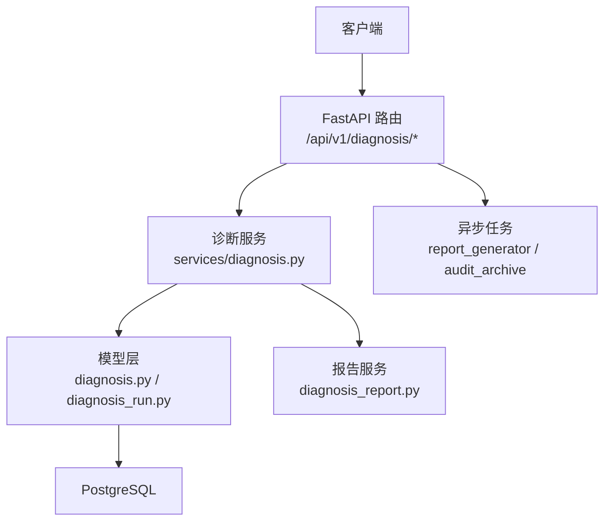
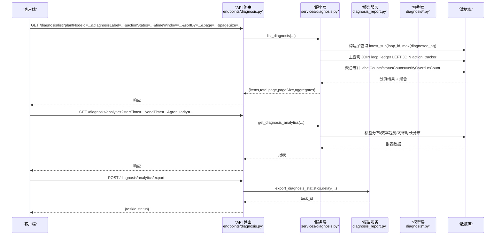
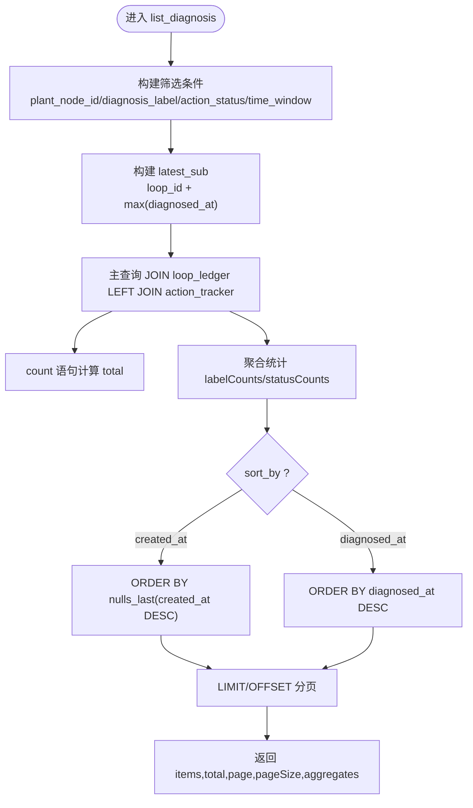
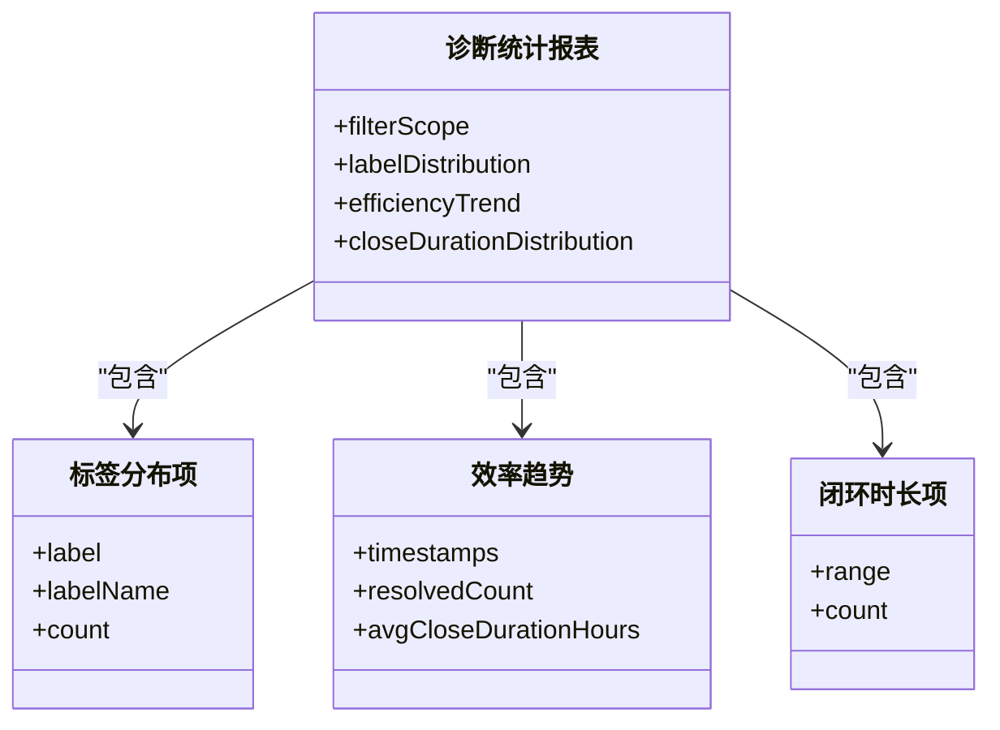
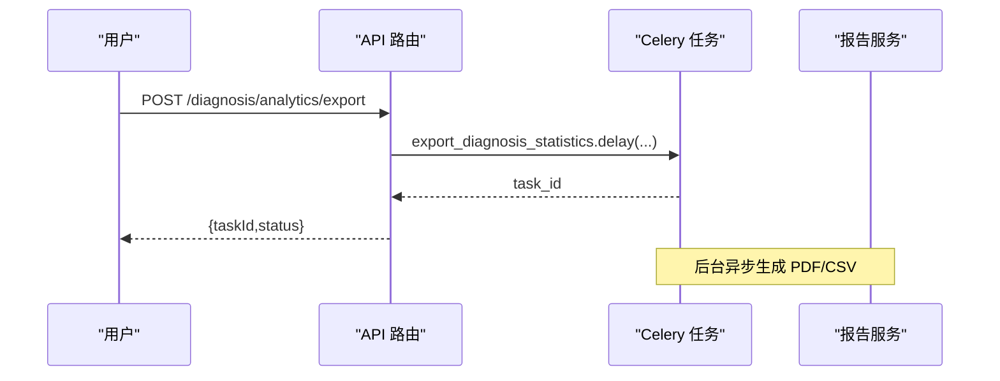
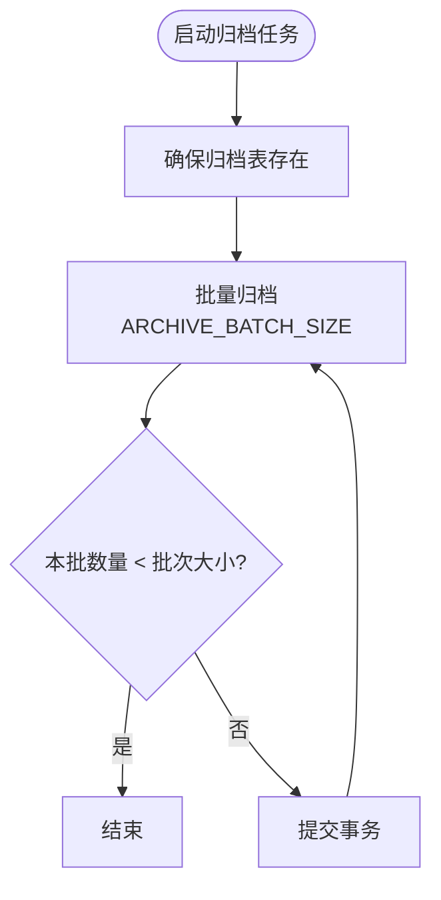
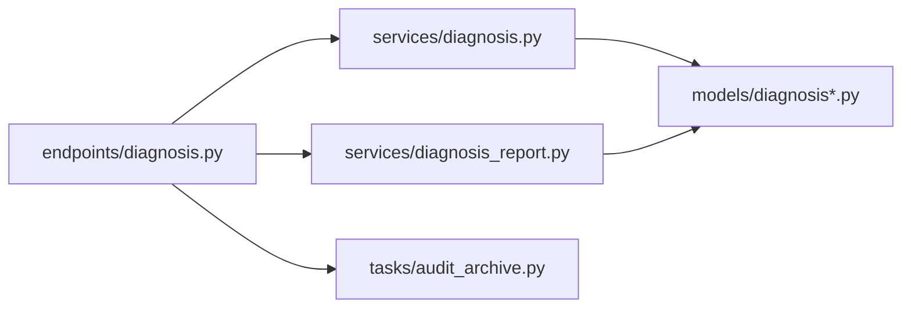

# 历史记录管理

<cite>
**本文引用的文件**
- [backend/app/models/diagnosis.py](file://backend/app/models/diagnosis.py)
- [backend/app/models/diagnosis_run.py](file://backend/app/models/diagnosis_run.py)
- [backend/app/services/diagnosis.py](file://backend/app/services/diagnosis.py)
- [backend/app/api/v1/endpoints/diagnosis.py](file://backend/app/api/v1/endpoints/diagnosis.py)
- [backend/app/schemas/diagnosis.py](file://backend/app/schemas/diagnosis.py)
- [backend/app/services/diagnosis_report.py](file://backend/app/services/diagnosis_report.py)
- [backend/app/tasks/audit_archive.py](file://backend/app/tasks/audit_archive.py)
</cite>

## 目录
1. [简介](#简介)
2. [项目结构](#项目结构)
3. [核心组件](#核心组件)
4. [架构总览](#架构总览)
5. [详细组件分析](#详细组件分析)
6. [依赖关系分析](#依赖关系分析)
7. [性能考虑](#性能考虑)
8. [故障排查指南](#故障排查指南)
9. [结论](#结论)
10. [附录](#附录)

## 简介
本技术文档聚焦“历史记录管理”，围绕诊断记录的存储结构、历史查询、统计报表、数据导出与生命周期管理展开，覆盖模型设计、索引优化、分页与多条件筛选、排序选项、闭环时长分布、CSV/Excel 导出、归档清理策略以及大数据量处理与备份恢复建议。目标是帮助读者快速理解并高效使用或扩展该模块。

## 项目结构
后端采用 FastAPI + SQLAlchemy（异步）分层架构：
- API 层：路由定义与参数校验，调用服务层
- 服务层：业务逻辑、SQL 构建、聚合统计、导出
- 模型层：ORM 模型与表结构定义
- 任务层：异步任务（如报告生成、归档清理）

**图表来源**
- [backend/app/api/v1/endpoints/diagnosis.py:1-150](file://backend/app/api/v1/endpoints/diagnosis.py#L1-L150)
- [backend/app/services/diagnosis.py:1-120](file://backend/app/services/diagnosis.py#L1-L120)
- [backend/app/models/diagnosis.py:1-120](file://backend/app/models/diagnosis.py#L1-L120)
- [backend/app/services/diagnosis_report.py:1-60](file://backend/app/services/diagnosis_report.py#L1-L60)

**章节来源**
- [backend/app/api/v1/endpoints/diagnosis.py:1-150](file://backend/app/api/v1/endpoints/diagnosis.py#L1-L150)
- [backend/app/services/diagnosis.py:1-120](file://backend/app/services/diagnosis.py#L1-L120)
- [backend/app/models/diagnosis.py:1-120](file://backend/app/models/diagnosis.py#L1-L120)
- [backend/app/services/diagnosis_report.py:1-60](file://backend/app/services/diagnosis_report.py#L1-L60)

## 核心组件
- 诊断结果模型 DiagnosisResult：记录每次诊断的标签、置信度、证据链、算法版本、诊断时间等，并提供按回路、诊断时间、任务ID的索引以支撑高频查询。
- 诊断运行模型 DiagnosisRun：MVP v2 的一次完整诊断结论，包含算子结果、融合结果、症状标签、主分类、置信度、复核状态等，提供按回路、创建时间、主分类、任务ID的索引。
- 诊断任务模型 DiagnosisTask：承载手动/自动触发任务的完整生命周期，支持归档与状态机。
- 诊断标签模型 DiagnosisTag：用于故障定位与告警，支持严重等级与状态流转。
- 诊断服务 services/diagnosis.py：实现列表分页、多条件筛选、聚合统计、可视化数据组装、详情获取等。
- 报告服务 services/diagnosis_report.py：PDF 建议书生成与 CSV 统计导出。
- API 端点 endpoints/diagnosis.py：对外暴露诊断中心相关接口，包括列表、详情、统计、导出、任务管理等。

**章节来源**
- [backend/app/models/diagnosis.py:51-201](file://backend/app/models/diagnosis.py#L51-L201)
- [backend/app/models/diagnosis_run.py:21-104](file://backend/app/models/diagnosis_run.py#L21-L104)
- [backend/app/services/diagnosis.py:373-614](file://backend/app/services/diagnosis.py#L373-L614)
- [backend/app/services/diagnosis_report.py:366-487](file://backend/app/services/diagnosis_report.py#L366-L487)
- [backend/app/api/v1/endpoints/diagnosis.py:473-531](file://backend/app/api/v1/endpoints/diagnosis.py#L473-L531)

## 架构总览
下图展示从请求到数据落库与导出的端到端流程，涵盖列表查询、统计报表与导出能力。

**图表来源**
- [backend/app/api/v1/endpoints/diagnosis.py:473-568](file://backend/app/api/v1/endpoints/diagnosis.py#L473-L568)
- [backend/app/services/diagnosis.py:373-614](file://backend/app/services/diagnosis.py#L373-L614)
- [backend/app/services/diagnosis_report.py:366-487](file://backend/app/services/diagnosis_report.py#L366-L487)

## 详细组件分析

### 诊断结果模型与索引优化
- 字段设计要点
  - 主键 id（UUID 字符串）
  - loop_id：关联回路，级联删除
  - diag_label：诊断标签（8类之一）
  - confidence：可信度（0~100），带检查约束
  - feature_values/evidence_chain：JSON/JSONB 存储特征值与证据链
  - algorithm_version/threshold_version：算法与阈值版本，便于追溯
  - diagnosed_at：诊断时间，作为主要排序与筛选维度
  - task_id：可选关联诊断任务，便于批量结果聚合
- 索引优化
  - idx_diagnosis_result_loop_id：加速按回路最新结果查询
  - idx_diagnosis_result_diagnosed：加速按诊断时间范围筛选与排序
  - idx_diagnosis_result_task_id：加速按任务聚合结果
- 复杂度与影响
  - 列表查询通过子查询取每个回路的最新诊断时间，避免全表 group by；在大数据量下显著降低 IO
  - 联合筛选（plant_node_id、diagnosis_label、action_status、time_window）通过 where 条件下推，配合索引提升过滤效率

**章节来源**
- [backend/app/models/diagnosis.py:51-87](file://backend/app/models/diagnosis.py#L51-L87)
- [backend/app/services/diagnosis.py:373-483](file://backend/app/services/diagnosis.py#L373-L483)

### 诊断运行模型（一次完整结论）
- 字段设计要点
  - loop_id、triggered_by、trigger_type（MANUAL/SCHEDULED/EVENT）
  - time_window_start/end：诊断时间窗
  - operator_group、status（RUNNING/SUCCESS/PARTIAL/FAILED）
  - data_gate/operator_results/fusion_results/symptom_tags：算子与融合结果
  - primary_category/primary_confidence/severity：主分类与严重等级
  - rationale/recommendations/evidence_charts/metric_summary：解释与建议
  - threshold_version/algorithm_version：版本可追溯
  - started_at/finished_at/duration_ms：执行耗时
  - review_status/review_results/review_comment/reviewed_by/reviewed_at：人工复核闭环
- 索引优化
  - idx_diagnosis_run_loop_created：按回路+创建时间查询
  - idx_diagnosis_run_category：按主分类聚合
  - idx_diagnosis_run_task：按任务聚合

**章节来源**
- [backend/app/models/diagnosis_run.py:21-104](file://backend/app/models/diagnosis_run.py#L21-L104)

### 历史查询功能（分页、多条件筛选、排序）
- 分页查询
  - 参数：page、pageSize（默认20，最大100）
  - 返回：items、total、page、pageSize、aggregates
- 多条件筛选
  - plant_node_id：按装置/单元筛选（基于 LoopLedger.unit_id）
  - diagnosis_label：按诊断标签筛选
  - action_status：按处理状态筛选（ActionTracker.action_status）
  - time_window：last_24_hours/last_7_days/last_30_days（内部转换为时间范围）
  - loop_ids：批量筛选（将过滤下推到子查询，减少 group by 扫描）
- 排序选项
  - diagnosed_at：默认按诊断时间降序
  - created_at：按 tracker 建单时间降序（nulls_last），用于工作台“最近建单”
- 聚合统计
  - statusCounts：按处理状态分组计数
  - labelCounts：按诊断标签分组计数
  - verifyOverdueCount：VERIFYING 超 24h 未闭环的条目数

**图表来源**
- [backend/app/services/diagnosis.py:373-614](file://backend/app/services/diagnosis.py#L373-L614)

**章节来源**
- [backend/app/services/diagnosis.py:373-614](file://backend/app/services/diagnosis.py#L373-L614)
- [backend/app/api/v1/endpoints/diagnosis.py:473-506](file://backend/app/api/v1/endpoints/diagnosis.py#L473-L506)
- [backend/app/schemas/diagnosis.py:309-368](file://backend/app/schemas/diagnosis.py#L309-L368)

### 统计报表功能（标签分布、处理状态、超期条目、闭环时长分布）
- 标签分布统计
  - 按诊断标签分组计数，支持按装置/单元、标签、处理状态筛选
- 处理状态统计
  - 按 ActionTracker.action_status 分组计数
- 超期条目计数
  - VERIFYING 状态且 updated_at 超过 24h 的条目数
- 闭环时长分布
  - 分档：0-24h、24-72h、72h+（小时）
- 效率趋势
  - 按粒度（hour/day/week/month）统计 resolvedCount 与 avgCloseDurationHours

**图表来源**
- [backend/app/schemas/diagnosis.py:588-633](file://backend/app/schemas/diagnosis.py#L588-L633)

**章节来源**
- [backend/app/services/diagnosis.py:373-614](file://backend/app/services/diagnosis.py#L373-L614)
- [backend/app/schemas/diagnosis.py:588-633](file://backend/app/schemas/diagnosis.py#L588-L633)

### 数据导出功能（CSV/Excel、批量导出、数据脱敏）
- CSV 导出
  - 接口：GET /diagnosis/statistics/export
  - 内容：标签分布汇总、按天趋势、分布统计指标
  - 编码：UTF-8 with BOM，便于 Excel 直接打开中文
- 异步 PDF/CSV 导出
  - 接口：POST /diagnosis/analytics/export
  - 行为：提交 Celery 异步任务，返回 taskId；可通过任务查询接口获取状态
- 批量导出
  - 支持按时间范围与装置节点批量导出统计
- 数据脱敏
  - 当前导出内容主要为统计与元数据，不包含敏感个人信息；如需扩展至明细导出，建议在服务层增加字段白名单与脱敏规则（例如掩码用户标识）

**图表来源**
- [backend/app/api/v1/endpoints/diagnosis.py:533-568](file://backend/app/api/v1/endpoints/diagnosis.py#L533-L568)
- [backend/app/services/diagnosis_report.py:366-487](file://backend/app/services/diagnosis_report.py#L366-L487)

**章节来源**
- [backend/app/api/v1/endpoints/diagnosis.py:576-601](file://backend/app/api/v1/endpoints/diagnosis.py#L576-L601)
- [backend/app/services/diagnosis_report.py:366-487](file://backend/app/services/diagnosis_report.py#L366-L487)

### 历史数据的生命周期管理（保留策略、归档机制、清理规则）
- 诊断任务归档
  - 终态任务（SUCCESS/FAILED/CANCELLED）可归档，归档后从任务列表移入诊断记录
  - 支持 includeArchived/archivedOnly 控制任务列表显示范围
- 审计日志归档与清理
  - 定时任务 archive_audit_logs 将超过 retention_days 天的审计日志迁移至归档表
  - 批次化执行，当一批数量小于批次大小时结束循环
- 建议的数据保留策略
  - 诊断结果与运行记录：根据业务需求设定保留周期（如 180 天热数据 + 冷数据归档）
  - 标签与任务：结合归档策略进行冷热分离
  - 配置变更审批流：长期保留以满足合规审计

**图表来源**
- [backend/app/tasks/audit_archive.py:102-127](file://backend/app/tasks/audit_archive.py#L102-L127)

**章节来源**
- [backend/app/api/v1/endpoints/diagnosis.py:672-709](file://backend/app/api/v1/endpoints/diagnosis.py#L672-L709)
- [backend/app/tasks/audit_archive.py:102-127](file://backend/app/tasks/audit_archive.py#L102-L127)

## 依赖关系分析
- API 路由依赖服务层方法，服务层依赖模型与数据库会话
- 报告服务依赖诊断服务中的标签名称映射与模型
- 任务层通过 Celery 异步执行导出与归档任务

**图表来源**
- [backend/app/api/v1/endpoints/diagnosis.py:1-150](file://backend/app/api/v1/endpoints/diagnosis.py#L1-L150)
- [backend/app/services/diagnosis.py:1-120](file://backend/app/services/diagnosis.py#L1-L120)
- [backend/app/services/diagnosis_report.py:1-60](file://backend/app/services/diagnosis_report.py#L1-L60)
- [backend/app/tasks/audit_archive.py:102-127](file://backend/app/tasks/audit_archive.py#L102-L127)

**章节来源**
- [backend/app/api/v1/endpoints/diagnosis.py:1-150](file://backend/app/api/v1/endpoints/diagnosis.py#L1-L150)
- [backend/app/services/diagnosis.py:1-120](file://backend/app/services/diagnosis.py#L1-L120)
- [backend/app/services/diagnosis_report.py:1-60](file://backend/app/services/diagnosis_report.py#L1-L60)
- [backend/app/tasks/audit_archive.py:102-127](file://backend/app/tasks/audit_archive.py#L102-L127)

## 性能考虑
- 查询优化
  - 使用子查询 latest_sub 取每个回路的最新诊断时间，避免全表 group by
  - 对 loop_id、diagnosed_at、task_id 建立索引，提升过滤与排序效率
  - 支持 loop_ids 批量筛选，将过滤下推到子查询，减少扫描范围
- 大数据量处理
  - 分页限制 pageSize 最大 100，防止过大页面导致内存压力
  - 统计报表支持按粒度聚合，降低单次查询数据量
  - 导出任务异步化，避免阻塞请求线程
- 缓存与降级
  - 可在服务层引入 Redis 缓存热点统计结果（如近 24h 标签分布）
  - 超时保护：对慢查询设置超时与重试策略
- 备份与恢复
  - 定期全量备份 PostgreSQL 数据库（含 JSON/JSONB 字段）
  - 增量备份结合 WAL 归档，缩短恢复时间
  - 归档表与热表分离，便于冷热数据分别备份

[本节为通用性能指导，不直接分析具体文件]

## 故障排查指南
- 常见问题
  - 列表为空：检查筛选条件是否过严（plant_node_id、diagnosis_label、action_status、time_window）
  - 排序异常：确认 sortBy 是否为 allowed 值（diagnosed_at/created_at），created_at 时注意 nulls_last
  - 导出失败：确认时间范围格式为 ISO 8601，CSV 编码 UTF-8 with BOM
  - 归档任务无效果：检查 retention_days 配置与归档表是否存在
- 调试建议
  - 打印 SQL 语句与绑定参数，验证索引命中
  - 查看 Celery 任务日志，确认异步任务执行状态
  - 核对模型字段类型与时区（naive vs aware datetime）

**章节来源**
- [backend/app/services/diagnosis.py:373-614](file://backend/app/services/diagnosis.py#L373-L614)
- [backend/app/services/diagnosis_report.py:490-505](file://backend/app/services/diagnosis_report.py#L490-L505)
- [backend/app/tasks/audit_archive.py:102-127](file://backend/app/tasks/audit_archive.py#L102-L127)

## 结论
本模块通过清晰的模型设计与索引优化，实现了高效的历史记录查询与统计报表能力；借助异步导出与归档清理，保障了系统在大数据量场景下的稳定性与可维护性。建议在生产环境结合缓存、备份与监控策略，进一步提升性能与可靠性。

[本节为总结性内容，不直接分析具体文件]

## 附录
- 关键接口清单
  - GET /diagnosis/list：诊断列表（分页 + 筛选）
  - GET /diagnosis/{loopId}：诊断详情
  - GET /diagnosis/analytics：统计报表
  - POST /diagnosis/analytics/export：异步导出
  - GET /diagnosis/statistics/export：CSV 导出
  - POST /diagnosis/trigger：触发诊断任务
  - GET /diagnosis/tasks：任务列表（支持归档过滤）
- 数据模型清单
  - DiagnosisResult、DiagnosisRun、DiagnosisTask、DiagnosisTag
- 常用筛选与排序
  - 筛选：plant_node_id、diagnosis_label、action_status、time_window、loop_ids
  - 排序：diagnosed_at（默认）、created_at

[本节为补充信息，不直接分析具体文件]