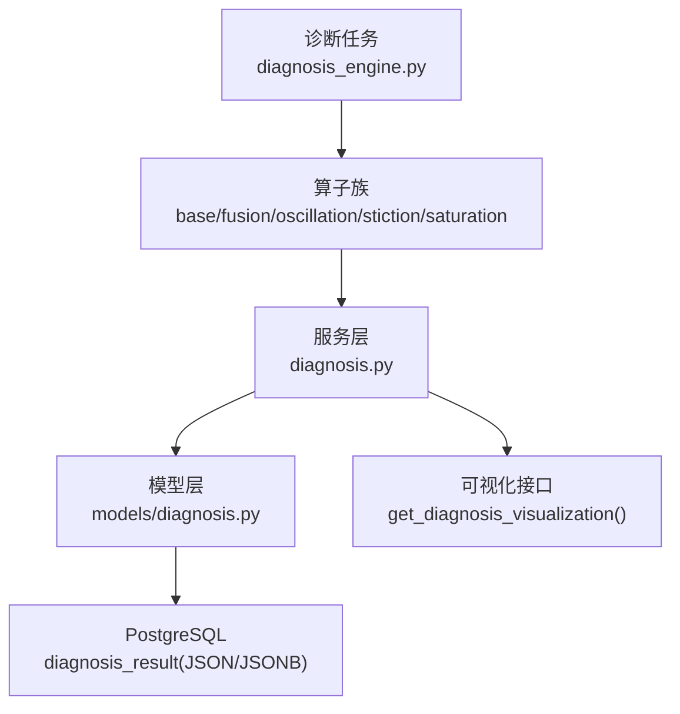
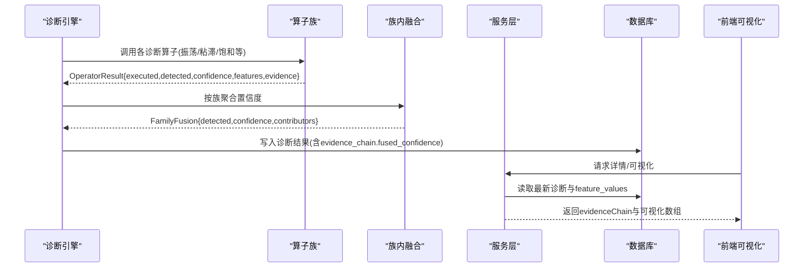
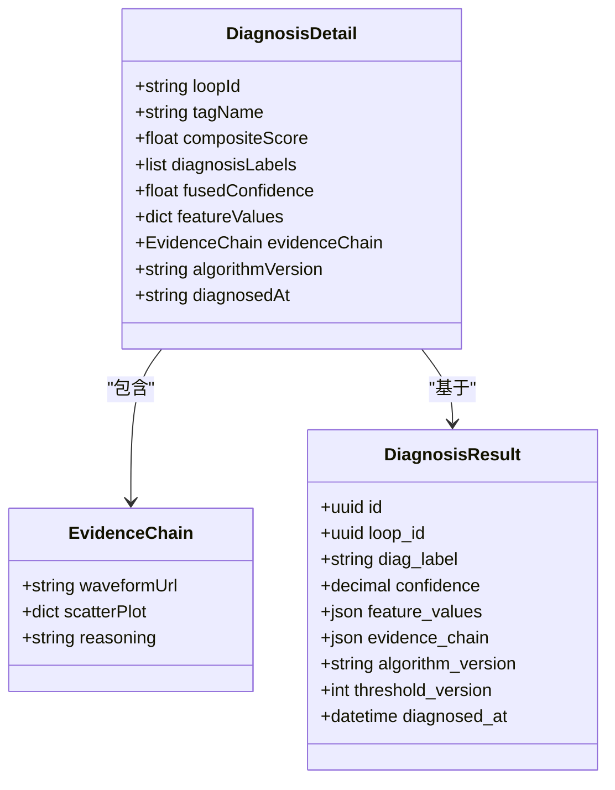
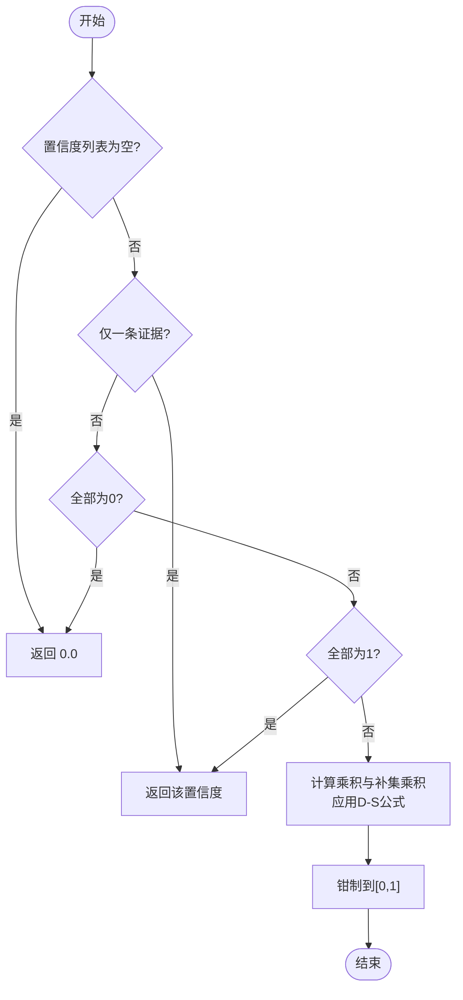
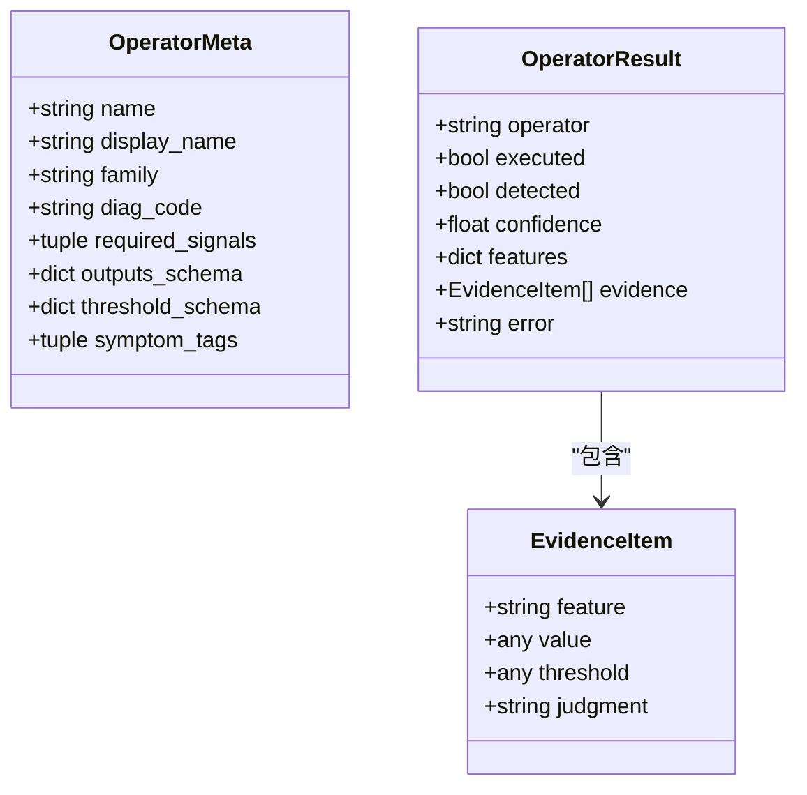
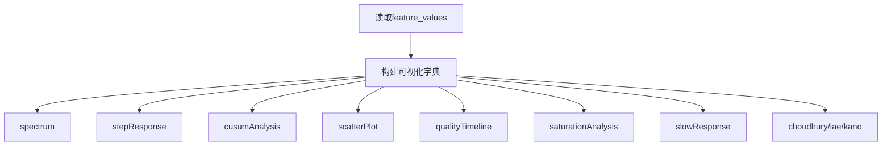
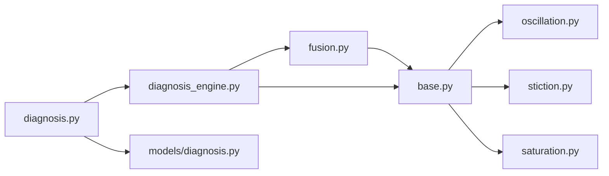

# 证据链分析

<cite>
**本文引用的文件**
- [backend/app/models/diagnosis.py](file://backend/app/models/diagnosis.py)
- [backend/app/schemas/diagnosis.py](file://backend/app/schemas/diagnosis.py)
- [backend/app/services/diagnosis.py](file://backend/app/services/diagnosis.py)
- [backend/app/tasks/diagnosis_engine.py](file://backend/app/tasks/diagnosis_engine.py)
- [backend/app/services/diagnosis_operators/base.py](file://backend/app/services/diagnosis_operators/base.py)
- [backend/app/services/diagnosis_operators/fusion.py](file://backend/app/services/diagnosis_operators/fusion.py)
- [backend/app/services/diagnosis_operators/oscillation.py](file://backend/app/services/diagnosis_operators/oscillation.py)
- [backend/app/services/diagnosis_operators/stiction.py](file://backend/app/services/diagnosis_operators/stiction.py)
- [backend/app/services/diagnosis_operators/saturation.py](file://backend/app/services/diagnosis_operators/saturation.py)
- [db/postgresql/01_schema.sql](file://db/postgresql/01_schema.sql)
- [backend/tests/test_diagnosis_engine.py](file://backend/tests/test_diagnosis_engine.py)
- [backend/tests/test_diagnosis.py](file://backend/tests/test_diagnosis.py)
- [backend/tests/test_diagnosis_maintenance.py](file://backend/tests/test_diagnosis_maintenance.py)
</cite>

## 目录
1. [简介](#简介)
2. [项目结构](#项目结构)
3. [核心组件](#核心组件)
4. [架构总览](#架构总览)
5. [详细组件分析](#详细组件分析)
6. [依赖关系分析](#依赖关系分析)
7. [性能考虑](#性能考虑)
8. [故障排查指南](#故障排查指南)
9. [结论](#结论)
10. [附录](#附录)

## 简介
本技术文档围绕“证据链分析”展开，系统性说明证据链的数据结构设计、融合置信度计算、推理过程记录、证据收集与标准化、可视化展示字段、存储格式、查询优化、历史追溯、完整性验证、异常数据处理以及渲染指南。目标是让非专业读者也能理解证据链从采集到落库再到前端可视化的全链路。

## 项目结构
证据链相关能力分布在模型层、服务层、算子族、任务引擎与数据库脚本中：
- 模型层：定义诊断结果表结构与关键字段（含 evidence_chain JSON）。
- 服务层：组装详情与可视化数据，构造证据链对象，聚合多标签特征值。
- 算子族：各诊断算子输出标准化的证据项、置信度与特征值。
- 任务引擎：执行诊断流程，写入每条标签对应的诊断结果记录，并持久化 fused_confidence。
- 数据库：提供 diagnosis_result 表的 JSONB/JSON 列用于存储证据链与特征值。

图表来源
- [backend/app/tasks/diagnosis_engine.py:1718-1742](file://backend/app/tasks/diagnosis_engine.py#L1718-L1742)
- [backend/app/services/diagnosis.py:700-827](file://backend/app/services/diagnosis.py#L700-L827)
- [backend/app/models/diagnosis.py:51-87](file://backend/app/models/diagnosis.py#L51-L87)
- [db/postgresql/01_schema.sql:604-618](file://db/postgresql/01_schema.sql#L604-L618)

章节来源
- [backend/app/models/diagnosis.py:51-87](file://backend/app/models/diagnosis.py#L51-L87)
- [db/postgresql/01_schema.sql:604-618](file://db/postgresql/01_schema.sql#L604-L618)

## 核心组件
- 证据链数据结构：EvidenceChain 包含 waveformUrl、scatterPlot、reasoning；详情响应 DiagnosisDetail 将证据链作为顶层字段返回。
- 融合置信度：fused_confidence 由同族算子的置信度经 D-S 公式融合得到，并在每条诊断结果记录的 evidence_chain 中持久化。
- 推理记录：reasoning 来自主标签证据中的 reasoning 字段，用于解释判定依据。
- 可视化数据：spectrum、stepResponse、cusumAnalysis、scatterPlot、qualityTimeline、saturationAnalysis、slowResponse 等通过 feature_values 聚合后统一输出。

章节来源
- [backend/app/schemas/diagnosis.py:389-408](file://backend/app/schemas/diagnosis.py#L389-L408)
- [backend/app/services/diagnosis.py:700-827](file://backend/app/services/diagnosis.py#L700-L827)
- [backend/app/tasks/diagnosis_engine.py:1718-1742](file://backend/app/tasks/diagnosis_engine.py#L1718-L1742)

## 架构总览
证据链从算子产出到前端展示的完整流程如下：

图表来源
- [backend/app/tasks/diagnosis_engine.py:1718-1742](file://backend/app/tasks/diagnosis_engine.py#L1718-L1742)
- [backend/app/services/diagnosis_operators/fusion.py:16-96](file://backend/app/services/diagnosis_operators/fusion.py#L16-L96)
- [backend/app/services/diagnosis.py:700-827](file://backend/app/services/diagnosis.py#L700-L827)

## 详细组件分析

### 证据链数据结构与存储
- 模型层：DiagnosisResult.evidence_chain 为 JSON 字段，承载单条标签的证据链。
- Schema 层：EvidenceChain 定义 waveformUrl、scatterPlot、reasoning；DiagnosisDetail 包含 evidenceChain。
- 存储策略：每个标签一条诊断结果记录，主标签承载主要可视化数组，其他标签仅保留标量特征以减少体积；查询时合并 feature_values 以补齐全部可视化键。

图表来源
- [backend/app/schemas/diagnosis.py:389-408](file://backend/app/schemas/diagnosis.py#L389-L408)
- [backend/app/models/diagnosis.py:51-87](file://backend/app/models/diagnosis.py#L51-L87)

章节来源
- [backend/app/schemas/diagnosis.py:389-408](file://backend/app/schemas/diagnosis.py#L389-L408)
- [backend/app/models/diagnosis.py:51-87](file://backend/app/models/diagnosis.py#L51-L87)
- [db/postgresql/01_schema.sql:604-618](file://db/postgresql/01_schema.sql#L604-L618)

### 融合置信度计算（D-S 公式）
- 族内融合：同一症状假设的多个算子置信度进行 D-S 融合，避免跨族融合。
- 公式：C_fused = (Π cᵢ) / (Π cᵢ + Π (1-cᵢ))，引入 epsilon 防止极端值导致信息丢失。
- 特判：空列表→0；单条→原值；全0→0；全1→1。
- 持久化：每条诊断结果记录的 evidence_chain 必须携带 fused_confidence，保证列表/详情/可视化端点可读取。

图表来源
- [backend/app/services/diagnosis_operators/fusion.py:16-39](file://backend/app/services/diagnosis_operators/fusion.py#L16-L39)
- [backend/app/tasks/diagnosis_engine.py:3950-3983](file://backend/app/tasks/diagnosis_engine.py#L3950-L3983)

章节来源
- [backend/app/services/diagnosis_operators/fusion.py:16-96](file://backend/app/services/diagnosis_operators/fusion.py#L16-L96)
- [backend/app/tasks/diagnosis_engine.py:3950-3983](file://backend/app/tasks/diagnosis_engine.py#L3950-L3983)
- [backend/tests/test_diagnosis_engine.py:4394-4453](file://backend/tests/test_diagnosis_engine.py#L4394-L4453)

### 推理过程记录（reasoning）
- reasoning 来源于主标签证据中的 reasoning 字段，用于解释判定依据。
- 服务层在构建证据链时将 reasoning 放入 evidenceChain.reasoning，便于前端展示。

章节来源
- [backend/app/services/diagnosis.py:700-738](file://backend/app/services/diagnosis.py#L700-L738)
- [backend/app/schemas/diagnosis.py:389-394](file://backend/app/schemas/diagnosis.py#L389-L394)

### 证据收集机制与标准化
- 算子契约：OperatorResult 统一输出 executed、detected、confidence、features、evidence 等字段。
- 证据项：EvidenceItem 包含 feature、value、threshold、judgment，用于展示单条证据的指标、阈值与判定结论。
- 权重分配：同族算子命中后参与融合；未执行或未命中的算子不参与融合。
- 冲突解决：D-S 融合天然处理冲突（如高置信与低置信并存时趋近中性），并通过 contributors 记录贡献者。

图表来源
- [backend/app/services/diagnosis_operators/base.py:29-85](file://backend/app/services/diagnosis_operators/base.py#L29-L85)

章节来源
- [backend/app/services/diagnosis_operators/base.py:29-85](file://backend/app/services/diagnosis_operators/base.py#L29-L85)
- [backend/app/services/diagnosis_operators/fusion.py:64-96](file://backend/app/services/diagnosis_operators/fusion.py#L64-L96)

### 可视化展示字段
- spectrum：频率与幅值序列、峰值频率、振幅、振荡指数。
- stepResponse：阶跃响应的时序、PV响应、SP值、阶跃索引、超调、衰减比、稳态误差。
- cusumAnalysis：CUSUM正负序列、跳变点、阈值、跳变次数、最大CUSUM。
- scatterPlot：PV-OP散点坐标、拟合得分、粘滞指数。
- qualityTimeline：坏率、总点数、坏点数、质量模式。
- saturationAnalysis：饱和率、高/低饱和计数。
- slowResponse：时间常数、期望时间常数、比值。
- 其他：choudhury、iaeAnalysis、kano 等扩展分析。

图表来源
- [backend/app/services/diagnosis.py:750-827](file://backend/app/services/diagnosis.py#L750-L827)

章节来源
- [backend/app/services/diagnosis.py:750-827](file://backend/app/services/diagnosis.py#L750-L827)
- [backend/tests/test_diagnosis.py:2014-2088](file://backend/tests/test_diagnosis.py#L2014-L2088)

### 存储格式、查询优化与历史追溯
- 存储格式：diagnosis_result 表使用 JSON/JSONB 存储 feature_values 与 evidence_chain。
- 查询优化：
  - 主标签记录承载主要可视化数组，非主标签仅存标量，减少冗余。
  - 详情/可视化端点按回路聚合并集读取 feature_values，对外输出结构不变。
- 历史追溯：
  - 每条记录带 diagnosed_at、algorithm_version、threshold_version，支持回溯当时配置与算法版本。
  - 维护任务定期清理过期证据，每回路仅保留最新一条，避免膨胀。

章节来源
- [backend/app/tasks/diagnosis_engine.py:1718-1742](file://backend/app/tasks/diagnosis_engine.py#L1718-L1742)
- [backend/tests/test_diagnosis_engine.py:3821-3846](file://backend/tests/test_diagnosis_engine.py#L3821-L3846)
- [backend/tests/test_diagnosis_maintenance.py:1-50](file://backend/tests/test_diagnosis_maintenance.py#L1-L50)

### 完整性验证与异常数据处理
- 完整性验证：
  - 列表/详情/可视化端点断言关键键存在（如 spectrum、stepResponse、cusumAnalysis、scatterPlot、qualityTimeline、saturationAnalysis、slowResponse 等）。
  - fused_confidence 必须写入每条记录的 evidence_chain。
- 异常处理：
  - 算子捕获异常并返回空结果或默认值，确保编排稳定。
  - 数据不足或输入缺失时标记 executed=False 并给出 skip_reason。
  - 维护任务清理过期证据，保障系统健康。

章节来源
- [backend/tests/test_diagnosis.py:2014-2088](file://backend/tests/test_diagnosis.py#L2014-L2088)
- [backend/tests/test_diagnosis_engine.py:4394-4453](file://backend/tests/test_diagnosis_engine.py#L4394-L4453)
- [backend/app/services/diagnosis_operators/oscillation.py:118-120](file://backend/app/services/diagnosis_operators/oscillation.py#L118-L120)
- [backend/app/services/diagnosis_operators/stiction.py:110-112](file://backend/app/services/diagnosis_operators/stiction.py#L110-L112)
- [backend/app/services/diagnosis_operators/saturation.py:108-116](file://backend/app/services/diagnosis_operators/saturation.py#L108-L116)

### 可视化渲染指南
- waveformUrl：详情服务生成波形查询链接，前端据此拉取时序数据。
- scatterPlot：优先使用证据链中的 scatterPlot；若缺失则回退到 feature_values 中的散点坐标。
- 其他可视化数组：直接从 feature_values 映射至对应键，前端按标准结构渲染。

章节来源
- [backend/app/services/diagnosis.py:700-738](file://backend/app/services/diagnosis.py#L700-L738)
- [backend/app/services/diagnosis.py:750-827](file://backend/app/services/diagnosis.py#L750-L827)

## 依赖关系分析
- 算子族依赖 base 定义的元数据与结果契约。
- 融合模块依赖算子族输出的置信度集合。
- 服务层依赖模型层与数据库，负责组装详情与可视化。
- 任务引擎驱动算子执行与融合，并持久化结果。

图表来源
- [backend/app/services/diagnosis_operators/base.py:29-85](file://backend/app/services/diagnosis_operators/base.py#L29-L85)
- [backend/app/services/diagnosis_operators/fusion.py:16-96](file://backend/app/services/diagnosis_operators/fusion.py#L16-L96)
- [backend/app/tasks/diagnosis_engine.py:1718-1742](file://backend/app/tasks/diagnosis_engine.py#L1718-L1742)
- [backend/app/services/diagnosis.py:700-827](file://backend/app/services/diagnosis.py#L700-L827)

章节来源
- [backend/app/services/diagnosis_operators/base.py:29-85](file://backend/app/services/diagnosis_operators/base.py#L29-L85)
- [backend/app/services/diagnosis_operators/fusion.py:16-96](file://backend/app/services/diagnosis_operators/fusion.py#L16-L96)
- [backend/app/tasks/diagnosis_engine.py:1718-1742](file://backend/app/tasks/diagnosis_engine.py#L1718-L1742)
- [backend/app/services/diagnosis.py:700-827](file://backend/app/services/diagnosis.py#L700-L827)

## 性能考虑
- 证据瘦身：主标签承载数组，非主标签仅存标量，显著降低存储与传输体积。
- 并行算子：各算子无状态、纯计算，适合并发执行。
- 融合开销：D-S 融合为 O(n)，n 为同族命中算子数，通常很小。
- 查询合并：按回路聚合 feature_values，避免重复读取大数组。

## 故障排查指南
- 证据链为空或缺失：检查算子是否 executed=True 且 detected=True；确认融合逻辑是否正确收集置信度。
- fused_confidence 为 null：确认任务引擎已将融合结果写入 evidence_chain；参考测试用例断言。
- 可视化数组缺失：确认主标签记录包含相应 feature_values 键；检查服务层映射逻辑。
- 数据不足或异常：查看算子返回的 skip_reason 或 error；检查输入信号长度与质量码。

章节来源
- [backend/tests/test_diagnosis_engine.py:4394-4453](file://backend/tests/test_diagnosis_engine.py#L4394-L4453)
- [backend/app/services/diagnosis_operators/base.py:69-85](file://backend/app/services/diagnosis_operators/base.py#L69-L85)
- [backend/app/services/diagnosis.py:700-827](file://backend/app/services/diagnosis.py#L700-L827)

## 结论
证据链体系通过统一的算子契约、族内 D-S 融合、结构化存储与可视化聚合，实现了从数据采集到前端展示的可追溯、可解释、可扩展的诊断闭环。通过证据瘦身与查询合并优化了性能，结合完整性验证与异常处理保障了稳定性。建议持续完善算子族覆盖范围与阈值自适应能力，进一步提升诊断准确性与可维护性。

## 附录
- 关键术语：
  - 证据链：单次诊断中支撑结论的证据集合，包含波形链接、散点图、推理文本等。
  - 融合置信度：同族算子置信度的综合评估值。
  - 可视化数组：频谱、阶跃响应、CUSUM、散点、质量时间线、饱和分析、迟缓响应等数据块。
- 参考实现路径：
  - 融合公式：fusion.py 与 diagnosis_engine.py 中的实现。
  - 证据链构造：diagnosis.py 的服务层组装。
  - 存储结构：models/diagnosis.py 与 schema SQL。