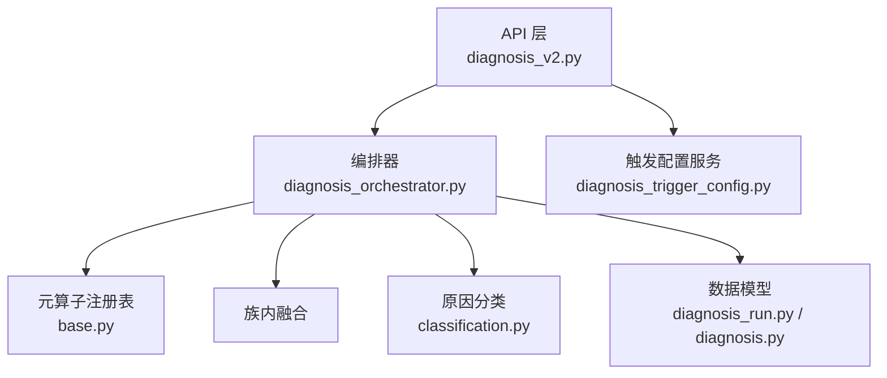
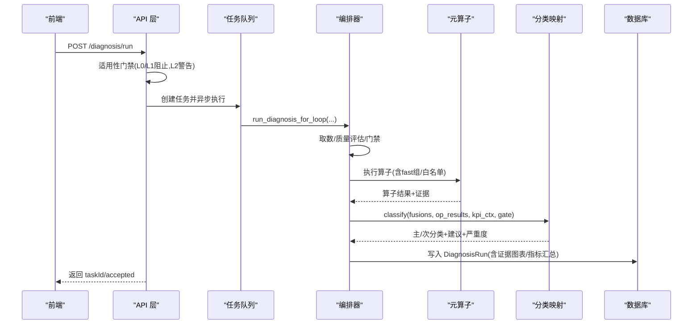
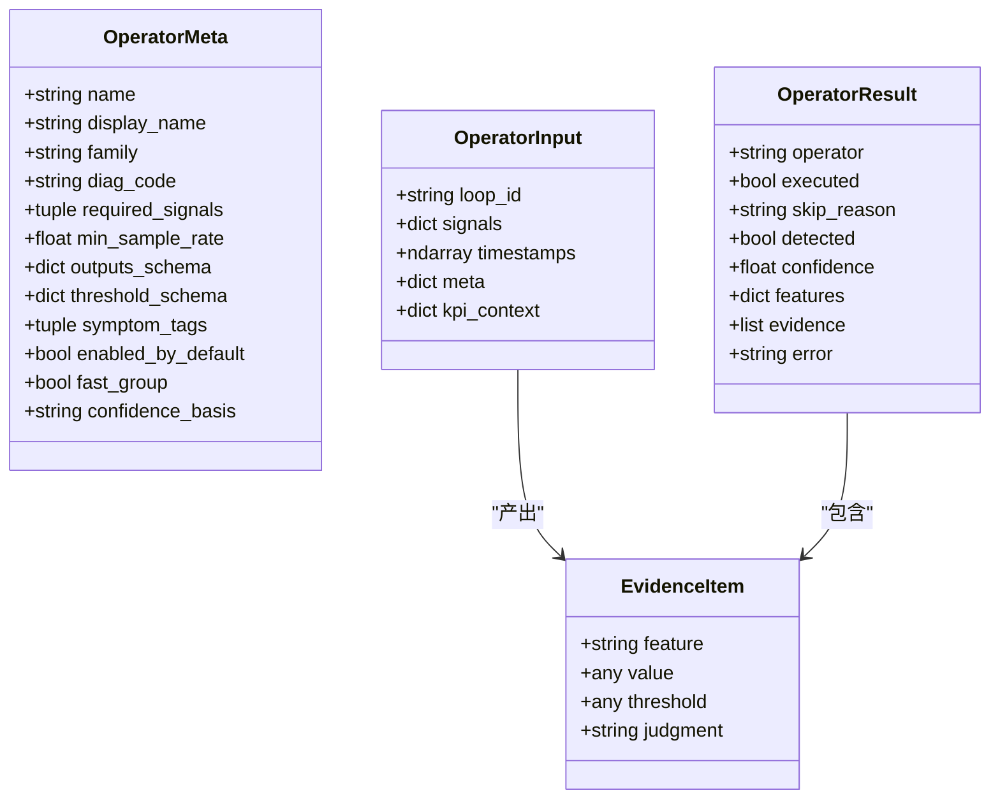
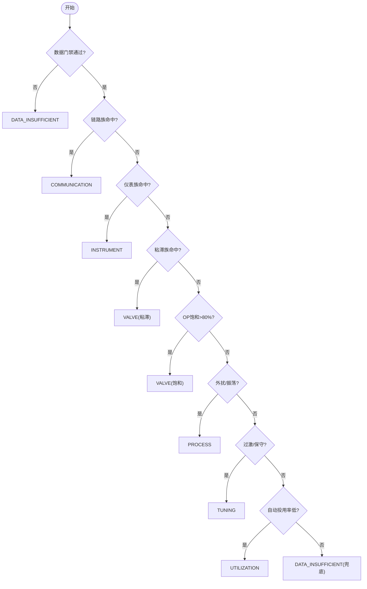
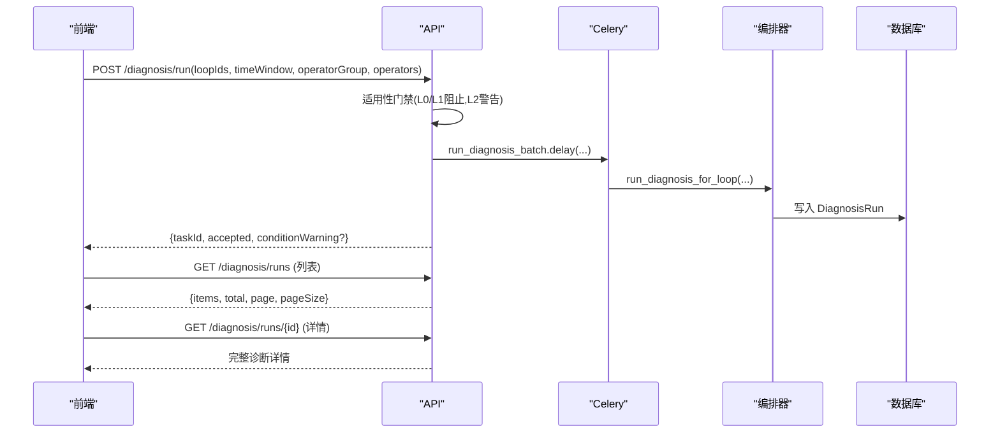
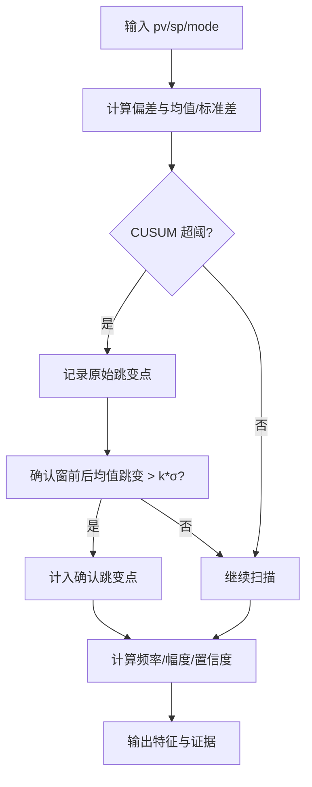
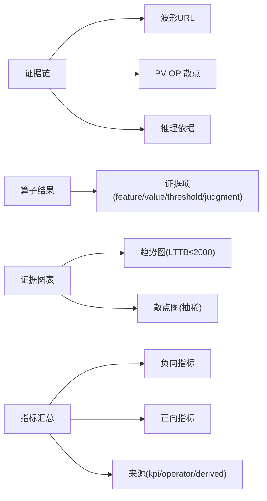
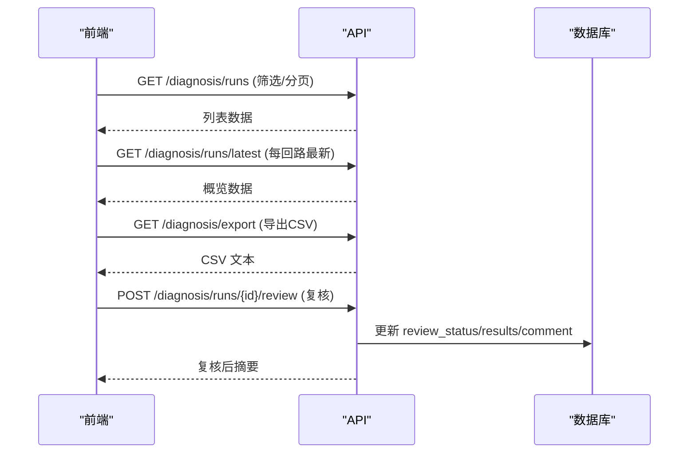
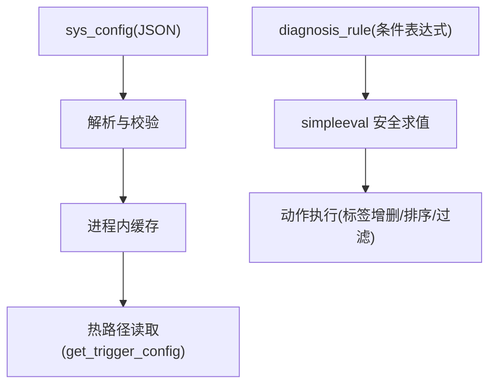
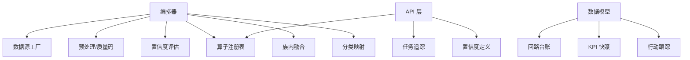

# 诊断中心模块

<cite>
**本文引用的文件**
- [backend/app/services/diagnosis_operators/base.py](file://backend/app/services/diagnosis_operators/base.py)
- [backend/app/services/diagnosis_operators/classification.py](file://backend/app/services/diagnosis_operators/classification.py)
- [backend/app/services/diagnosis_operators/disturbance.py](file://backend/app/services/diagnosis_operators/disturbance.py)
- [backend/app/services/diagnosis_operators/saturation.py](file://backend/app/services/diagnosis_operators/saturation.py)
- [backend/app/services/diagnosis_orchestrator.py](file://backend/app/services/diagnosis_orchestrator.py)
- [backend/app/models/diagnosis_run.py](file://backend/app/models/diagnosis_run.py)
- [backend/app/models/diagnosis.py](file://backend/app/models/diagnosis.py)
- [backend/app/api/v1/endpoints/diagnosis_v2.py](file://backend/app/api/v1/endpoints/diagnosis_v2.py)
- [backend/app/services/diagnosis_trigger_config.py](file://backend/app/services/diagnosis_trigger_config.py)
</cite>

## 目录
1. [简介](#简介)
2. [项目结构](#项目结构)
3. [核心组件](#核心组件)
4. [架构总览](#架构总览)
5. [详细组件分析](#详细组件分析)
6. [依赖关系分析](#依赖关系分析)
7. [性能考量](#性能考量)
8. [故障排查指南](#故障排查指南)
9. [结论](#结论)
10. [附录](#附录)

## 简介
本技术文档聚焦“诊断中心模块”，围绕诊断引擎的元算子架构、6+1 原因分类体系、证据污染链、诊断结果解读机制展开，并详细说明诊断工作台的发起流程与两页式 IA（列表/详情）设计、适用性门禁检查（L0/L1 阻止、L2 条件警告）。同时阐述诊断算子的可扩展机制（base.py 基类与 classification/disturbance/saturation 等具体算子）、证据链数据结构与可视化展示、诊断记录的历史查询与导出、审核流程，以及诊断触发配置的 DSL 语法与规则引擎集成方式。最后提供诊断算子开发指南与调试方法。

## 项目结构
诊断中心由 API 层、编排器、元算子族、分类映射层、数据模型与配置服务构成：
- API 层：暴露诊断运行、记录查询、算子注册表、导出、复核与处置建议等接口。
- 编排器：负责取数、质量预处理、数据门禁、算子执行、族内融合、原因分类、指标汇总与落库。
- 元算子族：以 base.py 定义统一契约与注册表；classification 实现 6+1 原因分类；disturbance/saturation 等为具体检测算子。
- 数据模型：diagnosis_run 为一次完整诊断记录；diagnosis 包含旧版结果、任务、标签、规则与阈值覆盖等。
- 配置服务：诊断触发条件通过 sys_config 存储与进程缓存，支持热更新。

**图示来源**
- [backend/app/api/v1/endpoints/diagnosis_v2.py:190-312](file://backend/app/api/v1/endpoints/diagnosis_v2.py#L190-L312)
- [backend/app/services/diagnosis_orchestrator.py:546-789](file://backend/app/services/diagnosis_orchestrator.py#L546-L789)
- [backend/app/services/diagnosis_operators/base.py:29-137](file://backend/app/services/diagnosis_operators/base.py#L29-L137)
- [backend/app/services/diagnosis_operators/classification.py:190-461](file://backend/app/services/diagnosis_operators/classification.py#L190-L461)
- [backend/app/models/diagnosis_run.py:21-103](file://backend/app/models/diagnosis_run.py#L21-L103)
- [backend/app/models/diagnosis.py:29-357](file://backend/app/models/diagnosis.py#L29-L357)
- [backend/app/services/diagnosis_trigger_config.py:44-118](file://backend/app/services/diagnosis_trigger_config.py#L44-L118)

**章节来源**
- [backend/app/api/v1/endpoints/diagnosis_v2.py:1-12](file://backend/app/api/v1/endpoints/diagnosis_v2.py#L1-L12)
- [backend/app/services/diagnosis_orchestrator.py:1-7](file://backend/app/services/diagnosis_orchestrator.py#L1-L7)

## 核心组件
- 元算子契约与注册表：定义 OperatorMeta、OperatorInput、OperatorResult、EvidenceItem，并提供装饰器注册与序列化能力。
- 原因分类映射层：基于症状级融合结果与 KPI 上下文，按决策表输出主分类、次分类、待复核项、判定依据与建议。
- 外扰族算子：基于 CUSUM 的偏差突变检测，输出频率、幅度等特征。
- 饱和族算子：统计自控模式下 OP 贴限位的比例，判断阀容量或积分饱和。
- 编排器：端到端流水线，串联取数、质量评估、门禁、算子执行、融合、分类、快照与落库。
- 数据模型：DiagnosisRun 承载一次完整诊断结论；DiagnosisTask/DiagnosisResult/DiagnosisTag/DiagnosisRule/DiagnosisThresholdOverride 支撑历史、标签、规则与阈值覆盖。
- 触发配置：通过 sys_config 存储 JSON 配置，进程内缓存，支持热加载。

**章节来源**
- [backend/app/services/diagnosis_operators/base.py:29-137](file://backend/app/services/diagnosis_operators/base.py#L29-L137)
- [backend/app/services/diagnosis_operators/classification.py:25-65](file://backend/app/services/diagnosis_operators/classification.py#L25-L65)
- [backend/app/services/diagnosis_operators/disturbance.py:127-176](file://backend/app/services/diagnosis_operators/disturbance.py#L127-L176)
- [backend/app/services/diagnosis_operators/saturation.py:119-169](file://backend/app/services/diagnosis_operators/saturation.py#L119-L169)
- [backend/app/services/diagnosis_orchestrator.py:546-789](file://backend/app/services/diagnosis_orchestrator.py#L546-L789)
- [backend/app/models/diagnosis_run.py:21-103](file://backend/app/models/diagnosis_run.py#L21-L103)
- [backend/app/models/diagnosis.py:90-357](file://backend/app/models/diagnosis.py#L90-L357)
- [backend/app/services/diagnosis_trigger_config.py:44-118](file://backend/app/services/diagnosis_trigger_config.py#L44-L118)

## 架构总览
诊断中心采用“编排器 + 元算子 + 分类映射”的分层架构：
- API 层接收请求，进行参数校验与适用性门禁（L0/L1 阻止、L2 条件警告），创建任务并通过 Celery 异步执行。
- 编排器完成数据读取、质量评估、门禁判定、算子执行、族内融合、原因分类、指标汇总与落库。
- 元算子族通过装饰器注册，统一输入输出契约，支持 fast/full 组选择与单算子细选白名单。
- 分类层依据决策表与污染链，输出主/次分类与处置建议，严重度由评分与置信度决定。
- 数据模型将一次诊断作为完整可追溯单元，附带证据波形、算子结果、融合结果、指标汇总与阈值版本。

**图示来源**
- [backend/app/api/v1/endpoints/diagnosis_v2.py:190-312](file://backend/app/api/v1/endpoints/diagnosis_v2.py#L190-L312)
- [backend/app/services/diagnosis_orchestrator.py:546-789](file://backend/app/services/diagnosis_orchestrator.py#L546-L789)
- [backend/app/services/diagnosis_operators/classification.py:190-461](file://backend/app/services/diagnosis_operators/classification.py#L190-L461)
- [backend/app/models/diagnosis_run.py:21-103](file://backend/app/models/diagnosis_run.py#L21-L103)

## 详细组件分析

### 元算子架构与扩展机制
- 基类契约：OperatorMeta 描述算子名称、家族、诊断码、输入信号、最小采样率、输出特征、阈值模式、症状标签、是否 fast 组、置信度口径；OperatorInput/OperatorResult/EvidenceItem 统一输入输出与证据项。
- 注册表：operator 装饰器将函数注册到 OPERATOR_REGISTRY，支持 list_operators() 序列化供前端/AI 使用。
- 执行策略：编排器根据 operator_group（full/fast）与 operators 白名单过滤执行；缺失信号或异常时记录 skip_reason/error。
- 阈值覆盖：四级覆盖（全局默认→回路类型模板→装置级→回路级），失败回退算子默认值。

**图示来源**
- [backend/app/services/diagnosis_operators/base.py:29-83](file://backend/app/services/diagnosis_operators/base.py#L29-L83)

**章节来源**
- [backend/app/services/diagnosis_operators/base.py:29-137](file://backend/app/services/diagnosis_operators/base.py#L29-L137)
- [backend/app/services/diagnosis_orchestrator.py:496-543](file://backend/app/services/diagnosis_orchestrator.py#L496-L543)
- [backend/app/services/diagnosis_orchestrator.py:383-405](file://backend/app/services/diagnosis_orchestrator.py#L383-L405)

### 6+1 原因分类体系与证据污染链
- 6+1 分类：TUNING（参数问题）、VALVE（阀门/执行机构）、INSTRUMENT（仪表/测量）、COMMUNICATION（通信链路）、PROCESS（工艺/外扰）、UTILIZATION（投用/操作）、DESIGN（组态/设计）、DATA_INSUFFICIENT（数据不足/无法判定）。
- 决策表优先级：链路→仪表→粘滞→OP饱和→外扰/振荡→过激/保守→投用→兜底。
- 污染链：COMMUNICATION 污染 INSTRUMENT/VALVE/PROCESS/TUNING；INSTRUMENT 污染 VALVE/PROCESS/TUNING；VALVE/PROCESS 污染 TUNING。被污染项降级为“待复核”。
- 置信度口径：分类级与算子级明确说明，融合规则对同族多算子命中进行 D-S 交叉验证。

**图示来源**
- [backend/app/services/diagnosis_operators/classification.py:190-461](file://backend/app/services/diagnosis_operators/classification.py#L190-L461)

**章节来源**
- [backend/app/services/diagnosis_operators/classification.py:25-65](file://backend/app/services/diagnosis_operators/classification.py#L25-L65)
- [backend/app/services/diagnosis_operators/classification.py:190-461](file://backend/app/services/diagnosis_operators/classification.py#L190-L461)
- [backend/app/services/diagnosis_operators/classification.py:479-513](file://backend/app/services/diagnosis_operators/classification.py#L479-L513)

### 诊断工作台发起流程与两页式 IA
- 发起流程：POST /diagnosis/run，校验时间窗与回路存在性，PV Tag 关联校验，适用性门禁（L0/L1 阻止、L2 条件警告），创建任务并异步执行，返回 taskId。
- 两页式 IA：
  - 列表页：GET /diagnosis/runs，支持按回路、分类、严重度、状态、复核状态、任务 ID、时间范围筛选与分页。
  - 详情页：GET /diagnosis/runs/{id}，返回完整算子结果、融合结果、症状标签、判定依据、建议、证据图表、指标汇总、阈值版本、算法版本、耗时等。
- 最新概览：GET /diagnosis/runs/latest，每回路一条最新诊断，补充静态属性、评分、诊断次序、复核信息、指标汇总。

**图示来源**
- [backend/app/api/v1/endpoints/diagnosis_v2.py:190-312](file://backend/app/api/v1/endpoints/diagnosis_v2.py#L190-L312)
- [backend/app/api/v1/endpoints/diagnosis_v2.py:315-374](file://backend/app/api/v1/endpoints/diagnosis_v2.py#L315-L374)
- [backend/app/api/v1/endpoints/diagnosis_v2.py:745-762](file://backend/app/api/v1/endpoints/diagnosis_v2.py#L745-L762)
- [backend/app/services/diagnosis_orchestrator.py:546-789](file://backend/app/services/diagnosis_orchestrator.py#L546-L789)

**章节来源**
- [backend/app/api/v1/endpoints/diagnosis_v2.py:190-312](file://backend/app/api/v1/endpoints/diagnosis_v2.py#L190-L312)
- [backend/app/api/v1/endpoints/diagnosis_v2.py:315-374](file://backend/app/api/v1/endpoints/diagnosis_v2.py#L315-L374)
- [backend/app/api/v1/endpoints/diagnosis_v2.py:745-762](file://backend/app/api/v1/endpoints/diagnosis_v2.py#L745-L762)

### 诊断算子实现示例：外扰族与饱和族
- 外扰族（disturbance_burst）：基于 PV-SP 偏差的 CUSUM 累积和检测，确认窗内跳变幅度需超过阈值，输出 shift_count、shift_frequency、shift_magnitude，置信度与频率相关。
- 饱和族（output_saturation）：统计自控模式下 OP 贴高/低限的比例，分母含手动模式点，>20% 判饱和，置信度与饱和率线性映射。

**图示来源**
- [backend/app/services/diagnosis_operators/disturbance.py:38-124](file://backend/app/services/diagnosis_operators/disturbance.py#L38-L124)
- [backend/app/services/diagnosis_operators/disturbance.py:127-176](file://backend/app/services/diagnosis_operators/disturbance.py#L127-L176)

**章节来源**
- [backend/app/services/diagnosis_operators/disturbance.py:127-176](file://backend/app/services/diagnosis_operators/disturbance.py#L127-L176)
- [backend/app/services/diagnosis_operators/saturation.py:119-169](file://backend/app/services/diagnosis_operators/saturation.py#L119-L169)

### 证据链数据结构与可视化展示
- 证据链：包含 waveformUrl、scatterPlot、reasoning；算子结果中每条证据含 feature/value/threshold/judgment。
- 可视化：趋势图（LTTB 下采样至 ≤2000 点，带 pvRange/opRange 轴量程）、PV-OP 散点图（等步长抽稀）、各算法专属可视化键（频谱、阶跃响应、CUSUM、质量时间线、饱和分析、迟缓响应）。
- 指标汇总：窗口 KPI 均值与算子特征统一 0~100 口径，负向/正向指标分离，来源标注（kpi/operator/derived）。

**图示来源**
- [backend/app/services/diagnosis_orchestrator.py:413-467](file://backend/app/services/diagnosis_orchestrator.py#L413-L467)
- [backend/app/services/diagnosis_orchestrator.py:283-380](file://backend/app/services/diagnosis_orchestrator.py#L283-L380)
- [backend/app/services/diagnosis_operators/base.py:48-83](file://backend/app/services/diagnosis_operators/base.py#L48-L83)

**章节来源**
- [backend/app/services/diagnosis_orchestrator.py:413-467](file://backend/app/services/diagnosis_orchestrator.py#L413-L467)
- [backend/app/services/diagnosis_orchestrator.py:283-380](file://backend/app/services/diagnosis_orchestrator.py#L283-L380)
- [backend/app/services/diagnosis_operators/base.py:48-83](file://backend/app/services/diagnosis_operators/base.py#L48-L83)

### 诊断记录的历史查询、导出与审核流程
- 历史查询：GET /diagnosis/runs 支持多维度筛选与分页；GET /diagnosis/runs/latest 获取每回路最新诊断概览。
- 导出：GET /diagnosis/export 按筛选条件导出 CSV（上限 5000 行）。
- 审核流程：POST /diagnosis/runs/{run_id}/review 支持人工复核（多选原因分类），复核后系统建议重新生成；LoopActionItem 管理系统/人工新增的处置措施。

**图示来源**
- [backend/app/api/v1/endpoints/diagnosis_v2.py:315-374](file://backend/app/api/v1/endpoints/diagnosis_v2.py#L315-L374)
- [backend/app/api/v1/endpoints/diagnosis_v2.py:607-742](file://backend/app/api/v1/endpoints/diagnosis_v2.py#L607-L742)
- [backend/app/api/v1/endpoints/diagnosis_v2.py:771-800](file://backend/app/api/v1/endpoints/diagnosis_v2.py#L771-L800)
- [backend/app/api/v1/endpoints/diagnosis_v2.py:377-418](file://backend/app/api/v1/endpoints/diagnosis_v2.py#L377-L418)

**章节来源**
- [backend/app/api/v1/endpoints/diagnosis_v2.py:315-374](file://backend/app/api/v1/endpoints/diagnosis_v2.py#L315-L374)
- [backend/app/api/v1/endpoints/diagnosis_v2.py:607-742](file://backend/app/api/v1/endpoints/diagnosis_v2.py#L607-L742)
- [backend/app/api/v1/endpoints/diagnosis_v2.py:771-800](file://backend/app/api/v1/endpoints/diagnosis_v2.py#L771-L800)
- [backend/app/api/v1/endpoints/diagnosis_v2.py:377-418](file://backend/app/api/v1/endpoints/diagnosis_v2.py#L377-L418)

### 诊断触发配置的 DSL 语法与规则引擎集成
- 触发配置：sys_config 存储 JSON，键为 diagnosis_trigger.current，包含 scoreThreshold、concurrency、minDataPoints、checkupEnabled，支持运行时缓存与预载。
- 规则引擎：diagnosis_rule 表存储专家规则（R01-R08），条件表达式通过 simpleeval 安全沙箱求值，动作类型包括 REMOVE_LABEL、ADD_LABEL、KEEP_HIGHEST、FILTER_ONLY、SORT_PRIORITY。

**图示来源**
- [backend/app/services/diagnosis_trigger_config.py:44-118](file://backend/app/services/diagnosis_trigger_config.py#L44-L118)
- [backend/app/models/diagnosis.py:204-247](file://backend/app/models/diagnosis.py#L204-L247)

**章节来源**
- [backend/app/services/diagnosis_trigger_config.py:44-118](file://backend/app/services/diagnosis_trigger_config.py#L44-L118)
- [backend/app/models/diagnosis.py:204-247](file://backend/app/models/diagnosis.py#L204-L247)

### 诊断算子开发指南与调试方法
- 开发步骤：
  - 在 base.py 中定义 OperatorMeta（name/family/diag_code/required_signals/threshold_schema/symptom_tags/confidence_basis 等）。
  - 实现纯函数签名 fn(input: OperatorInput, threshold: dict) -> OperatorResult，仅使用 numpy/scipy 计算，禁止 IO。
  - 使用 @operator 装饰器注册，确保 symptom_tag 唯一且与症状分组一致。
- 调试方法：
  - 使用 fast/full 组与 operators 白名单控制执行范围。
  - 查看算子结果中的 skip_reason/error/evidence 定位输入缺失或异常。
  - 通过 list_operators() 获取元数据，核对 required_signals 与 threshold_schema。
  - 编排器日志记录异常点剔除、门禁结论、算子执行异常与融合分类过程。

**章节来源**
- [backend/app/services/diagnosis_operators/base.py:29-137](file://backend/app/services/diagnosis_operators/base.py#L29-L137)
- [backend/app/services/diagnosis_orchestrator.py:496-543](file://backend/app/services/diagnosis_orchestrator.py#L496-L543)
- [backend/app/services/diagnosis_orchestrator.py:155-208](file://backend/app/services/diagnosis_orchestrator.py#L155-L208)

## 依赖关系分析
- 编排器依赖：数据源工厂（宽表查询）、预处理（异常点剔除、质量码映射）、置信度评估、算子注册表、融合与分类、波形下采样。
- 分类层依赖：算子结果、KPI 上下文、门禁结论。
- API 层依赖：任务追踪、算子注册表、置信度定义、标准处置模板。
- 模型层依赖：loop_ledger、kpi_snapshot_hourly、action_tracker 等关联实体。

**图示来源**
- [backend/app/services/diagnosis_orchestrator.py:23-35](file://backend/app/services/diagnosis_orchestrator.py#L23-L35)
- [backend/app/api/v1/endpoints/diagnosis_v2.py:38-42](file://backend/app/api/v1/endpoints/diagnosis_v2.py#L38-L42)
- [backend/app/models/diagnosis_run.py:21-103](file://backend/app/models/diagnosis_run.py#L21-L103)

**章节来源**
- [backend/app/services/diagnosis_orchestrator.py:23-35](file://backend/app/services/diagnosis_orchestrator.py#L23-L35)
- [backend/app/api/v1/endpoints/diagnosis_v2.py:38-42](file://backend/app/api/v1/endpoints/diagnosis_v2.py#L38-L42)
- [backend/app/models/diagnosis_run.py:21-103](file://backend/app/models/diagnosis_run.py#L21-L103)

## 性能考量
- 数据读取：宽表查询对齐 1s 采样，缺失段使用中位采样间隔估算期望点数，避免稀疏采样误判。
- 异常点剔除：B4 质量评估按回路类型与量程自适应，移除无效点后计算 valid_rate。
- 可视化下采样：趋势图 LTTB 下采样至 ≤2000 点，散点图等步长抽稀，保证前端渲染性能。
- 指标汇总：窗口 KPI 均值优先，算子特征兜底，统一 0~100 口径减少前端换算成本。
- 并发与阈值：触发配置支持 concurrency 与 minDataPoints，阈值四级覆盖提升适配性。

[本节为通用性能指导，不直接分析具体文件]

## 故障排查指南
- 数据门禁未通过：检查 aligned 点数、expected_points、valid_rate 与 confidence_level，确认数据源与时间窗。
- 算子跳过或异常：查看 operator_results 中的 skip_reason 与 error，核对 required_signals 与阈值覆盖。
- 分类结果为 DATA_INSUFFICIENT：确认各算子置信度是否低于门槛，或门禁短路导致。
- 适用性门禁阻止：检查回路 fitness 等级（L0/L1 阻止），处理控制状态后再发起诊断。
- 导出限制：CSV 导出上限 5000 行，必要时缩小筛选范围。

**章节来源**
- [backend/app/services/diagnosis_orchestrator.py:654-672](file://backend/app/services/diagnosis_orchestrator.py#L654-L672)
- [backend/app/services/diagnosis_orchestrator.py:496-543](file://backend/app/services/diagnosis_orchestrator.py#L496-L543)
- [backend/app/api/v1/endpoints/diagnosis_v2.py:241-275](file://backend/app/api/v1/endpoints/diagnosis_v2.py#L241-L275)
- [backend/app/api/v1/endpoints/diagnosis_v2.py:771-800](file://backend/app/api/v1/endpoints/diagnosis_v2.py#L771-L800)

## 结论
诊断中心模块通过元算子架构与 6+1 原因分类体系，实现了从数据质量门禁到证据链可视化的完整诊断闭环。编排器确保可观测、可追溯、可扩展的执行流程；API 层提供两页式 IA 与审核闭环；配置与规则引擎支持灵活定制。该设计兼顾工程实践与可维护性，适用于复杂工业场景的控制回路性能诊断与处置。

[本节为总结性内容，不直接分析具体文件]

## 附录
- 术语表：
  - 元算子：无状态、纯计算的检测函数，统一输入输出契约。
  - 族内融合：同族多算子命中经 D-S 交叉验证提升置信度。
  - 污染链：主因证据对下游分类判定的影响，降级为待复核。
  - 指标汇总：窗口 KPI 均值与算子特征统一口径的聚合视图。
- 参考路径：
  - 算子注册与执行：[backend/app/services/diagnosis_operators/base.py](file://backend/app/services/diagnosis_operators/base.py)
  - 分类决策与污染链：[backend/app/services/diagnosis_operators/classification.py](file://backend/app/services/diagnosis_operators/classification.py)
  - 编排器流水线：[backend/app/services/diagnosis_orchestrator.py](file://backend/app/services/diagnosis_orchestrator.py)
  - 数据模型与任务：[backend/app/models/diagnosis_run.py](file://backend/app/models/diagnosis_run.py), [backend/app/models/diagnosis.py](file://backend/app/models/diagnosis.py)
  - API 与审核：[backend/app/api/v1/endpoints/diagnosis_v2.py](file://backend/app/api/v1/endpoints/diagnosis_v2.py)
  - 触发配置：[backend/app/services/diagnosis_trigger_config.py](file://backend/app/services/diagnosis_trigger_config.py)

[本节为附录性内容，不直接分析具体文件]