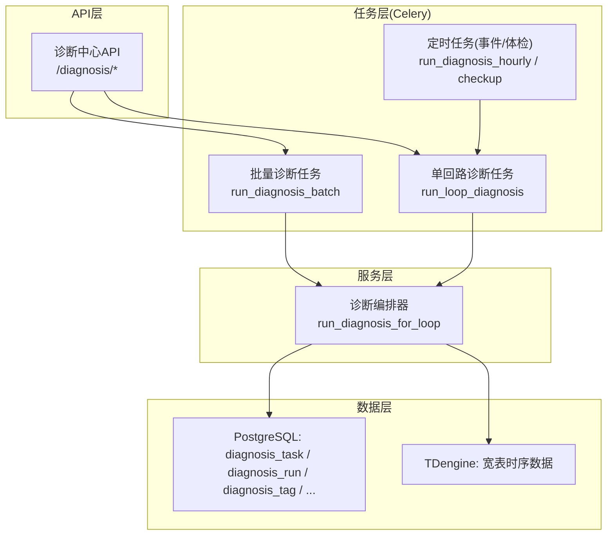
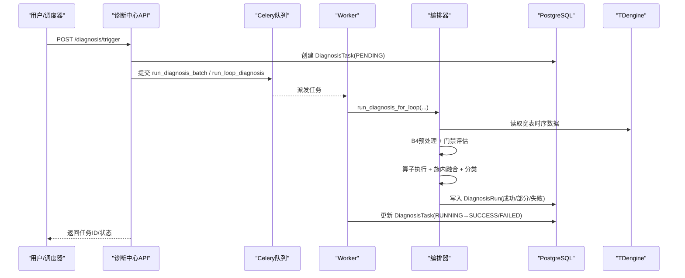
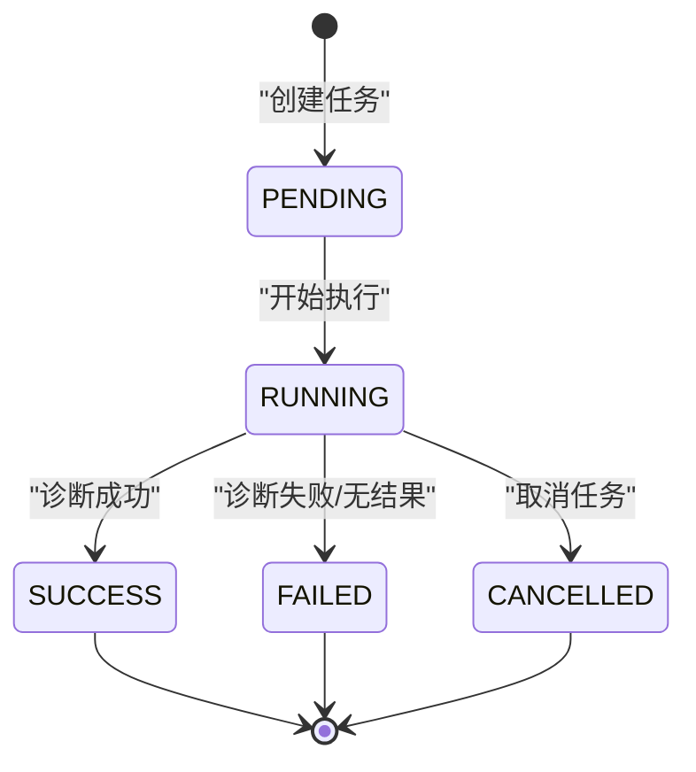
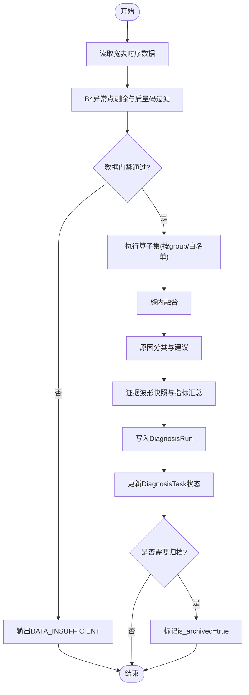
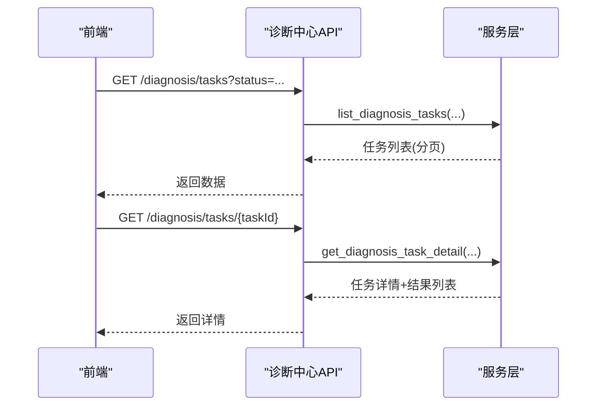
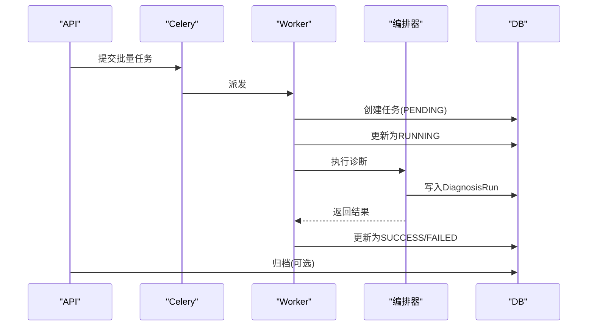
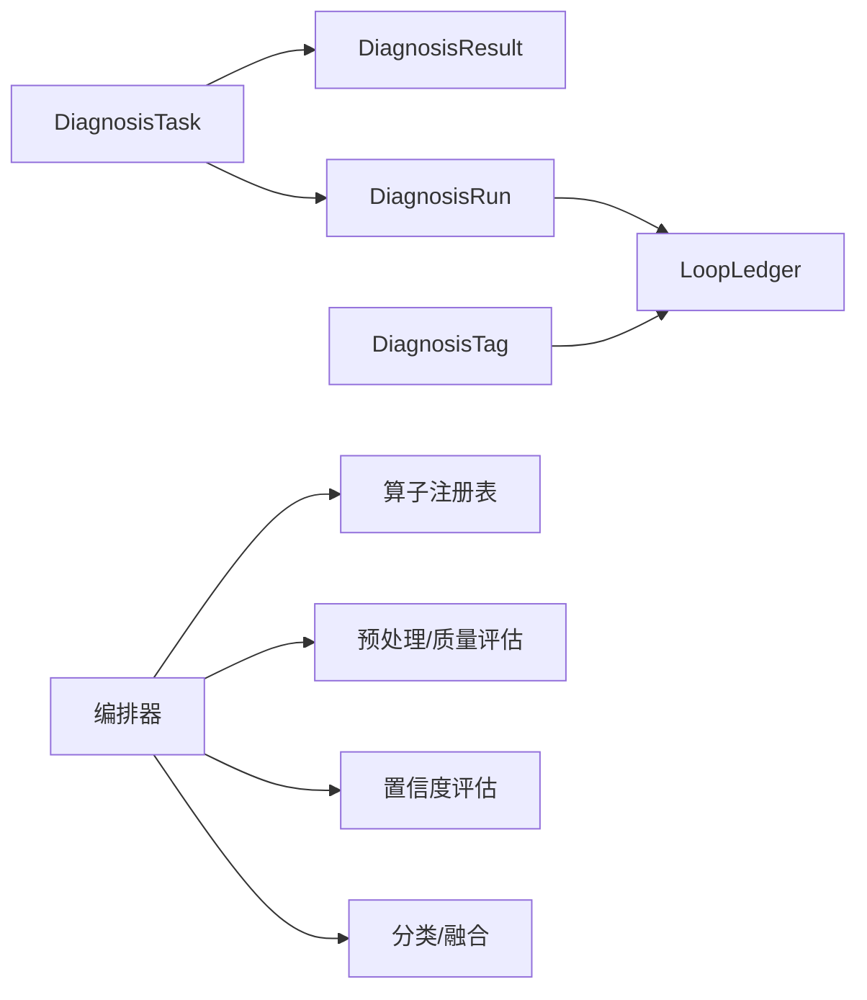

# 诊断任务生命周期

<cite>
**本文引用的文件**
- [backend/app/models/diagnosis.py](file://backend/app/models/diagnosis.py)
- [backend/app/models/diagnosis_run.py](file://backend/app/models/diagnosis_run.py)
- [backend/app/services/diagnosis_orchestrator.py](file://backend/app/services/diagnosis_orchestrator.py)
- [backend/app/tasks/diagnosis_engine.py](file://backend/app/tasks/diagnosis_engine.py)
- [backend/app/tasks/diagnosis_v2.py](file://backend/app/tasks/diagnosis_v2.py)
- [backend/app/api/v1/endpoints/diagnosis.py](file://backend/app/api/v1/endpoints/diagnosis.py)
- [backend/app/schemas/task.py](file://backend/app/schemas/task.py)
</cite>

## 目录
1. [简介](#简介)
2. [项目结构](#项目结构)
3. [核心组件](#核心组件)
4. [架构总览](#架构总览)
5. [详细组件分析](#详细组件分析)
6. [依赖关系分析](#依赖关系分析)
7. [性能考虑](#性能考虑)
8. [故障排查指南](#故障排查指南)
9. [结论](#结论)
10. [附录](#附录)

## 简介
本技术文档围绕“诊断任务”的全生命周期，系统阐述从创建、执行到归档的状态流转与业务含义；覆盖适用性门禁检查、诊断算子执行、结果聚合、归档处理；并给出监控与状态查询机制、失败重试策略、超时与异常恢复方案。文末提供状态机图与完整状态转换示例，便于快速理解与落地实施。

## 项目结构
诊断任务相关代码主要分布在以下模块：
- 数据模型：任务与运行记录、标签、规则等
- 编排器：取数→门禁→算子→融合→分类→快照→落库
- Celery 任务：批量/单回路诊断、定时体检轨
- API 端点：触发、列表、详情、归档、取消、统计等
- 任务 Schema：统一的任务状态枚举与响应结构

图表来源
- [backend/app/api/v1/endpoints/diagnosis.py:648-787](file://backend/app/api/v1/endpoints/diagnosis.py#L648-L787)
- [backend/app/tasks/diagnosis_v2.py:28-143](file://backend/app/tasks/diagnosis_v2.py#L28-L143)
- [backend/app/tasks/diagnosis_engine.py:201-326](file://backend/app/tasks/diagnosis_engine.py#L201-L326)
- [backend/app/services/diagnosis_orchestrator.py:546-790](file://backend/app/services/diagnosis_orchestrator.py#L546-L790)

章节来源
- [backend/app/api/v1/endpoints/diagnosis.py:648-787](file://backend/app/api/v1/endpoints/diagnosis.py#L648-L787)
- [backend/app/tasks/diagnosis_v2.py:28-143](file://backend/app/tasks/diagnosis_v2.py#L28-L143)
- [backend/app/tasks/diagnosis_engine.py:201-326](file://backend/app/tasks/diagnosis_engine.py#L201-L326)
- [backend/app/services/diagnosis_orchestrator.py:546-790](file://backend/app/services/diagnosis_orchestrator.py#L546-L790)

## 核心组件
- 诊断任务模型（DiagnosisTask）：承载任务全生命周期，状态机 PENDING → RUNNING → SUCCESS/FAILED/CANCELLED，支持归档。
- 诊断运行记录（DiagnosisRun）：一次回路的完整诊断结论（含算子结果、融合、分类、证据波形、指标汇总）。
- 诊断编排器（run_diagnosis_for_loop）：实现取数、B4预处理、门禁、算子执行、族内融合、原因分类、证据快照与落库。
- Celery 任务：
  - 批量任务（run_diagnosis_batch）：逐回路调用编排器，细粒度进度上报。
  - 单回路任务（run_loop_diagnosis）：手动或系统触发的单回路诊断。
  - 定时任务（hourly/checkup）：扫描低分回路或全部启用回路进行健康检查。
- API 端点：触发、列表、详情、归档、取消、统计导出等。
- 任务 Schema：统一 TaskStatus 枚举与任务响应结构。

章节来源
- [backend/app/models/diagnosis.py:90-145](file://backend/app/models/diagnosis.py#L90-L145)
- [backend/app/models/diagnosis_run.py:21-103](file://backend/app/models/diagnosis_run.py#L21-L103)
- [backend/app/services/diagnosis_orchestrator.py:546-790](file://backend/app/services/diagnosis_orchestrator.py#L546-L790)
- [backend/app/tasks/diagnosis_v2.py:28-143](file://backend/app/tasks/diagnosis_v2.py#L28-L143)
- [backend/app/tasks/diagnosis_engine.py:201-326](file://backend/app/tasks/diagnosis_engine.py#L201-L326)
- [backend/app/api/v1/endpoints/diagnosis.py:648-787](file://backend/app/api/v1/endpoints/diagnosis.py#L648-L787)
- [backend/app/schemas/task.py:48-63](file://backend/app/schemas/task.py#L48-L63)

## 架构总览
诊断任务的生命周期由 API 触发，进入 Celery 队列，由 Worker 消费后调用编排器完成数据处理与落库；任务状态在数据库持久化，运行进度通过任务追踪器上报。

图表来源
- [backend/app/api/v1/endpoints/diagnosis.py:648-787](file://backend/app/api/v1/endpoints/diagnosis.py#L648-L787)
- [backend/app/tasks/diagnosis_v2.py:28-143](file://backend/app/tasks/diagnosis_v2.py#L28-L143)
- [backend/app/tasks/diagnosis_engine.py:201-326](file://backend/app/tasks/diagnosis_engine.py#L201-L326)
- [backend/app/services/diagnosis_orchestrator.py:546-790](file://backend/app/services/diagnosis_orchestrator.py#L546-L790)

## 详细组件分析

### 任务状态机与转换条件
- 任务状态（DiagnosisTask）：PENDING → RUNNING → SUCCESS / FAILED / CANCELLED
  - PENDING → RUNNING：任务开始执行时更新为 RUNNING
  - RUNNING → SUCCESS：诊断产出结果且无致命错误
  - RUNNING → FAILED：诊断未产出结果或执行异常
  - RUNNING → CANCELLED：人工取消（仅允许对 PENDING/RUNNING 取消）
- 运行记录状态（DiagnosisRun）：RUNNING → SUCCESS / PARTIAL / FAILED
  - SUCCESS：所有算子正常执行
  - PARTIAL：存在算子异常但整体可收敛（例如部分特征缺失）
  - FAILED：执行异常或数据不足导致无法产出有效结论

图表来源
- [backend/app/models/diagnosis.py:90-145](file://backend/app/models/diagnosis.py#L90-L145)
- [backend/app/models/diagnosis_run.py:21-103](file://backend/app/models/diagnosis_run.py#L21-L103)
- [backend/app/tasks/diagnosis_engine.py:469-534](file://backend/app/tasks/diagnosis_engine.py#L469-L534)
- [backend/app/tasks/diagnosis_engine.py:654-769](file://backend/app/tasks/diagnosis_engine.py#L654-L769)

章节来源
- [backend/app/models/diagnosis.py:90-145](file://backend/app/models/diagnosis.py#L90-L145)
- [backend/app/models/diagnosis_run.py:21-103](file://backend/app/models/diagnosis_run.py#L21-L103)
- [backend/app/tasks/diagnosis_engine.py:469-534](file://backend/app/tasks/diagnosis_engine.py#L469-L534)
- [backend/app/tasks/diagnosis_engine.py:654-769](file://backend/app/tasks/diagnosis_engine.py#L654-L769)

### 执行流程：适用性门禁、算子执行、结果聚合、归档
- 适用性门禁（Data Gate）
  - 基于时间窗内点数、有效比例、置信度等级综合判定是否继续诊断
  - 不通过则直接输出 DATA_INSUFFICIENT（视为正常完成）
- 算子执行
  - 按 operator_group（full/fast/custom）选择算子集
  - 阈值采用四级覆盖（全局默认→loop_type模板→装置级→回路级）
  - 每个算子输出特征、证据链与置信度
- 结果聚合
  - 族内融合（Family Fusion）合并同症状标签的多个算子结果
  - 原因分类（Classification）输出主因、次因、严重等级、建议与证据
  - 生成证据波形快照（趋势+散点）与指标汇总（窗口KPI均值+算子特征）
- 归档处理
  - 任务完成后标记 is_archived=true，并从任务列表移入诊断记录
  - 归档接口支持仅查看已归档任务

图表来源
- [backend/app/services/diagnosis_orchestrator.py:546-790](file://backend/app/services/diagnosis_orchestrator.py#L546-L790)
- [backend/app/api/v1/endpoints/diagnosis.py:758-771](file://backend/app/api/v1/endpoints/diagnosis.py#L758-L771)

章节来源
- [backend/app/services/diagnosis_orchestrator.py:546-790](file://backend/app/services/diagnosis_orchestrator.py#L546-L790)
- [backend/app/api/v1/endpoints/diagnosis.py:758-771](file://backend/app/api/v1/endpoints/diagnosis.py#L758-L771)

### 任务监控与状态查询
- 任务列表与筛选：支持按状态、触发方式、回路、装置筛选，分页查询
- 任务详情：包含关联的诊断结果列表
- 任务统计：进行中/已完成/已归档三类计数
- 进度上报：批量任务按回路分段上报（取数→门禁→算子→落库），前端展示当前阶段与进度

图表来源
- [backend/app/api/v1/endpoints/diagnosis.py:672-738](file://backend/app/api/v1/endpoints/diagnosis.py#L672-L738)
- [backend/app/tasks/diagnosis_v2.py:76-143](file://backend/app/tasks/diagnosis_v2.py#L76-L143)

章节来源
- [backend/app/api/v1/endpoints/diagnosis.py:672-738](file://backend/app/api/v1/endpoints/diagnosis.py#L672-L738)
- [backend/app/tasks/diagnosis_v2.py:76-143](file://backend/app/tasks/diagnosis_v2.py#L76-L143)

### 失败重试、超时处理与异常恢复
- 失败重试
  - Celery 任务配置了自动重试：最大重试次数 3 次，指数退避，抖动随机化，避免雪崩
  - 单回路诊断与批量诊断均具备相同重试策略
- 超时处理
  - 通过 Celery 的 task_time_limit 与 worker 级别限制控制执行时长（部署侧配置）
  - 编排器内部对关键步骤设置进度回调，便于前端感知与中断提示
- 异常恢复
  - 数据库会话隔离：每协程独立 session，避免并发共享导致的不可预期错误
  - 异常捕获与回滚：诊断异常时记录 error_message 并将任务置为 FAILED
  - 失败留痕：批量任务中对失败的回路写入 DiagnosisRun(status=FAILED)，便于追溯

章节来源
- [backend/app/tasks/diagnosis_engine.py:201-263](file://backend/app/tasks/diagnosis_engine.py#L201-L263)
- [backend/app/tasks/diagnosis_v2.py:28-57](file://backend/app/tasks/diagnosis_v2.py#L28-L57)
- [backend/app/tasks/diagnosis_engine.py:469-534](file://backend/app/tasks/diagnosis_engine.py#L469-L534)
- [backend/app/tasks/diagnosis_v2.py:146-184](file://backend/app/tasks/diagnosis_v2.py#L146-L184)

### 完整状态转换示例
- 手动触发批量诊断
  - 创建任务（PENDING）→ 提交 Celery → Worker 执行 → 更新为 RUNNING → 编排器执行 → 写入 DiagnosisRun → 更新为 SUCCESS/FAILED → 可选归档
- 定时体检轨
  - 扫描全部启用回路 → 去重已有任务 → 创建 PENDING → 并发执行 → 更新 RUNNING → 根据结果写 SUCCESS/FAILED
- 单回路手动诊断
  - 解析时间范围 → 更新为 RUNNING → 执行诊断 → 成功则 SUCCESS，否则 FAILED

图表来源
- [backend/app/tasks/diagnosis_v2.py:28-143](file://backend/app/tasks/diagnosis_v2.py#L28-L143)
- [backend/app/tasks/diagnosis_engine.py:334-438](file://backend/app/tasks/diagnosis_engine.py#L334-L438)
- [backend/app/tasks/diagnosis_engine.py:553-651](file://backend/app/tasks/diagnosis_engine.py#L553-L651)
- [backend/app/tasks/diagnosis_engine.py:654-769](file://backend/app/tasks/diagnosis_engine.py#L654-L769)

## 依赖关系分析
- 模型依赖
  - DiagnosisTask 与 DiagnosisResult 一对多（旧引擎）
  - DiagnosisRun 与 LoopLedger 外键关联
  - DiagnosisTag 用于告警与标签管理
- 服务依赖
  - 编排器依赖数据源工厂（TDengine）、预处理、置信度评估、算子注册表、分类与融合
- 任务依赖
  - Celery 任务依赖异步数据库会话、配置加载、专家规则与阈值覆盖

图表来源
- [backend/app/models/diagnosis.py:51-145](file://backend/app/models/diagnosis.py#L51-L145)
- [backend/app/models/diagnosis_run.py:21-103](file://backend/app/models/diagnosis_run.py#L21-L103)
- [backend/app/services/diagnosis_orchestrator.py:496-543](file://backend/app/services/diagnosis_orchestrator.py#L496-L543)

章节来源
- [backend/app/models/diagnosis.py:51-145](file://backend/app/models/diagnosis.py#L51-L145)
- [backend/app/models/diagnosis_run.py:21-103](file://backend/app/models/diagnosis_run.py#L21-L103)
- [backend/app/services/diagnosis_orchestrator.py:496-543](file://backend/app/services/diagnosis_orchestrator.py#L496-L543)

## 性能考虑
- 并发控制：使用信号量限制并发诊断数量，避免资源争用
- 数据采样：趋势图与散点图进行下采样（LTTB/等步长抽稀），控制前端渲染点数
- 阈值优化：四级覆盖减少重复计算，失败回退默认值保证鲁棒性
- 会话隔离：每协程独立数据库会话，避免并发共享导致的锁竞争
- 重试策略：指数退避与抖动降低重试风暴风险

[本节为通用指导，无需特定文件引用]

## 故障排查指南
- 常见问题定位
  - 任务长时间处于 RUNNING：检查 Celery Worker 是否存活、队列是否堆积、数据库连接是否正常
  - 诊断结果为 FAILED：查看 error_message 与 DiagnosisRun.data_gate.reason，确认数据门禁是否通过
  - 归档失败：确认任务是否处于终态（SUCCESS/FAILED/CANCELLED）
- 日志与追踪
  - 编排器日志记录各阶段耗时与异常
  - 批量任务失败留痕（DiagnosisRun status=FAILED）便于回溯
- 恢复措施
  - 重新触发：对 FAILED 任务可重新执行
  - 调整阈值：通过阈值覆盖接口微调诊断灵敏度
  - 取消任务：对 PENDING/RUNNING 任务可取消

章节来源
- [backend/app/tasks/diagnosis_engine.py:469-534](file://backend/app/tasks/diagnosis_engine.py#L469-L534)
- [backend/app/tasks/diagnosis_v2.py:146-184](file://backend/app/tasks/diagnosis_v2.py#L146-L184)
- [backend/app/api/v1/endpoints/diagnosis.py:774-787](file://backend/app/api/v1/endpoints/diagnosis.py#L774-L787)

## 结论
诊断任务生命周期以“任务-运行记录”双表为核心，结合 Celery 异步执行与编排器流水线，实现了从数据获取、门禁判断、算子执行、结果聚合到归档的全链路闭环。通过统一的状态机、重试策略与异常恢复机制，保障了高可用与可观测性。建议在大规模场景下关注并发控制、阈值优化与监控告警，以提升整体稳定性与效率。

[本节为总结，无需特定文件引用]

## 附录
- 术语说明
  - 数据门禁：基于数据质量与完整性决定是否继续诊断
  - 族内融合：对同一症状标签的多算子结果进行加权融合
  - 原因分类：输出主因、次因、严重等级与建议
- 参考接口
  - 触发诊断：POST /api/v1/diagnosis/trigger
  - 任务列表：GET /api/v1/diagnosis/tasks
  - 任务详情：GET /api/v1/diagnosis/tasks/{taskId}
  - 归档任务：POST /api/v1/diagnosis/tasks/{taskId}/archive
  - 取消任务：POST /api/v1/diagnosis/tasks/{taskId}/cancel

章节来源
- [backend/app/api/v1/endpoints/diagnosis.py:648-787](file://backend/app/api/v1/endpoints/diagnosis.py#L648-L787)