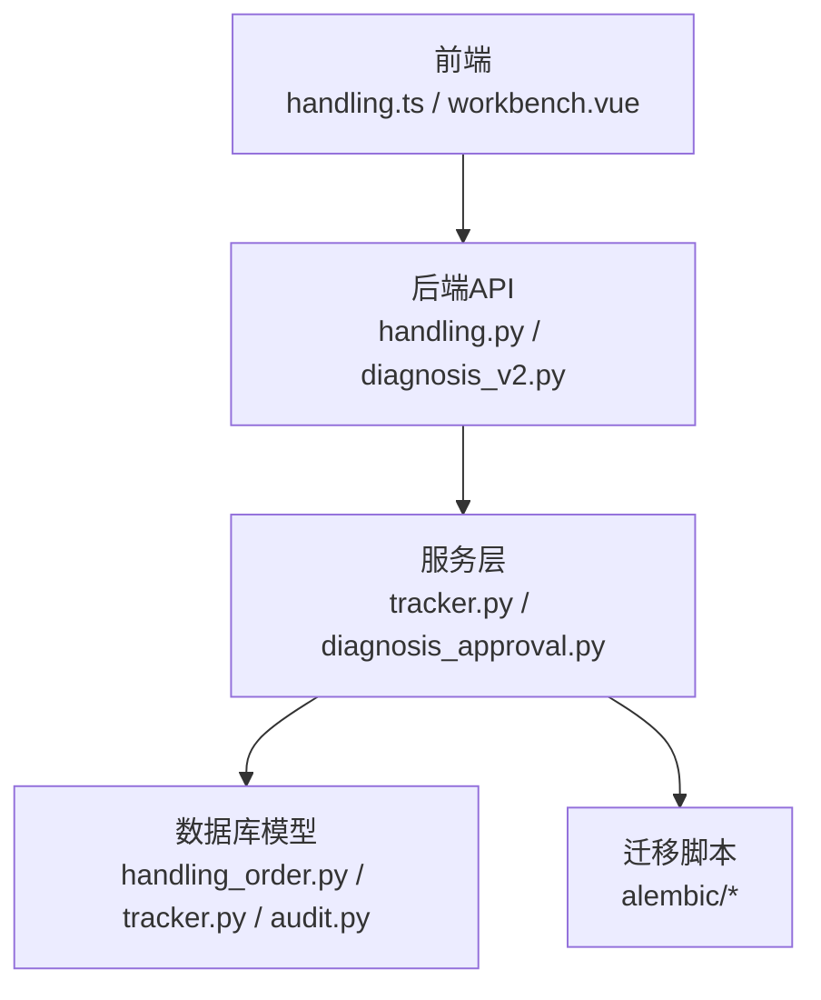
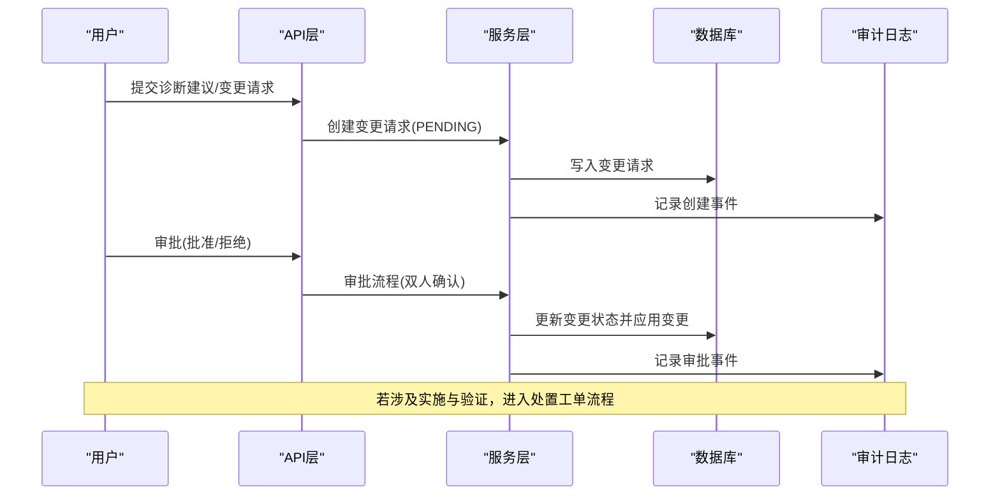
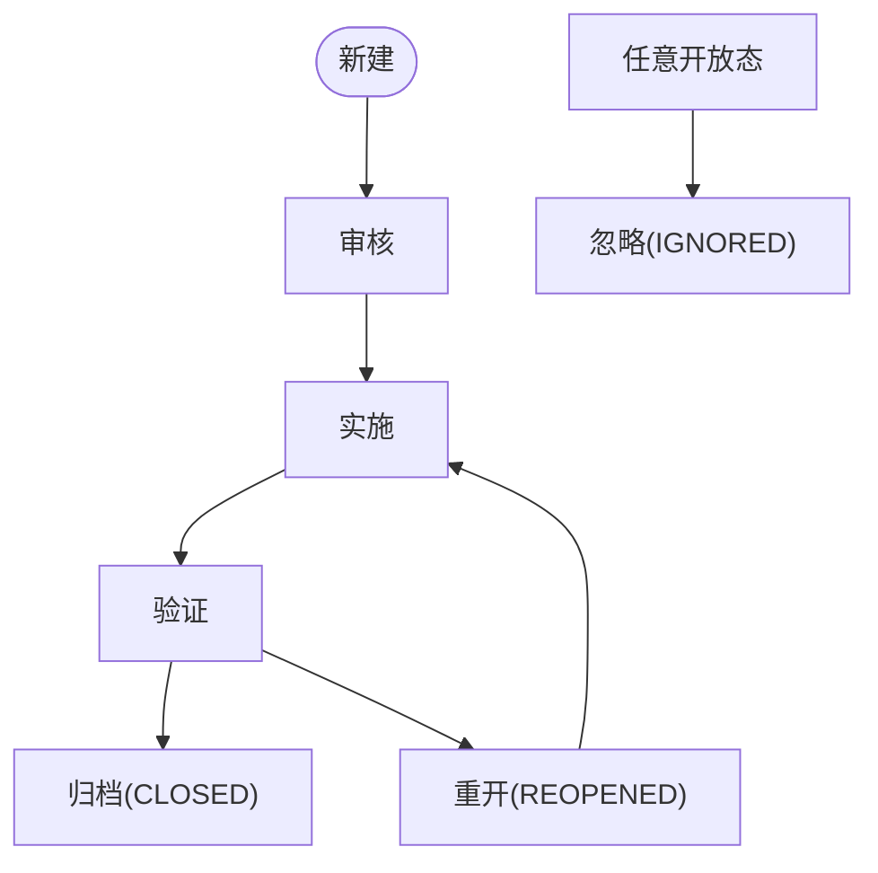
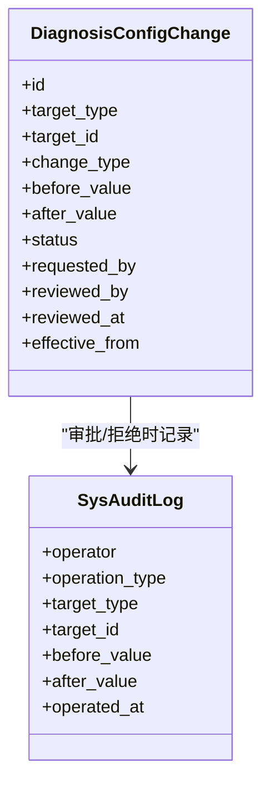
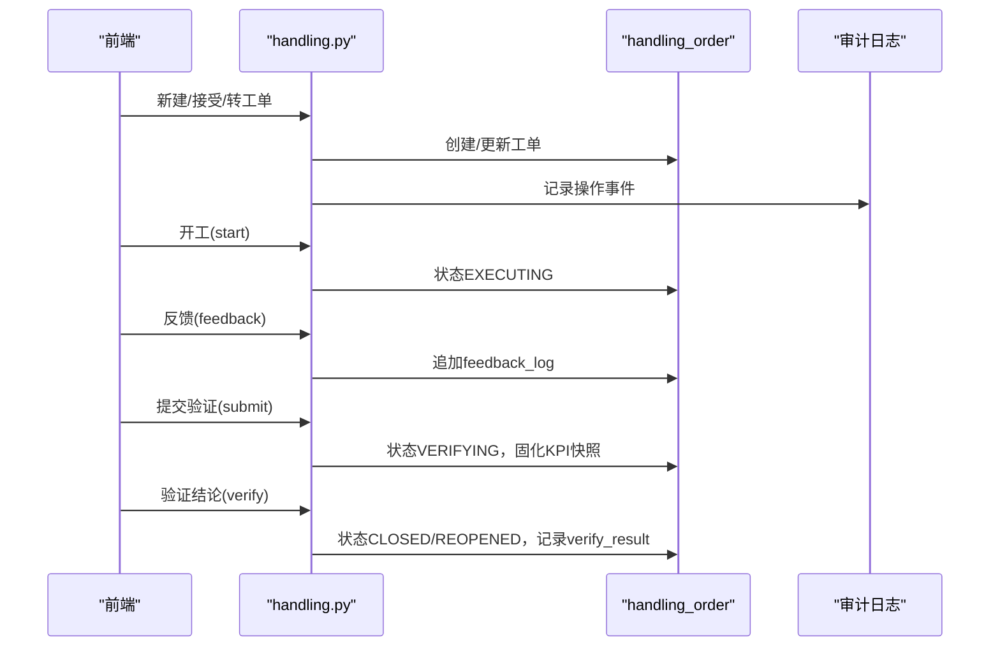
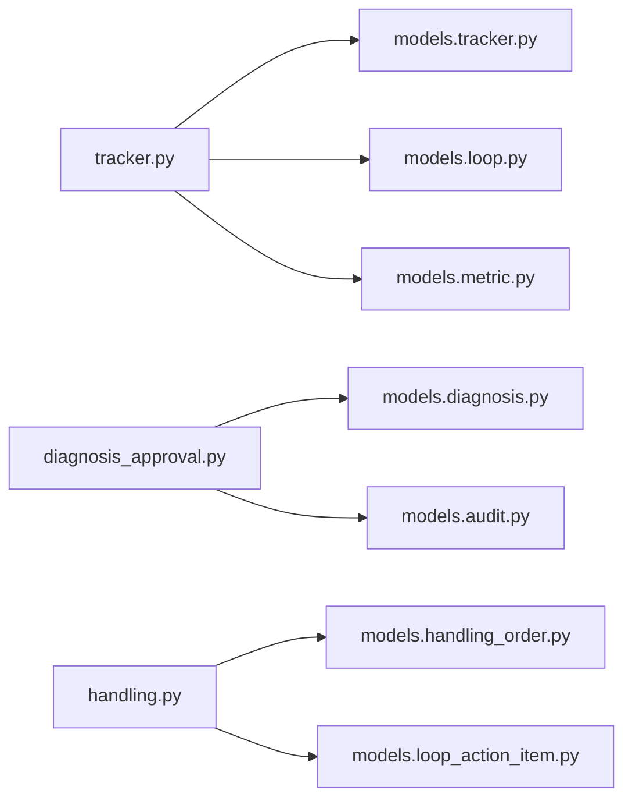

# 诊断审批工作流

<cite>
**本文引用的文件**
- [backend/app/services/diagnosis_approval.py](file://backend/app/services/diagnosis_approval.py)
- [backend/app/models/tracker.py](file://backend/app/models/tracker.py)
- [backend/app/services/tracker.py](file://backend/app/services/tracker.py)
- [backend/app/models/handling_order.py](file://backend/app/models/handling_order.py)
- [backend/app/api/v1/endpoints/handling.py](file://backend/app/api/v1/endpoints/handling.py)
- [backend/app/api/v1/endpoints/diagnosis_v2.py](file://backend/app/api/v1/endpoints/diagnosis_v2.py)
- [backend/app/models/audit.py](file://backend/app/models/audit.py)
- [backend/alembic/versions/e093854b7bed_p1a_action_tracker扩展闭环状态机字段.py](file://backend/alembic/versions/e093854b7bed_p1a_action_tracker扩展闭环状态机字段.py)
- [backend/alembic/versions/e6f7a8b9c0d1_rename_resolved_to_implemented.py](file://backend/alembic/versions/e6f7a8b9c0d1_rename_resolved_to_implemented.py)
- [backend/alembic/versions/a5b6c7d8e9f0_handling_module_v2_dual_entity.py](file://backend/alembic/versions/a5b6c7d8e9f0_handling_module_v2_dual_entity.py)
- [frontend/apps/web-antd/src/api/handling.ts](file://frontend/apps/web-antd/src/api/handling.ts)
- [frontend/apps/web-antd/src/views/handling/workbench.vue](file://frontend/apps/web-antd/src/views/handling/workbench.vue)
- [docs/设计文档/IA 优化/11-IA驱动的UIUX重构与页面品质提升方案-2026-08-11.md](file://docs/设计文档/IA 优化/11-IA驱动的UIUX重构与页面品质提升方案-2026-08-11.md)
</cite>

## 目录
1. [简介](#简介)
2. [项目结构](#项目结构)
3. [核心组件](#核心组件)
4. [架构总览](#架构总览)
5. [详细组件分析](#详细组件分析)
6. [依赖关系分析](#依赖关系分析)
7. [性能考虑](#性能考虑)
8. [故障排查指南](#故障排查指南)
9. [结论](#结论)
10. [附录](#附录)

## 简介
本技术文档围绕“诊断审批工作流”展开，聚焦 P1a 闭环状态机的扩展字段、状态流转（新建→审核→实施→验证→归档）、角色权限与操作限制、审批节点配置与管理、审批意见记录、版本控制与审计追踪，以及典型场景处理示例。同时说明该工作流与处置工单（handling_order）的集成关系，帮助读者从端到端理解从诊断建议到落地验证的全链路闭环。

## 项目结构
后端以 FastAPI 提供 API，服务层封装业务逻辑，模型层定义数据表结构与约束，迁移脚本维护数据库演进；前端通过 TypeScript API 调用后端接口并渲染工作台视图。关键路径：
- 诊断运行与复核：diagnosis_v2 端点 + diagnosis_approval 服务
- 整改跟踪与状态机：tracker 服务 + action_tracker 模型
- 处置工单执行与验证：handling 端点 + handling_order 模型
- 审计日志：sys_audit_log 模型统一记录变更前后值
- 前端：handling.ts 暴露接口方法，workbench.vue 展示统计与列表

**图表来源**
- [backend/app/api/v1/endpoints/handling.py:1-200](file://backend/app/api/v1/endpoints/handling.py#L1-L200)
- [backend/app/api/v1/endpoints/diagnosis_v2.py:355-384](file://backend/app/api/v1/endpoints/diagnosis_v2.py#L355-L384)
- [backend/app/services/tracker.py:1-200](file://backend/app/services/tracker.py#L1-L200)
- [backend/app/services/diagnosis_approval.py:1-120](file://backend/app/services/diagnosis_approval.py#L1-L120)
- [backend/app/models/handling_order.py:1-121](file://backend/app/models/handling_order.py#L1-L121)
- [backend/app/models/tracker.py:1-170](file://backend/app/models/tracker.py#L1-L170)
- [backend/app/models/audit.py:1-39](file://backend/app/models/audit.py#L1-L39)

**章节来源**
- [backend/app/api/v1/endpoints/handling.py:1-200](file://backend/app/api/v1/endpoints/handling.py#L1-L200)
- [backend/app/api/v1/endpoints/diagnosis_v2.py:355-384](file://backend/app/api/v1/endpoints/diagnosis_v2.py#L355-L384)
- [backend/app/services/tracker.py:1-200](file://backend/app/services/tracker.py#L1-L200)
- [backend/app/services/diagnosis_approval.py:1-120](file://backend/app/services/diagnosis_approval.py#L1-L120)
- [backend/app/models/handling_order.py:1-121](file://backend/app/models/handling_order.py#L1-L121)
- [backend/app/models/tracker.py:1-170](file://backend/app/models/tracker.py#L1-L170)
- [backend/app/models/audit.py:1-39](file://backend/app/models/audit.py#L1-L39)

## 核心组件
- 诊断审批服务：负责关键配置变更请求的创建、审批、拒绝，自动应用变更并记录审计日志，支持双人确认与版本递增。
- 整改跟踪器（ActionTracker）：承载 P1a 闭环状态机，包含实施详情字段（实施时间、实施人、新PID参数、关闭时间、重开原因等），并提供严格的状态转换校验与审计。
- 处置工单（HandlingOrder）：作为排程-执行-验证-闭环的执行载体，状态机为 PENDING → EXECUTING → VERIFYING → CLOSED/REOPENED，支持 KPI 前后快照固化与验证结论。
- 审计日志（SysAuditLog）：不可变记录，记录操作者、操作类型、目标对象及变更前后值。

**章节来源**
- [backend/app/services/diagnosis_approval.py:1-120](file://backend/app/services/diagnosis_approval.py#L1-L120)
- [backend/app/models/tracker.py:91-120](file://backend/app/models/tracker.py#L91-L120)
- [backend/app/models/handling_order.py:38-121](file://backend/app/models/handling_order.py#L38-L121)
- [backend/app/models/audit.py:15-39](file://backend/app/models/audit.py#L15-L39)

## 架构总览
P1a 审批工作流贯穿“诊断建议→审核→实施→验证→归档”，并与处置工单协同完成工程落地与效果验证。

**图表来源**
- [backend/app/services/diagnosis_approval.py:107-185](file://backend/app/services/diagnosis_approval.py#L107-L185)
- [backend/app/models/audit.py:15-39](file://backend/app/models/audit.py#L15-L39)

## 详细组件分析

### P1a 状态机与扩展字段
- 状态机定义：
  - 有效状态：PENDING、IN_PROGRESS、VERIFYING、CLOSED、REOPENED、IMPLEMENTED（历史兼容）、IGNORED
  - 允许转换：PENDING→IN_PROGRESS→VERIFYING→CLOSED；VERIFYING→REOPENED→IN_PROGRESS；任意开放态→IGNORED；历史兼容路径保留 IMPLEMENTED
- 扩展字段（P1a 闭环状态机）：
  - implemented_at、implemented_by：记录实施时间与实施人
  - new_pid_p/i/d：实施后新PID参数
  - closed_at：验证通过闭环时间
  - reopen_reason：重开原因（必填于 REOPENED）
  - assignee、planned_at：负责人与计划执行时间
  - tuning_record_id：关联整定任务记录
- 唯一性约束：同一回路+标签在开放态（PENDING/IN_PROGRESS/VERIFYING）下唯一，闭环后可再建新单

**图表来源**
- [backend/app/services/tracker.py:35-70](file://backend/app/services/tracker.py#L35-L70)
- [backend/app/models/tracker.py:91-120](file://backend/app/models/tracker.py#L91-L120)
- [backend/alembic/versions/e093854b7bed_p1a_action_tracker扩展闭环状态机字段.py:22-63](file://backend/alembic/versions/e093854b7bed_p1a_action_tracker扩展闭环状态机字段.py#L22-L63)

**章节来源**
- [backend/app/services/tracker.py:35-70](file://backend/app/services/tracker.py#L35-L70)
- [backend/app/models/tracker.py:91-120](file://backend/app/models/tracker.py#L91-L120)
- [backend/alembic/versions/e093854b7bed_p1a_action_tracker扩展闭环状态机字段.py:22-63](file://backend/alembic/versions/e093854b7bed_p1a_action_tracker扩展闭环状态机字段.py#L22-L63)

### 角色权限与控制
- 建议审核与工单流转角色：IC_ENGINEER、PE_ENGINEER、ADMIN
- 最小权限矩阵（参考设计文档）：
  - CREATE：case:create / ADMIN、IC
  - ACCEPT：case:accept / IC
  - ASSIGN_RESPONSIBILITY：case:responsibility:assign / ADMIN、IC
  - UPDATE_PLAN：case:plan / IC
  - ADD_EVIDENCE：case:evidence:add / IC、PE、EXPERT
  - RECORD_IMPLEMENTATION：case:implementation:record / IC
  - VERIFY_PASS/VERIFY_FAIL：case:verify / 指定验证人
  - IGNORE：case:ignore / IC
- 职责分离：验证人与实施人不得相同；改派需记录原因并产生审计事件

**章节来源**
- [backend/app/api/v1/endpoints/handling.py:60-92](file://backend/app/api/v1/endpoints/handling.py#L60-L92)
- [docs/设计文档/IA 优化/11-IA驱动的UIUX重构与页面品质提升方案-2026-08-11.md:716-731](file://docs/设计文档/IA 优化/11-IA驱动的UIUX重构与页面品质提升方案-2026-08-11.md#L716-L731)

### 审批节点配置与管理
- 变更请求类型：config、rule、trigger
- 变更类型：update、enable、disable
- 双人确认：审批人不能与申请人相同
- 自动应用：批准后原子切换目标对象（阈值、规则、触发条件），并递增版本号
- 运行时刷新：触发条件变更后刷新进程内缓存

**图表来源**
- [backend/app/services/diagnosis_approval.py:33-90](file://backend/app/services/diagnosis_approval.py#L33-L90)
- [backend/app/services/diagnosis_approval.py:107-185](file://backend/app/services/diagnosis_approval.py#L107-L185)
- [backend/app/models/audit.py:15-39](file://backend/app/models/audit.py#L15-L39)

**章节来源**
- [backend/app/services/diagnosis_approval.py:33-90](file://backend/app/services/diagnosis_approval.py#L33-L90)
- [backend/app/services/diagnosis_approval.py:107-185](file://backend/app/services/diagnosis_approval.py#L107-L185)
- [backend/app/models/audit.py:15-39](file://backend/app/models/audit.py#L15-L39)

### 审批意见记录、版本控制与审计追踪
- 审批意见：review_note 字段记录审批备注
- 版本控制：目标对象（配置/规则）version 自增，updated_by/updated_at 记录变更者与时间
- 审计追踪：所有关键动作（创建变更、审批/拒绝、状态更新）均写入 sys_audit_log，包含 before/after JSON 对比

**章节来源**
- [backend/app/services/diagnosis_approval.py:160-185](file://backend/app/services/diagnosis_approval.py#L160-L185)
- [backend/app/services/diagnosis_approval.py:248-320](file://backend/app/services/diagnosis_approval.py#L248-L320)
- [backend/app/services/tracker.py:309-362](file://backend/app/services/tracker.py#L309-L362)
- [backend/app/models/audit.py:15-39](file://backend/app/models/audit.py#L15-L39)

### 与处置工单的集成关系
- 来源：DIAGNOSIS（建议转化）或 MANUAL（手动新建）
- 状态机：PENDING → EXECUTING → VERIFYING → CLOSED/REOPENED；PENDING → CANCELLED
- 验证阶段：服务端固化 KPI 前后快照（kpi_before/kpi_after），支持 verify_result（EFFECTIVE/INEFFECTIVE）
- 前端接口：accept/reject/ignore suggestion、convert to order、start/feedback/submit/verify/cancel 等

**图表来源**
- [backend/app/api/v1/endpoints/handling.py:1012-1050](file://backend/app/api/v1/endpoints/handling.py#L1012-L1050)
- [backend/app/models/handling_order.py:38-121](file://backend/app/models/handling_order.py#L38-L121)
- [frontend/apps/web-antd/src/api/handling.ts:553-656](file://frontend/apps/web-antd/src/api/handling.ts#L553-L656)

**章节来源**
- [backend/app/models/handling_order.py:38-121](file://backend/app/models/handling_order.py#L38-L121)
- [backend/app/api/v1/endpoints/handling.py:1012-1050](file://backend/app/api/v1/endpoints/handling.py#L1012-L1050)
- [frontend/apps/web-antd/src/api/handling.ts:553-656](file://frontend/apps/web-antd/src/api/handling.ts#L553-L656)

### 典型场景处理示例
- 场景A：诊断建议经审核通过后转为处置工单，工程师实施并提交验证，系统固化KPI前后快照，验证通过闭环
- 场景B：验证失败重开，填写重开原因，重新实施并再次验证
- 场景C：关键配置变更需双人审批，批准后自动应用并递增版本，全程审计可追溯

**章节来源**
- [backend/app/api/v1/endpoints/handling.py:1012-1050](file://backend/app/api/v1/endpoints/handling.py#L1012-L1050)
- [backend/app/services/diagnosis_approval.py:107-185](file://backend/app/services/diagnosis_approval.py#L107-L185)
- [backend/app/services/tracker.py:309-362](file://backend/app/services/tracker.py#L309-L362)

## 依赖关系分析
- 服务层依赖：
  - tracker.py 依赖 models.tracker、models.loop、models.metric、services.diagnosis、services.diagnosis_recommendation、services.diagnosis_report
  - diagnosis_approval.py 依赖 models.diagnosis、models.audit
  - handling.py 依赖 models.handling_order、models.loop_action_item、models.metric、schemas.common
- 数据模型依赖：
  - handling_order 外键关联 loop_ledger、diagnosis_run
  - action_tracker 外键关联 loop_ledger、diagnosis_result、tuning_record
  - sys_audit_log 独立不可变表，被多处写入

**图表来源**
- [backend/app/services/tracker.py:1-32](file://backend/app/services/tracker.py#L1-L32)
- [backend/app/services/diagnosis_approval.py:19-29](file://backend/app/services/diagnosis_approval.py#L19-L29)
- [backend/app/api/v1/endpoints/handling.py:44-56](file://backend/app/api/v1/endpoints/handling.py#L44-L56)

**章节来源**
- [backend/app/services/tracker.py:1-32](file://backend/app/services/tracker.py#L1-L32)
- [backend/app/services/diagnosis_approval.py:19-29](file://backend/app/services/diagnosis_approval.py#L19-L29)
- [backend/app/api/v1/endpoints/handling.py:44-56](file://backend/app/api/v1/endpoints/handling.py#L44-L56)

## 性能考虑
- 状态查询与索引：action_tracker 与 handling_order 建立多列索引（如 status、loop_id、updated_at）以提升筛选与排序性能
- A/B 对比窗口：实施后至少24小时快照才视为数据充足，避免频繁重算
- 并发安全：order_no 生成采用唯一约束重试机制，防止并发冲突
- 缓存失效：规则变更后主动失效缓存，确保一致性

**章节来源**
- [backend/app/models/tracker.py:122-169](file://backend/app/models/tracker.py#L122-L169)
- [backend/app/models/handling_order.py:96-121](file://backend/app/models/handling_order.py#L96-L121)
- [backend/app/services/diagnosis_approval.py:303-320](file://backend/app/services/diagnosis_approval.py#L303-L320)

## 故障排查指南
- 状态转换错误：检查当前状态是否允许目标转换，查看 ALLOWED_TRANSITIONS 定义
- 必填字段缺失：VERIFYING 需填写MOC与PID参数；REOPENED 需填写重开原因
- 权限不足：确认用户角色是否在 _HANDLING_ROLES 或具备对应能力
- 审计日志缺失：确认写操作后是否 await db.refresh 并写入 sys_audit_log
- 并发冲突：order_no 生成冲突时自动重试一次，若仍失败需检查唯一约束

**章节来源**
- [backend/app/services/tracker.py:182-200](file://backend/app/services/tracker.py#L182-L200)
- [backend/app/api/v1/endpoints/handling.py:1012-1050](file://backend/app/api/v1/endpoints/handling.py#L1012-L1050)
- [backend/app/models/audit.py:15-39](file://backend/app/models/audit.py#L15-L39)

## 结论
P1a 审批工作流通过严格的状态机、扩展字段、双人确认与审计追踪，实现了从诊断建议到工程落地的全链路闭环。与处置工单的集成确保了实施与验证的可追溯性与可度量性。建议在后续迭代中继续完善前端可视化与统计看板，提升用户体验与运维效率。

## 附录
- 前端工作台统计：handling.ts 提供工单清单与详情接口，workbench.vue 展示各状态计数
- 迁移脚本：e093854b7bed 添加 P1a 扩展字段；e6f7a8b9c0d1 将 RESOLVED 重命名为 IMPLEMENTED；a5b6c7d8e9f0 定义处置模块 v2.0 双实体

**章节来源**
- [frontend/apps/web-antd/src/api/handling.ts:553-656](file://frontend/apps/web-antd/src/api/handling.ts#L553-L656)
- [frontend/apps/web-antd/src/views/handling/workbench.vue:486-513](file://frontend/apps/web-antd/src/views/handling/workbench.vue#L486-L513)
- [backend/alembic/versions/e093854b7bed_p1a_action_tracker扩展闭环状态机字段.py:22-63](file://backend/alembic/versions/e093854b7bed_p1a_action_tracker扩展闭环状态机字段.py#L22-L63)
- [backend/alembic/versions/e6f7a8b9c0d1_rename_resolved_to_implemented.py:20-45](file://backend/alembic/versions/e6f7a8b9c0d1_rename_resolved_to_implemented.py#L20-L45)
- [backend/alembic/versions/a5b6c7d8e9f0_handling_module_v2_dual_entity.py:161-355](file://backend/alembic/versions/a5b6c7d8e9f0_handling_module_v2_dual_entity.py#L161-L355)