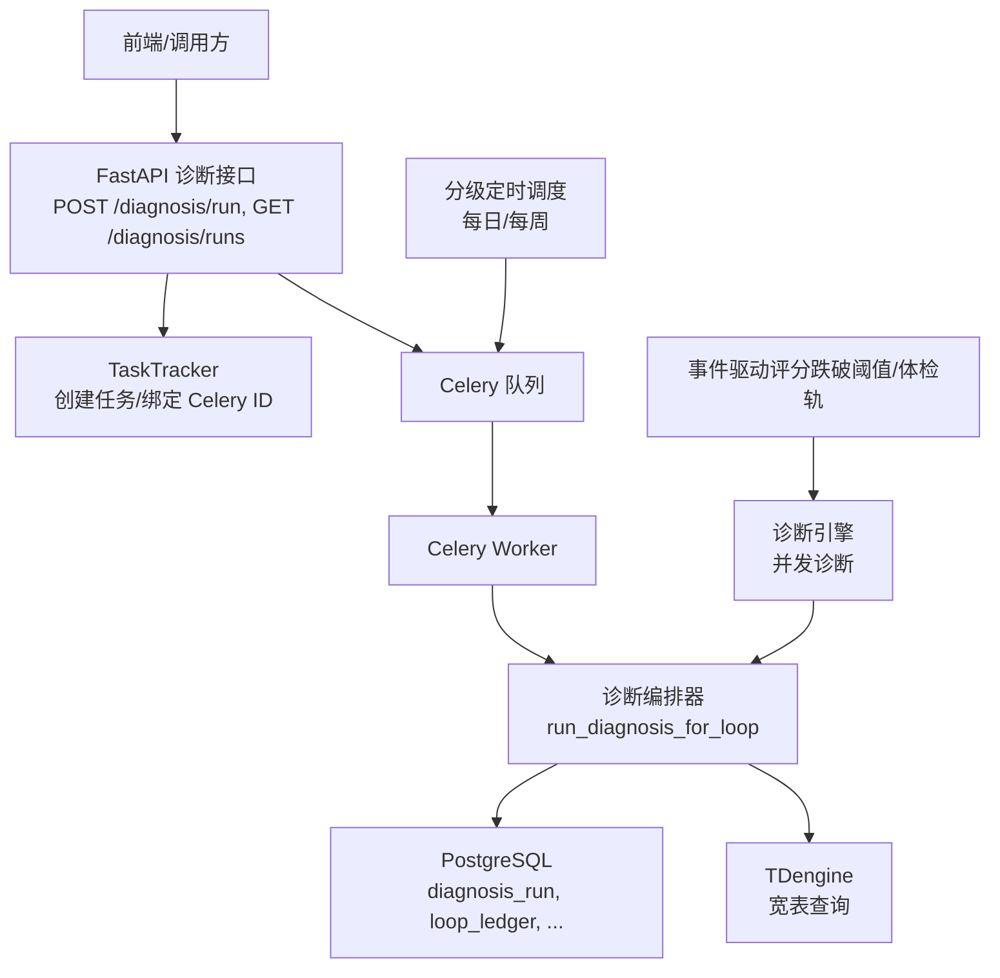
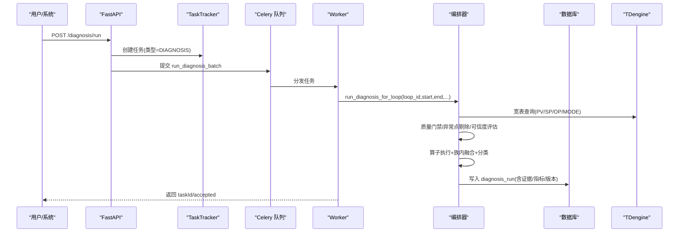
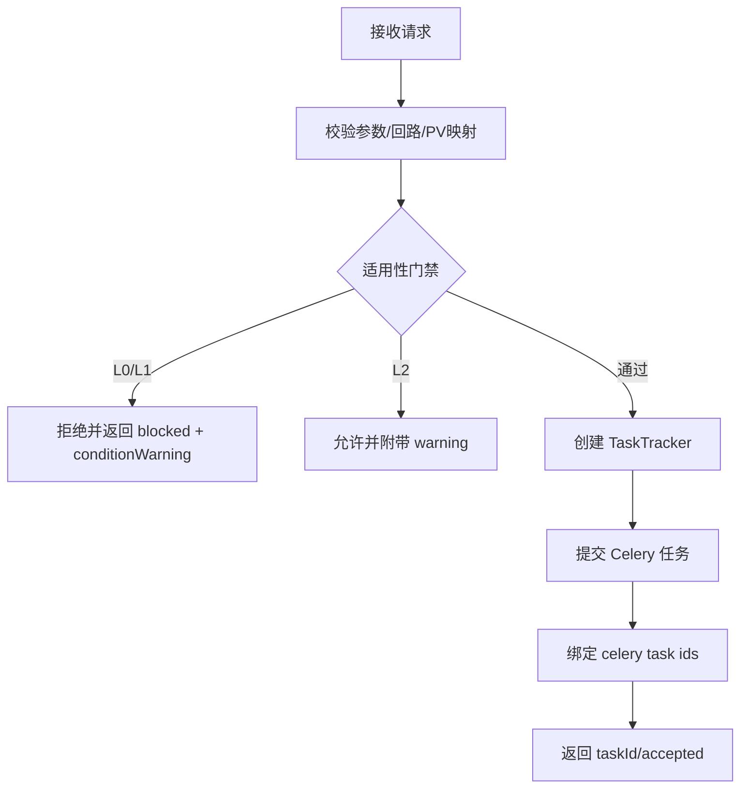
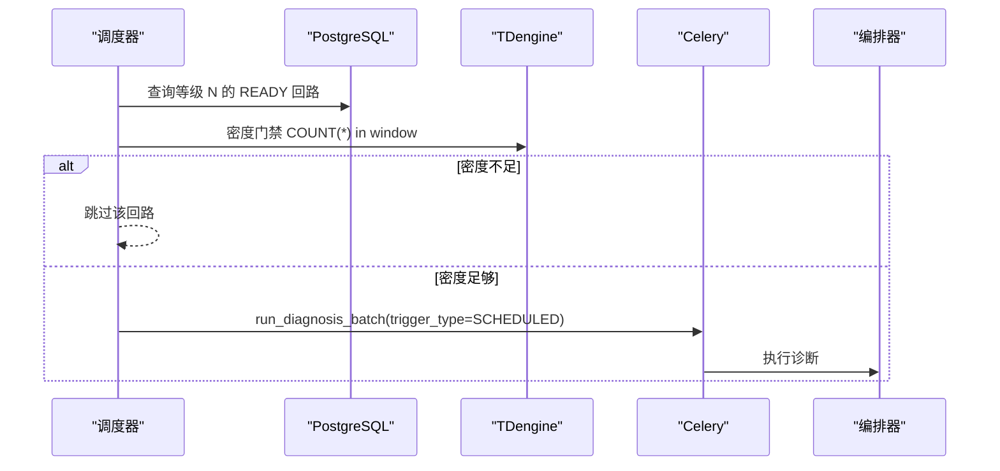
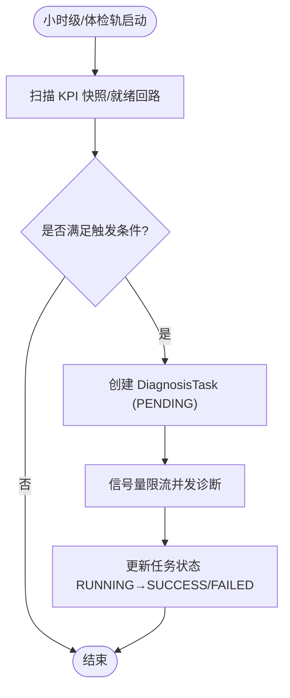
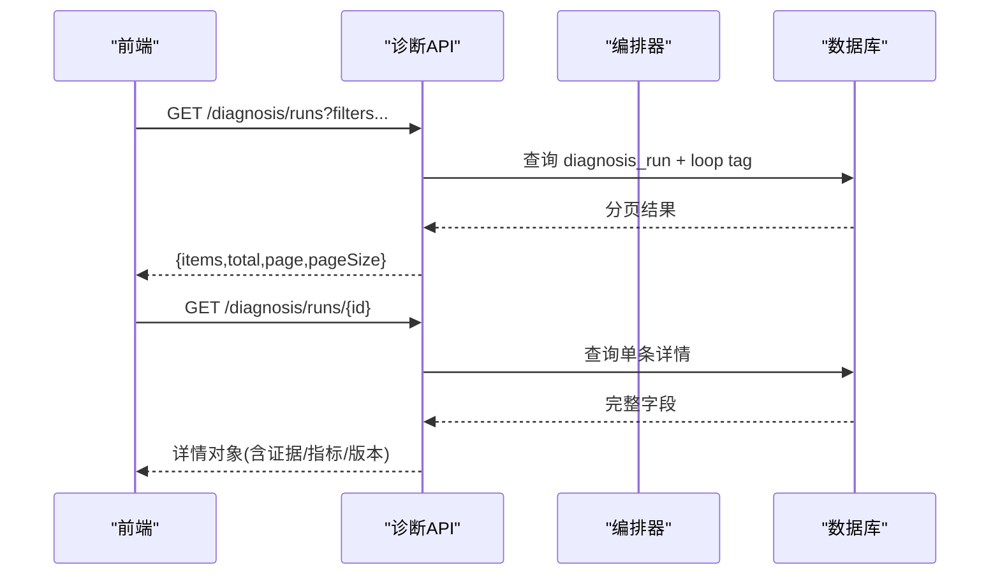
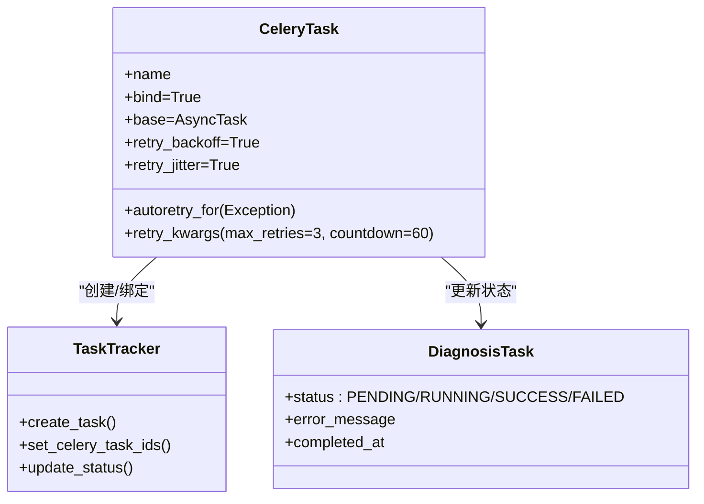
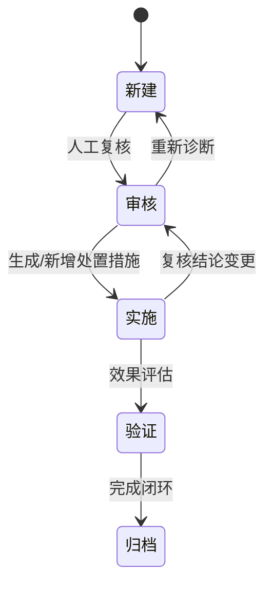
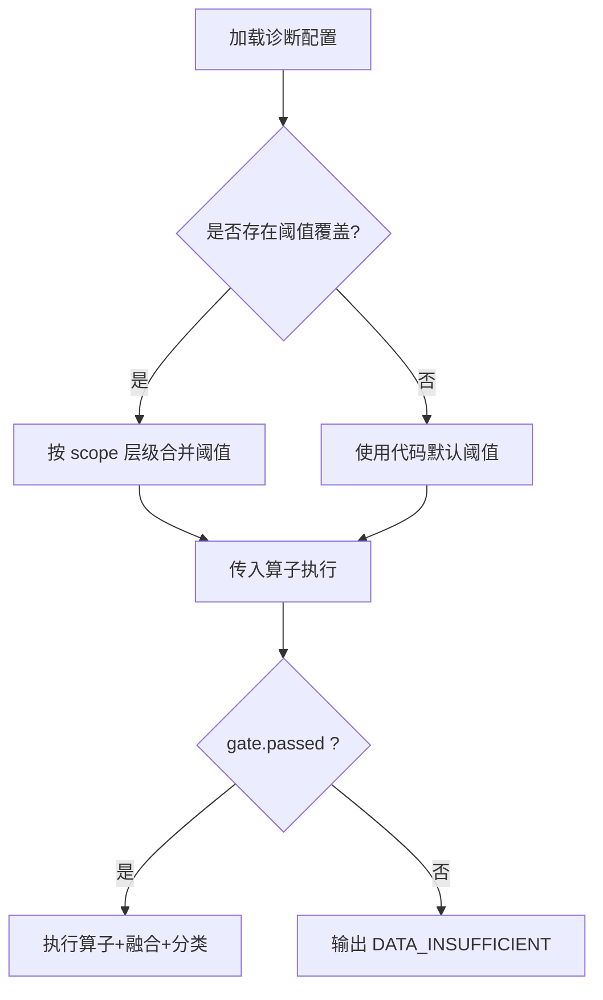
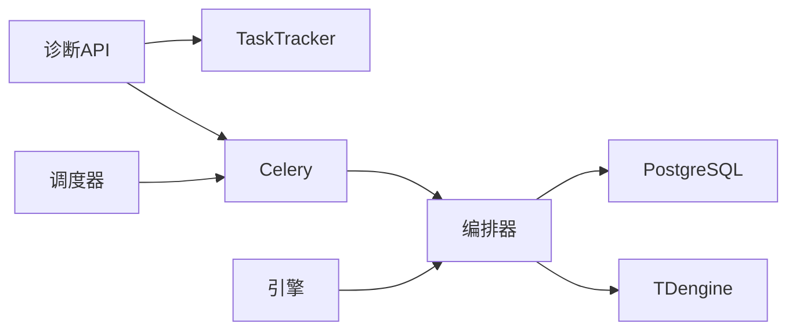

# 诊断工作流

<cite>
**本文引用的文件**
- [diagnosis_engine.py](file://backend/app/tasks/diagnosis_engine.py)
- [diagnosis_orchestrator.py](file://backend/app/services/diagnosis_orchestrator.py)
- [diagnosis_trigger_config.py](file://backend/app/services/diagnosis_trigger_config.py)
- [diagnosis_v2.py](file://backend/app/api/v1/endpoints/diagnosis_v2.py)
- [diagnosis_schedule.py](file://backend/app/tasks/diagnosis_schedule.py)
- [diagnosis_run.py](file://backend/app/models/diagnosis_run.py)
- [01_schema.sql](file://db/postgresql/01_schema.sql)
- [a7b8c9d0e1f2_add_diagnosis_run_trigger_type.py](file://backend/alembic/versions/a7b8c9d0e1f2_add_diagnosis_run_trigger_type.py)
- [v6p1diag002_align_diagnosis_config_threshold.py](file://backend/alembic/versions/v6p1diag002_align_diagnosis_config_threshold.py)
- [e5f6g7h8i9j0_add_threshold_version.py](file://backend/alembic/versions/e5f6g7h8i9j0_add_threshold_version.py)
</cite>

## 目录
1. [简介](#简介)
2. [项目结构](#项目结构)
3. [核心组件](#核心组件)
4. [架构总览](#架构总览)
5. [详细组件分析](#详细组件分析)
6. [依赖关系分析](#依赖关系分析)
7. [性能考量](#性能考量)
8. [故障排查指南](#故障排查指南)
9. [结论](#结论)
10. [附录](#附录)

## 简介
本技术文档聚焦“诊断工作流”的端到端实现，覆盖三类触发方式（手动、定时、事件驱动）、两页式IA设计的工作流（适用性门禁检查 L0/L1 阻止、L2 条件警告；诊断执行；结果展示），以及异步任务处理（Celery 队列、状态跟踪、失败重试）。同时说明诊断结果生命周期管理（新建、审核、实施、验证、归档）与诊断触发配置 DSL（规则表达式、条件组合、阈值配置），并给出监控、性能调优与故障排查建议。

## 项目结构
后端围绕 FastAPI 暴露诊断 API，通过 Celery 异步执行诊断任务；编排器负责取数、数据质量门禁、算子执行、融合分类、证据快照与落库；调度器按回路重要性等级发起分级定时诊断；配置服务提供运行时可配的触发参数；数据库模型定义诊断运行记录与阈值覆盖等表结构。

图表来源
- [diagnosis_v2.py:190-312](file://backend/app/api/v1/endpoints/diagnosis_v2.py#L190-L312)
- [diagnosis_schedule.py:75-152](file://backend/app/tasks/diagnosis_schedule.py#L75-L152)
- [diagnosis_engine.py:201-303](file://backend/app/tasks/diagnosis_engine.py#L201-L303)
- [diagnosis_orchestrator.py:546-789](file://backend/app/services/diagnosis_orchestrator.py#L546-L789)

章节来源
- [diagnosis_v2.py:190-312](file://backend/app/api/v1/endpoints/diagnosis_v2.py#L190-L312)
- [diagnosis_schedule.py:1-182](file://backend/app/tasks/diagnosis_schedule.py#L1-L182)
- [diagnosis_engine.py:1-327](file://backend/app/tasks/diagnosis_engine.py#L1-L327)
- [diagnosis_orchestrator.py:1-790](file://backend/app/services/diagnosis_orchestrator.py#L1-L790)

## 核心组件
- 诊断编排器：统一入口 run_diagnosis_for_loop，完成取数、质量门禁、算子执行、族内融合、原因分类、证据快照与落库。
- 诊断引擎：提供小时级全量诊断、体检轨、单回路诊断等 Celery 任务，支持并发与重试。
- 分级定时调度：按回路重要性等级（1/2/3 级）在固定时间窗口发起诊断，含密度门禁。
- 触发配置服务：从 sys_config 读取并缓存 scoreThreshold、concurrency、minDataPoints、checkupEnabled 等参数。
- 模型与迁移：diagnosis_run 记录一次完整诊断结论；threshold_version 用于可追溯；阈值覆盖支持四级作用域。

章节来源
- [diagnosis_orchestrator.py:546-789](file://backend/app/services/diagnosis_orchestrator.py#L546-L789)
- [diagnosis_engine.py:201-303](file://backend/app/tasks/diagnosis_engine.py#L201-L303)
- [diagnosis_schedule.py:75-152](file://backend/app/tasks/diagnosis_schedule.py#L75-L152)
- [diagnosis_trigger_config.py:1-230](file://backend/app/services/diagnosis_trigger_config.py#L1-L230)
- [diagnosis_run.py:21-104](file://backend/app/models/diagnosis_run.py#L21-L104)
- [01_schema.sql:1249-1263](file://db/postgresql/01_schema.sql#L1249-L1263)
- [a7b8c9d0e1f2_add_diagnosis_run_trigger_type.py:1-40](file://backend/alembic/versions/a7b8c9d0e1f2_add_diagnosis_run_trigger_type.py#L1-L40)
- [e5f6g7h8i9j0_add_threshold_version.py:1-34](file://backend/alembic/versions/e5f6g7h8i9j0_add_threshold_version.py#L1-L34)

## 架构总览
诊断工作流由三层触发汇聚到统一的编排器执行，最终产出包含算子结果、融合结果、症状标签、主/次分类、置信度、严重等级、依据与建议、证据波形快照及指标汇总的诊断运行记录。

图表来源
- [diagnosis_v2.py:190-312](file://backend/app/api/v1/endpoints/diagnosis_v2.py#L190-L312)
- [diagnosis_orchestrator.py:546-789](file://backend/app/services/diagnosis_orchestrator.py#L546-L789)

## 详细组件分析

### 触发方式一：手动触发
- 入口：POST /diagnosis/run
- 校验：loopIds 非空且不超过上限；时间窗 preset/start/end 合法；存在 PV Tag 关联；适用性门禁（fitness L0/L1 直接阻止，L2 条件警告）。
- 流程：创建 TaskTracker → 提交 Celery 任务 → 绑定 celery task id → 返回 taskId 与 accepted。
- 关键约束：单次最多 50 个回路；operatorGroup 可选 full/fast；operators 白名单需校验。

图表来源
- [diagnosis_v2.py:190-312](file://backend/app/api/v1/endpoints/diagnosis_v2.py#L190-L312)

章节来源
- [diagnosis_v2.py:190-312](file://backend/app/api/v1/endpoints/diagnosis_v2.py#L190-L312)

### 触发方式二：定时调度（分级）
- 调度策略：1 级关键回路每日 01:10（近 24h 窗口）；2 级重要回路每周日 02:10（近 7d 窗口）；3 级不排程。
- 密度门禁：目标窗口 TDengine 行数低于预期 50% 时跳过该回路。
- 流程：按等级查 READY 活跃回路 → 批量获取元信息 → 密度门禁过滤 → 创建 TaskTracker → 提交 Celery 任务 → 标记 trigger_type=SCHEDULED。

图表来源
- [diagnosis_schedule.py:75-152](file://backend/app/tasks/diagnosis_schedule.py#L75-L152)
- [diagnosis_schedule.py:155-182](file://backend/app/tasks/diagnosis_schedule.py#L155-L182)

章节来源
- [diagnosis_schedule.py:1-182](file://backend/app/tasks/diagnosis_schedule.py#L1-L182)

### 触发方式三：事件驱动
- 事件源：KPI 评分跌破阈值或体检轨触发。
- 机制：小时级任务扫描最近一小时 KpiSnapshotHourly，筛选 score < threshold 或 NULL 且 status=SUCCESS 的回路；为每个回路创建 DiagnosisTask（trigger_type='auto'，但对外以 EVENT/SCHEDULED 区分语义），并发执行诊断。
- 体检轨：每 8 小时对全部启用回路健康检查，受 checkup_enabled 开关控制。

图表来源
- [diagnosis_engine.py:334-438](file://backend/app/tasks/diagnosis_engine.py#L334-L438)
- [diagnosis_engine.py:553-651](file://backend/app/tasks/diagnosis_engine.py#L553-L651)

章节来源
- [diagnosis_engine.py:201-303](file://backend/app/tasks/diagnosis_engine.py#L201-L303)
- [diagnosis_engine.py:334-438](file://backend/app/tasks/diagnosis_engine.py#L334-L438)
- [diagnosis_engine.py:553-651](file://backend/app/tasks/diagnosis_engine.py#L553-L651)

### 两页式 IA 工作流：门禁检查、诊断执行、结果展示
- 适用性门禁检查：
  - L0/L1：直接阻止诊断，返回 blocked 列表与原因。
  - L2：允许诊断，返回 conditionWarning 横幅提示。
- 诊断执行：编排器内部顺序为取数→对齐与质量码过滤→B4 异常点剔除→可信度分级→数据门禁→算子执行→族内融合→原因分类→证据快照→指标汇总→落库。
- 结果展示：
  - 列表：分页、筛选（loopId/category/severity/status/reviewStatus/taskId/timeWindow）。
  - 详情：dataGate/operatorResults/fusionResults/symptomTags/rationale/recommendations/evidenceCharts/metricSummary/thresholdVersion/algorithmVersion/startedAt/finishedAt/durationMs/confidenceDefinitions。
  - 最新概览：每回路一条最新诊断，含 runCount、latestScore、reviewStatus 等。

图表来源
- [diagnosis_v2.py:315-374](file://backend/app/api/v1/endpoints/diagnosis_v2.py#L315-L374)
- [diagnosis_v2.py:745-762](file://backend/app/api/v1/endpoints/diagnosis_v2.py#L745-L762)
- [diagnosis_orchestrator.py:546-789](file://backend/app/services/diagnosis_orchestrator.py#L546-L789)

章节来源
- [diagnosis_v2.py:315-374](file://backend/app/api/v1/endpoints/diagnosis_v2.py#L315-L374)
- [diagnosis_v2.py:745-762](file://backend/app/api/v1/endpoints/diagnosis_v2.py#L745-L762)
- [diagnosis_orchestrator.py:546-789](file://backend/app/services/diagnosis_orchestrator.py#L546-L789)

### 异步任务处理：Celery、状态跟踪、失败重试
- 任务定义：run_diagnosis_hourly、run_diagnosis_checkup、run_loop_diagnosis 等，均使用 AsyncTask base，autoretry_for=(Exception,)，max_retries=3，countdown=60，指数退避与抖动。
- 状态跟踪：
  - TaskTracker：创建任务、绑定 celery task ids，终态同步（成功/失败）回写进度与错误信息。
  - DiagnosisTask：PENDING→RUNNING→SUCCESS/FAILED，记录 error_message 与 completed_at。
- 并发控制：信号量限制并发数（来自 get_trigger_config().concurrency），每协程独立数据库会话避免共享冲突。

图表来源
- [diagnosis_engine.py:201-303](file://backend/app/tasks/diagnosis_engine.py#L201-L303)
- [diagnosis_engine.py:441-550](file://backend/app/tasks/diagnosis_engine.py#L441-L550)

章节来源
- [diagnosis_engine.py:201-303](file://backend/app/tasks/diagnosis_engine.py#L201-L303)
- [diagnosis_engine.py:441-550](file://backend/app/tasks/diagnosis_engine.py#L441-L550)

### 诊断结果生命周期管理：新建、审核、实施、验证、归档
- 新建：编排器写入 diagnosis_run，包含 data_gate、operator_results、fusion_results、symptom_tags、primary_category、secondary_categories、pending_review、severity、rationale、recommendations、evidence_charts、metric_summary、threshold_version、algorithm_version、started_at、finished_at、duration_ms。
- 审核：API 提供复核接口，设置 review_status=REVIEWED，记录 review_results、review_comment、reviewed_by、reviewed_at；复核后重建系统处置建议。
- 实施：LoopActionItem 承载处置措施（SYSTEM/MANUAL），可按优先级与状态推进。
- 验证：结合 KPI 快照与诊断时间窗，前后对比验证效果（如稳态率、振荡率、饱和率等）。
- 归档：基于 created_at/finished_at 进行历史归档与导出（CSV 导出上限 5000 行）。

图表来源
- [diagnosis_run.py:21-104](file://backend/app/models/diagnosis_run.py#L21-L104)
- [diagnosis_v2.py:377-418](file://backend/app/api/v1/endpoints/diagnosis_v2.py#L377-L418)
- [diagnosis_v2.py:438-521](file://backend/app/api/v1/endpoints/diagnosis_v2.py#L438-L521)

章节来源
- [diagnosis_run.py:21-104](file://backend/app/models/diagnosis_run.py#L21-L104)
- [diagnosis_v2.py:377-418](file://backend/app/api/v1/endpoints/diagnosis_v2.py#L377-L418)
- [diagnosis_v2.py:438-521](file://backend/app/api/v1/endpoints/diagnosis_v2.py#L438-L521)

### 诊断触发配置的 DSL：规则表达式、条件组合、阈值配置
- 触发条件配置（sys_config）：
  - 键：diagnosis_trigger.current
  - 结构：scoreThreshold、concurrency、minDataPoints、checkupEnabled、updatedAt、updatedBy
  - 热路径：进程内缓存，保存后立即生效，worker 预载保证一致性。
- 阈值配置（算法阈值键名 schema）：
  - 各诊断标签（OSCILLATION、VALVE_STICTION、QUALITY_ABNORMAL、OUTPUT_SATURATION、OVERAGGRESSIVE、OVERCONSERVATIVE、EXTERNAL_DISTURBANCE）对应一组阈值键名与默认值。
  - 四级覆盖：全局默认 → 回路类型模板 → 装置级 → 回路级；合并顺序低到高，scope_chain[-1] 为生效层。
  - 迁移对齐：将存量 threshold 改写为代码真实读取的键名，避免配置页修改不生效。
- 规则表达式与条件组合：
  - 专家规则矩阵 R01-R06 在引擎中应用，结合 KPI 上下文与算子特征进行分类决策。
  - 数据门禁 gate.passed 决定进入算子执行分支，否则输出 DATA_INSUFFICIENT。

图表来源
- [diagnosis_trigger_config.py:1-230](file://backend/app/services/diagnosis_trigger_config.py#L1-L230)
- [diagnosis_engine.py:122-193](file://backend/app/tasks/diagnosis_engine.py#L122-L193)
- [diagnosis_engine.py:3487-3578](file://backend/app/tasks/diagnosis_engine.py#L3487-L3578)
- [v6p1diag002_align_diagnosis_config_threshold.py:1-32](file://backend/alembic/versions/v6p1diag002_align_diagnosis_config_threshold.py#L1-L32)
- [diagnosis_orchestrator.py:383-405](file://backend/app/services/diagnosis_orchestrator.py#L383-L405)

章节来源
- [diagnosis_trigger_config.py:1-230](file://backend/app/services/diagnosis_trigger_config.py#L1-L230)
- [diagnosis_engine.py:122-193](file://backend/app/tasks/diagnosis_engine.py#L122-L193)
- [diagnosis_engine.py:3487-3578](file://backend/app/tasks/diagnosis_engine.py#L3487-L3578)
- [v6p1diag002_align_diagnosis_config_threshold.py:1-32](file://backend/alembic/versions/v6p1diag002_align_diagnosis_config_threshold.py#L1-L32)
- [diagnosis_orchestrator.py:383-405](file://backend/app/services/diagnosis_orchestrator.py#L383-L405)

## 依赖关系分析
- 模块耦合：
  - API 依赖 TaskTracker 与 Celery；编排器依赖数据源工厂、预处理、算子注册表、分类器。
  - 引擎依赖 KPI 快照、诊断配置、阈值覆盖、专家规则。
  - 调度器依赖 LoopLedger、TDengine、TaskTracker。
- 外部依赖：
  - PostgreSQL：存储诊断运行记录、阈值覆盖、审计日志等。
  - TDengine：宽表查询与密度门禁。
  - Celery：任务队列与 Beat 调度。
- 潜在循环依赖：
  - 编排器与引擎解耦，通过任务函数调用；无直接循环导入。
  - 配置服务仅读 sys_config，无反向依赖。

图表来源
- [diagnosis_v2.py:190-312](file://backend/app/api/v1/endpoints/diagnosis_v2.py#L190-L312)
- [diagnosis_schedule.py:75-152](file://backend/app/tasks/diagnosis_schedule.py#L75-L152)
- [diagnosis_engine.py:334-438](file://backend/app/tasks/diagnosis_engine.py#L334-L438)
- [diagnosis_orchestrator.py:546-789](file://backend/app/services/diagnosis_orchestrator.py#L546-L789)

## 性能考量
- 并发与限流：
  - 信号量 concurrency 来自配置，默认 5；每协程独立数据库会话避免锁竞争。
- 数据访问优化：
  - 宽表查询一次性拉取 PV/SP/OP/MODE；对齐与质量码过滤减少后续计算量。
  - 趋势图与散点图采用 LTTB 下采样与等步长抽稀，限制 ≤2000 点。
- 阈值与规则：
  - 阈值覆盖四级合并，避免重复查库；缺失键告警并回退默认值。
- 任务重试与降级：
  - Celery 自动重试 3 次，指数退避；TDengine 不可用时优雅降级（返回 None 并标记 FAILED）。

[本节为通用指导，无需特定文件引用]

## 故障排查指南
- 诊断未产出结果：
  - 现象：任务状态 FAILED，错误消息“诊断未产出结果”。
  - 排查：确认回路存在、PV Tag 关联、TDengine 查询成功、数据点充足。
- 阈值配置不生效：
  - 现象：配置页修改阈值无效。
  - 排查：确认阈值键名与算法读取一致；检查四级覆盖合并顺序；查看缺失键告警日志。
- 触发配置未热更新：
  - 现象：scoreThreshold/concurrency 未生效。
  - 排查：确认 sys_config 已保存；进程内缓存是否刷新；worker 是否预载。
- 密度门禁导致跳过：
  - 现象：分级定时诊断大量跳过。
  - 排查：检查 TDengine 子表与时间窗数据密度；确认 subtable 正确。

章节来源
- [diagnosis_engine.py:654-769](file://backend/app/tasks/diagnosis_engine.py#L654-L769)
- [diagnosis_engine.py:3487-3578](file://backend/app/tasks/diagnosis_engine.py#L3487-L3578)
- [diagnosis_trigger_config.py:198-215](file://backend/app/services/diagnosis_trigger_config.py#L198-L215)
- [diagnosis_schedule.py:53-72](file://backend/app/tasks/diagnosis_schedule.py#L53-L72)

## 结论
本工作流通过手动、定时、事件三种触发方式汇聚至统一编排器，实现标准化诊断流水线；两页式 IA 确保适用性门禁前置，提升诊断有效性与用户体验；Celery 异步任务保障高吞吐与可靠性；诊断结果生命周期管理闭环可追踪；DSL 化配置与四级阈值覆盖增强灵活性与可维护性。建议在生产环境持续监控并发、重试、数据密度与阈值配置，结合性能调优与故障排查指南保障稳定运行。

[本节为总结，无需特定文件引用]

## 附录
- 关键 API：
  - POST /diagnosis/run：发起诊断（手动）
  - GET /diagnosis/runs：诊断记录列表（分页/筛选）
  - GET /diagnosis/runs/{id}：诊断详情
  - GET /diagnosis/operators：算子元数据
  - GET /diagnosis/export：CSV 导出
- 模型与迁移：
  - diagnosis_run：一次完整诊断结论
  - diagnosis_threshold_override：四级阈值覆盖
  - trigger_type 枚举：MANUAL/SCHEDULED/EVENT
  - threshold_version：诊断时使用的阈值版本号

章节来源
- [diagnosis_v2.py:190-800](file://backend/app/api/v1/endpoints/diagnosis_v2.py#L190-L800)
- [diagnosis_run.py:21-104](file://backend/app/models/diagnosis_run.py#L21-L104)
- [01_schema.sql:1249-1263](file://db/postgresql/01_schema.sql#L1249-L1263)
- [a7b8c9d0e1f2_add_diagnosis_run_trigger_type.py:1-40](file://backend/alembic/versions/a7b8c9d0e1f2_add_diagnosis_run_trigger_type.py#L1-L40)
- [e5f6g7h8i9j0_add_threshold_version.py:1-34](file://backend/alembic/versions/e5f6g7h8i9j0_add_threshold_version.py#L1-L34)