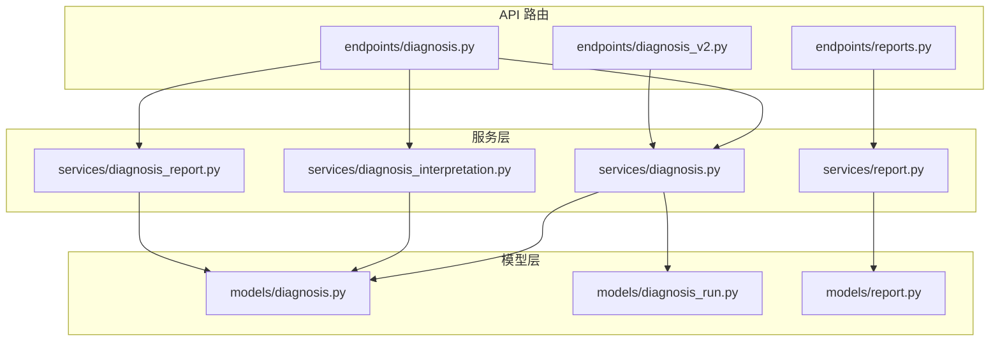
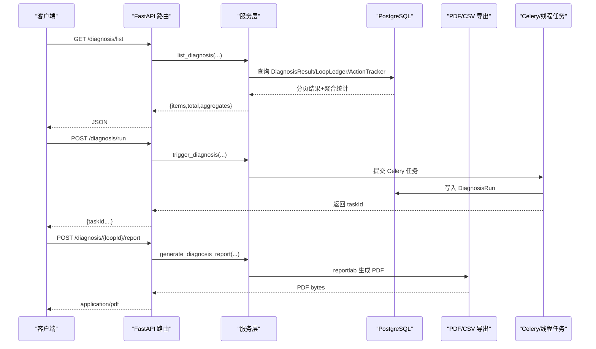
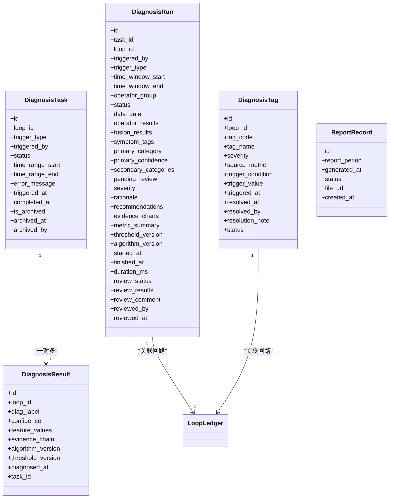
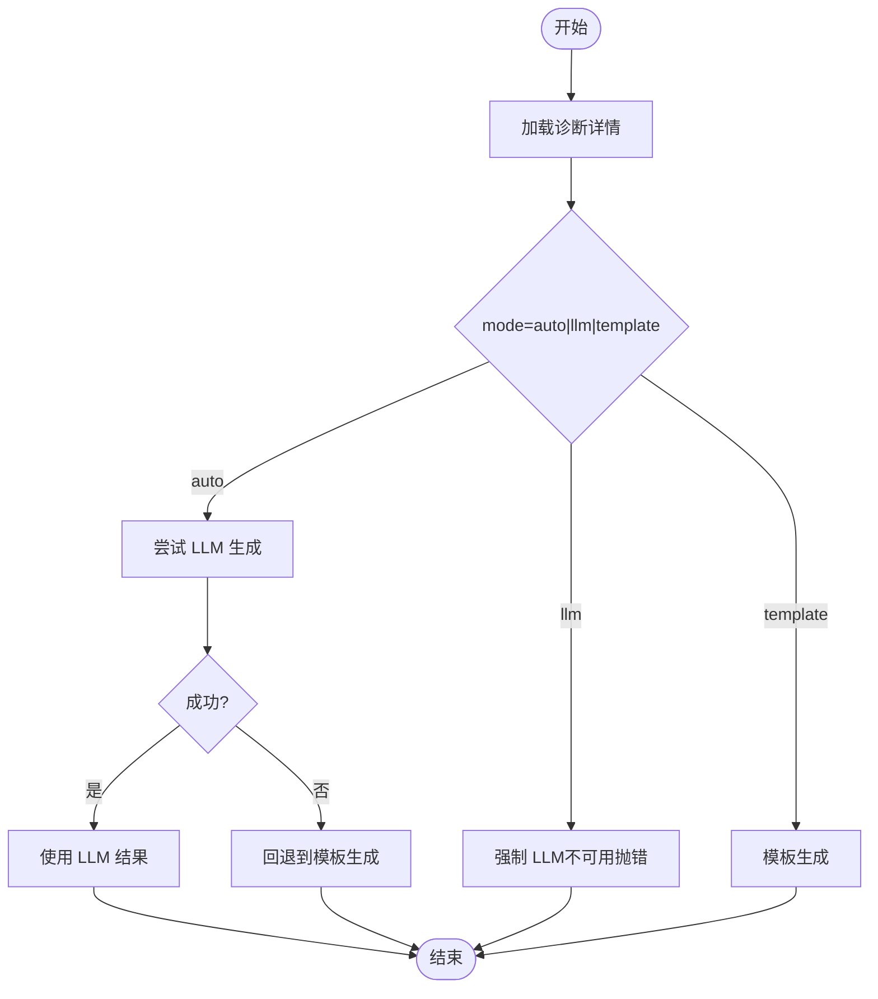
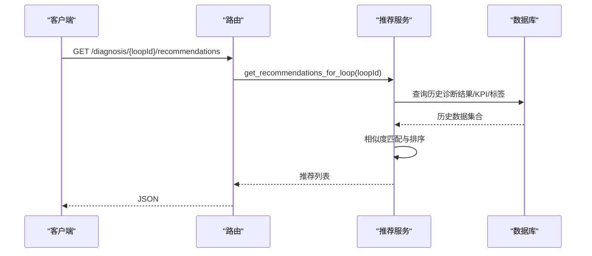
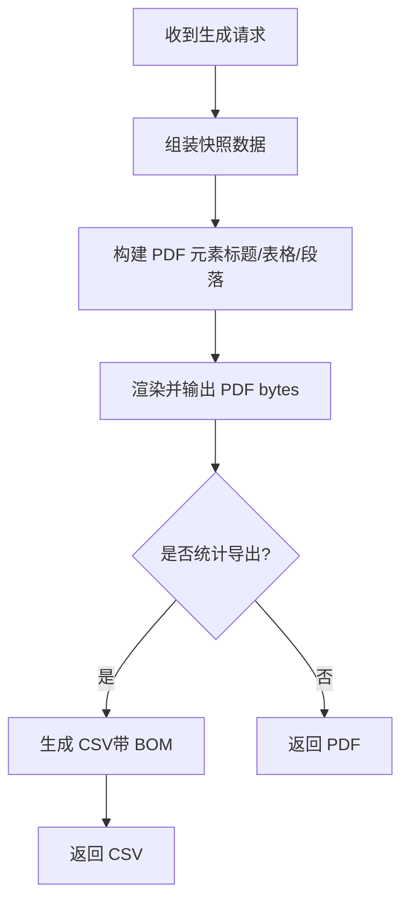
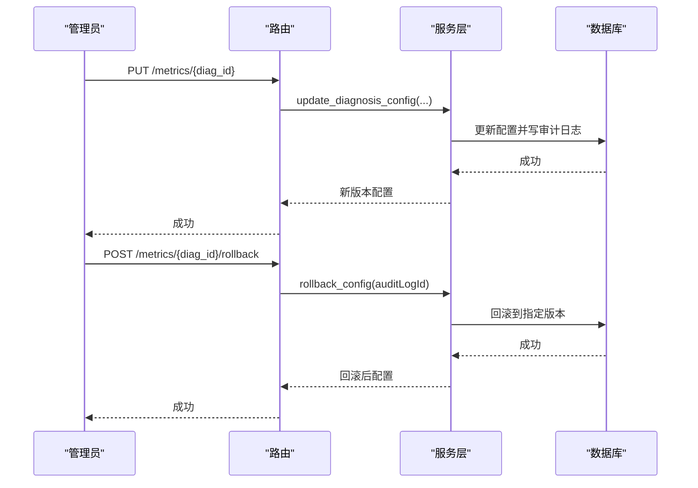
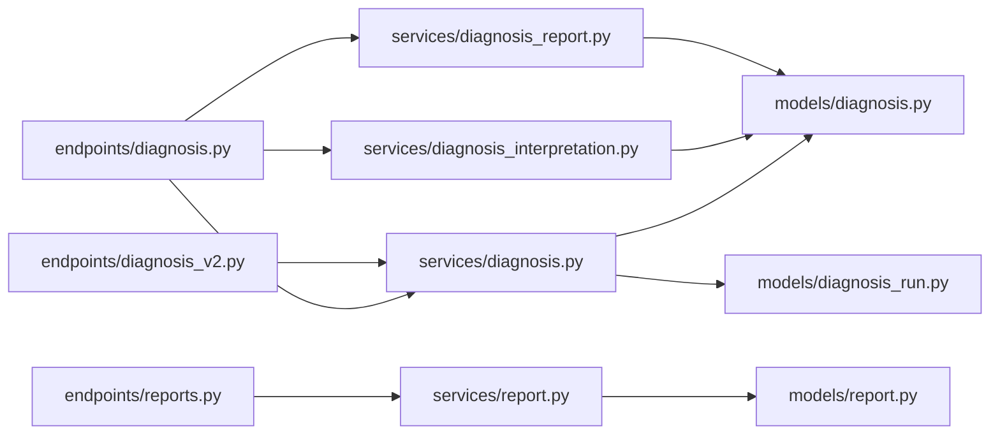

# 诊断结果管理

<cite>
**本文引用的文件**
- [diagnosis.py](file://backend/app/models/diagnosis.py)
- [diagnosis_run.py](file://backend/app/models/diagnosis_run.py)
- [report.py](file://backend/app/models/report.py)
- [diagnosis.py](file://backend/app/services/diagnosis.py)
- [diagnosis_interpretation.py](file://backend/app/services/diagnosis_interpretation.py)
- [diagnosis_report.py](file://backend/app/services/diagnosis_report.py)
- [report.py](file://backend/app/services/report.py)
- [diagnosis.py](file://backend/app/api/v1/endpoints/diagnosis.py)
- [diagnosis_v2.py](file://backend/app/api/v1/endpoints/diagnosis_v2.py)
- [reports.py](file://backend/app/api/v1/endpoints/reports.py)
</cite>

## 目录
1. [简介](#简介)
2. [项目结构](#项目结构)
3. [核心组件](#核心组件)
4. [架构总览](#架构总览)
5. [详细组件分析](#详细组件分析)
6. [依赖关系分析](#依赖关系分析)
7. [性能考虑](#性能考虑)
8. [故障排查指南](#故障排查指南)
9. [结论](#结论)
10. [附录：API 调用示例与报告模板说明](#附录api-调用示例与报告模板说明)

## 简介
本技术文档聚焦“诊断结果管理”子系统，覆盖以下目标：
- 存储结构与查询接口：明确诊断结果、任务、运行记录、标签、报表归档等数据模型及查询 API。
- AI 解读生成：自然语言描述、根因分析、改进建议的生成流程（模板 + LLM 增强）。
- 推荐算法：基于历史数据的解决方案推荐与相似度匹配机制。
- PDF 报告生成：模板定制、数据填充、格式导出。
- 版本管理与对比分析：阈值/配置版本化、A/B 对比、历史记录回溯。
- API 调用示例与报告模板说明：便于前端与集成方快速接入。

## 项目结构
后端围绕 FastAPI 路由层、服务层与模型层组织：
- 路由层：提供诊断列表、详情、任务管理、统计导出、PDF 生成、报表管理等 REST API。
- 服务层：封装业务逻辑，包括诊断编排、AI 解读、报告生成、报表配置与异步任务调度。
- 模型层：定义 PostgreSQL 表结构（诊断结果、任务、运行记录、标签、报表记录等）。

图表来源
- [diagnosis.py:1-150](file://backend/app/api/v1/endpoints/diagnosis.py#L1-L150)
- [diagnosis_v2.py:1-120](file://backend/app/api/v1/endpoints/diagnosis_v2.py#L1-L120)
- [reports.py:1-120](file://backend/app/api/v1/endpoints/reports.py#L1-L120)
- [diagnosis.py:1-120](file://backend/app/services/diagnosis.py#L1-L120)
- [diagnosis_interpretation.py:1-120](file://backend/app/services/diagnosis_interpretation.py#L1-L120)
- [diagnosis_report.py:1-120](file://backend/app/services/diagnosis_report.py#L1-L120)
- [report.py:1-120](file://backend/app/services/report.py#L1-L120)
- [diagnosis.py:1-120](file://backend/app/models/diagnosis.py#L1-L120)
- [diagnosis_run.py:1-104](file://backend/app/models/diagnosis_run.py#L1-L104)
- [report.py:1-44](file://backend/app/models/report.py#L1-L44)

章节来源
- [diagnosis.py:1-150](file://backend/app/api/v1/endpoints/diagnosis.py#L1-L150)
- [diagnosis_v2.py:1-120](file://backend/app/api/v1/endpoints/diagnosis_v2.py#L1-L120)
- [reports.py:1-120](file://backend/app/api/v1/endpoints/reports.py#L1-L120)
- [diagnosis.py:1-120](file://backend/app/services/diagnosis.py#L1-L120)
- [diagnosis_interpretation.py:1-120](file://backend/app/services/diagnosis_interpretation.py#L1-L120)
- [diagnosis_report.py:1-120](file://backend/app/services/diagnosis_report.py#L1-L120)
- [report.py:1-120](file://backend/app/services/report.py#L1-L120)
- [diagnosis.py:1-120](file://backend/app/models/diagnosis.py#L1-L120)
- [diagnosis_run.py:1-104](file://backend/app/models/diagnosis_run.py#L1-L104)
- [report.py:1-44](file://backend/app/models/report.py#L1-L44)

## 核心组件
- 诊断结果与任务
  - 旧版：DiagnosisResult（单条标签结果）、DiagnosisTask（任务生命周期）
  - 新版：DiagnosisRun（一次完整诊断结论，含算子结果、融合结果、证据图表、指标汇总、置信度、复核状态等）
- 诊断标签：DiagnosisTag（回路级故障标签，支持严重等级、触发条件、状态流转）
- 规则与阈值：DiagnosisRule（专家规则）、DiagnosisThresholdOverride（四级阈值覆盖）
- 报表归档：ReportRecord（自动生成的报表归档记录）

章节来源
- [diagnosis.py:51-201](file://backend/app/models/diagnosis.py#L51-L201)
- [diagnosis_run.py:21-104](file://backend/app/models/diagnosis_run.py#L21-L104)
- [report.py:20-44](file://backend/app/models/report.py#L20-L44)

## 架构总览
系统通过 API 路由接收请求，调用服务层完成诊断查询、AI 解读、报告生成与报表管理；持久化到 PostgreSQL。

图表来源
- [diagnosis.py:473-606](file://backend/app/api/v1/endpoints/diagnosis.py#L473-L606)
- [diagnosis_v2.py:190-313](file://backend/app/api/v1/endpoints/diagnosis_v2.py#L190-L313)
- [diagnosis_report.py:37-359](file://backend/app/services/diagnosis_report.py#L37-L359)
- [report.py:162-213](file://backend/app/services/report.py#L162-L213)

## 详细组件分析

### 存储结构与查询接口
- 存储结构
  - 诊断结果：DiagnosisResult（标签、置信度、特征值、证据链、算法版本、阈值版本、诊断时间、关联任务）
  - 诊断任务：DiagnosisTask（触发方式、状态机、时间窗、错误信息、归档字段）
  - 诊断运行：DiagnosisRun（一次完整结论，含 operator_results、fusion_results、symptom_tags、rationale、recommendations、evidence_charts、metric_summary、threshold_version、algorithm_version、review_status 等）
  - 诊断标签：DiagnosisTag（tag_code、severity、trigger_condition、status 等）
  - 报表归档：ReportRecord（period、generated_at、status、file_url）
- 查询接口
  - 诊断列表：GET /api/v1/diagnosis/list（支持 plantNodeId、diagnosisLabel、actionStatus、timeWindow、sort_by、loopIds、分页）
  - 诊断详情：GET /api/v1/diagnosis/{loopId}（最新一次诊断任务的所有结果、证据链、可视化数据）
  - 诊断运行列表：GET /api/v1/diagnosis/runs（筛选 loopId、category、severity、status、reviewStatus、taskId、时间范围）
  - 诊断运行详情：GET /api/v1/diagnosis/runs/{run_id}
  - 每回路最新概览：GET /api/v1/diagnosis/runs/latest
  - 统计导出：GET /api/v1/diagnosis/statistics/export（CSV）
  - 报表配置与生成：POST /api/v1/reports/generate、GET /api/v1/reports/tasks/{task_id}

图表来源
- [diagnosis.py:51-201](file://backend/app/models/diagnosis.py#L51-L201)
- [diagnosis_run.py:21-104](file://backend/app/models/diagnosis_run.py#L21-L104)
- [report.py:20-44](file://backend/app/models/report.py#L20-L44)

章节来源
- [diagnosis.py:51-201](file://backend/app/models/diagnosis.py#L51-L201)
- [diagnosis_run.py:21-104](file://backend/app/models/diagnosis_run.py#L21-L104)
- [report.py:20-44](file://backend/app/models/report.py#L20-L44)
- [diagnosis.py:473-606](file://backend/app/api/v1/endpoints/diagnosis.py#L473-L606)
- [diagnosis_v2.py:315-743](file://backend/app/api/v1/endpoints/diagnosis_v2.py#L315-L743)

### AI 解读生成（自然语言描述、根因分析、改进建议）
- 混合方案：默认使用规则模板生成结构化解读；可选 LLM 增强，失败时回退模板。
- 输入：诊断详情（标签、置信度、特征值、综合评分、可信度等级、有效数据率）
- 输出：interpretation（文本）、source（template/llm）、model、generatedAt
- 模板内容：概述段、主因分析（按置信度排序）、关键特征值引用、建议与预估改善、风险提示（紧急程度与建议动作类型）

图表来源
- [diagnosis_interpretation.py:120-167](file://backend/app/services/diagnosis_interpretation.py#L120-L167)
- [diagnosis_interpretation.py:170-279](file://backend/app/services/diagnosis_interpretation.py#L170-L279)
- [diagnosis_interpretation.py:286-328](file://backend/app/services/diagnosis_interpretation.py#L286-L328)

章节来源
- [diagnosis_interpretation.py:120-328](file://backend/app/services/diagnosis_interpretation.py#L120-L328)

### 推荐算法（基于历史数据的解决方案推荐、相似度匹配）
- 推荐入口：/api/v1/diagnosis/{loopId}/recommendations（SVC-11）
- 数据来源：诊断结果、KPI 快照、历史标签分布、算子特征值
- 匹配策略：基于标签与特征相似度的历史方案检索，结合阈值版本与规则引擎进行过滤与排序
- 输出：优先级、标签、行动项、详细描述、目标模块

图表来源
- [diagnosis.py:110-117](file://backend/app/api/v1/endpoints/diagnosis.py#L110-L117)
- [diagnosis.py:604-641](file://backend/app/api/v1/endpoints/diagnosis.py#L604-L641)

章节来源
- [diagnosis.py:110-117](file://backend/app/api/v1/endpoints/diagnosis.py#L110-L117)
- [diagnosis.py:604-641](file://backend/app/api/v1/endpoints/diagnosis.py#L604-L641)

### PDF 报告生成（模板定制、数据填充、格式导出）
- 模板定制：使用 reportlab 注册中文字体（STSong-Light），定义标题、正文、表格样式
- 数据填充：回路信息、诊断结果、性能指标、可能原因、解决方案推荐
- 格式导出：返回 PDF bytes；统计报表 CSV（UTF-8 with BOM）
- 异步任务：报表配置触发 Celery 任务，返回 taskId 供前端轮询

图表来源
- [diagnosis_report.py:37-359](file://backend/app/services/diagnosis_report.py#L37-L359)
- [diagnosis_report.py:366-505](file://backend/app/services/diagnosis_report.py#L366-L505)
- [report.py:162-213](file://backend/app/services/report.py#L162-L213)

章节来源
- [diagnosis_report.py:37-505](file://backend/app/services/diagnosis_report.py#L37-L505)
- [report.py:162-213](file://backend/app/services/report.py#L162-L213)

### 结果版本管理与对比分析
- 版本管理
  - 诊断配置版本：DiagnosisConfig.version 递增，审计日志记录 before/after
  - 阈值版本：DiagnosisResult.threshold_version、DiagnosisRun.threshold_version 记录生效阈值版本
  - 回滚：/api/v1/diagnosis/metrics/{diag_id}/rollback（仅 ADMIN）
- 对比分析
  - A/B 对比：/api/v1/diagnosis/ab-compare（实施前后窗口 KPI 均值对比，支持 includeDiagnosis）
  - 历史记录：DiagnosisRun 保留完整算子结果与证据图表，支持按 run_id 查看

图表来源
- [diagnosis.py:305-365](file://backend/app/services/diagnosis.py#L305-L365)
- [diagnosis.py:348-379](file://backend/app/api/v1/endpoints/diagnosis.py#L348-L379)
- [diagnosis.py:604-641](file://backend/app/api/v1/endpoints/diagnosis.py#L604-L641)

章节来源
- [diagnosis.py:305-379](file://backend/app/services/diagnosis.py#L305-L379)
- [diagnosis.py:348-379](file://backend/app/api/v1/endpoints/diagnosis.py#L348-L379)
- [diagnosis.py:604-641](file://backend/app/api/v1/endpoints/diagnosis.py#L604-L641)

## 依赖关系分析
- 路由与服务耦合：路由负责参数校验与权限控制，服务层实现业务逻辑与数据访问
- 服务与模型耦合：服务通过 SQLAlchemy 查询/写入模型对应表
- 外部依赖：reportlab（PDF）、csv（统计导出）、Celery（异步任务）

图表来源
- [diagnosis.py:1-150](file://backend/app/api/v1/endpoints/diagnosis.py#L1-L150)
- [diagnosis_v2.py:1-120](file://backend/app/api/v1/endpoints/diagnosis_v2.py#L1-L120)
- [reports.py:1-120](file://backend/app/api/v1/endpoints/reports.py#L1-L120)
- [diagnosis.py:1-120](file://backend/app/services/diagnosis.py#L1-L120)
- [diagnosis_interpretation.py:1-120](file://backend/app/services/diagnosis_interpretation.py#L1-L120)
- [diagnosis_report.py:1-120](file://backend/app/services/diagnosis_report.py#L1-L120)
- [report.py:1-120](file://backend/app/services/report.py#L1-L120)
- [diagnosis.py:1-120](file://backend/app/models/diagnosis.py#L1-L120)
- [diagnosis_run.py:1-104](file://backend/app/models/diagnosis_run.py#L1-L104)
- [report.py:1-44](file://backend/app/models/report.py#L1-L44)

章节来源
- [diagnosis.py:1-150](file://backend/app/api/v1/endpoints/diagnosis.py#L1-L150)
- [diagnosis_v2.py:1-120](file://backend/app/api/v1/endpoints/diagnosis_v2.py#L1-L120)
- [reports.py:1-120](file://backend/app/api/v1/endpoints/reports.py#L1-L120)
- [diagnosis.py:1-120](file://backend/app/services/diagnosis.py#L1-L120)
- [diagnosis_interpretation.py:1-120](file://backend/app/services/diagnosis_interpretation.py#L1-L120)
- [diagnosis_report.py:1-120](file://backend/app/services/diagnosis_report.py#L1-L120)
- [report.py:1-120](file://backend/app/services/report.py#L1-L120)
- [diagnosis.py:1-120](file://backend/app/models/diagnosis.py#L1-L120)
- [diagnosis_run.py:1-104](file://backend/app/models/diagnosis_run.py#L1-L104)
- [report.py:1-44](file://backend/app/models/report.py#L1-L44)

## 性能考虑
- 查询优化
  - 诊断列表使用子查询取每个 loop 的最新 diagnosed_at，避免全表扫描
  - 批量筛选 loop_ids 下推到子查询，减少 group by 开销
  - 使用索引：idx_diagnosis_result_loop_id、idx_diagnosis_result_diagnosed、idx_diagnosis_task_*、idx_diagnosis_tag_*
- 导出性能
  - CSV 导出采用流式写入，限制行数上限（如 5000 行）
  - PDF 生成延迟导入 reportlab，避免启动时依赖
- 并发与异步
  - 诊断任务与报表生成通过 Celery/线程异步执行，避免阻塞请求
  - 内存型任务状态表用于 PDF 导出临时缓存（TTL 清理）

[本节为通用指导，不直接分析具体文件]

## 故障排查指南
- 常见错误
  - 配置不存在：ERR_DIAG_CONFIG_NOT_FOUND（更新诊断指标配置时）
  - 回路不存在：ERR_LOOP_NOT_FOUND（查询详情时）
  - 无诊断结果：ERR_DIAG_RESULT_NOT_FOUND（查询详情时）
  - 报表任务不存在：ERR_REPORT_TASK_NOT_FOUND（查询任务状态时）
  - 诊断适用性不足：ERR_DIAGNOSIS_FITNESS_INSUFFICIENT（发起诊断门禁）
- 排查步骤
  - 检查参数合法性（loopId、时间窗、角色权限）
  - 确认数据库连接与索引是否正常
  - 查看 Celery/线程任务状态与日志
  - 验证 PDF 导出目录权限与空间

章节来源
- [diagnosis.py:305-365](file://backend/app/services/diagnosis.py#L305-L365)
- [diagnosis.py:617-738](file://backend/app/services/diagnosis.py#L617-L738)
- [report.py:162-213](file://backend/app/services/report.py#L162-L213)
- [diagnosis_v2.py:190-313](file://backend/app/api/v1/endpoints/diagnosis_v2.py#L190-L313)

## 结论
本系统实现了完整的诊断结果管理闭环：从数据存储、查询接口、AI 解读、推荐算法、PDF 报告生成到版本管理与对比分析。通过分层架构与异步任务设计，兼顾了功能完整性与性能稳定性。建议在生产环境中关注索引优化、任务队列监控与 PDF 导出资源管理。

[本节为总结，不直接分析具体文件]

## 附录：API 调用示例与报告模板说明
- 诊断列表
  - GET /api/v1/diagnosis/list?plantNodeId=&diagnosisLabel=&actionStatus=&timeWindow=&sortBy=&loopIds[]=&page=1&pageSize=20
- 诊断详情
  - GET /api/v1/diagnosis/{loopId}
- 诊断运行
  - POST /api/v1/diagnosis/run（body: loopIds[], timeWindow{preset/start/end}, operatorGroup, operators[]）
  - GET /api/v1/diagnosis/runs（筛选参数见路由定义）
  - GET /api/v1/diagnosis/runs/{run_id}
- 统计导出
  - GET /api/v1/diagnosis/statistics/export?startDate=&endDate=&plantNodeId=
- 报表配置与生成
  - POST /api/v1/reports/generate（configId/reportPeriod）
  - GET /api/v1/reports/tasks/{task_id}
- 报告模板说明
  - PDF 模板包含：回路信息、诊断结果、性能指标、可能原因、解决方案推荐、页脚
  - CSV 模板包含：标签分布汇总、按天趋势、分布统计

章节来源
- [diagnosis.py:473-606](file://backend/app/api/v1/endpoints/diagnosis.py#L473-L606)
- [diagnosis_v2.py:190-313](file://backend/app/api/v1/endpoints/diagnosis_v2.py#L190-L313)
- [diagnosis_report.py:37-359](file://backend/app/services/diagnosis_report.py#L37-L359)
- [report.py:162-213](file://backend/app/services/report.py#L162-L213)