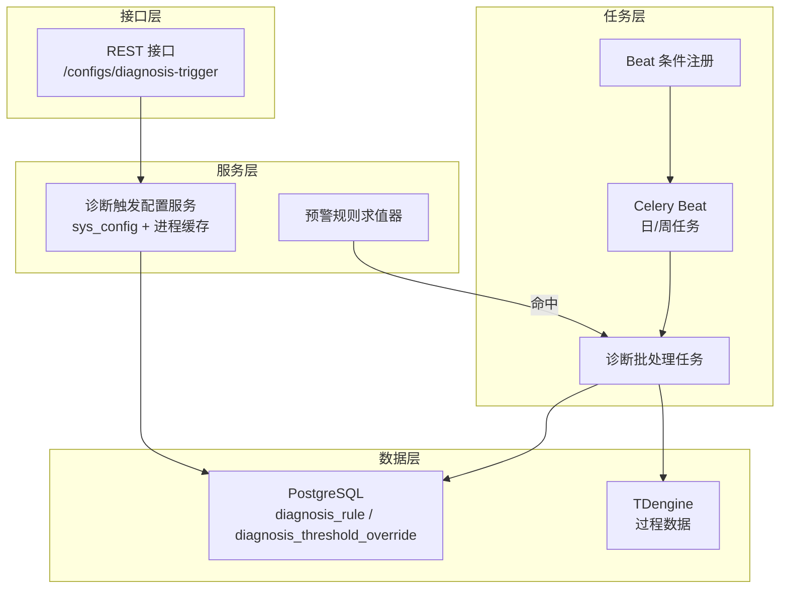
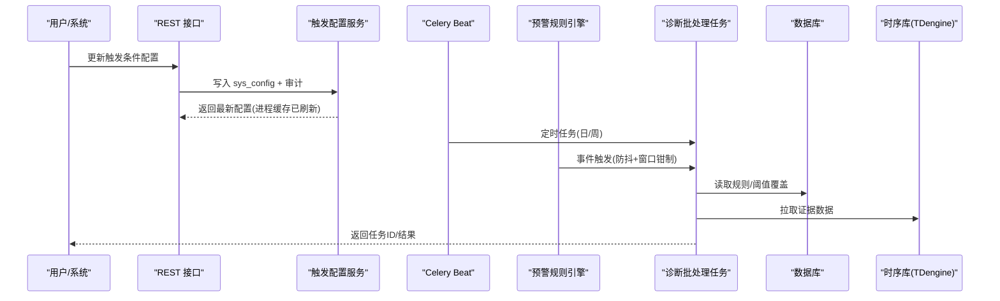
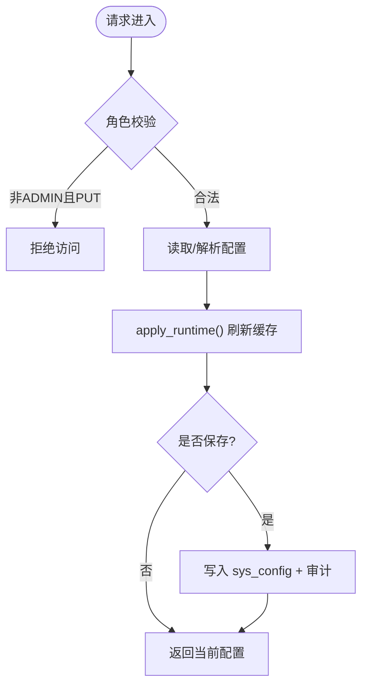
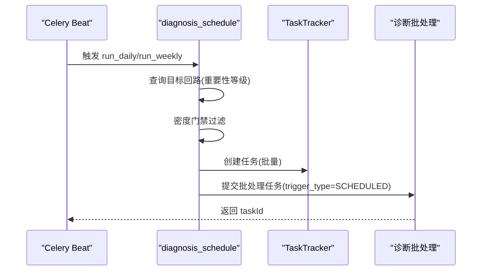
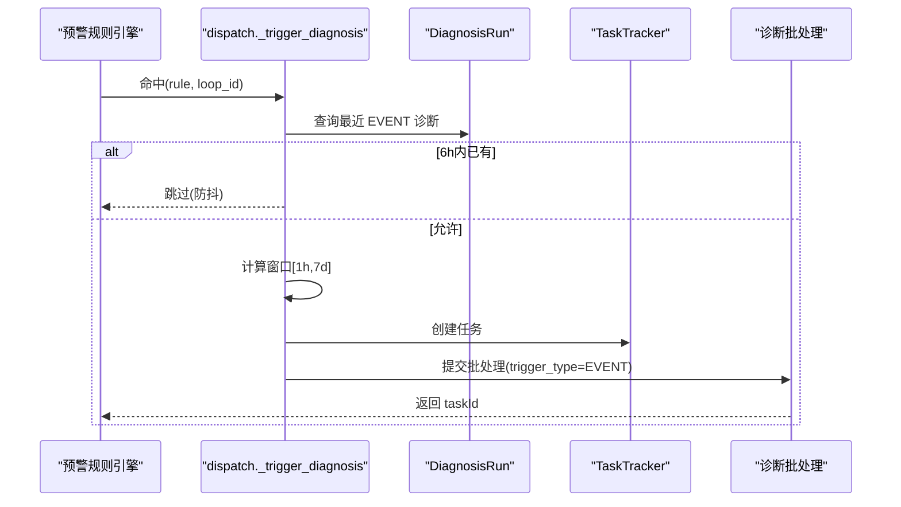
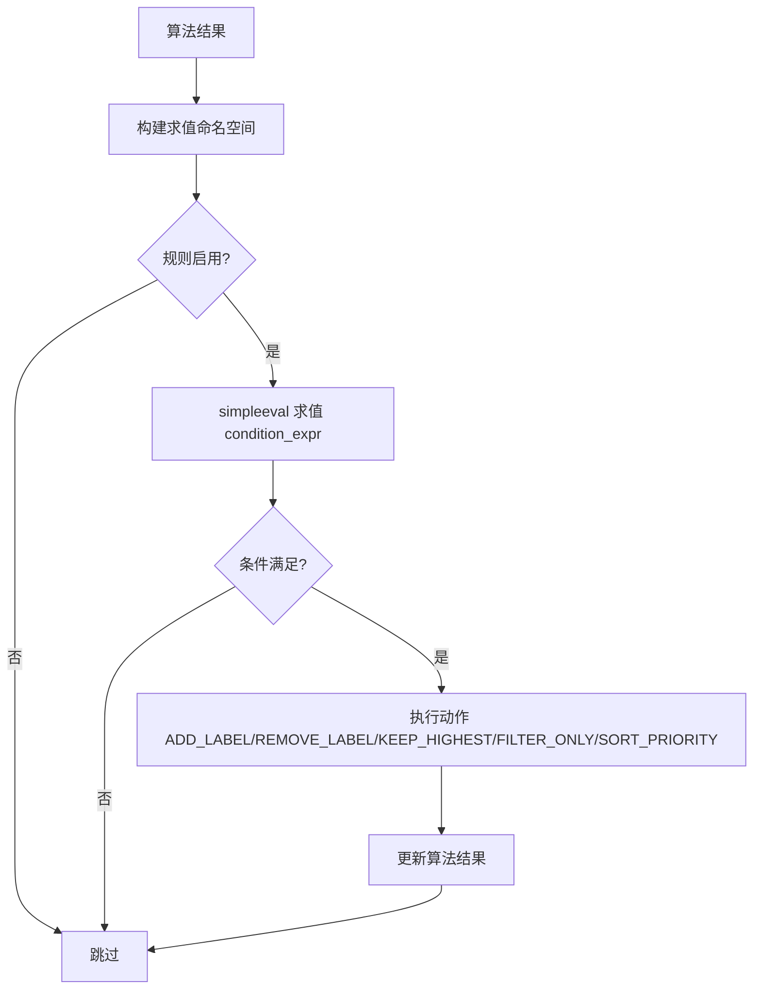
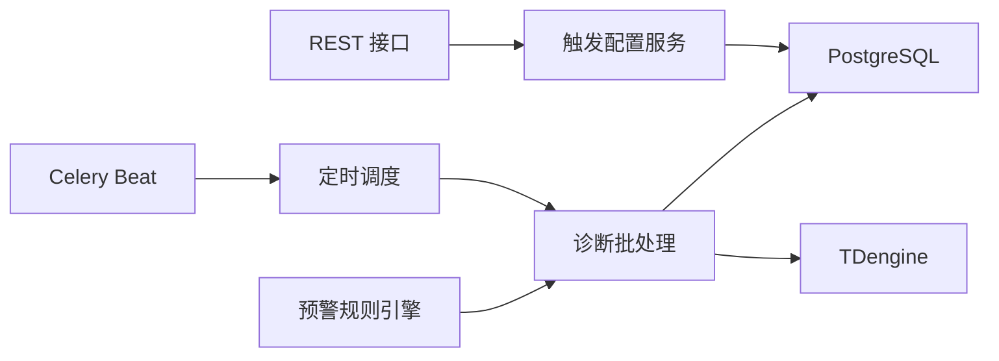

# 诊断触发机制

<cite>
**本文引用的文件**
- [diagnosis_trigger_config.py](file://backend/app/services/diagnosis_trigger_config.py)
- [diagnosis_trigger_config.py](file://backend/app/api/v1/endpoints/diagnosis_trigger_config.py)
- [diagnosis_schedule.py](file://backend/app/tasks/diagnosis_schedule.py)
- [dispatcher.py](file://backend/app/services/alert_rule_engine/dispatcher.py)
- [beat_registry.py](file://backend/app/tasks/beat_registry.py)
- [diagnosis.py](file://backend/app/models/diagnosis.py)
- [config.py](file://backend/app/schemas/config.py)
- [01_schema.sql](file://db/postgresql/01_schema.sql)
- [a7b8c9d0e1f2_add_diagnosis_run_trigger_type.py](file://backend/alembic/versions/a7b8c9d0e1f2_add_diagnosis_run_trigger_type.py)
- [evaluator.py](file://backend/app/services/alert_rule_engine/evaluator.py)
</cite>

## 目录
1. [简介](#简介)
2. [项目结构](#项目结构)
3. [核心组件](#核心组件)
4. [架构总览](#架构总览)
5. [详细组件分析](#详细组件分析)
6. [依赖关系分析](#依赖关系分析)
7. [性能与批量优化](#性能与批量优化)
8. [故障排查指南](#故障排查指南)
9. [结论](#结论)
10. [附录：API 调用示例与配置模板](#附录api-调用示例与配置模板)

## 简介
本文件围绕“诊断触发机制”提供完整技术说明，覆盖三种触发方式（手动 API、定时调度 Celery Beat、事件驱动），并详细说明触发配置的 DSL 语法（规则表达式、条件组合、阈值配置）、触发优先级与冲突解决、频率控制、批量处理优化与性能调优。文末提供可直接使用的 API 调用示例与配置模板。

## 项目结构
诊断触发机制由以下关键模块协同完成：
- 手动触发：通过 REST API 更新“诊断触发条件配置”，服务层写入 sys_config 并刷新进程内缓存；引擎热路径直接读取缓存。
- 定时触发：Celery Beat 注册每日/每周任务，按回路重要性等级发起批量诊断。
- 事件触发：预警规则引擎命中后，防抖检查并异步发起诊断。
- 配置与模型：诊断规则、阈值覆盖、触发类型等数据模型与数据库表。

**图表来源**
- [diagnosis_trigger_config.py:1-103](file://backend/app/api/v1/endpoints/diagnosis_trigger_config.py#L1-L103)
- [diagnosis_trigger_config.py:1-230](file://backend/app/services/diagnosis_trigger_config.py#L1-L230)
- [diagnosis_schedule.py:1-182](file://backend/app/tasks/diagnosis_schedule.py#L1-L182)
- [dispatcher.py:260-362](file://backend/app/services/alert_rule_engine/dispatcher.py#L260-L362)
- [beat_registry.py:1-41](file://backend/app/tasks/beat_registry.py#L1-L41)
- [diagnosis.py:200-357](file://backend/app/models/diagnosis.py#L200-L357)

**章节来源**
- [diagnosis_trigger_config.py:1-103](file://backend/app/api/v1/endpoints/diagnosis_trigger_config.py#L1-L103)
- [diagnosis_trigger_config.py:1-230](file://backend/app/services/diagnosis_trigger_config.py#L1-L230)
- [diagnosis_schedule.py:1-182](file://backend/app/tasks/diagnosis_schedule.py#L1-L182)
- [dispatcher.py:260-362](file://backend/app/services/alert_rule_engine/dispatcher.py#L260-L362)
- [beat_registry.py:1-41](file://backend/app/tasks/beat_registry.py#L1-L41)
- [diagnosis.py:200-357](file://backend/app/models/diagnosis.py#L200-L357)

## 核心组件
- 诊断触发条件配置服务：负责从 sys_config 加载 JSON 配置，应用为进程内缓存，供热路径快速读取；支持保存时审计与即时生效。
- 分级定时调度：按回路重要性等级（1级/2级）在固定时间窗口执行，带密度门禁过滤低质量数据。
- 事件驱动触发：预警规则引擎命中后，基于规则 DSL 的 windowSeconds 计算诊断窗口，并进行防抖与幂等保护。
- 规则与阈值体系：专家规则（simpleeval 安全沙箱）与四级阈值覆盖（全局默认→回路类型模板→装置级→回路级）。

**章节来源**
- [diagnosis_trigger_config.py:1-230](file://backend/app/services/diagnosis_trigger_config.py#L1-L230)
- [diagnosis_schedule.py:1-182](file://backend/app/tasks/diagnosis_schedule.py#L1-L182)
- [dispatcher.py:260-362](file://backend/app/services/alert_rule_engine/dispatcher.py#L260-L362)
- [diagnosis.py:200-357](file://backend/app/models/diagnosis.py#L200-L357)

## 架构总览
三层触发统一汇聚到“诊断批处理任务”，以不同 trigger_type 区分来源：MANUAL、SCHEDULED、EVENT。

**图表来源**
- [diagnosis_trigger_config.py:1-103](file://backend/app/api/v1/endpoints/diagnosis_trigger_config.py#L1-L103)
- [diagnosis_trigger_config.py:1-230](file://backend/app/services/diagnosis_trigger_config.py#L1-L230)
- [diagnosis_schedule.py:155-182](file://backend/app/tasks/diagnosis_schedule.py#L155-L182)
- [dispatcher.py:277-362](file://backend/app/services/alert_rule_engine/dispatcher.py#L277-L362)

## 详细组件分析

### 手动触发（API 调用）
- 入口：GET/PUT /api/v1/configs/diagnosis-trigger
- 行为：
  - GET：若未配置则返回默认值；否则从 DB 读取最新配置并刷新进程缓存。
  - PUT：仅 ADMIN 可写；写入 sys_config（JSON），记录审计日志，立即刷新进程缓存。
- 配置项（camelCase 存储键）：
  - scoreThreshold：评分阈值（跌破即触发）
  - concurrency：并发 worker 数
  - minDataPoints：最少数据点数
  - checkupEnabled：体检轨开关
- 运行时：热路径通过 get_trigger_config() 读取进程缓存，不查库。

**图表来源**
- [diagnosis_trigger_config.py:41-103](file://backend/app/api/v1/endpoints/diagnosis_trigger_config.py#L41-L103)
- [diagnosis_trigger_config.py:79-118](file://backend/app/services/diagnosis_trigger_config.py#L79-L118)

**章节来源**
- [diagnosis_trigger_config.py:1-103](file://backend/app/api/v1/endpoints/diagnosis_trigger_config.py#L1-L103)
- [diagnosis_trigger_config.py:1-230](file://backend/app/services/diagnosis_trigger_config.py#L1-L230)

### 定时调度（Celery Beat）
- 任务：
  - run_daily：每日 01:10，1级关键回路，近24h窗口
  - run_weekly：每周日 02:10，2级重要回路，近7d窗口
- 前置门禁：密度门禁（窗口行数≥预期×0.5），缺数跳过，避免无效诊断。
- 执行：批量创建 TaskTracker 任务，调用诊断批处理任务，trigger_type=SCHEDULED。
- Beat 注册：追加式注册，避免覆盖其他模块；支持模块热插拔禁用。

**图表来源**
- [diagnosis_schedule.py:75-152](file://backend/app/tasks/diagnosis_schedule.py#L75-L152)
- [diagnosis_schedule.py:155-182](file://backend/app/tasks/diagnosis_schedule.py#L155-L182)
- [beat_registry.py:1-41](file://backend/app/tasks/beat_registry.py#L1-L41)

**章节来源**
- [diagnosis_schedule.py:1-182](file://backend/app/tasks/diagnosis_schedule.py#L1-L182)
- [beat_registry.py:1-41](file://backend/app/tasks/beat_registry.py#L1-L41)

### 事件驱动（实时数据变化）
- 触发源：预警规则引擎命中后，自动发起该回路诊断（trigger_type=EVENT）。
- 防抖：同回路6小时内已有 EVENT 诊断则跳过（幂等，防连环触发）。
- 窗口：windowSeconds 来自规则 DSL，钳制在 [1h, 7d]。
- 执行：独立 TaskTracker 建单，失败不影响其他动作。

**图表来源**
- [dispatcher.py:277-362](file://backend/app/services/alert_rule_engine/dispatcher.py#L277-L362)

**章节来源**
- [dispatcher.py:260-362](file://backend/app/services/alert_rule_engine/dispatcher.py#L260-L362)

### DSL 语法：规则表达式、条件组合、阈值配置
- 规则表达式：使用 simpleeval 安全沙箱求值 condition_expr，构建算法结果命名空间进行求值。
- 条件组合：支持 AND/OR/NOT 的组合条件（简化版 Phase 1），并可结合可信度联动（如 maxLevel）。
- 阈值配置：四级覆盖（全局默认→回路类型模板→装置级→回路级），合并顺序保证最高优先级生效。

**图表来源**
- [diagnosis.py:204-247](file://backend/app/models/diagnosis.py#L204-L247)
- [diagnosis.py:250-295](file://backend/app/models/diagnosis.py#L250-L295)
- [diagnosis_threshold.py:252-335](file://backend/app/services/diagnosis_threshold.py#L252-L335)
- [diagnosis_rule.py:121-315](file://backend/app/services/diagnosis_rule.py#L121-L315)

**章节来源**
- [diagnosis.py:200-357](file://backend/app/models/diagnosis.py#L200-L357)
- [diagnosis_threshold.py:252-335](file://backend/app/services/diagnosis_threshold.py#L252-L335)
- [diagnosis_rule.py:121-315](file://backend/app/services/diagnosis_rule.py#L121-L315)

### 触发优先级与冲突解决
- 触发来源优先级：无显式全局优先级，但通过 trigger_type 区分来源（MANUAL/SCHEDULED/EVENT），便于统计与治理。
- 规则执行优先级：按 priority 升序逐条执行，先执行的规则对后续规则输入产生影响。
- 阈值覆盖优先级：loop > plant > loop_type > 全局默认，确保细粒度覆盖生效。
- 冲突解决：
  - 事件防抖：同回路6小时内重复 EVENT 触发被抑制。
  - 密度门禁：定时任务对数据不足回路跳过，减少无效诊断。
  - 模块热插拔：诊断模块禁用时，事件触发降级跳过。

**章节来源**
- [a7b8c9d0e1f2_add_diagnosis_run_trigger_type.py:1-40](file://backend/alembic/versions/a7b8c9d0e1f2_add_diagnosis_run_trigger_type.py#L1-L40)
- [diagnosis_schedule.py:75-152](file://backend/app/tasks/diagnosis_schedule.py#L75-L152)
- [dispatcher.py:277-362](file://backend/app/services/alert_rule_engine/dispatcher.py#L277-L362)
- [diagnosis_threshold.py:252-335](file://backend/app/services/diagnosis_threshold.py#L252-L335)

### 触发频率控制、批量处理优化与性能调优
- 频率控制：
  - 定时：每日/每周固定时间点，避免高频全量。
  - 事件：6小时防抖窗口，防止风暴。
  - 窗口钳制：事件诊断窗口限制在 [1h, 7d]，平衡证据量与数据量。
- 批量处理：
  - 分级定时按等级聚合批量建任务，减少任务碎片。
  - 密度门禁提前过滤低质量回路，降低无效计算。
- 性能调优：
  - 进程内缓存：触发配置热路径不查库，降低延迟。
  - 模块热插拔：按需启用/禁用诊断相关 beat 条目。
  - 超时与重试：建议结合 Celery 超时与重试策略（通用实践）。

**章节来源**
- [diagnosis_trigger_config.py:94-118](file://backend/app/services/diagnosis_trigger_config.py#L94-L118)
- [diagnosis_schedule.py:75-152](file://backend/app/tasks/diagnosis_schedule.py#L75-L152)
- [dispatcher.py:277-362](file://backend/app/services/alert_rule_engine/dispatcher.py#L277-L362)
- [beat_registry.py:1-41](file://backend/app/tasks/beat_registry.py#L1-L41)

## 依赖关系分析
- 接口层依赖服务层：REST 接口调用诊断触发配置服务。
- 服务层依赖数据模型：读写 sys_config、审计日志、诊断规则与阈值覆盖。
- 任务层依赖调度与外部系统：Celery Beat 触发任务，任务访问 PostgreSQL 与 TDengine。
- 模块热插拔：通过 beat_init 信号动态移除禁用模块的 beat 条目。

**图表来源**
- [diagnosis_trigger_config.py:1-103](file://backend/app/api/v1/endpoints/diagnosis_trigger_config.py#L1-L103)
- [diagnosis_schedule.py:155-182](file://backend/app/tasks/diagnosis_schedule.py#L155-L182)
- [dispatcher.py:277-362](file://backend/app/services/alert_rule_engine/dispatcher.py#L277-L362)

**章节来源**
- [diagnosis_trigger_config.py:1-103](file://backend/app/api/v1/endpoints/diagnosis_trigger_config.py#L1-L103)
- [diagnosis_schedule.py:155-182](file://backend/app/tasks/diagnosis_schedule.py#L155-L182)
- [dispatcher.py:277-362](file://backend/app/services/alert_rule_engine/dispatcher.py#L277-L362)

## 性能与批量优化
- 进程缓存：触发配置读路径走内存缓存，避免频繁 DB 访问。
- 密度门禁：定时任务前置过滤，减少无效诊断。
- 防抖与窗口钳制：事件触发防抖与窗口范围限制，避免过载。
- 批量任务：按等级聚合批量建任务，提升吞吐。
- 模块热插拔：按需启用/禁用诊断相关 beat，降低资源占用。

[本节为通用性能指导，不直接分析具体文件]

## 故障排查指南
- 配置未生效：
  - 确认 PUT 成功并刷新了进程缓存；检查审计日志。
  - 验证 sys_config 中 key 的值格式正确。
- 事件触发被跳过：
  - 检查最近 EVENT 诊断是否在6小时内；确认诊断模块是否启用。
- 定时任务未执行：
  - 检查 Beat 是否注册了对应条目；确认模块是否被禁用。
- 数据不足导致跳过：
  - 查看密度门禁日志；确认 TDengine 数据完整性。

**章节来源**
- [diagnosis_trigger_config.py:79-118](file://backend/app/services/diagnosis_trigger_config.py#L79-L118)
- [dispatcher.py:277-362](file://backend/app/services/alert_rule_engine/dispatcher.py#L277-L362)
- [diagnosis_schedule.py:75-152](file://backend/app/tasks/diagnosis_schedule.py#L75-L152)

## 结论
诊断触发机制通过“手动 API + 定时调度 + 事件驱动”三轨并行，结合 DSL 规则与四级阈值覆盖，实现灵活、可控、可追溯的诊断触发。通过进程缓存、密度门禁、防抖与窗口钳制等手段，保障高可用与高性能。建议在生产环境结合监控与告警，持续优化触发策略与资源配置。

[本节为总结性内容，不直接分析具体文件]

## 附录：API 调用示例与配置模板
- 获取当前触发配置
  - 方法：GET
  - 路径：/api/v1/configs/diagnosis-trigger
  - 响应：包含 scoreThreshold、concurrency、minDataPoints、checkupEnabled 等字段
- 更新触发配置
  - 方法：PUT
  - 路径：/api/v1/configs/diagnosis-trigger
  - 请求体：scoreThreshold、concurrency、minDataPoints、checkupEnabled
  - 权限：仅 ADMIN
- 配置模板（JSON）
  - {
      "scoreThreshold": 60,
      "concurrency": 5,
      "minDataPoints": 32,
      "checkupEnabled": true
    }

**章节来源**
- [diagnosis_trigger_config.py:41-103](file://backend/app/api/v1/endpoints/diagnosis_trigger_config.py#L41-L103)
- [config.py:800-887](file://backend/app/schemas/config.py#L800-L887)