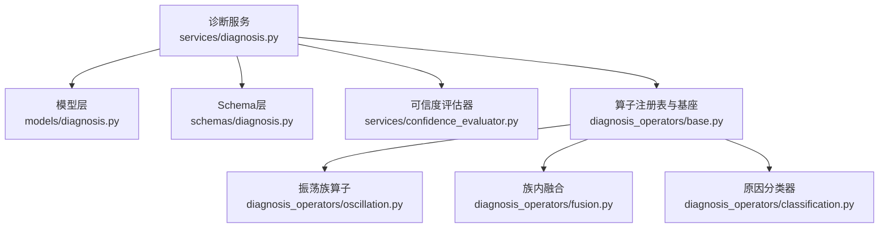
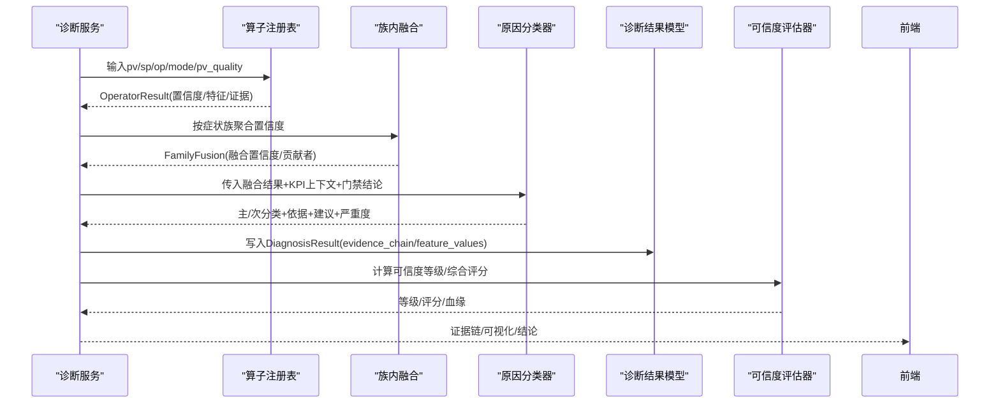
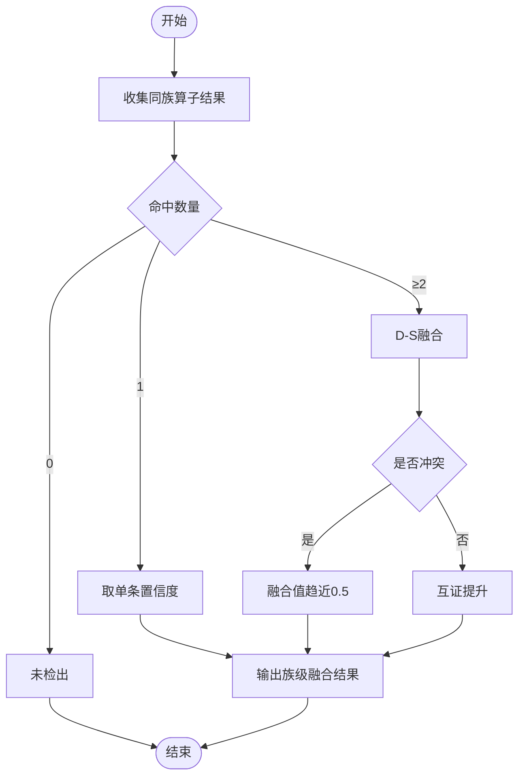
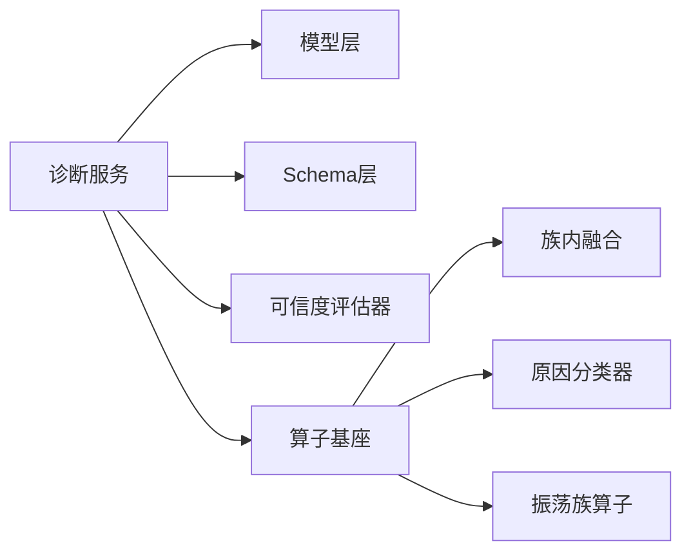

# 证据链分析

<cite>
**本文引用的文件**
- [backend/app/services/diagnosis.py](file://backend/app/services/diagnosis.py)
- [backend/app/models/diagnosis.py](file://backend/app/models/diagnosis.py)
- [backend/app/schemas/diagnosis.py](file://backend/app/schemas/diagnosis.py)
- [backend/app/services/confidence_evaluator.py](file://backend/app/services/confidence_evaluator.py)
- [backend/app/services/diagnosis_operators/base.py](file://backend/app/services/diagnosis_operators/base.py)
- [backend/app/services/diagnosis_operators/fusion.py](file://backend/app/services/diagnosis_operators/fusion.py)
- [backend/app/services/diagnosis_operators/classification.py](file://backend/app/services/diagnosis_operators/classification.py)
- [backend/app/services/diagnosis_operators/oscillation.py](file://backend/app/services/diagnosis_operators/oscillation.py)
</cite>

## 目录
1. [简介](#简介)
2. [项目结构](#项目结构)
3. [核心组件](#核心组件)
4. [架构总览](#架构总览)
5. [详细组件分析](#详细组件分析)
6. [依赖关系分析](#依赖关系分析)
7. [性能考虑](#性能考虑)
8. [故障排查指南](#故障排查指南)
9. [结论](#结论)
10. [附录](#附录)

## 简介
本技术文档围绕“证据链分析模块”，系统性说明：
- 证据链数据结构与字段格式（evidence_chain、feature_values、fused_confidence）
- 8类诊断算法的证据生成（特征值、中间结果、判定依据）
- 多源证据融合机制（族内D-S融合、冲突处理、最终结论生成）
- 可视化数据准备（波形图、散点图、时序分析的格式转换）
- 证据链验证机制（完整性检查、逻辑一致性、异常数据处理）
- 调试工具与性能优化建议

该模块以“算子化+族内融合+分类决策”的流水线组织，确保可解释、可追溯、可扩展。

## 项目结构
证据链相关代码主要分布在以下位置：
- 服务层：diagnosis.py（列表/详情/可视化）、confidence_evaluator.py（可信度评估与综合评分）
- 模型层：diagnosis.py（DiagnosisResult/DiagnosisConfig/DiagnosisTag等）
- Schema层：diagnosis.py（API契约、证据链/标签/报表等）
- 算子层：diagnosis_operators/*（无状态纯函数算子、注册表、族内融合、分类器）

图表来源
- [backend/app/services/diagnosis.py:617-738](file://backend/app/services/diagnosis.py#L617-L738)
- [backend/app/models/diagnosis.py:51-88](file://backend/app/models/diagnosis.py#L51-L88)
- [backend/app/schemas/diagnosis.py:371-408](file://backend/app/schemas/diagnosis.py#L371-L408)
- [backend/app/services/confidence_evaluator.py:95-221](file://backend/app/services/confidence_evaluator.py#L95-L221)
- [backend/app/services/diagnosis_operators/base.py:29-85](file://backend/app/services/diagnosis_operators/base.py#L29-L85)
- [backend/app/services/diagnosis_operators/oscillation.py:223-323](file://backend/app/services/diagnosis_operators/oscillation.py#L223-L323)
- [backend/app/services/diagnosis_operators/fusion.py:16-96](file://backend/app/services/diagnosis_operators/fusion.py#L16-L96)
- [backend/app/services/diagnosis_operators/classification.py:190-461](file://backend/app/services/diagnosis_operators/classification.py#L190-L461)

章节来源
- [backend/app/services/diagnosis.py:617-738](file://backend/app/services/diagnosis.py#L617-L738)
- [backend/app/models/diagnosis.py:51-88](file://backend/app/models/diagnosis.py#L51-L88)
- [backend/app/schemas/diagnosis.py:371-408](file://backend/app/schemas/diagnosis.py#L371-L408)

## 核心组件
- 诊断服务（列表/详情/可视化）：负责组装证据链、读取特征值、构造可视化数据块、输出fused_confidence
- 模型层：持久化诊断结果（含evidence_chain、feature_values、confidence、algorithm_version）
- 可信度评估器：基于有效数据率计算A-E等级，提供综合评分与血缘构建
- 算子系统：无状态算子注册表、族内D-S融合、原因分类器（污染链降级）
- 振荡族算子：FFT频域检测 + IAE零交叉相似率，产出特征与证据项

章节来源
- [backend/app/services/diagnosis.py:617-738](file://backend/app/services/diagnosis.py#L617-L738)
- [backend/app/models/diagnosis.py:51-88](file://backend/app/models/diagnosis.py#L51-L88)
- [backend/app/services/confidence_evaluator.py:95-221](file://backend/app/services/confidence_evaluator.py#L95-L221)
- [backend/app/services/diagnosis_operators/base.py:29-85](file://backend/app/services/diagnosis_operators/base.py#L29-L85)
- [backend/app/services/diagnosis_operators/oscillation.py:223-323](file://backend/app/services/diagnosis_operators/oscillation.py#L223-L323)

## 架构总览
证据链从“原始信号→算子计算→族内融合→分类决策→可视化输出”的完整链路如下：

图表来源
- [backend/app/services/diagnosis.py:617-738](file://backend/app/services/diagnosis.py#L617-L738)
- [backend/app/services/diagnosis_operators/fusion.py:64-96](file://backend/app/services/diagnosis_operators/fusion.py#L64-L96)
- [backend/app/services/diagnosis_operators/classification.py:190-461](file://backend/app/services/diagnosis_operators/classification.py#L190-L461)
- [backend/app/models/diagnosis.py:51-88](file://backend/app/models/diagnosis.py#L51-L88)
- [backend/app/services/confidence_evaluator.py:253-475](file://backend/app/services/confidence_evaluator.py#L253-L475)

## 详细组件分析

### 证据链数据结构与字段格式
- 存储位置：DiagnosisResult.evidence_chain（JSON），feature_values（JSON）
- 证据链关键字段：
  - waveformUrl：波形查询URL（由诊断时间窗推导）
  - scatterPlot：PV-OP散点数据（x/y数组或来自evidence_chain）
  - reasoning：推理摘要文本
  - fused_confidence：融合后的综合置信度（从evidence_chain读取）
- 列表接口会同时返回单标签confidence与fused_confidence；详情接口将证据链与可视化数据一并返回

章节来源
- [backend/app/models/diagnosis.py:51-88](file://backend/app/models/diagnosis.py#L51-L88)
- [backend/app/services/diagnosis.py:617-738](file://backend/app/services/diagnosis.py#L617-L738)
- [backend/app/schemas/diagnosis.py:371-408](file://backend/app/schemas/diagnosis.py#L371-L408)

### 8类诊断算法的证据生成
- 振荡（OSCILLATION）：FFT主峰能量占比、频率、幅值；IAE半周期相似率、零交叉数、平均周期；阈值包括相似度阈值、最小零交叉数、频谱阈值等
- 阀门粘滞（VALVE_STICTION）：椭圆拟合得分、Choudhury NGI/NLI、Kano粘滞比、PV-OP相关性等
- 参数过激（OVERAGGRESSIVE）：阶跃响应超调量、衰减比、稳态误差、Harris指数
- 参数过保守（OVERCONSERVATIVE）：实际/期望时间常数比值
- 外扰频繁（EXTERNAL_DISTURBANCE）：CUSUM累积和正负分支、突变点、最大累积和、漂移次数
- PV质量异常（QUALITY_ABNORMAL）：坏点率、总点数、坏点数、质量模式；传感器故障（卡死/噪声/漂移）子类型
- 输出饱和（OUTPUT_SATURATION）：高/低饱和次数、饱和时长占比
- 人工复核（MANUAL_REVIEW）：兜底标签，不参与自动阈值判定

章节来源
- [backend/app/services/diagnosis.py:65-222](file://backend/app/services/diagnosis.py#L65-L222)
- [backend/app/services/diagnosis_operators/oscillation.py:223-323](file://backend/app/services/diagnosis_operators/oscillation.py#L223-L323)

### 多源证据融合与冲突解决
- 族内融合：同一症状假设（如振荡族）下≥2个算子命中时进行Dempster-Shafer融合；单条命中原样传递；零命中未检出
- 冲突处理：当证据完全冲突（如高置信与低置信并存）时，融合值趋近中性（约0.5），避免误判
- 最终结论：分类器按优先级决策表选择主因，并考虑污染链降级（通信→仪表/阀门/工艺/参数；仪表→阀门/工艺/参数；阀门/工艺→参数）

图表来源
- [backend/app/services/diagnosis_operators/fusion.py:16-96](file://backend/app/services/diagnosis_operators/fusion.py#L16-L96)
- [backend/app/services/diagnosis_operators/classification.py:190-461](file://backend/app/services/diagnosis_operators/classification.py#L190-L461)

章节来源
- [backend/app/services/diagnosis_operators/fusion.py:16-96](file://backend/app/services/diagnosis_operators/fusion.py#L16-L96)
- [backend/app/services/diagnosis_operators/classification.py:190-461](file://backend/app/services/diagnosis_operators/classification.py#L190-L461)

### 可视化数据准备
- 波形图：通过waveformUrl指向后端时序接口，时间窗由诊断时间推导
- 散点图：优先使用evidence_chain.scatter_plot；若缺失则回退到feature_values中的scatter_plot_x/y
- 时序分析：各算法对应的时序数据键（如fft_frequencies/amplitudes、cusum_timestamps、step_timestamps等）在可视化接口中映射为统一的数据块

章节来源
- [backend/app/services/diagnosis.py:700-800](file://backend/app/services/diagnosis.py#L700-L800)
- [backend/app/schemas/diagnosis.py:416-437](file://backend/app/schemas/diagnosis.py#L416-L437)

### 可信度传递机制
- 指标可信度：基于有效数据率valid_rate判定A-E等级（默认阈值A≥0.95，B≥0.80，C≥0.60，D≥0.20，E<0.20）
- 综合评分：P = (A·a + F·f + S·s)/(a+f+s) × R，R为有效自控率折扣因子；缺失或E级导致整体INCONCLUSIVE
- 血缘构建：记录采样频率、聚合策略、质量策略、tag_group、data_block_ids、valid_rate、预处理版本、算法版本

章节来源
- [backend/app/services/confidence_evaluator.py:95-221](file://backend/app/services/confidence_evaluator.py#L95-L221)
- [backend/app/services/confidence_evaluator.py:253-475](file://backend/app/services/confidence_evaluator.py#L253-L475)

### 证据链验证机制
- 数据完整性检查：算子对输入长度/信号存在性做前置校验（如pv/sp长度不足直接跳过）
- 逻辑一致性验证：分类器按决策表顺序执行，结合污染链降级保证主因合理性
- 异常数据处理：算子内部try-except捕获异常并返回空结果；融合对边界情况（全0/全1/冲突）做保护

章节来源
- [backend/app/services/diagnosis_operators/oscillation.py:246-323](file://backend/app/services/diagnosis_operators/oscillation.py#L246-L323)
- [backend/app/services/diagnosis_operators/classification.py:190-461](file://backend/app/services/diagnosis_operators/classification.py#L190-L461)

## 依赖关系分析
- 诊断服务依赖模型层持久化、Schema层契约、可信度评估器、算子系统
- 算子系统内部：base定义元数据与注册表；fusion实现族内融合；classification实现原因分类；具体算子（如oscillation）产出特征与证据
- 外部依赖：numpy/scipy用于数值计算；数据库用于配置与结果存储

图表来源
- [backend/app/services/diagnosis.py:617-738](file://backend/app/services/diagnosis.py#L617-L738)
- [backend/app/services/diagnosis_operators/base.py:29-85](file://backend/app/services/diagnosis_operators/base.py#L29-L85)
- [backend/app/services/diagnosis_operators/fusion.py:16-96](file://backend/app/services/diagnosis_operators/fusion.py#L16-L96)
- [backend/app/services/diagnosis_operators/classification.py:190-461](file://backend/app/services/diagnosis_operators/classification.py#L190-L461)
- [backend/app/services/diagnosis_operators/oscillation.py:223-323](file://backend/app/services/diagnosis_operators/oscillation.py#L223-L323)

章节来源
- [backend/app/services/diagnosis.py:617-738](file://backend/app/services/diagnosis.py#L617-L738)
- [backend/app/services/diagnosis_operators/base.py:29-85](file://backend/app/services/diagnosis_operators/base.py#L29-L85)

## 性能考虑
- 算子无状态：纯函数+阈值注入，便于并行执行与缓存
- 族内融合仅在同族内进行，减少跨族计算开销
- 可视化数据按需拉取（waveformUrl），避免一次性传输大数组
- 可信度阈值支持运行时更新（Redis pub/sub），无需重启服务

[本节为通用指导，不直接分析具体文件]

## 故障排查指南
- 数据不足：检查pv/sp长度与采样间隔，确认算子skip_reason
- 融合异常：核对同族命中数量与置信度分布，观察冲突导致的融合值趋中
- 分类不合理：查看污染链降级与决策表路径，确认主因与次分类依据
- 可视化空白：确认scatter_plot是否存在，必要时回退到feature_values中的x/y数组

章节来源
- [backend/app/services/diagnosis_operators/oscillation.py:246-323](file://backend/app/services/diagnosis_operators/oscillation.py#L246-L323)
- [backend/app/services/diagnosis_operators/fusion.py:16-96](file://backend/app/services/diagnosis_operators/fusion.py#L16-L96)
- [backend/app/services/diagnosis_operators/classification.py:190-461](file://backend/app/services/diagnosis_operators/classification.py#L190-L461)
- [backend/app/services/diagnosis.py:700-800](file://backend/app/services/diagnosis.py#L700-L800)

## 结论
证据链分析模块通过“算子化+族内融合+分类决策”实现了可解释的诊断流程：
- 数据结构清晰：evidence_chain承载可视化与推理，feature_values保存中间特征
- 算法透明：8类算法输出明确，阈值可配置，置信度可追溯
- 融合稳健：D-S融合处理冲突，污染链降级保障主因合理性
- 可视化友好：波形/散点/时序数据按需转换，便于前端展示
- 验证完备：完整性检查、逻辑一致性与异常处理覆盖关键路径

[本节为总结，不直接分析具体文件]

## 附录
- 调试建议：
  - 打印算子executed/detected/confidence与features，定位失败环节
  - 检查族内融合contributor列表，确认命中算子与置信度
  - 查看分类器rationale与contamination_note，理解降级逻辑
- 性能优化：
  - 合理设置时间窗与采样率，避免过长序列导致计算压力
  - 利用fast_group快速路径（如IAE振荡）提升吞吐
  - 缓存常用阈值与元数据，减少重复加载

[本节为通用指导，不直接分析具体文件]