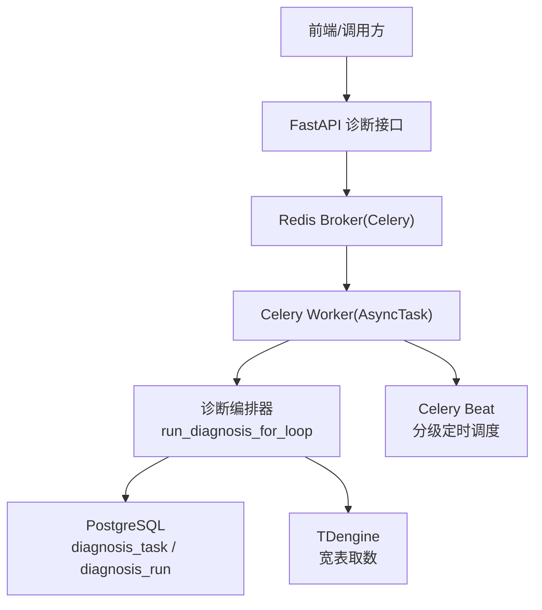
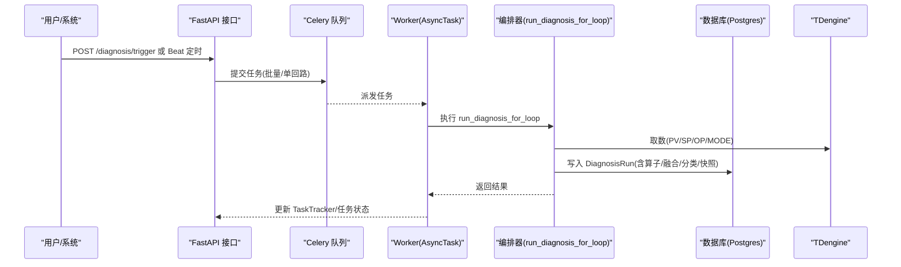
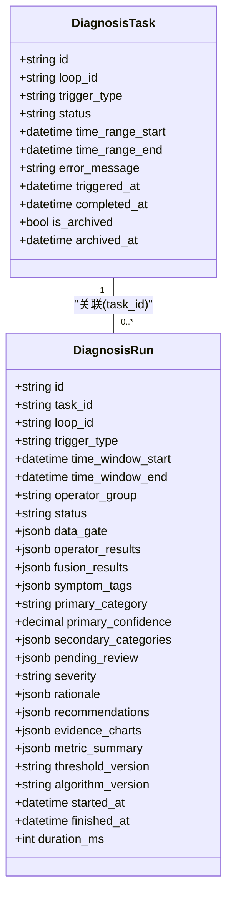
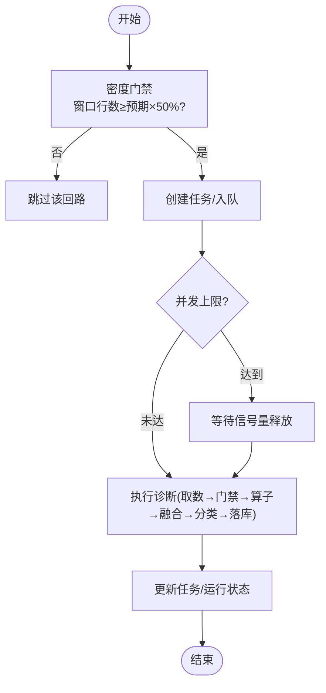
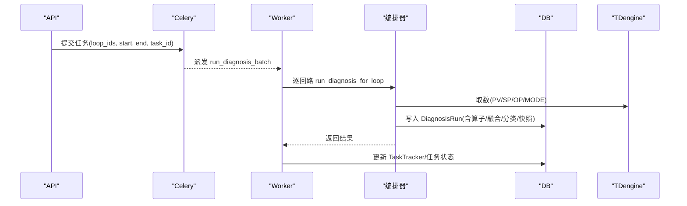
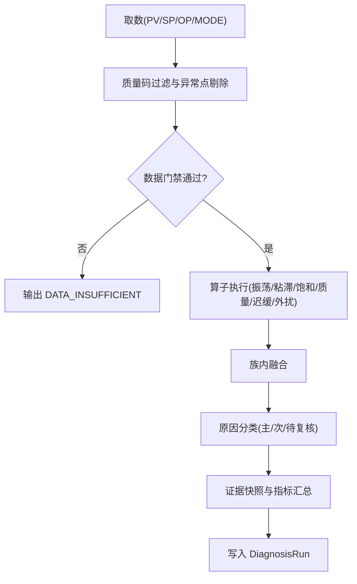
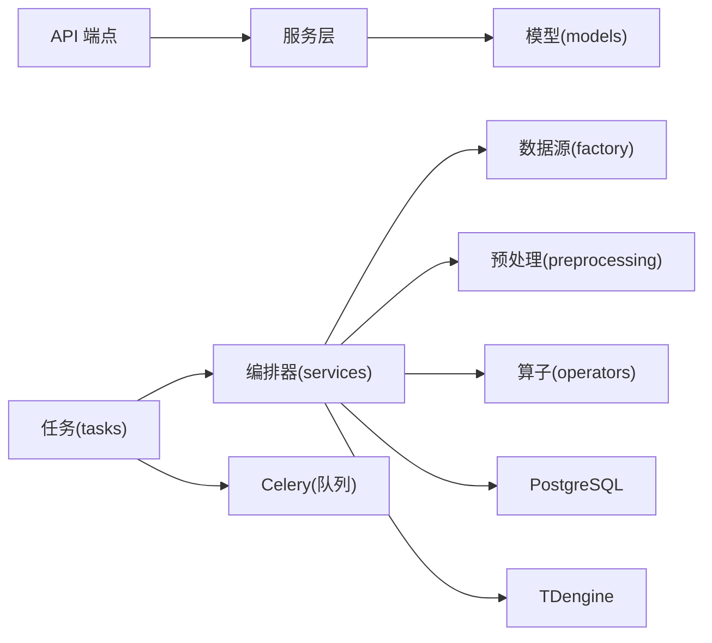

# 诊断任务调度器

<cite>
**本文引用的文件**
- [backend/app/models/diagnosis.py](file://backend/app/models/diagnosis.py)
- [backend/app/models/diagnosis_run.py](file://backend/app/models/diagnosis_run.py)
- [backend/app/tasks/celery_app.py](file://backend/app/tasks/celery_app.py)
- [backend/app/tasks/diagnosis_engine.py](file://backend/app/tasks/diagnosis_engine.py)
- [backend/app/tasks/diagnosis_schedule.py](file://backend/app/tasks/diagnosis_schedule.py)
- [backend/app/tasks/diagnosis_v2.py](file://backend/app/tasks/diagnosis_v2.py)
- [backend/app/services/diagnosis_orchestrator.py](file://backend/app/services/diagnosis_orchestrator.py)
- [backend/app/api/v1/endpoints/diagnosis.py](file://backend/app/api/v1/endpoints/diagnosis.py)
</cite>

## 目录
1. [简介](#简介)
2. [项目结构](#项目结构)
3. [核心组件](#核心组件)
4. [架构总览](#架构总览)
5. [详细组件分析](#详细组件分析)
6. [依赖关系分析](#依赖关系分析)
7. [性能考虑](#性能考虑)
8. [故障排查指南](#故障排查指南)
9. [结论](#结论)
10. [附录：配置与监控接口](#附录：配置与监控接口)

## 简介
本技术文档面向“诊断任务调度器”，系统性说明诊断任务的触发、队列管理、并发控制、模型设计（状态机、优先级、重试）、执行流程（创建→入队→消费→持久化→状态更新）、依赖关系（数据准备、指标计算、诊断算法）、监控接口、失败处理策略与性能优化方案，并给出可操作的配置选项与故障排查指南。

## 项目结构
后端采用 Celery + FastAPI 的异步任务架构：
- API 层：提供诊断任务触发、查询、归档等接口
- 任务层：Celery 任务负责定时/手动触发、批量执行、重试与死信
- 编排层：按“取数→门禁→算子→融合→分类→快照→落库”的流程执行单回路诊断
- 数据层：PostgreSQL 存储任务与运行记录；TDengine 作为时序数据源

**图表来源**
- [backend/app/tasks/celery_app.py:24-84](file://backend/app/tasks/celery_app.py#L24-L84)
- [backend/app/tasks/diagnosis_schedule.py:155-181](file://backend/app/tasks/diagnosis_schedule.py#L155-L181)
- [backend/app/services/diagnosis_orchestrator.py:546-790](file://backend/app/services/diagnosis_orchestrator.py#L546-L790)

**章节来源**
- [backend/app/tasks/celery_app.py:24-84](file://backend/app/tasks/celery_app.py#L24-L84)
- [backend/app/tasks/diagnosis_schedule.py:155-181](file://backend/app/tasks/diagnosis_schedule.py#L155-L181)

## 核心组件
- 任务模型
  - DiagnosisTask：承载每次诊断任务的生命周期与状态机（PENDING/RUNNING/SUCCESS/FAILED/CANCELLED），支持手动/自动触发、时间窗、归档
  - DiagnosisRun：MVP v2 一次完整诊断运行记录（含算子结果、融合结果、分类、证据波形、指标汇总）
- 任务调度
  - Celery App：统一配置 broker/backend、超时、持久化调度、死信队列、worker 进程回收
  - 分级定时调度：按回路重要性等级（1级每日、2级每周）发起诊断，带密度门禁
  - 事件轨/体检轨：基于评分阈值或全量健康检查的周期性诊断（当前默认关闭自动调度，保留能力）
- 任务执行
  - 批量任务：run_diagnosis_batch 串行逐回路执行，细粒度进度上报
  - 单回路执行：run_diagnosis_for_loop 完成取数、质量门禁、算子执行、融合分类、快照与落库
- 监控与治理
  - 任务列表/详情/统计/归档/取消/重跑
  - 死信队列：最终失败任务元数据落库，便于排查

**章节来源**
- [backend/app/models/diagnosis.py:90-145](file://backend/app/models/diagnosis.py#L90-L145)
- [backend/app/models/diagnosis_run.py:21-104](file://backend/app/models/diagnosis_run.py#L21-L104)
- [backend/app/tasks/celery_app.py:24-84](file://backend/app/tasks/celery_app.py#L24-L84)
- [backend/app/tasks/diagnosis_schedule.py:75-152](file://backend/app/tasks/diagnosis_schedule.py#L75-L152)
- [backend/app/tasks/diagnosis_v2.py:28-143](file://backend/app/tasks/diagnosis_v2.py#L28-L143)
- [backend/app/services/diagnosis_orchestrator.py:546-790](file://backend/app/services/diagnosis_orchestrator.py#L546-L790)

## 架构总览
诊断任务调度由三层组成：
- 触发层：手动触发（API）+ 分级定时（Beat）+ 事件轨/体检轨（预留）
- 执行层：Celery Worker 通过 AsyncTask 运行协程，使用信号量限流并发
- 编排层：统一的数据门控、算子执行、融合分类、证据快照与持久化

**图表来源**
- [backend/app/api/v1/endpoints/diagnosis.py:648-669](file://backend/app/api/v1/endpoints/diagnosis.py#L648-L669)
- [backend/app/tasks/diagnosis_v2.py:28-143](file://backend/app/tasks/diagnosis_v2.py#L28-L143)
- [backend/app/services/diagnosis_orchestrator.py:546-790](file://backend/app/services/diagnosis_orchestrator.py#L546-L790)

## 详细组件分析

### 任务模型与状态机
- DiagnosisTask
  - 字段：loop_id、trigger_type(manual/auto)、status(PENDING/RUNNING/SUCCESS/FAILED/CANCELLED)、time_range_start/end、error_message、triggered_at/completed_at、归档相关
  - 约束：触发方式、状态枚举、索引（loop_id、status、is_archived）
- DiagnosisRun
  - 字段：task_id、loop_id、trigger_type(MANUAL/SCHEDULED/EVENT)、时间窗、operator_group、status(RUNNING/SUCCESS/PARTIAL/FAILED)、data_gate/operator_results/fusion_results/symptom_tags、primary_category/severity/rationale/recommendations/evidence_charts/metric_summary、版本信息、耗时、复核字段
  - 约束：状态、类别、严重级别、触发类型枚举，索引（loop_id、category、task_id）

**图表来源**
- [backend/app/models/diagnosis.py:90-145](file://backend/app/models/diagnosis.py#L90-L145)
- [backend/app/models/diagnosis_run.py:21-104](file://backend/app/models/diagnosis_run.py#L21-L104)

**章节来源**
- [backend/app/models/diagnosis.py:90-145](file://backend/app/models/diagnosis.py#L90-L145)
- [backend/app/models/diagnosis_run.py:21-104](file://backend/app/models/diagnosis_run.py#L21-L104)

### 调度机制与并发控制
- 定时任务触发
  - 分级定时：每日 01:10（1级关键，24h窗口）、每周日 02:10（2级重要，7d窗口）
  - 密度门禁：窗口行数低于预期50%时跳过该回路，避免无效诊断
  - 事件轨/体检轨：当前默认关闭自动调度，但保留任务函数与注册位
- 任务队列管理
  - Celery 使用 Redis 作为 broker/backend，启用持久化调度、死信队列
  - 任务超时保护：软/硬超时分别设置，防止长驻任务占用资源
  - worker 子进程回收：每处理50个任务重建，抑制内存泄漏
- 并发控制策略
  - 事件轨/体检轨内部使用 asyncio.Semaphore 限制并发（从触发配置读取 concurrency）
  - 每个协程独立 AsyncSession，避免共享会话导致的并发问题
  - 批量任务串行逐回路执行，保证进度准确与错误隔离

**图表来源**
- [backend/app/tasks/diagnosis_schedule.py:53-152](file://backend/app/tasks/diagnosis_schedule.py#L53-L152)
- [backend/app/tasks/diagnosis_engine.py:441-550](file://backend/app/tasks/diagnosis_engine.py#L441-L550)

**章节来源**
- [backend/app/tasks/diagnosis_schedule.py:53-152](file://backend/app/tasks/diagnosis_schedule.py#L53-L152)
- [backend/app/tasks/diagnosis_engine.py:441-550](file://backend/app/tasks/diagnosis_engine.py#L441-L550)
- [backend/app/tasks/celery_app.py:48-84](file://backend/app/tasks/celery_app.py#L48-L84)

### 任务执行流程（创建→入队→消费→持久化→状态更新）
- 创建与入队
  - 手动触发：API 接收请求，为每个回路创建 DiagnosisTask（PENDING），并通过 Celery 提交任务
  - 分级定时：Beat 触发，密度门禁后批量建任务并提交
- 消费与执行
  - Worker 接收任务，AsyncTask 在新事件循环中执行协程
  - 编排器 run_diagnosis_for_loop：取数→质量码过滤→异常点剔除→数据门禁→算子执行→族内融合→原因分类→证据快照→写入 DiagnosisRun
- 持久化与状态更新
  - 成功：DiagnosisRun.status=SUCCESS/PARTIAL（存在算子错误时为 PARTIAL），记录 metric_summary、evidence_charts、threshold_version、algorithm_version、duration_ms
  - 失败：记录 FAILED 运行行，包含 data_gate.reason 与错误摘要
  - 任务状态：PENDING→RUNNING→SUCCESS/FAILED（或 CANCELLED）

**图表来源**
- [backend/app/api/v1/endpoints/diagnosis.py:648-669](file://backend/app/api/v1/endpoints/diagnosis.py#L648-L669)
- [backend/app/tasks/diagnosis_v2.py:28-143](file://backend/app/tasks/diagnosis_v2.py#L28-L143)
- [backend/app/services/diagnosis_orchestrator.py:546-790](file://backend/app/services/diagnosis_orchestrator.py#L546-L790)

**章节来源**
- [backend/app/tasks/diagnosis_v2.py:28-143](file://backend/app/tasks/diagnosis_v2.py#L28-L143)
- [backend/app/services/diagnosis_orchestrator.py:546-790](file://backend/app/services/diagnosis_orchestrator.py#L546-L790)

### 任务依赖关系管理
- 数据准备任务
  - 宽表取数：PV/SP/OP/MODE 对齐，质量码映射，BAD 点剔除
  - 异常点剔除：B4 预处理，计算 valid_rate，用于可信度评估
- 指标计算任务
  - 窗口 KPI 均值：score、effectiveAutoRate、goodValueRate 等，用于指标汇总与分类上下文
- 诊断算法任务
  - 算子执行：振荡、粘滞、饱和、质量异常、响应迟缓、外扰等
  - 族内融合：同一症状标签下的多算子结果融合
  - 原因分类：主分类、次分类、待复核项、严重级别、建议
- 执行顺序
  - 取数 → 质量门禁 → 算子执行 → 融合 → 分类 → 快照 → 落库
  - 若门禁不通过，直接输出 DATA_INSUFFICIENT 的正常完成态

**图表来源**
- [backend/app/services/diagnosis_orchestrator.py:546-790](file://backend/app/services/diagnosis_orchestrator.py#L546-L790)

**章节来源**
- [backend/app/services/diagnosis_orchestrator.py:546-790](file://backend/app/services/diagnosis_orchestrator.py#L546-L790)

### 任务监控接口
- 任务管理
  - 触发诊断：POST /api/v1/diagnosis/trigger（支持批量）
  - 任务列表：GET /api/v1/diagnosis/tasks（支持状态/触发方式/回路/装置筛选，分页）
  - 任务详情：GET /api/v1/diagnosis/tasks/{taskId}
  - 任务统计：GET /api/v1/diagnosis/tasks/stats
  - 归档/取消/删除：POST /tasks/{taskId}/archive、/cancel、DELETE /tasks/{taskId}
  - 重跑已有任务：POST /tasks/{taskId}/run
- 诊断中心
  - 诊断列表/详情：GET /diagnosis/list、/diagnosis/{loopId}
  - 推荐/报告/导出：/diagnosis/{loopId}/recommendations、/report、/analytics/export
  - 波形数据：GET /timeseries/{loopId}/waveform
  - 标签管理：/diagnosis/tags、/tags/{loopId}、/tags/{tagId}/resolve

**章节来源**
- [backend/app/api/v1/endpoints/diagnosis.py:160-800](file://backend/app/api/v1/endpoints/diagnosis.py#L160-L800)

### 失败处理策略
- 任务级重试
  - 所有诊断任务启用 autoretry_for=(Exception,)，max_retries=3，指数退避，抖动
  - 最终失败进入死信队列（dead_letter），记录 task_id、任务名、异常、参数
- 运行级留痕
  - 失败回路写入 DiagnosisRun(status=FAILED)，包含 data_gate.reason 与错误摘要
- 状态一致性
  - RUNNING 立即提交，避免长时间阻塞导致状态不一致
  - 异常路径回滚数据库事务，确保数据一致性

**章节来源**
- [backend/app/tasks/celery_app.py:90-125](file://backend/app/tasks/celery_app.py#L90-L125)
- [backend/app/tasks/diagnosis_v2.py:146-184](file://backend/app/tasks/diagnosis_v2.py#L146-L184)
- [backend/app/tasks/diagnosis_engine.py:474-534](file://backend/app/tasks/diagnosis_engine.py#L474-L534)

### 性能优化方案
- 并发与资源
  - 信号量限流：根据触发配置动态调整 concurrency
  - 独立会话：每个协程使用独立 AsyncSession，避免锁竞争
  - worker 子进程回收：每50个任务重建，抑制内存增长
- 数据访问
  - 宽表取数：一次性拉取 PV/SP/OP/MODE，减少多次 IO
  - 指标汇总复用：窗口 KPI 均值在一次查询中获取，供 metricSummary 与分类上下文共用
- 可视化优化
  - 趋势图 LTTB 抽稀至 ≤2000 点，散点图等步长抽样，降低前端渲染压力
- 调度优化
  - 密度门禁：避免低密度窗口产生无效诊断
  - 分级定时：关键回路每日基线，重要回路周期体检，一般回路仅事件/手动

**章节来源**
- [backend/app/tasks/diagnosis_engine.py:441-550](file://backend/app/tasks/diagnosis_engine.py#L441-L550)
- [backend/app/services/diagnosis_orchestrator.py:413-467](file://backend/app/services/diagnosis_orchestrator.py#L413-L467)
- [backend/app/tasks/celery_app.py:48-84](file://backend/app/tasks/celery_app.py#L48-L84)

## 依赖关系分析
- 模块耦合
  - API 依赖 services 与 models，任务依赖 orchestrator 与 models
  - orchestrator 依赖 data_source factory、preprocessing、operators、confidence evaluator
- 外部依赖
  - PostgreSQL：任务与运行记录
  - TDengine：时序数据源
  - Redis：Celery broker/backend
- 潜在循环依赖
  - 通过显式 include 与延迟导入避免循环（如 beat_init 后导入任务模块）

**图表来源**
- [backend/app/api/v1/endpoints/diagnosis.py:1-150](file://backend/app/api/v1/endpoints/diagnosis.py#L1-L150)
- [backend/app/services/diagnosis_orchestrator.py:1-50](file://backend/app/services/diagnosis_orchestrator.py#L1-L50)
- [backend/app/tasks/celery_app.py:24-84](file://backend/app/tasks/celery_app.py#L24-L84)

**章节来源**
- [backend/app/api/v1/endpoints/diagnosis.py:1-150](file://backend/app/api/v1/endpoints/diagnosis.py#L1-L150)
- [backend/app/services/diagnosis_orchestrator.py:1-50](file://backend/app/services/diagnosis_orchestrator.py#L1-L50)
- [backend/app/tasks/celery_app.py:24-84](file://backend/app/tasks/celery_app.py#L24-L84)

## 性能考虑
- 高并发场景下，优先调优 concurrency 与 worker 数量，确保 CPU/IO 利用率均衡
- 大数据窗口诊断时，关注 TDengine 查询性能与网络带宽，必要时分片或降采样
- 监控 Redis 队列积压与死信队列增长，及时扩容或优化慢任务
- 定期清理过期结果（result_expires=7天），避免 Redis 膨胀

[本节为通用指导，无需特定文件引用]

## 故障排查指南
- 任务失败
  - 查看死信队列：最终失败任务元数据已记录，定位异常堆栈与参数
  - 检查任务状态：PENDING/RUNNING/SUCCESS/FAILED/CANCELLED，确认是否被取消或归档
- 数据不足
  - 密度门禁失败：检查 TDengine 窗口行数与预期点数，确认采集频率与时间窗
  - 数据门禁不通过：查看 data_gate.passed 与 reason，确认有效点数与 valid_rate
- 算子异常
  - 查看 operator_results 中的 error 字段，定位具体算子失败原因
  - 检查阈值覆盖与模板应用是否正确生效
- 性能问题
  - 观察 duration_ms 与阶段耗时，识别瓶颈（取数/算子/融合/落库）
  - 调整 worker_max_tasks_per_child、visibility_timeout、time_limit 等参数

**章节来源**
- [backend/app/tasks/celery_app.py:90-125](file://backend/app/tasks/celery_app.py#L90-L125)
- [backend/app/services/diagnosis_orchestrator.py:740-790](file://backend/app/services/diagnosis_orchestrator.py#L740-L790)

## 结论
诊断任务调度器以 Celery 为核心，结合分级定时、密度门禁、信号量并发控制与完善的失败处理机制，实现了稳定高效的诊断任务执行。通过 MVP v2 编排器，将取数、门禁、算子、融合、分类、快照与落库标准化，并提供丰富的监控接口与配置选项，满足生产环境对可靠性、可观测性与可维护性的要求。

[本节为总结性内容，无需特定文件引用]

## 附录：配置与监控接口
- 配置选项
  - Celery：broker/backend、超时、持久化调度、死信队列、worker 回收
  - 触发配置：concurrency、score_threshold、checkup_enabled（来自 sys_config）
  - 阈值覆盖：全局默认 → 回路类型模板 → 装置级 → 回路级
- 监控接口
  - 任务：/diagnosis/trigger、/diagnosis/tasks、/diagnosis/tasks/stats、/diagnosis/tasks/{taskId}
  - 诊断：/diagnosis/list、/diagnosis/{loopId}、/diagnosis/analytics
  - 波形：/timeseries/{loopId}/waveform
  - 标签：/diagnosis/tags、/diagnosis/tags/{loopId}、/diagnosis/tags/{tagId}/resolve

**章节来源**
- [backend/app/tasks/celery_app.py:48-84](file://backend/app/tasks/celery_app.py#L48-L84)
- [backend/app/api/v1/endpoints/diagnosis.py:160-800](file://backend/app/api/v1/endpoints/diagnosis.py#L160-L800)