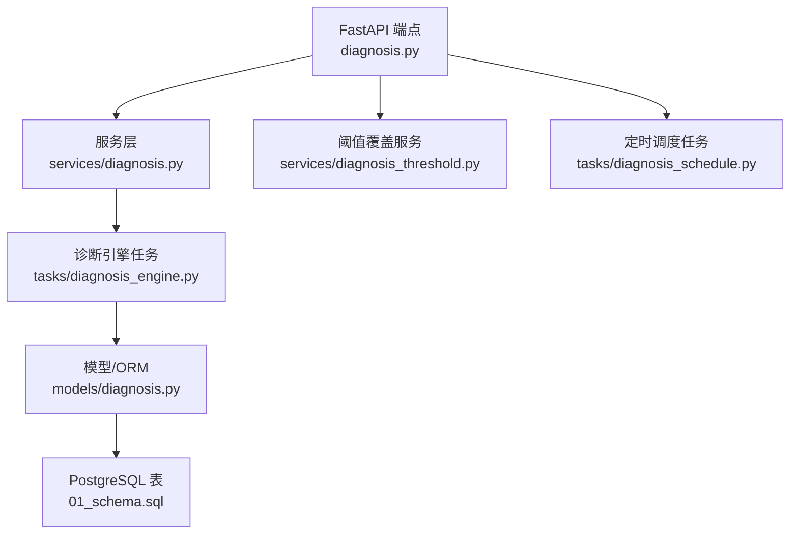
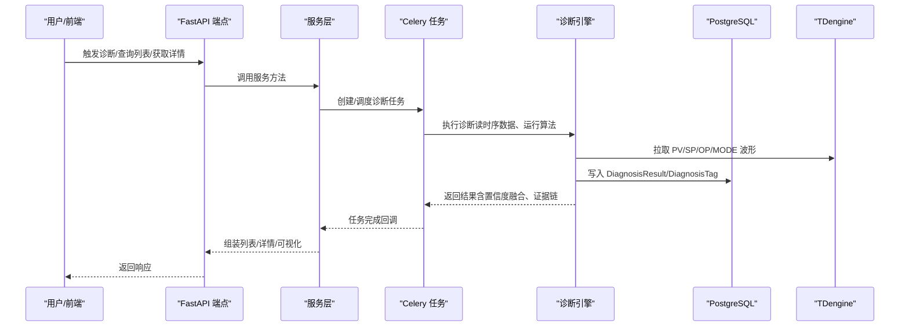
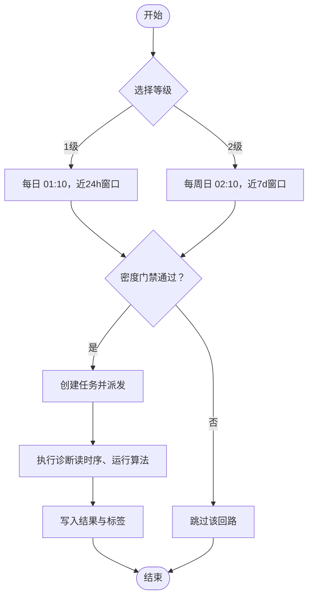
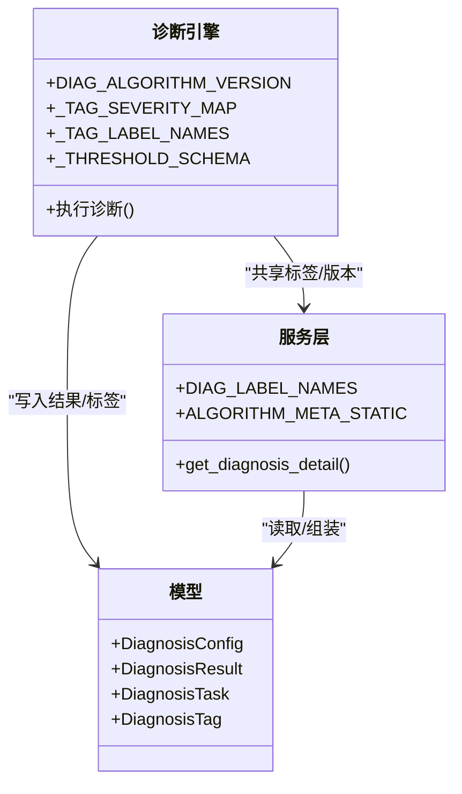
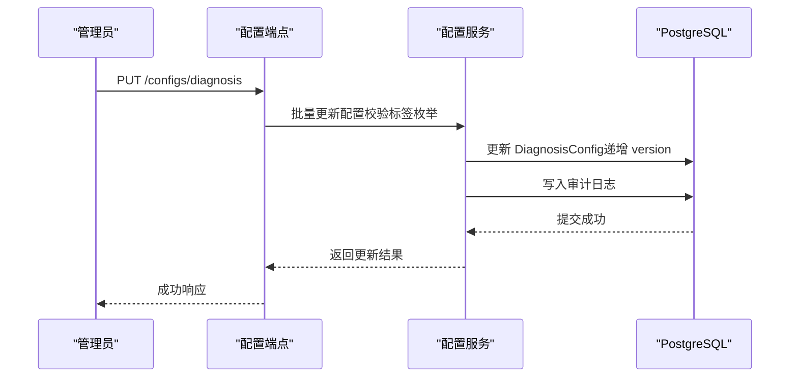
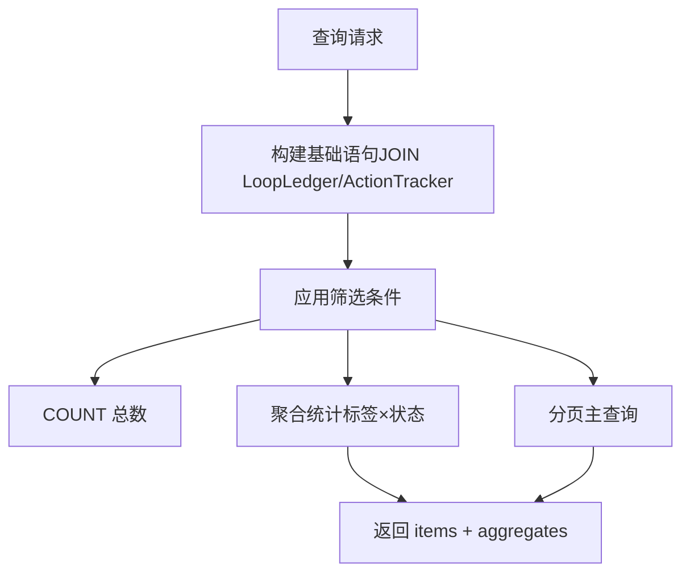
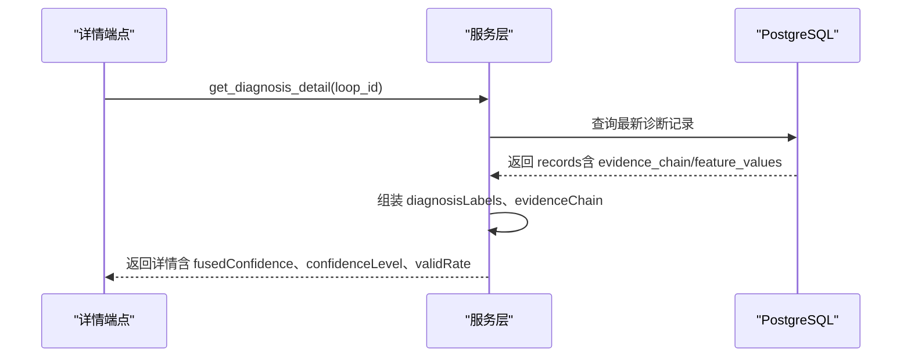
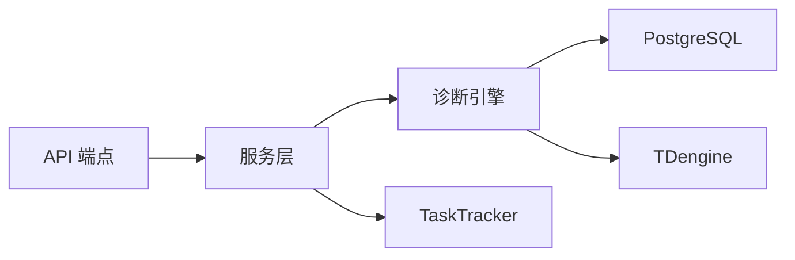

# 诊断引擎核心

<cite>
**本文引用的文件**
- [backend/app/tasks/diagnosis_engine.py](file://backend/app/tasks/diagnosis_engine.py)
- [backend/app/services/diagnosis.py](file://backend/app/services/diagnosis.py)
- [backend/app/models/diagnosis.py](file://backend/app/models/diagnosis.py)
- [backend/app/api/v1/endpoints/diagnosis.py](file://backend/app/api/v1/endpoints/diagnosis.py)
- [backend/app/services/diagnosis_threshold.py](file://backend/app/services/diagnosis_threshold.py)
- [backend/app/tasks/diagnosis_schedule.py](file://backend/app/tasks/diagnosis_schedule.py)
- [backend/alembic/versions/e5f6g7h8i9j0_add_threshold_version.py](file://backend/alembic/versions/e5f6g7h8i9j0_add_threshold_version.py)
- [db/postgresql/01_schema.sql](file://db/postgresql/01_schema.sql)
- [backend/tests/test_diagnosis_tasks.py](file://backend/tests/test_diagnosis_tasks.py)
- [backend/tests/test_diagnosis.py](file://backend/tests/test_diagnosis.py)
</cite>

## 目录
1. [简介](#简介)
2. [项目结构](#项目结构)
3. [核心组件](#核心组件)
4. [架构总览](#架构总览)
5. [详细组件分析](#详细组件分析)
6. [依赖关系分析](#依赖关系分析)
7. [性能考虑](#性能考虑)
8. [故障排查指南](#故障排查指南)
9. [结论](#结论)
10. [附录](#附录)

## 简介
本技术文档聚焦“诊断引擎核心”，围绕以下目标展开：
- 整体架构与任务调度、执行流程控制、结果聚合机制
- 诊断算法版本管理（DIAG_ALGORITHM_VERSION）与8类诊断标签体系实现逻辑
- 诊断配置管理系统（DiagnosisConfig 的 CRUD、阈值配置、启用状态控制）
- 诊断列表查询优化（分页筛选、时间窗口过滤、批量回路查询、聚合统计计算）
- 诊断详情数据组装（证据链构建、特征值提取、可视化数据准备）
- 审计日志记录、错误处理机制与性能优化策略

## 项目结构
后端采用分层组织：API 端点 → 服务层 → 任务/引擎 → 模型/数据库。诊断相关的关键路径如下：
- API 路由：暴露诊断指标配置、任务管理、诊断列表/详情、阈值覆盖等接口
- 服务层：封装业务逻辑，如诊断列表查询、详情组装、阈值覆盖、报表导出等
- 任务/引擎：Celery 异步执行诊断，读取时序数据、运行算法、写入结果与标签
- 模型/迁移：PostgreSQL 持久化配置、结果、任务、标签、阈值覆盖及变更审批表
- 定时调度：按回路重要性等级触发分级诊断任务

**图表来源**
- [backend/app/api/v1/endpoints/diagnosis.py:1-200](file://backend/app/api/v1/endpoints/diagnosis.py#L1-L200)
- [backend/app/services/diagnosis.py:1-200](file://backend/app/services/diagnosis.py#L1-L200)
- [backend/app/services/diagnosis_threshold.py:1-200](file://backend/app/services/diagnosis_threshold.py#L1-L200)
- [backend/app/tasks/diagnosis_schedule.py:1-182](file://backend/app/tasks/diagnosis_schedule.py#L1-L182)
- [backend/app/tasks/diagnosis_engine.py:1-200](file://backend/app/tasks/diagnosis_engine.py#L1-L200)
- [backend/app/models/diagnosis.py:1-357](file://backend/app/models/diagnosis.py#L1-L357)
- [db/postgresql/01_schema.sql:1249-1263](file://db/postgresql/01_schema.sql#L1249-L1263)

**章节来源**
- [backend/app/api/v1/endpoints/diagnosis.py:1-200](file://backend/app/api/v1/endpoints/diagnosis.py#L1-L200)
- [backend/app/services/diagnosis.py:1-200](file://backend/app/services/diagnosis.py#L1-L200)
- [backend/app/tasks/diagnosis_engine.py:1-200](file://backend/app/tasks/diagnosis_engine.py#L1-L200)
- [backend/app/models/diagnosis.py:1-357](file://backend/app/models/diagnosis.py#L1-L357)
- [db/postgresql/01_schema.sql:1249-1263](file://db/postgresql/01_schema.sql#L1249-L1263)

## 核心组件
- 诊断引擎任务：负责从时序库拉取数据、执行多算法检测、融合置信度、落库结果与标签
- 诊断服务：提供配置管理、列表查询、详情组装、可视化数据、统计分析等能力
- 阈值覆盖服务：支持全局默认→回路类型模板→装置级→回路级的四级阈值覆盖与审计
- 模型层：定义 DiagnosisConfig、DiagnosisResult、DiagnosisTask、DiagnosisTag、DiagnosisThresholdOverride 等实体
- 定时调度：按回路重要性等级（1/2/3级）进行分级定时诊断，带密度门禁

**章节来源**
- [backend/app/tasks/diagnosis_engine.py:60-193](file://backend/app/tasks/diagnosis_engine.py#L60-L193)
- [backend/app/services/diagnosis.py:32-200](file://backend/app/services/diagnosis.py#L32-L200)
- [backend/app/services/diagnosis_threshold.py:1-200](file://backend/app/services/diagnosis_threshold.py#L1-L200)
- [backend/app/models/diagnosis.py:29-357](file://backend/app/models/diagnosis.py#L29-L357)
- [backend/app/tasks/diagnosis_schedule.py:1-182](file://backend/app/tasks/diagnosis_schedule.py#L1-L182)

## 架构总览
诊断系统以“事件/定时触发 + Celery 异步执行”为核心，结合 PostgreSQL 持久化与 TDengine 时序数据源，形成闭环的诊断流水线。

**图表来源**
- [backend/app/api/v1/endpoints/diagnosis.py:1-200](file://backend/app/api/v1/endpoints/diagnosis.py#L1-L200)
- [backend/app/services/diagnosis.py:424-748](file://backend/app/services/diagnosis.py#L424-L748)
- [backend/app/tasks/diagnosis_engine.py:1718-1766](file://backend/app/tasks/diagnosis_engine.py#L1718-L1766)
- [backend/app/tasks/diagnosis_schedule.py:75-152](file://backend/app/tasks/diagnosis_schedule.py#L75-L152)

## 详细组件分析

### 诊断任务调度与执行流程控制
- 分级定时调度：按回路重要性等级（1级每日、2级每周）发起诊断，带密度门禁避免缺数误报
- 任务生命周期：PENDING → RUNNING → SUCCESS/FAILED/CANCELLED，支持归档与取消
- 并发与重试：引擎使用并发 worker，失败可重试；通过 TaskTracker 跟踪进度
- 触发方式：手动（用户）、自动（系统），并记录触发人与时间窗

**图表来源**
- [backend/app/tasks/diagnosis_schedule.py:75-152](file://backend/app/tasks/diagnosis_schedule.py#L75-L152)
- [backend/app/models/diagnosis.py:90-145](file://backend/app/models/diagnosis.py#L90-L145)

**章节来源**
- [backend/app/tasks/diagnosis_schedule.py:1-182](file://backend/app/tasks/diagnosis_schedule.py#L1-L182)
- [backend/app/models/diagnosis.py:90-145](file://backend/app/models/diagnosis.py#L90-L145)

### 8类诊断标签体系与算法版本管理
- 算法版本：统一常量 DIAG_ALGORITHM_VERSION，用于标识诊断算法版本，便于追溯
- 标签映射：8类标签（振荡、阀门粘滞、参数过激/保守、外扰频繁、PV质量异常、输出饱和、人工复核）在引擎与服务中保持一致的中文名与严重等级映射
- 阈值键名：集中登记于 _THRESHOLD_SCHEMA，运行时通过 _get_threshold 读取配置默认值
- 置信度融合：多算法结果经 Dempster-Shafer 融合，主标签携带 fused_confidence，非主标签仅保留标量特征以减少存储冗余

**图表来源**
- [backend/app/tasks/diagnosis_engine.py:60-193](file://backend/app/tasks/diagnosis_engine.py#L60-L193)
- [backend/app/services/diagnosis.py:32-200](file://backend/app/services/diagnosis.py#L32-L200)
- [backend/app/models/diagnosis.py:29-201](file://backend/app/models/diagnosis.py#L29-L201)

**章节来源**
- [backend/app/tasks/diagnosis_engine.py:60-193](file://backend/app/tasks/diagnosis_engine.py#L60-L193)
- [backend/app/services/diagnosis.py:32-200](file://backend/app/services/diagnosis.py#L32-L200)
- [backend/app/models/diagnosis.py:29-201](file://backend/app/models/diagnosis.py#L29-L201)

### 诊断配置管理系统（DiagnosisConfig CRUD、阈值、启用状态）
- 配置项：包含 diag_code、diag_name、algorithm_type、calc_method、params、threshold、is_enabled、version、updated_by/updated_at
- CRUD 操作：通过 API 端点与 services 层实现，支持批量更新与校验（限定8类标签）
- 启用状态：is_enabled 控制是否参与诊断；版本字段 version 支持回滚与审计
- 阈值覆盖：支持 loop_type/plant/loop 三级覆盖，权限边界（IC_ENGINEER 仅可微调 loop scope）

**图表来源**
- [backend/app/api/v1/endpoints/configs.py:692-946](file://backend/app/api/v1/endpoints/configs.py#L692-L946)
- [backend/app/services/diagnosis_threshold.py:59-144](file://backend/app/services/diagnosis_threshold.py#L59-L144)
- [backend/app/models/diagnosis.py:29-48](file://backend/app/models/diagnosis.py#L29-L48)

**章节来源**
- [backend/app/api/v1/endpoints/configs.py:692-946](file://backend/app/api/v1/endpoints/configs.py#L692-L946)
- [backend/app/services/diagnosis_threshold.py:59-144](file://backend/app/services/diagnosis_threshold.py#L59-L144)
- [backend/app/models/diagnosis.py:29-48](file://backend/app/models/diagnosis.py#L29-L48)

### 诊断列表查询优化（分页、时间窗口、批量回路、聚合统计）
- 分页与筛选：支持 status、trigger_type、loop_id、plant_node_id、include_archived/archived_only 等条件
- 时间窗口：任务记录支持 time_range_start/time_range_end，详情侧根据 diagnosed_at 推导波形时间窗
- 批量回路：调度器按等级批量建任务，减少重复开销
- 聚合统计：对全部筛选结果按标签/状态分组计数，不受分页影响；任务列表额外统计近7天归档数

**图表来源**
- [backend/app/services/diagnosis.py:424-473](file://backend/app/services/diagnosis.py#L424-L473)
- [backend/app/services/diagnosis.py:1710-1733](file://backend/app/services/diagnosis.py#L1710-L1733)
- [backend/tests/test_diagnosis_tasks.py:817-846](file://backend/tests/test_diagnosis_tasks.py#L817-L846)
- [backend/tests/test_diagnosis.py:304-389](file://backend/tests/test_diagnosis.py#L304-L389)

**章节来源**
- [backend/app/services/diagnosis.py:424-473](file://backend/app/services/diagnosis.py#L424-L473)
- [backend/app/services/diagnosis.py:1710-1733](file://backend/app/services/diagnosis.py#L1710-L1733)
- [backend/tests/test_diagnosis_tasks.py:817-846](file://backend/tests/test_diagnosis_tasks.py#L817-L846)
- [backend/tests/test_diagnosis.py:304-389](file://backend/tests/test_diagnosis.py#L304-L389)

### 诊断详情数据组装（证据链、特征值、可视化）
- 主诊断：取最新一条诊断记录作为主诊断，携带 fused_confidence
- 证据链：包含 waveformUrl、scatterPlot、reasoning；散点图数据即使主标签非粘滞也会回退到 feature_values 中的 x/y 数组
- 特征值：合并各标签的 feature_values，主标签记录并入所有算法的可视化数组，非主标签仅保留标量
- 可信度与有效数据率：每条结果记录携带 confidence_level 与 valid_rate，供列表/详情直接读取

**图表来源**
- [backend/app/services/diagnosis.py:671-748](file://backend/app/services/diagnosis.py#L671-L748)
- [backend/app/tasks/diagnosis_engine.py:1718-1766](file://backend/app/tasks/diagnosis_engine.py#L1718-L1766)

**章节来源**
- [backend/app/services/diagnosis.py:671-748](file://backend/app/services/diagnosis.py#L671-L748)
- [backend/app/tasks/diagnosis_engine.py:1718-1766](file://backend/app/tasks/diagnosis_engine.py#L1718-L1766)

### 阈值配置与版本追溯
- 阈值版本快照：诊断结果记录 threshold_version，记录诊断时使用的配置版本，支持历史结论回溯
- 覆盖优先级：loop > plant > loop_type > 全局默认；链路展示顺序从低到高，scope_chain[-1] 为生效层
- 审计日志：阈值覆盖的增删改均记录 before/after JSON，支持合规审计

**章节来源**
- [backend/alembic/versions/e5f6g7h8i9j0_add_threshold_version.py:1-34](file://backend/alembic/versions/e5f6g7h8i9j0_add_threshold_version.py#L1-L34)
- [backend/app/services/diagnosis_threshold.py:105-143](file://backend/app/services/diagnosis_threshold.py#L105-L143)
- [db/postgresql/01_schema.sql:1249-1263](file://db/postgresql/01_schema.sql#L1249-L1263)

## 依赖关系分析
- 模块耦合：API 端点依赖服务层；服务层依赖模型与外部服务（TDengine、TaskTracker）；引擎任务依赖预处理与 KPI 计算内核
- 外部依赖：Celery（任务调度）、PostgreSQL（持久化）、TDengine（时序数据）
- 潜在循环依赖：通过服务层解耦 API 与引擎；引擎不反向依赖 API

**图表来源**
- [backend/app/api/v1/endpoints/diagnosis.py:1-200](file://backend/app/api/v1/endpoints/diagnosis.py#L1-L200)
- [backend/app/services/diagnosis.py:1-200](file://backend/app/services/diagnosis.py#L1-L200)
- [backend/app/tasks/diagnosis_engine.py:1-200](file://backend/app/tasks/diagnosis_engine.py#L1-L200)

**章节来源**
- [backend/app/api/v1/endpoints/diagnosis.py:1-200](file://backend/app/api/v1/endpoints/diagnosis.py#L1-L200)
- [backend/app/services/diagnosis.py:1-200](file://backend/app/services/diagnosis.py#L1-L200)
- [backend/app/tasks/diagnosis_engine.py:1-200](file://backend/app/tasks/diagnosis_engine.py#L1-L200)

## 性能考虑
- 存储瘦身：主标签记录承载全量可视化数组，非主标签仅存标量，降低冗余
- 聚合稳定：列表聚合基于全部筛选结果，不受分页影响，保证一致性
- 密度门禁：调度前检查 TDengine 行数，避免缺数窗口产生噪音
- 并发与重试：Celery 并发 worker，失败重试提升鲁棒性
- 阈值热路径：触发配置进程内缓存，保存后立即生效，减少查库开销

[本节为通用指导，不直接分析具体文件]

## 故障排查指南
- 配置校验失败：确保 diag_code 属于8类标签枚举，否则批量 GET 会整体失败
- 阈值覆盖权限：IC_ENGINEER 仅可操作 loop scope，越权将返回权限拒绝
- 任务失败：查看 DiagnosisTask.error_message 与最近一次诊断记录的 evidence_chain.reasoning
- 可视化空白：若主标签非 VALVE_STICTION，详情页会从 feature_values 回退 scatter_plot_x/y 显示散点图
- 审计追踪：阈值覆盖与配置变更均有审计日志，可通过 before/after 对比定位问题

**章节来源**
- [backend/app/api/v1/endpoints/configs.py:692-718](file://backend/app/api/v1/endpoints/configs.py#L692-L718)
- [backend/app/services/diagnosis_threshold.py:86-93](file://backend/app/services/diagnosis_threshold.py#L86-L93)
- [backend/app/services/diagnosis.py:704-716](file://backend/app/services/diagnosis.py#L704-L716)

## 结论
诊断引擎以清晰的层次化架构与严格的版本/阈值管理为基础，实现了高可用、可追溯、可扩展的诊断能力。通过分级调度、密度门禁、存储瘦身与聚合稳定性保障，系统在大规模回路场景下具备良好性能与可靠性。后续可进一步扩展规则引擎与专家建议，提升自动化处置效率。

[本节为总结性内容，不直接分析具体文件]

## 附录
- 关键常量与映射：
  - 算法版本：DIAG_ALGORITHM_VERSION
  - 8类标签中文名与严重等级映射
  - 阈值键名 schema（OSCILLATION、VALVE_STICTION、QUALITY_ABNORMAL、OUTPUT_SATURATION、OVERAGGRESSIVE、OVERCONSERVATIVE、EXTERNAL_DISTURBANCE）
- 数据模型要点：
  - DiagnosisConfig：配置项与版本控制
  - DiagnosisResult：诊断结果与证据链
  - DiagnosisTask：任务生命周期与归档
  - DiagnosisTag：标签实例与状态流转
  - DiagnosisThresholdOverride：四级阈值覆盖

[本节为补充信息，不直接分析具体文件]