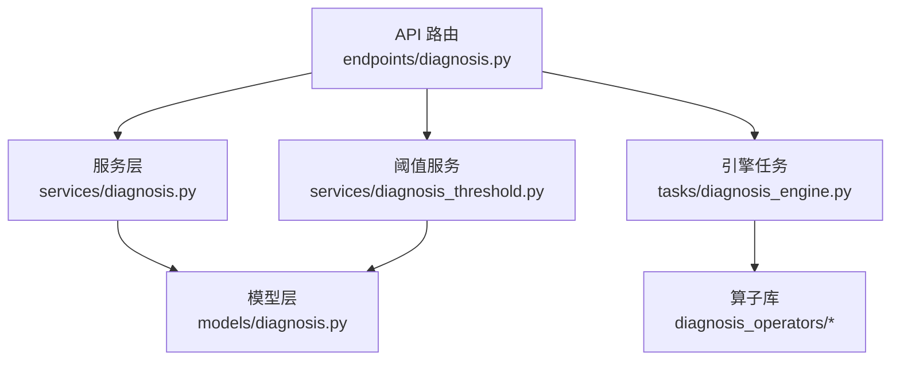
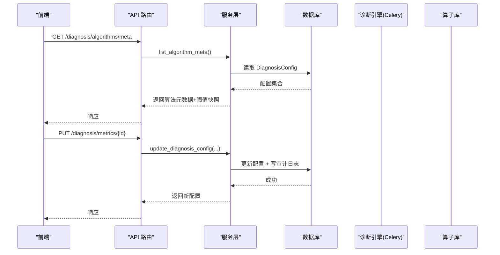
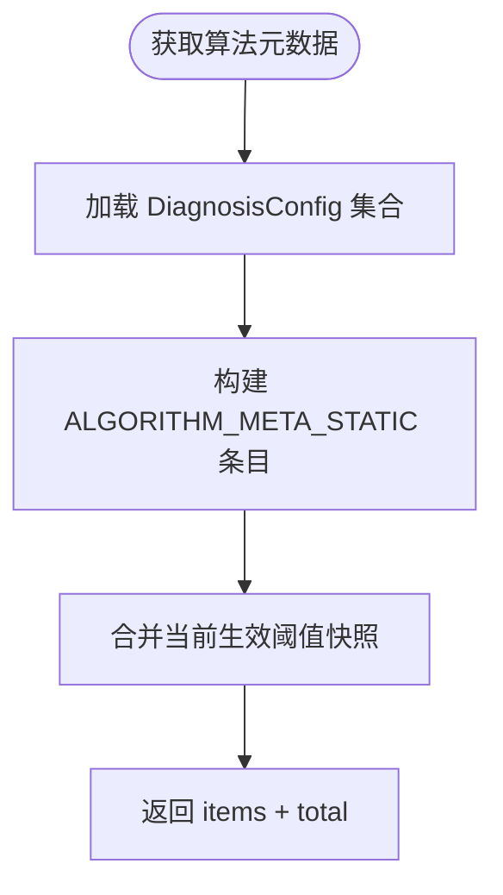
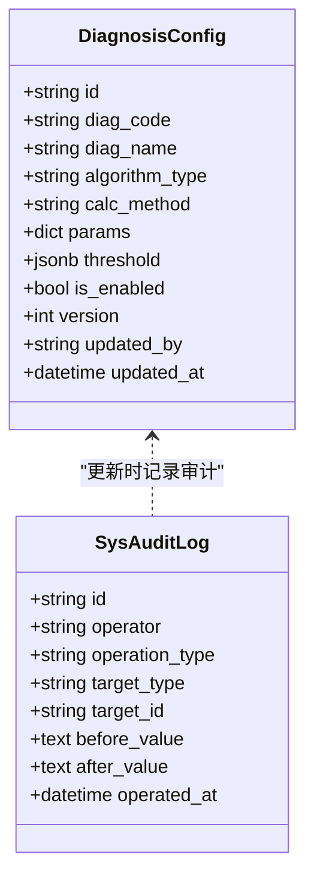
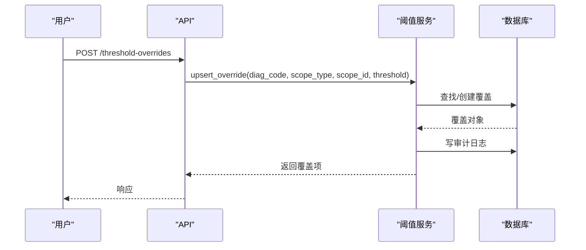
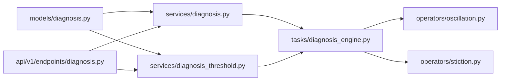

# 诊断算法管理

<cite>
**本文引用的文件**
- [backend/app/models/diagnosis.py](file://backend/app/models/diagnosis.py)
- [backend/app/schemas/diagnosis.py](file://backend/app/schemas/diagnosis.py)
- [backend/app/services/diagnosis.py](file://backend/app/services/diagnosis.py)
- [backend/app/api/v1/endpoints/diagnosis.py](file://backend/app/api/v1/endpoints/diagnosis.py)
- [backend/app/services/diagnosis_threshold.py](file://backend/app/services/diagnosis_threshold.py)
- [backend/app/tasks/diagnosis_engine.py](file://backend/app/tasks/diagnosis_engine.py)
- [backend/app/services/diagnosis_operators/oscillation.py](file://backend/app/services/diagnosis_operators/oscillation.py)
- [backend/app/services/diagnosis_operators/stiction.py](file://backend/app/services/diagnosis_operators/stiction.py)
</cite>

## 目录
1. [简介](#简介)
2. [项目结构](#项目结构)
3. [核心组件](#核心组件)
4. [架构总览](#架构总览)
5. [详细组件分析](#详细组件分析)
6. [依赖关系分析](#依赖关系分析)
7. [性能考虑](#性能考虑)
8. [故障排查指南](#故障排查指南)
9. [结论](#结论)
10. [附录](#附录)

## 简介
本技术文档聚焦“诊断算法管理模块”，围绕8类诊断算法的元数据管理、版本控制、配置CRUD与审计、阈值差异化覆盖、批量更新与扩展开发实践进行系统化说明。8类诊断标签为：振荡检测、阀门粘滞、参数过激、参数过保守、外扰频繁、PV质量异常、输出饱和、人工复核。系统通过静态元数据与运行时配置结合，提供前端可渲染的算法价值传递卡片、可视化键名映射、以及完整的阈值管理与回滚能力。

## 项目结构
- 模型层：定义诊断配置、结果、任务、标签、规则、阈值覆盖、配置变更等持久化实体。
- 服务层：实现诊断指标配置CRUD、阈值覆盖与模板套用、推荐合并、版本回滚、算法元数据查询等。
- API层：暴露诊断中心相关REST接口（配置、规则、阈值、列表、详情、报表导出、任务管理等）。
- 引擎与算子：Celery异步执行诊断任务，调用各算法算子（如振荡、粘滞）并写入结果与标签。

**图示来源**
- [backend/app/api/v1/endpoints/diagnosis.py:1-150](file://backend/app/api/v1/endpoints/diagnosis.py#L1-L150)
- [backend/app/services/diagnosis.py:225-263](file://backend/app/services/diagnosis.py#L225-L263)
- [backend/app/services/diagnosis_threshold.py:217-373](file://backend/app/services/diagnosis_threshold.py#L217-L373)
- [backend/app/models/diagnosis.py:29-357](file://backend/app/models/diagnosis.py#L29-L357)
- [backend/app/tasks/diagnosis_engine.py:1-194](file://backend/app/tasks/diagnosis_engine.py#L1-L194)

**章节来源**
- [backend/app/models/diagnosis.py:29-357](file://backend/app/models/diagnosis.py#L29-L357)
- [backend/app/schemas/diagnosis.py:269-302](file://backend/app/schemas/diagnosis.py#L269-L302)
- [backend/app/services/diagnosis.py:225-263](file://backend/app/services/diagnosis.py#L225-L263)
- [backend/app/api/v1/endpoints/diagnosis.py:155-190](file://backend/app/api/v1/endpoints/diagnosis.py#L155-L190)

## 核心组件
- 诊断指标配置模型 DiagnosisConfig：承载 diag_code、diag_name、algorithm_type、calc_method、params、threshold、is_enabled、version、updated_by/updated_at。
- 诊断结果模型 DiagnosisResult：记录 loop_id、diag_label、confidence、feature_values、evidence_chain、algorithm_version、threshold_version、diagnosed_at、task_id。
- 诊断任务模型 DiagnosisTask：PENDING/RUNNING/SUCCESS/FAILED/CANCELLED 状态机，支持归档与时间窗。
- 诊断标签模型 DiagnosisTag：回路级故障标签实例，含严重等级、触发条件快照、处理状态流转。
- 专家规则模型 DiagnosisRule：将R01-R08规则数据库化，支持表达式求值与动作类型。
- 阈值覆盖模型 DiagnosisThresholdOverride：四级覆盖（全局默认→loop_type模板→装置级→回路级），带版本与审计。
- 配置变更模型 DiagnosisConfigChange：关键配置双人审批流（PENDING/APPROVED/REJECTED）。

**章节来源**
- [backend/app/models/diagnosis.py:29-357](file://backend/app/models/diagnosis.py#L29-L357)

## 架构总览
系统采用“API → Service → Model”的分层架构，配合Celery异步任务执行诊断引擎，算子库提供具体算法内核；阈值覆盖与模板机制确保不同范围的可配置性；审计日志与审批流保障变更安全与可追溯。

**图示来源**
- [backend/app/api/v1/endpoints/diagnosis.py:160-190](file://backend/app/api/v1/endpoints/diagnosis.py#L160-L190)
- [backend/app/services/diagnosis.py:225-263](file://backend/app/services/diagnosis.py#L225-L263)
- [backend/app/services/diagnosis.py:305-365](file://backend/app/services/diagnosis.py#L305-L365)

## 详细组件分析

### 8类诊断算法静态元数据与可视化键名
- 静态元数据结构 ALGORITHM_META_STATIC：包含每个算法的 algorithmName、principle、featureKeys、thresholdKeys、visualizationKey。
- 算法版本常量 DIAG_ALGORITHM_VERSION：统一标识算法版本（DIAG_ENGINE_v1.0）。
- 置信度等级释义 CONFIDENCE_LEVEL_EXPLANATION：A-E五级解释，用于前端展示。
- 可视化键名映射：spectrum、scatterPlot、stepResponse、slowResponse、cusumAnalysis、qualityTimeline、saturationAnalysis、MANUAL_REVIEW无可视化。

**图示来源**
- [backend/app/services/diagnosis.py:65-222](file://backend/app/services/diagnosis.py#L65-L222)
- [backend/app/services/diagnosis.py:225-263](file://backend/app/services/diagnosis.py#L225-L263)

**章节来源**
- [backend/app/services/diagnosis.py:65-222](file://backend/app/services/diagnosis.py#L65-L222)
- [backend/app/services/diagnosis.py:225-263](file://backend/app/services/diagnosis.py#L225-L263)
- [backend/app/schemas/diagnosis.py:269-302](file://backend/app/schemas/diagnosis.py#L269-L302)

### 算法版本管理机制
- 版本常量：DIAG_ALGORITHM_VERSION 在服务和引擎中保持一致，便于追踪算法版本。
- 配置版本：DiagnosisConfig.version 自增，每次更新递增；阈值覆盖也维护 version。
- 审计与回滚：所有配置更新写入 SysAuditLog；提供按 auditLogId 回滚到指定版本的接口。
- 向后兼容：旧结果保留 threshold_version 字段，便于回溯当时阈值；MANUAL_REVIEW 不参与阈值判定。

**图示来源**
- [backend/app/models/diagnosis.py:29-48](file://backend/app/models/diagnosis.py#L29-L48)
- [backend/app/services/diagnosis.py:270-291](file://backend/app/services/diagnosis.py#L270-L291)
- [backend/app/services/diagnosis_threshold.py:469-591](file://backend/app/services/diagnosis_threshold.py#L469-L591)

**章节来源**
- [backend/app/services/diagnosis.py:305-365](file://backend/app/services/diagnosis.py#L305-L365)
- [backend/app/services/diagnosis_threshold.py:469-591](file://backend/app/services/diagnosis_threshold.py#L469-L591)
- [backend/app/models/diagnosis.py:51-88](file://backend/app/models/diagnosis.py#L51-L88)

### 算法配置CRUD与阈值管理
- 配置CRUD：GET /metrics 列出配置；PUT /metrics/{id} 更新名称、算法类型、计算方式、参数、阈值、启用状态；每次更新写审计日志并递增版本。
- 阈值覆盖：支持 loop_type/plant/loop 三级覆盖，权限校验（IC_ENGINEER仅能操作loop scope）；提供模板列表、一键套用、删除覆盖。
- 推荐合并：按优先级合并 global_default → loop_type_template → plant_override → loop_override，得到 effectiveThreshold 与 scopeChain。

**图示来源**
- [backend/app/api/v1/endpoints/diagnosis.py:256-286](file://backend/app/api/v1/endpoints/diagnosis.py#L256-L286)
- [backend/app/services/diagnosis_threshold.py:59-144](file://backend/app/services/diagnosis_threshold.py#L59-L144)

**章节来源**
- [backend/app/api/v1/endpoints/diagnosis.py:160-190](file://backend/app/api/v1/endpoints/diagnosis.py#L160-L190)
- [backend/app/services/diagnosis_threshold.py:59-144](file://backend/app/services/diagnosis_threshold.py#L59-L144)
- [backend/app/services/diagnosis_threshold.py:217-373](file://backend/app/services/diagnosis_threshold.py#L217-L373)

### 算法元数据查询接口
- 接口：GET /diagnosis/algorithms/meta（Batch 4 算法价值传递）。
- 行为：一次性加载全部 DiagnosisConfig，合并静态元数据与当前阈值快照，返回 items（含 label、labelName、algorithmName、algorithmVersion、principle、featureKeys、thresholdKeys、visualizationKey、isEnabled、threshold）与 total。
- 用途：前端渲染算法卡片，避免硬编码，动态展示阈值与可视化键名。

**章节来源**
- [backend/app/services/diagnosis.py:225-263](file://backend/app/services/diagnosis.py#L225-L263)
- [backend/app/schemas/diagnosis.py:269-302](file://backend/app/schemas/diagnosis.py#L269-L302)

### 配置审计日志与批量更新
- 审计日志：所有配置更新通过 _write_audit 写入 SysAuditLog，记录 before/after JSON、操作人、时间。
- 版本历史：GET /metrics/{id}/versions 从审计日志读取变更记录，解析 before/after 值与版本号。
- 回滚：POST /metrics/{id}/rollback 根据 auditLogId 恢复目标版本，并再次写审计日志。
- 批量更新：可通过多次PUT或封装批量接口（由上层业务编排），每次更新均独立审计与版本递增。

**章节来源**
- [backend/app/services/diagnosis.py:270-291](file://backend/app/services/diagnosis.py#L270-L291)
- [backend/app/services/diagnosis_threshold.py:469-591](file://backend/app/services/diagnosis_threshold.py#L469-L591)
- [backend/app/api/v1/endpoints/diagnosis.py:348-378](file://backend/app/api/v1/endpoints/diagnosis.py#L348-L378)

### 算法扩展开发指南与最佳实践
- 新增算法步骤：
  - 在 ALGORITHM_META_STATIC 增加条目，填写 algorithmName、principle、featureKeys、thresholdKeys、visualizationKey。
  - 在 _THRESHOLD_SCHEMA 登记阈值键名与默认值，确保迁移种子对齐。
  - 在 diagnosis_operators 下新增算子模块，遵循 base 接口规范（OperatorInput/OperatorResult）。
  - 在引擎任务中集成算子，输出 feature_values/evidence_chain，并写入 DiagnosisResult/DiagnosisTag。
- 最佳实践：
  - 保持 featureKeys 与前端 visualizationKey 一致，便于渲染。
  - 阈值键名集中登记，避免散落在代码各处。
  - 对异常路径做降级处理（如数据不足、计算失败返回空结果）。
  - 使用置信度评估器统一融合多算法置信度，保证一致性。

**章节来源**
- [backend/app/services/diagnosis.py:65-222](file://backend/app/services/diagnosis.py#L65-L222)
- [backend/app/tasks/diagnosis_engine.py:122-194](file://backend/app/tasks/diagnosis_engine.py#L122-L194)
- [backend/app/services/diagnosis_operators/base.py](file://backend/app/services/diagnosis_operators/base.py)

## 依赖关系分析
- 模型依赖：DiagnosisConfig、DiagnosisResult、DiagnosisTask、DiagnosisTag、DiagnosisRule、DiagnosisThresholdOverride、DiagnosisConfigChange。
- 服务依赖：diagnosis.py 依赖 models 与 schemas；diagnosis_threshold.py 依赖 models 与审计日志；engine 依赖算子库与TDengine/KPI快照。
- API依赖：路由聚合多个服务，提供统一入口。

**图示来源**
- [backend/app/models/diagnosis.py:29-357](file://backend/app/models/diagnosis.py#L29-L357)
- [backend/app/services/diagnosis.py:225-263](file://backend/app/services/diagnosis.py#L225-L263)
- [backend/app/services/diagnosis_threshold.py:217-373](file://backend/app/services/diagnosis_threshold.py#L217-L373)
- [backend/app/tasks/diagnosis_engine.py:1-194](file://backend/app/tasks/diagnosis_engine.py#L1-L194)
- [backend/app/services/diagnosis_operators/oscillation.py:1-200](file://backend/app/services/diagnosis_operators/oscillation.py#L1-L200)
- [backend/app/services/diagnosis_operators/stiction.py:1-200](file://backend/app/services/diagnosis_operators/stiction.py#L1-L200)

**章节来源**
- [backend/app/models/diagnosis.py:29-357](file://backend/app/models/diagnosis.py#L29-L357)
- [backend/app/services/diagnosis.py:225-263](file://backend/app/services/diagnosis.py#L225-L263)
- [backend/app/services/diagnosis_threshold.py:217-373](file://backend/app/services/diagnosis_threshold.py#L217-L373)
- [backend/app/tasks/diagnosis_engine.py:1-194](file://backend/app/tasks/diagnosis_engine.py#L1-L194)

## 性能考虑
- 批量查询：诊断列表使用子查询取最新诊断时间，减少全表扫描；支持 loop_ids 批量过滤下推。
- 并发与重试：引擎使用 Celery worker 并发执行，失败重试3次，提升鲁棒性。
- 降级策略：TDengine不可用时优雅降级，避免阻塞主流程。
- 缓存与热路径：触发配置通过进程内缓存读取，降低数据库压力。

[本节为通用性能建议，不直接分析具体文件]

## 故障排查指南
- 配置不存在：更新配置时若未找到对应 diag_id，抛出 ERR_DIAG_CONFIG_NOT_FOUND。
- 阈值覆盖不存在：删除覆盖时若未找到 override_id，抛出 ERR_OVERRIDE_NOT_FOUND。
- 权限不足：IC_ENGINEER越权操作非loop scope，抛出 ERR_PERMISSION_DENIED。
- 审计日志缺失：回滚时若无 before_value，抛出 ERR_NO_BEFORE_VALUE。
- 回路不存在：推荐与套用模板时若回路不存在，抛出 ERR_LOOP_NOT_FOUND。

**章节来源**
- [backend/app/services/diagnosis.py:305-365](file://backend/app/services/diagnosis.py#L305-L365)
- [backend/app/services/diagnosis_threshold.py:59-144](file://backend/app/services/diagnosis_threshold.py#L59-L144)
- [backend/app/services/diagnosis_threshold.py:469-591](file://backend/app/services/diagnosis_threshold.py#L469-L591)

## 结论
诊断算法管理模块通过静态元数据与运行时配置相结合，实现了8类诊断算法的统一管理、可视化呈现与阈值差异化覆盖。版本控制与审计日志保障了变更的安全性与可追溯性，审批流进一步提升了关键配置的风险控制。算子化架构便于扩展新算法，配合引擎与API形成完整闭环。

## 附录
- 8类诊断标签中文名映射：振荡、阀门粘滞、参数过激、参数过保守、外扰频繁、PV质量异常、输出饱和、人工复核。
- 可视化键名：spectrum、scatterPlot、stepResponse、slowResponse、cusumAnalysis、qualityTimeline、saturationAnalysis。
- 阈值覆盖优先级：全局默认 → loop_type模板 → 装置级 → 回路级。

[本节为概念性总结，不直接分析具体文件]