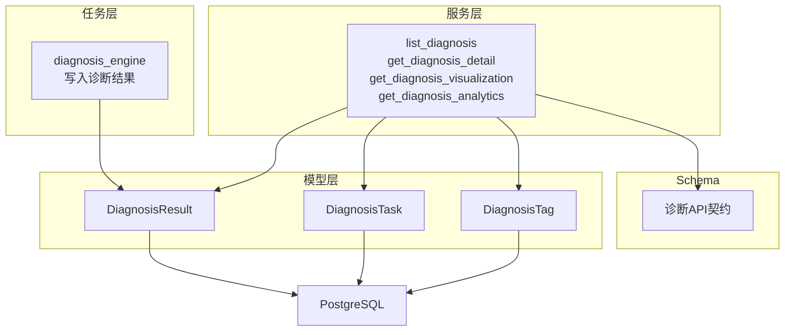
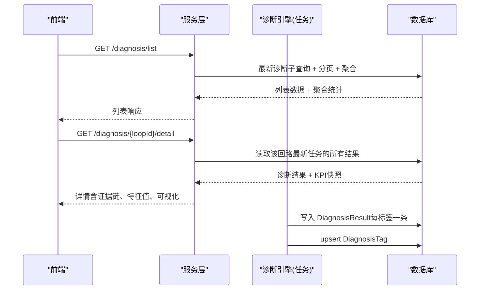
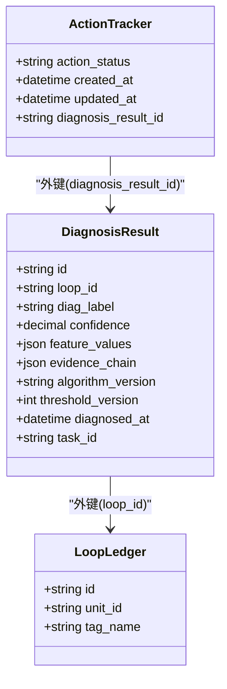
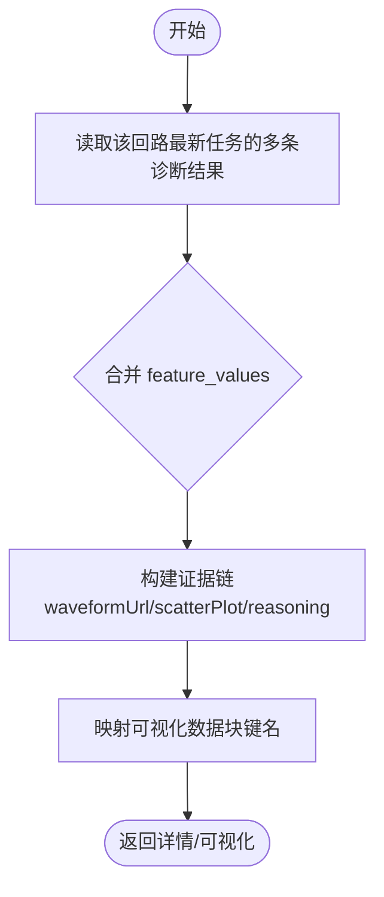
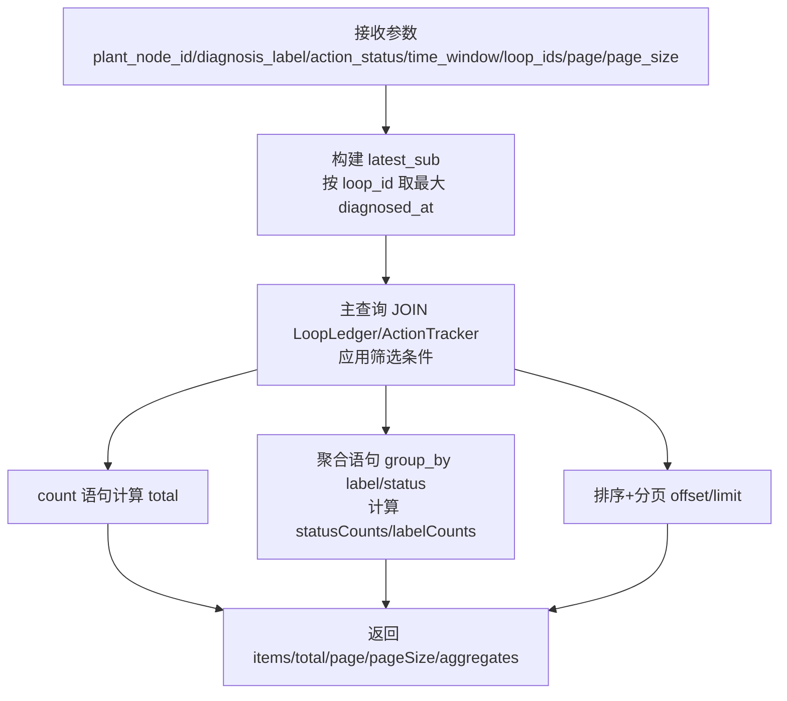
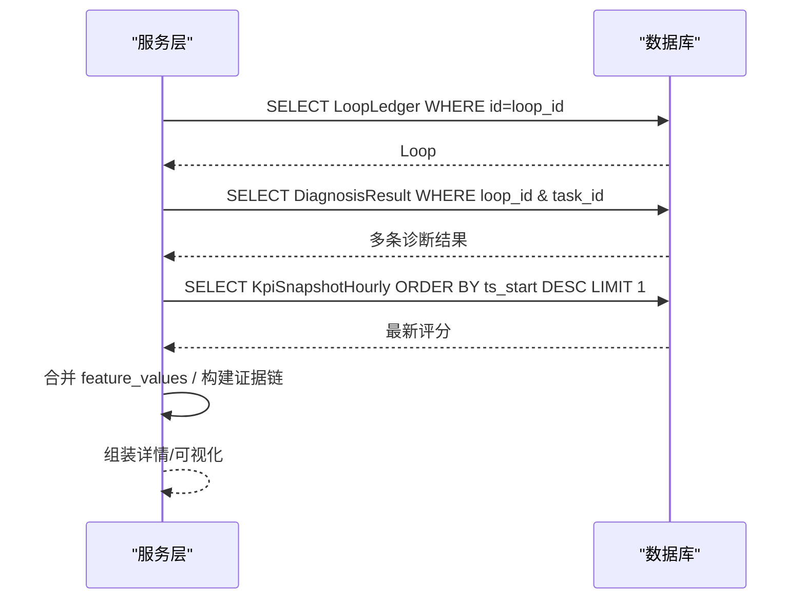
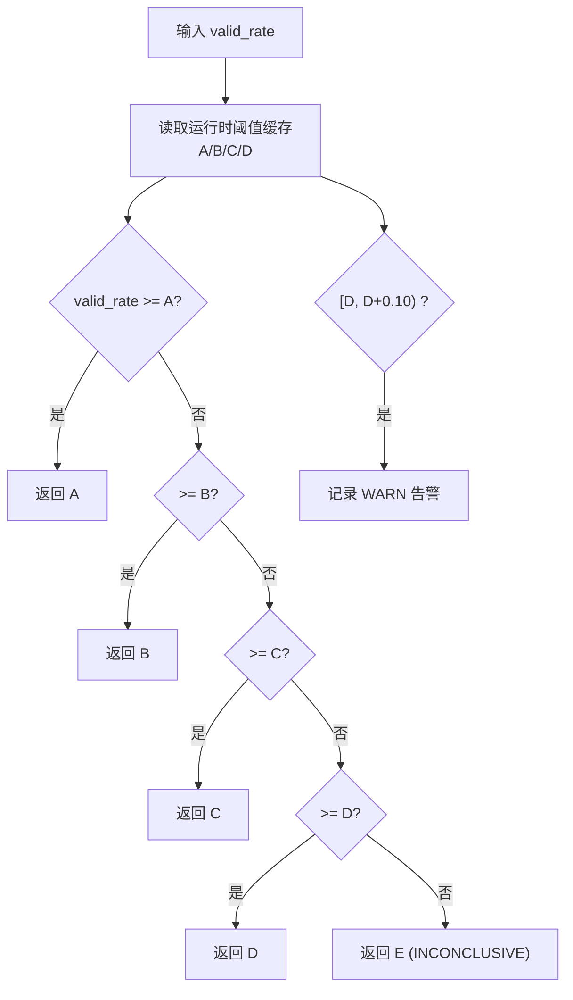
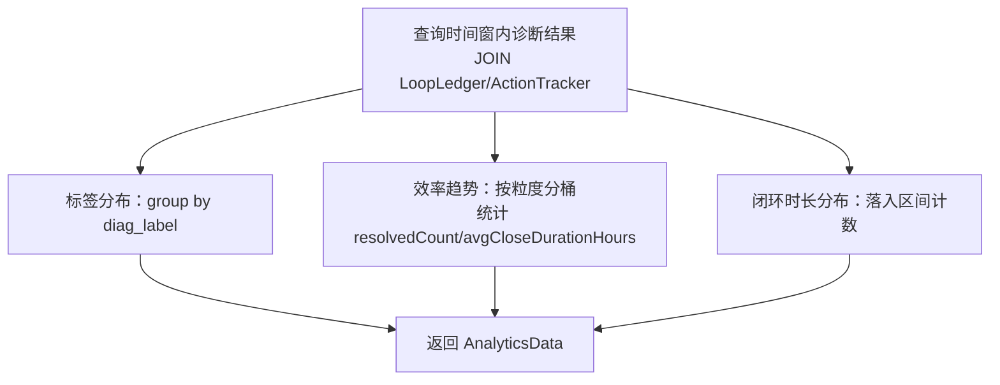
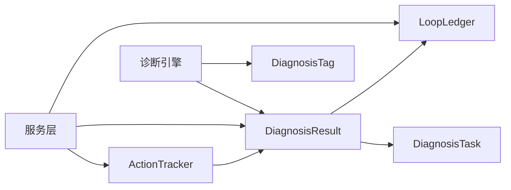

# 诊断结果处理

<cite>
**本文引用的文件**
- [backend/app/models/diagnosis.py](file://backend/app/models/diagnosis.py)
- [backend/app/services/diagnosis.py](file://backend/app/services/diagnosis.py)
- [backend/app/services/confidence_evaluator.py](file://backend/app/services/confidence_evaluator.py)
- [backend/app/tasks/diagnosis_engine.py](file://backend/app/tasks/diagnosis_engine.py)
- [backend/app/schemas/diagnosis.py](file://backend/app/schemas/diagnosis.py)
- [db/postgresql/01_schema.sql](file://db/postgresql/01_schema.sql)
- [backend/tests/test_diagnosis.py](file://backend/tests/test_diagnosis.py)
- [backend/tests/test_confidence_threshold_sync.py](file://backend/tests/test_confidence_threshold_sync.py)
</cite>

## 目录
1. [简介](#简介)
2. [项目结构](#项目结构)
3. [核心组件](#核心组件)
4. [架构总览](#架构总览)
5. [详细组件分析](#详细组件分析)
6. [依赖关系分析](#依赖关系分析)
7. [性能考虑](#性能考虑)
8. [故障排查指南](#故障排查指南)
9. [结论](#结论)
10. [附录](#附录)

## 简介
本技术文档聚焦“诊断结果处理”模块，围绕以下目标展开：
- 诊断结果的存储结构与模型设计（DiagnosisResult、证据链、特征值）
- 诊断列表查询优化（分页筛选、时间窗口过滤、批量回路查询、聚合统计）
- 诊断详情获取的数据组装（证据链构建、特征值提取、可视化数据准备）
- 置信度评估机制（fused_confidence 融合置信度、confidence_level 可信度等级、valid_rate 有效数据率）
- 诊断统计报表生成（标签分布统计、效率趋势分析、闭环时长分布）
- 查询性能优化策略与大数据量处理方案

## 项目结构
后端采用分层组织：
- 模型层：定义诊断相关表结构（diagnosis_result、diagnosis_task、diagnosis_tag 等）
- 服务层：封装诊断列表、详情、可视化、统计报表等业务逻辑
- 任务层：异步执行诊断引擎，落库诊断结果并维护标签状态
- Schema 层：对外 API 请求/响应契约
- 数据库脚本：PostgreSQL DDL

**图表来源**
- [backend/app/models/diagnosis.py:51-87](file://backend/app/models/diagnosis.py#L51-L87)
- [backend/app/services/diagnosis.py:373-614](file://backend/app/services/diagnosis.py#L373-L614)
- [backend/app/tasks/diagnosis_engine.py:1718-1789](file://backend/app/tasks/diagnosis_engine.py#L1718-L1789)
- [backend/app/schemas/diagnosis.py:309-409](file://backend/app/schemas/diagnosis.py#L309-L409)

**章节来源**
- [backend/app/models/diagnosis.py:51-87](file://backend/app/models/diagnosis.py#L51-L87)
- [backend/app/services/diagnosis.py:373-614](file://backend/app/services/diagnosis.py#L373-L614)
- [backend/app/tasks/diagnosis_engine.py:1718-1789](file://backend/app/tasks/diagnosis_engine.py#L1718-L1789)
- [backend/app/schemas/diagnosis.py:309-409](file://backend/app/schemas/diagnosis.py#L309-L409)

## 核心组件
- DiagnosisResult：承载单回路单次诊断的每条标签结果，包含标签、置信度、特征值、证据链、算法版本、阈值版本快照、诊断时间、关联任务ID。
- DiagnosisTask：记录每次诊断任务的触发方式、时间窗、状态机与归档信息。
- DiagnosisTag：回路级故障标签实例，用于告警面板与标签筛选。
- 服务层：提供诊断列表、详情、可视化、统计报表等能力。
- 任务层：诊断引擎执行后写入结果，并同步 upsert 标签。

**章节来源**
- [backend/app/models/diagnosis.py:51-87](file://backend/app/models/diagnosis.py#L51-L87)
- [backend/app/models/diagnosis.py:90-145](file://backend/app/models/diagnosis.py#L90-L145)
- [backend/app/models/diagnosis.py:148-201](file://backend/app/models/diagnosis.py#L148-L201)

## 架构总览
诊断结果从“诊断引擎”产出，经“任务层”落库；“服务层”负责对外提供列表、详情、可视化与统计报表；“Schema”约束接口契约；“模型层”映射到 PostgreSQL。

**图表来源**
- [backend/app/services/diagnosis.py:373-614](file://backend/app/services/diagnosis.py#L373-L614)
- [backend/app/services/diagnosis.py:617-738](file://backend/app/services/diagnosis.py#L617-L738)
- [backend/app/tasks/diagnosis_engine.py:1718-1789](file://backend/app/tasks/diagnosis_engine.py#L1718-L1789)

## 详细组件分析

### 诊断结果存储结构：DiagnosisResult 模型设计
- 主键 id（UUID），外键 loop_id 关联回路台账，支持级联删除。
- diag_label：诊断标签（8类标准标签之一）。
- confidence：置信度（0~100 百分比，带检查约束）。
- feature_values：JSON，存储标量特征与部分可视化数组（主标签记录合并全量可视化，非主标签仅保留标量以瘦身）。
- evidence_chain：JSON，承载本标签证据与同标签融合标注，并统一写入 fused_confidence（回路级综合置信度）。
- algorithm_version：算法版本号。
- threshold_version：诊断时使用的阈值版本快照（C4），便于回溯。
- diagnosed_at：诊断时间。
- task_id：可选关联诊断任务（向后兼容旧记录为 NULL）。
- 索引：loop_id、diagnosed_at、task_id 提升查询性能。

**图表来源**
- [backend/app/models/diagnosis.py:51-87](file://backend/app/models/diagnosis.py#L51-L87)
- [db/postgresql/01_schema.sql:604-618](file://db/postgresql/01_schema.sql#L604-L618)

**章节来源**
- [backend/app/models/diagnosis.py:51-87](file://backend/app/models/diagnosis.py#L51-L87)
- [db/postgresql/01_schema.sql:604-618](file://db/postgresql/01_schema.sql#L604-L618)

### 证据链格式与特征值提取
- 证据链（evidence_chain）：
  - 每个标签记录携带自身证据与同标签融合标注。
  - 统一写入 fused_confidence（回路级综合置信度），供列表/详情/可视化直接读取。
- 特征值（feature_values）：
  - 主标签记录合并所有算法的可视化数组（如频谱、散点图等），非主标签仅保留标量以减少冗余。
  - 详情页将多条记录的 feature_values 合并，形成完整特征视图。
  - 可视化端点按固定键名映射（spectrum、scatterPlot、stepResponse、cusumAnalysis、qualityTimeline、saturationAnalysis、slowResponse 等）。

**图表来源**
- [backend/app/services/diagnosis.py:617-738](file://backend/app/services/diagnosis.py#L617-L738)
- [backend/app/services/diagnosis.py:741-827](file://backend/app/services/diagnosis.py#L741-L827)
- [backend/app/tasks/diagnosis_engine.py:1718-1789](file://backend/app/tasks/diagnosis_engine.py#L1718-L1789)

**章节来源**
- [backend/app/services/diagnosis.py:617-738](file://backend/app/services/diagnosis.py#L617-L738)
- [backend/app/services/diagnosis.py:741-827](file://backend/app/services/diagnosis.py#L741-L827)
- [backend/app/tasks/diagnosis_engine.py:1718-1789](file://backend/app/tasks/diagnosis_engine.py#L1718-L1789)

### 诊断列表查询优化
- 分页与筛选：
  - 通过 latest_sub 子查询取每个 loop_id 的最新 diagnosed_at，避免重复行。
  - 支持 plant_node_id、diagnosis_label、action_status、time_window 等条件下推。
  - sort_by 支持 diagnosed_at（默认）与 created_at（tracker 建单时间，nulls_last）。
- 批量回路查询（D6）：
  - 传入 loop_ids 时，latest_sub 子查询仅扫描指定回路，避免全表 group by。
- 聚合统计（A4）：
  - 对全部筛选结果按 diag_label 与 action_status 分组计数，不受分页影响。
  - 额外统计 VERIFYING 超 24h 未闭环条目数（C1-3）。

**图表来源**
- [backend/app/services/diagnosis.py:373-614](file://backend/app/services/diagnosis.py#L373-L614)

**章节来源**
- [backend/app/services/diagnosis.py:373-614](file://backend/app/services/diagnosis.py#L373-L614)
- [backend/tests/test_diagnosis.py:304-389](file://backend/tests/test_diagnosis.py#L304-L389)

### 诊断详情获取的数据组装过程
- 步骤：
  1) 查询回路是否存在。
  2) 查询该回路最新一次诊断任务的所有结果（若无 task_id 则回退到单条）。
  3) 读取最新 KPI 快照作为 compositeScore。
  4) 取第一条作为主诊断，提取 fused_confidence。
  5) 合并各记录的 feature_values，构建证据链（波形 URL、散点图、推理说明）。
  6) 输出 confidence_level 与 valid_rate（来自 feature_values 的回路级字段）。
- 可视化数据：
  - get_diagnosis_visualization 复用 detail，并按固定键名映射出 spectrum、scatterPlot、stepResponse、cusumAnalysis、qualityTimeline、saturationAnalysis、slowResponse 等。

**图表来源**
- [backend/app/services/diagnosis.py:617-738](file://backend/app/services/diagnosis.py#L617-L738)
- [backend/app/services/diagnosis.py:741-827](file://backend/app/services/diagnosis.py#L741-L827)

**章节来源**
- [backend/app/services/diagnosis.py:617-738](file://backend/app/services/diagnosis.py#L617-L738)
- [backend/app/services/diagnosis.py:741-827](file://backend/app/services/diagnosis.py#L741-L827)

### 置信度评估机制
- fused_confidence（融合置信度）：
  - 由诊断引擎在证据链中写入，表示回路级综合置信度（融合去重后最高标签置信度）。
  - 列表与详情均直接从 evidence_chain 读取，确保一致性。
- confidence_level（可信度等级）：
  - 基于有效数据率 valid_rate 判定 A/B/C/D/E 五级。
  - 使用 ConfidenceEvaluator.evaluate(valid_rate)，阈值可动态配置并通过 Redis pub/sub 多进程同步。
- valid_rate（有效数据率）：
  - 由诊断引擎计算并写入每条诊断结果的 feature_values（回路级一致）。
  - 当 valid_rate 落入 [D, D+0.10) 区间时触发“濒临 INCONCLUSIVE”告警日志。

**图表来源**
- [backend/app/services/confidence_evaluator.py:165-221](file://backend/app/services/confidence_evaluator.py#L165-L221)
- [backend/app/tasks/diagnosis_engine.py:1718-1789](file://backend/app/tasks/diagnosis_engine.py#L1718-L1789)

**章节来源**
- [backend/app/services/confidence_evaluator.py:165-221](file://backend/app/services/confidence_evaluator.py#L165-L221)
- [backend/app/tasks/diagnosis_engine.py:1718-1789](file://backend/app/tasks/diagnosis_engine.py#L1718-L1789)
- [backend/tests/test_confidence_threshold_sync.py:425-435](file://backend/tests/test_confidence_threshold_sync.py#L425-L435)

### 诊断统计报表生成
- 标签分布统计：
  - 对时间窗内诊断结果按 diag_label 分组计数，转换为中文标签名并降序排列。
- 效率趋势分析：
  - 按粒度（小时/日/周/月）分桶，统计已实施数量与平均闭环时长（小时）。
- 闭环时长分布：
  - 将闭环时长落入预设区间（0-24h、24-72h、72h+）进行计数。

**图表来源**
- [backend/app/services/diagnosis.py:835-893](file://backend/app/services/diagnosis.py#L835-L893)
- [backend/app/services/diagnosis.py:974-1066](file://backend/app/services/diagnosis.py#L974-L1066)

**章节来源**
- [backend/app/services/diagnosis.py:835-893](file://backend/app/services/diagnosis.py#L835-L893)
- [backend/app/services/diagnosis.py:974-1066](file://backend/app/services/diagnosis.py#L974-L1066)

## 依赖关系分析
- 模型依赖：
  - DiagnosisResult 外键关联 LoopLedger（回路台账）与 DiagnosisTask（诊断任务）。
  - ActionTracker 通过 diagnosis_result_id 精确关联具体诊断结果，避免笛卡尔积。
- 服务依赖：
  - list_diagnosis 依赖 KpiSnapshotHourly 获取最新综合评分。
  - get_diagnosis_detail/visualization 依赖 LoopLedger、KpiSnapshotHourly 与 DiagnosisResult。
  - get_diagnosis_analytics 依赖 DiagnosisResult、LoopLedger、ActionTracker。
- 任务依赖：
  - diagnosis_engine 写入 DiagnosisResult 并 upsert DiagnosisTag。

**图表来源**
- [backend/app/models/diagnosis.py:51-87](file://backend/app/models/diagnosis.py#L51-L87)
- [backend/app/models/diagnosis.py:90-145](file://backend/app/models/diagnosis.py#L90-L145)
- [backend/app/models/diagnosis.py:148-201](file://backend/app/models/diagnosis.py#L148-L201)
- [backend/app/services/diagnosis.py:373-614](file://backend/app/services/diagnosis.py#L373-L614)
- [backend/app/tasks/diagnosis_engine.py:1718-1789](file://backend/app/tasks/diagnosis_engine.py#L1718-L1789)

**章节来源**
- [backend/app/models/diagnosis.py:51-87](file://backend/app/models/diagnosis.py#L51-L87)
- [backend/app/services/diagnosis.py:373-614](file://backend/app/services/diagnosis.py#L373-L614)
- [backend/app/tasks/diagnosis_engine.py:1718-1789](file://backend/app/tasks/diagnosis_engine.py#L1718-L1789)

## 性能考虑
- 列表查询优化：
  - latest_sub 子查询限制扫描范围，支持 loop_ids 批量下推，减少全表 group by。
  - 聚合统计独立于分页，保证跨页一致性。
  - 使用索引：idx_diagnosis_result_loop_id、idx_diagnosis_result_diagnosed、idx_diagnosis_result_task_id。
- 可视化存储瘦身：
  - 仅主标签记录合并全量可视化数组，非主标签仅存标量，降低 JSON 体积。
- 大数据量处理：
  - 统计报表按时间窗与粒度聚合，避免一次性加载全量明细。
  - 建议对大时间窗导出走异步任务（CSV/PDF），避免阻塞。
- 置信度阈值同步：
  - 通过 Redis pub/sub 广播阈值更新，多进程 worker/API 实时生效，避免冷启动偏差。

**章节来源**
- [backend/app/services/diagnosis.py:373-614](file://backend/app/services/diagnosis.py#L373-L614)
- [backend/app/tasks/diagnosis_engine.py:1718-1789](file://backend/app/tasks/diagnosis_engine.py#L1718-L1789)
- [backend/app/services/confidence_evaluator.py:529-629](file://backend/app/services/confidence_evaluator.py#L529-L629)

## 故障排查指南
- 列表聚合不一致：
  - 确认聚合语句是否独立于分页且应用相同筛选条件。
  - 参考测试用例验证跨页聚合稳定性。
- 详情可视化空白：
  - 若 scatter_plot 不存在，回退读取 feature_values 中的 scatter_plot_x/y。
- 置信度等级异常：
  - 检查 valid_rate 与运行时阈值缓存是否一致；关注“濒临 INCONCLUSIVE”告警日志。
- 任务与结果关联：
  - 确认 ActionTracker 通过 diagnosis_result_id 精确关联，避免笛卡尔积导致统计错误。

**章节来源**
- [backend/tests/test_diagnosis.py:304-389](file://backend/tests/test_diagnosis.py#L304-L389)
- [backend/app/services/diagnosis.py:700-722](file://backend/app/services/diagnosis.py#L700-L722)
- [backend/app/services/confidence_evaluator.py:188-221](file://backend/app/services/confidence_evaluator.py#L188-L221)
- [backend/app/services/diagnosis.py:849-868](file://backend/app/services/diagnosis.py#L849-L868)

## 结论
本模块通过清晰的模型设计与服务层编排，实现了诊断结果的高效存储与查询、详情的完整组装与可视化、以及可靠的置信度评估与统计报表生成。结合批量回路查询、时间窗口过滤、聚合统计与可视化存储瘦身等优化策略，能够在大数据量场景下保持良好性能与一致性。置信度阈值的动态同步机制进一步保障了多进程环境下的准确性与时效性。

## 附录
- API 契约参考：
  - 诊断列表/详情/可视化/统计报表的响应结构见 Schema 定义。
- 关键常量：
  - 8 类诊断标签中文名映射、闭环时长分档、可信度等级释义等。

**章节来源**
- [backend/app/schemas/diagnosis.py:309-409](file://backend/app/schemas/diagnosis.py#L309-L409)
- [backend/app/schemas/diagnosis.py:588-648](file://backend/app/schemas/diagnosis.py#L588-L648)
- [backend/app/services/diagnosis.py:35-58](file://backend/app/services/diagnosis.py#L35-L58)