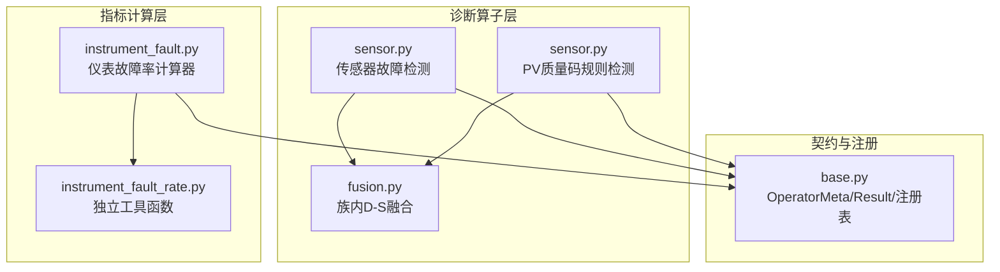
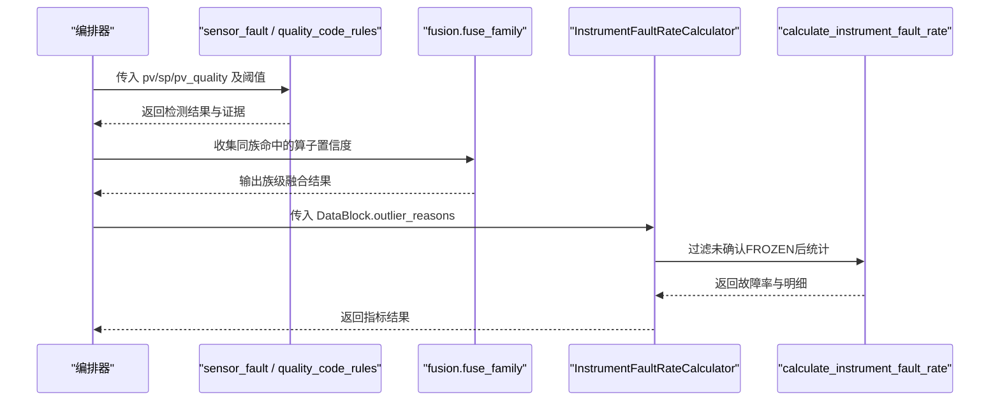
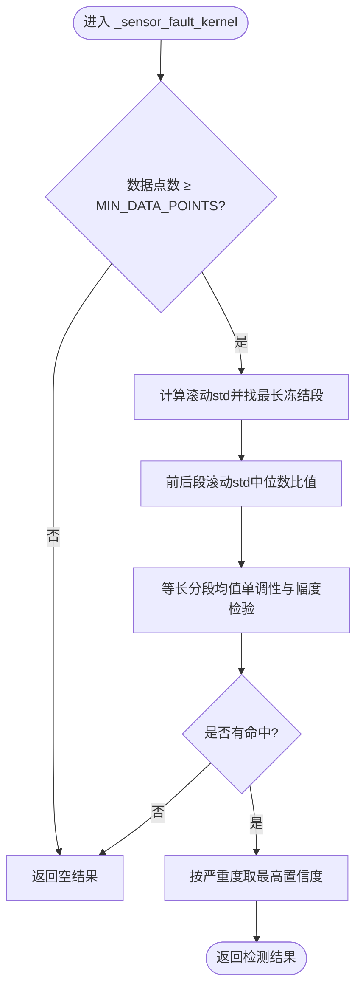
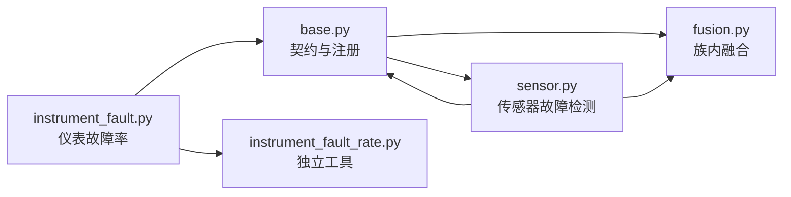

# 传感器故障检测算子

<cite>
**本文引用的文件**
- [backend/app/services/diagnosis_operators/sensor.py](file://backend/app/services/diagnosis_operators/sensor.py)
- [backend/app/services/diagnosis_operators/base.py](file://backend/app/services/diagnosis_operators/base.py)
- [backend/app/services/diagnosis_operators/fusion.py](file://backend/app/services/diagnosis_operators/fusion.py)
- [backend/app/services/metric_calculator/instrument_fault.py](file://backend/app/services/metric_calculator/instrument_fault.py)
- [backend/app/utils/instrument_fault_rate.py](file://backend/app/utils/instrument_fault_rate.py)
</cite>

## 目录
1. [引言](#引言)
2. [项目结构](#项目结构)
3. [核心组件](#核心组件)
4. [架构总览](#架构总览)
5. [详细组件分析](#详细组件分析)
6. [依赖关系分析](#依赖关系分析)
7. [性能考量](#性能考量)
8. [故障排查指南](#故障排查指南)
9. [结论](#结论)
10. [附录：参数配置与现场应用](#附录：参数配置与现场应用)

## 引言
本技术文档围绕“传感器故障检测算子”展开，面向过程控制与仪表运维场景，系统化说明传感器常见故障模式、检测算法、健康度评估、多传感器融合诊断、校准建议，以及与工艺异常的区分方法。文档基于仓库中已实现的诊断元算子与指标计算模块，确保内容与实际代码一致并可追溯。

## 项目结构
与传感器故障检测直接相关的后端实现集中在以下位置：
- 诊断元算子族（sensor 族）：提供卡死/噪声突增/漂移三子检测与 PV 质量码规则检测
- 族内证据融合：同族多算子结果通过 D-S 证据融合提升鲁棒性
- 仪表故障率指标：统计超限/冻结/突变三类异常点占比，并针对“冻结”复合判据抑制误报
- 基础契约与注册表：定义算子输入输出、阈值注入、证据项等统一接口

图表来源
- [backend/app/services/diagnosis_operators/sensor.py:1-484](file://backend/app/services/diagnosis_operators/sensor.py#L1-L484)
- [backend/app/services/diagnosis_operators/fusion.py:1-96](file://backend/app/services/diagnosis_operators/fusion.py#L1-L96)
- [backend/app/services/metric_calculator/instrument_fault.py:1-215](file://backend/app/services/metric_calculator/instrument_fault.py#L1-L215)
- [backend/app/utils/instrument_fault_rate.py:1-146](file://backend/app/utils/instrument_fault_rate.py#L1-L146)
- [backend/app/services/diagnosis_operators/base.py:1-137](file://backend/app/services/diagnosis_operators/base.py#L1-L137)

章节来源
- [backend/app/services/diagnosis_operators/sensor.py:1-484](file://backend/app/services/diagnosis_operators/sensor.py#L1-L484)
- [backend/app/services/diagnosis_operators/base.py:1-137](file://backend/app/services/diagnosis_operators/base.py#L1-L137)

## 核心组件
- 传感器故障检测算子（sensor_fault）
  - 目标：识别卡死（frozen）、噪声突增（noisy）、漂移（drift）三类典型传感器故障
  - 输入：pv（必需），sp（可选，用于排除工艺真实变化导致的漂移误判）
  - 输出：是否检出、置信度、故障子类型、关键特征（最长冻结段、噪声比、漂移幅度）
  - 阈值：窗口长度、冻结判定阈值、噪声前后段比值阈值、漂移分段数与倍数阈值等
- PV 质量码规则检测（quality_code_rules）
  - 目标：基于 Q001-Q005 质量码时序模式识别断流、坏点率、不确定率等异常
  - 输入：pv_quality（数值编码 0/1/2），pv_quality_ts（可选时间轴）
  - 输出：异常模式、置信度、坏点率、断流段定位
- 仪表故障率指标（instrument_fault_rate）
  - 目标：统计时段内含 OUT_OF_RANGE/FROZEN/JUMP 原因码的采样点占比
  - 复合判据：对 FROZEN 连续段进行“持续时长+OP 有变化”确认，抑制平稳回路误报
  - 输出：故障率、各类故障计数、样本量、数据来源
- 族内 D-S 证据融合（fusion）
  - 目标：同一族（如 sensor）多个算子命中时，按 Dempster-Shafer 公式融合置信度
  - 规则：仅 executed 且 detected 的算子参与；≥2 条命中才融合

章节来源
- [backend/app/services/diagnosis_operators/sensor.py:36-219](file://backend/app/services/diagnosis_operators/sensor.py#L36-L219)
- [backend/app/services/diagnosis_operators/sensor.py:330-484](file://backend/app/services/diagnosis_operators/sensor.py#L330-L484)
- [backend/app/services/metric_calculator/instrument_fault.py:52-123](file://backend/app/services/metric_calculator/instrument_fault.py#L52-L123)
- [backend/app/utils/instrument_fault_rate.py:28-138](file://backend/app/utils/instrument_fault_rate.py#L28-L138)
- [backend/app/services/diagnosis_operators/fusion.py:16-96](file://backend/app/services/diagnosis_operators/fusion.py#L16-L96)

## 架构总览
传感器故障检测采用“算子化 + 族内融合 + 指标聚合”的分层架构：
- 算子层：无状态纯函数，接收 pv/sp/op/pv_quality 等信号与阈值，输出检测结果与证据
- 融合层：同族算子结果经 D-S 融合，提高一致性校验能力
- 指标层：将预处理阶段的异常原因码汇总为仪表故障率，支持节点级聚合
- 契约层：统一 OperatorMeta/OperatorInput/OperatorResult/EvidenceItem 规范

图表来源
- [backend/app/services/diagnosis_operators/sensor.py:330-484](file://backend/app/services/diagnosis_operators/sensor.py#L330-L484)
- [backend/app/services/diagnosis_operators/fusion.py:64-96](file://backend/app/services/diagnosis_operators/fusion.py#L64-L96)
- [backend/app/services/metric_calculator/instrument_fault.py:72-123](file://backend/app/services/metric_calculator/instrument_fault.py#L72-L123)
- [backend/app/utils/instrument_fault_rate.py:61-138](file://backend/app/utils/instrument_fault_rate.py#L61-L138)

## 详细组件分析

### 传感器故障检测（sensor_fault）
- 故障模式覆盖
  - 卡涩/冻结（frozen）：滚动标准差低于阈值的最长持续段占比超过阈值即告警
  - 噪声增大（noisy）：前后段滚动标准差中位数比值超过阈值即告警
  - 漂移（drift）：等长分段均值单调递进且首尾差超 k×全局标准差；若 SP 同向同步变化则视为工艺真实变化，不判为漂移
- 算法要点
  - 滚动标准差 O(n) 实现，避免滑动窗口重复计算开销
  - 漂移检测引入 SP 同步性检查，降低工艺扰动误判
  - 多子类型同时命中时取最高置信度（卡死 > 噪声 > 漂移）
- 输出与证据
  - 输出包含故障子类型、置信度、最长冻结段、噪声比、漂移幅度
  - 证据项记录推理依据（如“传感器卡死：最长冻结段 X 点（占比 Y > Z），滚动 std < E”）

图表来源
- [backend/app/services/diagnosis_operators/sensor.py:76-219](file://backend/app/services/diagnosis_operators/sensor.py#L76-L219)

章节来源
- [backend/app/services/diagnosis_operators/sensor.py:76-219](file://backend/app/services/diagnosis_operators/sensor.py#L76-L219)

### PV 质量码规则检测（quality_code_rules）
- 规则集
  - Q001：连续 Bad 点超过阈值（按最长连续 Bad 段时长分级置信度）
  - Q002：Bad 点率超过阈值
  - Q003：Uncertain 点率超过阈值
  - Q004：存在持续 Bad 段但不满足 Q001
  - Q005：零星 Bad 段在指定范围内
- 输出
  - 异常模式、置信度、坏点率、断流段起止偏移（秒）
  - 支持 pv_quality_ts 精确时间轴展示

章节来源
- [backend/app/services/diagnosis_operators/sensor.py:222-327](file://backend/app/services/diagnosis_operators/sensor.py#L222-L327)
- [backend/app/services/diagnosis_operators/sensor.py:390-484](file://backend/app/services/diagnosis_operators/sensor.py#L390-L484)

### 仪表故障率指标（instrument_fault_rate）
- 统计口径
  - 仅统计 OUT_OF_RANGE、FROZEN、JUMP 三类原因码对应点
  - 分母为评估时段总采样点数（point_count），确保被排除出 mask 的故障点也被统计
- 冻结复合判据
  - 连续 FROZEN 段需满足：持续时间 ≥ 配置分钟数，且同期 OP 标准差超过阈值
  - 无法执行复合判据时回落旧口径（FROZEN 直接计故障），避免静默漏报
- 输出
  - 故障率百分比、冻结/突变/超量程计数、样本量、数据来源

章节来源
- [backend/app/services/metric_calculator/instrument_fault.py:52-123](file://backend/app/services/metric_calculator/instrument_fault.py#L52-L123)
- [backend/app/services/metric_calculator/instrument_fault.py:129-195](file://backend/app/services/metric_calculator/instrument_fault.py#L129-L195)
- [backend/app/utils/instrument_fault_rate.py:28-138](file://backend/app/utils/instrument_fault_rate.py#L28-L138)

### 族内 D-S 证据融合（fusion）
- 融合策略
  - 仅同族（如 sensor）算子之间做交叉验证融合
  - 使用 Dempster-Shafer 公式：C_fused = (Π c_i) / (Π c_i + Π (1-c_i))
  - 单命中原样返回，零命中未检出
- 输出
  - 族级检测结果、置信度、贡献者列表、是否发生融合

章节来源
- [backend/app/services/diagnosis_operators/fusion.py:16-96](file://backend/app/services/diagnosis_operators/fusion.py#L16-L96)

## 依赖关系分析
- 算子契约依赖 base.py 的 OperatorMeta/OperatorInput/OperatorResult/EvidenceItem
- 传感器故障检测依赖 numpy 进行滚动标准差与分段统计
- 仪表故障率指标依赖预处理阶段 outliner_reasons 与阈值配置
- 族内融合依赖各算子输出的 confidence 字段

图表来源
- [backend/app/services/diagnosis_operators/base.py:1-137](file://backend/app/services/diagnosis_operators/base.py#L1-L137)
- [backend/app/services/diagnosis_operators/sensor.py:1-484](file://backend/app/services/diagnosis_operators/sensor.py#L1-L484)
- [backend/app/services/diagnosis_operators/fusion.py:1-96](file://backend/app/services/diagnosis_operators/fusion.py#L1-L96)
- [backend/app/services/metric_calculator/instrument_fault.py:1-215](file://backend/app/services/metric_calculator/instrument_fault.py#L1-L215)
- [backend/app/utils/instrument_fault_rate.py:1-146](file://backend/app/utils/instrument_fault_rate.py#L1-L146)

章节来源
- [backend/app/services/diagnosis_operators/base.py:1-137](file://backend/app/services/diagnosis_operators/base.py#L1-L137)
- [backend/app/services/diagnosis_operators/sensor.py:1-484](file://backend/app/services/diagnosis_operators/sensor.py#L1-L484)
- [backend/app/services/diagnosis_operators/fusion.py:1-96](file://backend/app/services/diagnosis_operators/fusion.py#L1-L96)
- [backend/app/services/metric_calculator/instrument_fault.py:1-215](file://backend/app/services/metric_calculator/instrument_fault.py#L1-L215)
- [backend/app/utils/instrument_fault_rate.py:1-146](file://backend/app/utils/instrument_fault_rate.py#L1-L146)

## 性能考量
- 滚动标准差采用累积和实现，时间复杂度 O(n)，避免重复计算
- 漂移检测将序列等分为若干段，减少逐点比较的计算量
- 仪表故障率统计一次性遍历原因码列表，复杂度 O(n)
- 族内融合仅在命中的算子间进行，计算开销低

[本节为通用性能讨论，无需特定文件引用]

## 故障排查指南
- 传感器故障检测失败
  - 现象：返回空结果或置信度为 0
  - 可能原因：数据点数不足、阈值设置过严、SP 同步变化导致漂移排除
  - 处理建议：检查 MIN_DATA_POINTS、调整 frozen_window/noise_ratio/drift_k、核对 SP 是否反映工艺真实变化
- PV 质量码异常
  - 现象：Q001/Q002/Q003/Q004/Q005 频繁触发
  - 可能原因：通信链路不稳定、采样间隔异常、数据质量码标注错误
  - 处理建议：核对 pv_quality 与 pv_quality_ts、检查采样间隔、关注断流段定位
- 仪表故障率偏高
  - 现象：FROZEN/JUMP/OUT_OF_RANGE 占比高
  - 可能原因：传感器卡死、信号突变、超量程；或复合判据未生效
  - 处理建议：确认 OP 信号与时间戳可用性、检查 frozen_fault_min_minutes 与 frozen_std_pct 配置

章节来源
- [backend/app/services/diagnosis_operators/sensor.py:36-219](file://backend/app/services/diagnosis_operators/sensor.py#L36-L219)
- [backend/app/services/diagnosis_operators/sensor.py:222-327](file://backend/app/services/diagnosis_operators/sensor.py#L222-L327)
- [backend/app/services/metric_calculator/instrument_fault.py:129-195](file://backend/app/services/metric_calculator/instrument_fault.py#L129-L195)

## 结论
传感器故障检测算子通过“波形侧三子检测 + 质量码规则 + 仪表故障率指标 + 族内融合”形成闭环诊断体系。其优势在于：
- 明确覆盖卡死、噪声增大、漂移三大常见故障模式
- 利用 SP 同步性排除工艺真实变化导致的漂移误判
- 通过 D-S 融合提升多算子一致性校验能力
- 仪表故障率指标复用预处理结果，支持节点级聚合与可视化

[本节为总结性内容，无需特定文件引用]

## 附录：参数配置与现场应用

### 传感器故障检测参数（sensor_fault）
- 冻结检测
  - frozen_window：滚动窗口长度（默认 300）
  - frozen_eps：滚动标准差阈值（默认 1e-4）
  - frozen_ratio：最长冻结段占比阈值（默认 0.2）
- 噪声检测
  - noise_ratio：前后段滚动 std 中位数比值阈值（默认 3.0）
  - noise_segment：前后段分割比例（默认 0.5）
- 漂移检测
  - drift_k：漂移幅度阈值倍数（默认 2.0）
  - drift_segments：分段数量（默认 5）

章节来源
- [backend/app/services/diagnosis_operators/sensor.py:330-360](file://backend/app/services/diagnosis_operators/sensor.py#L330-L360)

### PV 质量码规则参数（quality_code_rules）
- q001_consecutive_bad：连续 Bad 点阈值（默认 10）
- q002_bad_rate：Bad 点率阈值（默认 0.1）
- q003_uncertain_rate：Uncertain 点率阈值（默认 0.2）
- q004_bad_duration：持续 Bad 段时长阈值（默认 5）
- q005_min_bad/q005_max_bad：零星 Bad 段范围（默认 3~10）

章节来源
- [backend/app/services/diagnosis_operators/sensor.py:390-425](file://backend/app/services/diagnosis_operators/sensor.py#L390-L425)

### 仪表故障率复合判据参数
- frozen_fault_min_minutes：冻结段最小持续时间（分钟）
- frozen_std_pct：OP 标准差阈值百分比
- 说明：当缺少 OP 信号/时间戳/阈值配置时，回退到旧口径（FROZEN 直接计故障）

章节来源
- [backend/app/services/metric_calculator/instrument_fault.py:129-195](file://backend/app/services/metric_calculator/instrument_fault.py#L129-L195)

### 多传感器融合诊断
- 冗余测量比对：同族多算子结果经 D-S 融合，提升鲁棒性
- 交叉验证：不同子类型（卡死/噪声/漂移）相互印证
- 故障隔离：结合 SP 同步性判断，区分传感器漂移与工艺真实变化

章节来源
- [backend/app/services/diagnosis_operators/fusion.py:16-96](file://backend/app/services/diagnosis_operators/fusion.py#L16-L96)
- [backend/app/services/diagnosis_operators/sensor.py:165-206](file://backend/app/services/diagnosis_operators/sensor.py#L165-L206)

### 健康度评估建议
- 精度保持能力：参考仪表故障率指标（OUT_OF_RANGE/FROZEN/JUMP 占比）
- 响应特性：结合 PV 质量码规则（Q001-Q005）评估断流与坏点情况
- 长期稳定性监测：跟踪传感器故障检测置信度趋势与仪表故障率趋势

[本节为通用指导，无需特定文件引用]

### 与过程异常的区分
- 传感器故障 vs 工艺扰动：漂移检测中若 SP 同向同步变化，视为工艺真实变化，不判为传感器漂移
- 仪表问题 vs 控制问题：冻结复合判据要求 OP 有变化而 PV 不动，才认定为真仪表卡死

章节来源
- [backend/app/services/diagnosis_operators/sensor.py:165-206](file://backend/app/services/diagnosis_operators/sensor.py#L165-L206)
- [backend/app/services/metric_calculator/instrument_fault.py:129-195](file://backend/app/services/metric_calculator/instrument_fault.py#L129-L195)

### 校准建议
- 校准周期推荐：依据仪表故障率趋势与 PV 质量码异常频率动态调整
- 校准方法指导：结合漂移检测与质量码规则，识别需要校准的时段
- 偏差修正策略：对漂移显著且非工艺变化的时段进行零点/量程修正

[本节为通用指导，无需特定文件引用]