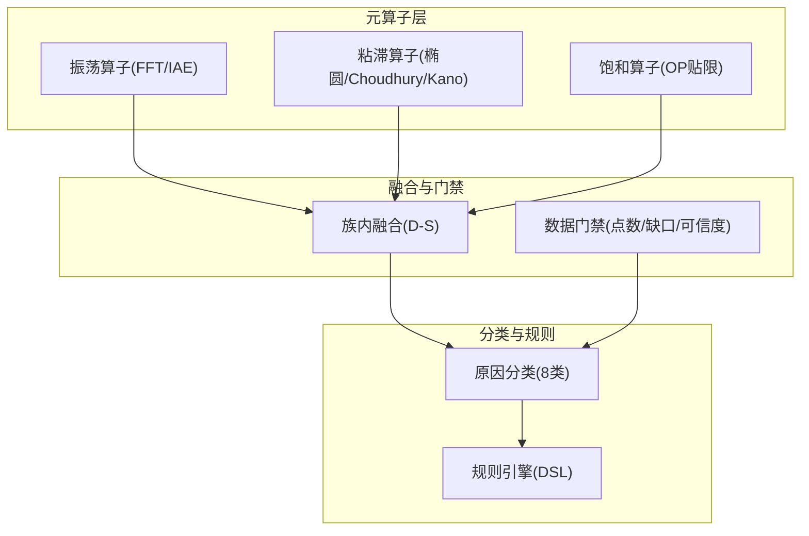
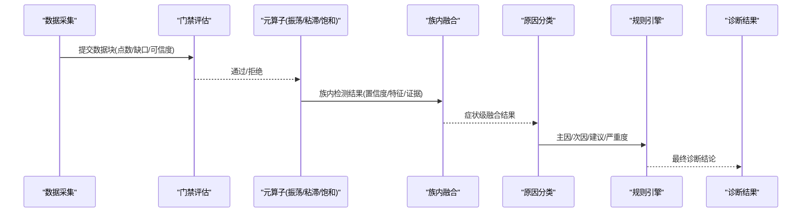
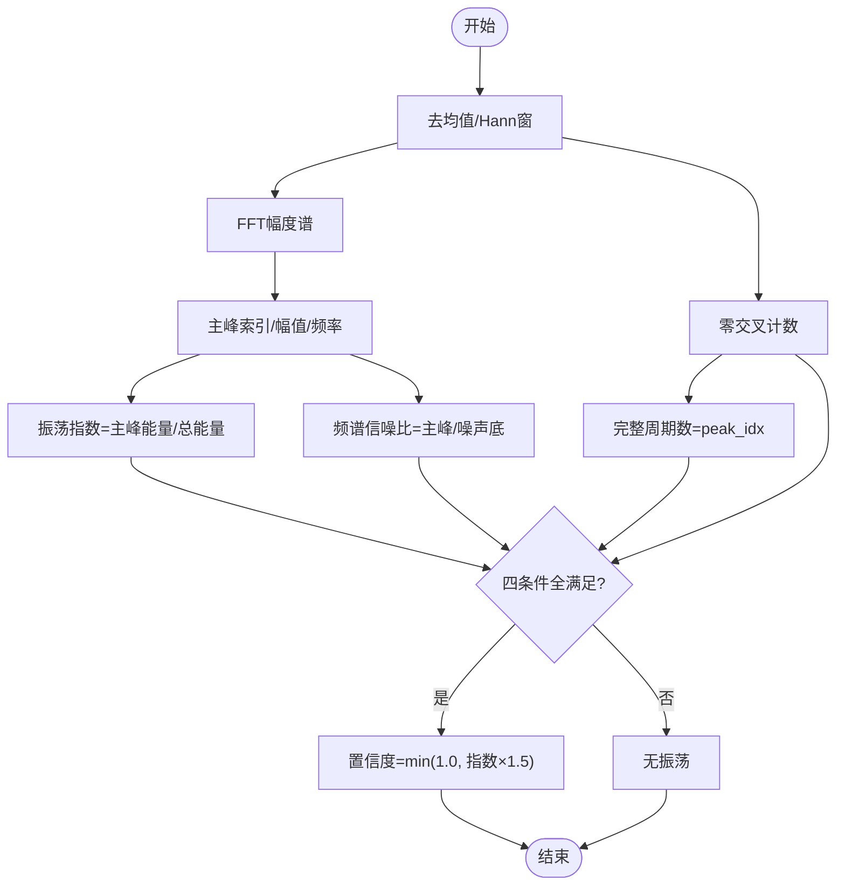
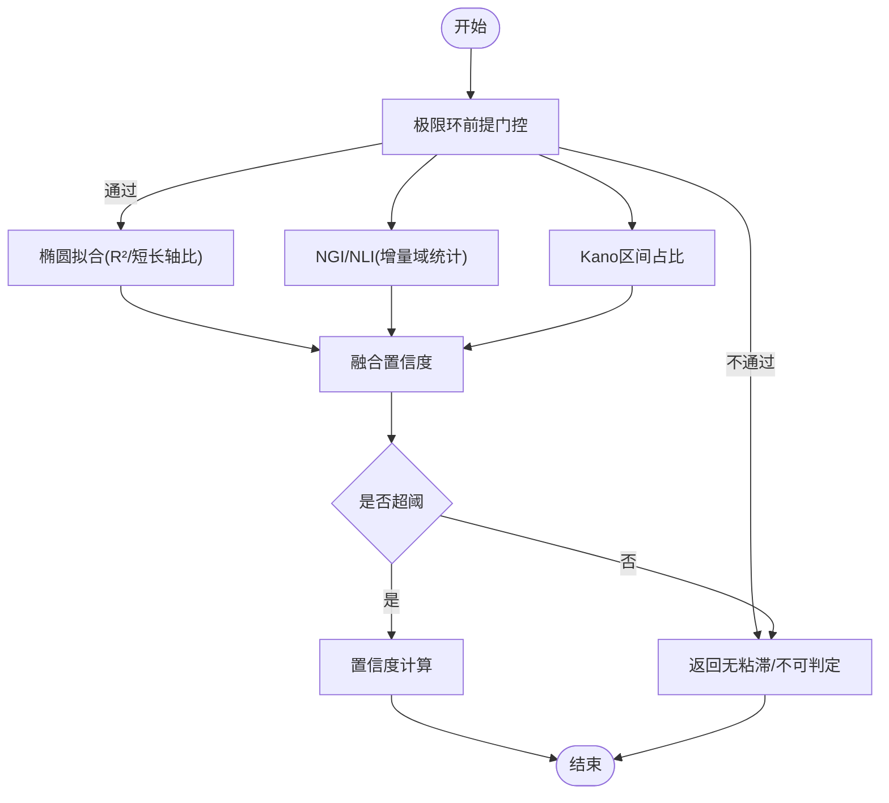
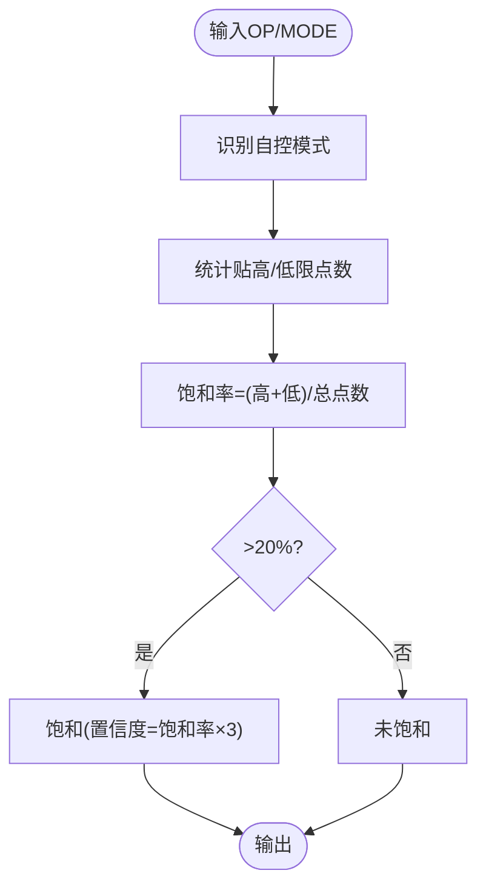
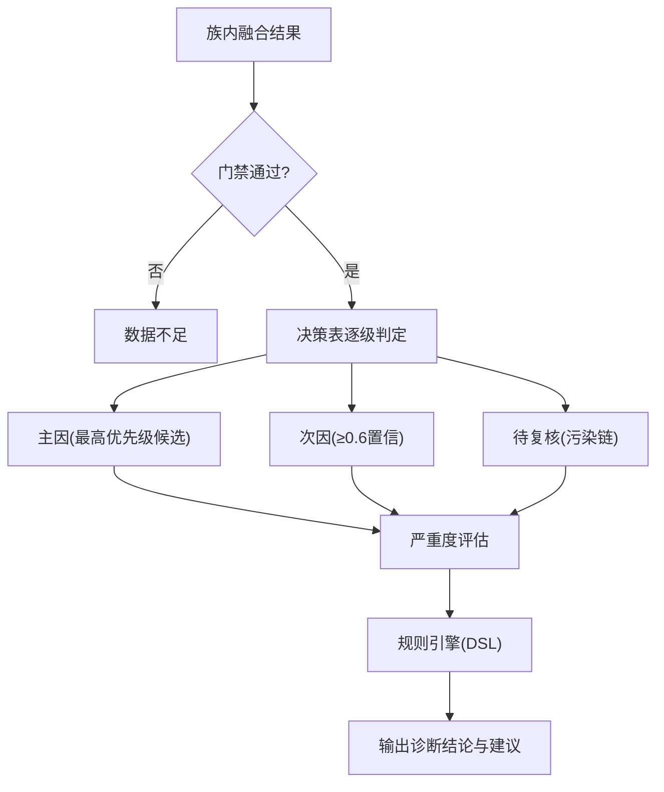
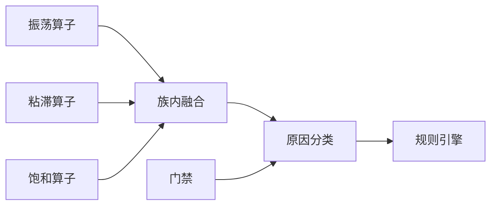

# 分类算子系统

<cite>
**本文引用的文件**
- [backend/app/services/diagnosis_operators/classification.py](file://backend/app/services/diagnosis_operators/classification.py)
- [backend/app/services/diagnosis_operators/oscillation.py](file://backend/app/services/diagnosis_operators/oscillation.py)
- [backend/app/services/diagnosis_operators/stiction.py](file://backend/app/services/diagnosis_operators/stiction.py)
- [backend/app/services/diagnosis_operators/saturation.py](file://backend/app/services/diagnosis_operators/saturation.py)
- [backend/app/services/metric_calculator/stiction.py](file://backend/app/services/metric_calculator/stiction.py)
- [backend/app/tasks/diagnosis_engine.py](file://backend/app/tasks/diagnosis_engine.py)
- [backend/tests/test_diagnosis_classification.py](file://backend/tests/test_diagnosis_classification.py)
- [backend/tests/test_diagnosis_engine.py](file://backend/tests/test_diagnosis_engine.py)
- [backend/tests/test_metric_calculator/test_stiction.py](file://backend/tests/test_metric_calculator/test_stiction.py)
- [backend/app/services/alert_rule_engine/evaluator.py](file://backend/app/services/alert_rule_engine/evaluator.py)
- [backend/app/services/diagnosis_rule.py](file://backend/app/services/diagnosis_rule.py)
- [docs/过程文档/superpowers/plans/v6-baseline-dds.md](file://docs/过程文档/superpowers/plans/v6-baseline-dds.md)
</cite>

## 目录
1. [简介](#简介)
2. [项目结构](#项目结构)
3. [核心组件](#核心组件)
4. [架构总览](#架构总览)
5. [详细组件分析](#详细组件分析)
6. [依赖关系分析](#依赖关系分析)
7. [性能考虑](#性能考虑)
8. [故障排查指南](#故障排查指南)
9. [结论](#结论)
10. [附录：参数配置与调试方法](#附录参数配置与调试方法)

## 简介
本技术文档面向“控制回路状态分类算法”的实现，覆盖正常工况识别、异常状态判定、多模式切换逻辑；详细说明振荡检测（频率分析、振幅统计）、粘滞识别（死区检测、非线性特征）、饱和判断（限幅分析、执行器状态）等故障模式的特征提取；阐述分类决策树与规则引擎的多指标综合评估、置信度计算与边界条件处理；解释与现代诊断结果到传统8类症状体系的映射关系；并提供准确率评估、误报率控制策略、不同工况下的适应性调整以及参数配置与调试方法。

## 项目结构
分类算子系统由“元算子层 + 族内融合 + 门禁 + 原因分类 + 规则引擎”构成：
- 元算子层：按症状族组织，提供可复用的信号级检测能力（振荡、粘滞、饱和等）。
- 族内融合：对同一症状族的多个算子结果进行Dempster-Shafer融合，提升鲁棒性。
- 门禁：数据质量与可信度门控，避免在数据不足或质量差时输出误导结论。
- 原因分类：将症状级结果映射到8类原因（参数、阀门、仪表、通信、工艺、投用、设计、数据不足），并生成处置建议与严重度。
- 规则引擎：基于DSL的阈值/组合/可信度联动规则，支持抑制、降级、去重等动作。

图表来源
- [backend/app/services/diagnosis_operators/oscillation.py:223-323](file://backend/app/services/diagnosis_operators/oscillation.py#L223-L323)
- [backend/app/services/diagnosis_operators/stiction.py:341-530](file://backend/app/services/diagnosis_operators/stiction.py#L341-L530)
- [backend/app/services/diagnosis_operators/saturation.py:119-169](file://backend/app/services/diagnosis_operators/saturation.py#L119-L169)
- [backend/app/services/diagnosis_operators/classification.py:190-461](file://backend/app/services/diagnosis_operators/classification.py#L190-L461)
- [backend/app/services/alert_rule_engine/evaluator.py:72-136](file://backend/app/services/alert_rule_engine/evaluator.py#L72-L136)

章节来源
- [backend/app/services/diagnosis_operators/oscillation.py:223-323](file://backend/app/services/diagnosis_operators/oscillation.py#L223-L323)
- [backend/app/services/diagnosis_operators/stiction.py:341-530](file://backend/app/services/diagnosis_operators/stiction.py#L341-L530)
- [backend/app/services/diagnosis_operators/saturation.py:119-169](file://backend/app/services/diagnosis_operators/saturation.py#L119-L169)
- [backend/app/services/diagnosis_operators/classification.py:190-461](file://backend/app/services/diagnosis_operators/classification.py#L190-L461)
- [backend/app/services/alert_rule_engine/evaluator.py:72-136](file://backend/app/services/alert_rule_engine/evaluator.py#L72-L136)

## 核心组件
- 振荡检测（OSCILLATION）
  - FFT频域法：Hann窗+单边谱幅值恢复，主峰能量占比作为振荡指数，结合零交叉数、完整周期数、频谱信噪比四条件判定。
  - IAE零交叉相似率法：基于控制偏差的正负半周期IAE相似率，配合最小半周期门控抗白噪声伪穿越。
- 粘滞识别（VALVE_STICTION）
  - 椭圆拟合：PV-OP散点椭圆短长轴比与R²拟合度，含互相关θ补偿与极限环前提门控。
  - Choudhury NGI/NLI：OP增量域非高斯指数与双相干性非线性指数，需极限环前提。
  - Kano统计法：OP单调分段中“OP几乎不变而PV大幅变化”的区间占比。
- 饱和判断（OUTPUT_SATURATION）
  - OP贴工程限位时长占比（自控模式下计数，分母为时间窗总点数），>20%判饱和。
- 门禁与融合
  - 门禁：点数、缺口率、可信度等级（A-E）拒判。
  - 融合：同族≥2算子命中时D-S交叉验证融合，单算子命中原样传递置信度。
- 原因分类（8类）
  - 决策表优先级：数据不足→通信→仪表→阀门→工艺→参数→投用→兜底。
  - 污染链：通信/仪表/阀门/外扰对下游参数的证据污染，降级为待复核。
  - 严重度：综合KPI评分与主因置信度分级（HIGH/MEDIUM/LOW）。

章节来源
- [backend/app/services/diagnosis_operators/oscillation.py:49-220](file://backend/app/services/diagnosis_operators/oscillation.py#L49-L220)
- [backend/app/services/diagnosis_operators/stiction.py:80-338](file://backend/app/services/diagnosis_operators/stiction.py#L80-L338)
- [backend/app/services/diagnosis_operators/saturation.py:46-116](file://backend/app/services/diagnosis_operators/saturation.py#L46-L116)
- [backend/app/services/diagnosis_operators/classification.py:190-461](file://backend/app/services/diagnosis_operators/classification.py#L190-L461)

## 架构总览
分类系统的数据流与控制流如下：
- 输入：PV、SP、OP、MODE、质量码、KPI快照等。
- 预处理：门禁校验（点数、缺口率、可信度）。
- 算子执行：各症状族元算子并行计算，产出detected/confidence/features/evidence。
- 族内融合：D-S融合提升稳定性。
- 原因分类：决策表逐级判定主因、次因与待复核项，生成建议与严重度。
- 规则引擎：基于DSL的条件求值（阈值/组合/可信度联动），支持抑制/降级/去重。
- 输出：诊断结论、置信度、证据链、处置建议、严重度。

图表来源
- [backend/app/services/diagnosis_operators/classification.py:190-461](file://backend/app/services/diagnosis_operators/classification.py#L190-L461)
- [backend/app/services/alert_rule_engine/evaluator.py:72-136](file://backend/app/services/alert_rule_engine/evaluator.py#L72-L136)

## 详细组件分析

### 振荡检测（频率分析与振幅统计）
- FFT路径
  - Hann窗抑制频谱泄漏，单边谱幅值恢复公式为2·|X(k)|/Σw，频率取bin中心。
  - 判定四条件：振荡指数（主峰能量占比）、零交叉数、完整周期数、频谱信噪比。
  - 置信度：min(1.0, 振荡指数×1.5)。
- IAE路径
  - 控制偏差误差序列，零交叉点分割半周期，正负半周期IAE相似率S_A/S_B。
  - 判定：双侧相似率均达阈值且平均半周期达标。
  - 置信度：min(1.0, 相似率×1.5)。

图表来源
- [backend/app/services/diagnosis_operators/oscillation.py:49-120](file://backend/app/services/diagnosis_operators/oscillation.py#L49-L120)
- [backend/app/tasks/diagnosis_engine.py:1926-1955](file://backend/app/tasks/diagnosis_engine.py#L1926-L1955)

章节来源
- [backend/app/services/diagnosis_operators/oscillation.py:49-220](file://backend/app/services/diagnosis_operators/oscillation.py#L49-L220)
- [backend/tests/test_diagnosis_engine.py:1209-1261](file://backend/tests/test_diagnosis_engine.py#L1209-L1261)

### 粘滞识别（死区检测与非线性特征）
- 椭圆拟合
  - PV-OP散点椭圆短长轴比与R²拟合度，含互相关θ补偿（峰值相关≥0.3启用），极限环前提门控。
  - 判定：极限环+R²≥MIN_FITTING_SCORE+短长轴比>0.3。
  - 置信度：min(1.0, (拟合分+粘滞指数)/2)。
- Choudhury NGI/NLI
  - OP增量域偏度与峰度计算NGI；最大双相干性近似NLI（分段平均+逐对噪声底校正）。
  - 判定：NGI>阈值且NLI>阈值；需极限环前提。
  - 置信度：加权融合NGI、NLI、椭圆拟合分。
- Kano统计法
  - OP单调分段统计“OP几乎不变但PV大幅变化”的区间占比>0.6。
  - 需极限环前提。

图表来源
- [backend/app/services/diagnosis_operators/stiction.py:80-338](file://backend/app/services/diagnosis_operators/stiction.py#L80-L338)
- [backend/app/services/metric_calculator/stiction.py:106-133](file://backend/app/services/metric_calculator/stiction.py#L106-L133)

章节来源
- [backend/app/services/diagnosis_operators/stiction.py:80-530](file://backend/app/services/diagnosis_operators/stiction.py#L80-L530)
- [backend/app/services/metric_calculator/stiction.py:106-133](file://backend/app/services/metric_calculator/stiction.py#L106-L133)
- [backend/tests/test_metric_calculator/test_stiction.py:38-212](file://backend/tests/test_metric_calculator/test_stiction.py#L38-L212)

### 饱和判断（限幅分析与执行器状态）
- 自控模式下OP贴工程限位点数占比（高/低限带ε容差），分母为时间窗总点数。
- >20%判饱和，置信度=min(1.0, 饱和率×3)。
- MODE识别兼容多种类型（布尔/整型/浮点/字符串）。

图表来源
- [backend/app/services/diagnosis_operators/saturation.py:46-116](file://backend/app/services/diagnosis_operators/saturation.py#L46-L116)

章节来源
- [backend/app/services/diagnosis_operators/saturation.py:119-169](file://backend/app/services/diagnosis_operators/saturation.py#L119-L169)

### 分类决策树与规则引擎
- 决策表（优先级自上而下）
  - 级0：数据门禁不过→数据不足。
  - 级0.5：链路族命中→通信。
  - 级1：仪表族命中→仪表。
  - 级2：粘滞族融合置信≥0.7或≥2算子命中→阀门。
  - 级3：OP长期贴限>80%→阀门（容量方向）。
  - 级4：外扰命中或（振荡且无粘滞且无过激）→工艺。
  - 级5：过激/过保守命中→参数。
  - 级6：自动投用率<50%→投用。
  - 级7：兜底→数据不足。
- 污染链与降级
  - 通信/仪表/阀门/外扰对下游参数的证据污染，降级为待复核。
- 严重度
  - 综合KPI评分与主因置信度：score<40且置信≥0.8→HIGH；score<60或置信≥0.6→MEDIUM；否则LOW。
- 规则引擎
  - 时效窗口过滤、可信度联动（抑制/降级）、阈值/组合条件求值、去重键渲染。

图表来源
- [backend/app/services/diagnosis_operators/classification.py:190-461](file://backend/app/services/diagnosis_operators/classification.py#L190-L461)
- [backend/app/services/alert_rule_engine/evaluator.py:72-136](file://backend/app/services/alert_rule_engine/evaluator.py#L72-L136)

章节来源
- [backend/app/services/diagnosis_operators/classification.py:190-461](file://backend/app/services/diagnosis_operators/classification.py#L190-L461)
- [backend/app/services/alert_rule_engine/evaluator.py:72-136](file://backend/app/services/alert_rule_engine/evaluator.py#L72-L136)
- [backend/app/services/diagnosis_rule.py:238-275](file://backend/app/services/diagnosis_rule.py#L238-L275)

### 与传统8类症状体系的映射
- 现代诊断结果（症状标签）到传统8类症状（calc_method）映射：
  - 振荡检测 → OSCILLATION（IAE_ZERO_CROSSING / FFT_WELCH）
  - 阀门粘滞 → VALVE_STICTION（CHOUDHURY_NGI_NLI / KANO_STATISTICAL）
  - 参数问题 → OVERAGGRESSIVE / OVERCONSERVATIVE（STEP_RESPONSE_ANALYSIS / SETTLING_TIME_ANALYSIS）
  - 外部扰动 → EXTERNAL_DISTURBANCE（DISTURBANCE_FREQUENCY）
  - 质量异常 → QUALITY_ABNORMAL（QUALITY_CODE_RULE）
  - 输出饱和 → OUTPUT_SATURATION（OP_SATURATION_STAT）
- 映射依据与业务含义见DDS文档。

章节来源
- [docs/过程文档/superpowers/plans/v6-baseline-dds.md:569-582](file://docs/过程文档/superpowers/plans/v6-baseline-dds.md#L569-L582)

## 依赖关系分析
- 元算子间耦合
  - 粘滞三法共享极限环前提门控（StictionIndexCalculator._detect_limit_cycle），确保物理一致性。
  - 振荡IAE复用KPI侧OscillationRateCalculator，保证口径一致。
- 分类与融合
  - 分类依赖族内融合结果（FamilyFusion）与门禁结论（GateResult）。
  - 污染链映射（CONTAMINATION_MAP）决定降级策略。
- 规则引擎
  - 与门禁可信度联动，支持SUPPRESS/DOWNGRADE动作。

图表来源
- [backend/app/services/diagnosis_operators/stiction.py:205-220](file://backend/app/services/diagnosis_operators/stiction.py#L205-L220)
- [backend/app/services/diagnosis_operators/oscillation.py:123-220](file://backend/app/services/diagnosis_operators/oscillation.py#L123-L220)
- [backend/app/services/diagnosis_operators/classification.py:190-461](file://backend/app/services/diagnosis_operators/classification.py#L190-L461)
- [backend/app/services/alert_rule_engine/evaluator.py:72-136](file://backend/app/services/alert_rule_engine/evaluator.py#L72-L136)

章节来源
- [backend/app/services/diagnosis_operators/stiction.py:205-220](file://backend/app/services/diagnosis_operators/stiction.py#L205-L220)
- [backend/app/services/diagnosis_operators/oscillation.py:123-220](file://backend/app/services/diagnosis_operators/oscillation.py#L123-L220)
- [backend/app/services/diagnosis_operators/classification.py:190-461](file://backend/app/services/diagnosis_operators/classification.py#L190-L461)
- [backend/app/services/alert_rule_engine/evaluator.py:72-136](file://backend/app/services/alert_rule_engine/evaluator.py#L72-L136)

## 性能考虑
- FFT与IAE路径向量化实现，减少循环开销；Hann窗与单边谱归一化避免幅值失真。
- 粘滞三法统一极限环前提门控，避免在非振荡段误检；双相干性分段估计提升NLI稳健性。
- 饱和统计仅遍历一次OP序列，MODE识别批量向量化。
- 族内融合仅在≥2算子命中时触发，降低计算成本。
- 规则引擎支持时效窗口与去重键，减少重复告警。

[本节为通用性能讨论，无需特定文件引用]

## 故障排查指南
- 数据不足/门禁失败
  - 检查点数、缺口率、可信度等级（E级拒判）。
- 振荡误报/漏报
  - 调整FFT阈值（振荡指数、最小零交叉、最小周期、最小SNR）；IAE相似率阈值与最小半周期。
  - 参考测试用例验证幅值恢复与频率精度。
- 粘滞误报
  - 确认极限环前提门控生效；检查θ补偿是否启用（互相关峰值≥0.3）。
  - 对纯相位滞后场景，补偿后应塌陷为直线，避免误报SEVERE。
- 饱和误判
  - 核对MODE识别逻辑与工程限位设置；确认分母为时间窗总点数。
- 规则引擎抑制/降级
  - 检查confidencePolicy与severity降级逻辑；确认dedupKey渲染正确。

章节来源
- [backend/tests/test_diagnosis_engine.py:1209-1261](file://backend/tests/test_diagnosis_engine.py#L1209-L1261)
- [backend/tests/test_metric_calculator/test_stiction.py:54-73](file://backend/tests/test_metric_calculator/test_stiction.py#L54-L73)
- [backend/app/services/alert_rule_engine/evaluator.py:72-136](file://backend/app/services/alert_rule_engine/evaluator.py#L72-L136)

## 结论
分类算子系统通过“元算子+融合+门禁+分类+规则”的分层架构，实现了从信号级检测到原因级归因的完整闭环。振荡、粘滞、饱和三类关键故障的特征提取与判定逻辑具备明确的物理前提与统计基础；决策表与污染链机制保障了主因唯一性与下游证据的合理性；规则引擎提供了灵活的抑制与降级策略。整体方案兼顾准确性、鲁棒性与可维护性，适用于多工况下的控制回路诊断。

[本节为总结性内容，无需特定文件引用]

## 附录：参数配置与调试方法
- 振荡检测参数
  - FFT：fft_osc_index_threshold、fft_min_zero_crossings、fft_min_cycles、fft_min_snr。
  - IAE：similarity_threshold、min_zero_crossings、min_half_period_samples。
- 粘滞检测参数
  - 椭圆：MIN_FITTING_SCORE、短长轴比阈值（对齐KPI SEVERE等级）。
  - Choudhury：choudhury_ngi_threshold、choudhury_nli_threshold。
  - Kano：粘滞区间占比阈值（>0.6）。
- 饱和检测参数
  - op_high_limit、op_low_limit、saturation_epsilon；饱和率阈值>0.2。
- 门禁与可信度
  - 点数门槛、缺口率上限、可信度等级（A-E）拒判。
- 调试方法
  - 使用等价性回归测试对比旧引擎与新算子输出。
  - 针对典型场景（正弦振荡、粘滑注入、纯相位滞后、白噪声）构造数据集验证。
  - 通过证据链（EvidenceItem）查看各指标是否超阈及拦截原因。

章节来源
- [backend/app/services/diagnosis_operators/oscillation.py:233-295](file://backend/app/services/diagnosis_operators/oscillation.py#L233-L295)
- [backend/app/services/diagnosis_operators/stiction.py:341-485](file://backend/app/services/diagnosis_operators/stiction.py#L341-L485)
- [backend/app/services/diagnosis_operators/saturation.py:128-140](file://backend/app/services/diagnosis_operators/saturation.py#L128-L140)
- [backend/tests/test_diagnosis_classification.py:28-45](file://backend/tests/test_diagnosis_classification.py#L28-L45)
- [backend/tests/test_metric_calculator/test_stiction.py:181-212](file://backend/tests/test_metric_calculator/test_stiction.py#L181-L212)