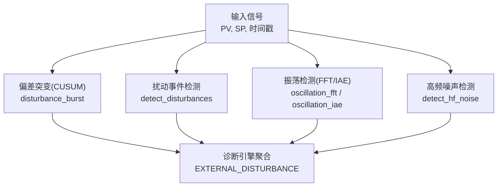
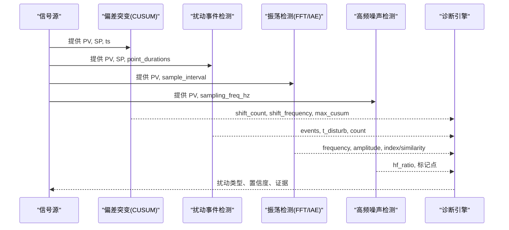
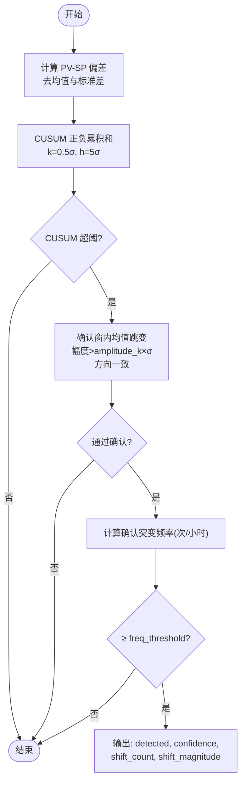
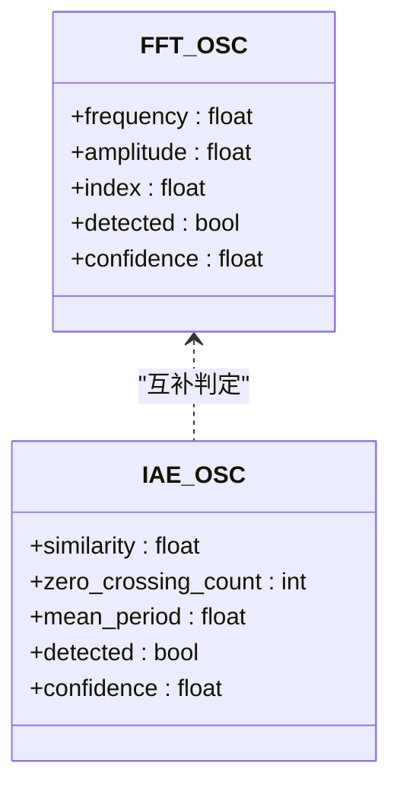
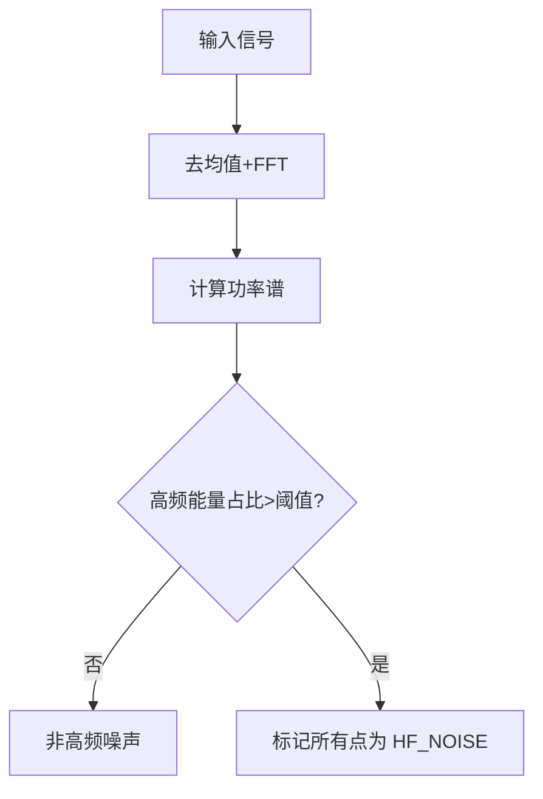
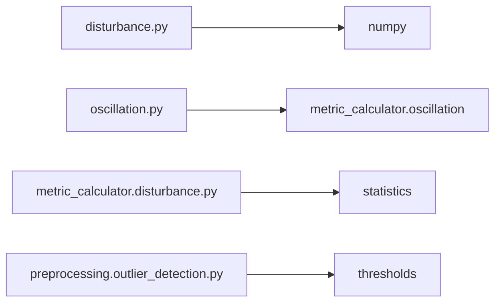

# 扰动检测算子

<cite>
**本文引用的文件**
- [backend/app/services/diagnosis_operators/disturbance.py](file://backend/app/services/diagnosis_operators/disturbance.py)
- [backend/app/services/metric_calculator/disturbance.py](file://backend/app/services/metric_calculator/disturbance.py)
- [backend/app/services/diagnosis_operators/oscillation.py](file://backend/app/services/diagnosis_operators/oscillation.py)
- [backend/app/tasks/diagnosis_engine.py](file://backend/app/tasks/diagnosis_engine.py)
- [backend/app/services/preprocessing/outlier_detection.py](file://backend/app/services/preprocessing/outlier_detection.py)
- [backend/tests/test_diagnosis_engine.py](file://backend/tests/test_diagnosis_engine.py)
- [backend/tests/test_metric_calculator/test_disturbance.py](file://backend/tests/test_metric_calculator/test_disturbance.py)
- [backend/tests/test_preprocessing/test_outlier_detection.py](file://backend/tests/test_preprocessing/test_outlier_detection.py)
</cite>

## 目录
1. [简介](#简介)
2. [项目结构](#项目结构)
3. [核心组件](#核心组件)
4. [架构总览](#架构总览)
5. [详细组件分析](#详细组件分析)
6. [依赖关系分析](#依赖关系分析)
7. [性能考量](#性能考量)
8. [故障排查指南](#故障排查指南)
9. [结论](#结论)
10. [附录](#附录)

## 简介
本技术文档面向“扰动检测算子”，系统阐述以下能力：
- 阶跃扰动检测：基于 CUSUM 累积和的均值漂移检测，结合确认窗与频率阈值，识别频繁外扰。
- 周期性扰动识别：通过 FFT 频域能量占比、零交叉相似率（IAE）等方法识别振荡型扰动。
- 随机噪声分离：高频噪声能量占比判定，用于区分仪表噪声与工艺扰动。
- 均值漂移检测：趋势分析与突变点定位，统计扰动持续时间与幅度。
- 扰动源定位思路：依据 PV 响应特征反推扰动来源与传播路径。
- 强度评估指标：幅值统计、频率特性、能量分布等。
- 场景策略与参数调优：针对工艺扰动、仪表噪声、控制动作干扰的识别策略与调参建议。

## 项目结构
本项目将扰动检测相关算法拆分为可复用的“算子”与“度量计算模块”，并通过诊断引擎集成到整体诊断流程中：
- 偏差突变（CUSUM）算子：对外扰导致的 PV-SP 偏差阶跃进行快速检测与确认。
- 扰动事件检测模块：对 PV 相对 SP 的偏离事件进行分段、恢复时间统计，并排除 SP 阶跃跟踪段。
- 振荡检测算子：FFT 频域法与 IAE 零交叉相似率法联合识别周期性扰动。
- 高频噪声检测：基于频谱能量占比标记高频噪声区间。
- 诊断引擎：串联上述算子，输出扰动类型、置信度与证据。

图表来源
- [backend/app/services/diagnosis_operators/disturbance.py:38-124](file://backend/app/services/diagnosis_operators/disturbance.py#L38-L124)
- [backend/app/services/metric_calculator/disturbance.py:104-196](file://backend/app/services/metric_calculator/disturbance.py#L104-L196)
- [backend/app/services/diagnosis_operators/oscillation.py:49-120](file://backend/app/services/diagnosis_operators/oscillation.py#L49-L120)
- [backend/app/services/preprocessing/outlier_detection.py:359-400](file://backend/app/services/preprocessing/outlier_detection.py#L359-L400)
- [backend/app/tasks/diagnosis_engine.py:3293-3403](file://backend/app/tasks/diagnosis_engine.py#L3293-L3403)

章节来源
- [backend/app/services/diagnosis_operators/disturbance.py:1-176](file://backend/app/services/diagnosis_operators/disturbance.py#L1-L176)
- [backend/app/services/metric_calculator/disturbance.py:1-300](file://backend/app/services/metric_calculator/disturbance.py#L1-L300)
- [backend/app/services/diagnosis_operators/oscillation.py:1-323](file://backend/app/services/diagnosis_operators/oscillation.py#L1-L323)
- [backend/app/services/preprocessing/outlier_detection.py:359-400](file://backend/app/services/preprocessing/outlier_detection.py#L359-L400)
- [backend/app/tasks/diagnosis_engine.py:3293-3403](file://backend/app/tasks/diagnosis_engine.py#L3293-L3403)

## 核心组件
- 偏差突变检测（CUSUM + 确认窗）：对外扰引起的 PV-SP 偏差阶跃进行快速触发，并用确认窗验证真实跳变幅度与方向一致性，按小时频率判定是否“外扰频繁”。
- 扰动事件检测：以误差带（sigma×error_std）识别偏离事件，排除 SP 阶跃跟踪窗口，统计恢复时间与删失事件。
- 振荡检测：
  - FFT 频域：主峰能量占比、完整周期数、信噪比综合判定。
  - IAE 零交叉：正负半周期积分面积相似率与过零密度门控。
- 高频噪声检测：计算高频段能量占比，超过阈值则标记为仪表噪声。

章节来源
- [backend/app/services/diagnosis_operators/disturbance.py:38-124](file://backend/app/services/diagnosis_operators/disturbance.py#L38-L124)
- [backend/app/services/metric_calculator/disturbance.py:104-196](file://backend/app/services/metric_calculator/disturbance.py#L104-L196)
- [backend/app/services/diagnosis_operators/oscillation.py:49-120](file://backend/app/services/diagnosis_operators/oscillation.py#L49-L120)
- [backend/app/services/preprocessing/outlier_detection.py:359-400](file://backend/app/services/preprocessing/outlier_detection.py#L359-L400)

## 架构总览
下图展示从原始信号到扰动类型判定的端到端流程，以及各算子的职责边界与数据流向。

图表来源
- [backend/app/services/diagnosis_operators/disturbance.py:38-124](file://backend/app/services/diagnosis_operators/disturbance.py#L38-L124)
- [backend/app/services/metric_calculator/disturbance.py:104-196](file://backend/app/services/metric_calculator/disturbance.py#L104-L196)
- [backend/app/services/diagnosis_operators/oscillation.py:49-120](file://backend/app/services/diagnosis_operators/oscillation.py#L49-L120)
- [backend/app/services/preprocessing/outlier_detection.py:359-400](file://backend/app/services/preprocessing/outlier_detection.py#L359-L400)
- [backend/app/tasks/diagnosis_engine.py:3293-3403](file://backend/app/tasks/diagnosis_engine.py#L3293-L3403)

## 详细组件分析

### 阶跃扰动检测（CUSUM 累积和）
- 滑动窗口统计：对 PV-SP 偏差去均值后，使用 CUSUM 正负累积和序列追踪均值偏移；k=0.5σ，h=5σ（工程单位）。
- 阈值自适应调整：阈值基于当前偏差标准差 σ 动态设定，适应不同工况噪声水平。
- 扰动幅度量化：确认窗内前后均值跳变的平均绝对值作为幅度估计。
- 确认机制：CUSUM 触发后，在确认窗内检查均值跳变幅度 > k×σ 且方向一致，避免白噪声与慢漂误报。
- 判定规则：确认后的突变频率 ≥ 阈值（次/小时）即判定“外扰频繁”，置信度随频率增长但上限封顶。

图表来源
- [backend/app/services/diagnosis_operators/disturbance.py:38-124](file://backend/app/services/diagnosis_operators/disturbance.py#L38-L124)
- [backend/app/tasks/diagnosis_engine.py:3355-3403](file://backend/app/tasks/diagnosis_engine.py#L3355-L3403)

章节来源
- [backend/app/services/diagnosis_operators/disturbance.py:38-124](file://backend/app/services/diagnosis_operators/disturbance.py#L38-L124)
- [backend/app/tasks/diagnosis_engine.py:3355-3403](file://backend/app/tasks/diagnosis_engine.py#L3355-L3403)
- [backend/tests/test_diagnosis_engine.py:1684-1742](file://backend/tests/test_diagnosis_engine.py#L1684-L1742)

### 周期性扰动识别（FFT 与 IAE 零交叉）
- FFT 频域法：Hann 窗抑制泄漏，单边谱幅值归一化；主峰能量占比（振荡指数）、完整周期数、频谱信噪比共同判定。
- IAE 零交叉法：基于控制偏差的零交叉点划分半周期，计算正负半周期的 IAE 相似率；要求双侧相似率达标且平均半周期满足最小门控，抗白噪声伪穿越。
- 输出：主频、幅值、振荡指数或相似率、平均周期等。

图表来源
- [backend/app/services/diagnosis_operators/oscillation.py:49-120](file://backend/app/services/diagnosis_operators/oscillation.py#L49-L120)
- [backend/app/services/diagnosis_operators/oscillation.py:123-220](file://backend/app/services/diagnosis_operators/oscillation.py#L123-L220)
- [backend/app/tasks/diagnosis_engine.py:1894-1927](file://backend/app/tasks/diagnosis_engine.py#L1894-L1927)
- [backend/app/tasks/diagnosis_engine.py:3887-3914](file://backend/app/tasks/diagnosis_engine.py#L3887-L3914)

章节来源
- [backend/app/services/diagnosis_operators/oscillation.py:49-120](file://backend/app/services/diagnosis_operators/oscillation.py#L49-L120)
- [backend/app/services/diagnosis_operators/oscillation.py:123-220](file://backend/app/services/diagnosis_operators/oscillation.py#L123-L220)
- [backend/app/tasks/diagnosis_engine.py:1894-1927](file://backend/app/tasks/diagnosis_engine.py#L1894-L1927)
- [backend/app/tasks/diagnosis_engine.py:3887-3914](file://backend/app/tasks/diagnosis_engine.py#L3887-L3914)

### 随机噪声分离（高频噪声检测）
- 方法：对信号去均值后进行 FFT，计算高于截止频率的能量占比；若超过阈值，则标记该段为高频噪声（仪表噪声）。
- 特点：仅标记不修改数据，便于后续质量评估与可视化。
- 适用：区分仪表噪声与工艺扰动，辅助判断扰动来源。

图表来源
- [backend/app/services/preprocessing/outlier_detection.py:359-400](file://backend/app/services/preprocessing/outlier_detection.py#L359-L400)

章节来源
- [backend/app/services/preprocessing/outlier_detection.py:359-400](file://backend/app/services/preprocessing/outlier_detection.py#L359-L400)
- [backend/tests/test_preprocessing/test_outlier_detection.py:380-406](file://backend/tests/test_preprocessing/test_outlier_detection.py#L380-L406)
- [backend/tests/compliance/test_outlier_boundaries.py:341-370](file://backend/tests/compliance/test_outlier_boundaries.py#L341-L370)

### 均值漂移检测（趋势分析与突变点统计）
- 趋势分析：通过 CUSUM 累积和序列观察均值漂移方向与幅度。
- 突变点检测：CUSUM 超阈触发并经确认窗验证，得到真实阶跃点集合。
- 持续时间统计：结合确认窗长度与采样间隔，估算扰动持续时间与恢复时间。
- 输出：最大 CUSUM、确认次数、平均幅度、频率等。

章节来源
- [backend/app/services/diagnosis_operators/disturbance.py:38-124](file://backend/app/services/diagnosis_operators/disturbance.py#L38-L124)
- [backend/app/tasks/diagnosis_engine.py:3355-3403](file://backend/app/tasks/diagnosis_engine.py#L3355-L3403)

### 扰动源定位（PV 响应特征反推）
- 思路：根据 PV 响应形态（阶跃、振荡、高频抖动）与 SP 变化时序，推断扰动来源（如阀门卡涩、流量波动、控制器动作）。
- 传播路径：结合多回路 PV 响应的时间先后与相位关系，定位上游扰动源与下游影响范围。
- 实践：将 FFT 主频、CUSUM 确认点、高频噪声标记与 SP 阶跃跟踪窗口组合分析，形成扰动溯源证据链。

[本节为概念性说明，不直接分析具体文件]

### 扰动强度评估指标
- 幅值统计：确认窗内均值跳变的平均绝对值（工程单位），表征阶跃扰动强度。
- 频率特性：FFT 主频、周期、零交叉密度，表征周期性扰动强度与稳定性。
- 能量分布：主峰能量占比、高频能量占比，表征扰动能量集中程度与噪声水平。

章节来源
- [backend/app/services/diagnosis_operators/disturbance.py:38-124](file://backend/app/services/diagnosis_operators/disturbance.py#L38-L124)
- [backend/app/services/diagnosis_operators/oscillation.py:49-120](file://backend/app/services/diagnosis_operators/oscillation.py#L49-L120)
- [backend/app/services/preprocessing/outlier_detection.py:359-400](file://backend/app/services/preprocessing/outlier_detection.py#L359-L400)

### 不同扰动场景的识别策略
- 工艺扰动：典型阶跃或低频漂移，适合 CUSUM 确认窗 + 频率阈值判定；结合扰动事件恢复时间评估抗扰能力。
- 仪表噪声：高频抖动为主，适合高频噪声能量占比判定；避免误判为工艺扰动。
- 控制动作干扰：SP 阶跃引发的 PV 跟踪阶段应排除（跟踪窗口掩码），仅在跟踪结束后出现的偏离计入扰动事件。

章节来源
- [backend/app/services/metric_calculator/disturbance.py:104-196](file://backend/app/services/metric_calculator/disturbance.py#L104-L196)
- [backend/app/services/preprocessing/outlier_detection.py:359-400](file://backend/app/services/preprocessing/outlier_detection.py#L359-L400)
- [backend/tests/test_metric_calculator/test_disturbance.py:31-131](file://backend/tests/test_metric_calculator/test_disturbance.py#L31-L131)

### 参数调优指南
- CUSUM 确认窗与幅度系数：
  - bias_shift_confirm_window：增大可降低白噪声误报，但可能延迟确认；建议从默认 30 起调。
  - bias_shift_amplitude_k：提高可增强幅度门控，减少慢漂误报；建议从 1.0 起调。
- 频率阈值：
  - bias_shift_freq_threshold：控制“外扰频繁”判定敏感度；默认 5 次/小时，可根据现场经验调整。
- FFT 振荡检测：
  - fft_osc_index_threshold：主峰能量占比阈值，过低易受噪声影响，过高漏检弱振荡。
  - fft_min_zero_crossings、fft_min_cycles、fft_min_snr：分别控制过零密度、完整周期数与频谱信噪比。
- IAE 零交叉：
  - similarity_threshold：正负半周期 IAE 相似率阈值，需兼顾对称性与稳定性。
  - min_half_period_samples：半周期最小点数，防止白噪声伪穿越。
- 高频噪声：
  - noise_cutoff_hz：截止频率，依控制类型与采样率设置；过高会漏检高频噪声，过低误报增多。

章节来源
- [backend/app/services/diagnosis_operators/disturbance.py:127-176](file://backend/app/services/diagnosis_operators/disturbance.py#L127-L176)
- [backend/app/services/diagnosis_operators/oscillation.py:223-323](file://backend/app/services/diagnosis_operators/oscillation.py#L223-L323)
- [backend/app/services/preprocessing/outlier_detection.py:359-400](file://backend/app/services/preprocessing/outlier_detection.py#L359-L400)

### 实际案例分析
- 频繁阶跃外扰：每 200 秒注入一次 ±5 阶跃，CUSUM 触发后经确认窗计数，频率达阈值判定外扰频繁；测试覆盖 raw_shift_count > shift_count，体现确认机制的有效性。
- 纯白噪声与慢漂：CUSUM 原始触发次数高，但确认窗内均值跳变远小于 σ，全部剔除，避免误报。
- SP 阶跃跟踪：跟踪窗口内的偏离不计为扰动，确保只关注真正的工艺扰动。
- 高频噪声：交替信号（Nyquist 频率）能量集中在高频段，被标记为仪表噪声；平滑信号不触发。

章节来源
- [backend/tests/test_diagnosis_engine.py:1684-1742](file://backend/tests/test_diagnosis_engine.py#L1684-L1742)
- [backend/tests/test_metric_calculator/test_disturbance.py:76-116](file://backend/tests/test_metric_calculator/test_disturbance.py#L76-L116)
- [backend/tests/test_preprocessing/test_outlier_detection.py:380-406](file://backend/tests/test_preprocessing/test_outlier_detection.py#L380-L406)

## 依赖关系分析
- 偏差突变算子依赖 numpy 进行数组运算与统计量计算。
- 振荡检测复用 KPI 侧振荡率计算器（IAE 零交叉相似率），保证口径一致。
- 扰动事件检测为纯函数，独立于 MetricCalculatorBase，便于单元测试与回退逻辑。
- 高频噪声检测依赖预处理阈值配置（控制类型对应的截止频率）。

图表来源
- [backend/app/services/diagnosis_operators/disturbance.py:1-22](file://backend/app/services/diagnosis_operators/disturbance.py#L1-L22)
- [backend/app/services/diagnosis_operators/oscillation.py:1-34](file://backend/app/services/diagnosis_operators/oscillation.py#L1-L34)
- [backend/app/services/metric_calculator/disturbance.py:17-23](file://backend/app/services/metric_calculator/disturbance.py#L17-L23)
- [backend/app/services/preprocessing/outlier_detection.py:359-400](file://backend/app/services/preprocessing/outlier_detection.py#L359-L400)

章节来源
- [backend/app/services/diagnosis_operators/disturbance.py:1-22](file://backend/app/services/diagnosis_operators/disturbance.py#L1-L22)
- [backend/app/services/diagnosis_operators/oscillation.py:1-34](file://backend/app/services/diagnosis_operators/oscillation.py#L1-L34)
- [backend/app/services/metric_calculator/disturbance.py:17-23](file://backend/app/services/metric_calculator/disturbance.py#L17-L23)
- [backend/app/services/preprocessing/outlier_detection.py:359-400](file://backend/app/services/preprocessing/outlier_detection.py#L359-L400)

## 性能考量
- CUSUM 为线性复杂度 O(n)，适合在线或批量处理；确认窗滑动均值计算可通过增量更新进一步优化。
- FFT 频域分析复杂度 O(n log n)，注意窗口长度与采样率对实时性的影响；必要时分块处理。
- IAE 零交叉相似率计算涉及分段与积分，需控制段数与相似度计算开销。
- 高频噪声检测仅需一次 FFT 与功率求和，开销较低；可并行于其他算子执行。

[本节提供一般性指导，不直接分析具体文件]

## 故障排查指南
- 数据不足：当 pv/sp 长度小于最小要求时，算子返回空结果或跳过执行；需检查数据采集与对齐。
- 零方差或恒定信号：误差标准差为零时，扰动事件检测直接返回空分析；需检查传感器或控制模式。
- 异常捕获：各算子在异常情况下记录警告并返回空结果，便于定位问题；查看日志中的失败原因。
- 参数不合理：阈值设置不当可能导致误报或漏报；参考调优指南逐步调整。

章节来源
- [backend/app/services/diagnosis_operators/disturbance.py:151-176](file://backend/app/services/diagnosis_operators/disturbance.py#L151-L176)
- [backend/app/services/metric_calculator/disturbance.py:132-147](file://backend/app/services/metric_calculator/disturbance.py#L132-L147)
- [backend/app/services/diagnosis_operators/oscillation.py:65-120](file://backend/app/services/diagnosis_operators/oscillation.py#L65-L120)
- [backend/app/services/preprocessing/outlier_detection.py:362-400](file://backend/app/services/preprocessing/outlier_detection.py#L362-L400)

## 结论
本扰动检测算子体系通过 CUSUM 阶跃检测、FFT/IAE 振荡识别、高频噪声分离与扰动事件统计，形成了完整的扰动感知与评估能力。结合确认窗、频率阈值与能量占比等多维指标，可有效区分工艺扰动、仪表噪声与控制动作干扰，并为扰动源定位与强度评估提供可靠依据。参数调优需结合现场工况与采样特性，逐步迭代优化。

[本节为总结性内容，不直接分析具体文件]

## 附录
- 关键输出字段说明：
  - shift_count：确认突变次数
  - shift_frequency：确认突变频率（次/小时）
  - shift_magnitude：平均突变幅度（工程单位）
  - frequency：主频（Hz）
  - amplitude：主峰幅值
  - index：振荡指数（主峰能量占比）
  - similarity：半周期相似率
  - mean_period：平均周期（秒）
  - censored_count：删失事件数（窗口内未确认恢复）

章节来源
- [backend/app/services/diagnosis_operators/disturbance.py:127-176](file://backend/app/services/diagnosis_operators/disturbance.py#L127-L176)
- [backend/app/services/diagnosis_operators/oscillation.py:223-323](file://backend/app/services/diagnosis_operators/oscillation.py#L223-L323)
- [backend/app/services/metric_calculator/disturbance.py:23-96](file://backend/app/services/metric_calculator/disturbance.py#L23-L96)