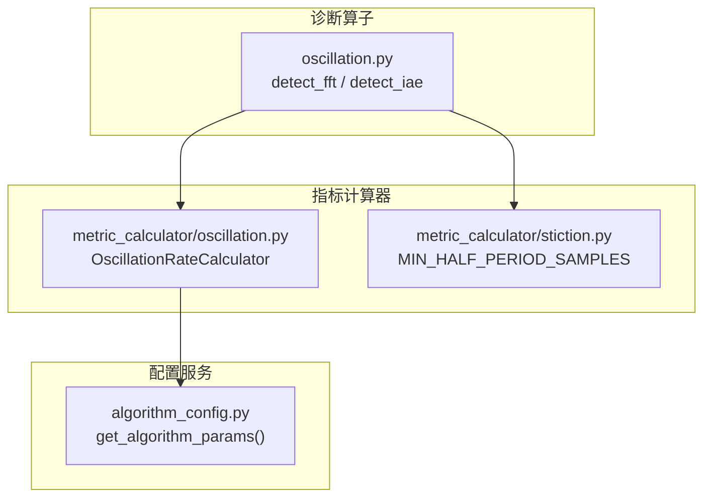
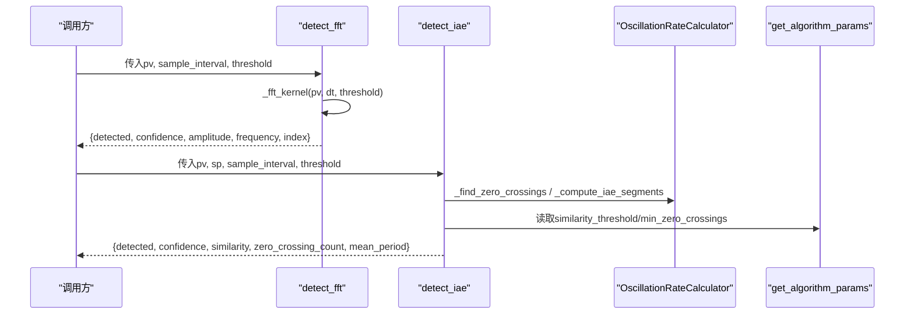
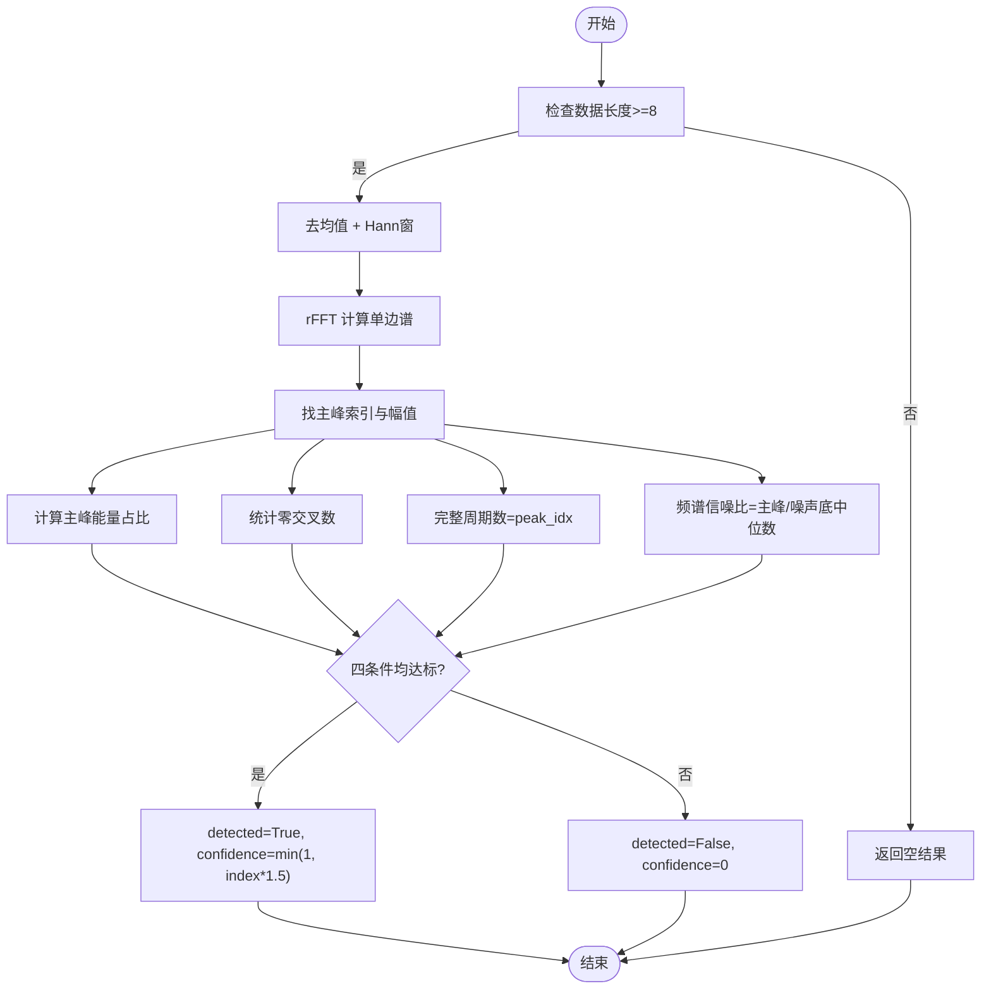
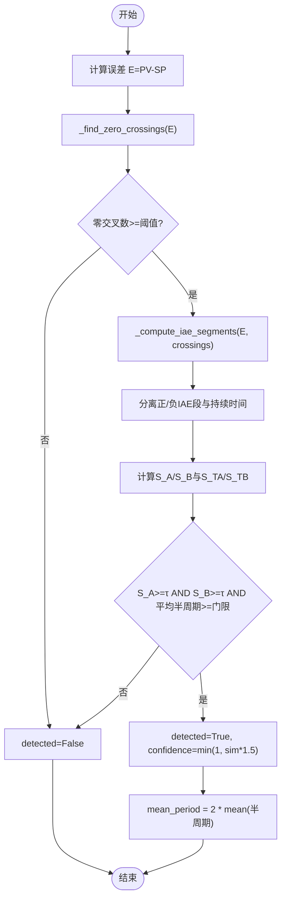
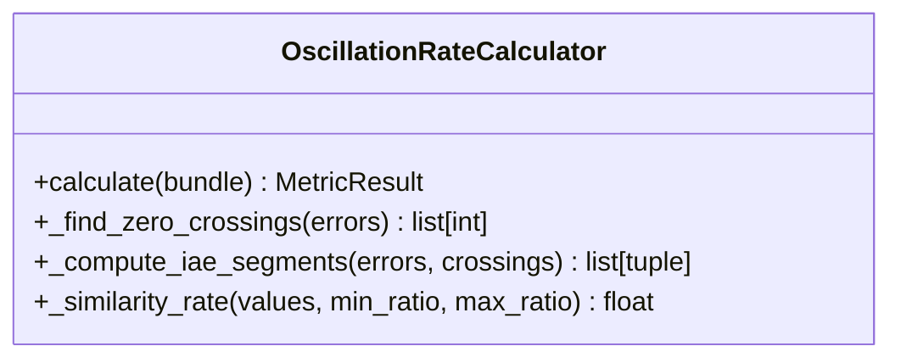
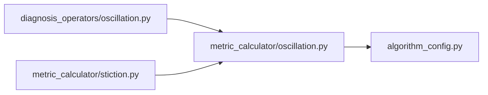

# 振荡检测算子

<cite>
**本文引用的文件**
- [backend/app/services/diagnosis_operators/oscillation.py](file://backend/app/services/diagnosis_operators/oscillation.py)
- [backend/app/services/metric_calculator/oscillation.py](file://backend/app/services/metric_calculator/oscillation.py)
- [backend/app/services/metric_calculator/stiction.py](file://backend/app/services/metric_calculator/stiction.py)
- [backend/app/services/algorithm_config.py](file://backend/app/services/algorithm_config.py)
- [backend/tests/test_metric_calculator/test_oscillation.py](file://backend/tests/test_metric_calculator/test_oscillation.py)
</cite>

## 目录
1. [简介](#简介)
2. [项目结构](#项目结构)
3. [核心组件](#核心组件)
4. [架构总览](#架构总览)
5. [详细组件分析](#详细组件分析)
6. [依赖关系分析](#依赖关系分析)
7. [性能考量](#性能考量)
8. [故障排查指南](#故障排查指南)
9. [结论](#结论)
10. [附录](#附录)

## 简介
本技术文档围绕“振荡检测算子”展开，系统阐述控制回路振荡的成因、频率识别、幅度量化、类型判别、严重程度评估与源定位方法，并结合工程实践给出参数优化策略。实现层面基于两套互补算法：
- FFT频域分析：通过Hann窗FFT提取主峰能量占比、完整周期数、频谱信噪比进行综合判定。
- IAE零交叉相似率法：基于控制偏差（PV-SP）的半周期IAE正负段相似率（S_A/S_B）判定振荡并估计平均周期。

该方案对齐国标GB/T 44693.2-2024附录F.1，并与粘滞系数计算中的极限环门控保持一致，确保诊断一致性。

## 项目结构
振荡检测相关代码主要分布在以下模块：
- 诊断算子层：封装对外暴露的算子接口，负责输入校验、阈值读取、结果组装与证据输出。
- 指标计算器层：提供可复用的核心算法实现（IAE零交叉相似率、零交叉检测、IAE分段等）。
- 配置服务层：提供按控制类型分组的算法参数默认值与运行时合并链。
- 粘滞系数模块：复用振荡检测的零交叉与半周期门控常量，保证诊断一致性。

**图表来源**
- [backend/app/services/diagnosis_operators/oscillation.py:223-323](file://backend/app/services/diagnosis_operators/oscillation.py#L223-L323)
- [backend/app/services/metric_calculator/oscillation.py:46-165](file://backend/app/services/metric_calculator/oscillation.py#L46-L165)
- [backend/app/services/metric_calculator/stiction.py:60-70](file://backend/app/services/metric_calculator/stiction.py#L60-L70)
- [backend/app/services/algorithm_config.py:37-63](file://backend/app/services/algorithm_config.py#L37-L63)

**章节来源**
- [backend/app/services/diagnosis_operators/oscillation.py:223-323](file://backend/app/services/diagnosis_operators/oscillation.py#L223-L323)
- [backend/app/services/metric_calculator/oscillation.py:46-165](file://backend/app/services/metric_calculator/oscillation.py#L46-L165)
- [backend/app/services/metric_calculator/stiction.py:60-70](file://backend/app/services/metric_calculator/stiction.py#L60-L70)
- [backend/app/services/algorithm_config.py:37-63](file://backend/app/services/algorithm_config.py#L37-L63)

## 核心组件
- FFT振荡检测算子：对PV序列做去均值、加窗、FFT，计算主峰幅值与频率、主峰能量占比、零交叉数、完整周期数、频谱信噪比，四条件同时满足则判定振荡。
- IAE零交叉振荡检测算子：计算误差序列的零交叉点，提取相邻零交叉间的IAE段，分别对正负半周期计算相似率S_A/S_B，结合半周期时长门控判定振荡并估计平均周期。
- 振荡率计算器：提供零交叉检测、IAE分段、相似率计算等基础能力，供诊断算子与粘滞系数模块复用。
- 算法参数配置：为不同控制类型提供相似度阈值、最小比例范围、最少零交叉数等默认参数，支持运行时覆盖。

**章节来源**
- [backend/app/services/diagnosis_operators/oscillation.py:49-121](file://backend/app/services/diagnosis_operators/oscillation.py#L49-L121)
- [backend/app/services/diagnosis_operators/oscillation.py:123-221](file://backend/app/services/diagnosis_operators/oscillation.py#L123-L221)
- [backend/app/services/metric_calculator/oscillation.py:46-165](file://backend/app/services/metric_calculator/oscillation.py#L46-L165)
- [backend/app/services/algorithm_config.py:37-63](file://backend/app/services/algorithm_config.py#L37-L63)

## 架构总览
下图展示从输入信号到检测结果的关键调用链路与数据流。

**图表来源**
- [backend/app/services/diagnosis_operators/oscillation.py:223-323](file://backend/app/services/diagnosis_operators/oscillation.py#L223-L323)
- [backend/app/services/metric_calculator/oscillation.py:46-165](file://backend/app/services/metric_calculator/oscillation.py#L46-L165)
- [backend/app/services/algorithm_config.py:37-63](file://backend/app/services/algorithm_config.py#L37-L63)

## 详细组件分析

### FFT频域振荡检测
- 输入：PV序列、采样间隔、阈值字典。
- 处理流程：
  - 去均值与Hann窗抑制频谱泄漏；计算单边谱幅值并归一化。
  - 主峰索引对应频率与幅值；计算主峰能量占比作为振荡指数。
  - 统计零交叉数、窗口内完整周期数（peak_idx）、频谱信噪比（主峰幅值/噪声底中位数）。
  - 四条件同时满足（振荡指数、零交叉数、完整周期数、信噪比）则判定振荡，置信度由振荡指数映射。
- 输出：是否检出、置信度、主峰幅值、主峰频率、振荡指数。

**图表来源**
- [backend/app/services/diagnosis_operators/oscillation.py:49-121](file://backend/app/services/diagnosis_operators/oscillation.py#L49-L121)

**章节来源**
- [backend/app/services/diagnosis_operators/oscillation.py:49-121](file://backend/app/services/diagnosis_operators/oscillation.py#L49-L121)

### IAE零交叉振荡检测
- 输入：PV、SP序列、采样间隔、阈值字典。
- 处理流程：
  - 计算误差序列E=PV-SP。
  - 使用向量化零交叉检测识别符号变化时刻，剔除零值平台伪穿越。
  - 提取相邻零交叉间的完整半周期段，计算IAE与持续时间，分离正负段。
  - 对正负段分别计算IAE相似率S_A/S_B（最小距离法），并计算持续时间相似率S_TA/S_TB用于辅助诊断。
  - 判定：双侧相似率均达阈值且平均半周期达到门控要求则检出振荡；置信度由相似率映射。
  - 输出：是否检出、置信度、相似率、零交叉数、平均周期。

**图表来源**
- [backend/app/services/diagnosis_operators/oscillation.py:123-221](file://backend/app/services/diagnosis_operators/oscillation.py#L123-L221)
- [backend/app/services/metric_calculator/oscillation.py:167-260](file://backend/app/services/metric_calculator/oscillation.py#L167-L260)

**章节来源**
- [backend/app/services/diagnosis_operators/oscillation.py:123-221](file://backend/app/services/diagnosis_operators/oscillation.py#L123-L221)
- [backend/app/services/metric_calculator/oscillation.py:167-260](file://backend/app/services/metric_calculator/oscillation.py#L167-L260)

### 振荡率计算器（核心算法）
- 功能：提供零交叉检测、IAE分段、相似率计算等基础能力，输出振荡率与辅助诊断字段。
- 关键点：
  - 零交叉检测采用前向填充零值归并前一符号，避免“+,0,0,+”产生伪穿越。
  - IAE分段仅保留两个零交叉之间的完整半周期，剔除首尾残缺段。
  - 相似率采用最小距离法，清洗不相似数据后对称化惩罚，避免单边不对称导致的恒为1.0问题。
  - 振荡率= min(S_A, S_B)×100；is_oscillating仅依赖S_A/S_B阈值。

**图表来源**
- [backend/app/services/metric_calculator/oscillation.py:46-165](file://backend/app/services/metric_calculator/oscillation.py#L46-L165)
- [backend/app/services/metric_calculator/oscillation.py:167-260](file://backend/app/services/metric_calculator/oscillation.py#L167-L260)

**章节来源**
- [backend/app/services/metric_calculator/oscillation.py:46-165](file://backend/app/services/metric_calculator/oscillation.py#L46-L165)
- [backend/app/services/metric_calculator/oscillation.py:167-260](file://backend/app/services/metric_calculator/oscillation.py#L167-L260)

### 粘滞系数模块与极限环门控
- 粘滞系数计算仅在检测到极限环振荡时具备物理意义；否则直接返回“无粘滞”。
- 极限环门控复用振荡检测的零交叉下限与半周期门控常量，确保诊断一致性。
- 关键常量：
  - MIN_ZERO_CROSSINGS=4
  - MIN_HALF_PERIOD_SAMPLES=8

**章节来源**
- [backend/app/services/metric_calculator/stiction.py:60-70](file://backend/app/services/metric_calculator/stiction.py#L60-L70)
- [backend/app/services/metric_calculator/stiction.py:109-130](file://backend/app/services/metric_calculator/stiction.py#L109-L130)

## 依赖关系分析
- 诊断算子依赖指标计算器提供的零交叉与相似率能力。
- 指标计算器依赖配置服务获取按控制类型划分的默认参数。
- 粘滞系数模块复用振荡检测的门控常量，形成跨模块的一致性约束。

**图表来源**
- [backend/app/services/diagnosis_operators/oscillation.py:223-323](file://backend/app/services/diagnosis_operators/oscillation.py#L223-L323)
- [backend/app/services/metric_calculator/oscillation.py:46-165](file://backend/app/services/metric_calculator/oscillation.py#L46-L165)
- [backend/app/services/metric_calculator/stiction.py:60-70](file://backend/app/services/metric_calculator/stiction.py#L60-L70)
- [backend/app/services/algorithm_config.py:37-63](file://backend/app/services/algorithm_config.py#L37-L63)

**章节来源**
- [backend/app/services/diagnosis_operators/oscillation.py:223-323](file://backend/app/services/diagnosis_operators/oscillation.py#L223-L323)
- [backend/app/services/metric_calculator/oscillation.py:46-165](file://backend/app/services/metric_calculator/oscillation.py#L46-L165)
- [backend/app/services/metric_calculator/stiction.py:60-70](file://backend/app/services/metric_calculator/stiction.py#L60-L70)
- [backend/app/services/algorithm_config.py:37-63](file://backend/app/services/algorithm_config.py#L37-L63)

## 性能考量
- FFT路径：
  - 使用Hann窗抑制频谱泄漏，幅值归一化补偿窗相干增益。
  - 主峰能量占比与频谱信噪比计算复杂度低，适合在线实时。
  - 数据长度不足或异常时快速回退为空结果，避免无效计算。
- IAE路径：
  - 零交叉检测与IAE分段均为向量化实现，避免双重循环。
  - 相似率计算通过向量化的最小距离法降低复杂度。
  - 半周期门控有效过滤高频噪声伪穿越，提升鲁棒性。
- 配置化参数：
  - 通过三层配置合并链（默认值→系统级→指标级）灵活调整敏感度与阈值，适配不同控制类型与工况。

[本节为通用性能讨论，不直接分析具体文件]

## 故障排查指南
- 数据不足：
  - FFT路径要求至少8个样本；算子入口进一步要求≥16个点才执行。
  - IAE路径要求pv/sp成对且mask有效，数据不足返回INCONCLUSIVE或0。
- 零交叉不足：
  - 若零交叉数低于阈值，直接判定无振荡；检查信号质量与采样间隔。
- 相似率偏低：
  - 检查正负半周期IAE分布是否均衡；确认清洗比例min_ratio/max_ratio合理。
- 频谱信噪比过低：
  - 可能受强扰动或传感器噪声影响；考虑增加滤波或延长窗口。
- 粘滞系数误报：
  - 非极限环段不应计算粘滞；确认极限环门控已生效。

**章节来源**
- [backend/app/services/diagnosis_operators/oscillation.py:246-271](file://backend/app/services/diagnosis_operators/oscillation.py#L246-L271)
- [backend/app/services/diagnosis_operators/oscillation.py:298-323](file://backend/app/services/diagnosis_operators/oscillation.py#L298-L323)
- [backend/app/services/metric_calculator/oscillation.py:72-103](file://backend/app/services/metric_calculator/oscillation.py#L72-L103)
- [backend/app/services/metric_calculator/stiction.py:109-130](file://backend/app/services/metric_calculator/stiction.py#L109-L130)

## 结论
本振荡检测算子以FFT频域分析与IAE零交叉相似率法为核心，兼顾实时性与鲁棒性。通过多条件综合判定、半周期门控与配置化参数，能够有效识别极限循环振荡、低频振荡与高频噪声放大等不同类型，并提供周期稳定性、振幅增长趋势与衰减特性的评估依据。与粘滞系数模块的一致性门控设计，确保了诊断结果的工程可用性。

[本节为总结性内容，不直接分析具体文件]

## 附录

### 控制回路振荡成因分析（工程视角）
- 积分饱和：积分项累积导致超调与反复调节，易形成极限循环。
- 参数不匹配：PID参数过激或过缓，造成相位裕度不足或响应迟缓，诱发振荡。
- 外部扰动耦合：负载波动、阀门非线性（如粘滞）与测量噪声耦合，放大振荡。

[本节为概念性说明，不直接分析具体文件]

### 振荡频率识别算法
- FFT频谱分析：主峰频率即主导振荡频率，配合能量占比与信噪比提高可靠性。
- 自相关函数：可用于周期估计（未在实现中直接使用，可作为扩展方向）。
- 过零检测：零交叉间隔反映半周期，结合IAE分段提升抗噪能力。

**章节来源**
- [backend/app/services/diagnosis_operators/oscillation.py:49-121](file://backend/app/services/diagnosis_operators/oscillation.py#L49-L121)
- [backend/app/services/metric_calculator/oscillation.py:167-260](file://backend/app/services/metric_calculator/oscillation.py#L167-L260)

### 振荡幅度量化方法
- 峰峰值统计：可通过包络线极值差估算（可在后续扩展）。
- RMS值计算：适用于宽频噪声背景下的能量度量（可在后续扩展）。
- 包络线分析：结合Hilbert变换提取瞬时幅值（可在后续扩展）。

当前实现中：
- FFT路径提供主峰幅值作为幅度表征。
- IAE路径通过半周期IAE相似率间接反映幅度一致性。

**章节来源**
- [backend/app/services/diagnosis_operators/oscillation.py:49-121](file://backend/app/services/diagnosis_operators/oscillation.py#L49-L121)
- [backend/app/services/metric_calculator/oscillation.py:105-137](file://backend/app/services/metric_calculator/oscillation.py#L105-L137)

### 不同类型振荡的识别
- 极限循环振荡：半周期IAE相似率高、周期稳定，适合用IAE路径与粘滞系数门控联合判断。
- 低频振荡：FFT主峰位于低频段，能量占比高，零交叉密度较低。
- 高频噪声放大：零交叉频繁但半周期短，相似率低，需半周期门控过滤。

**章节来源**
- [backend/app/services/metric_calculator/stiction.py:60-70](file://backend/app/services/metric_calculator/stiction.py#L60-L70)
- [backend/app/services/diagnosis_operators/oscillation.py:49-121](file://backend/app/services/diagnosis_operators/oscillation.py#L49-L121)
- [backend/app/services/metric_calculator/oscillation.py:105-137](file://backend/app/services/metric_calculator/oscillation.py#L105-L137)

### 振荡严重程度评估
- 周期稳定性：通过S_TA/S_TB持续时间相似率衡量（辅助诊断）。
- 振幅增长趋势：可跟踪主峰幅值随时间变化（可在后续扩展）。
- 衰减特性：观察IAE段幅值递减趋势（可在后续扩展）。

**章节来源**
- [backend/app/services/metric_calculator/oscillation.py:123-137](file://backend/app/services/metric_calculator/oscillation.py#L123-L137)

### 振荡源定位技术
- 相位差分析：通过OP-PV互相关估计纯滞后θ，辅助识别主导因素（在粘滞系数模块中实现）。
- 控制回路间耦合识别：可结合多回路互相关与偏相关分析（可在后续扩展）。

**章节来源**
- [backend/app/services/metric_calculator/stiction.py:135-168](file://backend/app/services/metric_calculator/stiction.py#L135-L168)

### 振荡检测参数优化策略
- 相似度阈值：根据控制类型与工况调整，典型默认值为0.4。
- 最小比例范围：min_ratio/max_ratio用于清洗离群IAE段，避免噪声干扰。
- 最少零交叉数：根据采样频率与期望周期设定，典型默认值为4。
- FFT阈值：振荡指数阈值、最小完整周期数、最小信噪比可按场景微调。

**章节来源**
- [backend/app/services/algorithm_config.py:37-63](file://backend/app/services/algorithm_config.py#L37-L63)
- [backend/app/services/diagnosis_operators/oscillation.py:233-238](file://backend/app/services/diagnosis_operators/oscillation.py#L233-L238)
- [backend/app/services/diagnosis_operators/oscillation.py:288-292](file://backend/app/services/diagnosis_operators/oscillation.py#L288-L292)

### 实际工程应用案例
- 正弦振荡检测：周期20s的正弦信号被正确识别，振荡率>0且is_oscillating=True。
- 恒定偏差：无振荡，振荡率为0。
- 随机噪声：输出格式完整，包含S_TA/S_TB辅助诊断字段，便于区分噪声与真实振荡。
- 数据不足：返回INCONCLUSIVE，避免误判。

**章节来源**
- [backend/tests/test_metric_calculator/test_oscillation.py:36-123](file://backend/tests/test_metric_calculator/test_oscillation.py#L36-L123)
- [backend/tests/test_metric_calculator/test_oscillation.py:125-214](file://backend/tests/test_metric_calculator/test_oscillation.py#L125-L214)
- [backend/tests/test_metric_calculator/test_oscillation.py:216-275](file://backend/tests/test_metric_calculator/test_oscillation.py#L216-L275)