# 整定质量评估算子

<cite>
**本文引用的文件**
- [backend/app/services/tuning.py](file://backend/app/services/tuning.py)
- [backend/app/services/tuning_algorithms.py](file://backend/app/services/tuning_algorithms.py)
- [backend/app/schemas/tuning.py](file://backend/app/schemas/tuning.py)
- [backend/app/models/tuning.py](file://backend/app/models/tuning.py)
- [backend/app/services/confidence_evaluator.py](file://backend/app/services/confidence_evaluator.py)
- [backend/app/services/diagnosis_operators/tuning.py](file://backend/app/services/diagnosis_operators/tuning.py)
- [backend/app/tasks/tuning.py](file://backend/app/tasks/tuning.py)
- [backend/app/api/v1/endpoints/tuning.py](file://backend/app/api/v1/endpoints/tuning.py)
- [backend/app/services/tuning_progress.py](file://backend/app/services/tuning_progress.py)
</cite>

## 目录
1. [简介](#简介)
2. [项目结构](#项目结构)
3. [核心组件](#核心组件)
4. [架构总览](#架构总览)
5. [详细组件分析](#详细组件分析)
6. [依赖关系分析](#依赖关系分析)
7. [性能考虑](#性能考虑)
8. [故障排查指南](#故障排查指南)
9. [结论](#结论)
10. [附录](#附录)

## 简介
本技术文档围绕“整定质量评估算子”展开，聚焦 PID 参数整定效果评估的量化指标、分级标准、过程监控、失败原因分析与建议生成，以及与诊断结果的关联闭环。系统通过历史数据辨识与阶跃实验两条路径获取过程模型，再基于多种整定算法（IMC、Lambda、Z-N、Cohen-Coon、SIMC）计算推荐 PID，并通过闭环仿真提取响应速度、稳态精度、抗扰能力等关键指标，结合可信度与诊断结果给出整定质量等级与优化建议。

## 项目结构
整定质量评估涉及的服务层、算法层、数据模型与 API 契约如下：
- 服务编排与门禁：tuning.py（模型授权、历史辨识入口、片段预览、风险评估）
- 算法内核：tuning_algorithms.py（FOPDT/SOPDT/IPDT 辨识、PID 整定、闭环仿真）
- 数据模型与接口契约：models/tuning.py、schemas/tuning.py
- 可信度与综合评分：confidence_evaluator.py
- 诊断算子：diagnosis_operators/tuning.py（过激/迟缓检测）
- 异步任务与进度：tasks/tuning.py、services/tuning_progress.py
- API 端点：endpoints/tuning.py（矩阵整定、多 PID 对比、效果验证）

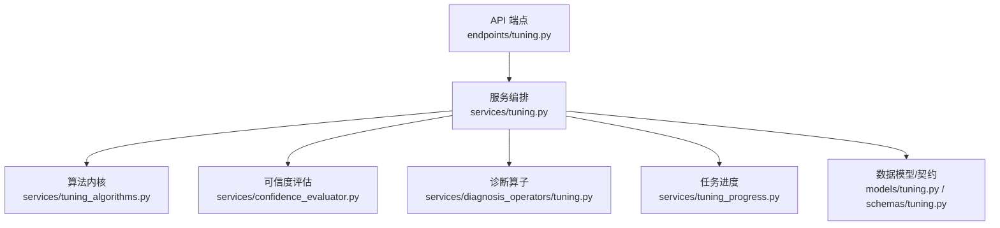

**图表来源**
- [backend/app/api/v1/endpoints/tuning.py:426-448](file://backend/app/api/v1/endpoints/tuning.py#L426-L448)
- [backend/app/services/tuning.py:104-297](file://backend/app/services/tuning.py#L104-L297)
- [backend/app/services/tuning_algorithms.py:660-749](file://backend/app/services/tuning_algorithms.py#L660-L749)
- [backend/app/services/confidence_evaluator.py:165-221](file://backend/app/services/confidence_evaluator.py#L165-L221)
- [backend/app/services/diagnosis_operators/tuning.py:325-448](file://backend/app/services/diagnosis_operators/tuning.py#L325-L448)
- [backend/app/services/tuning_progress.py:70-188](file://backend/app/services/tuning_progress.py#L70-L188)
- [backend/app/models/tuning.py:31-114](file://backend/app/models/tuning.py#L31-L114)
- [backend/app/schemas/tuning.py:224-345](file://backend/app/schemas/tuning.py#L224-L345)

**章节来源**
- [backend/app/services/tuning.py:104-297](file://backend/app/services/tuning.py#L104-L297)
- [backend/app/services/tuning_algorithms.py:660-749](file://backend/app/services/tuning_algorithms.py#L660-L749)
- [backend/app/schemas/tuning.py:224-345](file://backend/app/schemas/tuning.py#L224-L345)
- [backend/app/models/tuning.py:31-114](file://backend/app/models/tuning.py#L31-L114)

## 核心组件
- 模型授权与可信度门禁：校验模型来源（IDENTIFICATION_RECORD/STEP_EXPERIMENT/MANUAL）、状态、置信度等级与纯滞后来源，防止不可信模型进入整定链。
- 历史数据辨识：通过 DataPlanner 获取 PV/OP/SP/MODE 预处理信号，调用识别栈得到候选模型与拟合度，并融合数据质量可信度。
- PID 整定算法：支持 IMC/Lambda/Z-N/Cohen-Coon/SIMC，输出推荐 PID 与算法版本。
- 闭环仿真与指标提取：对当前 PID 与推荐 PID 进行阶跃响应仿真，提取上升时间、超调量、稳定时间、ITAE 等指标，并计算改善幅度。
- 整定风险评估：比较推荐与当前 PID 变化幅度、模型可信度，输出风险等级与回退 PID。
- 诊断算子：过激（OVERAGGRESSIVE）与迟缓（OVERCONSERVATIVE）检测，辅助判断整定质量与问题根因。
- 任务进度与异步跟踪：Redis 存储细粒度阶段进度，桥接统一任务追踪器。

**章节来源**
- [backend/app/services/tuning.py:104-297](file://backend/app/services/tuning.py#L104-L297)
- [backend/app/services/tuning.py:645-737](file://backend/app/services/tuning.py#L645-L737)
- [backend/app/services/tuning_algorithms.py:497-652](file://backend/app/services/tuning_algorithms.py#L497-L652)
- [backend/app/services/tuning_algorithms.py:660-749](file://backend/app/services/tuning_algorithms.py#L660-L749)
- [backend/app/services/tuning.py:1250-1287](file://backend/app/services/tuning.py#L1250-L1287)
- [backend/app/services/diagnosis_operators/tuning.py:325-448](file://backend/app/services/diagnosis_operators/tuning.py#L325-L448)
- [backend/app/services/tuning_progress.py:70-188](file://backend/app/services/tuning_progress.py#L70-L188)

## 架构总览
整定质量评估从 API 请求开始，经服务编排完成模型授权、历史辨识或阶跃实验、PID 整定、闭环仿真与指标提取，并结合诊断算子与可信度评估形成最终质量等级与建议。

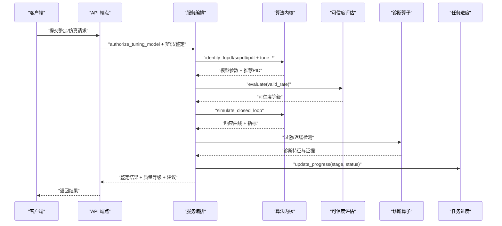

**图表来源**
- [backend/app/api/v1/endpoints/tuning.py:426-448](file://backend/app/api/v1/endpoints/tuning.py#L426-L448)
- [backend/app/services/tuning.py:104-297](file://backend/app/services/tuning.py#L104-L297)
- [backend/app/services/tuning_algorithms.py:660-749](file://backend/app/services/tuning_algorithms.py#L660-L749)
- [backend/app/services/confidence_evaluator.py:165-221](file://backend/app/services/confidence_evaluator.py#L165-L221)
- [backend/app/services/diagnosis_operators/tuning.py:325-448](file://backend/app/services/diagnosis_operators/tuning.py#L325-L448)
- [backend/app/services/tuning_progress.py:143-188](file://backend/app/services/tuning_progress.py#L143-L188)

## 详细组件分析

### 模型授权与可信度门禁
- 模型来源校验：仅允许 IDENTIFICATION_RECORD、STEP_EXPERIMENT、MANUAL；人工模型需显式确认风险。
- 记录状态与凭据：要求服务端可验证的 sourceRecordId，且记录状态为已完成辨识/仿真。
- 模型参数一致性：请求模型类型与参数必须与服务端持久化一致，防止替换辨识结果。
- 可信度门槛：A/B 级放行；C 级需风险确认；D/E/INCONCLUSIVE 拒绝进入推荐链。
- 纯滞后来源限制：HEURISTIC_2TS 不得进入推荐链。

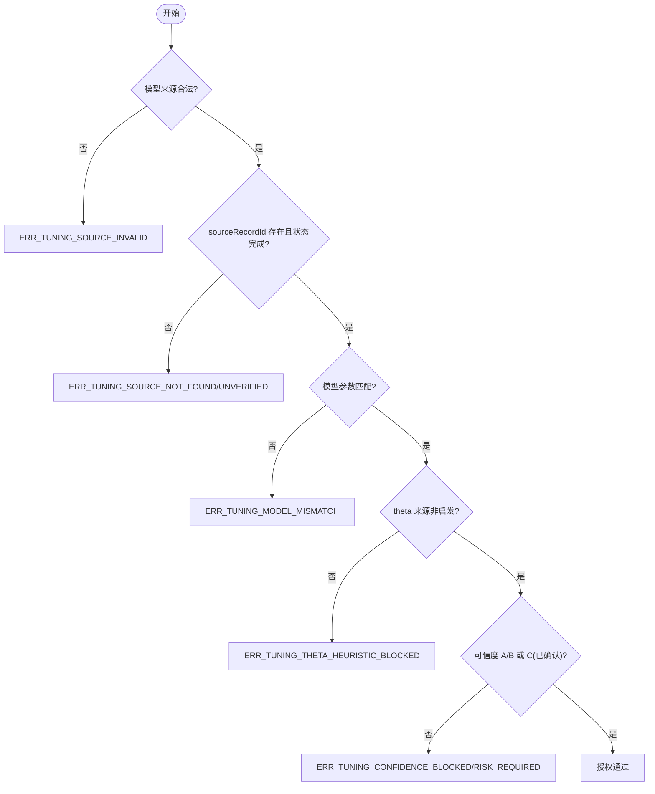

**图表来源**
- [backend/app/services/tuning.py:104-297](file://backend/app/services/tuning.py#L104-L297)

**章节来源**
- [backend/app/services/tuning.py:104-297](file://backend/app/services/tuning.py#L104-L297)

### 历史数据辨识与片段预览
- 数据同轴与重采样：PV/OP 高频（1s），SP/MODE 按 PVOP 网格对齐，MODE 零阶保持避免无意义中间值。
- 有效数据率：回路级 valid_rate 用于可信度评估，替代块级全 tag 交集口径。
- 辨识流程：DataPlanner → 8 步预处理 → identify_from_history → 候选模型选择 → 拟合度与可信度融合。
- 片段预览：真实切分片段（按 MODE/缺口/饱和/太短），对可辨识片段做激励检测，排除片段标注原因。

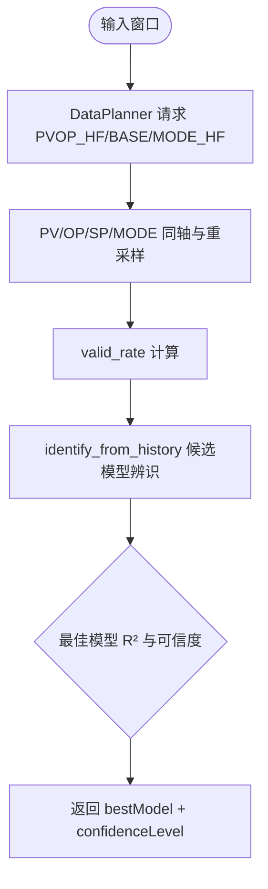

**图表来源**
- [backend/app/services/tuning.py:325-437](file://backend/app/services/tuning.py#L325-L437)
- [backend/app/services/tuning.py:645-737](file://backend/app/services/tuning.py#L645-L737)

**章节来源**
- [backend/app/services/tuning.py:325-437](file://backend/app/services/tuning.py#L325-L437)
- [backend/app/services/tuning.py:645-737](file://backend/app/services/tuning.py#L645-L737)

### PID 整定算法与闭环仿真
- 整定算法：IMC、Lambda、Z-N、Cohen-Coon、SIMC，均基于 FOPDT 模型参数计算推荐 PID。
- 闭环仿真：RK4 积分 + 增量式 PID，支持多组候选 PID 对比，输出响应曲线与指标。
- 指标提取：上升时间、超调量、稳定时间、ITAE，以及改善幅度。

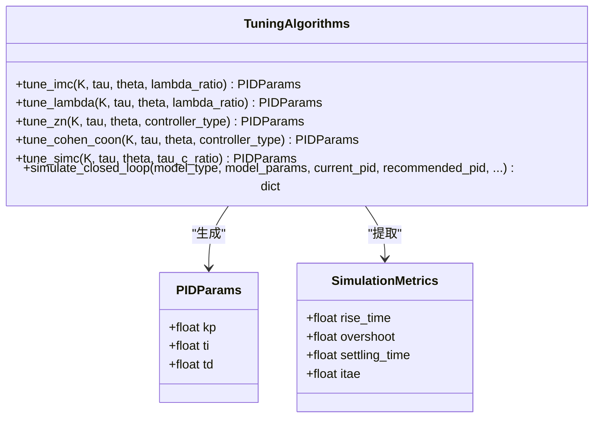

**图表来源**
- [backend/app/services/tuning_algorithms.py:62-78](file://backend/app/services/tuning_algorithms.py#L62-L78)
- [backend/app/services/tuning_algorithms.py:497-652](file://backend/app/services/tuning_algorithms.py#L497-L652)
- [backend/app/services/tuning_algorithms.py:660-749](file://backend/app/services/tuning_algorithms.py#L660-L749)

**章节来源**
- [backend/app/services/tuning_algorithms.py:497-652](file://backend/app/services/tuning_algorithms.py#L497-L652)
- [backend/app/services/tuning_algorithms.py:660-749](file://backend/app/services/tuning_algorithms.py#L660-L749)

### 整定质量分级标准与阈值
- 响应速度：以稳定时间与理想稳定时间比值衡量，快速率公式为指数衰减形式，达到阈值即视为优秀。
- 稳态精度：以稳态误差占 SP 量程比例衡量，过小误差表示精度高。
- 抗扰能力：通过 ITAE 与扰动场景下的恢复特性评估，较小 ITAE 表示抗扰能力强。
- 可信度等级：基于有效数据率 valid_rate 判定 A/B/C/D/E，E 级视为 INCONCLUSIVE。
- 综合评分：P = (A·a + F·f + S·s)/(a+f+s) × R，R 为有效自控率折扣因子。

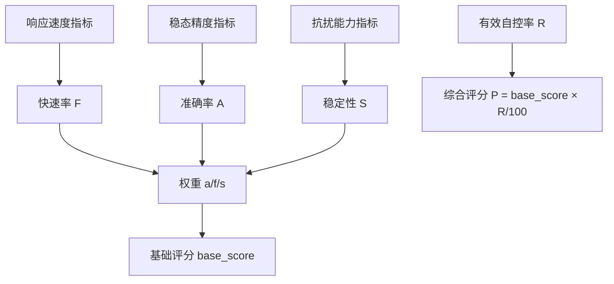

**图表来源**
- [backend/app/services/confidence_evaluator.py:253-475](file://backend/app/services/confidence_evaluator.py#L253-L475)
- [backend/app/services/metric_calculator/fast_rate.py:159-194](file://backend/app/services/metric_calculator/fast_rate.py#L159-L194)

**章节来源**
- [backend/app/services/confidence_evaluator.py:165-221](file://backend/app/services/confidence_evaluator.py#L165-L221)
- [backend/app/services/confidence_evaluator.py:253-475](file://backend/app/services/confidence_evaluator.py#L253-L475)
- [backend/app/services/metric_calculator/fast_rate.py:159-194](file://backend/app/services/metric_calculator/fast_rate.py#L159-L194)

### 整定过程监控：参数变化跟踪、收敛性判断、稳定性保证
- 参数变化跟踪：记录当前 PID 与推荐 PID，计算变化幅度，作为风险评估因素。
- 收敛性判断：仿真中检查 PV 是否收敛到设定值，未收敛时标记 never_settles 并降低快速率。
- 稳定性保证：通过过激/迟缓诊断算子检测振荡与慢响应，结合阈值门限保证稳定性。

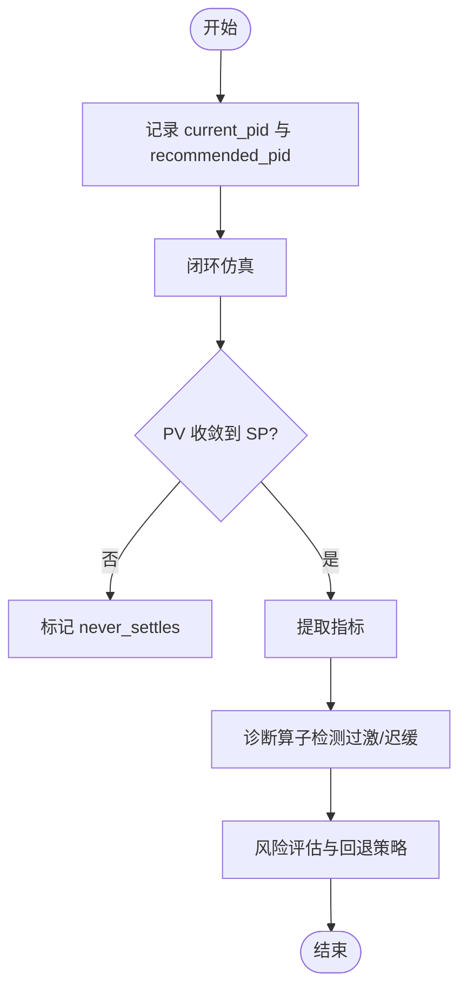

**图表来源**
- [backend/app/services/tuning.py:1250-1287](file://backend/app/services/tuning.py#L1250-L1287)
- [backend/app/services/diagnosis_operators/tuning.py:325-448](file://backend/app/services/diagnosis_operators/tuning.py#L325-L448)

**章节来源**
- [backend/app/services/tuning.py:1250-1287](file://backend/app/services/tuning.py#L1250-L1287)
- [backend/app/services/diagnosis_operators/tuning.py:325-448](file://backend/app/services/diagnosis_operators/tuning.py#L325-L448)

### 整定失败原因分析：模型失配、数据质量问题、约束冲突
- 模型失配：请求模型参数与服务端辨识记录不一致，或 theta 来源为启发估计被阻断。
- 数据质量问题：有效数据率过低导致可信度 E 级，或片段激励不足无法辨识。
- 约束冲突：模型来源非法、记录状态未完成、数据来源标记不一致等。

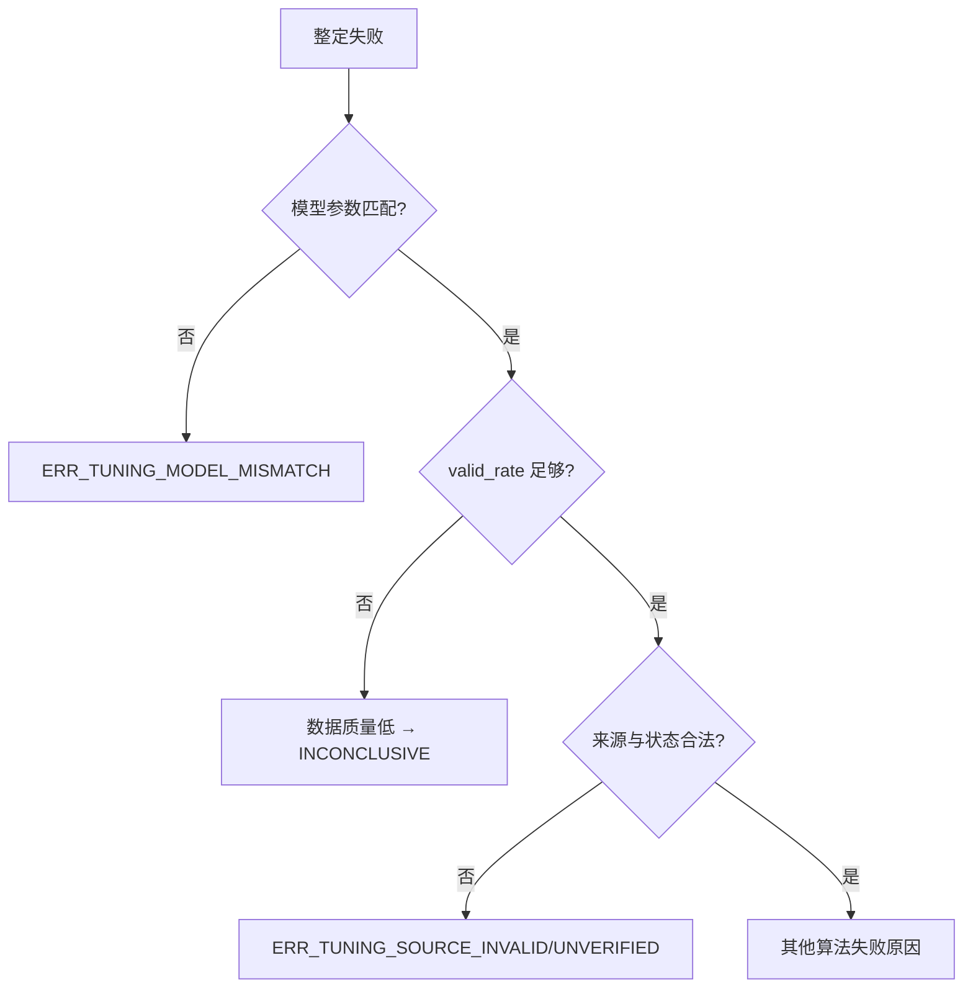

**图表来源**
- [backend/app/services/tuning.py:104-297](file://backend/app/services/tuning.py#L104-L297)
- [backend/app/services/tuning.py:645-737](file://backend/app/services/tuning.py#L645-L737)

**章节来源**
- [backend/app/services/tuning.py:104-297](file://backend/app/services/tuning.py#L104-L297)
- [backend/app/services/tuning.py:645-737](file://backend/app/services/tuning.py#L645-L737)

### 整定建议生成：参数调整方向、整定策略选择、安全边界设定
- 参数调整方向：根据诊断结果（过激/迟缓）调整 Kp/Ti/Td，过激降低增益或增加积分时间，迟缓增加增益或减少积分时间。
- 整定策略选择：矩阵整定一次计算多种算法，前端展示各行结果，工程师选择最优行。
- 安全边界设定：风险评估输出风险等级与回退 PID，确保实施失败时可恢复。

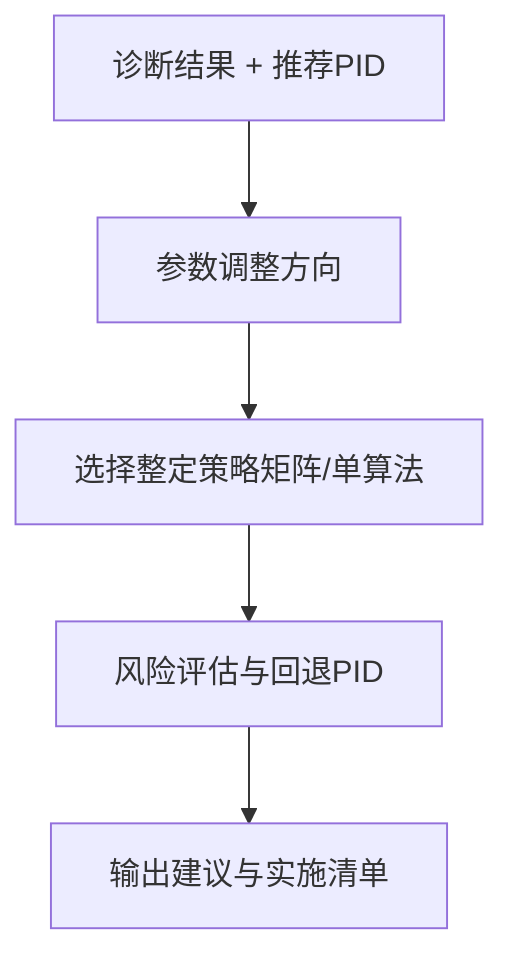

**图表来源**
- [backend/app/schemas/tuning.py:270-345](file://backend/app/schemas/tuning.py#L270-L345)
- [backend/app/services/tuning.py:1250-1287](file://backend/app/services/tuning.py#L1250-L1287)

**章节来源**
- [backend/app/schemas/tuning.py:270-345](file://backend/app/schemas/tuning.py#L270-L345)
- [backend/app/services/tuning.py:1250-1287](file://backend/app/services/tuning.py#L1250-L1287)

### 与诊断结果的关联：整定前诊断分析、整定后效果验证、持续优化建议
- 整定前诊断：过激/迟缓检测识别控制问题，指导整定策略选择。
- 整定后验证：仿真指标与诊断结果对比，验证整定效果。
- 持续优化：根据综合评分与可信度，动态调整阈值与策略。

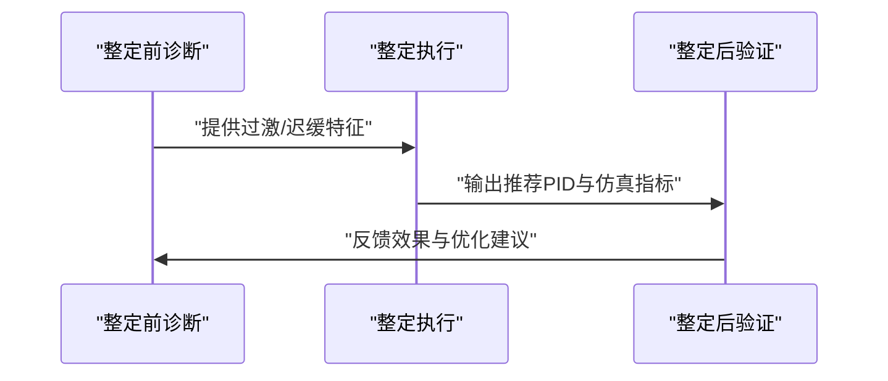

**图表来源**
- [backend/app/services/diagnosis_operators/tuning.py:325-448](file://backend/app/services/diagnosis_operators/tuning.py#L325-L448)
- [backend/app/services/tuning_algorithms.py:660-749](file://backend/app/services/tuning_algorithms.py#L660-L749)

**章节来源**
- [backend/app/services/diagnosis_operators/tuning.py:325-448](file://backend/app/services/diagnosis_operators/tuning.py#L325-L448)
- [backend/app/services/tuning_algorithms.py:660-749](file://backend/app/services/tuning_algorithms.py#L660-L749)

## 依赖关系分析
- 服务编排依赖算法内核、可信度评估、诊断算子、任务进度模块。
- API 端点依赖服务编排，传递模型来源与风险确认。
- 数据模型与契约约束整定记录字段与状态机。

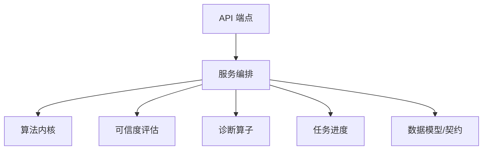

**图表来源**
- [backend/app/api/v1/endpoints/tuning.py:426-448](file://backend/app/api/v1/endpoints/tuning.py#L426-L448)
- [backend/app/services/tuning.py:104-297](file://backend/app/services/tuning.py#L104-L297)
- [backend/app/models/tuning.py:31-114](file://backend/app/models/tuning.py#L31-L114)

**章节来源**
- [backend/app/api/v1/endpoints/tuning.py:426-448](file://backend/app/api/v1/endpoints/tuning.py#L426-L448)
- [backend/app/services/tuning.py:104-297](file://backend/app/services/tuning.py#L104-L297)
- [backend/app/models/tuning.py:31-114](file://backend/app/models/tuning.py#L31-L114)

## 性能考虑
- 数据同轴与重采样：避免 naive timestamp 转换，使用相对秒与数组索引提升性能。
- 仿真步长细分：当 sim_step 过大时自动细分，保证数值稳定性。
- 任务进度缓存：Redis Hash 存储细粒度进度，7 天过期，减轻数据库压力。

**章节来源**
- [backend/app/services/tuning.py:440-643](file://backend/app/services/tuning.py#L440-L643)
- [backend/app/services/tuning_progress.py:33-58](file://backend/app/services/tuning_progress.py#L33-L58)

## 故障排查指南
- 模型来源错误：检查 model_source 与 source_record_id 是否合法，记录状态是否完成。
- 数据不足：确保 PV/OP 点数 ≥50，valid_rate 足够高。
- 辨识失败：查看 reason 字段，确认激励充分性与拟合度。
- 仿真不收敛：检查 sim_step 与模型参数，必要时调整步长或重新辨识。

**章节来源**
- [backend/app/services/tuning.py:104-297](file://backend/app/services/tuning.py#L104-L297)
- [backend/app/services/tuning.py:645-737](file://backend/app/services/tuning.py#L645-L737)

## 结论
整定质量评估算子通过严谨的模型授权、历史辨识、PID 整定、闭环仿真与诊断算子，构建了完整的 PID 整定质量评估体系。量化指标覆盖响应速度、稳态精度与抗扰能力，可信度与综合评分提供分级标准，过程监控与风险评估保障稳定性与安全边界。与诊断结果的关联实现了整定前分析、整定后验证与持续优化的闭环。

## 附录
- 整定算法矩阵：支持 IMC、Lambda、Z-N、Cohen-Coon、SIMC 五种算法，前端矩阵展示便于选择。
- 任务状态机：DRAFT/RUNNING/IDENTIFIED/SIMULATED/COMPLETED/INCONCLUSIVE/ROLLED_BACK。
- 辨识方法：HISTORICAL_ARX、HISTORICAL_ARMAX、HISTORICAL_IV、STEP_TWO_POINT、STEP_AREA、STEP_NLS。

**章节来源**
- [backend/app/schemas/tuning.py:27-86](file://backend/app/schemas/tuning.py#L27-L86)
- [backend/app/models/tuning.py:88-114](file://backend/app/models/tuning.py#L88-L114)