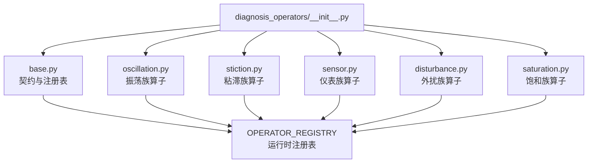
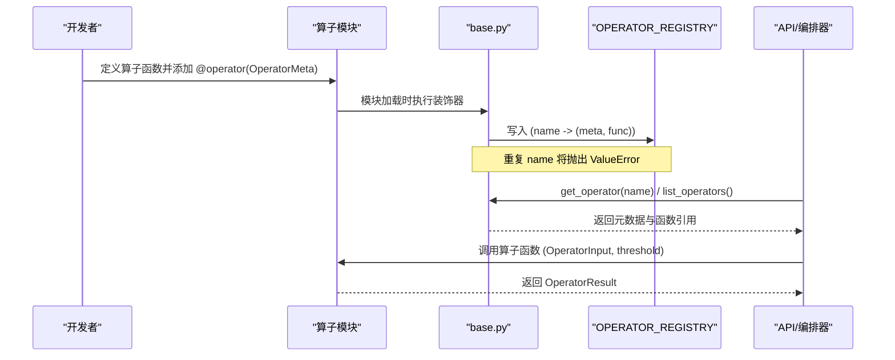
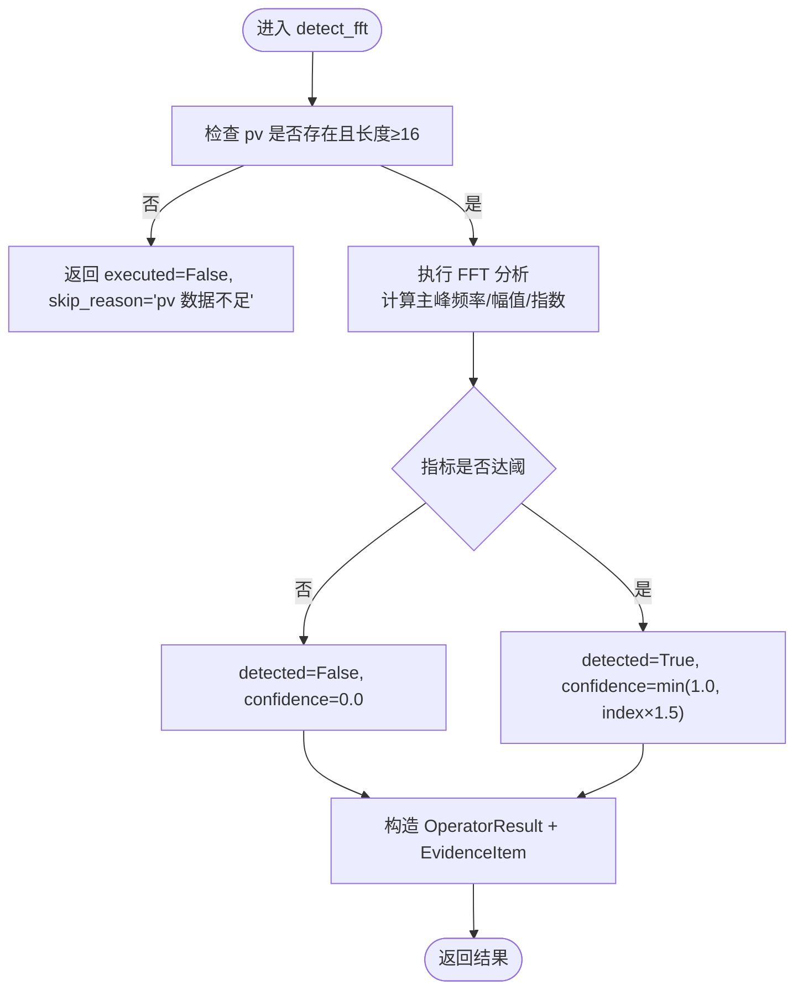
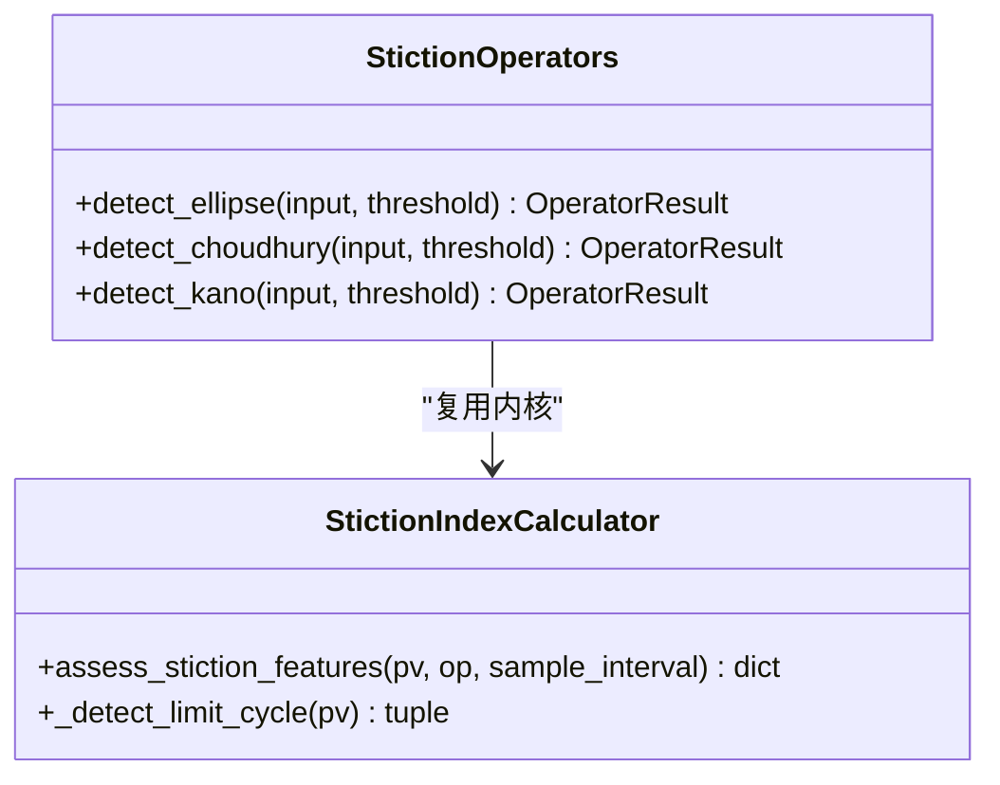
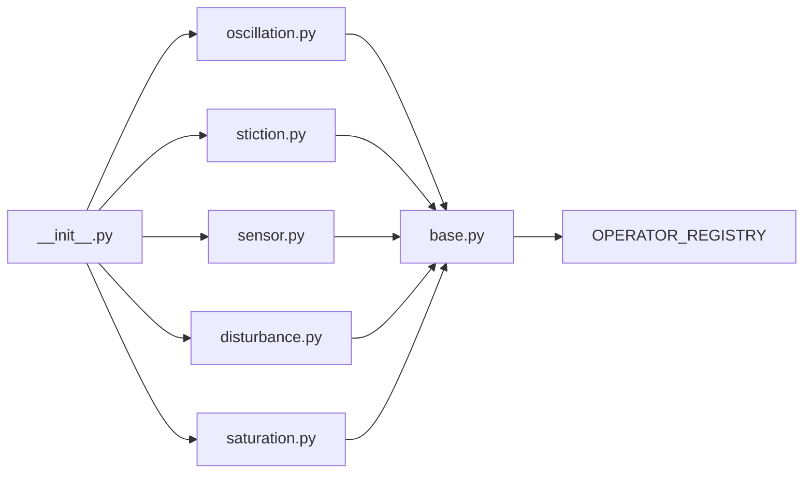
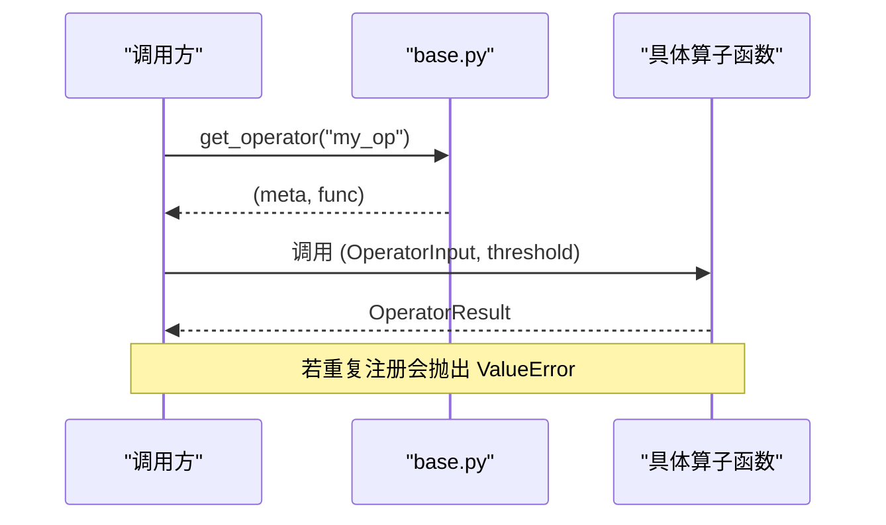

# 算子基类与注册机制

<cite>
**本文引用的文件**
- [backend/app/services/diagnosis_operators/base.py](file://backend/app/services/diagnosis_operators/base.py)
- [backend/app/services/diagnosis_operators/__init__.py](file://backend/app/services/diagnosis_operators/__init__.py)
- [backend/app/services/diagnosis_operators/oscillation.py](file://backend/app/services/diagnosis_operators/oscillation.py)
- [backend/app/services/diagnosis_operators/stiction.py](file://backend/app/services/diagnosis_operators/stiction.py)
- [backend/app/services/diagnosis_operators/sensor.py](file://backend/app/services/diagnosis_operators/sensor.py)
- [backend/app/services/diagnosis_operators/disturbance.py](file://backend/app/services/diagnosis_operators/disturbance.py)
- [backend/app/services/diagnosis_operators/saturation.py](file://backend/app/services/diagnosis_operators/saturation.py)
- [backend/tests/test_diagnosis_operators_base.py](file://backend/tests/test_diagnosis_operators_base.py)
- [backend/tests/test_diagnosis_operators.py](file://backend/tests/test_diagnosis_operators.py)
</cite>

## 目录
1. [简介](#简介)
2. [项目结构](#项目结构)
3. [核心组件](#核心组件)
4. [架构总览](#架构总览)
5. [详细组件分析](#详细组件分析)
6. [依赖关系分析](#依赖关系分析)
7. [性能考量](#性能考量)
8. [故障排查指南](#故障排查指南)
9. [结论](#结论)
10. [附录：自定义算子开发指南与完整示例](#附录自定义算子开发指南与完整示例)

## 简介
本技术文档围绕诊断算子基类与注册机制，系统性解释 OperatorMeta 元数据字段、EvidenceItem 证据项、OperatorInput 输入契约、OperatorResult 输出规范，以及 @operator 装饰器的动态注册、重复检测与运行时注册表管理。同时梳理算子族常量分类体系，并提供从继承基类到实现 execute 逻辑、定义阈值参数、编写单元测试的完整开发指南与端到端调用流程。

## 项目结构
诊断算子系统位于后端 services 下的 diagnosis_operators 包中，采用“契约 + 注册表 + 具体算子模块”的分层组织方式：
- base.py：定义算子契约（OperatorMeta/EvidenceItem/OperatorInput/OperatorResult）、全局注册表 OPERATOR_REGISTRY、@operator 装饰器及查询工具函数。
- __init__.py：统一导入各算子模块以触发注册，并导出契约类型与注册表访问接口。
- 各算子模块（如 oscillation.py、stiction.py、sensor.py 等）：通过 @operator(OperatorMeta(...)) 装饰具体函数完成注册，并在函数体内实现无状态计算逻辑。

图表来源
- [backend/app/services/diagnosis_operators/__init__.py:1-41](file://backend/app/services/diagnosis_operators/__init__.py#L1-L41)
- [backend/app/services/diagnosis_operators/base.py:1-137](file://backend/app/services/diagnosis_operators/base.py#L1-L137)

章节来源
- [backend/app/services/diagnosis_operators/__init__.py:1-41](file://backend/app/services/diagnosis_operators/__init__.py#L1-L41)
- [backend/app/services/diagnosis_operators/base.py:1-137](file://backend/app/services/diagnosis_operators/base.py#L1-L137)

## 核心组件
本节聚焦算子契约与注册机制的核心数据结构与行为。

- OperatorMeta（元数据）
  - name：算子唯一标识，用于注册表键与调用定位。
  - display_name：面向用户/AI 的可读名称。
  - family：算子族常量（如 oscillation、stiction、sensor、link、tuning、disturbance、saturation），同族算子支持族内融合。
  - diag_code：旧诊断码（阈值分组键），用于历史兼容与分组展示。
  - description：算子功能描述。
  - required_signals：输入信号契约（pv/sp/op/mode/pv_quality 等）。
  - min_sample_rate：最小采样率要求（Hz，0 表示不限）。
  - outputs_schema：输出特征名到工程含义的映射。
  - threshold_schema：可调参数及其默认值，由编排层注入。
  - symptom_tags：命中时产出的症状标签（原 8 类症状体系）。
  - enabled_by_default：是否默认启用。
  - fast_group：是否属于 fast 预设组（每族代表算子，共 7 个）。
  - confidence_basis：置信度计算口径说明，供界面/文档直接展示。

- EvidenceItem（证据项）
  - feature：特征名（需与 outputs_schema 键一致，便于前端按注册表中文名映射）。
  - value：实测值或结果值。
  - threshold：阈值（可选）。
  - judgment：判定结论（如“超阈/未超阈”、“达阈/未达阈”等）。

- OperatorInput（输入契约）
  - loop_id：回路标识。
  - signals：时间序列字典（pv/sp/op/mode/pv_quality 等）。
  - timestamps：秒序列（相对窗起点）。
  - meta：只读上下文（sample_interval/pv_range/control_type 等）。
  - kpi_context：KPI 快照只读上下文（可选）。

- OperatorResult（输出规范）
  - operator：算子名。
  - executed：是否执行（False 表示跳过或输入不足）。
  - skip_reason：跳过原因（executed=False 且非异常时提供）。
  - detected：是否检测到问题。
  - confidence：置信度（0~1）。
  - features：特征字典（键应与 outputs_schema 对应）。
  - evidence：证据列表（EvidenceItem）。
  - error：执行异常信息（executed=False 且非跳过时填充）。

- 注册表与装饰器
  - OPERATOR_REGISTRY：全局字典，键为算子名，值为 (OperatorMeta, 函数)。
  - @operator(meta)：装饰器在模块加载时将函数绑定到注册表；若同名重复注册则抛出 ValueError。
  - get_operator(name)：按名获取 (meta, func)。
  - default_thresholds(name)：返回某算子阈值默认值的副本，防止外部篡改注册表。
  - list_operators()：序列化注册表为前端/AI 工具目录使用的扁平结构（camelCase 字段）。

章节来源
- [backend/app/services/diagnosis_operators/base.py:29-137](file://backend/app/services/diagnosis_operators/base.py#L29-L137)
- [backend/tests/test_diagnosis_operators_base.py:19-107](file://backend/tests/test_diagnosis_operators_base.py#L19-L107)

## 架构总览
下图展示了算子从定义到注册的完整流程，以及运行时如何被查询与调用。

图表来源
- [backend/app/services/diagnosis_operators/base.py:85-137](file://backend/app/services/diagnosis_operators/base.py#L85-L137)
- [backend/app/services/diagnosis_operators/__init__.py:9-28](file://backend/app/services/diagnosis_operators/__init__.py#L9-L28)

## 详细组件分析

### 算子族常量与分类体系
- FAMILY_OSCILLATION = "oscillation"：振荡族，包含 FFT 频域法与 IAE 零交叉相似率法。
- FAMILY_STICTION = "stiction"：粘滞族，包含椭圆拟合、Choudhury NGI/NLI、Kano 统计法。
- FAMILY_SENSOR = "sensor"：仪表族，包含传感器故障三子检测（卡死/噪声突增/漂移）。
- FAMILY_LINK = "link"：链路族，包含 PV 质量码 Q001-Q005 规则检测。
- FAMILY_TUNING = "tuning"：整定族，包含阶跃响应超调、慢响应等。
- FAMILY_DISTURBANCE = "disturbance"：外扰族，包含偏差突变（CUSUM + 确认）。
- FAMILY_SATURATION = "saturation"：饱和族，包含 OP 限位饱和率分析。

用途：
- 族内 D-S 融合：同族算子可聚合结果进行融合决策。
- fast_group 预设：每族代表性算子构成快速评估集（共 7 个），用于首筛。
- 前端展示与筛选：family 字段用于分组展示与选择。

章节来源
- [backend/app/services/diagnosis_operators/base.py:19-27](file://backend/app/services/diagnosis_operators/base.py#L19-L27)
- [backend/tests/test_diagnosis_operators.py:84-110](file://backend/tests/test_diagnosis_operators.py#L84-L110)

### 振荡族算子（oscillation.py）
- 两个核心算子：
  - oscillation_fft：对 PV 做 FFT（Hann 窗），主峰能量占比+完整周期数+信噪比判定振荡。
  - oscillation_iae：控制偏差 IAE 半周期相似率法检测振荡（与 KPI 振荡率同口径）。
- 关键特性：
  - 使用 numpy/scipy 纯计算，无状态。
  - 阈值通过 threshold_schema 注入（如 fft_osc_index_threshold、similarity_threshold 等）。
  - 输出特征与 outputs_schema 保持一致，证据项 feature 与 outputs_schema 键对齐。
  - 置信度基于命中条件计算（如主峰能量占比×系数截断至 1.0）。

图表来源
- [backend/app/services/diagnosis_operators/oscillation.py:223-323](file://backend/app/services/diagnosis_operators/oscillation.py#L223-L323)

章节来源
- [backend/app/services/diagnosis_operators/oscillation.py:1-323](file://backend/app/services/diagnosis_operators/oscillation.py#L1-L323)

### 粘滞族算子（stiction.py）
- 三个核心算子：
  - stiction_ellipse：PV-OP 散点椭圆拟合（含 θ 补偿与极限环门控，与 KPI 粘滞指数同口径）。
  - stiction_choudhury：OP 增量域非高斯指数（NGI）+ 双相干性非线性指数（NLI）检测粘滞（需极限环前提）。
  - stiction_kano：OP 单调分段统计：OP 几乎不变但 PV 大幅变化的粘滞区间占比（需极限环振荡前提）。
- 关键特性：
  - P1/P3 修复：提升分段数与白噪声底校正；增加极限环前提门控避免误判。
  - 阈值通过 threshold_schema 注入（如 choudhury_ngi_threshold、choudhury_nli_threshold）。
  - 证据项明确拦截原因（如“非极限环振荡段”），避免误导“指标未超阈”。

图表来源
- [backend/app/services/diagnosis_operators/stiction.py:80-113](file://backend/app/services/diagnosis_operators/stiction.py#L80-L113)
- [backend/app/services/diagnosis_operators/stiction.py:190-263](file://backend/app/services/diagnosis_operators/stiction.py#L190-L263)
- [backend/app/services/diagnosis_operators/stiction.py:265-339](file://backend/app/services/diagnosis_operators/stiction.py#L265-L339)

章节来源
- [backend/app/services/diagnosis_operators/stiction.py:1-530](file://backend/app/services/diagnosis_operators/stiction.py#L1-L530)

### 仪表族算子（sensor.py）
- 两个核心算子：
  - sensor_fault：传感器故障三子检测（卡死/噪声突增/漂移），SP 同向变化可排除工艺漂移。
  - quality_code_rules：PV 质量码 Q001-Q005 时序模式规则检测（连续 Bad/间歇 Bad/Uncertain/突变/恢复）。
- 关键特性：
  - 最小点数门槛 MIN_DATA_POINTS=32，与引擎默认一致。
  - 质量码置信度按最长连续 Bad 段时长分级（≤60s→0.6 / ≤600s→0.75 / >600s→0.9）。
  - 输出 bad_segments 定位（窗口偏移秒），便于前端结合 timeWindowStart 展示本地钟点。

章节来源
- [backend/app/services/diagnosis_operators/sensor.py:1-484](file://backend/app/services/diagnosis_operators/sensor.py#L1-L484)

### 外扰族算子（disturbance.py）
- 核心算子：
  - disturbance_burst：PV-SP 偏差 CUSUM 突变检测 + 确认窗校验，确认频率达阈值判外扰频繁。
- 关键特性：
  - 阈值通过 threshold_schema 注入（bias_shift_freq_threshold、amplitude_k、confirm_window）。
  - 置信度基于确认突变频率（min(0.95, 频率÷20)）。

章节来源
- [backend/app/services/diagnosis_operators/disturbance.py:1-176](file://backend/app/services/diagnosis_operators/disturbance.py#L1-L176)

### 饱和族算子（saturation.py）
- 核心算子：
  - output_saturation：自控模式下 OP 贴限位点数占总点数比例（GB/T F.3 口径），>20% 判饱和。
- 关键特性：
  - 分母含手动模式（AllTime），分子仅统计自控模式下的饱和点数。
  - 阈值通过 threshold_schema 注入（op_high_limit、op_low_limit、saturation_epsilon）。

章节来源
- [backend/app/services/diagnosis_operators/saturation.py:1-169](file://backend/app/services/diagnosis_operators/saturation.py#L1-L169)

## 依赖关系分析
- 模块耦合与内聚：
  - base.py 作为契约中心，低耦合地被各算子模块引用。
  - __init__.py 负责触发各算子模块加载，从而完成注册，形成松散的插件式结构。
- 直接/间接依赖：
  - 算子模块依赖 base.py 的契约与注册表。
  - 部分算子复用 metric_calculator 中的内核（如 OscillationRateCalculator、StictionIndexCalculator），保证口径一致。
- 外部依赖：
  - numpy/scipy 用于数值计算。
  - 常量来自 app.constants.mode（如 AUTO_MODES、MODE_LABELS_EN）。

图表来源
- [backend/app/services/diagnosis_operators/base.py:85-137](file://backend/app/services/diagnosis_operators/base.py#L85-L137)
- [backend/app/services/diagnosis_operators/__init__.py:9-28](file://backend/app/services/diagnosis_operators/__init__.py#L9-L28)

章节来源
- [backend/app/services/diagnosis_operators/base.py:85-137](file://backend/app/services/diagnosis_operators/base.py#L85-L137)
- [backend/app/services/diagnosis_operators/__init__.py:9-28](file://backend/app/services/diagnosis_operators/__init__.py#L9-L28)

## 性能考量
- 无状态纪律：算子禁止 import DB/Redis/session，禁止全局缓存，确保确定性（同输入必同输出）。
- 向量化计算：大量使用 numpy 向量化操作（如滚动标准差、FFT、差分、统计量），降低循环开销。
- 最小样本要求：各算子设置最小样本长度门槛，避免无效计算与误判。
- 快速组（fast_group）：每族代表性算子构成快速评估集，用于首筛减少后续计算成本。
- 阈值注入：所有可调参数经 threshold_schema 注入，避免硬编码，便于调参与优化。

[本节为通用指导，不直接分析具体文件]

## 故障排查指南
- 重复注册检测：
  - 现象：模块加载时报错 duplicate operator registration。
  - 原因：多个算子使用相同 name。
  - 处理：确保每个算子的 name 唯一。
- 输入缺失/数据不足：
  - 现象：executed=False 且 skip_reason 提示缺失信号或长度不足。
  - 处理：检查编排层是否正确组装 signals/meta/timestamps。
- 阈值未生效：
  - 现象：检测结果与预期不符。
  - 处理：确认 threshold_schema 与调用时传入的 threshold 字典键一致。
- 置信度异常：
  - 现象：confidence 始终为 0 或接近 1。
  - 处理：核对 outputs_schema 与证据项 feature 一致性，检查阈值与判定逻辑。

章节来源
- [backend/app/services/diagnosis_operators/base.py:88-112](file://backend/app/services/diagnosis_operators/base.py#L88-L112)
- [backend/tests/test_diagnosis_operators_base.py:58-107](file://backend/tests/test_diagnosis_operators_base.py#L58-L107)

## 结论
该算子系统通过清晰的契约定义与注册机制，实现了算子的模块化、可插拔与可测试性。OperatorMeta 提供了完整的自描述能力，EvidenceItem/OperatorInput/OperatorResult 明确了输入输出规范，@operator 装饰器保障了动态发现与重复检测。算子族常量与 fast_group 设计支持族内融合与快速评估。整体架构满足无状态、确定性、可扩展的工程要求。

[本节为总结，不直接分析具体文件]

## 附录：自定义算子开发指南与完整示例

### 开发步骤
1. 新建算子模块（例如 my_op.py）：
   - 导入 base 契约与装饰器。
   - 定义 OperatorMeta，填写 name/display_name/family/diag_code/description/required_signals/min_sample_rate/outputs_schema/threshold_schema/symptom_tags/enabled_by_default/fast_group/confidence_basis。
   - 实现算子函数，接收 (OperatorInput, threshold)，返回 OperatorResult。
   - 使用 @operator(OperatorMeta(...)) 装饰函数。
2. 在 __init__.py 中导入新模块以触发注册。
3. 编写单元测试：
   - 验证注册成功、重复注册抛错、list_operators 序列化字段齐全、default_thresholds 返回副本。

### 代码示例路径
- 注册与契约定义：
  - [backend/app/services/diagnosis_operators/base.py:29-137](file://backend/app/services/diagnosis_operators/base.py#L29-L137)
- 算子实现示例（振荡族）：
  - [backend/app/services/diagnosis_operators/oscillation.py:223-323](file://backend/app/services/diagnosis_operators/oscillation.py#L223-L323)
- 算子实现示例（粘滞族）：
  - [backend/app/services/diagnosis_operators/stiction.py:341-530](file://backend/app/services/diagnosis_operators/stiction.py#L341-L530)
- 算子实现示例（仪表族）：
  - [backend/app/services/diagnosis_operators/sensor.py:330-484](file://backend/app/services/diagnosis_operators/sensor.py#L330-L484)
- 算子实现示例（外扰族）：
  - [backend/app/services/diagnosis_operators/disturbance.py:127-176](file://backend/app/services/diagnosis_operators/disturbance.py#L127-L176)
- 算子实现示例（饱和族）：
  - [backend/app/services/diagnosis_operators/saturation.py:119-169](file://backend/app/services/diagnosis_operators/saturation.py#L119-L169)
- 单元测试参考：
  - [backend/tests/test_diagnosis_operators_base.py:19-107](file://backend/tests/test_diagnosis_operators_base.py#L19-L107)
  - [backend/tests/test_diagnosis_operators.py:84-110](file://backend/tests/test_diagnosis_operators.py#L84-L110)

### 端到端调用流程

图表来源
- [backend/app/services/diagnosis_operators/base.py:88-102](file://backend/app/services/diagnosis_operators/base.py#L88-L102)

章节来源
- [backend/app/services/diagnosis_operators/base.py:88-102](file://backend/app/services/diagnosis_operators/base.py#L88-L102)
- [backend/tests/test_diagnosis_operators_base.py:44-107](file://backend/tests/test_diagnosis_operators_base.py#L44-L107)