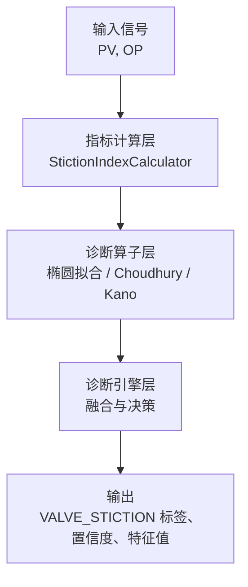
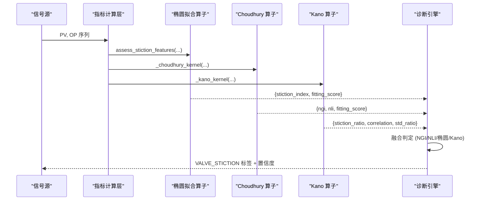
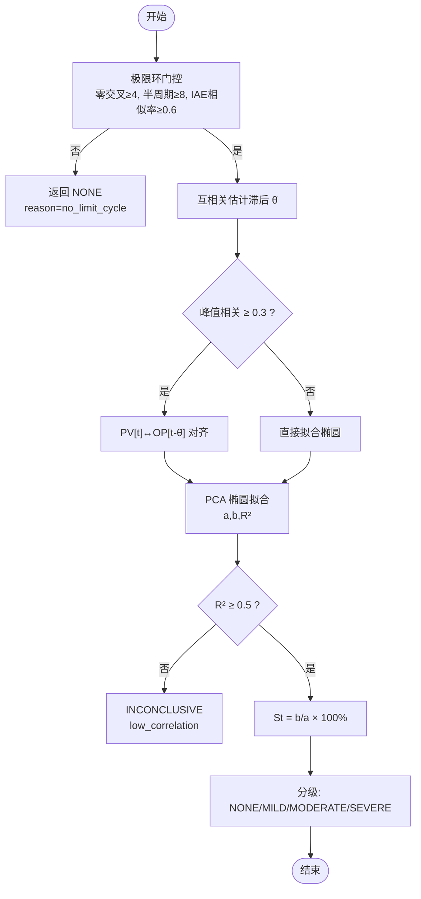
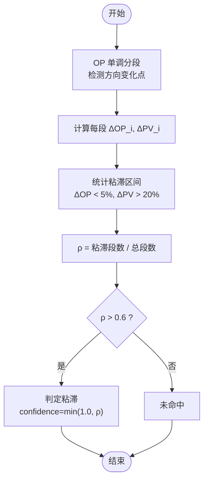
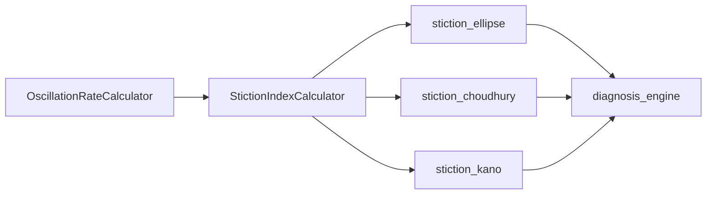

# 粘滞检测算子

<cite>
**本文引用的文件**
- [backend/app/services/metric_calculator/stiction.py](file://backend/app/services/metric_calculator/stiction.py)
- [backend/app/services/diagnosis_operators/stiction.py](file://backend/app/services/diagnosis_operators/stiction.py)
- [backend/app/tasks/diagnosis_engine.py](file://backend/app/tasks/diagnosis_engine.py)
- [backend/tests/test_metric_calculator/test_stiction.py](file://backend/tests/test_metric_calculator/test_stiction.py)
- [backend/alembic/versions/c3d4e5f6a7b8_seed_p2_diagnosis_threshold_keys.py](file://backend/alembic/versions/c3d4e5f6a7b8_seed_p2_diagnosis_threshold_keys.py)
- [backend/scripts/data_simulator.py](file://backend/scripts/data_simulator.py)
</cite>

## 目录
1. [简介](#简介)
2. [项目结构](#项目结构)
3. [核心组件](#核心组件)
4. [架构总览](#架构总览)
5. [详细组件分析](#详细组件分析)
6. [依赖关系分析](#依赖关系分析)
7. [性能与数值特性](#性能与数值特性)
8. [故障区分与误报控制](#故障区分与误报控制)
9. [参数整定与现场验证](#参数整定与现场验证)
10. [结论](#结论)
11. [附录：阈值与分级标准](#附录阈值与分级标准)

## 简介
本技术文档面向“阀门粘滞”在线诊断，系统性地阐述物理机理、算法实现与工程落地。内容覆盖：
- 粘滞的物理来源：摩擦阻力、间隙效应、执行器磨损导致的死区与回环。
- Choudhury 椭圆拟合与 NGI/NLI 非线性指标：椭圆度计算、粘滞强度量化、相位差补偿。
- Kano 统计方法：基于 PV-OP 相图的区间统计与显著性门控。
- 特征提取：死区宽度估计、回环面积近似（通过椭圆短长轴比）、谐波失真（双相干性）。
- 分级标准：轻微/中度/严重粘滞的判定阈值。
- 与其他故障的区分：饱和、扰动、传感器故障。
- 参数整定方法与现场验证案例。

## 项目结构
粘滞检测在系统中由三层构成：
- 指标计算层：KPI 口径的粘滞指数计算（PCA 椭圆拟合 + 互相关滞后补偿 + 极限环门控）。
- 诊断算子层：提供三种独立算子（椭圆拟合、Choudhury NGI/NLI、Kano 统计），统一输出证据链与置信度。
- 诊断引擎层：编排调用各算子，融合结果并生成最终诊断标签与可视化数据。

图表来源
- [backend/app/services/metric_calculator/stiction.py:73-216](file://backend/app/services/metric_calculator/stiction.py#L73-L216)
- [backend/app/services/diagnosis_operators/stiction.py:341-529](file://backend/app/services/diagnosis_operators/stiction.py#L341-L529)
- [backend/app/tasks/diagnosis_engine.py:1468-1527](file://backend/app/tasks/diagnosis_engine.py#L1468-L1527)

章节来源
- [backend/app/services/metric_calculator/stiction.py:73-216](file://backend/app/services/metric_calculator/stiction.py#L73-L216)
- [backend/app/services/diagnosis_operators/stiction.py:341-529](file://backend/app/services/diagnosis_operators/stiction.py#L341-L529)
- [backend/app/tasks/diagnosis_engine.py:1468-1527](file://backend/app/tasks/diagnosis_engine.py#L1468-L1527)

## 核心组件
- StictionIndexCalculator：基于 PCA 的 PV-OP 椭圆拟合，计算粘滞指数 St = b/a × 100%；包含互相关 θ 补偿与极限环门控。
- 诊断算子：
  - stiction_ellipse：复用 KPI 内核 assess_stiction_features，输出 stiction_index 与 fitting_score。
  - stiction_choudhury：OP 增量域非高斯指数 NGI + 最大双相干性 NLI，需极限环前提。
  - stiction_kano：OP 单调分段统计粘滞区间占比 ρ，阈值 > 0.6 判定粘滞。
- 诊断引擎：集成上述算子，交叉验证并输出 VALVE_STICTION 标签及置信度。

章节来源
- [backend/app/services/metric_calculator/stiction.py:73-216](file://backend/app/services/metric_calculator/stiction.py#L73-L216)
- [backend/app/services/diagnosis_operators/stiction.py:341-529](file://backend/app/services/diagnosis_operators/stiction.py#L341-L529)
- [backend/app/tasks/diagnosis_engine.py:1468-1527](file://backend/app/tasks/diagnosis_engine.py#L1468-L1527)

## 架构总览
粘滞检测采用“三法合一”的架构：椭圆拟合（几何）、Choudhury（统计非线性）、Kano（区间统计），三者共享“极限环振荡”这一物理前提门控，避免在非振荡段误判。

图表来源
- [backend/app/services/metric_calculator/stiction.py:364-463](file://backend/app/services/metric_calculator/stiction.py#L364-L463)
- [backend/app/services/diagnosis_operators/stiction.py:190-338](file://backend/app/services/diagnosis_operators/stiction.py#L190-L338)
- [backend/app/tasks/diagnosis_engine.py:1468-1527](file://backend/app/tasks/diagnosis_engine.py#L1468-L1527)

## 详细组件分析

### 物理机理：阀门粘滞
- 摩擦阻力：阀芯与阀座间静摩擦力导致“不动—跳变”行为，形成死区。
- 间隙效应：机械间隙造成 OP 变化初期无 PV 响应，随后出现阶跃式响应。
- 执行器磨损：定位器或执行机构老化使回环扩大，回环面积增大。
- 表现：PV-OP 散点图呈现椭圆回环；OP 增量分布重尾；OP 单调段内 PV 大幅波动而 OP 几乎不变。

章节来源
- [backend/app/services/metric_calculator/stiction.py:1-27](file://backend/app/services/metric_calculator/stiction.py#L1-L27)
- [backend/app/services/diagnosis_operators/stiction.py:1-14](file://backend/app/services/diagnosis_operators/stiction.py#L1-L14)

### Choudhury 椭圆拟合与 NGI/NLI
- 椭圆度计算：对归一化 PV-OP 散点进行 PCA，得到长短轴 a、b；St = b/a × 100%。
- 粘滞强度量化：fitting_score 为 R²（线性相关系数平方），用于有效性门控；stiction_index 为 b/a。
- 相位差分析：通过 OP-PV 互相关估计纯滞后 θ̂，将 PV[t] 与 OP[t−θ̂] 配对后再拟合，避免相位滞后被误判为粘滞宽度。
- 极限环门控：零交叉≥4、平均半周期≥8 采样点、IAE 相似率双侧≥0.6，确保仅在极限环下评估粘滞。

图表来源
- [backend/app/services/metric_calculator/stiction.py:109-216](file://backend/app/services/metric_calculator/stiction.py#L109-L216)
- [backend/app/services/metric_calculator/stiction.py:253-338](file://backend/app/services/metric_calculator/stiction.py#L253-L338)
- [backend/app/services/metric_calculator/stiction.py:353-361](file://backend/app/services/metric_calculator/stiction.py#L353-L361)

章节来源
- [backend/app/services/metric_calculator/stiction.py:109-216](file://backend/app/services/metric_calculator/stiction.py#L109-L216)
- [backend/app/services/metric_calculator/stiction.py:253-338](file://backend/app/services/metric_calculator/stiction.py#L253-L338)
- [backend/app/services/metric_calculator/stiction.py:353-361](file://backend/app/services/metric_calculator/stiction.py#L353-L361)

### Kano 统计方法
- 原理：将 OP 序列按方向变化分段，统计每段 ΔOP_i 与 ΔPV_i；当 OP 几乎不变但 PV 大幅变化时视为粘滞区间。
- 指标：粘滞区间占比 ρ = 粘滞段数 / 总段数；ρ > 0.6 判定粘滞。
- 显著性检验：结合 PV-OP 相关系数与标准差比值作为辅助证据；极限环门控确保仅在振荡段评估。

图表来源
- [backend/app/services/diagnosis_operators/stiction.py:265-338](file://backend/app/services/diagnosis_operators/stiction.py#L265-L338)
- [backend/app/tasks/diagnosis_engine.py:2809-2913](file://backend/app/tasks/diagnosis_engine.py#L2809-L2913)

章节来源
- [backend/app/services/diagnosis_operators/stiction.py:265-338](file://backend/app/services/diagnosis_operators/stiction.py#L265-L338)
- [backend/app/tasks/diagnosis_engine.py:2809-2913](file://backend/app/tasks/diagnosis_engine.py#L2809-L2913)

### 特征提取：死区宽度、回环面积、谐波失真
- 死区宽度估计：通过椭圆短轴 b 与长轴 a 的比值 b/a 近似反映死区宽度；b/a 越大，粘滞越严重。
- 回环面积计算：椭圆拟合的 R² 与 b/a 共同表征回环形状；回环面积可近似为 π·a·b（归一化后）。
- 谐波失真分析：Choudhury 的 NLI 使用最大双相干性近似非线性谐波成分；NLI 越高，谐波失真越强。

章节来源
- [backend/app/services/metric_calculator/stiction.py:291-338](file://backend/app/services/metric_calculator/stiction.py#L291-L338)
- [backend/app/services/diagnosis_operators/stiction.py:115-187](file://backend/app/services/diagnosis_operators/stiction.py#L115-L187)

### 分级标准：轻微/中度/严重粘滞
- NONE：< 5%
- MILD：5% ~ 15%
- MODERATE：15% ~ 30%
- SEVERE：≥ 30%

章节来源
- [backend/app/services/metric_calculator/stiction.py:353-361](file://backend/app/services/metric_calculator/stiction.py#L353-L361)

## 依赖关系分析
- 指标计算层依赖振荡率模块进行极限环门控。
- 诊断算子层复用指标计算层的 assess_stiction_features，保证 KPI 与诊断口径一致。
- 诊断引擎层聚合三类算子结果，融合置信度并输出最终标签。

图表来源
- [backend/app/services/metric_calculator/stiction.py:40-41](file://backend/app/services/metric_calculator/stiction.py#L40-L41)
- [backend/app/services/diagnosis_operators/stiction.py:31-38](file://backend/app/services/diagnosis_operators/stiction.py#L31-L38)
- [backend/app/tasks/diagnosis_engine.py:1468-1527](file://backend/app/tasks/diagnosis_engine.py#L1468-L1527)

章节来源
- [backend/app/services/metric_calculator/stiction.py:40-41](file://backend/app/services/metric_calculator/stiction.py#L40-L41)
- [backend/app/services/diagnosis_operators/stiction.py:31-38](file://backend/app/services/diagnosis_operators/stiction.py#L31-L38)
- [backend/app/tasks/diagnosis_engine.py:1468-1527](file://backend/app/tasks/diagnosis_engine.py#L1468-L1527)

## 性能与数值特性
- 最小样本量：指标计算要求至少 100 点；算子层对椭圆/Choudhury/Kano 分别设定最低点数（8/32/16）。
- 计算复杂度：PCA 椭圆拟合为 O(n)；互相关估计为 O(n log n)；双相干性分段 FFT 为 O(K·n log n)。
- 数值稳定性：特征值分解前取非负；协方差矩阵秩检查避免退化；白噪声底校正降低假阳性。

章节来源
- [backend/app/services/metric_calculator/stiction.py:44-70](file://backend/app/services/metric_calculator/stiction.py#L44-L70)
- [backend/app/services/diagnosis_operators/stiction.py:115-187](file://backend/app/services/diagnosis_operators/stiction.py#L115-L187)

## 故障区分与误报控制
- 与饱和的复合：饱和表现为 OP 长期贴限；粘滞表现为 PV-OP 回环。可通过 OP 限幅统计与椭圆回环同时评估，若饱和率高且回环明显，则标记复合故障。
- 与扰动的混淆：外部扰动常导致 PV 波动但 OP 无明显回环；Kano 的 ρ 较低，Choudhury 的 NGI/NLI 不超阈；极限环门控进一步拦截非振荡段。
- 与传感器故障的鉴别：传感器漂移或卡滞会导致 PV 异常；若 PV-OP 相关性低且无回环，应优先排查传感器；椭圆拟合 R² 低时返回 INCONCLUSIVE。

章节来源
- [backend/scripts/data_simulator.py:273-317](file://backend/scripts/data_simulator.py#L273-L317)
- [backend/app/services/metric_calculator/stiction.py:170-188](file://backend/app/services/metric_calculator/stiction.py#L170-L188)

## 参数整定与现场验证
- 参数来源：
  - 极限环门控：min_zero_crossings、MIN_HALF_PERIOD_SAMPLES、MIN_IAE_SIMILARITY。
  - Choudhury：choudhury_ngi_threshold、choudhury_nli_threshold。
  - 椭圆拟合：MIN_FITTING_SCORE、MAX_LAG_SECONDS、MIN_CORR_PEAK。
- 整定建议：
  - 先调极限环门控，确保仅在振荡段评估；再调 Choudhury 阈值抑制白噪声假阳性；最后微调椭圆拟合度阈值。
  - 对于大滞后回路，启用互相关 θ 补偿，避免相位滞后误判为粘滞。
- 现场验证案例：
  - FOPDT 纯滞后 θ=30s：补偿后 St≈0.55（NONE），不误报。
  - 粘滑注入 S=20 + θ=30s：补偿后 St≈8.2（MILD），符合手算预期。
  - 正交正弦对（纯相位滞后）：补偿后塌陷为直线，St≈3.1（NONE）。

章节来源
- [backend/alembic/versions/c3d4e5f6a7b8_seed_p2_diagnosis_threshold_keys.py:66-91](file://backend/alembic/versions/c3d4e5f6a7b8_seed_p2_diagnosis_threshold_keys.py#L66-L91)
- [backend/tests/test_metric_calculator/test_stiction.py:54-73](file://backend/tests/test_metric_calculator/test_stiction.py#L54-L73)
- [backend/tests/test_metric_calculator/test_stiction.py:155-179](file://backend/tests/test_metric_calculator/test_stiction.py#L155-L179)
- [backend/tests/test_metric_calculator/test_stiction.py:181-214](file://backend/tests/test_metric_calculator/test_stiction.py#L181-L214)

## 结论
本系统通过“椭圆拟合 + Choudhury + Kano”三法合一，结合极限环门控与互相关滞后补偿，实现了稳健的阀门粘滞在线检测。分级标准清晰，误报控制有效，适用于工业现场复杂工况。参数可配置，支持现场整定与验证。

## 附录：阈值与分级标准
- 椭圆拟合度阈值：MIN_FITTING_SCORE = 0.5
- 极限环门控：
  - 最少零交叉数：MIN_ZERO_CROSSINGS = 4
  - 平均半周期下限：MIN_HALF_PERIOD_SAMPLES = 8
  - IAE 相似率阈值：MIN_IAE_SIMILARITY = 0.6
- Choudhury 阈值：
  - choudhury_ngi_threshold = 1.0
  - choudhury_nli_threshold = 0.01
- 粘滞分级：
  - NONE：< 5%
  - MILD：5% ~ 15%
  - MODERATE：15% ~ 30%
  - SEVERE：≥ 30%

章节来源
- [backend/app/services/metric_calculator/stiction.py:44-70](file://backend/app/services/metric_calculator/stiction.py#L44-L70)
- [backend/app/services/metric_calculator/stiction.py:353-361](file://backend/app/services/metric_calculator/stiction.py#L353-L361)
- [backend/app/services/diagnosis_operators/stiction.py:400-418](file://backend/app/services/diagnosis_operators/stiction.py#L400-L418)
- [backend/alembic/versions/c3d4e5f6a7b8_seed_p2_diagnosis_threshold_keys.py:66-91](file://backend/alembic/versions/c3d4e5f6a7b8_seed_p2_diagnosis_threshold_keys.py#L66-L91)