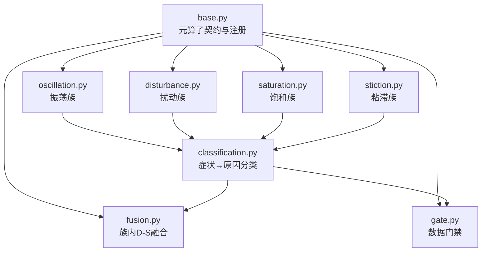
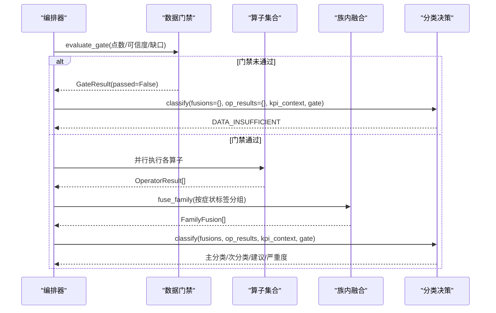
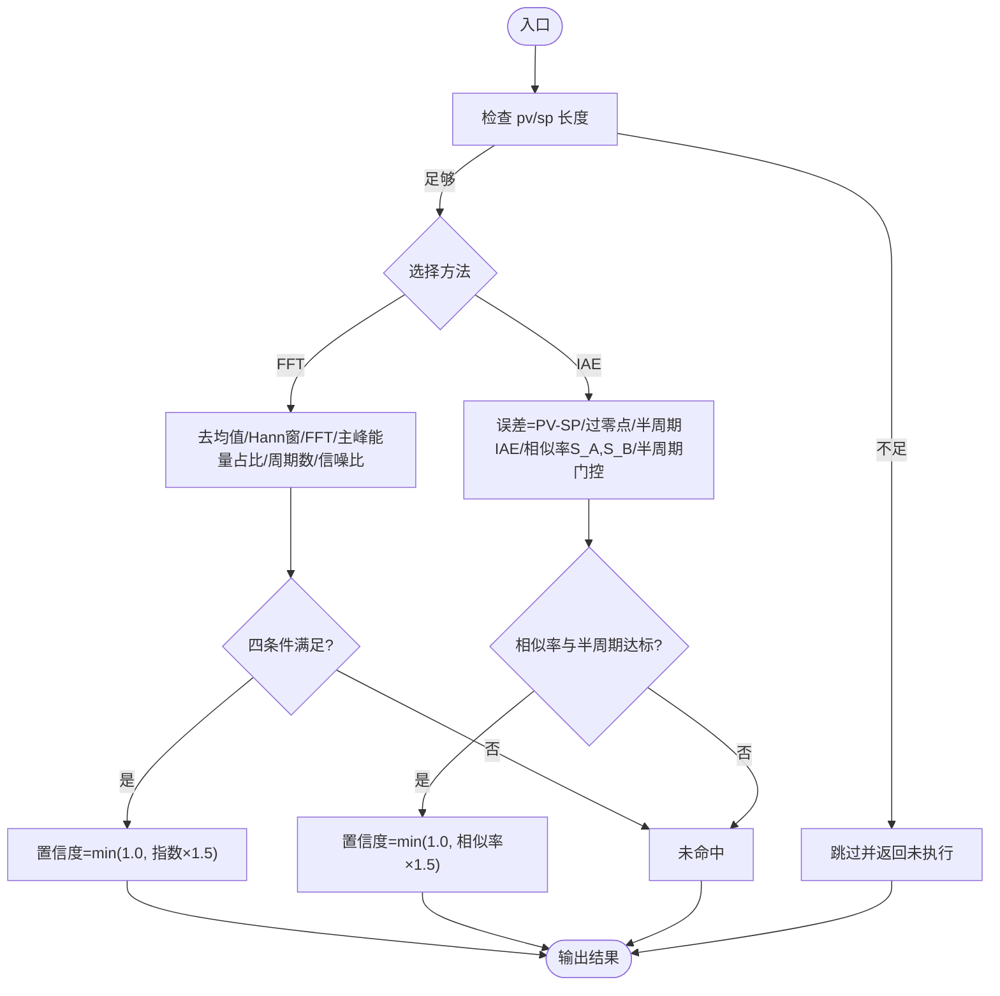
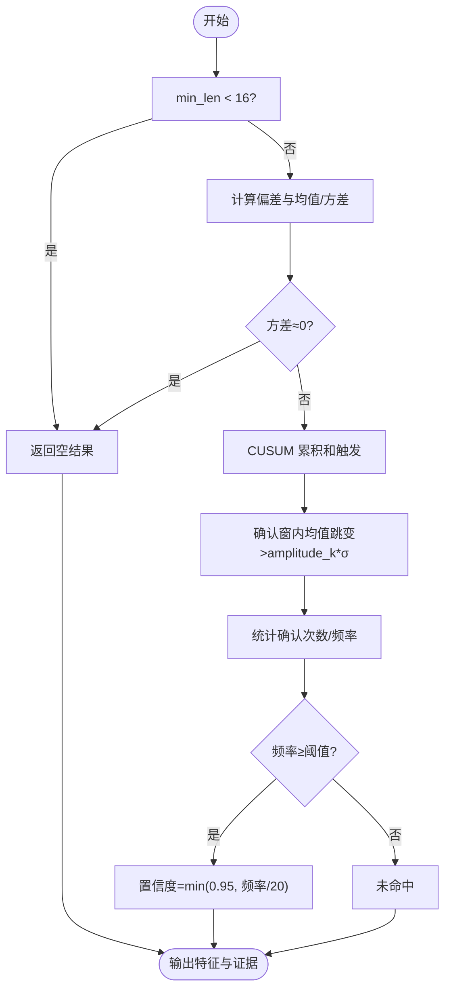
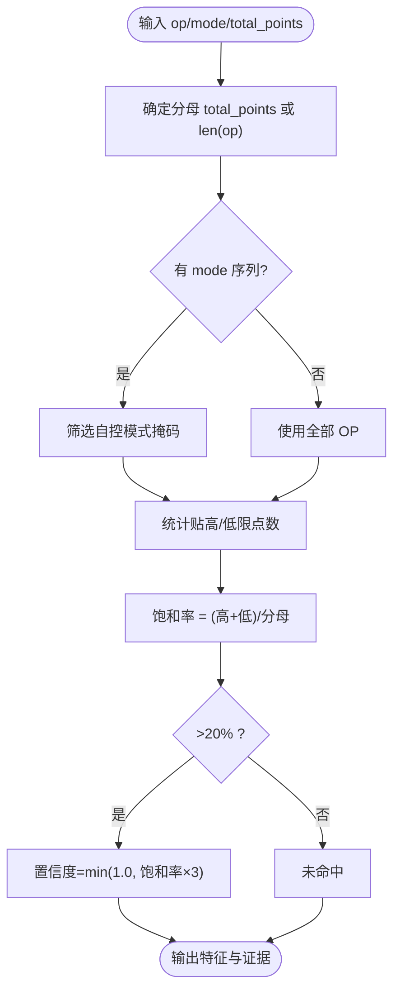
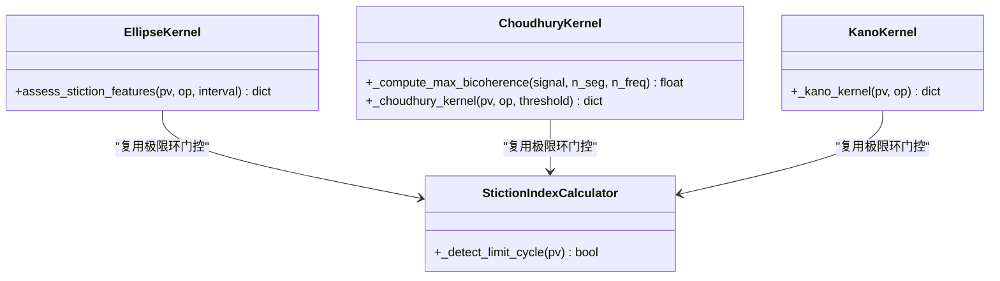
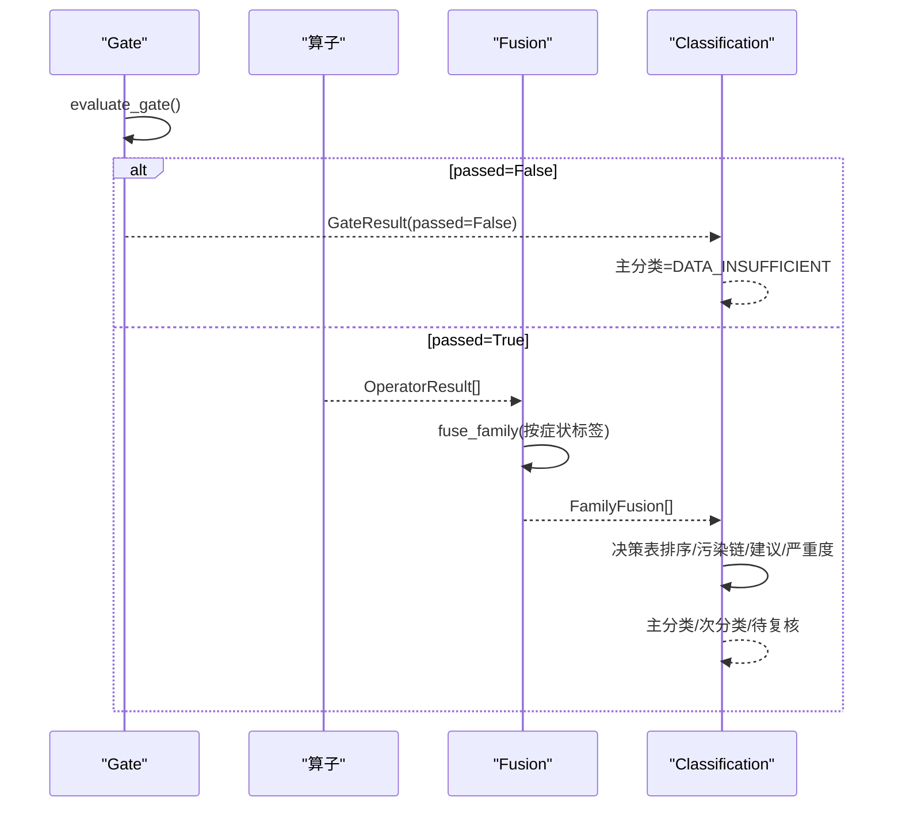
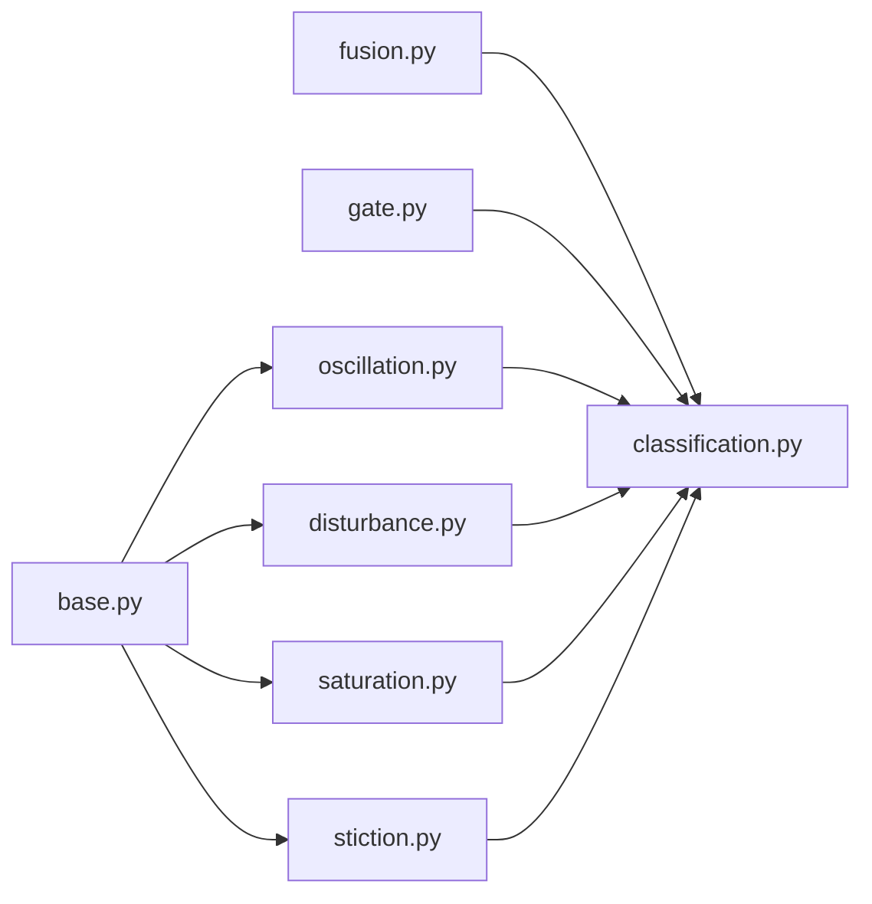

# 诊断算子系统

<cite>
**本文引用的文件**
- [backend/app/services/diagnosis_operators/base.py](file://backend/app/services/diagnosis_operators/base.py)
- [backend/app/services/diagnosis_operators/__init__.py](file://backend/app/services/diagnosis_operators/__init__.py)
- [backend/app/services/diagnosis_operators/oscillation.py](file://backend/app/services/diagnosis_operators/oscillation.py)
- [backend/app/services/diagnosis_operators/disturbance.py](file://backend/app/services/diagnosis_operators/disturbance.py)
- [backend/app/services/diagnosis_operators/saturation.py](file://backend/app/services/diagnosis_operators/saturation.py)
- [backend/app/services/diagnosis_operators/stiction.py](file://backend/app/services/diagnosis_operators/stiction.py)
- [backend/app/services/diagnosis_operators/fusion.py](file://backend/app/services/diagnosis_operators/fusion.py)
- [backend/app/services/diagnosis_operators/gate.py](file://backend/app/services/diagnosis_operators/gate.py)
- [backend/app/services/diagnosis_operators/classification.py](file://backend/app/services/diagnosis_operators/classification.py)
</cite>

## 目录
1. [简介](#简介)
2. [项目结构](#项目结构)
3. [核心组件](#核心组件)
4. [架构总览](#架构总览)
5. [详细组件分析](#详细组件分析)
6. [依赖关系分析](#依赖关系分析)
7. [性能考量](#性能考量)
8. [故障排查指南](#故障排查指南)
9. [结论](#结论)
10. [附录](#附录)

## 简介
本技术文档面向“诊断算子系统”，围绕元算子架构与实现展开：基类抽象接口、算子注册机制、执行上下文管理；分类、扰动、饱和、粘滞等类型算子的具体算法与阈值判定；门控与融合编排逻辑；输入输出规范、特征值计算与置信度口径；并提供自定义算子开发指南、调试方法与性能优化建议。系统遵循无状态纪律，所有算子为纯函数，仅依赖 numpy/scipy 等数值库，参数通过 threshold_schema 注入，确保同输入必同输出，便于单测与 AI 编排。

## 项目结构
诊断算子系统位于后端服务模块下，采用“按功能域分文件”的组织方式：
- base.py：定义元算子契约（OperatorMeta/OperatorInput/OperatorResult）、注册表与注册装饰器、默认阈值查询与算子清单序列化。
- oscillation.py：振荡族（FFT 频域、IAE 零交叉相似率）。
- disturbance.py：扰动族（CUSUM 偏差突变检测）。
- saturation.py：饱和族（OP 贴限统计）。
- stiction.py：粘滞族（椭圆拟合、Choudhury NGI/NLI、Kano 统计法）。
- fusion.py：族内 D-S 证据融合。
- gate.py：前置数据门禁。
- classification.py：症状→原因分类决策层。
- __init__.py：触发各算子模块导入以完成注册。

**图表来源**
- [backend/app/services/diagnosis_operators/base.py:29-137](file://backend/app/services/diagnosis_operators/base.py#L29-L137)
- [backend/app/services/diagnosis_operators/oscillation.py:223-323](file://backend/app/services/diagnosis_operators/oscillation.py#L223-L323)
- [backend/app/services/diagnosis_operators/disturbance.py:127-176](file://backend/app/services/diagnosis_operators/disturbance.py#L127-L176)
- [backend/app/services/diagnosis_operators/saturation.py:119-169](file://backend/app/services/diagnosis_operators/saturation.py#L119-L169)
- [backend/app/services/diagnosis_operators/stiction.py:341-530](file://backend/app/services/diagnosis_operators/stiction.py#L341-L530)
- [backend/app/services/diagnosis_operators/fusion.py:16-96](file://backend/app/services/diagnosis_operators/fusion.py#L16-L96)
- [backend/app/services/diagnosis_operators/gate.py:19-72](file://backend/app/services/diagnosis_operators/gate.py#L19-L72)
- [backend/app/services/diagnosis_operators/classification.py:190-462](file://backend/app/services/diagnosis_operators/classification.py#L190-L462)

**章节来源**
- [backend/app/services/diagnosis_operators/base.py:1-137](file://backend/app/services/diagnosis_operators/base.py#L1-L137)
- [backend/app/services/diagnosis_operators/__init__.py:1-41](file://backend/app/services/diagnosis_operators/__init__.py#L1-L41)

## 核心组件
- 元算子契约与注册
  - OperatorMeta：描述算子名称、显示名、家族、诊断码、所需信号、最小采样率、输出字段、阈值模式、症状标签、是否默认启用、fast_group、置信度口径。
  - OperatorInput：封装 loop_id、signals（pv/sp/op/mode/pv_quality）、timestamps、meta（sample_interval/pv_range/control_type 等只读上下文）、kpi_context（只读 KPI 快照）。
  - OperatorResult：封装 operator、executed、skip_reason、detected、confidence、features、evidence、error。
  - 注册表 OPERATOR_REGISTRY：键为算子名，值为 (OperatorMeta, OperatorFunc)。
  - 注册装饰器 @operator：将无状态纯函数绑定到注册表，重复注册抛异常。
  - 工具函数：get_operator、default_thresholds、list_operators。

- 数据门禁 Gate
  - evaluate_gate：基于点数充足、可信度非 E 级、断点比例≤30% 三条件判断是否通过。
  - GateResult：包含 passed、point_count、expected_points、valid_rate、confidence_level、gap_ratio、reason。

- 族内融合 Fusion
  - dempster_shafer：D-S 公式融合多条命中证据的置信度。
  - fuse_family：仅对 executed 且 detected 的算子进行族内融合；≥2 条命中则融合，1 条命中原样传递，0 条未检出。

- 分类 Classification
  - classify：按决策表优先级（数据不足→通信→仪表→阀门→工艺→参数→投用→兜底）生成主分类、次分类、待复核项、依据与建议、严重度。
  - 污染链：COMMUNICATION→INSTRUMENT/VALVE/PROCESS/TUNING；INSTRUMENT→VALVE/PROCESS/TUNING；VALVE/PROCESS→TUNING。

**章节来源**
- [backend/app/services/diagnosis_operators/base.py:29-137](file://backend/app/services/diagnosis_operators/base.py#L29-L137)
- [backend/app/services/diagnosis_operators/gate.py:19-72](file://backend/app/services/diagnosis_operators/gate.py#L19-L72)
- [backend/app/services/diagnosis_operators/fusion.py:16-96](file://backend/app/services/diagnosis_operators/fusion.py#L16-L96)
- [backend/app/services/diagnosis_operators/classification.py:190-462](file://backend/app/services/diagnosis_operators/classification.py#L190-L462)

## 架构总览
诊断流程从数据门禁开始，随后并行执行多族算子，再按症状标签进行族内融合，最后进入分类决策层输出主因与建议。

**图表来源**
- [backend/app/services/diagnosis_operators/gate.py:41-72](file://backend/app/services/diagnosis_operators/gate.py#L41-L72)
- [backend/app/services/diagnosis_operators/fusion.py:64-96](file://backend/app/services/diagnosis_operators/fusion.py#L64-L96)
- [backend/app/services/diagnosis_operators/classification.py:190-462](file://backend/app/services/diagnosis_operators/classification.py#L190-L462)

## 详细组件分析

### 振荡族（OSCILLATION）
- 算子
  - FFT 频域振荡检测：Hann 窗 FFT，主峰能量占比、完整周期数、频谱信噪比四条件判定；置信度为主峰能量占比×1.5（上限1）。
  - IAE 零交叉相似率：控制偏差 PV-SP，半周期 IAE 正负相似率 S_A/S_B 均达阈值且平均半周期达标；置信度为相似率×1.5（上限1）。
- 输入输出
  - 输入：pv（可选 sp），sample_interval。
  - 输出：frequency/amplitude/index（FFT）或 similarity/zero_crossing_count/mean_period（IAE）。
- 阈值
  - FFT：主峰能量占比阈值、最小过零数、最小周期数、最小信噪比。
  - IAE：相似率阈值、最小过零数、最小半周期采样数。
- 置信度口径
  - 命中时 min(1.0, 指标×放大系数)，详见各算子注册元数据。

**图表来源**
- [backend/app/services/diagnosis_operators/oscillation.py:49-121](file://backend/app/services/diagnosis_operators/oscillation.py#L49-L121)
- [backend/app/services/diagnosis_operators/oscillation.py:123-221](file://backend/app/services/diagnosis_operators/oscillation.py#L123-L221)
- [backend/app/services/diagnosis_operators/oscillation.py:223-323](file://backend/app/services/diagnosis_operators/oscillation.py#L223-L323)

**章节来源**
- [backend/app/services/diagnosis_operators/oscillation.py:1-323](file://backend/app/services/diagnosis_operators/oscillation.py#L1-L323)

### 扰动族（EXTERNAL_DISTURBANCE）
- 算子：偏差突变检测（CUSUM + 确认窗）
  - 计算 PV-SP 偏差均值与标准差，CUSUM 累积和触发后在确认窗内验证跳变幅度 > amplitude_k×σ。
  - 频率阈值达到则判定外扰频繁；置信度为 min(0.95, 突变频率/20 次/h)。
- 输入输出
  - 输入：pv、sp、timestamps（用于时间窗口换算小时）。
  - 输出：shift_count、shift_frequency、shift_magnitude。
- 阈值
  - bias_shift_freq_threshold、bias_shift_amplitude_k、bias_shift_confirm_window。

**图表来源**
- [backend/app/services/diagnosis_operators/disturbance.py:38-125](file://backend/app/services/diagnosis_operators/disturbance.py#L38-L125)
- [backend/app/services/diagnosis_operators/disturbance.py:127-176](file://backend/app/services/diagnosis_operators/disturbance.py#L127-L176)

**章节来源**
- [backend/app/services/diagnosis_operators/disturbance.py:1-176](file://backend/app/services/diagnosis_operators/disturbance.py#L1-L176)

### 饱和族（OUTPUT_SATURATION）
- 算子：OP 输出饱和检测
  - 分子：自控模式下 OP 贴高/低限的点数；分母：评估时段总点数（含手动模式）。
  - 饱和率 > 20% 判饱和；置信度为 min(1.0, 饱和率×3)。
- 输入输出
  - 输入：op、mode（可选）、total_points（可选）。
  - 输出：saturation_rate、high_count、low_count。
- 阈值
  - op_high_limit、op_low_limit、saturation_epsilon。

**图表来源**
- [backend/app/services/diagnosis_operators/saturation.py:46-117](file://backend/app/services/diagnosis_operators/saturation.py#L46-L117)
- [backend/app/services/diagnosis_operators/saturation.py:119-169](file://backend/app/services/diagnosis_operators/saturation.py#L119-L169)

**章节来源**
- [backend/app/services/diagnosis_operators/saturation.py:1-169](file://backend/app/services/diagnosis_operators/saturation.py#L1-L169)

### 粘滞族（VALVE_STICTION）
- 算子
  - 椭圆拟合：PV-OP 散点椭圆拟合，需极限环前提、R²≥阈值、短长轴比>0.3；置信度为拟合分与粘滞指数的平均（上限1）。
  - Choudhury NGI/NLI：OP 增量域非高斯指数 NGI + 双相干性非线性指数 NLI；需极限环前提；置信度加权组合。
  - Kano 统计法：OP 单调分段中“OP几乎不变而PV大幅变化”的区间占比；需极限环前提；置信度为占比（上限1）。
- 输入输出
  - 输入：pv、op（部分需要 sample_interval）。
  - 输出：stiction_index/fitting_score（椭圆）、ngi/nli（Choudhury）、stiction_ratio/correlation/std_ratio（Kano）。
- 阈值
  - Choudhury：ngi_threshold、nli_threshold；其他算子使用内部门控常量。
- 重要修复
  - P1：NLI 最大双相干性分段数提升至默认 64，并进行逐对噪声底校正，避免白噪声饱和导致误检。
  - P3：Choudhury/Kano/椭圆三法统一增加极限环前提门控，防止非振荡段伪命中。

**图表来源**
- [backend/app/services/diagnosis_operators/stiction.py:80-113](file://backend/app/services/diagnosis_operators/stiction.py#L80-L113)
- [backend/app/services/diagnosis_operators/stiction.py:115-188](file://backend/app/services/diagnosis_operators/stiction.py#L115-L188)
- [backend/app/services/diagnosis_operators/stiction.py:190-263](file://backend/app/services/diagnosis_operators/stiction.py#L190-L263)
- [backend/app/services/diagnosis_operators/stiction.py:265-339](file://backend/app/services/diagnosis_operators/stiction.py#L265-L339)
- [backend/app/services/diagnosis_operators/stiction.py:341-530](file://backend/app/services/diagnosis_operators/stiction.py#L341-L530)

**章节来源**
- [backend/app/services/diagnosis_operators/stiction.py:1-530](file://backend/app/services/diagnosis_operators/stiction.py#L1-L530)

### 门控与融合编排
- 门控 Gate
  - evaluate_gate：三点位门槛（点数、可信度、缺口）快速短路，未通过直接输出 DATA_INSUFFICIENT。
- 融合 Fusion
  - fuse_family：按症状标签分组，仅取 executed 且 detected 的算子置信度；≥2 条命中走 D-S 融合，1 条命中原样传递，0 条未检出。
- 分类 Classification
  - classify：按决策表顺序构建候选池，主分类取最高优先级；其余命中经污染链降级为待复核或次分类；生成建议与严重度。

**图表来源**
- [backend/app/services/diagnosis_operators/gate.py:41-72](file://backend/app/services/diagnosis_operators/gate.py#L41-L72)
- [backend/app/services/diagnosis_operators/fusion.py:64-96](file://backend/app/services/diagnosis_operators/fusion.py#L64-L96)
- [backend/app/services/diagnosis_operators/classification.py:190-462](file://backend/app/services/diagnosis_operators/classification.py#L190-L462)

**章节来源**
- [backend/app/services/diagnosis_operators/gate.py:1-72](file://backend/app/services/diagnosis_operators/gate.py#L1-L72)
- [backend/app/services/diagnosis_operators/fusion.py:1-96](file://backend/app/services/diagnosis_operators/fusion.py#L1-L96)
- [backend/app/services/diagnosis_operators/classification.py:1-514](file://backend/app/services/diagnosis_operators/classification.py#L1-L514)

## 依赖关系分析
- 模块耦合
  - base.py 被所有算子与编排组件引用，提供统一契约与注册表。
  - __init__.py 负责导入各算子模块以触发注册，形成“自注册”机制。
  - classification.py 依赖 fusion.py 与 gate.py 的输出，作为最终决策层。
- 外部依赖
  - numpy/scipy：数值计算与统计（如 scipy.stats.skew/kurtosis）。
  - metric_calculator.stiction：复用极限环门控与粘滞指数计算。
- 循环依赖
  - 当前设计无循环依赖；算子仅依赖 base 与外部库，分类层聚合融合结果。

**图表来源**
- [backend/app/services/diagnosis_operators/__init__.py:9-17](file://backend/app/services/diagnosis_operators/__init__.py#L9-L17)
- [backend/app/services/diagnosis_operators/base.py:85-137](file://backend/app/services/diagnosis_operators/base.py#L85-L137)
- [backend/app/services/diagnosis_operators/classification.py:190-462](file://backend/app/services/diagnosis_operators/classification.py#L190-L462)

**章节来源**
- [backend/app/services/diagnosis_operators/__init__.py:1-41](file://backend/app/services/diagnosis_operators/__init__.py#L1-L41)
- [backend/app/services/diagnosis_operators/base.py:1-137](file://backend/app/services/diagnosis_operators/base.py#L1-L137)

## 性能考量
- 向量化与窗口化
  - FFT 使用 Hann 窗抑制泄漏，幅值归一化补偿相干增益；双相干性计算采用分段平均与向量化网格，降低复杂度。
- 门控与短路
  - 数据门禁快速短路，避免无效算子执行；粘滞族统一极限环前提门控，减少非振荡段误检开销。
- 阈值与置信度
  - 多数算子置信度采用线性缩放上限封顶，避免极端值影响整体稳定性。
- 内存与缓存
  - 算子无状态、无全局缓存，避免内存泄漏；必要时可考虑批处理与内存池优化大数据集。

[本节为通用指导，不直接分析具体文件]

## 故障排查指南
- 常见错误与定位
  - 数据不足：各算子在输入长度不足时返回 executed=False 并附带 skip_reason（如“pv/sp 数据不足”）。
  - 方差为零：扰动族在偏差方差接近零时直接返回空结果，避免除零。
  - 极限环前提不成立：粘滞族在 Choudhury/Kano/椭圆法中若未检测到极限环，会返回特定 reason 并在证据表中明确提示。
  - 异常捕获：各内核 try/except 捕获异常并记录日志，返回安全默认值。
- 调试建议
  - 查看 OperatorResult.evidence 中的证据项，核对特征值与阈值对比。
  - 使用 list_operators 获取算子元数据，确认 outputs_schema 与 threshold_schema。
  - 在分类层检查 candidates 构建过程，确认决策表优先级与污染链降级是否正确。

**章节来源**
- [backend/app/services/diagnosis_operators/disturbance.py:122-125](file://backend/app/services/diagnosis_operators/disturbance.py#L122-L125)
- [backend/app/services/diagnosis_operators/saturation.py:108-117](file://backend/app/services/diagnosis_operators/saturation.py#L108-L117)
- [backend/app/services/diagnosis_operators/stiction.py:424-441](file://backend/app/services/diagnosis_operators/stiction.py#L424-L441)
- [backend/app/services/diagnosis_operators/stiction.py:493-510](file://backend/app/services/diagnosis_operators/stiction.py#L493-L510)
- [backend/app/services/diagnosis_operators/base.py:114-137](file://backend/app/services/diagnosis_operators/base.py#L114-L137)

## 结论
诊断算子系统以无状态纯函数为核心，通过统一的元算子契约与注册机制实现可扩展的算子生态。数据门禁保障输入质量，族内 D-S 融合提升鲁棒性，分类决策层结合污染链与严重度输出可解释的诊断结论。各类型算子覆盖振荡、扰动、饱和、粘滞等关键问题，具备明确的阈值与置信度口径。系统具备良好的可测试性与可维护性，适合持续演进与扩展。

[本节为总结，不直接分析具体文件]

## 附录

### 算子输入输出规范
- 输入
  - signals：pv、sp、op、mode、pv_quality（根据算子需求）。
  - timestamps：秒序列（相对窗起点）。
  - meta：sample_interval、pv_range、control_type 等只读上下文。
  - kpi_context：只读 KPI 快照（如 auto_rate_avg、score_avg）。
- 输出
  - features：各算子计算的工程含义特征（见 outputs_schema）。
  - evidence：特征名、实测值、阈值、判定结论。
  - confidence：0~1 的置信度。

**章节来源**
- [backend/app/services/diagnosis_operators/base.py:58-83](file://backend/app/services/diagnosis_operators/base.py#L58-L83)
- [backend/app/services/diagnosis_operators/oscillation.py:223-323](file://backend/app/services/diagnosis_operators/oscillation.py#L223-L323)
- [backend/app/services/diagnosis_operators/disturbance.py:127-176](file://backend/app/services/diagnosis_operators/disturbance.py#L127-L176)
- [backend/app/services/diagnosis_operators/saturation.py:119-169](file://backend/app/services/diagnosis_operators/saturation.py#L119-L169)
- [backend/app/services/diagnosis_operators/stiction.py:341-530](file://backend/app/services/diagnosis_operators/stiction.py#L341-L530)

### 自定义算子开发指南
- 步骤
  1. 在 base.py 中定义 OperatorMeta，声明 name、display_name、family、diag_code、required_signals、outputs_schema、threshold_schema、symptom_tags、enabled_by_default、fast_group、confidence_basis。
  2. 实现无状态纯函数 OperatorFunc，接收 OperatorInput 与 threshold，返回 OperatorResult。
  3. 使用 @operator 装饰器注册到 OPERATOR_REGISTRY。
  4. 在分类层（如需）添加症状标签映射与决策规则。
- 约束
  - 禁止 import DB/Redis/session，禁止全局缓存。
  - 确定性：同输入必同输出。
  - 参数通过 threshold_schema 注入。

**章节来源**
- [backend/app/services/diagnosis_operators/base.py:29-137](file://backend/app/services/diagnosis_operators/base.py#L29-L137)
- [backend/app/services/diagnosis_operators/__init__.py:9-17](file://backend/app/services/diagnosis_operators/__init__.py#L9-L17)

### 调试方法与性能优化建议
- 调试
  - 打印 OperatorResult.evidence 与 features，核对阈值与判定。
  - 使用 list_operators 校验算子元数据与输出字段。
  - 在分类层检查 candidates 与污染链降级。
- 优化
  - 优先使用 fast_group 算子以提升首屏响应。
  - 合理设置阈值与样本长度，避免过长窗口导致计算开销。
  - 利用向量化与分段估计（如双相干性）降低复杂度。

**章节来源**
- [backend/app/services/diagnosis_operators/base.py:114-137](file://backend/app/services/diagnosis_operators/base.py#L114-L137)
- [backend/app/services/diagnosis_operators/stiction.py:115-188](file://backend/app/services/diagnosis_operators/stiction.py#L115-L188)