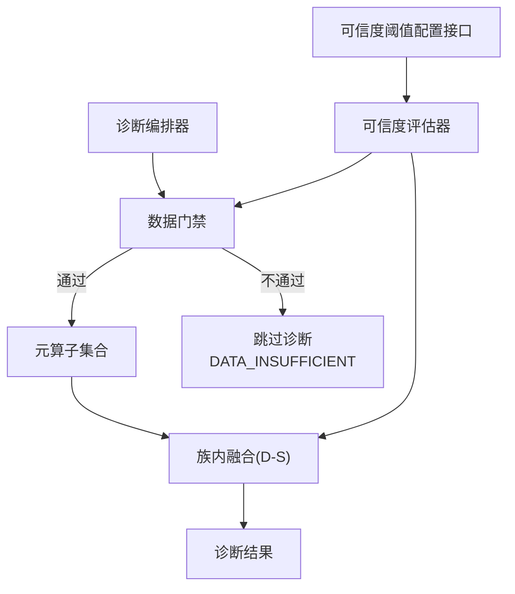
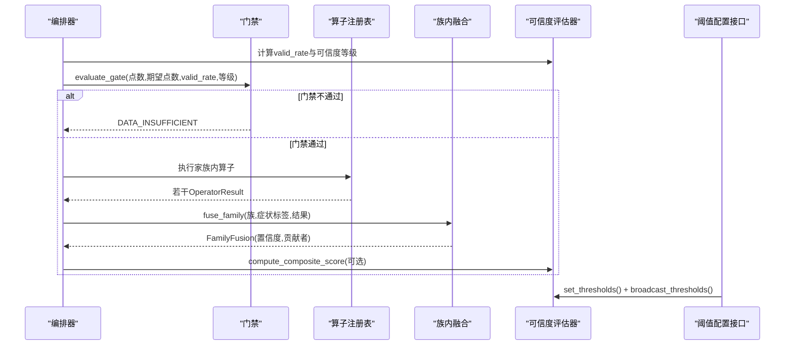
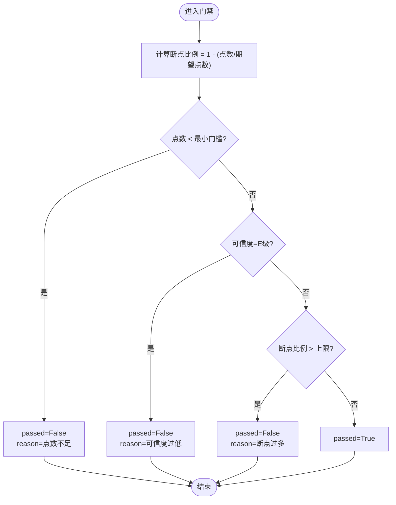
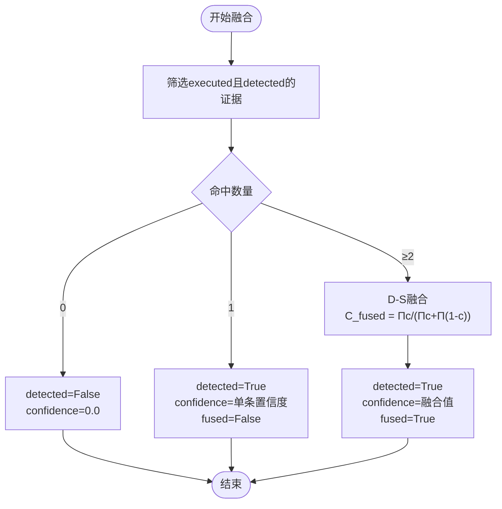
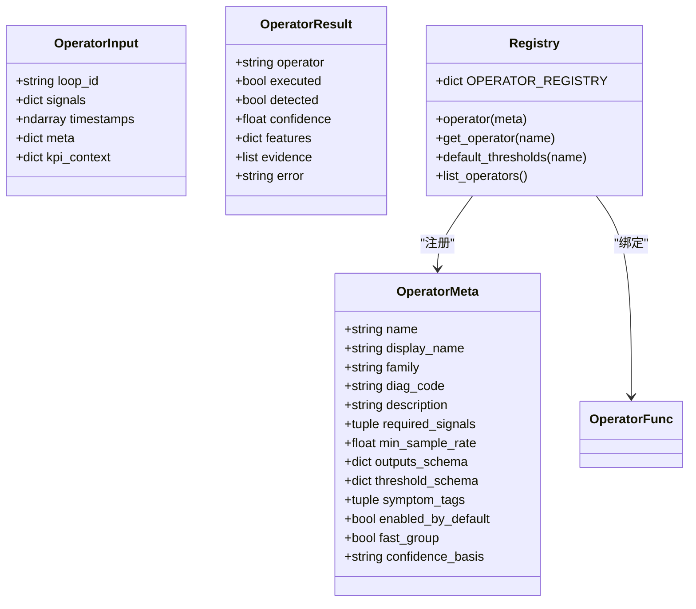
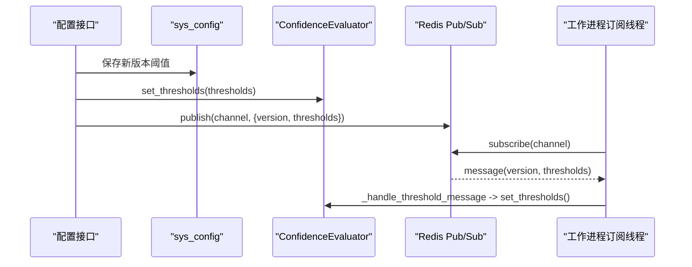
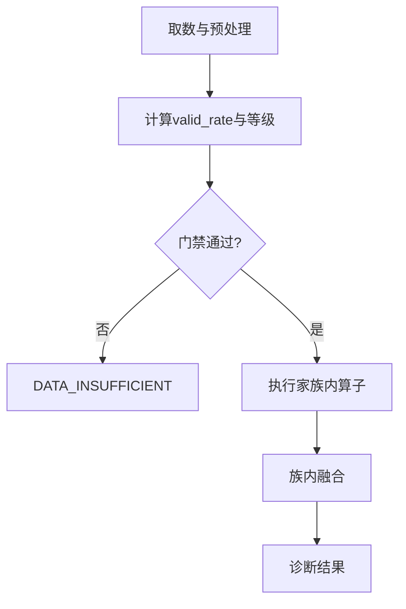
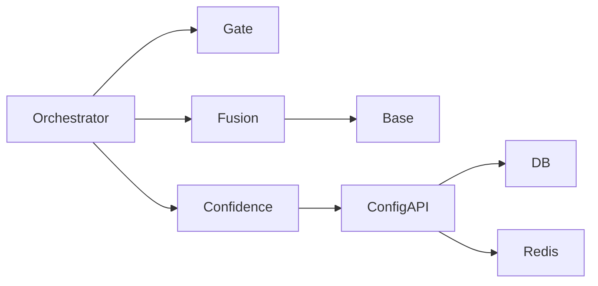

# 门控与融合算子

<cite>
**本文引用的文件**
- [fusion.py](file://backend/app/services/diagnosis_operators/fusion.py)
- [gate.py](file://backend/app/services/diagnosis_operators/gate.py)
- [base.py](file://backend/app/services/diagnosis_operators/base.py)
- [confidence_evaluator.py](file://backend/app/services/confidence_evaluator.py)
- [confidence_config.py](file://backend/app/api/v1/endpoints/confidence_config.py)
- [diagnosis_orchestrator.py](file://backend/app/services/diagnosis_orchestrator.py)
</cite>

## 目录
1. [简介](#简介)
2. [项目结构](#项目结构)
3. [核心组件](#核心组件)
4. [架构总览](#架构总览)
5. [详细组件分析](#详细组件分析)
6. [依赖关系分析](#依赖关系分析)
7. [性能考量](#性能考量)
8. [故障排查指南](#故障排查指南)
9. [结论](#结论)
10. [附录：配置示例与调试方法](#附录：配置示例与调试方法)

## 简介
本技术文档聚焦“门控与融合算子”，围绕以下目标展开：
- 门控算子的逻辑控制：条件触发机制、优先级管理、执行流控制。
- D-S 证据理论融合算法：基本概率分配、冲突处理、融合规则设计。
- 多算子结果融合策略：族内加权投票（D-S）、置信度传播、不确定性量化。
- 融合置信度计算：证据可靠性评估、冲突消解、不确定性表达。
- 融合规则配置：权重设置、阈值调整、专家知识集成。
- 融合效果评估：准确率提升、误报率降低、鲁棒性增强。
- 融合算子的配置示例与调试方法，覆盖复杂场景下的融合策略设计。

## 项目结构
本项目在诊断模块中采用“元算子 + 门禁 + 族内融合”的分层架构：
- 数据入口：编排器负责取数、预处理、质量评估与门禁判断。
- 门禁层：基于有效点数、可信度等级、断点比例进行快速放行/拦截。
- 算子层：无状态纯函数实现各类诊断特征检测，输出置信度与证据。
- 融合层：按“族”对同症状假设的多个算子结果进行 D-S 证据融合。
- 可信度体系：统一的可信度分级与阈值动态同步（Redis pub/sub）。

**图表来源**
- [diagnosis_orchestrator.py:1-200](file://backend/app/services/diagnosis_orchestrator.py#L1-L200)
- [gate.py:1-72](file://backend/app/services/diagnosis_operators/gate.py#L1-L72)
- [fusion.py:1-96](file://backend/app/services/diagnosis_operators/fusion.py#L1-L96)
- [confidence_evaluator.py:1-771](file://backend/app/services/confidence_evaluator.py#L1-L771)
- [confidence_config.py:1-558](file://backend/app/api/v1/endpoints/confidence_config.py#L1-L558)

**章节来源**
- [diagnosis_orchestrator.py:1-200](file://backend/app/services/diagnosis_orchestrator.py#L1-L200)

## 核心组件
- 数据门禁：evaluate_gate(point_count, expected_points, valid_rate, confidence_level) → GateResult
- 族内融合：fuse_family(family, symptom_tag, results) → FamilyFusion；dempster_shafer(confidences) → float
- 算子契约：OperatorMeta / OperatorInput / OperatorResult / 注册表 OPERATOR_REGISTRY
- 可信度评估：ConfidenceEvaluator.evaluate(valid_rate) → A/B/C/D/E；compute_composite_score(...)
- 阈值管理：POST/GET 接口保存/查询/回滚阈值，并通过 Redis 广播到各进程

关键职责边界：
- 门禁仅做“是否可诊断”的快速判定，不执行具体算子。
- 算子保持无状态，参数通过 threshold_schema 注入，确保确定性。
- 融合仅在“同一族（同一症状假设）”内进行，禁止跨族融合。
- 可信度阈值支持运行时更新，保证多进程一致性。

**章节来源**
- [gate.py:1-72](file://backend/app/services/diagnosis_operators/gate.py#L1-L72)
- [fusion.py:1-96](file://backend/app/services/diagnosis_operators/fusion.py#L1-L96)
- [base.py:1-137](file://backend/app/services/diagnosis_operators/base.py#L1-L137)
- [confidence_evaluator.py:1-771](file://backend/app/services/confidence_evaluator.py#L1-L771)
- [confidence_config.py:1-558](file://backend/app/api/v1/endpoints/confidence_config.py#L1-L558)

## 架构总览
门控与融合的整体流程如下：
1. 编排器从数据源获取时间序列，执行异常点剔除并计算 valid_rate。
2. 调用 evaluate_gate 进行门禁判断：点数不足、E 级可信度或断点比例过高则直接返回 DATA_INSUFFICIENT。
3. 若通过门禁，按家族分组执行对应元算子，得到若干 OperatorResult。
4. 对每个家族内的命中证据（executed=True 且 detected=True）进行 D-S 融合，得到家族级置信度。
5. 综合评分与可信度由 ConfidenceEvaluator 提供，用于整体指标与诊断可信度表达。
6. 阈值可通过 API 动态更新，并通过 Redis pub/sub 同步至所有工作进程。

**图表来源**
- [diagnosis_orchestrator.py:1-200](file://backend/app/services/diagnosis_orchestrator.py#L1-L200)
- [gate.py:1-72](file://backend/app/services/diagnosis_operators/gate.py#L1-L72)
- [fusion.py:1-96](file://backend/app/services/diagnosis_operators/fusion.py#L1-L96)
- [confidence_evaluator.py:1-771](file://backend/app/services/confidence_evaluator.py#L1-L771)
- [confidence_config.py:1-558](file://backend/app/api/v1/endpoints/confidence_config.py#L1-L558)

## 详细组件分析

### 数据门禁（Gate）
- 输入：point_count、expected_points、valid_rate、confidence_level
- 输出：GateResult(passed, point_count, expected_points, valid_rate, confidence_level, gap_ratio, reason)
- 规则：
  - 点数不足（< MIN_DATA_POINTS）→ passed=False
  - 可信度为 E 级 → passed=False
  - 断点比例 > MAX_GAP_RATIO → passed=False
- 作用：快速过滤不可靠窗口，避免无效算子执行，保障系统效率与稳定性。

**图表来源**
- [gate.py:1-72](file://backend/app/services/diagnosis_operators/gate.py#L1-L72)

**章节来源**
- [gate.py:1-72](file://backend/app/services/diagnosis_operators/gate.py#L1-L72)

### 族内融合（Family Fusion with D-S）
- 输入：family、symptom_tag、results(list of OperatorResult)
- 筛选：仅统计 executed=True 且 detected=True 的证据
- 融合规则：
  - 0 条命中 → detected=False，confidence=0.0
  - 1 条命中 → 原样置信度，fused=False
  - ≥2 条命中 → 使用 Dempster-Shafer 公式融合，fused=True
- 公式：C_fused = Π cᵢ / (Π cᵢ + Π (1-cᵢ))，并对极端值进行裁剪以避免数值不稳定
- 冲突处理：当证据完全冲突时（如高置信与低置信并存），融合值趋近 0.5，体现不确定性

**图表来源**
- [fusion.py:1-96](file://backend/app/services/diagnosis_operators/fusion.py#L1-L96)

**章节来源**
- [fusion.py:1-96](file://backend/app/services/diagnosis_operators/fusion.py#L1-L96)

### 算子契约与注册（Base）
- 元算子自描述：OperatorMeta(name, family, diag_code, required_signals, outputs_schema, threshold_schema, symptom_tags, enabled_by_default, fast_group, confidence_basis)
- 输入/输出：OperatorInput(loop_id, signals, timestamps, meta, kpi_context)，OperatorResult(operator, executed, detected, confidence, features, evidence, error)
- 注册表：OPERATOR_REGISTRY 统一管理算子元信息与函数，list_operators() 暴露给前端/AI 工具
- 无状态纪律：禁止引入 DB/Redis/全局缓存，参数通过 threshold_schema 注入，确保确定性

**图表来源**
- [base.py:1-137](file://backend/app/services/diagnosis_operators/base.py#L1-L137)

**章节来源**
- [base.py:1-137](file://backend/app/services/diagnosis_operators/base.py#L1-L137)

### 可信度评估与阈值同步（Confidence Evaluator）
- 可信度等级：根据 valid_rate 与阈值缓存判定 A/B/C/D/E，接近 D 级下限会触发告警日志
- 综合评分：P = (A·a + F·f + S·s)/(a+f+s) × R，缺失或 E 级输入将导致整体 INCONCLUSIVE
- 阈值管理：set_thresholds() 更新运行时缓存；broadcast_thresholds() 通过 Redis pub/sub 广播；start_threshold_subscriber() 启动后台订阅线程；load_thresholds_from_db() 启动预载兜底
- 版本去重：版本号单调递增，旧消息被忽略，避免覆盖新阈值

**图表来源**
- [confidence_evaluator.py:1-771](file://backend/app/services/confidence_evaluator.py#L1-L771)
- [confidence_config.py:1-558](file://backend/app/api/v1/endpoints/confidence_config.py#L1-L558)

**章节来源**
- [confidence_evaluator.py:1-771](file://backend/app/services/confidence_evaluator.py#L1-L771)
- [confidence_config.py:1-558](file://backend/app/api/v1/endpoints/confidence_config.py#L1-L558)

### 编排器中的门控与融合集成（Orchestrator）
- 取数路径：宽表查询 + B4 异常点剔除 + 回路级 valid_rate
- 门禁：消费日常监测层的质量结论，不过关直接输出 DATA_INSUFFICIENT
- 算子执行：按家族分组执行，收集 OperatorResult
- 融合：调用 fuse_family 进行族内 D-S 融合，产出 FamilyFusion
- 快照与落库：生成诊断运行记录与结果

**图表来源**
- [diagnosis_orchestrator.py:1-200](file://backend/app/services/diagnosis_orchestrator.py#L1-L200)
- [gate.py:1-72](file://backend/app/services/diagnosis_operators/gate.py#L1-L72)
- [fusion.py:1-96](file://backend/app/services/diagnosis_operators/fusion.py#L1-L96)

**章节来源**
- [diagnosis_orchestrator.py:1-200](file://backend/app/services/diagnosis_orchestrator.py#L1-L200)

## 依赖关系分析
- 编排器依赖门禁与融合模块，以及可信度评估器。
- 融合模块依赖算子契约（OperatorResult），仅在同族内融合。
- 可信度评估器依赖配置接口与 Redis 进行阈值同步。
- 配置接口依赖数据库 sys_config 表，维护当前版本与历史版本。

**图表来源**
- [diagnosis_orchestrator.py:1-200](file://backend/app/services/diagnosis_orchestrator.py#L1-L200)
- [gate.py:1-72](file://backend/app/services/diagnosis_operators/gate.py#L1-L72)
- [fusion.py:1-96](file://backend/app/services/diagnosis_operators/fusion.py#L1-L96)
- [base.py:1-137](file://backend/app/services/diagnosis_operators/base.py#L1-L137)
- [confidence_evaluator.py:1-771](file://backend/app/services/confidence_evaluator.py#L1-L771)
- [confidence_config.py:1-558](file://backend/app/api/v1/endpoints/confidence_config.py#L1-L558)

**章节来源**
- [diagnosis_orchestrator.py:1-200](file://backend/app/services/diagnosis_orchestrator.py#L1-L200)
- [confidence_config.py:1-558](file://backend/app/api/v1/endpoints/confidence_config.py#L1-L558)

## 性能考量
- 门禁前置：尽早拦截不可靠窗口，减少无效算子执行，降低 CPU 与 I/O 压力。
- 向量化计算：时间戳转换与采样间隔计算采用 numpy 向量化，避免逐点 Python 循环。
- 融合复杂度：D-S 融合为线性累乘，复杂度 O(n)，n 为同族命中证据数量，通常较小。
- 阈值同步：Redis pub/sub 异步广播，避免阻塞主流程；订阅线程守护式重连，提高鲁棒性。
- 内存与精度：融合时对置信度进行裁剪（eps 保护），防止溢出或除零错误。

[本节为通用性能指导，无需特定文件引用]

## 故障排查指南
- 门禁失败：
  - 检查 point_count 是否低于 MIN_DATA_POINTS
  - 检查 confidence_level 是否为 E 级
  - 检查 gap_ratio 是否超过 MAX_GAP_RATIO
  - 参考日志中的 reason 字段定位原因
- 融合异常：
  - 确认仅同族证据参与融合，避免跨族污染
  - 检查证据是否 executed 且 detected，否则不参与融合
  - 观察融合后置信度是否趋近 0.5（高冲突情形）
- 阈值不同步：
  - 确认 Redis 连接正常，频道名称一致
  - 检查版本号是否单调递增，旧消息是否被忽略
  - 查看订阅线程是否启动，异常后是否自动重连
- 综合评分 INCONCLUSIVE：
  - 检查折扣因子 effective_auto_rate 是否缺失或 E 级
  - 检查核心指标 accuracy_rate/fast_rate/stability_rate 是否缺失或 E 级
  - 查看 details 中的 reason 与 inconclusive_inputs

**章节来源**
- [gate.py:1-72](file://backend/app/services/diagnosis_operators/gate.py#L1-L72)
- [fusion.py:1-96](file://backend/app/services/diagnosis_operators/fusion.py#L1-L96)
- [confidence_evaluator.py:1-771](file://backend/app/services/confidence_evaluator.py#L1-L771)
- [confidence_config.py:1-558](file://backend/app/api/v1/endpoints/confidence_config.py#L1-L558)

## 结论
- 门控算子通过三点式快速判定，显著降低无效计算，提升系统吞吐与稳定性。
- 族内 D-S 融合在同一症状假设下聚合多证据，具备良好冲突处理能力与不确定性表达。
- 可信度评估与阈值同步机制确保多进程一致性与可运维性。
- 通过合理配置权重与阈值，可在准确率、误报率与鲁棒性之间取得平衡。

[本节为总结性内容，无需特定文件引用]

## 附录：配置示例与调试方法

### 阈值配置示例
- 获取当前阈值：GET /api/v1/configs/confidence-thresholds
- 更新阈值：POST /api/v1/configs/confidence-thresholds（包含 level 1-5 的 minRate，严格递减）
- 版本历史：GET /api/v1/configs/confidence-thresholds/history
- 回滚版本：POST /api/v1/configs/confidence-thresholds/{version}/rollback

说明：
- 更新后当前进程立即生效，其他进程通过 Redis 广播同步。
- 版本号为单调递增，旧消息不会覆盖新阈值。
- 未配置时回退到算法默认阈值。

**章节来源**
- [confidence_config.py:1-558](file://backend/app/api/v1/endpoints/confidence_config.py#L1-L558)
- [confidence_evaluator.py:1-771](file://backend/app/services/confidence_evaluator.py#L1-L771)

### 调试方法
- 启用详细日志：关注“濒临 INCONCLUSIVE 告警”、“阈值更新广播”、“融合贡献者”等日志关键字。
- 验证门禁：构造不同 point_count、valid_rate、gap_ratio 的场景，验证 GateResult.reason。
- 验证融合：构造同族多证据（含冲突与非冲突），观察 FamilyFusion.confidence 与 fused 标志。
- 验证阈值同步：修改阈值后，检查各进程是否收到广播并应用新版本号。
- 验证综合评分：构造缺失或 E 级输入，验证 compute_composite_score 返回 INCONCLUSIVE 及 details。

**章节来源**
- [gate.py:1-72](file://backend/app/services/diagnosis_operators/gate.py#L1-L72)
- [fusion.py:1-96](file://backend/app/services/diagnosis_operators/fusion.py#L1-L96)
- [confidence_evaluator.py:1-771](file://backend/app/services/confidence_evaluator.py#L1-L771)

### 复杂场景下的融合策略设计
- 多证据冲突：当同族证据高度冲突时，融合置信度趋近 0.5，提示不确定性上升，建议结合业务规则降级或人工复核。
- 证据缺失：若某族无命中证据，视为未检出；若关键族缺失，可考虑扩展算子或调整阈值。
- 跨族融合：当前实现禁止跨族融合，如需跨族决策，应在上层编排器引入更高层级的决策模型（如贝叶斯网络或模糊逻辑），但需明确假设空间与先验分布。
- 专家知识集成：通过 threshold_schema 注入领域专家经验（如不同控制类型的阈值模板），并结合 DEFAULT_WEIGHTS 调整综合评分权重。

[本节为概念性指导，无需特定文件引用]