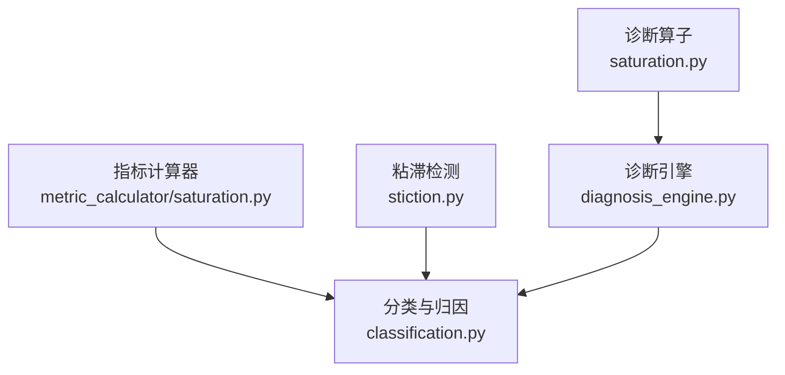
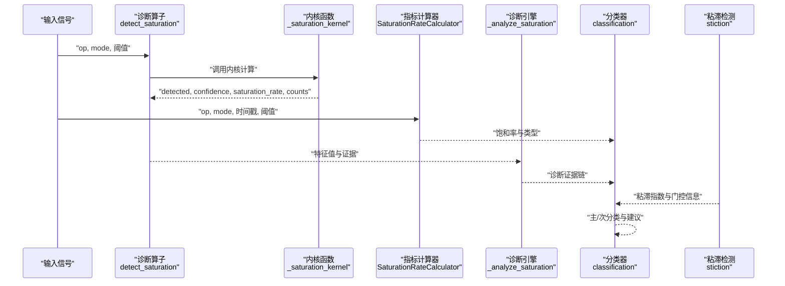
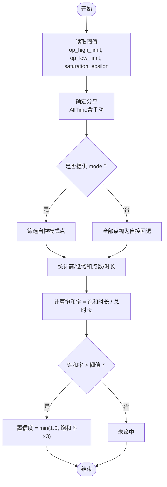
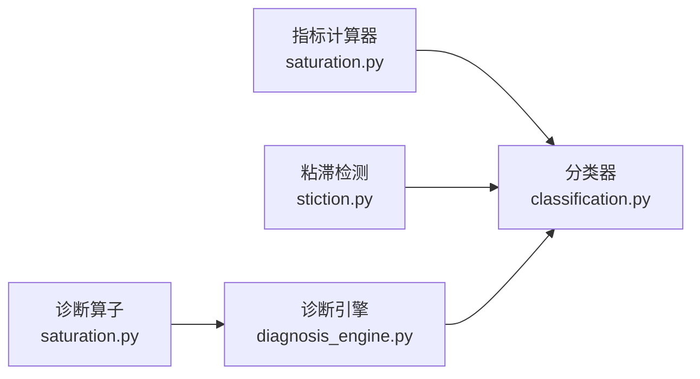

# 饱和检测算子

<cite>
**本文引用的文件**
- [backend/app/services/diagnosis_operators/saturation.py](file://backend/app/services/diagnosis_operators/saturation.py)
- [backend/app/services/metric_calculator/saturation.py](file://backend/app/services/metric_calculator/saturation.py)
- [backend/app/tasks/diagnosis_engine.py](file://backend/app/tasks/diagnosis_engine.py)
- [backend/app/services/diagnosis_operators/classification.py](file://backend/app/services/diagnosis_operators/classification.py)
- [backend/app/services/metric_calculator/stiction.py](file://backend/app/services/metric_calculator/stiction.py)
- [backend/tests/test_metric_calculator/test_saturation.py](file://backend/tests/test_metric_calculator/test_saturation.py)
- [backend/tests/test_diagnosis_engine.py](file://backend/tests/test_diagnosis_engine.py)
</cite>

## 目录
1. [简介](#简介)
2. [项目结构](#项目结构)
3. [核心组件](#核心组件)
4. [架构总览](#架构总览)
5. [详细组件分析](#详细组件分析)
6. [依赖关系分析](#依赖关系分析)
7. [性能考虑](#性能考虑)
8. [故障排查指南](#故障排查指南)
9. [结论](#结论)
10. [附录](#附录)

## 简介
本技术文档围绕“饱和检测算子”展开，聚焦执行器饱和状态识别、饱和程度量化、不同类型饱和的检测算法、对控制性能的影响评估、饱和恢复过程分析，以及与阀门粘滞的区别与关联。实现层面基于工程限位（OP 输出）贴限的时长占比进行判定，严格对齐国标 GB/T 44693.2-2024 附录 F.3 口径：以自控模式下的饱和时长为分子、评估时段总时长为分母计算饱和率，并以阈值触发诊断告警与后续分类建议。

## 项目结构
与饱和检测相关的代码主要分布在以下位置：
- 诊断算子层：提供可复用的 OP 输出饱和检测算子，封装输入校验、阈值解析、内核计算与结果包装。
- 指标计算层：提供饱和率指标计算器，按时间加权统计高/低饱和时长并输出类型与明细。
- 诊断引擎层：复用或等价实现饱和检测内核，将结果注入诊断证据链与可视化数据。
- 分类与联动：当饱和率极高时参与主分类决策（阀容量不足/积分饱和方向），并与阀门粘滞检测形成复合故障识别。

图表来源
- [backend/app/services/diagnosis_operators/saturation.py:119-168](file://backend/app/services/diagnosis_operators/saturation.py#L119-L168)
- [backend/app/services/metric_calculator/saturation.py:40-133](file://backend/app/services/metric_calculator/saturation.py#L40-L133)
- [backend/app/tasks/diagnosis_engine.py:2502-2553](file://backend/app/tasks/diagnosis_engine.py#L2502-L2553)
- [backend/app/services/diagnosis_operators/classification.py:270-282](file://backend/app/services/diagnosis_operators/classification.py#L270-L282)
- [backend/app/services/metric_calculator/stiction.py:73-130](file://backend/app/services/metric_calculator/stiction.py#L73-L130)

章节来源
- [backend/app/services/diagnosis_operators/saturation.py:1-169](file://backend/app/services/diagnosis_operators/saturation.py#L1-L169)
- [backend/app/services/metric_calculator/saturation.py:1-189](file://backend/app/services/metric_calculator/saturation.py#L1-L189)
- [backend/app/tasks/diagnosis_engine.py:2502-2553](file://backend/app/tasks/diagnosis_engine.py#L2502-L2553)
- [backend/app/services/diagnosis_operators/classification.py:270-282](file://backend/app/services/diagnosis_operators/classification.py#L270-L282)
- [backend/app/services/metric_calculator/stiction.py:73-130](file://backend/app/services/metric_calculator/stiction.py#L73-L130)

## 核心组件
- 诊断算子 detect_saturation：负责接收 op/mode 信号与阈值配置，调用内核计算饱和率，输出检测结果、置信度与证据项。
- 指标计算器 SaturationRateCalculator：按时间加权统计高/低饱和时长，输出饱和率与类型（HIGH/LOW/BOTH/NONE）。
- 诊断引擎 _analyze_saturation：等价内核实现，用于统一诊断流程中的饱和特征提取与可视化数据保存。
- 分类器 classification：在饱和率极高时触发阀容量不足/积分饱和方向的归因与建议。
- 粘滞检测 stiction：通过极限环门控、滞后补偿与椭圆拟合识别阀门粘滞，与饱和检测互补。

章节来源
- [backend/app/services/diagnosis_operators/saturation.py:28-116](file://backend/app/services/diagnosis_operators/saturation.py#L28-L116)
- [backend/app/services/metric_calculator/saturation.py:52-133](file://backend/app/services/metric_calculator/saturation.py#L52-L133)
- [backend/app/tasks/diagnosis_engine.py:2502-2553](file://backend/app/tasks/diagnosis_engine.py#L2502-L2553)
- [backend/app/services/diagnosis_operators/classification.py:270-282](file://backend/app/services/diagnosis_operators/classification.py#L270-L282)
- [backend/app/services/metric_calculator/stiction.py:73-130](file://backend/app/services/metric_calculator/stiction.py#L73-L130)

## 架构总览
下图展示从输入信号到诊断输出的关键路径：诊断算子与指标计算器分别完成点级与时段级的饱和统计；诊断引擎聚合特征并生成证据；分类器结合其他算子结果给出主/次分类与建议；粘滞检测作为独立分支提供阀门机械问题识别。

图表来源
- [backend/app/services/diagnosis_operators/saturation.py:119-168](file://backend/app/services/diagnosis_operators/saturation.py#L119-L168)
- [backend/app/services/metric_calculator/saturation.py:52-133](file://backend/app/services/metric_calculator/saturation.py#L52-L133)
- [backend/app/tasks/diagnosis_engine.py:2502-2553](file://backend/app/tasks/diagnosis_engine.py#L2502-L2553)
- [backend/app/services/diagnosis_operators/classification.py:270-282](file://backend/app/services/diagnosis_operators/classification.py#L270-L282)
- [backend/app/services/metric_calculator/stiction.py:73-130](file://backend/app/services/metric_calculator/stiction.py#L73-L130)

## 详细组件分析

### 执行器饱和状态识别
- OP 限幅检测：使用工程限位（默认 0~100%）与容差 epsilon（默认 2%）定义贴限区间，统计 OP 处于高限或低限的点数/时长。
- 积分饱和判断：仅计入自控模式（AUTO/CAS/REMOTE/APC）下的饱和时长，手动模式不计入分子但计入分母，避免误判。
- 输出钳位分析：区分高限饱和与低限饱和，支持混合饱和（同时存在高/低饱和）的类型判定。

图表来源
- [backend/app/services/diagnosis_operators/saturation.py:56-116](file://backend/app/services/diagnosis_operators/saturation.py#L56-L116)
- [backend/app/services/metric_calculator/saturation.py:72-107](file://backend/app/services/metric_calculator/saturation.py#L72-L107)
- [backend/app/tasks/diagnosis_engine.py:2502-2553](file://backend/app/tasks/diagnosis_engine.py#L2502-L2553)

章节来源
- [backend/app/services/diagnosis_operators/saturation.py:28-116](file://backend/app/services/diagnosis_operators/saturation.py#L28-L116)
- [backend/app/services/metric_calculator/saturation.py:52-133](file://backend/app/services/metric_calculator/saturation.py#L52-L133)
- [backend/app/tasks/diagnosis_engine.py:2502-2553](file://backend/app/tasks/diagnosis_engine.py#L2502-L2553)

### 饱和程度量化方法
- 饱和时间占比：以自控模式下贴限时长占评估时段总时长的比例表示，单位百分比。
- 饱和深度统计：通过高/低饱和时长细分，反映正向/反向饱和强度分布。
- 饱和频率分析：在诊断引擎中记录高/低饱和点数，便于趋势分析与事件频次统计。

章节来源
- [backend/app/services/metric_calculator/saturation.py:84-133](file://backend/app/services/metric_calculator/saturation.py#L84-L133)
- [backend/app/tasks/diagnosis_engine.py:1440-1465](file://backend/app/tasks/diagnosis_engine.py#L1440-L1465)
- [backend/tests/test_metric_calculator/test_saturation.py:31-58](file://backend/tests/test_metric_calculator/test_saturation.py#L31-L58)

### 不同类型饱和的检测算法
- 硬饱和（硬性限幅）：OP 达到或超过工程限位附近（含 epsilon 容差）即计为饱和，适用于执行器物理限制场景。
- 软饱和（渐近限制）：当前实现以绝对工程限位为准；若需模拟软饱和，可通过增大 epsilon 或调整上限/下限近似处理。
- 正向饱和 vs 反向饱和：通过高/低饱和时长分别统计，支持 BOTH/HIGH/LOW/NONE 类型输出。

章节来源
- [backend/app/services/diagnosis_operators/saturation.py:77-107](file://backend/app/services/diagnosis_operators/saturation.py#L77-L107)
- [backend/app/services/metric_calculator/saturation.py:100-108](file://backend/app/services/metric_calculator/saturation.py#L100-L108)
- [backend/app/services/metric_calculator/saturation.py:148-158](file://backend/app/services/metric_calculator/saturation.py#L148-L158)

### 饱和对控制性能的影响评估
- 调节时间延长：饱和期间控制器无法有效减小偏差，导致响应变慢。
- 超调量增加：去饱和阶段可能产生较大反向动作，引发超调。
- 稳定性下降：长期饱和易诱发极限环或耦合振荡，降低回路鲁棒性。
- 综合评分影响：饱和率作为重要指标参与有效自控率与整体绩效评估。

章节来源
- [backend/app/services/diagnosis_operators/classification.py:270-282](file://backend/app/services/diagnosis_operators/classification.py#L270-L282)
- [backend/app/services/metric_calculator/saturation.py:1-19](file://backend/app/services/metric_calculator/saturation.py#L1-L19)

### 饱和恢复过程分析
- 去饱和时间：指从贴限回到中间区间的持续时间，可通过时间序列分段统计。
- 恢复轨迹：观察去饱和阶段的 OP 变化速率与 PV 响应，评估二次振荡风险。
- 二次振荡抑制：若检测到极限环且粘滞指数较高，应优先排查阀门机械问题与参数整定。

章节来源
- [backend/app/services/metric_calculator/stiction.py:109-130](file://backend/app/services/metric_calculator/stiction.py#L109-L130)
- [backend/app/services/metric_calculator/stiction.py:135-188](file://backend/app/services/metric_calculator/stiction.py#L135-L188)

### 与阀门粘滞的区别和关联
- 区别：
  - 饱和主要反映执行器输出被限幅（控制侧能力受限）。
  - 粘滞反映阀门机械特性导致的非线性摩擦（机械侧问题）。
- 关联：
  - 两者常共存：粘滞可能导致频繁贴限，饱和也可能掩盖粘滞特征。
  - 联合诊断：先通过极限环门控与椭圆拟合识别粘滞，再结合饱和率判断是否存在阀容量不足或积分饱和。

章节来源
- [backend/app/services/metric_calculator/stiction.py:1-27](file://backend/app/services/metric_calculator/stiction.py#L1-L27)
- [backend/app/services/metric_calculator/stiction.py:109-130](file://backend/app/services/metric_calculator/stiction.py#L109-L130)
- [backend/app/services/diagnosis_operators/classification.py:270-282](file://backend/app/services/diagnosis_operators/classification.py#L270-L282)

## 依赖关系分析
- 诊断算子依赖模式常量与基础算子框架，输出结构化结果与证据。
- 指标计算器依赖自动模式集合与采样间隔，按时间加权计算饱和率。
- 诊断引擎复用内核逻辑，确保诊断流程一致性与可视化数据完整性。
- 分类器依赖各算子结果，按优先级生成主/次分类与建议。
- 粘滞检测依赖振荡门控与互相关滞后估计，与饱和检测形成互补。

图表来源
- [backend/app/services/diagnosis_operators/saturation.py:119-168](file://backend/app/services/diagnosis_operators/saturation.py#L119-L168)
- [backend/app/services/metric_calculator/saturation.py:40-133](file://backend/app/services/metric_calculator/saturation.py#L40-L133)
- [backend/app/tasks/diagnosis_engine.py:2502-2553](file://backend/app/tasks/diagnosis_engine.py#L2502-L2553)
- [backend/app/services/diagnosis_operators/classification.py:270-282](file://backend/app/services/diagnosis_operators/classification.py#L270-L282)
- [backend/app/services/metric_calculator/stiction.py:73-130](file://backend/app/services/metric_calculator/stiction.py#L73-L130)

章节来源
- [backend/app/services/diagnosis_operators/saturation.py:119-168](file://backend/app/services/diagnosis_operators/saturation.py#L119-L168)
- [backend/app/services/metric_calculator/saturation.py:40-133](file://backend/app/services/metric_calculator/saturation.py#L40-L133)
- [backend/app/tasks/diagnosis_engine.py:2502-2553](file://backend/app/tasks/diagnosis_engine.py#L2502-L2553)
- [backend/app/services/diagnosis_operators/classification.py:270-282](file://backend/app/services/diagnosis_operators/classification.py#L270-L282)
- [backend/app/services/metric_calculator/stiction.py:73-130](file://backend/app/services/metric_calculator/stiction.py#L73-L130)

## 性能考虑
- 数据长度要求：诊断算子要求至少 16 个 OP 样本；指标计算器要求至少 2 个点与有效时间戳。
- 数组长度不一致：采用最小长度截断，避免索引越界。
- 异常处理：内核捕获异常并返回安全默认值，保证诊断流程稳定。
- 计算复杂度：点级统计 O(n)，时间加权统计 O(n)，适合在线或批量处理。

章节来源
- [backend/app/services/diagnosis_operators/saturation.py:143-149](file://backend/app/services/diagnosis_operators/saturation.py#L143-L149)
- [backend/app/services/metric_calculator/saturation.py:69-77](file://backend/app/services/metric_calculator/saturation.py#L69-L77)
- [backend/app/services/diagnosis_operators/saturation.py:108-116](file://backend/app/services/diagnosis_operators/saturation.py#L108-L116)

## 故障排查指南
- 空数据或数据不足：返回未检测或 INCONCLUSIVE，检查输入信号与采样间隔。
- 手动模式占比过高：饱和率为 0%，确认是否为有效自控窗口。
- 解析失败：OP 坏值不计入饱和分子，检查数据质量与清洗策略。
- 数组长度不齐：按最短数组截断，确认时间戳与信号对齐。
- 粘滞与饱和并存：优先排查阀门机械问题，再评估控制器参数与阀容量。

章节来源
- [backend/tests/test_metric_calculator/test_saturation.py:77-129](file://backend/tests/test_metric_calculator/test_saturation.py#L77-L129)
- [backend/app/services/metric_calculator/saturation.py:69-83](file://backend/app/services/metric_calculator/saturation.py#L69-L83)
- [backend/app/services/metric_calculator/saturation.py:96-103](file://backend/app/services/metric_calculator/saturation.py#L96-L103)
- [backend/app/services/metric_calculator/stiction.py:109-130](file://backend/app/services/metric_calculator/stiction.py#L109-L130)

## 结论
饱和检测算子以工程限位与容差为基础，严格对齐国标口径，提供点级与时段级两种统计视角，支持正向/反向饱和类型区分，并与阀门粘滞检测形成互补。通过诊断引擎与分类器的联动，可在现场快速定位阀容量不足或积分饱和问题，并为整定与设备维护提供依据。

## 附录

### 饱和检测参数配置建议
- 工程限位：根据实际执行器范围设置 op_high_limit 与 op_low_limit。
- 容差 epsilon：默认 2%，可根据噪声水平与分辨率调整；液位回路可适当放宽。
- 最小样本：确保至少 16 个 OP 样本；指标计算需有效时间戳与足够点数。
- 模式信号：务必提供 mode 信号以准确区分自控与手动模式。

章节来源
- [backend/app/services/diagnosis_operators/saturation.py:133-137](file://backend/app/services/diagnosis_operators/saturation.py#L133-L137)
- [backend/app/services/metric_calculator/saturation.py:136-145](file://backend/app/services/metric_calculator/saturation.py#L136-L145)
- [backend/tests/test_diagnosis_engine.py:1002-1037](file://backend/tests/test_diagnosis_engine.py#L1002-L1037)

### 现场调试经验
- 先验证模式信号与时间戳对齐，再启用饱和检测。
- 逐步调整 epsilon，观察饱和类型与比率变化，避免过度敏感。
- 若饱和率高且粘滞指数高，优先检查阀门机械状态与执行器选型。
- 对于长时间手动工况，饱和率应为 0%，无需误报。

章节来源
- [backend/app/services/metric_calculator/saturation.py:69-83](file://backend/app/services/metric_calculator/saturation.py#L69-L83)
- [backend/app/services/metric_calculator/stiction.py:109-130](file://backend/app/services/metric_calculator/stiction.py#L109-L130)
- [backend/app/services/diagnosis_operators/classification.py:270-282](file://backend/app/services/diagnosis_operators/classification.py#L270-L282)