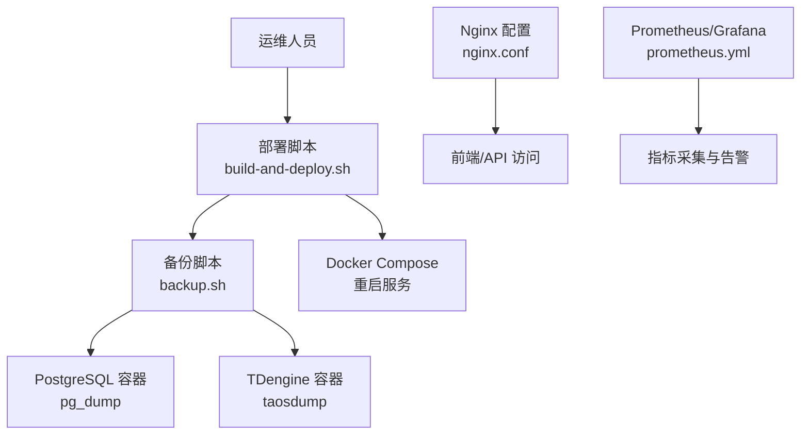
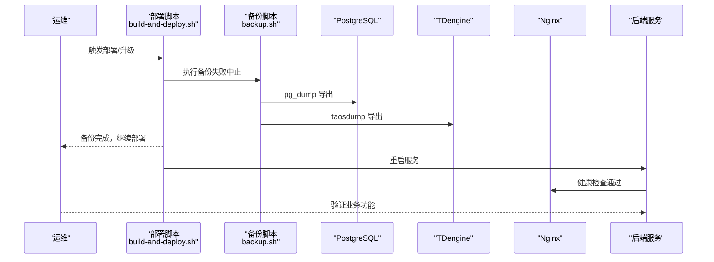
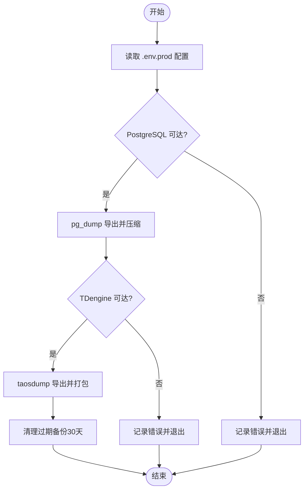
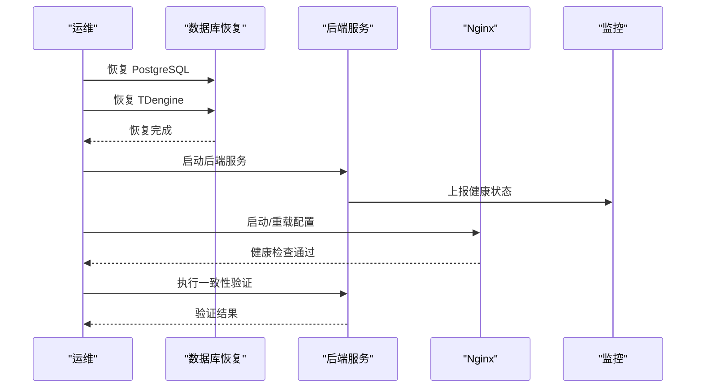
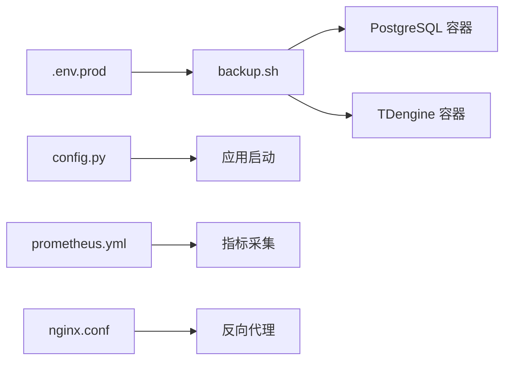

# 备份恢复

<cite>
**本文引用的文件**
- [deploy/backup.sh](file://deploy/backup.sh)
- [deploy/build-and-deploy.sh](file://deploy/build-and-deploy.sh)
- [deploy/deploy-on-server.sh](file://deploy/deploy-on-server.sh)
- [deploy/nginx.conf](file://deploy/nginx.conf)
- [deploy/prometheus/prometheus.yml](file://deploy/prometheus/prometheus.yml)
- [deploy/grafana/provisioning/datasources/prometheus.yml](file://deploy/grafana/provisioning/datasources/prometheus.yml)
- [backend/app/core/config.py](file://backend/app/core/config.py)
- [backend/app/services/datasource_config.py](file://backend/app/services/datasource_config.py)
</cite>

## 目录
1. [简介](#简介)
2. [项目结构](#项目结构)
3. [核心组件](#核心组件)
4. [架构总览](#架构总览)
5. [详细组件分析](#详细组件分析)
6. [依赖关系分析](#依赖关系分析)
7. [性能考虑](#性能考虑)
8. [故障排查指南](#故障排查指南)
9. [结论](#结论)
10. [附录](#附录)

## 简介
本文件为 CLPM-MVP 系统制定全面的备份与恢复策略，覆盖数据库（PostgreSQL、TDengine）全量与增量备份、配置（应用、Nginx、监控）版本管理、灾难恢复流程、存储策略、备份验证方法以及自动化脚本与定时任务。目标是确保在数据丢失或系统故障时，能够快速、安全地恢复服务并保证数据一致性。

## 项目结构
CLPM 的备份与恢复能力主要分布在部署脚本与应用配置中：
- 备份脚本：deploy/backup.sh 实现 PostgreSQL 与 TDengine 的全量备份与过期清理。
- 部署集成：deploy/build-and-deploy.sh 在升级前自动触发备份，失败即中止部署，避免无回滚数据的变更。
- 环境校验：deploy/deploy-on-server.sh 强制要求 .env.prod 中的关键密码项存在，保障备份与运行所需凭据齐全。
- 配置管理：backend/app/core/config.py 集中定义应用与数据库连接参数；backend/app/services/datasource_config.py 提供运行时可配置的键值说明。
- 反向代理与监控：deploy/nginx.conf 提供前端与 API 的反向代理与健康检查；deploy/prometheus/prometheus.yml 与 Grafana 数据源配置用于监控采集。

图表来源
- [deploy/build-and-deploy.sh:485-506](file://deploy/build-and-deploy.sh#L485-L506)
- [deploy/backup.sh:25-100](file://deploy/backup.sh#L25-L100)
- [deploy/nginx.conf:56-139](file://deploy/nginx.conf#L56-L139)
- [deploy/prometheus/prometheus.yml:1-31](file://deploy/prometheus/prometheus.yml#L1-L31)

章节来源
- [deploy/backup.sh:1-122](file://deploy/backup.sh#L1-L122)
- [deploy/build-and-deploy.sh:485-506](file://deploy/build-and-deploy.sh#L485-L506)
- [deploy/deploy-on-server.sh:504-538](file://deploy/deploy-on-server.sh#L504-L538)
- [deploy/nginx.conf:1-167](file://deploy/nginx.conf#L1-L167)
- [deploy/prometheus/prometheus.yml:1-31](file://deploy/prometheus/prometheus.yml#L1-L31)
- [backend/app/core/config.py:1-225](file://backend/app/core/config.py#L1-L225)
- [backend/app/services/datasource_config.py:84-113](file://backend/app/services/datasource_config.py#L84-L113)

## 核心组件
- 数据库备份
  - PostgreSQL：通过 pg_dump 导出 SQL 并压缩归档。
  - TDengine：通过 taosdump 导出数据库内容并打包。
- 配置备份
  - 应用配置：环境变量与运行时配置键（sys_config）。
  - Nginx 配置：HTTP/HTTPS 模板与反向代理规则。
  - 监控配置：Prometheus 抓取目标与 Grafana 数据源。
- 自动化与调度
  - 部署前自动备份：升级前执行 backup.sh，失败则中止部署。
  - 定时任务：建议通过 crontab 每日执行全量备份。
- 存储与保留策略
  - 本地目录按时间戳分目录存放，默认保留最近 30 天。
  - 可扩展至远程/云存储（见附录）。

章节来源
- [deploy/backup.sh:25-100](file://deploy/backup.sh#L25-L100)
- [deploy/backup.sh:102-122](file://deploy/backup.sh#L102-L122)
- [deploy/build-and-deploy.sh:485-506](file://deploy/build-and-deploy.sh#L485-L506)
- [deploy/deploy-on-server.sh:504-538](file://deploy/deploy-on-server.sh#L504-L538)
- [backend/app/core/config.py:25-124](file://backend/app/core/config.py#L25-L124)
- [backend/app/services/datasource_config.py:84-113](file://backend/app/services/datasource_config.py#L84-L113)

## 架构总览
备份恢复的整体流程如下：
- 备份阶段：部署前或定时任务触发 backup.sh，分别对 PostgreSQL 与 TDengine 进行全量导出，生成带时间戳的备份目录，并清理过期备份。
- 恢复阶段：先恢复 PostgreSQL，再恢复 TDengine，随后重启服务并验证数据一致性与健康状态。
- 配置管理：应用配置、Nginx 配置与监控配置纳入版本控制，确保可追溯与可回滚。
- 监控与告警：Prometheus 采集后端指标，Grafana 展示仪表盘，异常时触发告警。

图表来源
- [deploy/build-and-deploy.sh:485-506](file://deploy/build-and-deploy.sh#L485-L506)
- [deploy/backup.sh:25-100](file://deploy/backup.sh#L25-L100)
- [deploy/nginx.conf:128-132](file://deploy/nginx.conf#L128-L132)

## 详细组件分析

### 数据库备份方案
- PostgreSQL 全量备份
  - 使用 pg_dump 以 no-owner/no-privileges/clean/if-exists 模式导出，兼容恢复场景。
  - 输出为 gzip 压缩的 SQL 文件，便于存储与传输。
  - 通过 docker exec 在 postgres 容器内执行，避免宿主机权限问题。
- TDengine 数据导出
  - 使用 taosdump 导出指定数据库，需携带 root 凭据，认证失败会硬失败，防止“静默跳过”。
  - 导出目录需在容器内预创建，完成后拷贝到宿主机并打包为 tar.gz。
- 增量备份策略
  - 当前脚本为全量备份；增量可通过 PostgreSQL WAL 归档与 TDengine 快照机制扩展（见附录）。
  - 若采用增量，需结合保留策略与恢复顺序，确保 RPO/RTO 满足业务需求。

图表来源
- [deploy/backup.sh:31-100](file://deploy/backup.sh#L31-L100)
- [deploy/backup.sh:102-122](file://deploy/backup.sh#L102-L122)

章节来源
- [deploy/backup.sh:25-100](file://deploy/backup.sh#L25-L100)
- [deploy/backup.sh:102-122](file://deploy/backup.sh#L102-L122)

### 配置文件备份与版本管理
- 应用配置
  - 环境变量：POSTGRES_*、TDENGINE_*、REDIS_*、JWT_SECRET_KEY 等由 backend/app/core/config.py 集中管理，生产环境强制校验安全性。
  - 运行时配置：datasource_config.py 提供 sys_config 键值描述，支持动态调整网络模式、实时数据开关等。
- Nginx 配置
  - nginx.conf 包含 HTTP/HTTPS 模板、WebSocket 升级、静态资源缓存与安全响应头，应纳入版本控制。
- 监控配置
  - prometheus.yml 定义抓取目标与评估间隔；Grafana 数据源配置指向 Prometheus，便于可视化。
- 版本管理建议
  - 将 .env.prod 模板、nginx.conf、prometheus.yml、grafana provisioning 文件纳入 Git 管理，变更走 PR 审核。
  - 敏感信息（密码、密钥）不入库，仅保存占位符与说明。

章节来源
- [backend/app/core/config.py:25-124](file://backend/app/core/config.py#L25-L124)
- [backend/app/core/config.py:185-225](file://backend/app/core/config.py#L185-L225)
- [backend/app/services/datasource_config.py:84-113](file://backend/app/services/datasource_config.py#L84-L113)
- [deploy/nginx.conf:1-167](file://deploy/nginx.conf#L1-L167)
- [deploy/prometheus/prometheus.yml:1-31](file://deploy/prometheus/prometheus.yml#L1-L31)
- [deploy/grafana/provisioning/datasources/prometheus.yml:1-10](file://deploy/grafana/provisioning/datasources/prometheus.yml#L1-L10)

### 灾难恢复流程
- 数据恢复步骤
  - 恢复 PostgreSQL：导入 pg_dump 生成的 SQL 文件，确保 schema 与数据完整。
  - 恢复 TDengine：解压 taosdump 导出的数据并导入，验证表结构与数据完整性。
- 服务重启顺序
  - 先启动数据库（PostgreSQL、TDengine），再启动后端服务，最后启动 Nginx。
  - 通过健康检查端点确认服务就绪。
- 数据一致性验证
  - 校验关键表的行数与时间范围。
  - 检查实时数据链路是否恢复（SignalR/WebSocket）。
  - 运行基础业务用例，确保端到端可用。

图表来源
- [deploy/backup.sh:25-100](file://deploy/backup.sh#L25-L100)
- [deploy/nginx.conf:128-132](file://deploy/nginx.conf#L128-L132)

### 备份存储策略
- 本地存储
  - 默认备份目录为用户主目录下 backups/clpm，按时间戳分目录，保留最近 30 天。
- 远程备份
  - 可在 backup.sh 中增加 rsync/scp 推送至远端服务器，或调用对象存储 SDK（如 AWS S3、阿里云 OSS）。
- 云存储集成
  - 建议在备份成功后异步上传至云存储，并启用生命周期策略自动清理旧备份。
  - 注意加密传输与访问控制，确保备份数据安全。

章节来源
- [deploy/backup.sh:16-22](file://deploy/backup.sh#L16-L22)
- [deploy/backup.sh:102-122](file://deploy/backup.sh#L102-L122)

### 备份验证方法
- 完整性检查
  - 校验 pg_dump SQL 文件大小与行数统计。
  - 校验 tdengine 导出包结构与表清单。
- 恢复测试
  - 在隔离环境执行恢复流程，验证服务启动与数据可用性。
- 性能影响评估
  - 监控备份期间的 CPU、I/O、网络占用，评估对业务的影响。
  - 调整备份窗口与并发度，避免高峰时段执行。

章节来源
- [deploy/backup.sh:61-62](file://deploy/backup.sh#L61-L62)
- [deploy/backup.sh:94-95](file://deploy/backup.sh#L94-L95)

### 备份自动化脚本与定时任务
- 定时任务
  - 建议通过 crontab 每日凌晨执行 backup.sh，日志输出至 /var/log/clpm-backup.log。
- 部署前自动备份
  - build-and-deploy.sh 在升级前调用 backup.sh，失败则中止部署，确保有回滚数据。
- 脚本健壮性
  - 严格错误处理（set -euo pipefail），关键步骤失败立即退出，避免部分备份导致误判。

章节来源
- [deploy/backup.sh:6-8](file://deploy/backup.sh#L6-L8)
- [deploy/build-and-deploy.sh:485-506](file://deploy/build-and-deploy.sh#L485-L506)

## 依赖关系分析
- 备份脚本依赖
  - Docker 与 Compose：用于在容器内执行 pg_dump 与 taosdump。
  - .env.prod：提供数据库与 TDengine 的凭据与连接信息。
- 应用配置依赖
  - backend/app/core/config.py：集中管理环境变量与连接参数，生产环境强制安全校验。
  - backend/app/services/datasource_config.py：提供运行时配置键值说明，支持动态调整。
- 监控依赖
  - deploy/prometheus/prometheus.yml：定义抓取目标与评估间隔。
  - Grafana 数据源配置：指向 Prometheus，便于可视化。

图表来源
- [deploy/backup.sh:25-100](file://deploy/backup.sh#L25-L100)
- [backend/app/core/config.py:25-124](file://backend/app/core/config.py#L25-L124)
- [deploy/prometheus/prometheus.yml:1-31](file://deploy/prometheus/prometheus.yml#L1-L31)
- [deploy/nginx.conf:56-139](file://deploy/nginx.conf#L56-L139)

章节来源
- [deploy/backup.sh:25-100](file://deploy/backup.sh#L25-L100)
- [backend/app/core/config.py:25-124](file://backend/app/core/config.py#L25-L124)
- [deploy/prometheus/prometheus.yml:1-31](file://deploy/prometheus/prometheus.yml#L1-L31)
- [deploy/nginx.conf:56-139](file://deploy/nginx.conf#L56-L139)

## 性能考虑
- 备份窗口
  - 选择低峰时段执行全量备份，减少对业务的影响。
- I/O 优化
  - 使用 SSD 存储备份目录，提升读写速度。
  - 合理设置压缩级别，平衡 CPU 与 I/O。
- 并发控制
  - 避免同时执行多个大型备份任务，防止资源争用。
- 监控与告警
  - 通过 Prometheus 监控备份任务的耗时与失败率，设置阈值告警。

[本节为通用指导，无需特定文件引用]

## 故障排查指南
- 常见错误
  - TDengine 认证失败：检查 .env.prod 中的 TDENGINE_PASSWORD 与容器 TAOS_ROOT_PASSWORD 是否一致。
  - 数据库不可达：确认容器运行状态与网络连通性。
  - 部署前备份失败：查看备份日志，修复后重试部署。
- 排查步骤
  - 检查容器状态：docker ps | grep -E "postgres|tdengine"。
  - 验证凭据：核对 .env.prod 中的关键密码项。
  - 查看日志：/var/log/clpm-backup.log 与部署日志。

章节来源
- [deploy/backup.sh:75-100](file://deploy/backup.sh#L75-L100)
- [deploy/deploy-on-server.sh:504-538](file://deploy/deploy-on-server.sh#L504-L538)

## 结论
CLPM-MVP 的备份恢复体系以 deploy/backup.sh 为核心，结合部署前自动备份与严格的凭据校验，确保数据可回滚与服务可恢复。通过版本化配置与监控告警，进一步提升系统的可靠性与可观测性。建议在生产环境中完善增量备份与云存储集成，以满足更严格的 RPO/RTO 要求。

[本节为总结，无需特定文件引用]

## 附录
- 增量备份建议
  - PostgreSQL：启用 WAL 归档，结合 pg_basebackup 实现物理备份与时间点恢复。
  - TDengine：利用快照与分区策略，定期导出增量数据。
- 云存储集成示例
  - 在 backup.sh 末尾增加对象存储上传命令（如 aws s3 cp），并设置生命周期策略。
- 监控增强
  - 在 prometheus.yml 中添加备份任务指标，便于追踪成功率与耗时。

[本节为概念性内容，无需特定文件引用]