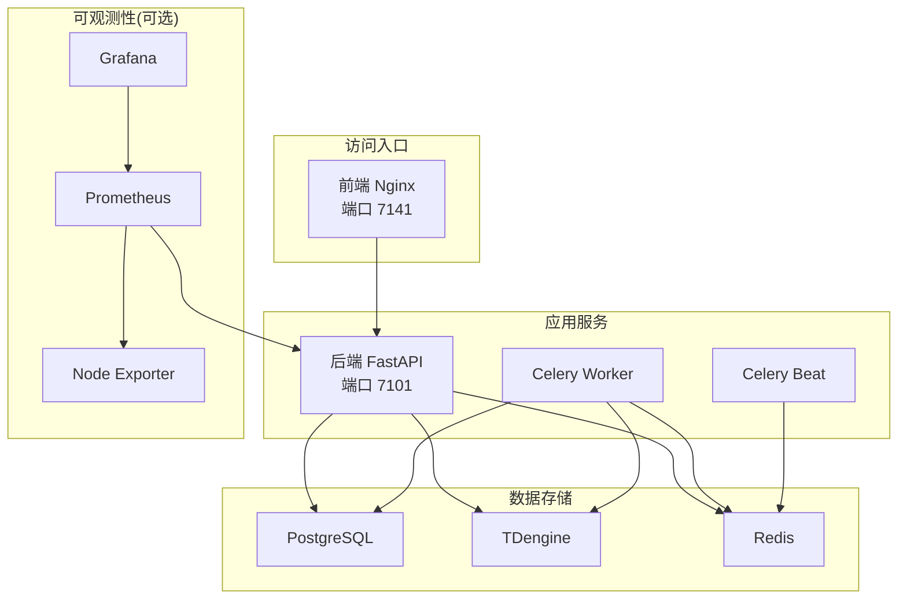
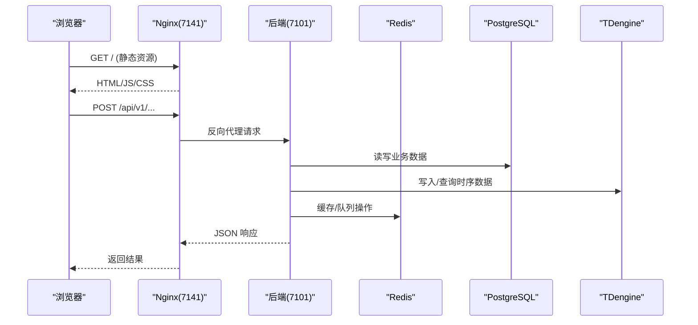
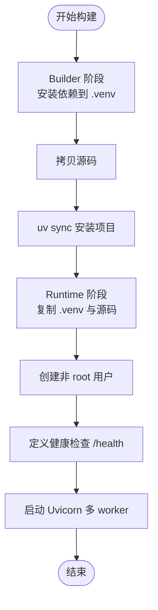
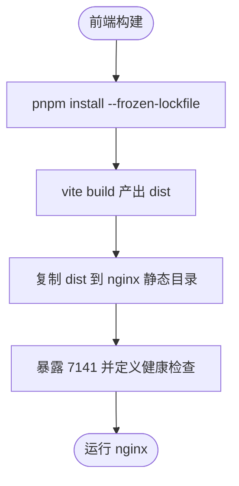
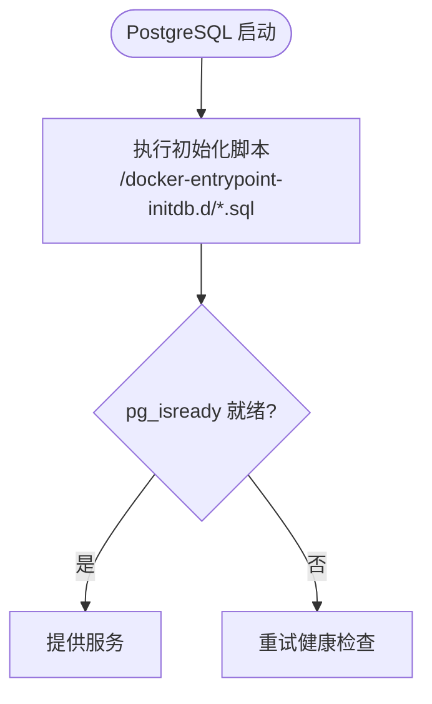
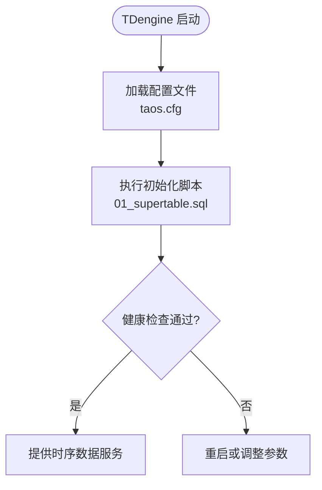
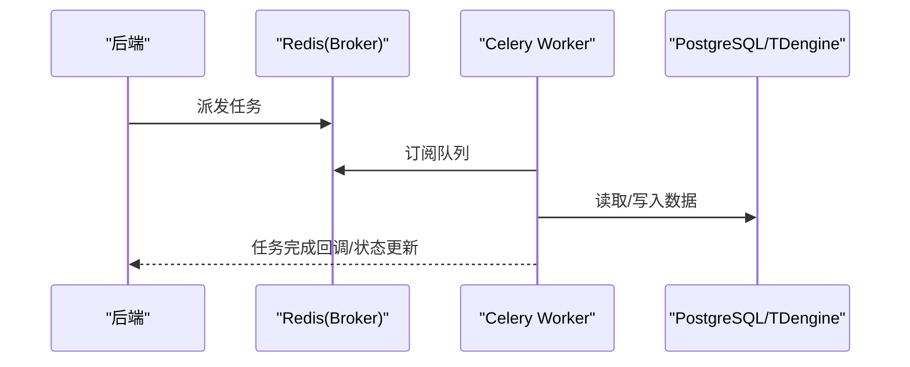
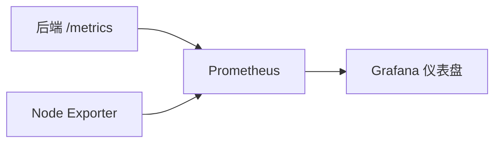
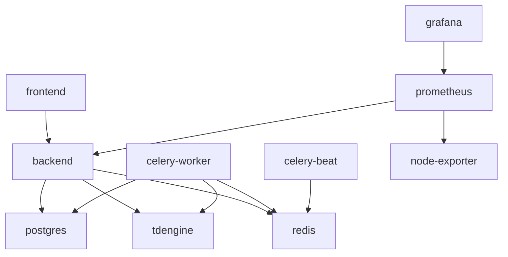

# 容器化部署

<cite>
**本文引用的文件**
- [Dockerfile.backend](file://Dockerfile.backend)
- [Dockerfile.frontend](file://Dockerfile.frontend)
- [docker-compose.prod.yml](file://docker-compose.prod.yml)
- [deploy/docker/docker-compose.dev.yml](file://deploy/docker/docker-compose.dev.yml)
- [deploy/nginx.conf](file://deploy/nginx.conf)
- [db/postgresql/01_schema.sql](file://db/postgresql/01_schema.sql)
- [db/tdengine/01_supertable.sql](file://db/tdengine/01_supertable.sql)
- [deploy/docker/tdengine/taos.cfg](file://deploy/docker/tdengine/taos.cfg)
- [deploy/prometheus/prometheus.yml](file://deploy/prometheus/prometheus.yml)
</cite>

## 目录
1. [简介](#简介)
2. [项目结构](#项目结构)
3. [核心组件](#核心组件)
4. [架构总览](#架构总览)
5. [详细组件分析](#详细组件分析)
6. [依赖关系分析](#依赖关系分析)
7. [性能与资源调优](#性能与资源调优)
8. [故障排查指南](#故障排查指南)
9. [结论](#结论)
10. [附录](#附录)

## 简介
本文件面向 CLPM-MVP 系统的容器化部署，覆盖镜像构建、Compose 编排、TDengine 时序数据库配置、开发与生产环境差异、健康检查、日志收集、资源限制与安全加固等主题。目标是帮助读者在不深入源码的前提下，完成从本地开发到生产上线的完整部署与运维。

## 项目结构
CLPM-MVP 采用前后端分离与多服务编排：
- 后端：FastAPI + Uvicorn，Celery Worker/Beat 异步任务
- 前端：Nginx 托管静态资源并反向代理 API
- 数据层：PostgreSQL（业务关系型数据）、TDengine（高频时序数据）、Redis（缓存/消息）
- 可观测性：Prometheus + Grafana（可选 profile）

图表来源
- [docker-compose.prod.yml:16-48](file://docker-compose.prod.yml#L16-L48)
- [docker-compose.prod.yml:63-98](file://docker-compose.prod.yml#L63-L98)
- [docker-compose.prod.yml:104-135](file://docker-compose.prod.yml#L104-L135)
- [docker-compose.prod.yml:141-185](file://docker-compose.prod.yml#L141-L185)
- [docker-compose.prod.yml:191-231](file://docker-compose.prod.yml#L191-L231)
- [docker-compose.prod.yml:236-323](file://docker-compose.prod.yml#L236-L323)
- [docker-compose.prod.yml:361-465](file://docker-compose.prod.yml#L361-L465)

章节来源
- [docker-compose.prod.yml:1-489](file://docker-compose.prod.yml#L1-L489)
- [deploy/docker/docker-compose.dev.yml:1-146](file://deploy/docker/docker-compose.dev.yml#L1-L146)

## 核心组件
- 后端镜像（多阶段构建）：Builder 安装 Python 依赖，Runtime 仅包含运行所需二进制与非 root 用户，暴露 /health 健康检查
- 前端镜像（多阶段构建）：Builder 使用 pnpm 构建静态资源，Runtime 使用 nginx 托管并反向代理 API
- 数据服务：PostgreSQL 初始化脚本挂载；TDengine 通过超级表承载回路秒级时序数据；Redis 启用 AOF 持久化
- 任务系统：Celery Worker/Beat 通过 Redis 作为 Broker，Worker 并发度可调
- 可观测性：Prometheus 抓取后端指标与节点指标，Grafana 预置仪表盘

章节来源
- [Dockerfile.backend:1-84](file://Dockerfile.backend#L1-L84)
- [Dockerfile.frontend:1-72](file://Dockerfile.frontend#L1-L72)
- [db/postgresql/01_schema.sql:1-200](file://db/postgresql/01_schema.sql#L1-L200)
- [db/tdengine/01_supertable.sql:1-84](file://db/tdengine/01_supertable.sql#L1-L84)
- [docker-compose.prod.yml:191-231](file://docker-compose.prod.yml#L191-L231)
- [docker-compose.prod.yml:236-323](file://docker-compose.prod.yml#L236-L323)
- [deploy/prometheus/prometheus.yml:1-31](file://deploy/prometheus/prometheus.yml#L1-L31)

## 架构总览
下图展示了生产环境的请求路径与服务依赖关系，包括健康检查、日志轮转与资源限制。

图表来源
- [deploy/nginx.conf:56-139](file://deploy/nginx.conf#L56-L139)
- [docker-compose.prod.yml:16-48](file://docker-compose.prod.yml#L16-L48)
- [docker-compose.prod.yml:104-135](file://docker-compose.prod.yml#L104-L135)
- [docker-compose.prod.yml:141-185](file://docker-compose.prod.yml#L141-L185)
- [docker-compose.prod.yml:191-231](file://docker-compose.prod.yml#L191-L231)

## 详细组件分析

### 后端镜像构建（多阶段优化）
- Builder 阶段：基于 python:3.12-slim，安装 uv，先拷贝依赖描述文件以利用 Docker 层缓存，冻结安装依赖，再拷贝源码安装项目
- Runtime 阶段：仅复制 .venv、app、alembic 等必要内容，创建非 root 用户 clpm，暴露 7101，定义 HEALTHCHECK 调用 /health，启动命令为 Uvicorn 多 worker
- 安全与可维护性：非 root 运行、最小化运行时依赖、版本号注入 APP_VERSION

图表来源
- [Dockerfile.backend:1-84](file://Dockerfile.backend#L1-L84)

章节来源
- [Dockerfile.backend:1-84](file://Dockerfile.backend#L1-L84)

### 前端镜像构建（静态资源与反向代理）
- Builder 阶段：node:22-slim，启用 corepack/pnpm，安装依赖并构建 web-antd 产物至 dist
- Runtime 阶段：nginx:alpine，复制构建产物，保留默认 fallback 配置，暴露 7141，定义健康检查
- 反向代理：通过 Compose volume 挂载 deploy/nginx.conf，实现 /api/v1 反向代理到后端

图表来源
- [Dockerfile.frontend:1-72](file://Dockerfile.frontend#L1-L72)
- [docker-compose.prod.yml:63-98](file://docker-compose.prod.yml#L63-L98)
- [deploy/nginx.conf:56-139](file://deploy/nginx.conf#L56-L139)

章节来源
- [Dockerfile.frontend:1-72](file://Dockerfile.frontend#L1-L72)
- [docker-compose.prod.yml:63-98](file://docker-compose.prod.yml#L63-L98)
- [deploy/nginx.conf:1-167](file://deploy/nginx.conf#L1-L167)

### PostgreSQL 容器化与初始化
- 使用 postgres:16-alpine，挂载初始化 SQL 到 /docker-entrypoint-initdb.d，首次启动自动建库建表
- 健康检查使用 pg_isready，卷持久化数据
- 业务模型涵盖用户、工厂节点、回路台账、标签注册等，遵循存算分离原则

图表来源
- [docker-compose.prod.yml:104-135](file://docker-compose.prod.yml#L104-L135)
- [db/postgresql/01_schema.sql:1-200](file://db/postgresql/01_schema.sql#L1-L200)

章节来源
- [docker-compose.prod.yml:104-135](file://docker-compose.prod.yml#L104-L135)
- [db/postgresql/01_schema.sql:1-200](file://db/postgresql/01_schema.sql#L1-L200)

### TDengine 容器化与参数调优
- 镜像 tdengine/tdengine:3.3.6.6，环境变量设置 TAOS_FQDN 与密码，挂载数据卷与初始化脚本
- 健康检查通过 taos CLI 查询 SERVER_VERSION
- 关键参数：queryBufferSize=4096MB，避免长时间查询内存耗尽；monitor 开启监控
- 超级表 st_loop_data 承载回路秒级时序数据，按 loop_id/unit_id 分片

图表来源
- [docker-compose.prod.yml:141-185](file://docker-compose.prod.yml#L141-L185)
- [deploy/docker/tdengine/taos.cfg:60-65](file://deploy/docker/tdengine/taos.cfg#L60-L65)
- [deploy/docker/tdengine/taos.cfg:185-192](file://deploy/docker/tdengine/taos.cfg#L185-L192)
- [db/tdengine/01_supertable.sql:1-84](file://db/tdengine/01_supertable.sql#L1-L84)

章节来源
- [docker-compose.prod.yml:141-185](file://docker-compose.prod.yml#L141-L185)
- [deploy/docker/tdengine/taos.cfg:1-192](file://deploy/docker/tdengine/taos.cfg#L1-L192)
- [db/tdengine/01_supertable.sql:1-84](file://db/tdengine/01_supertable.sql#L1-L84)

### Celery Worker/Beat 编排
- Worker：基于后端镜像，command 指定 celery worker，并发度由 CELERY_WORKER_CONCURRENCY 控制，默认 8
- Beat：调度定时任务，健康检查通过 /proc/1/cmdline 检测进程名
- 依赖 Redis 与 PostgreSQL/TDengine，资源限制与日志轮转已配置

图表来源
- [docker-compose.prod.yml:236-323](file://docker-compose.prod.yml#L236-L323)
- [docker-compose.prod.yml:191-231](file://docker-compose.prod.yml#L191-L231)

章节来源
- [docker-compose.prod.yml:236-323](file://docker-compose.prod.yml#L236-L323)
- [docker-compose.prod.yml:191-231](file://docker-compose.prod.yml#L191-L231)

### 可观测性（Prometheus/Grafana/Node Exporter）
- Prometheus 抓取后端 /metrics 与 node-exporter，规则文件 alerts.yml
- Grafana 预置仪表盘与数据源，默认账号 admin，可通过 SSH 隧道访问
- Node Exporter 采集宿主机磁盘/CPU/内存指标

图表来源
- [deploy/prometheus/prometheus.yml:1-31](file://deploy/prometheus/prometheus.yml#L1-L31)
- [docker-compose.prod.yml:361-465](file://docker-compose.prod.yml#L361-L465)

章节来源
- [deploy/prometheus/prometheus.yml:1-31](file://deploy/prometheus/prometheus.yml#L1-L31)
- [docker-compose.prod.yml:361-465](file://docker-compose.prod.yml#L361-L465)

## 依赖关系分析
- 服务间依赖：frontend -> backend -> {postgres, redis, tdengine}；celery-worker/beat -> redis/postgres/tdengine
- 网络：统一 bridge 网络 clpm-net，服务间通过容器名通信
- 数据持久化：PostgreSQL、TDengine、Redis、Prometheus、Grafana 均使用命名卷

图表来源
- [docker-compose.prod.yml:16-48](file://docker-compose.prod.yml#L16-L48)
- [docker-compose.prod.yml:63-98](file://docker-compose.prod.yml#L63-L98)
- [docker-compose.prod.yml:104-135](file://docker-compose.prod.yml#L104-L135)
- [docker-compose.prod.yml:141-185](file://docker-compose.prod.yml#L141-L185)
- [docker-compose.prod.yml:191-231](file://docker-compose.prod.yml#L191-L231)
- [docker-compose.prod.yml:236-323](file://docker-compose.prod.yml#L236-L323)
- [docker-compose.prod.yml:361-465](file://docker-compose.prod.yml#L361-L465)

章节来源
- [docker-compose.prod.yml:1-489](file://docker-compose.prod.yml#L1-L489)

## 性能与资源调优
- 后端 Uvicorn 多 worker：默认 4 worker，充分利用多核 CPU
- Celery Worker 并发：CELERY_WORKER_CONCURRENCY 默认 8，可按宿主机核数调整；对应内存与 CPU 限制已配置
- TDengine 查询缓冲：queryBufferSize 设置为 4096MB，避免长时间查询内存耗尽
- 前端 Nginx：gzip 压缩、静态资源缓存策略、WebSocket 升级支持、动态 DNS 解析避免 502
- 资源限制：各服务在 compose 中设置 memory/cpus 上限，防止单点占用过多资源
- 日志轮转：json-file 驱动，max-size/max-file 控制日志大小与数量

章节来源
- [Dockerfile.backend:78-84](file://Dockerfile.backend#L78-L84)
- [docker-compose.prod.yml:44-55](file://docker-compose.prod.yml#L44-L55)
- [docker-compose.prod.yml:244-278](file://docker-compose.prod.yml#L244-L278)
- [deploy/docker/tdengine/taos.cfg:60-65](file://deploy/docker/tdengine/taos.cfg#L60-L65)
- [deploy/nginx.conf:25-46](file://deploy/nginx.conf#L25-L46)
- [deploy/nginx.conf:47-52](file://deploy/nginx.conf#L47-L52)
- [deploy/nginx.conf:75-98](file://deploy/nginx.conf#L75-L98)

## 故障排查指南
- 后端健康检查失败：检查 /health 端点可达性与依赖服务（PostgreSQL/Redis/TDengine）是否就绪
- 前端 502：确认 Nginx 动态 DNS 解析与后端容器存活，必要时重启后端服务
- TDengine 启动崩溃循环：若已修改密码且卷存在，需确保标记文件正确挂载以避免重复改密失败
- Celery Worker 不健康：通过 inspect ping 检测 worker 存活；调整并发度与资源限制
- Prometheus/Grafana 不可用：检查 profiles 是否启用 monitoring，SSH 隧道映射端口是否正确
- 日志定位：使用 docker compose logs -f 查看各服务日志，关注 json-file 轮转后的历史日志

章节来源
- [docker-compose.prod.yml:37-42](file://docker-compose.prod.yml#L37-L42)
- [docker-compose.prod.yml:78-83](file://docker-compose.prod.yml#L78-L83)
- [docker-compose.prod.yml:163-172](file://docker-compose.prod.yml#L163-L172)
- [docker-compose.prod.yml:256-262](file://docker-compose.prod.yml#L256-L262)
- [docker-compose.prod.yml:375-380](file://docker-compose.prod.yml#L375-L380)
- [docker-compose.prod.yml:419-424](file://docker-compose.prod.yml#L419-L424)

## 结论
CLPM-MVP 的容器化方案通过多阶段镜像构建、Compose 编排与健康检查、合理的资源限制与日志轮转，实现了从开发到生产的平滑过渡。TDengine 的参数调优保障了时序数据的稳定写入与查询。结合 Prometheus/Grafana 的可观测性能力，便于在生产环境中进行监控与告警。建议在生产环境进一步启用 HTTPS、完善备份策略与权限管控。

## 附录
- 开发环境与生产环境差异要点
  - 端口规划：开发环境使用 171xx 段，避免与原项目冲突
  - 数据初始化：开发环境直接挂载初始化脚本，生产环境同样通过 entrypoint 执行
  - 安全加固：生产环境关闭外部端口暴露，仅通过 Nginx 反代；启用 CSP、安全响应头
  - 调试配置：开发环境可启用 mock-data-server，生产环境禁用
  - 资源限制：生产环境对每个服务设置 memory/cpus 上限，避免资源争抢
  - 可观测性：生产环境可选启用 monitoring profile，通过 SSH 隧道访问 Prometheus/Grafana

章节来源
- [deploy/docker/docker-compose.dev.yml:1-146](file://deploy/docker/docker-compose.dev.yml#L1-L146)
- [docker-compose.prod.yml:1-489](file://docker-compose.prod.yml#L1-L489)
- [deploy/nginx.conf:63-74](file://deploy/nginx.conf#L63-L74)
- [deploy/prometheus/prometheus.yml:1-31](file://deploy/prometheus/prometheus.yml#L1-L31)