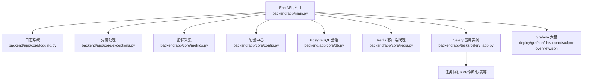
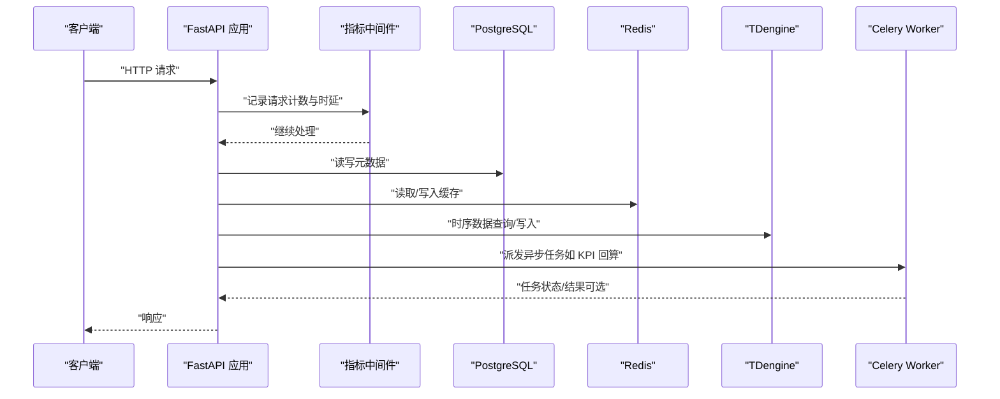
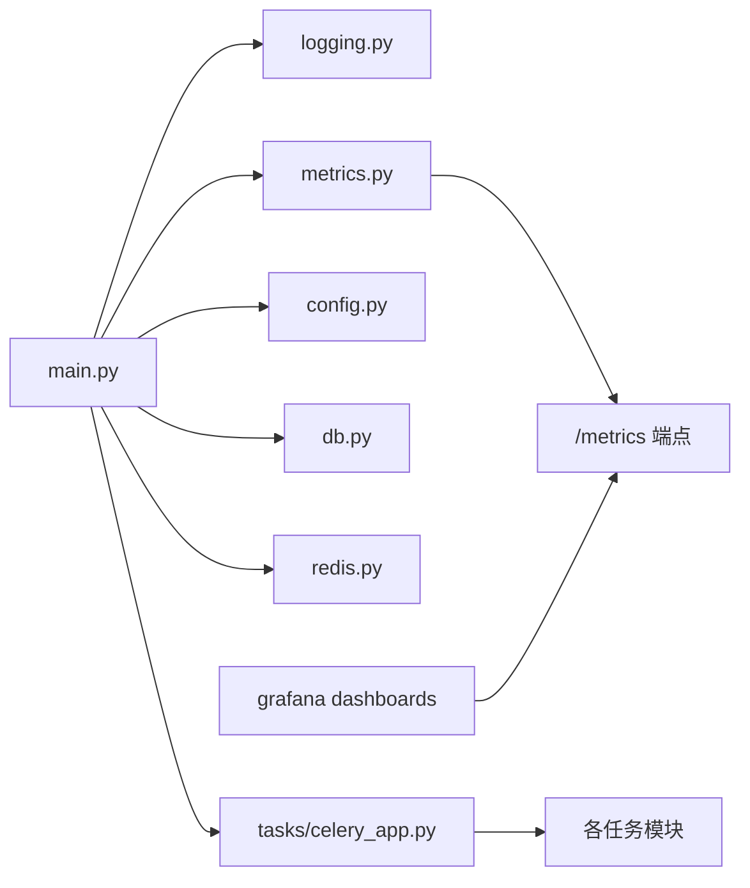

# 故障排查

<cite>
**本文引用的文件**   
- [TROUBLESHOOTING.md](file://TROUBLESHOOTING.md)
- [backend/app/main.py](file://backend/app/main.py)
- [backend/app/core/logging.py](file://backend/app/core/logging.py)
- [backend/app/core/metrics.py](file://backend/app/core/metrics.py)
- [backend/app/core/config.py](file://backend/app/core/config.py)
- [backend/app/core/exceptions.py](file://backend/app/core/exceptions.py)
- [backend/app/tasks/celery_app.py](file://backend/app/tasks/celery_app.py)
- [backend/app/core/db.py](file://backend/app/core/db.py)
- [backend/app/core/redis.py](file://backend/app/core/redis.py)
- [backend/app/api/v1/endpoints/dataplanner.py](file://backend/app/api/v1/endpoints/dataplanner.py)
- [deploy/grafana/dashboards/clpm-overview.json](file://deploy/grafana/dashboards/clpm-overview.json)
- [scripts/monitor_db_connections.py](file://scripts/monitor_db_connections.py)
</cite>

## 目录
1. [简介](#简介)
2. [项目结构](#项目结构)
3. [核心组件](#核心组件)
4. [架构总览](#架构总览)
5. [详细组件分析](#详细组件分析)
6. [依赖关系分析](#依赖关系分析)
7. [性能注意事项](#性能注意事项)
8. [故障排查指南](#故障排查指南)
9. [结论](#结论)
10. [附录：工具与命令参考](#附录工具与命令参考)

## 简介
本指南面向 CLPM-MVP 系统的运维与研发人员，聚焦常见故障类型（启动失败、连接超时、性能问题、内存泄漏）的诊断方法；系统化说明日志分析方法（后端日志、前端错误追踪、数据库慢查询）；解读监控指标（CPU、内存、磁盘 I/O、网络带宽）；定位性能瓶颈（接口响应时间、数据库查询优化、缓存命中率提升）；并给出典型故障案例与常用排查工具命令。内容基于仓库中后端服务、任务调度、数据库与缓存、监控与日志等实现进行梳理。

## 项目结构
CLPM-MVP 后端采用 FastAPI 应用 + Celery 异步任务 + PostgreSQL/TDengine/Redis 多存储的架构。关键入口在应用主模块中完成日志、中间件、路由、健康检查、Celery Beat/Worker 子进程管理与看门狗自愈；任务通过 Celery 配置注册到 worker/beat；数据访问通过 SQLAlchemy 异步引擎与 Redis 代理客户端；Prometheus 指标通过中间件采集并在 /metrics 暴露；Grafana 提供可视化大盘。

**图示来源**
- [backend/app/main.py:610-762](file://backend/app/main.py#L610-L762)
- [backend/app/core/logging.py:117-145](file://backend/app/core/logging.py#L117-L145)
- [backend/app/core/metrics.py:95-151](file://backend/app/core/metrics.py#L95-L151)
- [backend/app/core/config.py:25-221](file://backend/app/core/config.py#L25-L221)
- [backend/app/core/db.py:16-42](file://backend/app/core/db.py#L16-L42)
- [backend/app/core/redis.py:29-137](file://backend/app/core/redis.py#L29-L137)
- [backend/app/tasks/celery_app.py:24-84](file://backend/app/tasks/celery_app.py#L24-L84)
- [deploy/grafana/dashboards/clpm-overview.json:1-628](file://deploy/grafana/dashboards/clpm-overview.json#L1-L628)

**章节来源**
- [backend/app/main.py:610-762](file://backend/app/main.py#L610-L762)
- [backend/app/core/logging.py:117-145](file://backend/app/core/logging.py#L117-L145)
- [backend/app/core/metrics.py:95-151](file://backend/app/core/metrics.py#L95-L151)
- [backend/app/core/config.py:25-221](file://backend/app/core/config.py#L25-L221)
- [backend/app/core/db.py:16-42](file://backend/app/core/db.py#L16-L42)
- [backend/app/core/redis.py:29-137](file://backend/app/core/redis.py#L29-L137)
- [backend/app/tasks/celery_app.py:24-84](file://backend/app/tasks/celery_app.py#L24-L84)
- [deploy/grafana/dashboards/clpm-overview.json:1-628](file://deploy/grafana/dashboards/clpm-overview.json#L1-L628)

## 核心组件
- 应用生命周期与进程管理：FastAPI lifespan 自动拉起 Celery Beat/Worker，内置看门狗检测缺失并补拉起；优雅关闭时按进程组终止，避免孤儿进程。
- 日志与可观测性：结构化 JSON 日志输出，DEBUG 模式人类可读；请求级 request_id 注入；敏感信息脱敏；Prometheus 指标中间件采集 HTTP 请求计数与时延、Celery 任务计数、PG 活跃连接数。
- 配置与安全：集中配置项涵盖 PG/TDengine/Redis/Celery/SignalR/远端 API 等；生产环境强制校验密钥与密码强度。
- 数据库与缓存：SQLAlchemy 异步引擎使用 NullPool 避免跨 event loop 复用连接导致 Future 绑定错误；Redis 客户端代理自动检测 event loop 变化并重建客户端，兼容 Celery 任务场景。
- 任务调度：Celery 配置包含任务超时保护、持久化调度、死信队列、结果过期策略、worker 子进程回收策略等。

**章节来源**
- [backend/app/main.py:320-591](file://backend/app/main.py#L320-L591)
- [backend/app/core/logging.py:1-151](file://backend/app/core/logging.py#L1-L151)
- [backend/app/core/metrics.py:1-163](file://backend/app/core/metrics.py#L1-L163)
- [backend/app/core/config.py:1-225](file://backend/app/core/config.py#L1-L225)
- [backend/app/core/db.py:1-64](file://backend/app/core/db.py#L1-L64)
- [backend/app/core/redis.py:1-151](file://backend/app/core/redis.py#L1-L151)
- [backend/app/tasks/celery_app.py:1-251](file://backend/app/tasks/celery_app.py#L1-L251)

## 架构总览
下图展示从请求进入 FastAPI，经中间件记录指标，调用业务逻辑，访问数据库与缓存，以及后台任务由 Celery 执行的整体流程。

**图示来源**
- [backend/app/core/metrics.py:95-151](file://backend/app/core/metrics.py#L95-L151)
- [backend/app/core/db.py:16-42](file://backend/app/core/db.py#L16-L42)
- [backend/app/core/redis.py:29-137](file://backend/app/core/redis.py#L29-L137)
- [backend/app/tasks/celery_app.py:24-84](file://backend/app/tasks/celery_app.py#L24-L84)

## 详细组件分析

### 启动失败排查
- 症状：后端未监听端口、Celery Beat/Worker 未运行、定时任务不触发。
- 关键点：
  - 应用启动会预载数据源配置与模块启用状态；测试模式跳过 Celery/DB 预载。
  - 非生产环境下自动启动 Celery Beat/Worker，并通过看门狗周期性探活，缺失则补拉起。
  - 生产环境由独立容器接管，lifespan 不再启动 Beat/Worker。
  - 进程退出钩子（atexit + signal handler）兜底清理遗留 Celery 进程，避免孤儿。
- 建议步骤：
  - 检查环境变量 ENV 是否为 production；确认是否由 docker-compose 独立管理 Celery。
  - 查看 logs 目录下 celery-beat.log、celery-worker.log 是否有启动或重启日志。
  - 使用 pgrep 匹配项目标签确认是否存在遗留进程；必要时执行全局清理。
  - 若热重载导致子进程被误杀，观察看门狗是否自动补拉起。

**章节来源**
- [backend/app/main.py:301-338](file://backend/app/main.py#L301-L338)
- [backend/app/main.py:329-410](file://backend/app/main.py#L329-L410)
- [backend/app/main.py:457-527](file://backend/app/main.py#L457-L527)
- [backend/app/main.py:564-608](file://backend/app/main.py#L564-L608)
- [backend/app/main.py:765-800](file://backend/app/main.py#L765-L800)

### 连接超时排查
- 症状：远端历史数据 API 调用卡住、TDengine REST 写库停滞、SignalR 断线无消息。
- 关键点：
  - 远端 API 调用具备并发限制与熔断机制，连续失败达到阈值后打开熔断一段时间。
  - TDengine REST 连接显式设置超时，避免无限等待导致进度停滞。
  - SignalR 支持心跳间隔、连接建立超时、断线重连指数退避与数据停滞看门狗。
- 建议步骤：
  - 检查 REMOTE_API_MAX_CONCURRENCY、REMOTE_API_CIRCUIT_FAILURES、REMOTE_API_CIRCUIT_OPEN_SECONDS 配置。
  - 检查 TDENGINE_REST_TIMEOUT 与 TDENGINE_FLUSH_INTERVAL 是否合理。
  - 检查 SIGNALR_* 相关参数，关注断线重连与停滞超时。
  - 结合 Prometheus 指标 http_request_duration_seconds 与 celery_task_total 判断是否出现大量超时或失败。

**章节来源**
- [backend/app/core/config.py:81-124](file://backend/app/core/config.py#L81-L124)
- [backend/app/core/tdengine_native.py:71-86](file://backend/app/core/tdengine_native.py#L71-L86)
- [backend/tests/test_remote_api_guard.py:73-166](file://backend/tests/test_remote_api_guard.py#L73-L166)

### 性能问题排查
- 症状：接口响应慢、KPI 计算耗时高、节点聚合卡顿、缓存命中率低。
- 关键点：
  - Prometheus 中间件记录每个路由的请求计数与时延直方图，Grafana 大盘提供 QPS、P95 延迟、状态码分布、Celery 任务速率与成功率、DB 连接池使用数等视图。
  - Redis 缓存统计可通过 DataPlanner 接口获取 keys、命中率、内存占用与按标签分组情况。
  - 数据库连接使用 NullPool，单条 SQL 执行有 command_timeout 保护，避免慢查询挂死请求。
- 建议步骤：
  - 通过 Grafana 大盘定位慢接口（http_request_duration_seconds p95）。
  - 检查 Redis 命中率（keyspace_hits/keyspace_misses），必要时调整缓存策略或 key 设计。
  - 检查 PG 活跃连接数（pg_active_connections）与 db_pool_connections，评估连接压力。
  - 对热点接口进行压测与基准测试，识别算法或查询瓶颈。

**章节来源**
- [backend/app/core/metrics.py:57-87](file://backend/app/core/metrics.py#L57-L87)
- [backend/app/core/metrics.py:95-151](file://backend/app/core/metrics.py#L95-L151)
- [backend/app/api/v1/endpoints/dataplanner.py:348-379](file://backend/app/api/v1/endpoints/dataplanner.py#L348-L379)
- [backend/app/core/db.py:16-34](file://backend/app/core/db.py#L16-L34)
- [deploy/grafana/dashboards/clpm-overview.json:23-588](file://deploy/grafana/dashboards/clpm-overview.json#L23-L588)

### 内存泄漏排查
- 症状：Worker 长驻后内存只增不减、任务执行偶发崩溃、子进程频繁回收。
- 关键点：
  - Celery 配置 worker_max_tasks_per_child=50，每处理 50 个任务后重建子进程，抑制内存增长。
  - Redis 客户端代理在 event loop 变化时重建客户端，避免旧连接池残留。
  - 应用关闭时主动关闭 Redis 连接池与 PG 引擎。
- 建议步骤：
  - 观察 Celery Worker 日志中的任务执行与子进程回收情况。
  - 监控 Redis 内存使用（info memory）与连接池状态。
  - 结合 Prometheus 指标 celery_task_total 与 http_request_duration_seconds 判断是否存在异常堆积或慢任务。

**章节来源**
- [backend/app/tasks/celery_app.py:72-84](file://backend/app/tasks/celery_app.py#L72-L84)
- [backend/app/core/redis.py:29-137](file://backend/app/core/redis.py#L29-L137)
- [backend/app/core/redis.py:145-151](file://backend/app/core/redis.py#L145-L151)
- [backend/app/core/db.py:61-64](file://backend/app/core/db.py#L61-L64)

### 日志分析方法
- 后端日志：
  - DEBUG 模式输出人类可读行，非 DEBUG 输出 JSON 单行对象，便于外部管道收集。
  - 支持 request_id 上下文变量注入，便于跨模块追踪同一请求。
  - 敏感字段（password/token/Bearer/JWT）自动脱敏，避免泄露。
- 前端错误追踪：
  - 后端统一异常处理器返回标准错误体 {code, message, data}，前端可按 code 分类提示。
  - 参数校验失败在非 DEBUG 下返回通用提示，服务端日志保留完整校验详情用于排查。
- 数据库慢查询：
  - 使用脚本 monitor_db_connections.py 轮询 PG 连接与活动会话，辅助定位慢查询与连接风暴。
  - 结合 Prometheus 的 pg_active_connections 指标观察连接峰值。

**章节来源**
- [backend/app/core/logging.py:1-151](file://backend/app/core/logging.py#L1-L151)
- [backend/app/core/exceptions.py:122-187](file://backend/app/core/exceptions.py#L122-L187)
- [scripts/monitor_db_connections.py:196-226](file://scripts/monitor_db_connections.py#L196-L226)

### 监控指标解读
- CPU 使用率：通过系统监控（如 top、htop、systemd-cgtop）观察后端与 Worker 进程；结合 Celery 任务速率判断是否过载。
- 内存占用：监控 Python 进程 RSS；关注 Redis 内存使用（info memory）；观察 Celery 子进程回收频率。
- 磁盘 I/O：关注日志写入（logs 目录）、TDengine 写盘（REST flush 间隔）、PG WAL 与表空间增长。
- 网络带宽：观察 SignalR 连接与远端 API 调用量；结合 Prometheus 指标 http_requests_total 与 http_request_duration_seconds 评估吞吐与延迟。

**章节来源**
- [backend/app/core/metrics.py:57-87](file://backend/app/core/metrics.py#L57-L87)
- [backend/app/api/v1/endpoints/dataplanner.py:348-379](file://backend/app/api/v1/endpoints/dataplanner.py#L348-L379)
- [backend/app/core/config.py:41-55](file://backend/app/core/config.py#L41-L55)

### 性能瓶颈定位
- 接口响应时间分析：
  - 使用 Grafana 大盘的 HTTP 请求延迟 P95 面板定位慢接口。
  - 结合 Prometheus 指标 http_request_duration_seconds 的直方图分位值分析。
- 数据库查询优化：
  - 检查 PG 活跃连接数与慢查询；使用 command_timeout 防止挂死。
  - 利用批量递归 CTE 与聚合优化减少 N+1 查询。
- 缓存命中率提升：
  - 通过 DataPlanner 缓存统计接口观察命中率；调整缓存 key 与失效策略。
  - 针对高频读路径（如仪表盘概览）确保缓存命中率高。

**章节来源**
- [backend/app/core/db.py:16-34](file://backend/app/core/db.py#L16-L34)
- [backend/app/api/v1/endpoints/dataplanner.py:348-379](file://backend/app/api/v1/endpoints/dataplanner.py#L348-L379)
- [deploy/grafana/dashboards/clpm-overview.json:110-203](file://deploy/grafana/dashboards/clpm-overview.json#L110-L203)

### 典型故障案例
- 服务崩溃恢复：
  - 现象：uvicorn --reload 热重载导致 Celery 子进程被误杀，Beat/Worker 停摆。
  - 处理：看门狗检测到缺失后自动补拉起；必要时手动重启后端与 Worker。
- 数据不一致修复：
  - 现象：KPI 批量回填失败或进度停滞。
  - 处理：提交小规模重算任务验证 Celery group 并行与结果收集；检查 Worker 日志中的 Phase2 与子任务日志。
- 第三方服务异常处理：
  - 现象：远端历史数据 API 超时或不可用。
  - 处理：启用熔断与限流；观察重试与退避；必要时降级为本地缓存或空结果。

**章节来源**
- [TROUBLESHOOTING.md:11-34](file://TROUBLESHOOTING.md#L11-L34)
- [TROUBLESHOOTING.md:37-89](file://TROUBLESHOOTING.md#L37-L89)
- [TROUBLESHOOTING.md:140-160](file://TROUBLESHOOTING.md#L140-L160)
- [backend/app/main.py:564-608](file://backend/app/main.py#L564-L608)

## 依赖关系分析

**图示来源**
- [backend/app/main.py:610-762](file://backend/app/main.py#L610-L762)
- [backend/app/core/logging.py:117-145](file://backend/app/core/logging.py#L117-L145)
- [backend/app/core/metrics.py:95-151](file://backend/app/core/metrics.py#L95-L151)
- [backend/app/core/config.py:25-221](file://backend/app/core/config.py#L25-L221)
- [backend/app/core/db.py:16-42](file://backend/app/core/db.py#L16-L42)
- [backend/app/core/redis.py:29-137](file://backend/app/core/redis.py#L29-L137)
- [backend/app/tasks/celery_app.py:24-84](file://backend/app/tasks/celery_app.py#L24-L84)
- [deploy/grafana/dashboards/clpm-overview.json:1-628](file://deploy/grafana/dashboards/clpm-overview.json#L1-L628)

**章节来源**
- [backend/app/main.py:610-762](file://backend/app/main.py#L610-L762)
- [backend/app/core/metrics.py:95-151](file://backend/app/core/metrics.py#L95-L151)
- [backend/app/tasks/celery_app.py:24-84](file://backend/app/tasks/celery_app.py#L24-L84)
- [deploy/grafana/dashboards/clpm-overview.json:1-628](file://deploy/grafana/dashboards/clpm-overview.json#L1-L628)

## 性能注意事项
- 避免在 DEBUG 模式下开启过多框架日志（sqlalchemy/httpx/websockets 等），以免同步日志 I/O 拖慢事件循环。
- 合理使用 Celery 任务超时与软超时，防止长任务阻塞 Worker。
- 对热点接口启用缓存并监控命中率；对大数据量查询考虑分页与降采样。
- 监控 PG 活跃连接数与 TDengine 写盘频率，避免连接风暴与磁盘 I/O 瓶颈。

[本节为通用指导，无需特定文件来源]

## 故障排查指南
- 启动失败
  - 检查 ENV 与生产模式；确认 Celery Beat/Worker 是否由独立容器管理。
  - 查看 logs 目录下的 celery-beat.log 与 celery-worker.log。
  - 使用 pgrep 匹配项目标签，清理遗留进程；必要时重启后端与 Worker。
- 连接超时
  - 检查远端 API 并发与熔断配置；确认 TDengine REST 超时设置。
  - 检查 SignalR 心跳与重连参数；观察断线日志与停滞告警。
  - 结合 Prometheus 指标分析请求延迟与失败率。
- 性能问题
  - 通过 Grafana 大盘定位慢接口与高延迟时段。
  - 检查 Redis 命中率与内存占用；调整缓存策略。
  - 使用数据库连接监控脚本定位慢查询与连接峰值。
- 内存泄漏
  - 观察 Celery Worker 子进程回收频率；检查 Redis 客户端代理重建行为。
  - 监控进程 RSS 与 Redis 内存；必要时重启 Worker。

**章节来源**
- [backend/app/main.py:301-608](file://backend/app/main.py#L301-L608)
- [backend/app/core/config.py:81-124](file://backend/app/core/config.py#L81-L124)
- [backend/app/core/metrics.py:95-151](file://backend/app/core/metrics.py#L95-L151)
- [backend/app/api/v1/endpoints/dataplanner.py:348-379](file://backend/app/api/v1/endpoints/dataplanner.py#L348-L379)
- [scripts/monitor_db_connections.py:196-226](file://scripts/monitor_db_connections.py#L196-L226)

## 结论
CLPM-MVP 系统在启动、连接、性能与内存方面提供了完善的防护与可观测能力。通过日志结构化、指标采集、任务超时与熔断、缓存统计与 Grafana 可视化，能够快速定位与恢复常见故障。建议在生产环境中严格遵循配置安全校验、合理设置超时与熔断参数、持续监控关键指标，并结合本指南进行系统性排查与优化。

[本节为总结，无需特定文件来源]

## 附录：工具与命令参考
- 重启服务
  - 后端 API：使用 uvicorn 启动，端口 7101。
  - Celery Worker：使用 celery worker 启动，消费 default 与 dead_letter 队列。
  - 前端：使用 pnpm dev:antd 启动开发服务器。
- 查看日志
  - logs/celery-beat.log、logs/celery-worker.log。
  - 后端 stdout 日志（JSON 或人类可读）。
- 监控指标
  - /metrics 端点（仅内网白名单可访问）。
  - Grafana 大盘：HTTP 请求速率、延迟 P95、状态码分布、Celery 任务速率与成功率、DB 连接池使用数。
- 数据库连接监控
  - 使用 scripts/monitor_db_connections.py 轮询 PG 连接与活动会话，辅助定位慢查询。

**章节来源**
- [TROUBLESHOOTING.md:122-136](file://TROUBLESHOOTING.md#L122-L136)
- [backend/app/core/metrics.py:131-151](file://backend/app/core/metrics.py#L131-L151)
- [deploy/grafana/dashboards/clpm-overview.json:23-588](file://deploy/grafana/dashboards/clpm-overview.json#L23-L588)
- [scripts/monitor_db_connections.py:196-226](file://scripts/monitor_db_connections.py#L196-L226)