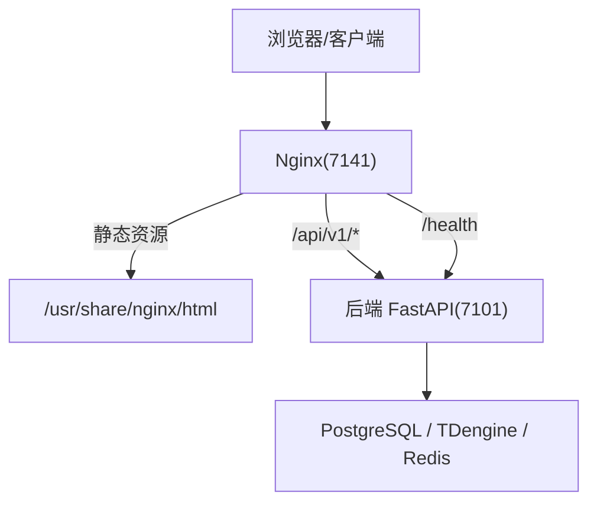
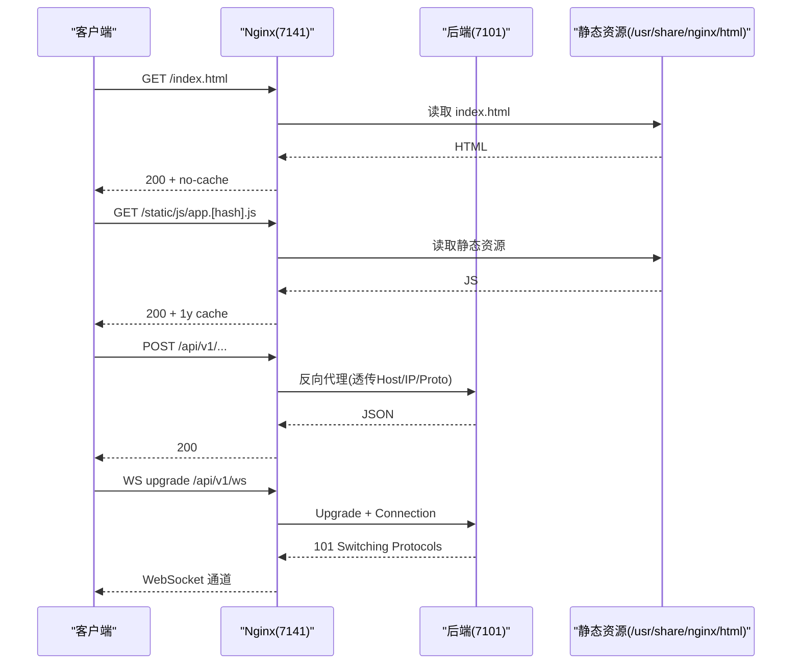
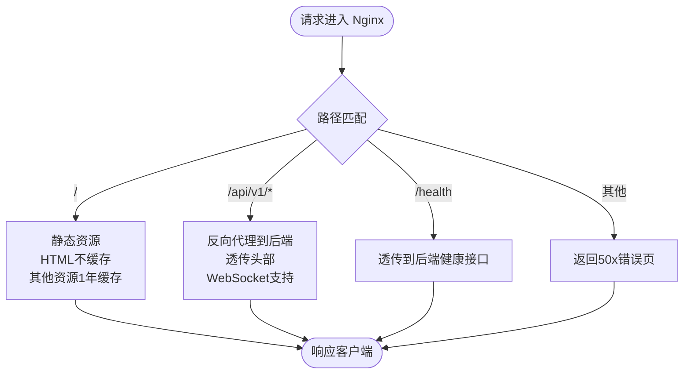
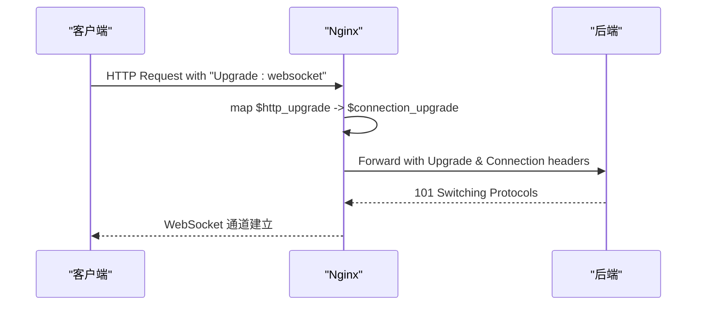
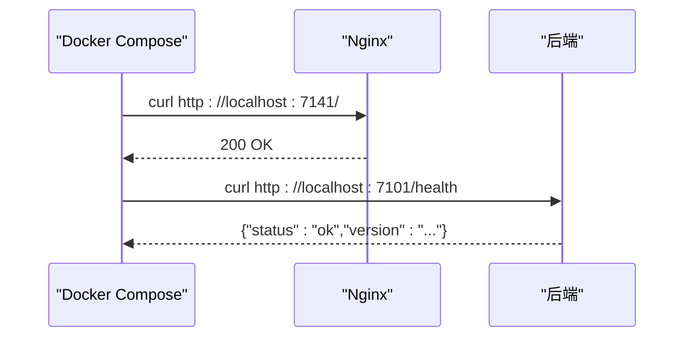
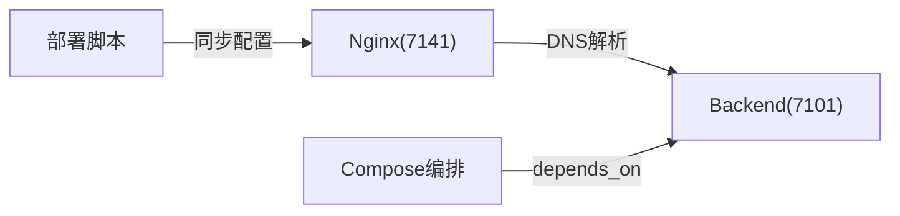

# Nginx反向代理配置

<cite>
**本文引用的文件**
- [deploy/nginx.conf](file://deploy/nginx.conf)
- [docker-compose.prod.yml](file://docker-compose.prod.yml)
- [Dockerfile.frontend](file://Dockerfile.frontend)
- [deploy/deploy.sh](file://deploy/deploy.sh)
- [deploy/build-and-deploy.sh](file://deploy/build-and-deploy.sh)
- [backend/app/api/v1/endpoints/health.py](file://backend/app/api/v1/endpoints/health.py)
</cite>

## 目录
1. [简介](#简介)
2. [项目结构](#项目结构)
3. [核心组件](#核心组件)
4. [架构总览](#架构总览)
5. [详细组件分析](#详细组件分析)
6. [依赖关系分析](#依赖关系分析)
7. [性能优化建议](#性能优化建议)
8. [安全加固措施](#安全加固措施)
9. [负载均衡与高可用](#负载均衡与高可用)
10. [配置验证与排障](#配置验证与排障)
11. [结论](#结论)

## 简介
本指南面向 CLPM-MVP 系统的生产部署，聚焦 Nginx 作为前端入口的反向代理配置。内容涵盖：前后端路由转发、WebSocket 支持、静态资源缓存策略；SSL/TLS 证书启用与安全头；多实例部署与健康检查；性能优化（gzip、缓存、连接池、超时）；访问控制与请求限制；以及配置验证与常见问题排查。所有说明均基于仓库内现有配置与脚本进行解读与扩展建议。

## 项目结构
CLPM-MVP 在生产环境通过 Docker Compose 编排运行，Nginx 以独立容器提供静态资源托管与反向代理，后端 API 仅暴露于容器网络，不直接对外暴露端口。关键文件与职责如下：
- deploy/nginx.conf：Nginx 主配置，包含 gzip、静态资源缓存、API 反向代理、WebSocket 升级、健康检查端点映射、错误页等。
- docker-compose.prod.yml：服务编排，定义 frontend（Nginx）、backend（FastAPI）、数据库、缓存、任务调度等服务的启动、端口映射、健康检查与日志轮转。
- Dockerfile.frontend：构建前端镜像，拷贝 Nginx 配置与静态资源，暴露 7141 端口并内置健康检查。
- deploy/deploy.sh 与 deploy/build-and-deploy.sh：部署与构建脚本，负责镜像构建、传输、加载、服务启停与健康检查。
- backend/app/api/v1/endpoints/health.py：后端健康检查接口实现，供 Nginx 与编排健康检查调用。

图表来源
- [docker-compose.prod.yml:63-98](file://docker-compose.prod.yml#L63-L98)
- [docker-compose.prod.yml:16-58](file://docker-compose.prod.yml#L16-L58)
- [deploy/nginx.conf:56-139](file://deploy/nginx.conf#L56-L139)

章节来源
- [docker-compose.prod.yml:63-98](file://docker-compose.prod.yml#L63-L98)
- [docker-compose.prod.yml:16-58](file://docker-compose.prod.yml#L16-L58)
- [deploy/nginx.conf:56-139](file://deploy/nginx.conf#L56-L139)
- [Dockerfile.frontend:53-69](file://Dockerfile.frontend#L53-L69)

## 核心组件
- Nginx 反向代理与静态资源托管
  - 监听 7141，根路径提供 SPA 静态资源，HTML 不缓存，带 hash 的静态资源长期缓存。
  - /api/v1/ 反向代理到后端容器 backend:7101，透传 Host、X-Real-IP、X-Forwarded-For、X-Forwarded-Proto。
  - WebSocket 升级：通过 map $http_upgrade 设置 Connection 头，proxy_set_header Upgrade 与 Connection。
  - 健康检查：/health 透传到后端健康接口。
  - 安全响应头：X-Frame-Options、X-Content-Type-Options、Referrer-Policy、CSP。
  - 动态 DNS：resolver 使用 Docker 内置 DNS，避免后端容器重启后 IP 变化导致 502。
- Docker Compose 编排
  - frontend 暴露 7141，挂载 nginx.conf 为只读卷。
  - backend 仅 expose 7101，不映射宿主机端口，确保仅通过 Nginx 访问。
  - 各服务具备 healthcheck 与日志轮转，资源限制合理。
- 构建与部署
  - Dockerfile.frontend 将 deploy/nginx.conf 复制到镜像中作为 fallback，并通过 compose volume 覆盖。
  - 部署脚本自动同步配置文件、加载镜像、执行健康检查，失败时回滚。

章节来源
- [deploy/nginx.conf:17-139](file://deploy/nginx.conf#L17-L139)
- [docker-compose.prod.yml:63-98](file://docker-compose.prod.yml#L63-L98)
- [docker-compose.prod.yml:16-58](file://docker-compose.prod.yml#L16-L58)
- [Dockerfile.frontend:53-69](file://Dockerfile.frontend#L53-L69)
- [deploy/build-and-deploy.sh:450-473](file://deploy/build-and-deploy.sh#L450-L473)

## 架构总览
Nginx 作为统一入口，承担以下职责：
- 静态资源托管与缓存策略（HTML 不缓存，其他静态资源长期缓存）。
- API 反向代理（/api/v1/），透传必要头部，支持 WebSocket。
- 健康检查端点（/health）透传到后端。
- 安全响应头与 CSP 防护。
- 动态 DNS 解析，提升后端容器重启后的可用性。

图表来源
- [deploy/nginx.conf:80-126](file://deploy/nginx.conf#L80-L126)
- [docker-compose.prod.yml:63-98](file://docker-compose.prod.yml#L63-L98)

章节来源
- [deploy/nginx.conf:80-126](file://deploy/nginx.conf#L80-L126)
- [docker-compose.prod.yml:63-98](file://docker-compose.prod.yml#L63-L98)

## 详细组件分析

### 反向代理与路由转发
- 根路径 /：提供 SPA 静态资源，try_files 回退到 index.html，HTML 不缓存，其他静态资源长期缓存。
- /api/v1/：反向代理到 http://$backend（变量触发运行时 DNS 解析），设置 HTTP/1.1，透传 Host、X-Real-IP、X-Forwarded-For、X-Forwarded-Proto。
- /health：透传到后端健康接口，关闭 access_log 减少噪音。
- 错误页面：50x 错误返回自定义页面。

图表来源
- [deploy/nginx.conf:80-139](file://deploy/nginx.conf#L80-L139)

章节来源
- [deploy/nginx.conf:80-139](file://deploy/nginx.conf#L80-L139)

### WebSocket 支持
- 在 server 之前定义 map $http_upgrade $connection_upgrade，根据 Upgrade 头决定 Connection 值。
- 在 /api/v1/ location 中设置 proxy_set_header Upgrade $http_upgrade 与 Connection $connection_upgrade。
- 适用于 SignalR/WebSocket 实时数据通道。

图表来源
- [deploy/nginx.conf:17-23](file://deploy/nginx.conf#L17-L23)
- [deploy/nginx.conf:103-116](file://deploy/nginx.conf#L103-L116)

章节来源
- [deploy/nginx.conf:17-23](file://deploy/nginx.conf#L17-L23)
- [deploy/nginx.conf:103-116](file://deploy/nginx.conf#L103-L116)

### 静态资源缓存策略
- HTML：no-cache, no-store, must-revalidate，确保发布后立即生效。
- 静态资源（js/css/字体/图片等）：expires 1y，Cache-Control public immutable，减少带宽与请求数。
- 关闭静态资源访问日志，降低 I/O。

章节来源
- [deploy/nginx.conf:80-98](file://deploy/nginx.conf#L80-L98)

### 健康检查与后端集成
- Nginx /health 透传到后端健康接口。
- 后端健康接口返回状态与版本信息，用于编排健康检查与部署脚本验证。
- Compose 中 frontend 与 backend 均定义了 healthcheck，确保服务就绪。

图表来源
- [docker-compose.prod.yml:37-42](file://docker-compose.prod.yml#L37-L42)
- [docker-compose.prod.yml:78-83](file://docker-compose.prod.yml#L78-L83)
- [deploy/nginx.conf:128-132](file://deploy/nginx.conf#L128-L132)
- [backend/app/api/v1/endpoints/health.py:117-138](file://backend/app/api/v1/endpoints/health.py#L117-L138)

章节来源
- [docker-compose.prod.yml:37-42](file://docker-compose.prod.yml#L37-L42)
- [docker-compose.prod.yml:78-83](file://docker-compose.prod.yml#L78-L83)
- [deploy/nginx.conf:128-132](file://deploy/nginx.conf#L128-L132)
- [backend/app/api/v1/endpoints/health.py:117-138](file://backend/app/api/v1/endpoints/health.py#L117-L138)

## 依赖关系分析
- Nginx 依赖后端容器的 DNS 名称（backend:7101），通过 resolver 动态解析，避免 502。
- Compose 中 frontend 依赖 backend 健康状态（depends_on condition: service_healthy）。
- 部署脚本在服务器侧同步 nginx.conf 并挂载为只读卷，确保配置一致性。

图表来源
- [deploy/nginx.conf:47-61](file://deploy/nginx.conf#L47-L61)
- [docker-compose.prod.yml:75-77](file://docker-compose.prod.yml#L75-L77)
- [deploy/build-and-deploy.sh:450-473](file://deploy/build-and-deploy.sh#L450-L473)

章节来源
- [deploy/nginx.conf:47-61](file://deploy/nginx.conf#L47-L61)
- [docker-compose.prod.yml:75-77](file://docker-compose.prod.yml#L75-L77)
- [deploy/build-and-deploy.sh:450-473](file://deploy/build-and-deploy.sh#L450-L473)

## 性能优化建议
- gzip 压缩：已开启，类型覆盖文本、JS、JSON、XML、SVG 等，缓冲与级别合理。
- 静态资源缓存：HTML 不缓存，其他资源 1 年缓存，减少重复下载。
- 连接与超时：HTTP/1.1 保持连接，proxy_connect_timeout 30s，proxy_send/read_timeout 60s，适合长耗时任务。
- 缓冲：proxy_buffering on，buffer_size 与 buffers 合理，避免大响应阻塞。
- 请求体上限：client_max_body_size 20m，满足 Excel 导入需求。
- 日志：静态资源访问日志关闭，减少 I/O。

章节来源
- [deploy/nginx.conf:25-45](file://deploy/nginx.conf#L25-L45)
- [deploy/nginx.conf:75-98](file://deploy/nginx.conf#L75-L98)
- [deploy/nginx.conf:103-126](file://deploy/nginx.conf#L103-L126)

## 安全加固措施
- 安全响应头：X-Frame-Options SAMEORIGIN，X-Content-Type-Options nosniff，Referrer-Policy strict-origin-when-cross-origin。
- CSP：允许 self、unsafe-inline（因框架内联脚本/样式）、ws/wss（实时数据）、data/blob（图标与导出），后续可收紧至 nonce/hash。
- HTTPS 模板：提供 HTTP→HTTPS 301 重定向与 TLSv1.2/1.3、强加密套件、HSTS 头，便于后续启用 SSL。
- 请求体限制：client_max_body_size 20m，防止过大请求。
- 访问控制：当前未配置 IP 白名单或 Basic Auth，可在 server 块中添加 allow/deny 或 auth_basic 模块增强。

章节来源
- [deploy/nginx.conf:63-77](file://deploy/nginx.conf#L63-L77)
- [deploy/nginx.conf:141-166](file://deploy/nginx.conf#L141-L166)

## 负载均衡与高可用
- 当前单实例：frontend 与 backend 均为单副本，无 upstream 与负载均衡配置。
- 多实例部署建议：
  - 增加 backend 副本，使用 upstream 分组，结合 least_conn 或 ip_hash 实现会话保持。
  - 在 Nginx 层配置健康检查（如 ngx_http_upstream_hc_module 或第三方模块），剔除不健康节点。
  - 若后端有状态（如 Redis 会话），需确保会话存储外部化（Redis）或使用 ip_hash 保持粘性。
- 健康检查：
  - Compose 中已定义 healthcheck，可用于编排级健康检查。
  - Nginx 可通过 limit_req_zone 与 limit_req 实现请求速率限制，保护后端。

章节来源
- [docker-compose.prod.yml:16-58](file://docker-compose.prod.yml#L16-L58)
- [docker-compose.prod.yml:63-98](file://docker-compose.prod.yml#L63-L98)
- [deploy/nginx.conf:103-126](file://deploy/nginx.conf#L103-L126)

## 配置验证与排障
- 基础验证：
  - 前端页面：curl http://localhost:7141/ 应返回 200。
  - 后端健康：curl http://localhost:7141/api/v1/health 应返回状态与版本。
  - WebSocket：使用浏览器开发者工具或 ws 客户端测试 /api/v1/ws 升级。
- 常见排障：
  - 502 Bad Gateway：检查后端是否运行，Nginx 日志定位上游错误。
  - 静态资源 404：确认 /usr/share/nginx/html 权限与 try_files 规则。
  - WebSocket 失败：检查 Upgrade 与 Connection 头是否正确透传。
  - 健康检查失败：查看后端日志，确认 /health 接口正常。
- 部署脚本验证：
  - 部署脚本会检查端口占用、镜像加载、服务状态，失败时生成排查清单。

章节来源
- [deploy/deploy.sh:284-307](file://deploy/deploy.sh#L284-L307)
- [deploy/build-and-deploy.sh:623-707](file://deploy/build-and-deploy.sh#L623-L707)
- [deploy/nginx.conf:128-139](file://deploy/nginx.conf#L128-L139)

## 结论
CLPM-MVP 的 Nginx 配置已具备生产所需的核心能力：静态资源托管与缓存、API 反向代理、WebSocket 支持、健康检查、安全响应头与 CSP、gzip 压缩与超时缓冲优化。当前为单实例部署，如需高可用与负载均衡，建议在 Nginx 层引入 upstream 与后端多副本，并结合健康检查与会话保持策略。后续启用 HTTPS 时，可直接采用配置中的 HTTPS 模板，完成证书挂载与 HSTS 设置。部署与验证流程由脚本自动化，降低人为失误风险。