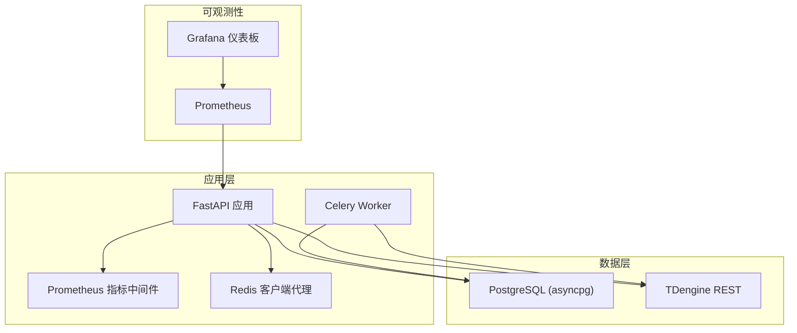
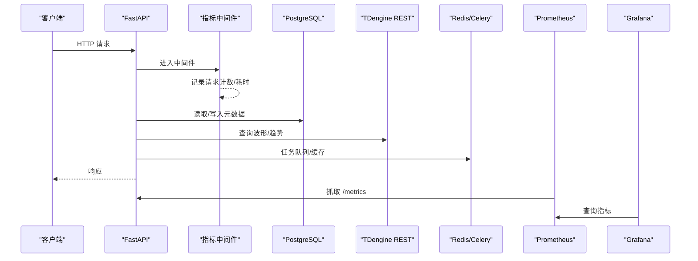
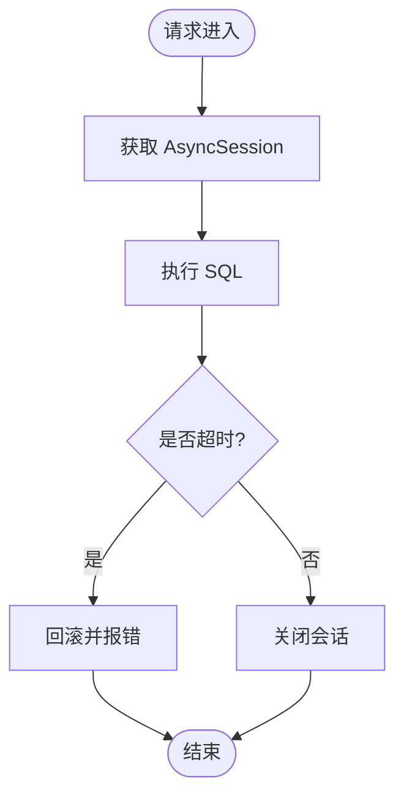
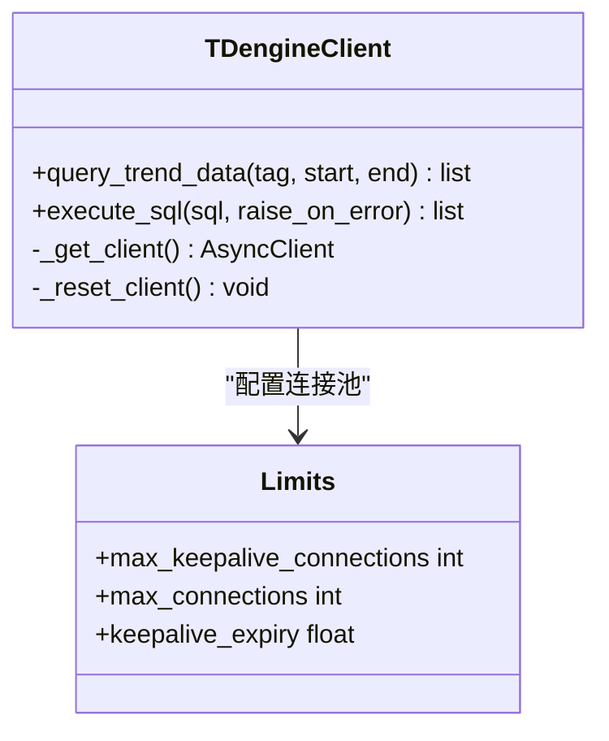
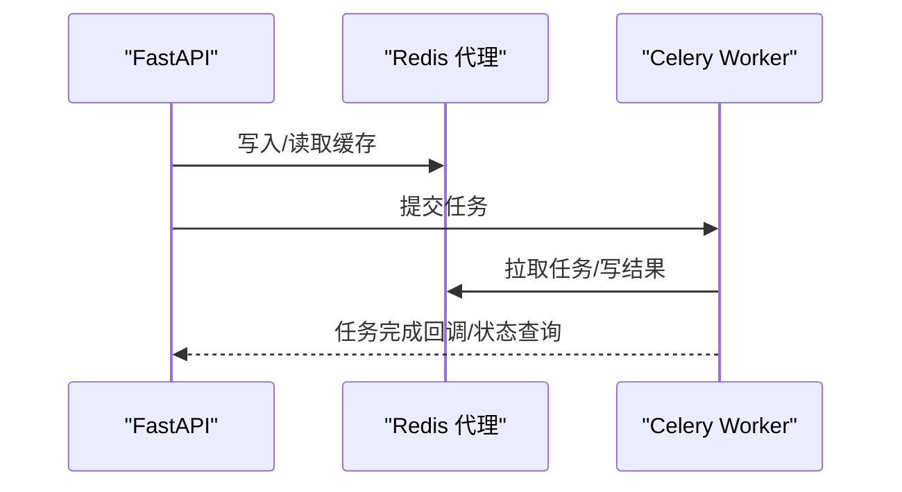
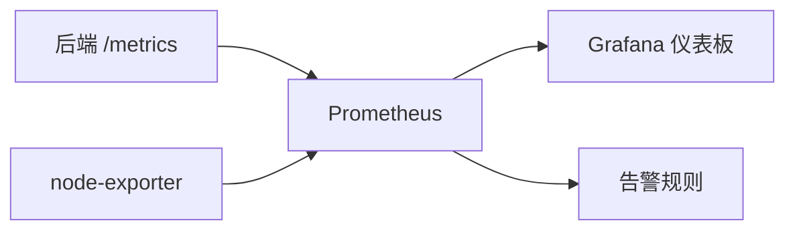
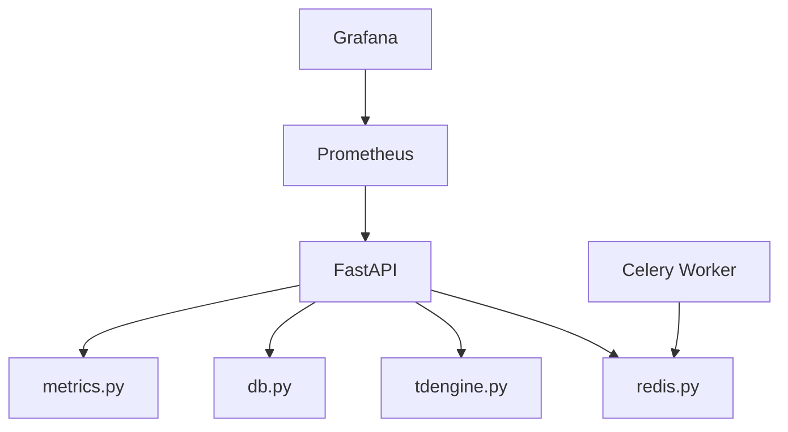
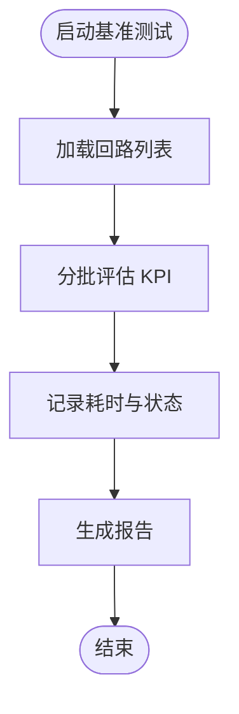

# 性能调优

<cite>
**本文引用的文件**
- [backend/app/core/config.py](file://backend/app/core/config.py)
- [backend/app/core/db.py](file://backend/app/core/db.py)
- [backend/app/core/tdengine.py](file://backend/app/core/tdengine.py)
- [backend/app/core/redis.py](file://backend/app/core/redis.py)
- [backend/app/core/metrics.py](file://backend/app/core/metrics.py)
- [deploy/prometheus/prometheus.yml](file://deploy/prometheus/prometheus.yml)
- [deploy/prometheus/alerts.yml](file://deploy/prometheus/alerts.yml)
- [deploy/grafana/dashboards/clpm-overview.json](file://deploy/grafana/dashboards/clpm-overview.json)
- [deploy/docker/tdengine/taos.cfg](file://deploy/docker/tdengine/taos.cfg)
- [scripts/monitor_db_connections.py](file://scripts/monitor_db_connections.py)
- [backend/scripts/e2e_perf_test.py](file://backend/scripts/e2e_perf_test.py)
- [backend/scripts/benchmark_metrics.py](file://backend/scripts/benchmark_metrics.py)
- [backend/scripts/kpi_capacity_benchmark.py](file://backend/scripts/kpi_capacity_benchmark.py)
- [perf/scenarios/db_perf.py](file://perf/scenarios/db_perf.py)
</cite>

## 目录
1. [简介](#简介)
2. [项目结构](#项目结构)
3. [核心组件](#核心组件)
4. [架构总览](#架构总览)
5. [详细组件分析](#详细组件分析)
6. [依赖关系分析](#依赖关系分析)
7. [性能注意事项](#性能注意事项)
8. [故障排查指南](#故障排查指南)
9. [结论](#结论)
10. [附录](#附录)

## 简介
本指南面向生产环境的 CLPM-MVP 系统，聚焦数据库与应用层性能调优、容器资源与网络优化、监控指标与告警配置，以及性能基准测试方法与容量规划建议。内容基于仓库中现有实现与部署配置，提供可操作的优化要点与验证路径。

## 项目结构
CLPM 后端采用 FastAPI + SQLAlchemy(asyncpg) + TDengine(REST) + Redis(Celery Broker/Result Backend) 的架构；Prometheus 抓取后端 /metrics，Grafana 提供仪表板；TDengine 通过配置文件进行查询缓冲等参数调优；脚本与场景覆盖端到端压测、KPI 计算基准、DB 查询性能等。

图表来源
- [backend/app/core/metrics.py:95-151](file://backend/app/core/metrics.py#L95-L151)
- [backend/app/core/db.py:26-42](file://backend/app/core/db.py#L26-L42)
- [backend/app/core/tdengine.py:164-203](file://backend/app/core/tdengine.py#L164-L203)
- [backend/app/core/redis.py:29-150](file://backend/app/core/redis.py#L29-L150)
- [deploy/prometheus/prometheus.yml:13-31](file://deploy/prometheus/prometheus.yml#L13-L31)

章节来源
- [backend/app/core/config.py:25-183](file://backend/app/core/config.py#L25-L183)
- [backend/app/core/db.py:16-42](file://backend/app/core/db.py#L16-L42)
- [backend/app/core/tdengine.py:156-203](file://backend/app/core/tdengine.py#L156-L203)
- [backend/app/core/redis.py:1-150](file://backend/app/core/redis.py#L1-L150)
- [deploy/prometheus/prometheus.yml:1-31](file://deploy/prometheus/prometheus.yml#L1-L31)

## 核心组件
- PostgreSQL 连接管理：使用 SQLAlchemy async engine + NullPool，避免 Celery 跨 event loop 复用连接池导致的 Future 绑定错误；设置 application_name 便于按进程/任务维度统计活跃连接；单条 SQL 执行超时保护防止慢查询挂死请求。
- TDengine 时序库：通过 httpx.AsyncClient 单例复用连接，限制最大连接数与 keepalive 过期时间；对 tag_name 和时间戳做白名单校验防注入；支持失败降级与重试（event loop 关闭时自动重建 client）。
- Redis 缓存与 Celery：异步 Redis 客户端封装为代理，检测 event loop 变化并重建客户端，兼容 Celery 每个任务独立 loop 的场景；Celery broker/result backend 默认走 Redis 不同 DB。
- 监控与告警：暴露 HTTP 请求计数、耗时直方图、Celery 任务计数器、PG 活跃连接 Gauge；Prometheus 抓取后端 /metrics，Grafana 提供 QPS、P95、状态码分布、Celery 成功率、DB 连接池使用数等面板；内置基础告警规则（后端 down、Celery 失败率、磁盘水位、抓取目标失联）。

章节来源
- [backend/app/core/db.py:16-42](file://backend/app/core/db.py#L16-L42)
- [backend/app/core/tdengine.py:79-92](file://backend/app/core/tdengine.py#L79-L92)
- [backend/app/core/tdengine.py:164-203](file://backend/app/core/tdengine.py#L164-L203)
- [backend/app/core/redis.py:29-150](file://backend/app/core/redis.py#L29-L150)
- [backend/app/core/metrics.py:57-87](file://backend/app/core/metrics.py#L57-L87)
- [deploy/prometheus/alerts.yml:1-55](file://deploy/prometheus/alerts.yml#L1-L55)

## 架构总览
下图展示关键调用链与数据流：FastAPI 接收请求，经指标中间件记录耗时与计数；业务逻辑访问 PostgreSQL 与 TDengine；后台任务由 Celery 驱动，读写同一数据层；Prometheus 抓取 /metrics，Grafana 可视化。

图表来源
- [backend/app/core/metrics.py:95-151](file://backend/app/core/metrics.py#L95-L151)
- [backend/app/core/db.py:26-42](file://backend/app/core/db.py#L26-L42)
- [backend/app/core/tdengine.py:227-281](file://backend/app/core/tdengine.py#L227-L281)
- [backend/app/core/redis.py:130-150](file://backend/app/core/redis.py#L130-L150)
- [deploy/prometheus/prometheus.yml:13-31](file://deploy/prometheus/prometheus.yml#L13-L31)

## 详细组件分析

### PostgreSQL 连接池与查询优化
- 连接池策略：使用 NullPool 避免跨 event loop 复用导致 Future 绑定错误；每次请求创建新连接，localhost 建连开销低；设置 command_timeout 防止慢查询无限挂起；application_name 用于 pg_stat_activity 分组统计。
- 查询优化建议：
  - 在高频查询列建立索引（如回路列表分页、标签映射、诊断运行表），结合 EXPLAIN 分析扫描成本。
  - 控制返回字段，避免 SELECT *；分页查询使用 LIMIT/OFFSET 或游标。
  - 批量写入/更新合并事务，减少往返次数。
- 连接监控：健康接口与脚本可直接查询 pg_stat_activity，统计按 application_name 分组的活跃连接与利用率，辅助定位连接泄漏或并发过高。

图表来源
- [backend/app/core/db.py:26-42](file://backend/app/core/db.py#L26-L42)
- [backend/app/api/v1/endpoints/health.py:83-117](file://backend/app/api/v1/endpoints/health.py#L83-L117)
- [scripts/monitor_db_connections.py:73-101](file://scripts/monitor_db_connections.py#L73-L101)

章节来源
- [backend/app/core/db.py:16-42](file://backend/app/core/db.py#L16-L42)
- [backend/app/api/v1/endpoints/health.py:83-117](file://backend/app/api/v1/endpoints/health.py#L83-L117)
- [scripts/monitor_db_connections.py:73-101](file://scripts/monitor_db_connections.py#L73-L101)

### TDengine 时序数据库调优
- 连接与并发：httpx.AsyncClient 单例复用连接，限制 max_keepalive_connections=30、max_connections=50，keepalive_expiry=30s；在高并发下需评估服务端处理能力，避免排队。
- 查询缓冲：taos.cfg 中 queryBufferSize 设置为 4096MB，避免长时间查询后内存耗尽错误。
- 分区与保留策略：通过三级降采样脚本管理原始库与聚合库的 KEEP/DURATION，秒级数据短期保留，分钟/小时级长期保留；部署时检查版本与 stream 状态，回填历史数据。
- 安全与容错：tag_name 与时间戳白名单校验；异常时重置 client 并重试一次；支持 raise_on_error 区分“不可用”和“无数据”。

图表来源
- [backend/app/core/tdengine.py:164-203](file://backend/app/core/tdengine.py#L164-L203)
- [backend/app/core/tdengine.py:227-281](file://backend/app/core/tdengine.py#L227-L281)
- [deploy/docker/tdengine/taos.cfg:60-64](file://deploy/docker/tdengine/taos.cfg#L60-L64)
- [backend/scripts/tdengine_downsampling.py:256-321](file://backend/scripts/tdengine_downsampling.py#L256-L321)

章节来源
- [backend/app/core/tdengine.py:79-92](file://backend/app/core/tdengine.py#L79-L92)
- [backend/app/core/tdengine.py:164-203](file://backend/app/core/tdengine.py#L164-L203)
- [backend/app/core/tdengine.py:227-281](file://backend/app/core/tdengine.py#L227-L281)
- [deploy/docker/tdengine/taos.cfg:60-64](file://deploy/docker/tdengine/taos.cfg#L60-L64)
- [backend/scripts/tdengine_downsampling.py:256-321](file://backend/scripts/tdengine_downsampling.py#L256-L321)

### 应用层优化：FastAPI、Redis、Celery
- FastAPI 异步：所有 I/O 使用异步客户端（asyncpg、httpx）；指标中间件记录请求耗时与计数，排除 /metrics 与 /health；路由模板作为 label 避免基数爆炸。
- Redis 缓存策略：异步客户端封装为 _RedisProxy，检测 event loop 变化并重建，避免 Celery 任务间复用导致 Event loop closed；统一 get_redis 依赖注入；TTL 与键空间设计需结合业务（登录失败计数、令牌黑名单、用户 token 跟踪、L1 DataBlock 缓存、任务追踪）。
- Celery 任务队列：broker/result backend 默认走 Redis 不同 DB；任务指标通过 celery_task_total 暴露成功/失败计数；监控面板显示任务速率与成功率；注意 worker 并发与任务粒度，避免长任务阻塞。

图表来源
- [backend/app/core/redis.py:29-150](file://backend/app/core/redis.py#L29-L150)
- [backend/app/core/metrics.py:83-87](file://backend/app/core/metrics.py#L83-L87)
- [deploy/grafana/dashboards/clpm-overview.json:410-520](file://deploy/grafana/dashboards/clpm-overview.json#L410-L520)

章节来源
- [backend/app/core/config.py:56-70](file://backend/app/core/config.py#L56-L70)
- [backend/app/core/redis.py:29-150](file://backend/app/core/redis.py#L29-L150)
- [backend/app/core/metrics.py:57-87](file://backend/app/core/metrics.py#L57-L87)

### 容器资源限制与网络配置
- CPU/内存：根据服务角色分配资源，确保 TDengine 查询缓冲足够（queryBufferSize 已配置）；FastAPI 与 Celery worker 按需扩展副本数，配合水平扩缩容。
- 磁盘 I/O：监控根分区可用空间，低于阈值触发告警；TDengine 与 PostgreSQL 数据目录建议使用高性能 SSD；定期清理归档与临时文件。
- 网络：/metrics 仅内网白名单可访问；Prometheus 抓取目标配置在 compose 网络内可达；TDengine REST 端口与连接限制需与上游服务匹配。

章节来源
- [deploy/prometheus/alerts.yml:33-44](file://deploy/prometheus/alerts.yml#L33-L44)
- [backend/app/core/metrics.py:21-39](file://backend/app/core/metrics.py#L21-L39)
- [deploy/prometheus/prometheus.yml:13-31](file://deploy/prometheus/prometheus.yml#L13-L31)

### 监控指标与告警
- Prometheus 抓取：job clpm-backend 抓取 /metrics；node-exporter 采集宿主机指标；evaluation_interval 与 scrape_interval 均为 30s。
- Grafana 仪表板：HTTP QPS、P95 延迟、状态码分布、Celery 任务速率与成功率、DB 连接池使用数。
- 告警规则：后端 down、Celery 失败率 >10%、根分区可用空间 <15%、抓取目标失联。

图表来源
- [deploy/prometheus/prometheus.yml:1-31](file://deploy/prometheus/prometheus.yml#L1-L31)
- [deploy/grafana/dashboards/clpm-overview.json:22-588](file://deploy/grafana/dashboards/clpm-overview.json#L22-L588)
- [deploy/prometheus/alerts.yml:1-55](file://deploy/prometheus/alerts.yml#L1-L55)

章节来源
- [deploy/prometheus/prometheus.yml:1-31](file://deploy/prometheus/prometheus.yml#L1-L31)
- [deploy/grafana/dashboards/clpm-overview.json:22-588](file://deploy/grafana/dashboards/clpm-overview.json#L22-L588)
- [deploy/prometheus/alerts.yml:1-55](file://deploy/prometheus/alerts.yml#L1-L55)

## 依赖关系分析
- 模块耦合：FastAPI 依赖 metrics 中间件、db、tdengine、redis；Celery worker 依赖 redis broker/result backend；Prometheus 抓取后端 /metrics；Grafana 依赖 Prometheus 数据源。
- 外部依赖：PostgreSQL、TDengine、Redis、node-exporter。
- 潜在循环：无直接代码循环依赖；指标中间件不反向依赖业务模块。

图表来源
- [backend/app/core/metrics.py:95-151](file://backend/app/core/metrics.py#L95-L151)
- [backend/app/core/db.py:26-42](file://backend/app/core/db.py#L26-L42)
- [backend/app/core/tdengine.py:164-203](file://backend/app/core/tdengine.py#L164-L203)
- [backend/app/core/redis.py:130-150](file://backend/app/core/redis.py#L130-L150)
- [deploy/prometheus/prometheus.yml:13-31](file://deploy/prometheus/prometheus.yml#L13-L31)

章节来源
- [backend/app/core/metrics.py:95-151](file://backend/app/core/metrics.py#L95-L151)
- [backend/app/core/db.py:26-42](file://backend/app/core/db.py#L26-L42)
- [backend/app/core/tdengine.py:164-203](file://backend/app/core/tdengine.py#L164-L203)
- [backend/app/core/redis.py:130-150](file://backend/app/core/redis.py#L130-L150)
- [deploy/prometheus/prometheus.yml:13-31](file://deploy/prometheus/prometheus.yml#L13-L31)

## 性能注意事项
- 数据库：
  - 使用 NullPool 避免跨 loop 问题；设置 command_timeout 防止慢查询挂死。
  - 合理索引与查询计划；避免全表扫描与大结果集。
  - 监控 pg_stat_activity 按 application_name 分组，识别连接热点。
- TDengine：
  - 调整 queryBufferSize 与连接限制；评估高并发下的服务端能力。
  - 使用三级降采样与 KEEP/DURATION 策略平衡存储与查询性能。
  - 安全校验与失败降级提升稳定性。
- 应用层：
  - 指标中间件避免基数爆炸；/metrics 仅内网访问。
  - Redis 代理适配 Celery 多 loop；合理 TTL 与键空间设计。
  - Celery 任务粒度与并发控制，避免长任务阻塞。
- 容器与网络：
  - 监控磁盘水位；高性能存储；/metrics 白名单限制。
  - 合理分配 CPU/内存，横向扩展副本。

章节来源
- [backend/app/core/db.py:26-42](file://backend/app/core/db.py#L26-L42)
- [backend/app/core/tdengine.py:164-203](file://backend/app/core/tdengine.py#L164-L203)
- [backend/app/core/metrics.py:21-39](file://backend/app/core/metrics.py#L21-L39)
- [deploy/prometheus/alerts.yml:33-44](file://deploy/prometheus/alerts.yml#L33-L44)

## 故障排查指南
- 连接池耗尽：通过健康接口与脚本查询 pg_stat_activity，统计 total/max/by_app/utilization；若利用率接近上限，需扩容或优化连接使用。
- TDengine 查询失败：检查 REST 端口与认证；查看日志中的 TDengineError；必要时重置 client 并重试。
- Celery 任务失败率高：监控 celery_task_total 失败率；检查 worker 日志与依赖服务可用性。
- 磁盘空间不足：node_filesystem_avail_bytes 告警；及时清理归档与临时文件。

章节来源
- [backend/app/api/v1/endpoints/health.py:83-117](file://backend/app/api/v1/endpoints/health.py#L83-L117)
- [scripts/monitor_db_connections.py:73-101](file://scripts/monitor_db_connections.py#L73-L101)
- [backend/app/core/tdengine.py:227-281](file://backend/app/core/tdengine.py#L227-L281)
- [deploy/prometheus/alerts.yml:20-44](file://deploy/prometheus/alerts.yml#L20-L44)

## 结论
CLPM-MVP 在生产环境可通过以下关键点提升性能与稳定性：PostgreSQL 使用 NullPool 与超时保护、TDengine 调整查询缓冲与连接限制、Redis 代理适配 Celery、指标中间件与告警规则完善、容器资源与网络白名单配置。结合基准测试与容量规划，持续监控与调优，确保系统在大规模数据与高并发场景下的稳定运行。

## 附录

### 性能基准测试方法
- 端到端性能测试：使用 e2e 脚本模拟多回路评估，轮询任务状态并统计平均耗时。
- KPI 计算基准：benchmark_metrics 与 benchmark_kpi_optimization 针对多种数据规模测量计算耗时，输出 JSON 报告。
- 容量基准：kpi_capacity_benchmark 拉取回路列表分批评估，统计批次耗时 P50/P95 与 SLO 通过率。
- DB 查询性能：perf/scenarios/db_perf.py 测试 TDengine 波形查询与 LTTB 降采样、PostgreSQL 回路列表分页。

图表来源
- [backend/scripts/e2e_perf_test.py:66-97](file://backend/scripts/e2e_perf_test.py#L66-L97)
- [backend/scripts/benchmark_metrics.py:381-427](file://backend/scripts/benchmark_metrics.py#L381-L427)
- [backend/scripts/kpi_capacity_benchmark.py:42-243](file://backend/scripts/kpi_capacity_benchmark.py#L42-L243)
- [perf/scenarios/db_perf.py:174-243](file://perf/scenarios/db_perf.py#L174-L243)

章节来源
- [backend/scripts/e2e_perf_test.py:66-97](file://backend/scripts/e2e_perf_test.py#L66-L97)
- [backend/scripts/benchmark_metrics.py:381-427](file://backend/scripts/benchmark_metrics.py#L381-L427)
- [backend/scripts/kpi_capacity_benchmark.py:42-243](file://backend/scripts/kpi_capacity_benchmark.py#L42-L243)
- [perf/scenarios/db_perf.py:174-243](file://perf/scenarios/db_perf.py#L174-L243)

### 容量规划建议
- 基于基准测试结果设定 SLO（如 KPI 评估批次 P95 ≤ 600s），据此估算所需 CPU/内存与副本数。
- 监控指标（QPS、P95、Celery 成功率、DB 连接数）作为扩容触发条件；当接近阈值时提前扩容。
- TDengine 存储规划：根据数据量与保留策略（KEEP/DURATION）评估磁盘需求；定期清理与归档。
- 网络带宽：评估峰值 QPS 与数据量，确保网络吞吐满足需求；/metrics 仅内网访问降低风险。

[本节为通用指导，不直接分析具体文件]