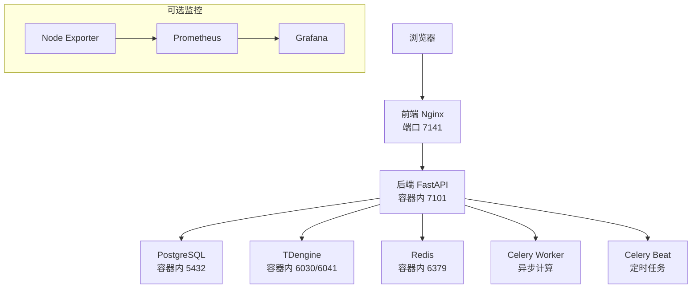
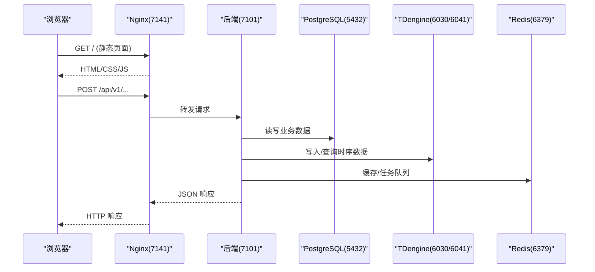
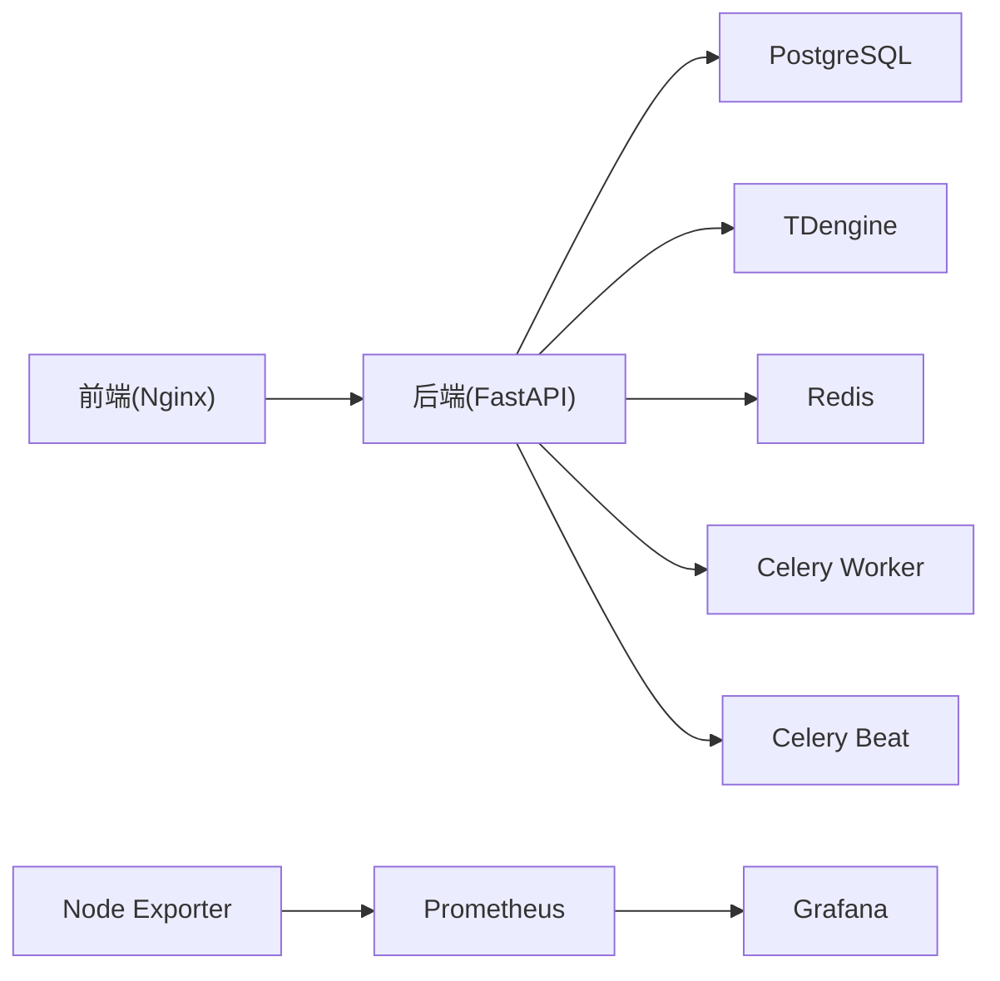

# 环境准备

<cite>
**本文引用的文件**
- [docker-compose.prod.yml](file://docker-compose.prod.yml)
- [deploy/deploy.sh](file://deploy/deploy.sh)
- [DEPLOYMENT-GUIDE.md](file://deploy/DEPLOYMENT-GUIDE.md)
- [Dockerfile.backend](file://Dockerfile.backend)
- [Dockerfile.frontend](file://Dockerfile.frontend)
- [deploy/nginx.conf](file://deploy/nginx.conf)
- [backend/app/core/config.py](file://backend/app/core/config.py)
- [deploy/docker/tdengine/taos.cfg](file://deploy/docker/tdengine/taos.cfg)
- [deploy/backup.sh](file://deploy/backup.sh)
- [Makefile](file://Makefile)
</cite>

## 目录
1. [简介](#简介)
2. [项目结构](#项目结构)
3. [核心组件](#核心组件)
4. [架构总览](#架构总览)
5. [详细组件分析](#详细组件分析)
6. [依赖关系分析](#依赖关系分析)
7. [性能与系统优化](#性能与系统优化)
8. [故障排查指南](#故障排查指南)
9. [结论](#结论)
10. [附录](#附录)

## 简介
本指南面向生产环境部署 CLPM-MVP，聚焦操作系统与硬件要求、Docker/Docker Compose 安装与网络与存储驱动配置、防火墙与安全组端口策略、系统内核与资源限制调优、环境变量模板与多环境管理、以及环境验证清单与常见问题排查。内容基于仓库中的生产编排、镜像构建、Nginx 反向代理、应用配置校验与部署脚本等实现进行说明。

## 项目结构
CLPM-MVP 生产环境以 Docker Compose 编排为核心，包含后端 API（FastAPI/Uvicorn）、前端 Nginx 静态托管与反向代理、PostgreSQL 业务库、TDengine 时序库、Redis 缓存与消息队列、Celery Worker/Beat 异步任务与定时调度，以及可选的 Prometheus/Grafana 监控栈。所有服务通过自定义桥接网络互通，仅前端 7141 端口对外暴露，后端与数据库端口不映射到宿主机。

图表来源
- [docker-compose.prod.yml:11-489](file://docker-compose.prod.yml#L11-L489)
- [deploy/nginx.conf:56-139](file://deploy/nginx.conf#L56-L139)

章节来源
- [docker-compose.prod.yml:11-489](file://docker-compose.prod.yml#L11-L489)
- [deploy/nginx.conf:56-139](file://deploy/nginx.conf#L56-L139)

## 核心组件
- 后端 API：FastAPI + Uvicorn，容器内监听 7101，健康检查 /health，生产镜像默认 4 worker。
- 前端 Nginx：静态资源托管与 SPA fallback，/api/v1 反向代理至后端，支持 WebSocket 升级。
- 数据层：PostgreSQL 16（业务关系数据）、TDengine 3.3（时序波形数据）、Redis 7（缓存与 Celery Broker）。
- 任务执行：Celery Worker（KPI 计算、诊断、报表）与 Celery Beat（AAS 同步、KPI 快照）。
- 可选监控：Prometheus、Grafana、Node Exporter（profile=monitoring）。

章节来源
- [docker-compose.prod.yml:16-489](file://docker-compose.prod.yml#L16-L489)
- [Dockerfile.backend:76-84](file://Dockerfile.backend#L76-L84)
- [Dockerfile.frontend:66-72](file://Dockerfile.frontend#L66-L72)
- [deploy/nginx.conf:100-126](file://deploy/nginx.conf#L100-L126)

## 架构总览
生产环境采用“前端 Nginx 单入口”模式：外部仅开放 7141 端口访问前端；后端 API 仅在容器网络可达，由 Nginx 反代 /api/v1。数据库与中间件均不暴露到宿主机，降低攻击面。Celery Worker/Beat 作为独立容器运行，避免与 Web 进程争抢资源。

图表来源
- [deploy/nginx.conf:100-126](file://deploy/nginx.conf#L100-L126)
- [docker-compose.prod.yml:16-489](file://docker-compose.prod.yml#L16-L489)

## 详细组件分析

### 服务器操作系统与硬件要求
- 操作系统：推荐 Ubuntu 22.04+ / CentOS 8+ / Debian 12+；生产建议 Ubuntu 24.04 LTS。
- CPU：最低 4 核 x86_64，推荐 8 核（Celery Worker 默认并发较高，需充足 CPU）。
- 内存：最低 4 GB，推荐 8 GB（Worker 容器默认 6G 内存限制，需结合宿主实际内存规划）。
- 磁盘：最低 20 GB 可用，推荐 50 GB（含镜像、日志、PG/TD/Redis 数据卷）。
- 软件依赖：Docker 24+、Docker Compose v2（内置）、curl。

章节来源
- [DEPLOYMENT-GUIDE.md:86-107](file://deploy/DEPLOYMENT-GUIDE.md#L86-L107)

### Docker 与 Docker Compose 安装与版本要求
- 版本要求：Docker 24+，Compose v2（随 Docker 安装）。
- 安装验证：docker --version、docker compose version。
- 构建与启动：使用 docker compose build/up/down 管理镜像与服务。

章节来源
- [DEPLOYMENT-GUIDE.md:96-107](file://deploy/DEPLOYMENT-GUIDE.md#L96-L107)
- [Makefile:82-90](file://Makefile#L82-L90)

### 网络配置
- 自定义桥接网络 clpm-net（compose 中定义），服务间通过容器名解析通信。
- 仅 frontend 暴露 7141 到宿主机；backend、postgres、redis、tdengine 仅 expose 内部端口。
- Nginx 启用 resolver 动态解析 backend 容器 IP，避免重启后 502。
- WebSocket 升级头透传，支持 SignalR/WebSocket 实时通道。

章节来源
- [docker-compose.prod.yml:56-98](file://docker-compose.prod.yml#L56-L98)
- [docker-compose.prod.yml:104-135](file://docker-compose.prod.yml#L104-L135)
- [docker-compose.prod.yml:141-185](file://docker-compose.prod.yml#L141-L185)
- [docker-compose.prod.yml:191-231](file://docker-compose.prod.yml#L191-L231)
- [deploy/nginx.conf:48-52](file://deploy/nginx.conf#L48-L52)
- [deploy/nginx.conf:113-116](file://deploy/nginx.conf#L113-L116)

### 存储驱动与数据持久化
- PostgreSQL：挂载 postgres_data 卷至 /var/lib/postgresql/data。
- TDengine：挂载 tdengine_data 卷至 /var/lib/taos，并挂载初始化 SQL。
- Redis：挂载 redis_data 卷至 /data，开启 AOF 持久化。
- 监控：prometheus_data、grafana_data 持久化指标与面板。

章节来源
- [docker-compose.prod.yml:111-114](file://docker-compose.prod.yml#L111-L114)
- [docker-compose.prod.yml:153-162](file://docker-compose.prod.yml#L153-L162)
- [docker-compose.prod.yml:202-206](file://docker-compose.prod.yml#L202-L206)
- [docker-compose.prod.yml:470-480](file://docker-compose.prod.yml#L470-L480)

### 防火墙与安全组端口策略
- 对外开放：7141（前端 HTTP）。
- 内部使用：7101（后端 API，仅容器内）、5432（PostgreSQL，仅容器内）、6030/6041（TDengine，仅容器内）、6379（Redis，仅容器内）。
- 若启用监控 profile：9090（Prometheus）、3000（Grafana）、9100（Node Exporter）仅容器内或隧道访问。

章节来源
- [DEPLOYMENT-GUIDE.md:109-118](file://deploy/DEPLOYMENT-GUIDE.md#L109-L118)
- [docker-compose.prod.yml:71-73](file://docker-compose.prod.yml#L71-L73)
- [docker-compose.prod.yml:27-28](file://docker-compose.prod.yml#L27-L28)
- [docker-compose.prod.yml:107-107](file://docker-compose.prod.yml#L107-L107)
- [docker-compose.prod.yml:141-185](file://docker-compose.prod.yml#L141-L185)
- [docker-compose.prod.yml:191-231](file://docker-compose.prod.yml#L191-L231)
- [docker-compose.prod.yml:361-465](file://docker-compose.prod.yml#L361-L465)

### 系统优化配置
- 文件描述符：生产高并发场景建议提高 ulimit nofile（如 65535），确保 Nginx/后端/数据库在高连接数下稳定。
- 内核参数（Linux）：
  - net.core.somaxconn 提高监听队列上限（如 65535）。
  - net.ipv4.tcp_max_syn_backlog 增大半连接队列。
  - vm.swappiness 降低 Swap 倾向（如 10），减少抖动。
- Swap：建议关闭或设置较小值，避免数据库与 Worker 因 Swap 导致延迟抖动。
- 日志轮转：Compose 已为各服务配置 json-file 驱动与 max-size/max-file 限制，防止磁盘占满。

章节来源
- [docker-compose.prod.yml:49-55](file://docker-compose.prod.yml#L49-L55)
- [docker-compose.prod.yml:127-133](file://docker-compose.prod.yml#L127-L133)
- [docker-compose.prod.yml:178-183](file://docker-compose.prod.yml#L178-L183)
- [docker-compose.prod.yml:223-229](file://docker-compose.prod.yml#L223-L229)
- [docker-compose.prod.yml:270-276](file://docker-compose.prod.yml#L270-L276)
- [docker-compose.prod.yml:316-321](file://docker-compose.prod.yml#L316-L321)

### 环境变量模板与多环境管理
- .env.prod 必填项：
  - JWT_SECRET_KEY（≥32 字符，生产安全校验强制）。
  - POSTGRES_PASSWORD、REDIS_PASSWORD、TDENGINE_PASSWORD（禁止开发弱口令）。
  - ENV=production（部署脚本强制校验，避免 Worker/Beat 双消费）。
- 可留空字段（部署后在 UI 链路配置页维护）：
  - HISTORY_DATA_API_URL、HISTORY_DATA_API_TOKEN。
  - SIGNALR_HUB_URL、SIGNALR_ENABLED（首次启用需重启后端）。
- CORS_ORIGINS：部署时自动检测本机 IP 替换 __AUTO__，避免跨域问题。
- 多环境：开发使用 deploy/docker/docker-compose.dev.yml（端口与命名空间隔离），生产使用 docker-compose.prod.yml。

章节来源
- [deploy/deploy.sh:27-184](file://deploy/deploy.sh#L27-L184)
- [backend/app/core/config.py:185-217](file://backend/app/core/config.py#L185-L217)
- [DEPLOYMENT-GUIDE.md:176-243](file://deploy/DEPLOYMENT-GUIDE.md#L176-L243)
- [docker-compose.prod.yml:29-31](file://docker-compose.prod.yml#L29-L31)
- [docker-compose.prod.yml:108-110](file://docker-compose.prod.yml#L108-L110)
- [docker-compose.prod.yml:148-152](file://docker-compose.prod.yml#L148-L152)
- [docker-compose.prod.yml:194-201](file://docker-compose.prod.yml#L194-L201)

### 关键服务健康检查与依赖
- 后端：/health 端点，30s 间隔，start_period 40s。
- 前端：/ 根路径健康检查。
- PostgreSQL：pg_isready。
- TDengine：taos 命令查询 SERVER_VERSION。
- Redis：redis-cli ping（带密码认证）。
- Celery Worker：inspect ping。
- Celery Beat：/proc/1/cmdline 含 beat。

章节来源
- [docker-compose.prod.yml:37-42](file://docker-compose.prod.yml#L37-L42)
- [docker-compose.prod.yml:78-83](file://docker-compose.prod.yml#L78-L83)
- [docker-compose.prod.yml:115-120](file://docker-compose.prod.yml#L115-L120)
- [docker-compose.prod.yml:163-172](file://docker-compose.prod.yml#L163-L172)
- [docker-compose.prod.yml:207-216](file://docker-compose.prod.yml#L207-L216)
- [docker-compose.prod.yml:255-262](file://docker-compose.prod.yml#L255-L262)
- [docker-compose.prod.yml:299-308](file://docker-compose.prod.yml#L299-L308)

## 依赖关系分析
- 前端依赖后端 API（Nginx 反代 /api/v1）。
- 后端依赖 PostgreSQL、TDengine、Redis。
- Celery Worker/Beat 依赖 Redis（Broker）与 PostgreSQL（结果/状态）。
- 监控组件（可选）依赖 Node Exporter 采集宿主机指标，Prometheus 抓取，Grafana 展示。

图表来源
- [docker-compose.prod.yml:16-489](file://docker-compose.prod.yml#L16-L489)

章节来源
- [docker-compose.prod.yml:16-489](file://docker-compose.prod.yml#L16-L489)

## 性能与系统优化
- 后端 Uvicorn：生产镜像默认 4 workers，充分利用多核；可根据 QPS 调整。
- Celery Worker：默认 concurrency=8，每子任务约 1 核；按宿主核数调整 CELERY_WORKER_CONCURRENCY。
- TDengine：queryBufferSize 设置为 4096MB，避免长时间查询内存耗尽；AOF 持久化保障 Redis 可靠性。
- Nginx：gzip 压缩、静态资源长期缓存、HTML 不缓存；client_max_body_size 20m 支持大文件导入。
- 日志：json-file 驱动限流，避免日志撑爆磁盘。

章节来源
- [Dockerfile.backend:82-84](file://Dockerfile.backend#L82-L84)
- [docker-compose.prod.yml:244-270](file://docker-compose.prod.yml#L244-L270)
- [deploy/docker/tdengine/taos.cfg:60-64](file://deploy/docker/tdengine/taos.cfg#L60-L64)
- [docker-compose.prod.yml:196-199](file://docker-compose.prod.yml#L196-L199)
- [deploy/nginx.conf:27-45](file://deploy/nginx.conf#L27-L45)
- [deploy/nginx.conf:75-78](file://deploy/nginx.conf#L75-L78)
- [docker-compose.prod.yml:49-55](file://docker-compose.prod.yml#L49-L55)

## 故障排查指南
- 部署前检查：
  - .env.prod 存在且必填项非空、无占位符；ENV=production。
  - Docker/Compose 版本满足要求。
- 常见错误：
  - JWT_SECRET_KEY 未设置或长度不足：生成强密钥并填入。
  - TDengine 反复重启（exit 255）：创建 .td-password-changed 标记文件后重启。
  - 健康检查超时：查看后端/前端日志，确认数据库密码、端口冲突、磁盘空间。
  - 链路配置测试失败：确认远端 API/SignalR 地址、端口与证书有效。
- 回滚与备份：
  - 使用 deploy/rollback.sh 回滚到上一版本镜像。
  - 使用 deploy/backup.sh 备份 PostgreSQL 与 TDengine 数据。

章节来源
- [DEPLOYMENT-GUIDE.md:444-525](file://deploy/DEPLOYMENT-GUIDE.md#L444-L525)
- [deploy/deploy.sh:71-139](file://deploy/deploy.sh#L71-L139)
- [deploy/backup.sh:25-100](file://deploy/backup.sh#L25-L100)

## 结论
CLPM-MVP 生产环境以 Docker Compose 为核心，遵循最小暴露原则（仅 7141 端口对外），通过 Nginx 统一入口与反向代理简化网络边界。系统通过严格的 .env.prod 校验与健康检查保障部署质量，配合 Celery Worker/Beat 实现异步与定时任务，TDengine/PostgreSQL/Redis 提供高性能数据存储与缓存。生产环境建议合理配置 CPU/内存/磁盘，优化内核参数与文件描述符，并启用备份与监控能力，确保稳定性与可观测性。

## 附录
- 常用运维命令：
  - 查看状态：docker compose --env-file .env.prod -f docker-compose.prod.yml ps
  - 查看日志：docker compose --env-file .env.prod -f docker-compose.prod.yml logs -f
  - 重启服务：docker compose --env-file .env.prod -f docker-compose.prod.yml restart backend celery-worker
  - 数据备份：./deploy/backup.sh
  - 数据回滚：./deploy/rollback.sh

章节来源
- [DEPLOYMENT-GUIDE.md:529-559](file://deploy/DEPLOYMENT-GUIDE.md#L529-L559)
- [Makefile:89-96](file://Makefile#L89-L96)