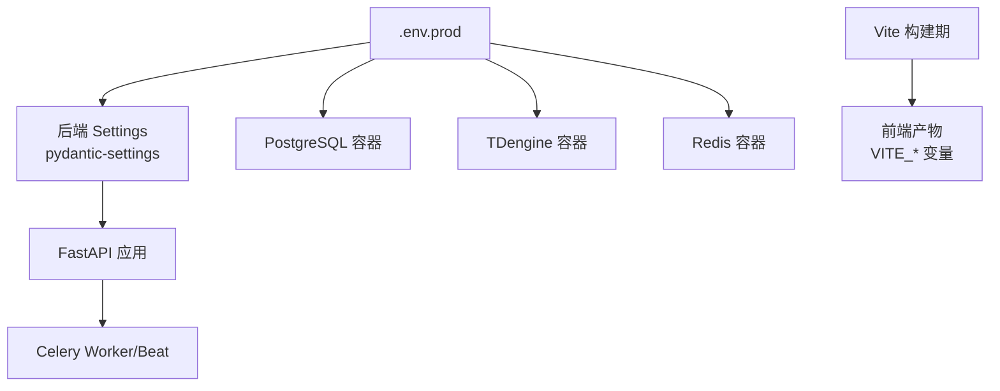
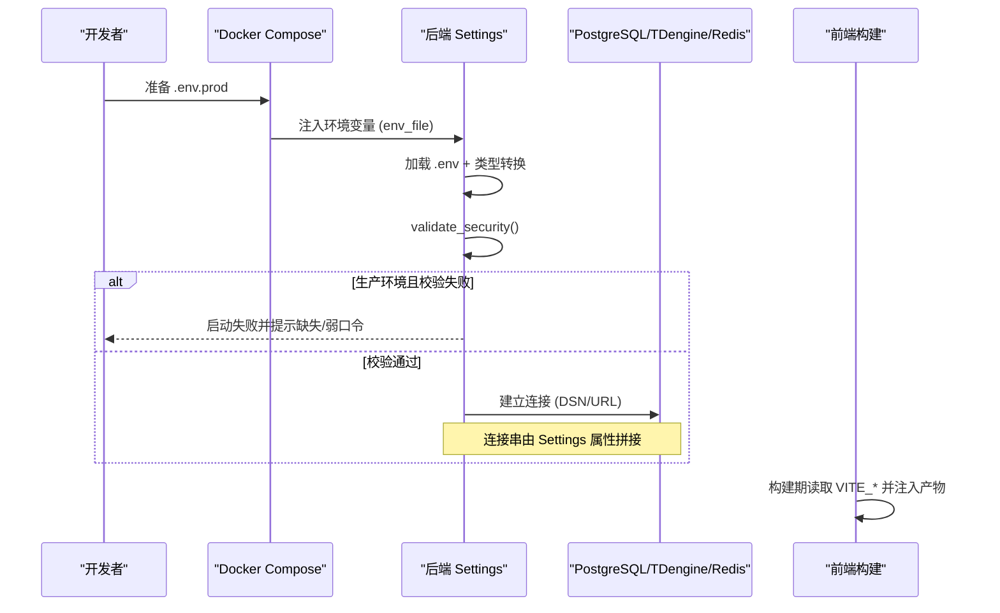
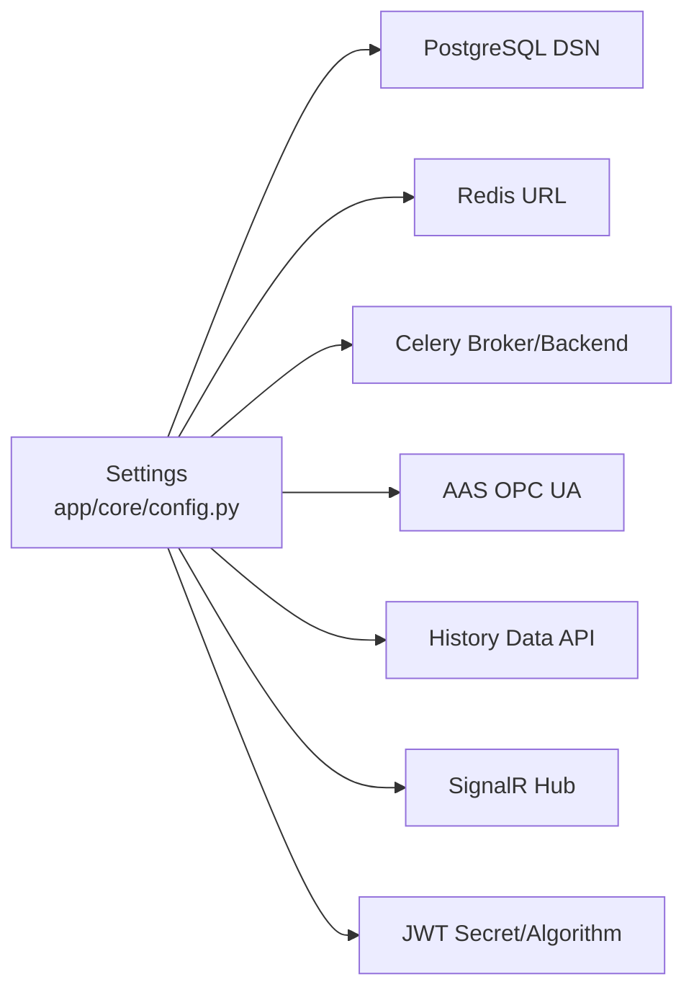

# 环境变量管理

<cite>
**本文引用的文件**
- [backend/app/core/config.py](file://backend/app/core/config.py)
- [backend/app/main.py](file://backend/app/main.py)
- [docker-compose.prod.yml](file://docker-compose.prod.yml)
- [deploy/deploy.sh](file://deploy/deploy.sh)
- [backend/app/services/datasource_config.py](file://backend/app/services/datasource_config.py)
- [backend/app/schemas/config.py](file://backend/app/schemas/config.py)
- [backend/app/core/security.py](file://backend/app/core/security.py)
- [frontend/internal/vite-config/src/utils/env.ts](file://frontend/internal/vite-config/src/utils/env.ts)
</cite>

## 目录
1. [简介](#简介)
2. [项目结构](#项目结构)
3. [核心组件](#核心组件)
4. [架构总览](#架构总览)
5. [详细组件分析](#详细组件分析)
6. [依赖关系分析](#依赖关系分析)
7. [性能考虑](#性能考虑)
8. [故障排查指南](#故障排查指南)
9. [结论](#结论)
10. [附录](#附录)

## 简介
本文件面向 CLPM-MVP 系统的环境变量与配置管理，覆盖以下目标：
- 环境变量分类：数据库、认证密钥、第三方服务、功能开关
- 配置文件结构：.env.prod 模板、占位符替换、动态配置生成
- 安全最佳实践：敏感信息加密、密钥轮换、权限控制
- 多环境策略：开发/测试/生产隔离、配置继承、差异化管理
- 配置验证机制：必填字段检查、格式校验、运行时热更新
- 配置故障排查与调试方法

## 项目结构
CLPM-MVP 的后端通过 pydantic-settings 集中加载 .env 中的环境变量，并在启动时执行安全校验；生产编排通过 docker-compose 将 .env.prod 注入各容器；前端构建期通过 Vite 工具链读取以 VITE_ 开头的变量并注入到产物中。

图表来源
- [docker-compose.prod.yml:1-489](file://docker-compose.prod.yml#L1-L489)
- [backend/app/core/config.py:1-225](file://backend/app/core/config.py#L1-L225)
- [frontend/internal/vite-config/src/utils/env.ts:43-93](file://frontend/internal/vite-config/src/utils/env.ts#L43-L93)

章节来源
- [docker-compose.prod.yml:1-489](file://docker-compose.prod.yml#L1-L489)
- [backend/app/core/config.py:1-225](file://backend/app/core/config.py#L1-L225)
- [frontend/internal/vite-config/src/utils/env.ts:43-93](file://frontend/internal/vite-config/src/utils/env.ts#L43-L93)

## 核心组件
- 后端统一配置模型：基于 pydantic-settings 的 Settings，集中声明所有环境变量及默认值，并提供连接串构造与安全校验。
- 生产编排与环境注入：docker-compose.prod.yml 通过 env_file 将 .env.prod 注入各服务，并使用 $$ 转义在容器内展开密码等变量。
- 部署前校验：deploy/deploy.sh 强制要求 ENV=production，并对关键密码进行非空与非占位符检查。
- 运行时动态配置：datasource_config 提供 sys_config 键值对读写与类型转换，支持运行时覆盖部分行为（如网络模式、SignalR 开关、断点续传阈值等）。
- 前端构建期变量：Vite 工具链加载 .env.* 并以 VITE_ 前缀过滤后注入构建产物。

章节来源
- [backend/app/core/config.py:1-225](file://backend/app/core/config.py#L1-L225)
- [docker-compose.prod.yml:1-489](file://docker-compose.prod.yml#L1-L489)
- [deploy/deploy.sh:120-139](file://deploy/deploy.sh#L120-L139)
- [backend/app/services/datasource_config.py:84-161](file://backend/app/services/datasource_config.py#L84-L161)
- [frontend/internal/vite-config/src/utils/env.ts:43-93](file://frontend/internal/vite-config/src/utils/env.ts#L43-L93)

## 架构总览
下图展示环境变量从文件到运行时的流转路径，包括后端配置加载、安全校验、数据库/缓存/消息队列连接、以及前端构建期变量注入。

图表来源
- [docker-compose.prod.yml:1-489](file://docker-compose.prod.yml#L1-L489)
- [backend/app/core/config.py:148-183](file://backend/app/core/config.py#L148-L183)
- [backend/app/core/config.py:185-224](file://backend/app/core/config.py#L185-L224)
- [frontend/internal/vite-config/src/utils/env.ts:43-93](file://frontend/internal/vite-config/src/utils/env.ts#L43-L93)

## 详细组件分析

### 环境变量分类与映射
- 数据库配置
  - PostgreSQL：POSTGRES_HOST/PORT/USER/PASSWORD/DB
  - TDengine：TDENGINE_HOST/PORT/USER/PASSWORD/DB/BATCH_SIZE/REST_TIMEOUT/FLUSH_INTERVAL
  - Redis：REDIS_HOST/PORT/PASSWORD/DB
- 认证密钥
  - JWT_SECRET_KEY、JWT_ALGORITHM、ACCESS_TOKEN_EXPIRE_MINUTES、REFRESH_TOKEN_EXPIRE_DAYS
- 第三方服务
  - AAS_ENDPOINT/AAS_SECURITY_MODE/AAS_SYNC_*（OPC UA）
  - HISTORY_DATA_API_URL/TOKEN/TIMEOUT（历史数据远端 API）
  - SIGNALR_HUB_URL/SIGNALR_ENABLED/*（实时数据订阅）
  - ALERT_WEBHOOK_URL（告警 Webhook）
- 功能开关与运行时参数
  - NETWORK_MODE、REALTIME_WRITEBACK_ENABLED、GAP_BACKFILL_*、IMPORT_TASK_*、DATA_LINK_*、REMOTE_API_*

章节来源
- [backend/app/core/config.py:28-146](file://backend/app/core/config.py#L28-L146)

### 配置文件结构与占位符替换
- 后端
  - 使用 pydantic-settings 从 .env 加载，case_sensitive=True，并通过 model_config 指定 env_file=".env"。
  - 通过属性 postgres_dsn、redis_url、celery_broker_url/celery_result_backend 自动拼接带密码的连接串。
- 生产编排
  - docker-compose.prod.yml 通过 env_file: .env.prod 注入环境变量；容器命令中使用 $$VAR 形式在容器内展开变量（例如 Redis requirepass 与 TDengine TAOS_ROOT_PASSWORD）。
- 部署脚本
  - deploy/deploy.sh 强制要求 .env.prod 设置 ENV=production，并对 POSTGRES_PASSWORD、REDIS_PASSWORD 做“不能为空且不能为占位符”的检查。

章节来源
- [backend/app/core/config.py:218-224](file://backend/app/core/config.py#L218-L224)
- [backend/app/core/config.py:148-183](file://backend/app/core/config.py#L148-L183)
- [docker-compose.prod.yml:141-219](file://docker-compose.prod.yml#L141-L219)
- [deploy/deploy.sh:120-139](file://deploy/deploy.sh#L120-L139)

### 动态配置生成与运行时热更新
- 连接串生成：Settings 根据是否配置密码动态生成 Redis/Celery URL，避免明文拼接错误。
- 运行时覆盖：
  - datasource_config 提供 sys_config 键值对的批量写入与类型转换，用于覆盖网络模式、SignalR 开关、断点续传阈值等。
  - 诊断触发条件、指标/算法参数等通过 schemas/config.py 定义的 Schema 进行保存与合并视图返回，支持版本化与审计。
- 预载与缓存：
  - 诊断触发条件在 lifespan 与 Celery worker 初始化时预载至进程内存，后续热路径直接读取，不查库。

章节来源
- [backend/app/core/config.py:148-183](file://backend/app/core/config.py#L148-L183)
- [backend/app/services/datasource_config.py:84-161](file://backend/app/services/datasource_config.py#L84-L161)
- [backend/app/schemas/config.py:762-789](file://backend/app/schemas/config.py#L762-L789)

### 安全最佳实践
- 敏感信息保护
  - 生产环境强制要求 JWT_SECRET_KEY、POSTGRES_PASSWORD、TDENGINE_PASSWORD、REDIS_PASSWORD 非空且满足长度/强度约束。
  - 禁止使用已知的弱口令（如开发默认 PG/TDengine 密码）。
  - AAS_SECURITY_MODE 在生产环境不得为 None。
- 密钥轮换
  - 通过修改 .env.prod 中的密钥并重启服务完成轮换；鉴权侧使用 settings.JWT_SECRET_KEY 签发与校验 JWT。
- 权限控制
  - 仅管理员可更新敏感配置（如可信度阈值、算法参数等），相关接口受 RBAC 保护（由上层鉴权中间件保障）。

章节来源
- [backend/app/core/config.py:185-216](file://backend/app/core/config.py#L185-L216)
- [backend/app/core/security.py:77-115](file://backend/app/core/security.py#L77-L115)
- [backend/app/schemas/config.py:384-425](file://backend/app/schemas/config.py#L384-L425)

### 多环境管理策略
- 环境隔离
  - 开发/测试：本地 .env，DEBUG 默认关闭，生产才启用严格校验。
  - 生产：docker-compose.prod.yml 通过 env_file 注入 .env.prod，独立 celery-worker/celery-beat 容器接管任务。
- 配置继承与差异化管理
  - 后端 Settings 提供默认值，.env 覆盖；生产通过 compose 注入差异化变量。
  - 前端通过 Vite 工具链按构建环境加载不同 .env.*，并以 VITE_ 前缀过滤注入产物。
- 部署门禁
  - deploy/deploy.sh 强制 ENV=production，防止误用导致双消费任务或重复调度。

章节来源
- [docker-compose.prod.yml:1-489](file://docker-compose.prod.yml#L1-L489)
- [deploy/deploy.sh:120-139](file://deploy/deploy.sh#L120-L139)
- [frontend/internal/vite-config/src/utils/env.ts:43-93](file://frontend/internal/vite-config/src/utils/env.ts#L43-L93)

### 配置验证机制
- 必填字段检查
  - 生产环境强制校验 JWT_SECRET_KEY、POSTGRES_PASSWORD、TDENGINE_PASSWORD、REDIS_PASSWORD 非空。
- 格式与范围校验
  - JWT_SECRET_KEY 长度不少于 32 字符；AAS_SECURITY_MODE 不允许 None；部分运行时参数通过 Schema 的 Field 约束（如阈值范围、枚举值）。
- 运行时热更新
  - 通过 sys_config 更新运行时开关与阈值，服务在预载阶段或调用处刷新内存缓存，无需重启。

章节来源
- [backend/app/core/config.py:185-216](file://backend/app/core/config.py#L185-L216)
- [backend/app/schemas/config.py:449-510](file://backend/app/schemas/config.py#L449-L510)
- [backend/app/services/datasource_config.py:115-161](file://backend/app/services/datasource_config.py#L115-L161)

### 前端环境变量处理
- 构建期加载
  - 使用 loadAndConvertEnv 读取多个 .env 文件，并按匹配规则（默认 VITE_）过滤后注入构建配置。
- 典型用途
  - 应用标题、基础路径、端口、压缩策略、PWA、可视化器等构建选项。

章节来源
- [frontend/internal/vite-config/src/utils/env.ts:43-93](file://frontend/internal/vite-config/src/utils/env.ts#L43-L93)

## 依赖关系分析
后端配置模块是其他服务的依赖中心，影响数据库、缓存、消息队列、外部 API、实时通信等子系统。

图表来源
- [backend/app/core/config.py:148-183](file://backend/app/core/config.py#L148-L183)
- [backend/app/core/config.py:185-216](file://backend/app/core/config.py#L185-L216)

章节来源
- [backend/app/core/config.py:148-183](file://backend/app/core/config.py#L148-L183)
- [backend/app/core/config.py:185-216](file://backend/app/core/config.py#L185-L216)

## 性能考虑
- 连接与超时
  - TDengine REST 超时与批量写入大小影响导入吞吐与稳定性；合理设置可减少长尾请求导致的进度停滞。
  - SignalR 心跳与重连间隔需适配边缘服务器负载，避免频繁重连造成抖动。
- 任务生命周期
  - 导入任务 TTL、RUNNING 超时与停滞阈值需大于最慢单分块耗时上限，避免误判卡死。
- 资源限制
  - docker-compose 中为各服务设置 CPU/内存限制，确保整体资源可控。

章节来源
- [backend/app/core/config.py:41-54](file://backend/app/core/config.py#L41-L54)
- [backend/app/core/config.py:101-131](file://backend/app/core/config.py#L101-L131)
- [docker-compose.prod.yml:44-55](file://docker-compose.prod.yml#L44-L55)

## 故障排查指南
- 启动失败
  - 若生产环境缺少必要密钥或使用了弱口令，validate_security 会抛出异常阻止启动。检查 .env.prod 是否包含 JWT_SECRET_KEY、POSTGRES_PASSWORD、TDENGINE_PASSWORD、REDIS_PASSWORD。
- 任务双消费/重复调度
  - 若 .env.prod 未设置 ENV=production，deploy 脚本会拦截；否则后端 lifespan 可能拉起额外 Worker/Beat，与独立容器冲突。
- 连接问题
  - 检查 PostgreSQL/TDengine/Redis 的 host/port/password/db 是否正确；确认容器间网络可达与健康检查通过。
- 实时数据与补数
  - 若 SignalR 断开或数据停滞，检查 SIGNALR_* 配置与 GAP_BACKFILL_* 开关；必要时调整重连间隔与补数窗口。
- 前端构建变量
  - 若前端无法访问预期 API，确认构建期 VITE_* 变量是否正确注入；检查 Vite 配置与 .env.* 文件。

章节来源
- [backend/app/core/config.py:185-216](file://backend/app/core/config.py#L185-L216)
- [deploy/deploy.sh:120-139](file://deploy/deploy.sh#L120-L139)
- [docker-compose.prod.yml:104-219](file://docker-compose.prod.yml#L104-L219)
- [backend/app/core/config.py:101-131](file://backend/app/core/config.py#L101-L131)
- [frontend/internal/vite-config/src/utils/env.ts:43-93](file://frontend/internal/vite-config/src/utils/env.ts#L43-L93)

## 结论
CLPM-MVP 的环境变量管理以集中式 Settings 为核心，结合生产编排与部署门禁，实现了强校验、可追溯、可热更新的配置体系。通过分类清晰的环境变量、严格的密钥策略、完善的运行时覆盖能力，以及前后端一致的构建期变量注入，系统在安全性、可维护性与可扩展性方面具备良好基础。建议在生产环境中持续遵循最小权限原则，定期轮换密钥，并结合监控与日志快速定位配置相关问题。

## 附录
- 推荐的最小 .env.prod 清单（示例）
  - 数据库：POSTGRES_HOST/PORT/USER/PASSWORD/DB、TDENGINE_HOST/PORT/USER/PASSWORD/DB、REDIS_HOST/PORT/PASSWORD/DB
  - 认证：JWT_SECRET_KEY、JWT_ALGORITHM、ACCESS_TOKEN_EXPIRE_MINUTES、REFRESH_TOKEN_EXPIRE_DAYS
  - 第三方：AAS_ENDPOINT、AAS_SECURITY_MODE、HISTORY_DATA_API_URL/TOKEN/TIMEOUT、SIGNALR_HUB_URL、ALERT_WEBHOOK_URL
  - 功能开关：NETWORK_MODE、REALTIME_WRITEBACK_ENABLED、GAP_BACKFILL_ENABLED、SIGNALR_ENABLED
  - 运维：ENV=production、TZ=Asia/Shanghai
- 变更流程建议
  - 变更前：评审影响面与回滚方案
  - 变更后：健康检查与冒烟测试
  - 监控：观察连接池、任务队列、实时数据链路指标