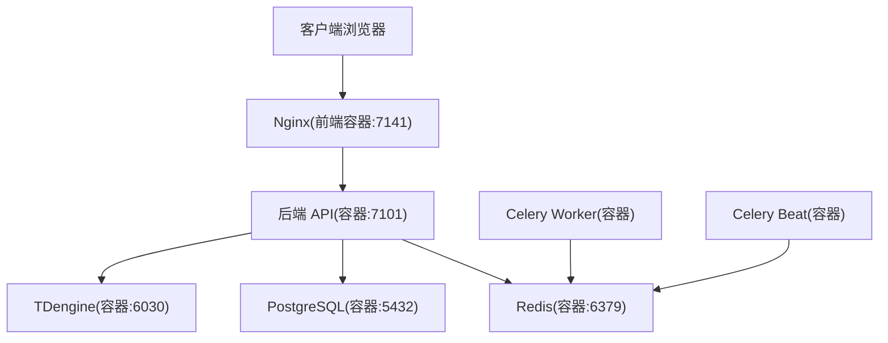
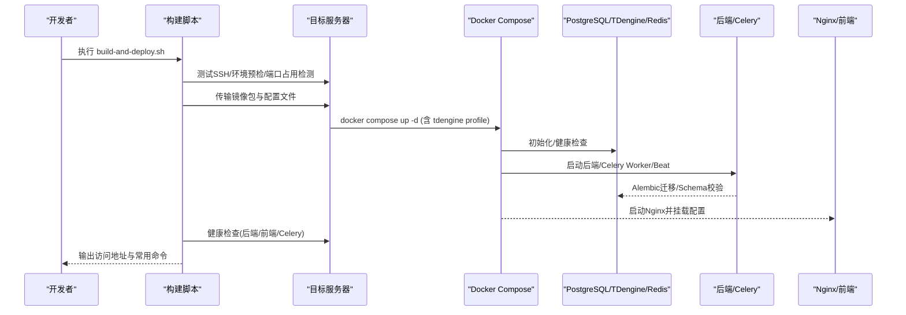
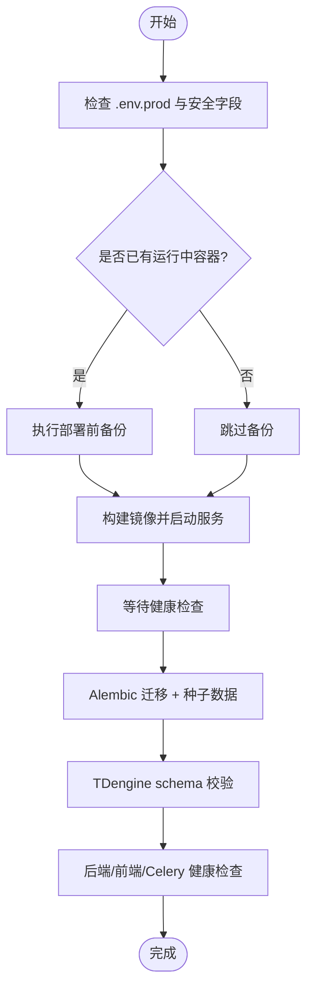
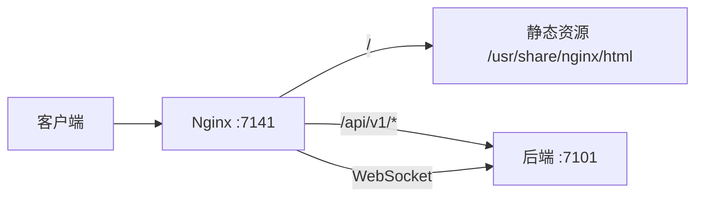
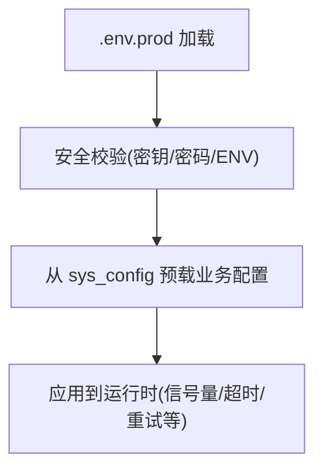
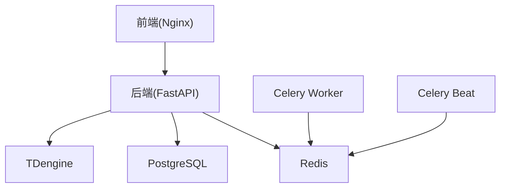

# 生产环境部署

<cite>
**本文引用的文件**
- [deploy/DEPLOYMENT-GUIDE.md](file://deploy/DEPLOYMENT-GUIDE.md)
- [deploy/deploy.sh](file://deploy/deploy.sh)
- [deploy/build-and-deploy.sh](file://deploy/build-and-deploy.sh)
- [deploy/nginx.conf](file://deploy/nginx.conf)
- [docker-compose.prod.yml](file://docker-compose.prod.yml)
- [Dockerfile.backend](file://Dockerfile.backend)
- [Dockerfile.frontend](file://Dockerfile.frontend)
- [.env.prod.example](file://.env.prod.example)
- [backend/app/core/config.py](file://backend/app/core/config.py)
- [backend/app/main.py](file://backend/app/main.py)
- [deploy/backup.sh](file://deploy/backup.sh)
- [deploy/rollback.sh](file://deploy/rollback.sh)
</cite>

## 目录
1. [简介](#简介)
2. [项目结构](#项目结构)
3. [核心组件](#核心组件)
4. [架构总览](#架构总览)
5. [详细组件分析](#详细组件分析)
6. [依赖关系分析](#依赖关系分析)
7. [性能调优建议](#性能调优建议)
8. [故障排查指南](#故障排查指南)
9. [结论](#结论)
10. [附录：部署验证清单与上线检查项](#附录：部署验证清单与上线检查项)

## 简介
本指南面向 CLPM-MVP 系统在生产环境的落地部署，覆盖服务器环境准备、自动化部署流程、Nginx 反向代理配置、环境变量管理、性能调优、以及上线前验证与回滚策略。内容基于仓库内部署脚本、Compose 编排、镜像构建与 Nginx 配置等实际实现进行说明，确保可操作、可回滚、可观测。

## 项目结构
CLPM 生产部署围绕“容器化服务 + 编排 + 反向代理 + 数据库与时序库 + 缓存与任务队列”展开，关键目录与职责如下：
- deploy：部署脚本、Nginx 配置、备份与回滚、监控（Prometheus/Grafana）
- docker-compose.prod.yml：定义后端、前端、PostgreSQL、TDengine、Redis、Celery Worker/Beat 等服务的启动与资源限制
- Dockerfile.backend / Dockerfile.frontend：后端与前端的多阶段镜像构建
- .env.prod.example：生产环境变量模板（含必填安全字段与可选业务字段）
- backend/app/core/config.py：应用级配置与安全校验
- backend/app/main.py：FastAPI 入口与生命周期管理（含 Celery 子进程守护逻辑）

图示来源
- [docker-compose.prod.yml:16-323](file://docker-compose.prod.yml#L16-L323)
- [deploy/nginx.conf:56-139](file://deploy/nginx.conf#L56-L139)

章节来源
- [docker-compose.prod.yml:1-489](file://docker-compose.prod.yml#L1-L489)
- [deploy/nginx.conf:1-167](file://deploy/nginx.conf#L1-L167)

## 核心组件
- 后端服务：FastAPI + Uvicorn 多 worker，暴露内部端口 7101，仅通过 Nginx 反代访问
- 前端服务：Nginx 托管静态 SPA，提供 /api/v1/* 反向代理到后端，支持 WebSocket
- 数据层：PostgreSQL（业务数据）、TDengine（时序波形数据）、Redis（缓存/消息）
- 异步任务：Celery Worker（任务执行）、Celery Beat（定时调度）
- 部署与运维：deploy.sh（本地一键部署）、build-and-deploy.sh（构建+传输+部署）、backup.sh（数据备份）、rollback.sh（版本回滚）

章节来源
- [Dockerfile.backend:1-84](file://Dockerfile.backend#L1-L84)
- [Dockerfile.frontend:1-72](file://Dockerfile.frontend#L1-L72)
- [docker-compose.prod.yml:16-323](file://docker-compose.prod.yml#L16-L323)
- [deploy/deploy.sh:1-308](file://deploy/deploy.sh#L1-L308)
- [deploy/build-and-deploy.sh:1-733](file://deploy/build-and-deploy.sh#L1-L733)
- [deploy/backup.sh:1-122](file://deploy/backup.sh#L1-L122)
- [deploy/rollback.sh:1-126](file://deploy/rollback.sh#L1-L126)

## 架构总览
生产环境采用容器编排统一拉起各组件，Nginx 作为对外唯一入口，屏蔽后端端口；数据库与时序库使用独立容器并持久化卷；Redis 承担缓存与 Celery Broker/Backend；Celery Worker/Beat 独立容器运行，避免与后端主进程争抢资源。

图示来源
- [deploy/build-and-deploy.sh:323-729](file://deploy/build-and-deploy.sh#L323-L729)
- [docker-compose.prod.yml:16-323](file://docker-compose.prod.yml#L16-L323)
- [deploy/deploy.sh:212-308](file://deploy/deploy.sh#L212-L308)

## 详细组件分析

### 服务器环境准备
- 操作系统与依赖
  - 推荐 Ubuntu 22.04+/CentOS 8+/Debian 12+，安装 Docker 24+ 与 Docker Compose v2
  - 防火墙仅需开放 7141（前端），后端 7101 不对外暴露
- 磁盘与内存
  - 最低 CPU 4 核、内存 4 GB、磁盘 20 GB；推荐 8 核/8 GB/50 GB
- 网络
  - 宿主机与容器间通过 Docker 网络互通；Nginx 通过容器名解析后端地址

章节来源
- [deploy/DEPLOYMENT-GUIDE.md:84-118](file://deploy/DEPLOYMENT-GUIDE.md#L84-L118)
- [docker-compose.prod.yml:56-98](file://docker-compose.prod.yml#L56-L98)

### 自动化部署脚本与流程
- 本地一键部署（deploy.sh）
  - 校验 .env.prod、JWT_SECRET_KEY、ENV=production、密码占位符检查
  - 自动备份（升级场景）、构建镜像、启动服务、等待健康检查、Alembic 迁移、TDengine schema 校验、最终验证
- 远程构建与部署（build-and-deploy.sh）
  - 构建前门禁（ruff/pytest/前端类型检查）
  - 构建 linux/amd64 镜像并导出 tar.gz，记录 manifest
  - 通过 SSH 传输至服务器，执行环境预检、端口冲突处理、加载镜像、同步配置、启动服务、数据库迁移与 TDengine schema 校验、健康检查（含 Celery inspect ping/scheduled）
- 回滚机制（rollback.sh）
  - 列出历史镜像 tag，选择上一版本为 latest，可选回滚数据库 Schema（alembic downgrade -1），重启服务并验证

图示来源
- [deploy/deploy.sh:28-308](file://deploy/deploy.sh#L28-L308)
- [deploy/build-and-deploy.sh:142-729](file://deploy/build-and-deploy.sh#L142-L729)
- [deploy/rollback.sh:25-126](file://deploy/rollback.sh#L25-L126)

章节来源
- [deploy/deploy.sh:1-308](file://deploy/deploy.sh#L1-L308)
- [deploy/build-and-deploy.sh:1-733](file://deploy/build-and-deploy.sh#L1-L733)
- [deploy/rollback.sh:1-126](file://deploy/rollback.sh#L1-L126)

### Nginx 反向代理配置
- HTTP 模式（默认）：监听 7141，静态资源托管 SPA，/api/v1/* 反向代理到后端容器
- WebSocket 支持：map $http_upgrade 与 proxy_set_header Upgrade/Connection
- 安全响应头：X-Frame-Options、X-Content-Type-Options、Referrer-Policy、CSP
- 静态资源缓存：HTML 不缓存，带 hash 的静态资源缓存 1 年
- HTTPS 模板：底部包含 443 证书挂载与 TLS 参数示例，启用时替换 server 块

图示来源
- [deploy/nginx.conf:17-139](file://deploy/nginx.conf#L17-L139)

章节来源
- [deploy/nginx.conf:1-167](file://deploy/nginx.conf#L1-L167)

### 环境变量管理
- 模板与必填项
  - 复制 .env.prod.example 为 .env.prod，必须设置 JWT_SECRET_KEY、POSTGRES_PASSWORD、REDIS_PASSWORD、TDENGINE_PASSWORD，且 ENV=production
  - CORS_ORIGINS 支持 __AUTO__，部署时自动替换为本机 IP
- 运行时配置优先
  - 应用启动时从 sys_config 预载数据源配置（如 SignalR Hub URL、历史数据 API URL/Token），失败回落到 .env 默认值
- 安全校验
  - 生产环境强制校验密钥长度、禁止弱密码、AAS_SECURITY_MODE 不得为 None

图示来源
- [.env.prod.example:1-90](file://.env.prod.example#L1-L90)
- [backend/app/core/config.py:185-225](file://backend/app/core/config.py#L185-L225)
- [backend/app/main.py:640-659](file://backend/app/main.py#L640-L659)

章节来源
- [.env.prod.example:1-90](file://.env.prod.example#L1-L90)
- [backend/app/core/config.py:1-225](file://backend/app/core/config.py#L1-L225)
- [backend/app/main.py:610-763](file://backend/app/main.py#L610-L763)

### 性能调优建议
- 数据库连接池
  - PostgreSQL：通过容器内连接，避免外部暴露；结合 Alembic 迁移减少锁竞争
  - TDengine：批量写入批次大小与 REST 超时在配置中可调，避免长事务阻塞
- 缓存配置
  - Redis：作为缓存与 Celery Broker/Backend，需设置强密码并通过健康检查保障可用性
- 内存与并发
  - 后端 Uvicorn workers 数量（镜像 CMD 指定 4）
  - Celery Worker 并发度 CELERY_WORKER_CONCURRENCY（默认 8，按宿主机核数调整）
  - 资源限制：compose 中为各服务设置 memory/cpus 上限，防止单服务耗尽资源

章节来源
- [Dockerfile.backend:76-84](file://Dockerfile.backend#L76-L84)
- [docker-compose.prod.yml:43-55](file://docker-compose.prod.yml#L43-L55)
- [docker-compose.prod.yml:236-278](file://docker-compose.prod.yml#L236-L278)
- [backend/app/core/config.py:47-54](file://backend/app/core/config.py#L47-L54)

## 依赖关系分析
- 服务依赖
  - 后端依赖 PostgreSQL、Redis、TDengine（计算路径）
  - 前端依赖后端 API（通过 Nginx 反代）
  - Celery Worker/Beat 依赖 Redis
- 构建与部署依赖
  - 构建脚本依赖 Docker buildx（可选）与 SSH 免密
  - 部署脚本依赖 docker compose 与 alembic 工具链

图示来源
- [docker-compose.prod.yml:16-323](file://docker-compose.prod.yml#L16-L323)

章节来源
- [docker-compose.prod.yml:1-489](file://docker-compose.prod.yml#L1-L489)

## 性能调优建议
- 网络与代理
  - Nginx gzip 压缩开启，静态资源长期缓存，HTML 不缓存以快速发布
  - WebSocket 升级透传，保证实时数据通道稳定
- 应用层
  - 合理设置 Celery Worker 并发度与内存限制，避免 OOM
  - 控制远端 API 调用并发与熔断参数，保护上游系统
- 存储层
  - PostgreSQL/Redis/TDengine 均启用日志轮转与资源限制，避免磁盘与内存泄漏
  - 定期执行 backup.sh 全量备份，保留最近 30 天

章节来源
- [deploy/nginx.conf:26-45](file://deploy/nginx.conf#L26-L45)
- [docker-compose.prod.yml:43-55](file://docker-compose.prod.yml#L43-L55)
- [backend/app/core/config.py:96-100](file://backend/app/core/config.py#L96-L100)
- [deploy/backup.sh:103-122](file://deploy/backup.sh#L103-L122)

## 故障排查指南
- 常见问题定位
  - 健康检查失败：查看后端/前端日志，确认端口冲突与环境变量
  - TDengine 反复重启：创建密码标记文件 .td-password-changed 后重启
  - Celery Worker 无 pong：等待预热并重试 inspect ping；检查 broker 链路
- 回滚与恢复
  - 使用 rollback.sh 将上一版本镜像标记为 latest，可选回滚数据库 Schema
  - 使用 backup.sh 恢复数据（pg_dump/taosdump）

章节来源
- [deploy/DEPLOYMENT-GUIDE.md:442-525](file://deploy/DEPLOYMENT-GUIDE.md#L442-L525)
- [deploy/rollback.sh:25-126](file://deploy/rollback.sh#L25-L126)
- [deploy/backup.sh:1-122](file://deploy/backup.sh#L1-L122)

## 结论
CLPM-MVP 的生产部署以容器化为核心，通过标准化脚本实现一键部署、自动备份与回滚，Nginx 提供统一的反向代理与静态资源服务，环境变量与运行时配置分离确保安全与灵活性。配合合理的性能调优与完善的验证清单，可在生产环境中稳定运行并持续演进。

## 附录：部署验证清单与上线检查项
- 基础验证
  - 所有容器状态 Up(healthy)
  - 后端 API /health 返回正常
  - 前端页面可访问（HTTP 7141）
- 功能验证
  - 登录成功（admin/admin123，首次登录后修改密码）
  - 链路配置页可测试历史数据 API 与 SignalR Hub
  - 回路列表显示种子数据
  - 实时数据与历史数据导入任务可执行
- 任务与调度
  - Celery Worker inspect ping 有 pong
  - Celery Beat 健康状态 healthy
- 安全与合规
  - JWT_SECRET_KEY ≥32 字符
  - 数据库/Redis/TDengine 密码非空且非弱口令
  - ENV=production 已设置
- 备份与回滚
  - 备份脚本可执行并生成归档
  - 回滚脚本可切换镜像版本并验证服务

章节来源
- [deploy/DEPLOYMENT-GUIDE.md:400-439](file://deploy/DEPLOYMENT-GUIDE.md#L400-L439)
- [deploy/deploy.sh:256-308](file://deploy/deploy.sh#L256-L308)
- [deploy/build-and-deploy.sh:623-729](file://deploy/build-and-deploy.sh#L623-L729)
- [deploy/backup.sh:1-122](file://deploy/backup.sh#L1-L122)
- [deploy/rollback.sh:25-126](file://deploy/rollback.sh#L25-L126)