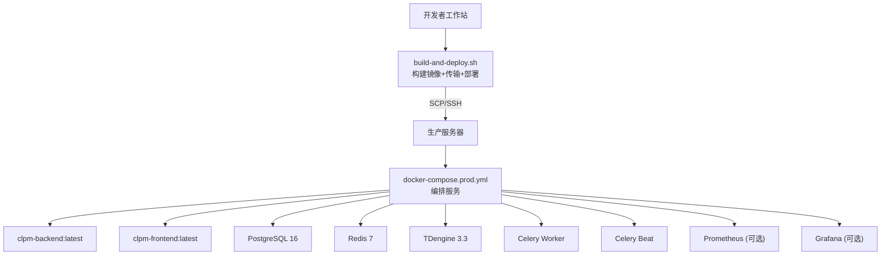
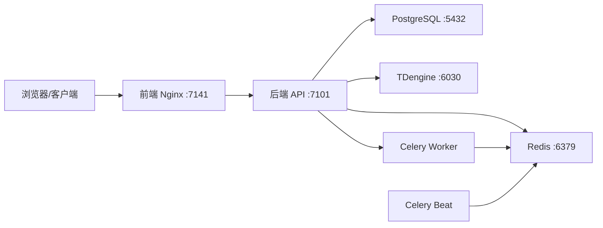
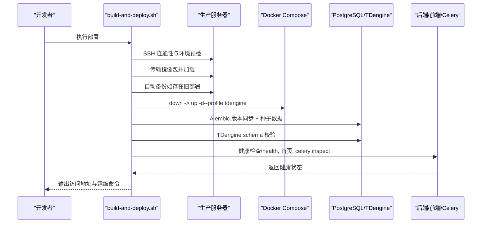
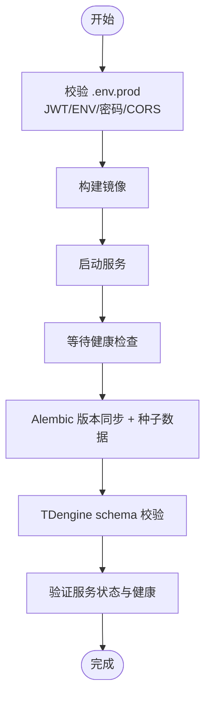
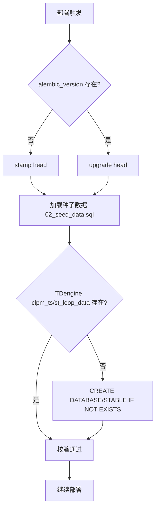
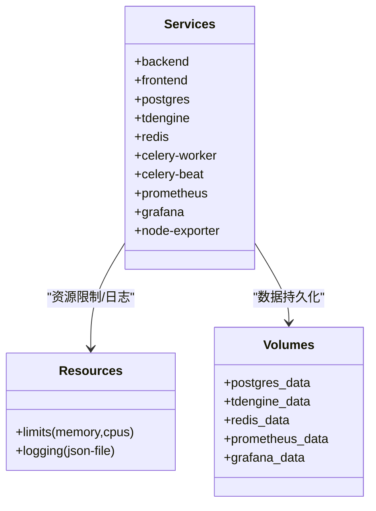
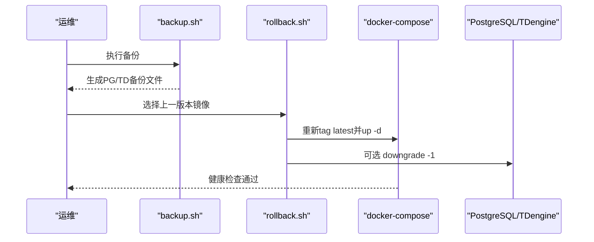
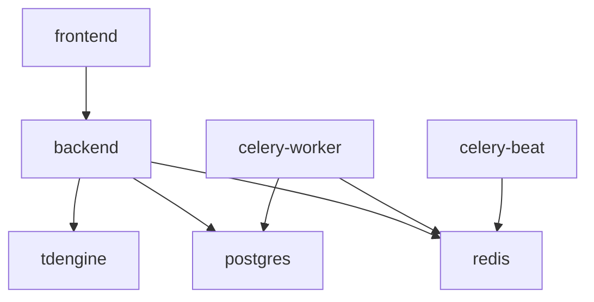

# 自动化部署

<cite>
**本文引用的文件**
- [deploy/build-and-deploy.sh](file://deploy/build-and-deploy.sh)
- [deploy/deploy.sh](file://deploy/deploy.sh)
- [deploy/rollback.sh](file://deploy/rollback.sh)
- [deploy/lib-migrate.sh](file://deploy/lib-migrate.sh)
- [deploy/backup.sh](file://deploy/backup.sh)
- [docker-compose.prod.yml](file://docker-compose.prod.yml)
- [Dockerfile.backend](file://Dockerfile.backend)
- [db/postgresql/01_schema.sql](file://db/postgresql/01_schema.sql)
- [db/tdengine/01_supertable.sql](file://db/tdengine/01_supertable.sql)
- [Makefile](file://Makefile)
</cite>

## 目录
1. [简介](#简介)
2. [项目结构](#项目结构)
3. [核心组件](#核心组件)
4. [架构总览](#架构总览)
5. [详细组件分析](#详细组件分析)
6. [依赖关系分析](#依赖关系分析)
7. [性能与资源限制](#性能与资源限制)
8. [故障排查指南](#故障排查指南)
9. [结论](#结论)
10. [附录：常用命令与验证清单](#附录常用命令与验证清单)

## 简介
本文件面向 CLPM-MVP 生产环境的自动化部署，覆盖以下目标：
- 完整说明部署脚本执行流程：前置检查、镜像构建、服务启动、健康验证。
- 深入解释数据库迁移机制：Alembic 版本同步、TDengine schema 校验、种子数据加载。
- 阐述容器编排配置：docker-compose.prod.yml 服务定义、依赖关系、资源限制。
- 提供部署验证步骤：API 健康检查、前端访问测试、数据库连接验证。
- 包含回滚机制：备份策略、版本管理、快速回滚操作。
- 提供部署故障排查指南和日志查看方法。

## 项目结构
CLPM 的生产部署由“本地构建 + 远程部署”两条路径组成：
- 本地构建并远程部署：deploy/build-and-deploy.sh（离线镜像方式）
- 服务器本地直接部署：deploy/deploy.sh（在线构建）
- 统一编排：docker-compose.prod.yml
- 数据库初始化与迁移：db/postgresql/*.sql、db/tdengine/*.sql、alembic 迁移、lib-migrate.sh
- 备份与回滚：deploy/backup.sh、deploy/rollback.sh
- 便捷入口：Makefile

图表来源
- [docker-compose.prod.yml:11-489](file://docker-compose.prod.yml#L11-L489)
- [deploy/build-and-deploy.sh:160-733](file://deploy/build-and-deploy.sh#L160-L733)

章节来源
- [docker-compose.prod.yml:1-489](file://docker-compose.prod.yml#L1-L489)
- [deploy/build-and-deploy.sh:1-733](file://deploy/build-and-deploy.sh#L1-L733)

## 核心组件
- 构建与部署脚本
  - build-and-deploy.sh：本地构建镜像、导出 tar.gz、传输到服务器、环境预检、加载镜像、启动服务、数据库迁移、schema 校验、健康检查。
  - deploy.sh：在服务器上直接构建镜像、启动服务、执行迁移与校验、健康检查。
- 数据库迁移与校验
  - lib-migrate.sh：封装 alembic_sync_head、load_seed_data、tdengine_ensure_schema。
  - db/postgresql/01_schema.sql：PostgreSQL 初始建表。
  - db/tdengine/01_supertable.sql：TDengine 超级表与示例子表。
- 容器编排
  - docker-compose.prod.yml：后端、前端、PostgreSQL、TDengine、Redis、Celery Worker/Beat、监控栈（可选）。
- 备份与回滚
  - backup.sh：PostgreSQL pg_dump + TDengine taosdump 全量备份，保留最近 30 天。
  - rollback.sh：回滚到上一版本镜像，可选回滚数据库 Schema 一个版本。
- 便捷命令
  - Makefile：一键部署、备份、回滚、迁移、种子数据加载等。

章节来源
- [deploy/build-and-deploy.sh:1-733](file://deploy/build-and-deploy.sh#L1-L733)
- [deploy/deploy.sh:1-308](file://deploy/deploy.sh#L1-L308)
- [deploy/lib-migrate.sh:1-139](file://deploy/lib-migrate.sh#L1-L139)
- [docker-compose.prod.yml:1-489](file://docker-compose.prod.yml#L1-L489)
- [deploy/backup.sh:1-122](file://deploy/backup.sh#L1-L122)
- [deploy/rollback.sh:1-126](file://deploy/rollback.sh#L1-L126)
- [Makefile:1-125](file://Makefile#L1-L125)

## 架构总览
生产环境由以下服务构成，通过 Docker Compose 编排在同一网络 clpm-net 中：
- 后端 API（FastAPI/Uvicorn）：端口 7101（仅容器内暴露），通过 Nginx 反向代理对外提供 /api/v1。
- 前端（Nginx）：端口 7141（映射宿主机），静态资源托管与反向代理。
- PostgreSQL 16：业务关系型数据，挂载 SQL 初始化脚本。
- TDengine 3.3：时序数据（回路波形），启用 tdengine profile。
- Redis 7：缓存与消息队列（Celery Broker）。
- Celery Worker/Beat：异步任务执行与定时调度。
- 可选监控：Prometheus + Grafana + Node Exporter（monitoring profile）。

图表来源
- [docker-compose.prod.yml:11-489](file://docker-compose.prod.yml#L11-L489)

章节来源
- [docker-compose.prod.yml:11-489](file://docker-compose.prod.yml#L11-L489)

## 详细组件分析

### 部署脚本执行流程（build-and-deploy.sh）
该脚本将“构建、传输、部署、迁移、校验、健康检查”串联为一条流水线，关键阶段如下：
- Phase 0：构建前测试门禁（ruff、pytest、前端类型检查），失败即中止。
- Phase 1：构建后端/前端镜像（支持 buildx 跨平台），导出为 tar.gz，更新 manifest.json。
- Phase 2：部署到服务器
  - SSH 连通性检测与环境预检（Docker、Compose v2、端口占用、部署目录、.env.prod）。
  - 传输镜像包到服务器，加载镜像。
  - 自动备份（若已有运行中的 postgres）。
  - 停止旧服务、清理残留容器、启动新服务（恒启用 --profile tdengine）。
  - 数据库版本同步（Alembic stamp/upgrade head）、种子数据加载。
  - TDengine schema 校验（REST API 检查/补建）。
  - 健康检查：后端 /health、前端首页、Celery Worker inspect ping/scheduled、Celery Beat 健康状态。

图表来源
- [deploy/build-and-deploy.sh:141-733](file://deploy/build-and-deploy.sh#L141-L733)

章节来源
- [deploy/build-and-deploy.sh:141-733](file://deploy/build-and-deploy.sh#L141-L733)

### 部署脚本执行流程（deploy.sh）
适用于服务器本地直接构建与部署：
- 读取 .env.prod 并进行安全校验（JWT_SECRET_KEY、ENV=production、必填密码字段、CORS 自动替换）。
- 构建镜像、启动服务、等待健康检查。
- 数据库版本同步（Alembic）与 TDengine schema 校验。
- 验证服务状态与健康检查（后端 /health、前端首页）。

图表来源
- [deploy/deploy.sh:27-308](file://deploy/deploy.sh#L27-L308)

章节来源
- [deploy/deploy.sh:27-308](file://deploy/deploy.sh#L27-L308)

### 数据库迁移机制（Alembic + 种子数据 + TDengine）
- Alembic 版本同步
  - 首次部署：stamp head（标记当前版本，不重复执行 DDL）。
  - 后续升级：upgrade head（增量迁移）。
  - 任何一步失败即中止部署，避免新代码跑在旧 schema 上。
- 种子数据加载
  - 每次部署后显式加载 02_seed_data.sql（幂等 ON CONFLICT），修复升级部署时 entrypoint 跳过导致的数据缺失问题。
- TDengine schema 校验
  - 通过 REST API 检查 clpm_ts 数据库与 st_loop_data 超级表是否存在；不存在则创建数据库与超级表，确保写入链路可用。

图表来源
- [deploy/lib-migrate.sh:18-139](file://deploy/lib-migrate.sh#L18-L139)
- [db/postgresql/01_schema.sql:1-200](file://db/postgresql/01_schema.sql#L1-L200)
- [db/tdengine/01_supertable.sql:1-84](file://db/tdengine/01_supertable.sql#L1-L84)

章节来源
- [deploy/lib-migrate.sh:18-139](file://deploy/lib-migrate.sh#L18-L139)
- [db/postgresql/01_schema.sql:1-200](file://db/postgresql/01_schema.sql#L1-L200)
- [db/tdengine/01_supertable.sql:1-84](file://db/tdengine/01_supertable.sql#L1-L84)

### 容器编排配置（docker-compose.prod.yml）
- 服务定义与依赖
  - backend：依赖 postgres、redis 健康；暴露 7101（仅容器内）。
  - frontend：依赖 backend 健康；暴露 7141（映射宿主机）。
  - postgres：挂载 01_schema.sql、02_seed_data.sql 至 initdb.d。
  - tdengine：启用 profiles ["tdengine"]；挂载 01_supertable.sql；处理密码已改标记。
  - redis：持久化 AOF；暴露 6379（仅容器内）。
  - celery-worker：依赖 redis、postgres 健康；高并发回填吞吐。
  - celery-beat：依赖 redis 健康；无 broker 探测接口，使用 /proc 检测。
  - monitoring（可选）：prometheus、grafana、node-exporter。
- 资源限制
  - backend：内存 1G、CPU 2.0。
  - frontend：内存 256M、CPU 0.5。
  - postgres：内存 1G、CPU 1.0。
  - tdengine：内存 1G、CPU 1.0。
  - redis：内存 512M、CPU 1.0。
  - celery-worker：内存 6G、CPU 8.0（匹配 concurrency）。
  - celery-beat：内存 256M、CPU 0.5。
  - prometheus/grafana/node-exporter：各自轻量限制。
- 日志轮转
  - 所有服务启用 json-file 驱动，max-size 10m、max-file 3。

图表来源
- [docker-compose.prod.yml:11-489](file://docker-compose.prod.yml#L11-L489)

章节来源
- [docker-compose.prod.yml:11-489](file://docker-compose.prod.yml#L11-L489)

### 镜像构建（Dockerfile.backend）
- 多阶段构建：builder 安装依赖（uv sync frozen），runtime 仅拷贝 .venv 与源码。
- 注入 APP_VERSION（git tag/commit），便于运行时定位版本。
- 非 root 用户运行，安装 curl、libpq5 用于 healthcheck 与数据库驱动。
- 暴露 7101，HEALTHCHECK 调用 /health，Uvicorn 多 worker 生产模式。

章节来源
- [Dockerfile.backend:1-84](file://Dockerfile.backend#L1-L84)

### 回滚机制（backup.sh + rollback.sh）
- 备份策略
  - PostgreSQL：pg_dump 压缩备份。
  - TDengine：taosdump 全库导出，带 root 凭据认证。
  - 保留最近 30 天备份，自动清理过期数据。
- 版本管理
  - 镜像 tag 策略：latest、commit tag、时间戳 tag；manifest.json 记录每次构建元数据。
- 快速回滚
  - 将上一版本镜像重新 tag 为 latest，重启服务；可选降级数据库 Schema 一个版本（需确认）。

图表来源
- [deploy/backup.sh:1-122](file://deploy/backup.sh#L1-L122)
- [deploy/rollback.sh:1-126](file://deploy/rollback.sh#L1-L126)

章节来源
- [deploy/backup.sh:1-122](file://deploy/backup.sh#L1-L122)
- [deploy/rollback.sh:1-126](file://deploy/rollback.sh#L1-L126)

## 依赖关系分析
- 服务间依赖
  - backend 依赖 postgres、redis 健康。
  - frontend 依赖 backend 健康。
  - celery-worker 依赖 redis、postgres 健康。
  - celery-beat 依赖 redis 健康。
  - tdengine 作为独立 profile，按需启用。
- 外部依赖
  - 镜像仓库：postgres:16-alpine、redis:7-alpine、tdengine/tdengine:3.3.6.6、prom/prometheus、grafana/grafana、prom/node-exporter。
- 配置文件
  - .env.prod：环境变量集中管理（数据库、Redis、JWT、CORS、Celery 等）。
  - nginx.conf：前端反向代理与静态资源托管。

图表来源
- [docker-compose.prod.yml:11-489](file://docker-compose.prod.yml#L11-L489)

章节来源
- [docker-compose.prod.yml:11-489](file://docker-compose.prod.yml#L11-L489)

## 性能与资源限制
- 资源限制
  - 根据服务角色设置合理的 CPU/内存上限，避免争抢。
  - celery-worker 高并发场景下需匹配宿主机核数调整 CELERY_WORKER_CONCURRENCY。
- 日志轮转
  - 统一使用 json-file 驱动，控制单文件大小与保留数量，防止磁盘占满。
- 健康检查
  - 各服务配置了合适的 interval、timeout、retries、start_period，确保快速发现异常。

章节来源
- [docker-compose.prod.yml:37-489](file://docker-compose.prod.yml#L37-L489)

## 故障排查指南
- 常见错误与定位
  - 端口冲突（7141）：检查宿主进程或旧容器占用，脚本已尝试自动释放。
  - 环境变量错误：核对 .env.prod 中 JWT_SECRET_KEY、POSTGRES_PASSWORD、REDIS_PASSWORD、TDENGINE_PASSWORD 等必填项。
  - 镜像加载失败：确认 tar.gz 完整性与 docker load 成功。
  - 数据库迁移失败：查看 alembic current 与后端日志，必要时回滚镜像并修复迁移。
  - TDengine schema 缺失：检查 init 脚本挂载路径与密码标记文件，必要时手动执行初始化。
  - Celery Worker/Beat 异常：inspect ping/scheduled 无响应，查看 worker/beat 日志与 broker 链路。
- 日志查看
  - 后端：docker logs clpm-backend --tail 50
  - 前端：docker logs clpm-frontend --tail 50
  - 数据库：docker logs clpm-postgres --tail 50
  - TDengine：docker logs clpm-tdengine --tail 50
  - Celery：docker logs clpm-celery-worker --tail 50；docker logs clpm-celery-beat --tail 50
- 健康检查命令
  - 后端：curl http://localhost:7101/health（容器内）
  - 前端：curl http://localhost:7141/
  - Celery：celery inspect ping/scheduled（容器内）

章节来源
- [deploy/build-and-deploy.sh:323-707](file://deploy/build-and-deploy.sh#L323-L707)
- [deploy/deploy.sh:256-282](file://deploy/deploy.sh#L256-L282)
- [docker-compose.prod.yml:37-489](file://docker-compose.prod.yml#L37-L489)

## 结论
CLPM-MVP 的自动化部署通过“构建门禁 + 镜像打包 + 远程部署 + 数据库迁移 + schema 校验 + 健康检查”形成闭环，具备可回滚、可观测、可恢复的工程能力。建议在生产环境中：
- 严格遵循构建前测试门禁，避免缺陷进入生产镜像。
- 每次部署前自动备份，确保可回退。
- 使用 manifest.json 与镜像 tag 进行版本追踪。
- 定期演练回滚流程，确保紧急情况下能快速恢复。

## 附录：常用命令与验证清单
- 一键部署
  - make deploy
- 数据备份
  - make backup
- 回滚到上一版本
  - make rollback
- 数据库迁移
  - make migrate
- 加载种子数据
  - make seed
- 健康验证清单
  - 后端 API：curl http://localhost:7101/health（容器内）
  - 前端页面：curl http://localhost:7141/
  - Celery Worker：celery inspect ping（容器内）
  - Celery Beat：grep -aq beat /proc/1/cmdline（容器内）
  - 数据库连接：psql -U $POSTGRES_USER -d $POSTGRES_DB（PostgreSQL 容器内）
  - TDengine 连接：taos -u root -p$TDENGINE_PASSWORD（TDengine 容器内）

章节来源
- [Makefile:89-109](file://Makefile#L89-L109)
- [deploy/deploy.sh:256-282](file://deploy/deploy.sh#L256-L282)
- [docker-compose.prod.yml:37-489](file://docker-compose.prod.yml#L37-L489)