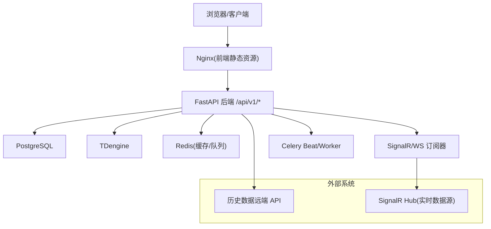
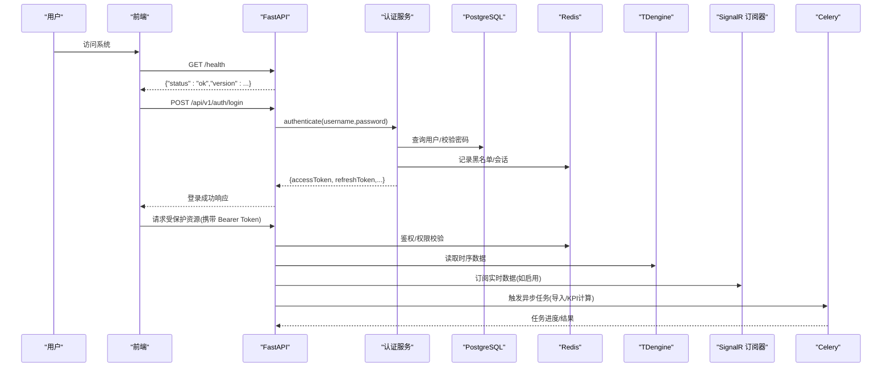
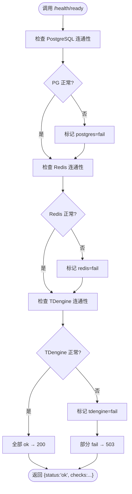
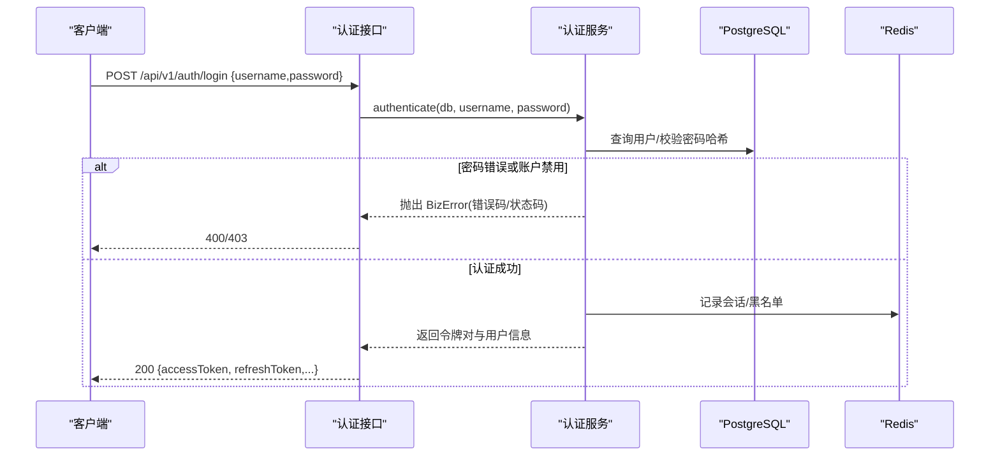
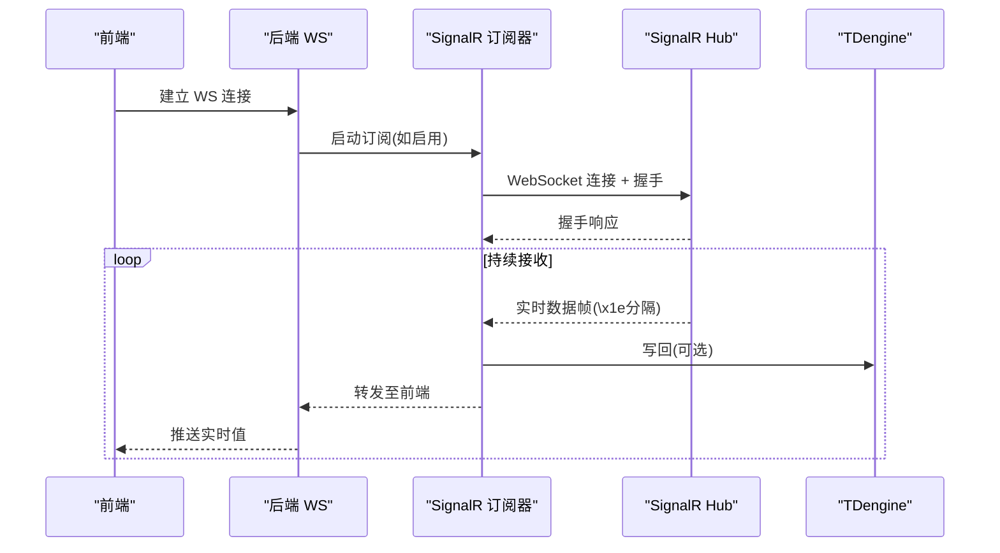
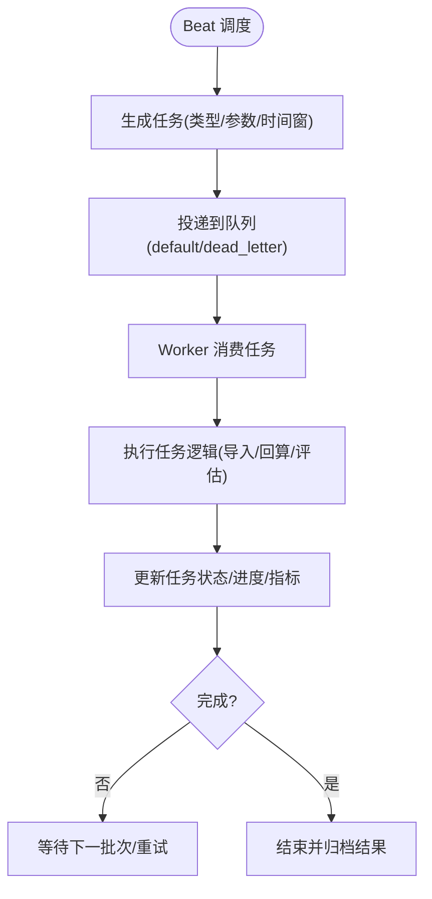
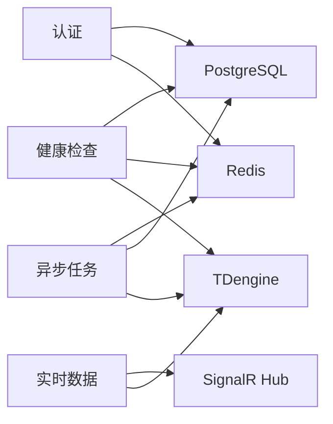
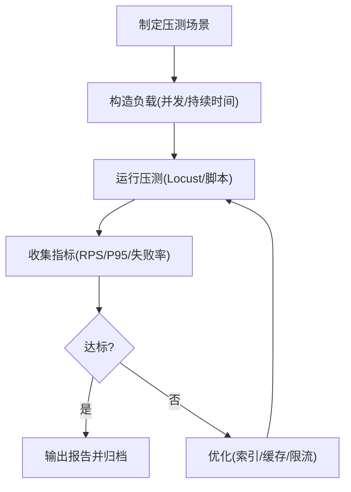

# 部署验证与上线检查

<cite>
**本文引用的文件**
- [backend/app/main.py](file://backend/app/main.py)
- [backend/app/core/config.py](file://backend/app/core/config.py)
- [backend/app/api/v1/endpoints/health.py](file://backend/app/api/v1/endpoints/health.py)
- [backend/app/services/auth.py](file://backend/app/services/auth.py)
- [backend/app/schemas/auth.py](file://backend/app/schemas/auth.py)
- [backend/tests/test_auth.py](file://backend/tests/test_auth.py)
- [backend/tests/test_health.py](file://backend/tests/test_health.py)
- [backend/app/services/data_source/realtime_subscriber.py](file://backend/app/services/data_source/realtime_subscriber.py)
- [mock_data_server/api/realtime_hub.py](file://mock_data_server/api/realtime_hub.py)
- [frontend/apps/web-antd/src/utils/realtime-ws.ts](file://frontend/apps/web-antd/src/utils/realtime-ws.ts)
- [deploy/DEPLOYMENT-GUIDE.md](file://deploy/DEPLOYMENT-GUIDE.md)
- [docker-compose.prod.yml](file://docker-compose.prod.yml)
- [perf/README.md](file://perf/README.md)
- [perf/scenarios/db_perf.py](file://perf/scenarios/db_perf.py)
- [backend/scripts/test_realtime_pipeline_e2e.py](file://backend/scripts/test_realtime_pipeline_e2e.py)
- [docs/设计文档/09-DEVPLAN/S8安全扫描报告.md](file://docs/设计文档/09-DEVPLAN/S8安全扫描报告.md)
</cite>

## 目录
1. [简介](#简介)
2. [项目结构](#项目结构)
3. [核心组件](#核心组件)
4. [架构总览](#架构总览)
5. [详细组件分析](#详细组件分析)
6. [依赖关系分析](#依赖关系分析)
7. [性能验证](#性能验证)
8. [故障排查指南](#故障排查指南)
9. [结论](#结论)
10. [附录：上线前最终检查清单与回退预案](#附录上线前最终检查清单与回退预案)

## 简介
本文件为 CLPM-MVP 系统提供“部署验证与上线检查”的完整操作指南，覆盖服务健康检查、功能验证、性能验证、安全检查以及上线前最终检查清单和回退预案。内容基于仓库中的后端 API、配置、健康端点、认证与安全、实时数据推送、异步任务、部署脚本与性能测试等实现进行梳理，确保在真实生产环境中可执行、可复现、可回滚。

## 项目结构
CLPM-MVP 采用前后端分离与多容器编排：
- 后端 FastAPI 应用：提供 REST API、WebSocket/SignalR 订阅、Celery 定时与异步任务
- 数据库：PostgreSQL（业务元数据）、TDengine（时序数据）
- 缓存与消息：Redis（会话、任务队列、缓存）
- 前端：Nginx + Web 应用
- 监控：Prometheus/Grafana（可选）
- 部署：Docker Compose 编排，自动化部署与健康检查

**图表来源**
- [backend/app/main.py:1-12](file://backend/app/main.py#L1-L12)
- [backend/app/api/v1/endpoints/health.py:1-6](file://backend/app/api/v1/endpoints/health.py#L1-L6)
- [backend/app/core/config.py:25-113](file://backend/app/core/config.py#L25-L113)
- [backend/app/services/data_source/realtime_subscriber.py:358-457](file://backend/app/services/data_source/realtime_subscriber.py#L358-L457)
- [mock_data_server/api/realtime_hub.py:136-160](file://mock_data_server/api/realtime_hub.py#L136-L160)
- [docker-compose.prod.yml](file://docker-compose.prod.yml)

**章节来源**
- [backend/app/main.py:1-12](file://backend/app/main.py#L1-L12)
- [backend/app/core/config.py:25-113](file://backend/app/core/config.py#L25-L113)
- [docker-compose.prod.yml](file://docker-compose.prod.yml)

## 核心组件
- 健康检查端点：/health（存活探针）、/health/ready（就绪探针，校验 PG/Redis/TDengine）、/health/db-connections（PG 连接池监控）
- 认证与权限：登录、刷新、登出、RBAC 权限控制、密码复杂度校验
- 实时数据推送：SignalR 握手、断线重连、数据停滞看门狗、写回 TDengine
- 异步任务：Celery Beat 调度、Worker 消费、任务追踪与进度上报
- 配置与安全：环境变量加载、生产环境强制安全校验、CORS 白名单

**章节来源**
- [backend/app/api/v1/endpoints/health.py:26-81](file://backend/app/api/v1/endpoints/health.py#L26-L81)
- [backend/app/services/auth.py:254-331](file://backend/app/services/auth.py#L254-L331)
- [backend/app/schemas/auth.py:145-193](file://backend/app/schemas/auth.py#L145-L193)
- [backend/app/services/data_source/realtime_subscriber.py:358-457](file://backend/app/services/data_source/realtime_subscriber.py#L358-L457)
- [backend/app/main.py:329-527](file://backend/app/main.py#L329-L527)
- [backend/app/core/config.py:185-224](file://backend/app/core/config.py#L185-L224)

## 架构总览
后端启动时自动初始化日志、模块预载、Celery Beat/Worker 管理、实时订阅器启动；健康端点对外暴露服务状态；认证流程返回 JWT；实时数据通过 SignalR 订阅并写入缓存或 TDengine；异步任务由 Celery 调度与执行。

**图表来源**
- [backend/app/api/v1/endpoints/health.py:26-76](file://backend/app/api/v1/endpoints/health.py#L26-L76)
- [backend/app/services/auth.py:254-331](file://backend/app/services/auth.py#L254-L331)
- [backend/app/services/data_source/realtime_subscriber.py:358-457](file://backend/app/services/data_source/realtime_subscriber.py#L358-L457)
- [backend/app/main.py:610-763](file://backend/app/main.py#L610-L763)

## 详细组件分析

### 服务健康检查
- 存活探针 /health：进程存活即返回 ok，用于 Kubernetes 或负载均衡探针
- 就绪探针 /health/ready：检查 PostgreSQL、Redis、TDengine 连通性，任一失败返回 503 degraded
- 数据库连接监控 /health/db-connections：查询 pg_stat_activity 并按 application_name 分组，同步 Prometheus Gauge

**图表来源**
- [backend/app/api/v1/endpoints/health.py:32-76](file://backend/app/api/v1/endpoints/health.py#L32-L76)

**章节来源**
- [backend/app/api/v1/endpoints/health.py:26-81](file://backend/app/api/v1/endpoints/health.py#L26-L81)
- [backend/tests/test_health.py:93-123](file://backend/tests/test_health.py#L93-L123)

### 认证与权限控制
- 登录流程：POST /api/v1/auth/login，返回 accessToken、refreshToken、tokenType、expiresIn 及用户信息
- 权限模型：不同角色映射到不同权限集合，管理员拥有全量权限
- 密码策略：新密码需满足复杂度要求（大小写字母、数字、特殊字符）
- 安全审计：登录失败记录审计日志，账户禁用/锁定处理

**图表来源**
- [backend/app/services/auth.py:254-331](file://backend/app/services/auth.py#L254-L331)
- [backend/app/schemas/auth.py:145-193](file://backend/app/schemas/auth.py#L145-L193)
- [backend/tests/test_auth.py:29-84](file://backend/tests/test_auth.py#L29-L84)

**章节来源**
- [backend/app/services/auth.py:254-331](file://backend/app/services/auth.py#L254-L331)
- [backend/app/schemas/auth.py:145-193](file://backend/app/schemas/auth.py#L145-L193)
- [backend/tests/test_auth.py:29-84](file://backend/tests/test_auth.py#L29-L84)

### 实时数据推送验证
- 后端订阅器：连接 SignalR Hub，握手协议 JSON，支持心跳与断线重连，数据停滞看门狗主动断开重连
- 前端 WebSocket：连接后端 /api/v1/ws/realtime，自动重连与心跳检测
- Mock 数据服务器：提供 SignalR 握手与广播更新，便于端到端验证

**图表来源**
- [backend/app/services/data_source/realtime_subscriber.py:358-457](file://backend/app/services/data_source/realtime_subscriber.py#L358-L457)
- [mock_data_server/api/realtime_hub.py:136-160](file://mock_data_server/api/realtime_hub.py#L136-L160)
- [frontend/apps/web-antd/src/utils/realtime-ws.ts:1-29](file://frontend/apps/web-antd/src/utils/realtime-ws.ts#L1-L29)

**章节来源**
- [backend/app/services/data_source/realtime_subscriber.py:358-457](file://backend/app/services/data_source/realtime_subscriber.py#L358-L457)
- [mock_data_server/api/realtime_hub.py:136-160](file://mock_data_server/api/realtime_hub.py#L136-L160)
- [frontend/apps/web-antd/src/utils/realtime-ws.ts:1-29](file://frontend/apps/web-antd/src/utils/realtime-ws.ts#L1-L29)

### 异步任务执行验证
- Celery Beat：按 schedule 发送任务（如每小时 KPI 计算），单例防护避免重复调度
- Celery Worker：消费 default 与 dead_letter 队列，执行导入、回算、评估等任务
- 任务追踪：任务创建、状态更新、进度上报、错误记录

**图表来源**
- [backend/app/main.py:329-527](file://backend/app/main.py#L329-L527)
- [backend/app/services/task_tracker.py:342-384](file://backend/app/services/task_tracker.py#L342-L384)

**章节来源**
- [backend/app/main.py:329-527](file://backend/app/main.py#L329-L527)
- [backend/app/services/task_tracker.py:342-384](file://backend/app/services/task_tracker.py#L342-L384)

### 配置与环境安全
- 环境变量加载：pydantic-settings 从 .env 加载，区分开发/生产
- 生产环境强制校验：JWT_SECRET_KEY、数据库密码、TDengine 密码、Redis 密码、AAS 安全模式
- CORS 白名单：仅允许指定域名，避免跨站风险

**章节来源**
- [backend/app/core/config.py:25-113](file://backend/app/core/config.py#L25-L113)
- [backend/app/core/config.py:185-224](file://backend/app/core/config.py#L185-L224)

## 依赖关系分析
- 健康检查依赖 PG/Redis/TDengine 连通性
- 认证依赖 PG（用户表）、Redis（会话/黑名单）
- 实时数据依赖 SignalR Hub、可选写回 TDengine
- 异步任务依赖 Redis（Broker/Backend）、PG/TD（持久化）
- 部署编排依赖 Docker Compose，统一管理服务生命周期

**图表来源**
- [backend/app/api/v1/endpoints/health.py:32-76](file://backend/app/api/v1/endpoints/health.py#L32-L76)
- [backend/app/services/auth.py:254-331](file://backend/app/services/auth.py#L254-L331)
- [backend/app/services/data_source/realtime_subscriber.py:358-457](file://backend/app/services/data_source/realtime_subscriber.py#L358-L457)
- [backend/app/main.py:329-527](file://backend/app/main.py#L329-L527)

**章节来源**
- [backend/app/api/v1/endpoints/health.py:32-76](file://backend/app/api/v1/endpoints/health.py#L32-L76)
- [backend/app/services/auth.py:254-331](file://backend/app/services/auth.py#L254-L331)
- [backend/app/services/data_source/realtime_subscriber.py:358-457](file://backend/app/services/data_source/realtime_subscriber.py#L358-L457)
- [backend/app/main.py:329-527](file://backend/app/main.py#L329-L527)

## 性能验证
- 响应时间测试：使用 Locust 或自定义脚本测量 API P90/P95，关注失败数为 0
- 并发能力验证：模拟多用户同时登录、查询回路列表、导入历史数据
- 资源使用监控：Prometheus/Grafana 采集 CPU/内存/连接数/队列长度
- 数据库性能：TDengine 24h 波形查询+降采样、PostgreSQL 回路列表查询 P95 < 100ms

**图表来源**
- [perf/README.md:227-256](file://perf/README.md#L227-L256)
- [perf/scenarios/db_perf.py:174-208](file://perf/scenarios/db_perf.py#L174-L208)

**章节来源**
- [perf/README.md:227-256](file://perf/README.md#L227-L256)
- [perf/scenarios/db_perf.py:174-208](file://perf/scenarios/db_perf.py#L174-L208)

## 故障排查指南
- 健康检查失败：查看 /health/ready 各依赖状态，定位 PG/Redis/TDengine 异常
- 认证失败：检查用户名/密码、账户状态、Redis 黑名单、审计日志
- 实时数据不更新：确认 SignalR Hub 地址、订阅器运行状态、Redis 缓存键、日志中连接信息
- 异步任务堆积：检查 Celery Worker 是否运行、队列长度、死信队列、任务日志
- 部署失败：查看部署脚本生成的排查清单，自动回滚到上一版本

**章节来源**
- [backend/tests/test_health.py:93-123](file://backend/tests/test_health.py#L93-L123)
- [backend/tests/test_auth.py:563-622](file://backend/tests/test_auth.py#L563-L622)
- [backend/scripts/test_realtime_pipeline_e2e.py:399-439](file://backend/scripts/test_realtime_pipeline_e2e.py#L399-L439)
- [deploy/DEPLOYMENT-GUIDE.md:400-525](file://deploy/DEPLOYMENT-GUIDE.md#L400-L525)

## 结论
CLPM-MVP 提供了完善的健康检查、认证与权限、实时数据推送、异步任务与部署自动化能力。通过本检查清单，可在上线前系统化验证服务可用性、功能正确性、性能指标与安全合规，确保生产环境稳定运行与快速回滚。

## 附录：上线前最终检查清单与回退预案

### 服务健康检查
- 后端 API 健康端点
  - 调用 /health 返回 status=ok
  - 调用 /health/ready 返回 status=ok，且 checks.postgres/redis/tdengine 均为 ok
  - 调用 /health/db-connections 获取 PG 连接池统计
- 前端页面访问
  - 浏览器访问 http://<IP>:7141/ 返回 200
- 数据库连接测试
  - PostgreSQL：SELECT 1 成功
  - TDengine：SHOW DATABASES 返回非空
  - Redis：ping 成功
- 缓存服务验证
  - Redis 写入/读取键值成功
  - 实时数据缓存键存在（如 realtime:*）

**章节来源**
- [backend/app/api/v1/endpoints/health.py:26-81](file://backend/app/api/v1/endpoints/health.py#L26-L81)
- [deploy/DEPLOYMENT-GUIDE.md:400-416](file://deploy/DEPLOYMENT-GUIDE.md#L400-L416)

### 功能验证步骤
- 用户登录测试
  - POST /api/v1/auth/login 返回 accessToken、refreshToken、tokenType、expiresIn 与用户信息
  - 不同角色返回对应权限集合
- 核心业务流程验证
  - 回路配置：查看回路列表与详情
  - 历史数据导入：执行导入任务，TDengine 有数据
  - 链路配置：填写历史数据 API 与 SignalR Hub，测试连接成功
- 实时数据推送测试
  - 配置 SignalR Hub 后，回路监控页面 PV/SP/OP 实时更新
  - 检查 Redis 中 realtime:* 键是否存在
- 异步任务执行验证
  - 触发导入/KPI 回算任务，观察任务状态与进度
  - 检查 Celery Worker 日志与队列消费情况

**章节来源**
- [backend/tests/test_auth.py:29-84](file://backend/tests/test_auth.py#L29-L84)
- [backend/app/services/auth.py:254-331](file://backend/app/services/auth.py#L254-L331)
- [deploy/DEPLOYMENT-GUIDE.md:418-438](file://deploy/DEPLOYMENT-GUIDE.md#L418-L438)
- [backend/app/services/data_source/realtime_subscriber.py:358-457](file://backend/app/services/data_source/realtime_subscriber.py#L358-L457)

### 性能验证项目
- 响应时间测试
  - 使用 Locust 或脚本测量 API P90/P95，失败数为 0
- 并发能力验证
  - 模拟多用户同时登录、查询、导入任务
- 资源使用监控
  - Prometheus/Grafana 采集 CPU/内存/连接数/队列长度
- 数据库性能
  - TDengine 24h 波形查询+降采样 P95 达标
  - PostgreSQL 回路列表查询 P95 < 100ms

**章节来源**
- [perf/README.md:227-256](file://perf/README.md#L227-L256)
- [perf/scenarios/db_perf.py:174-208](file://perf/scenarios/db_perf.py#L174-L208)

### 安全检查项
- 权限控制验证
  - 非管理员角色访问 ADMIN 端点返回 403
  - 无 Token 访问受保护端点返回 401
- SQL 注入防护
  - 全仓使用 SQLAlchemy ORM 参数化查询，无字符串拼接
- XSS 攻击防护
  - 前端使用 Vue 插值渲染，默认转义 HTML
- 敏感信息泄露检查
  - 生产环境强制校验 JWT_SECRET_KEY、数据库密码、TDengine 密码、Redis 密码
  - CORS 白名单限制，避免 * 开放

**章节来源**
- [backend/tests/test_auth.py:563-622](file://backend/tests/test_auth.py#L563-L622)
- [docs/设计文档/09-DEVPLAN/S8安全扫描报告.md:23-30](file://docs/设计文档/09-DEVPLAN/S8安全扫描报告.md#L23-L30)
- [backend/app/core/config.py:185-224](file://backend/app/core/config.py#L185-L224)

### 上线前最终检查清单
- 所有容器运行中且健康（docker compose ps）
- 后端 API 健康（/health 与 /health/ready 均 ok）
- 前端 Nginx 健康（/ 返回 200）
- Celery Worker/Beat 健康（日志显示运行中）
- 链路配置完成（历史数据 API 与 SignalR Hub 测试通过）
- 实时数据更新正常（PV/SP/OP 实时更新）
- 异步任务执行正常（导入/KPI 回算任务完成）
- 性能指标达标（P95 响应时间、失败率为 0）
- 安全检查通过（权限、SQL 注入、XSS、敏感信息）

**章节来源**
- [deploy/DEPLOYMENT-GUIDE.md:400-438](file://deploy/DEPLOYMENT-GUIDE.md#L400-L438)
- [backend/app/api/v1/endpoints/health.py:26-81](file://backend/app/api/v1/endpoints/health.py#L26-L81)
- [backend/app/main.py:610-763](file://backend/app/main.py#L610-L763)

### 回退预案
- 自动回滚机制：部署脚本在健康检查失败时自动回滚到上一镜像版本
- 手动回滚：使用 rollback.sh 或手动重新标记旧版本镜像并重启服务
- 数据库回滚：从备份恢复 PostgreSQL/TDengine，Alembic stamp 到目标版本
- 应急联系：运维、开发、DBA、产品负责人联系方式明确

**章节来源**
- [deploy/DEPLOYMENT-GUIDE.md:465-525](file://deploy/DEPLOYMENT-GUIDE.md#L465-L525)
- [docs/过程文档/phase3-migration-rollback-plan-2026-07-31.md:604-707](file://docs/过程文档/phase3-migration-rollback-plan-2026-07-31.md#L604-L707)