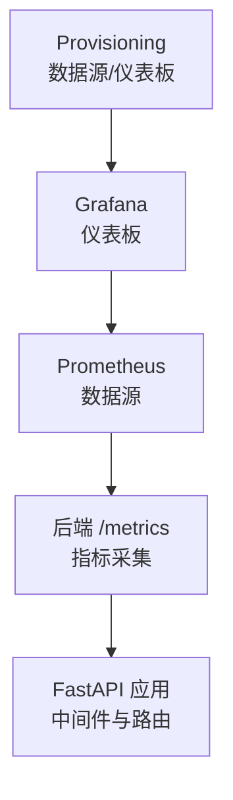
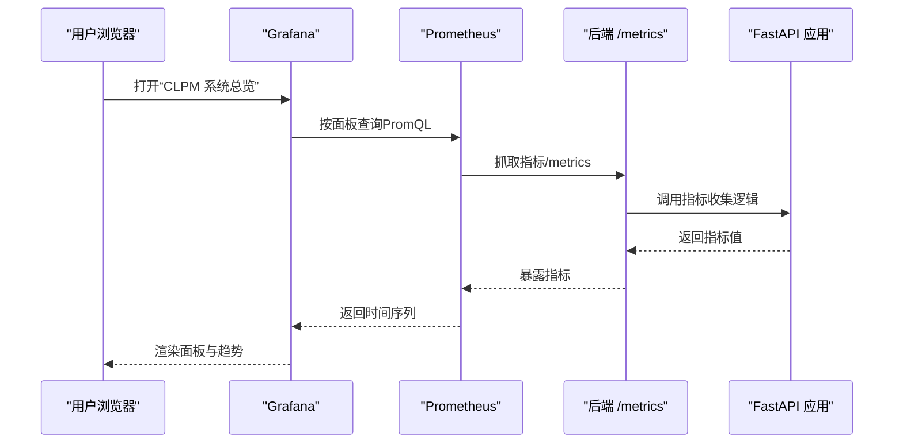
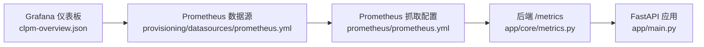

# Grafana 仪表板

<cite>
**本文引用的文件**
- [clpm-overview.json](file://deploy/grafana/dashboards/clpm-overview.json)
- [prometheus.yml（数据源）](file://deploy/grafana/provisioning/datasources/prometheus.yml)
- [dashboards.yml（仪表板提供器）](file://deploy/grafana/provisioning/dashboards/dashboards.yml)
- [prometheus.yml（抓取配置）](file://deploy/prometheus/prometheus.yml)
- [metrics.py（应用指标与 /metrics 端点）](file://backend/app/core/metrics.py)
- [main.py（FastAPI 入口与生命周期）](file://backend/app/main.py)
</cite>

## 目录
1. [简介](#简介)
2. [项目结构](#项目结构)
3. [核心组件](#核心组件)
4. [架构总览](#架构总览)
5. [详细组件分析](#详细组件分析)
6. [依赖关系分析](#依赖关系分析)
7. [性能考虑](#性能考虑)
8. [故障诊断指南](#故障诊断指南)
9. [结论](#结论)
10. [附录](#附录)

## 简介
本文件面向 CLPM-MVP 系统的可观测性需求，提供 Grafana 仪表板的完整配置与使用指南。内容涵盖：
- 预置仪表板“CLPM 系统总览”的功能、关键指标与交互说明
- 数据源配置：Prometheus 连接、多环境管理与访问权限控制
- 自定义仪表板创建：面板添加、查询语句编写、可视化样式设置
- 仪表板共享与导出：团队协作、版本管理、部署自动化
- 常用查询模板与故障诊断面板配置方法

## 项目结构
Grafana 相关资源位于 deploy/grafana 目录，包含：
- 仪表板 JSON 定义：deploy/grafana/dashboards/clpm-overview.json
- 数据源与仪表板提供器的 Provisioning 配置：deploy/grafana/provisioning/...
- Prometheus 抓取配置：deploy/prometheus/prometheus.yml
- 后端指标暴露：backend/app/core/metrics.py（/metrics 端点）

图表来源
- [clpm-overview.json:1-628](file://deploy/grafana/dashboards/clpm-overview.json#L1-L628)
- [prometheus.yml（数据源）:1-10](file://deploy/grafana/provisioning/datasources/prometheus.yml#L1-L10)
- [prometheus.yml（抓取配置）:1-31](file://deploy/prometheus/prometheus.yml#L1-L31)
- [metrics.py:1-163](file://backend/app/core/metrics.py#L1-L163)

章节来源
- [clpm-overview.json:1-628](file://deploy/grafana/dashboards/clpm-overview.json#L1-L628)
- [prometheus.yml（数据源）:1-10](file://deploy/grafana/provisioning/datasources/prometheus.yml#L1-L10)
- [dashboards.yml（仪表板提供器）:1-14](file://deploy/grafana/provisioning/dashboards/dashboards.yml#L1-L14)
- [prometheus.yml（抓取配置）:1-31](file://deploy/prometheus/prometheus.yml#L1-L31)
- [metrics.py:1-163](file://backend/app/core/metrics.py#L1-L163)

## 核心组件
- 预置仪表板：CLPM 系统总览（clpm-overview.json），展示 HTTP 请求速率、延迟 P95、状态码分布、Celery 任务执行速率与成功率、数据库连接池使用数等关键指标。
- 数据源：通过 Provisioning 自动注册名为“Prometheus”的数据源，默认指向 http://prometheus:9090。
- 指标来源：后端 FastAPI 应用通过 metrics 模块暴露 /metrics，供 Prometheus 抓取。
- 仪表板提供器：通过 dashboards.yml 将 JSON 文件挂载到 Grafana 的“CLPM”文件夹，支持 UI 更新与自动刷新。

章节来源
- [clpm-overview.json:1-628](file://deploy/grafana/dashboards/clpm-overview.json#L1-L628)
- [prometheus.yml（数据源）:1-10](file://deploy/grafana/provisioning/datasources/prometheus.yml#L1-L10)
- [dashboards.yml（仪表板提供器）:1-14](file://deploy/grafana/provisioning/dashboards/dashboards.yml#L1-L14)
- [metrics.py:1-163](file://backend/app/core/metrics.py#L1-L163)

## 架构总览

图表来源
- [clpm-overview.json:1-628](file://deploy/grafana/dashboards/clpm-overview.json#L1-L628)
- [prometheus.yml（抓取配置）:1-31](file://deploy/prometheus/prometheus.yml#L1-L31)
- [metrics.py:1-163](file://backend/app/core/metrics.py#L1-L163)

## 详细组件分析

### 预置仪表板：CLPM 系统总览
- 功能介绍
  - 统一展示后端服务健康与性能：QPS、延迟、错误率、任务处理情况、数据库连接压力。
  - 通过变量 DS_PROMETHEUS 动态切换数据源，便于多环境复用。
- 关键指标
  - HTTP 请求速率（QPS）：基于 http_requests_total 的 rate 聚合。
  - HTTP 请求延迟 P95：基于 http_request_duration_seconds_bucket 的分位计算。
  - HTTP 状态码分布：按 status 维度统计 rate。
  - Celery 任务执行速率：按 task_name 维度统计 rate。
  - Celery 任务成功率：success 比率。
  - DB 连接池使用数：db_pool_connections 当前值。
- 交互操作指南
  - 顶部时间范围选择器：调整观察窗口（默认最近 1 小时）。
  - 数据源下拉框：在顶部变量中选择不同环境的 Prometheus 数据源。
  - 图例与工具提示：显示均值/最大值或排序后的多系列详情。
  - 阈值与颜色：部分面板已配置阈值（如延迟、成功率、连接数），用于快速识别异常。

章节来源
- [clpm-overview.json:1-628](file://deploy/grafana/dashboards/clpm-overview.json#L1-L628)

### 数据源配置：Prometheus 连接与管理
- 连接配置
  - 名称：Prometheus
  - 类型：prometheus
  - 访问模式：proxy
  - URL：http://prometheus:9090
  - 默认启用并允许编辑
- 多环境数据源管理
  - 通过 Provisioning 的 datasources/prometheus.yml 集中管理，避免手动维护。
  - 结合 dashboards.yml 的 providers 配置，将仪表板 JSON 文件挂载到指定文件夹（CLPM），支持 UI 更新与定时刷新。
- 访问权限控制
  - /metrics 端点仅对内部网络开放：白名单包含本地回环、私有网段及 Tailscale CGNAT 段；非内网请求将被拒绝。
  - 建议在生产中配合反向代理或网络策略进一步限制访问。

章节来源
- [prometheus.yml（数据源）:1-10](file://deploy/grafana/provisioning/datasources/prometheus.yml#L1-L10)
- [dashboards.yml（仪表板提供器）:1-14](file://deploy/grafana/provisioning/dashboards/dashboards.yml#L1-L14)
- [metrics.py:21-50](file://backend/app/core/metrics.py#L21-L50)
- [metrics.py:131-151](file://backend/app/core/metrics.py#L131-L151)

### 自定义仪表板创建：面板与查询
- 面板添加与配置
  - 在 Grafana 中新建仪表板，添加 Time series、Stat、Bar gauge 等面板。
  - 为每个面板选择数据源（建议使用变量 DS_PROMETHEUS 以支持多环境）。
  - 设置单位、阈值、图例、工具提示等样式。
- 查询语句编写
  - 使用 PromQL 从 Prometheus 拉取指标，例如：
    - 请求速率：rate(http_requests_total[5m])
    - 延迟分位：histogram_quantile(0.95, sum by (le) (rate(http_request_duration_seconds_bucket[5m])))
    - 状态码分布：sum by (status) (rate(http_requests_total[5m]))
    - 任务速率：sum by (task_name) (rate(celery_task_total[5m]))
    - 成功率：sum(rate(celery_task_total{status="success"}[5m])) / sum(rate(celery_task_total[5m]))
    - 连接池：db_pool_connections
- 可视化样式设置
  - 根据指标特性选择合适的可视化类型（时序、数值、堆叠面积等）。
  - 配置阈值颜色以突出异常区间（如延迟、成功率、连接数）。
  - 使用图例计算（mean/max/min）和排序提升可读性。

章节来源
- [clpm-overview.json:1-628](file://deploy/grafana/dashboards/clpm-overview.json#L1-L628)
- [metrics.py:57-87](file://backend/app/core/metrics.py#L57-L87)

### 仪表板共享与导出：团队协作与部署自动化
- 团队协作配置
  - 使用 dashboards.yml 的 providers 将 JSON 文件纳入版本控制，团队共同维护。
  - 开启 allowUiUpdates 以便在 Grafana UI 中直接修改并持久化到文件。
- 版本管理
  - 将 clpm-overview.json 纳入 Git 仓库，通过变更历史追踪仪表板演进。
  - 结合分支策略进行评审与合并，确保生产环境稳定。
- 部署自动化
  - 通过 Provisioning 自动加载数据源与仪表板，减少人工配置。
  - 在 CI/CD 流程中校验 JSON 有效性，并在发布时同步到目标环境。

章节来源
- [dashboards.yml（仪表板提供器）:1-14](file://deploy/grafana/provisioning/dashboards/dashboards.yml#L1-L14)
- [clpm-overview.json:1-628](file://deploy/grafana/dashboards/clpm-overview.json#L1-L628)

### 常用查询模板
- 请求量与时延
  - QPS：sum by (path) (rate(http_requests_total[5m]))
  - P95 延迟：histogram_quantile(0.95, sum by (le) (rate(http_request_duration_seconds_bucket[5m])))
- 错误与状态
  - 状态码分布：sum by (status) (rate(http_requests_total[5m]))
- 任务与队列
  - 任务速率：sum by (task_name) (rate(celery_task_total[5m]))
  - 成功率：sum(rate(celery_task_total{status="success"}[5m])) / sum(rate(celery_task_total[5m]))
- 资源与连接
  - 连接池使用：db_pool_connections

章节来源
- [clpm-overview.json:1-628](file://deploy/grafana/dashboards/clpm-overview.json#L1-L628)
- [metrics.py:57-87](file://backend/app/core/metrics.py#L57-L87)

### 故障诊断面板配置方法
- 常见问题定位
  - 高延迟：检查 P95/P99 延迟面板，结合路径标签定位慢接口。
  - 高错误率：查看状态码分布，关注 4xx/5xx 增长。
  - 任务堆积：监控 Celery 任务速率与成功率，排查失败任务。
  - 连接池耗尽：观察 db_pool_connections，必要时调整连接池参数。
- 面板建议
  - 增加错误率面板：error_rate = sum(rate(http_requests_total{status=~"5.."}[5m])) / sum(rate(http_requests_total[5m]))
  - 增加任务失败明细：按 task_name 过滤失败计数。
  - 增加连接池告警阈值：当 db_pool_connections 接近上限时触发告警。

章节来源
- [clpm-overview.json:1-628](file://deploy/grafana/dashboards/clpm-overview.json#L1-L628)
- [metrics.py:57-87](file://backend/app/core/metrics.py#L57-L87)

## 依赖关系分析

图表来源
- [clpm-overview.json:1-628](file://deploy/grafana/dashboards/clpm-overview.json#L1-L628)
- [prometheus.yml（数据源）:1-10](file://deploy/grafana/provisioning/datasources/prometheus.yml#L1-L10)
- [prometheus.yml（抓取配置）:1-31](file://deploy/prometheus/prometheus.yml#L1-L31)
- [metrics.py:1-163](file://backend/app/core/metrics.py#L1-L163)
- [main.py:1-800](file://backend/app/main.py#L1-L800)

章节来源
- [clpm-overview.json:1-628](file://deploy/grafana/dashboards/clpm-overview.json#L1-L628)
- [prometheus.yml（数据源）:1-10](file://deploy/grafana/provisioning/datasources/prometheus.yml#L1-L10)
- [prometheus.yml（抓取配置）:1-31](file://deploy/prometheus/prometheus.yml#L1-L31)
- [metrics.py:1-163](file://backend/app/core/metrics.py#L1-L163)
- [main.py:1-800](file://backend/app/main.py#L1-L800)

## 性能考虑
- 指标粒度与保留期：合理设置 Prometheus 抓取间隔与数据保留期，避免存储压力。
- 查询优化：使用合适的 time window（如 5m）与聚合函数，减少计算开销。
- 基数控制：避免对高基数标签（如 UUID）进行分组，使用路由模板而非原始路径。
- 缓存与降级：后端仪表盘聚合使用 Redis 缓存与锁机制，降低数据库压力。

章节来源
- [prometheus.yml（抓取配置）:1-31](file://deploy/prometheus/prometheus.yml#L1-L31)
- [metrics.py:117-123](file://backend/app/core/metrics.py#L117-L123)

## 故障诊断指南
- 无法连接到 Prometheus
  - 检查 provisioning 数据源 URL 是否正确。
  - 确认 Prometheus 服务可达且端口开放。
- /metrics 不可访问
  - 确认请求来源 IP 在白名单内。
  - 检查反向代理或防火墙策略。
- 指标缺失或异常
  - 验证 Prometheus 抓取配置是否包含后端 job。
  - 检查后端日志与指标中间件是否生效。
- 仪表板未加载
  - 确认 dashboards.yml 提供器路径正确。
  - 检查 JSON 文件语法与权限。

章节来源
- [prometheus.yml（数据源）:1-10](file://deploy/grafana/provisioning/datasources/prometheus.yml#L1-L10)
- [prometheus.yml（抓取配置）:1-31](file://deploy/prometheus/prometheus.yml#L1-L31)
- [metrics.py:21-50](file://backend/app/core/metrics.py#L21-L50)
- [metrics.py:131-151](file://backend/app/core/metrics.py#L131-L151)
- [dashboards.yml（仪表板提供器）:1-14](file://deploy/grafana/provisioning/dashboards/dashboards.yml#L1-L14)

## 结论
本指南围绕 CLPM-MVP 的 Grafana 仪表板提供了从预置使用、数据源配置到自定义扩展的全流程说明。通过标准化的 Provisioning 与清晰的指标定义，团队可以快速搭建可观测性体系，并在多环境中保持一致性与可维护性。建议结合告警规则与持续集成，进一步提升系统的稳定性与可运维性。

## 附录
- 指标字典
  - http_requests_total：HTTP 请求总数（method、path、status）
  - http_request_duration_seconds：HTTP 请求耗时（method、path）
  - db_pool_connections：数据库连接池使用数
  - celery_task_total：Celery 任务执行总数（task_name、status）
- 环境变量与启动
  - 生产环境由独立容器接管 Celery Beat/Worker，避免重复启动。
  - 测试模式跳过 Celery 子进程与真实数据库连接，便于单元测试。

章节来源
- [metrics.py:57-87](file://backend/app/core/metrics.py#L57-L87)
- [main.py:610-763](file://backend/app/main.py#L610-L763)