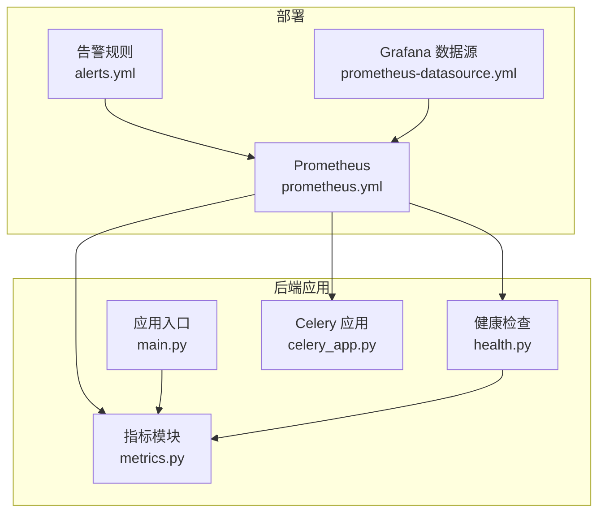
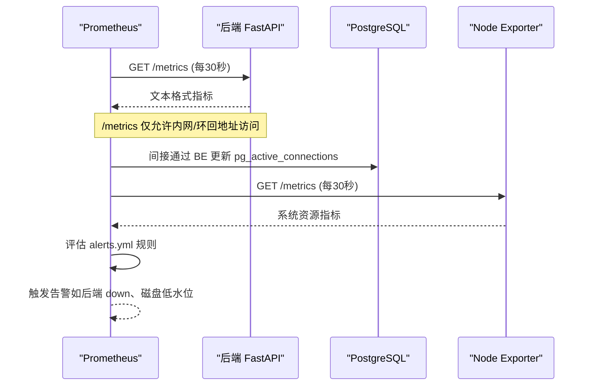
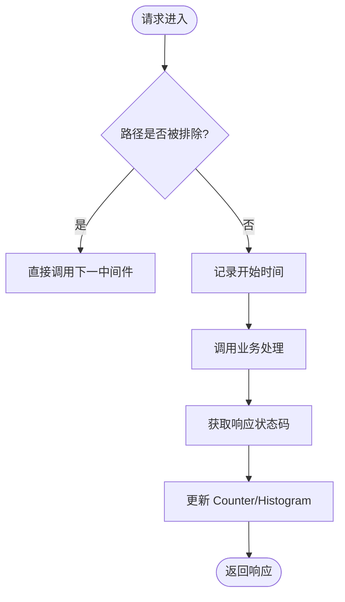
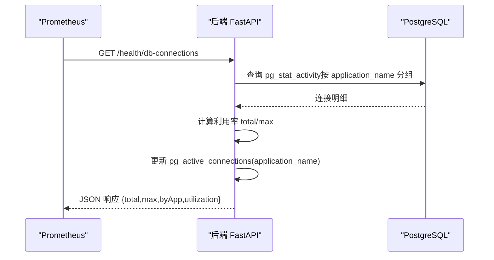
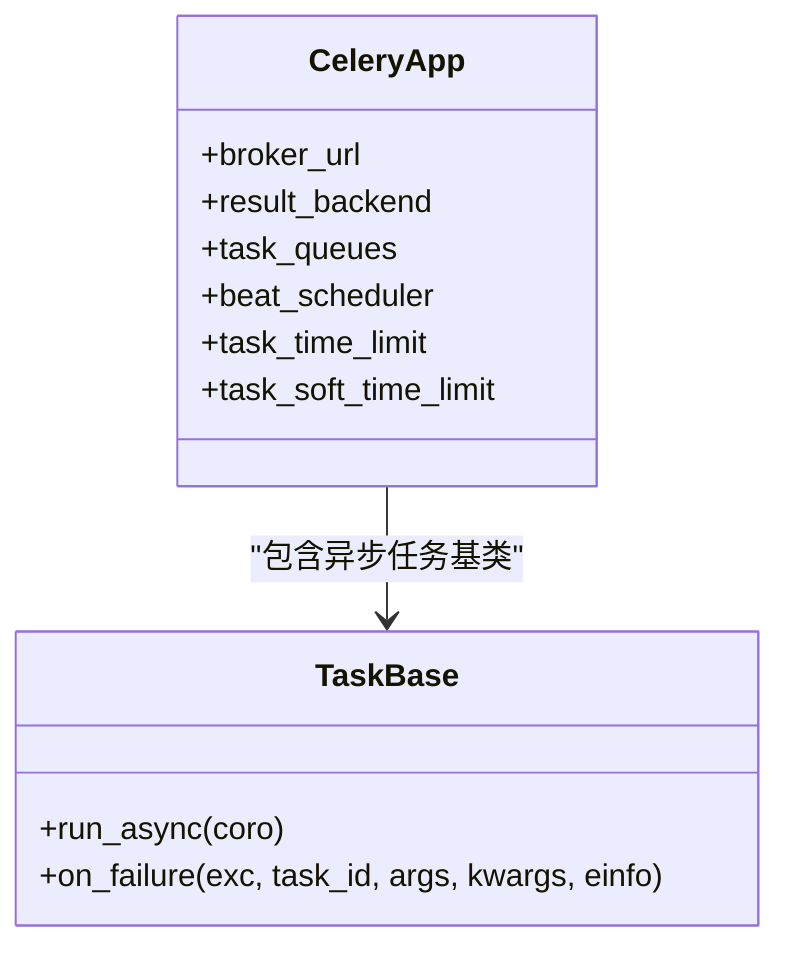
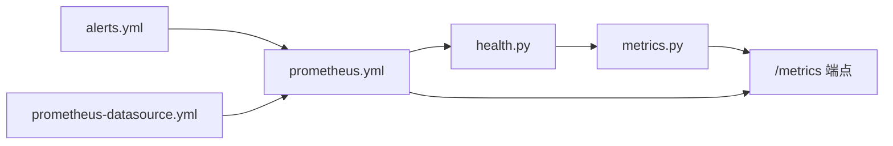

# Prometheus 指标采集

<cite>
**本文引用的文件**
- [prometheus.yml](file://deploy/prometheus/prometheus.yml)
- [alerts.yml](file://deploy/prometheus/alerts.yml)
- [metrics.py](file://backend/app/core/metrics.py)
- [main.py](file://backend/app/main.py)
- [health.py](file://backend/app/api/v1/endpoints/health.py)
- [celery_app.py](file://backend/app/tasks/celery_app.py)
- [prometheus-datasource.yml](file://deploy/grafana/provisioning/datasources/prometheus.yml)
</cite>

## 目录
1. [简介](#简介)
2. [项目结构](#项目结构)
3. [核心组件](#核心组件)
4. [架构总览](#架构总览)
5. [详细组件分析](#详细组件分析)
6. [依赖关系分析](#依赖关系分析)
7. [性能考量](#性能考量)
8. [故障排查指南](#故障排查指南)
9. [结论](#结论)
10. [附录：指标查询示例与最佳实践](#附录：指标查询示例与最佳实践)

## 简介
本文件为 CLPM-MVP 系统的 Prometheus 指标采集配置与实施指南，覆盖以下方面：
- Prometheus 服务器配置：抓取任务、目标发现、认证与安全访问控制。
- 自定义指标暴露：应用启动时注册、业务指标定义规范、性能指标收集策略。
- 监控目标配置：后端服务、数据库连接池、消息队列（Celery）状态。
- 指标命名规范与最佳实践：分类、标签设计、采样频率优化。
- 指标查询示例与常见故障排查方法。

## 项目结构
CLPM-MVP 的监控相关配置与实现主要分布在部署配置与应用代码中：
- 部署层：Prometheus 抓取配置、告警规则、Grafana 数据源。
- 应用层：FastAPI 中间件与 /metrics 端点、健康检查与 PG 连接数同步、Celery 任务基础能力。

图表来源
- [prometheus.yml:1-31](file://deploy/prometheus/prometheus.yml#L1-L31)
- [alerts.yml:1-55](file://deploy/prometheus/alerts.yml#L1-L55)
- [prometheus-datasource.yml:1-10](file://deploy/grafana/provisioning/datasources/prometheus.yml#L1-L10)
- [metrics.py:1-163](file://backend/app/core/metrics.py#L1-L163)
- [health.py:1-139](file://backend/app/api/v1/endpoints/health.py#L1-L139)
- [main.py:1-800](file://backend/app/main.py#L1-L800)
- [celery_app.py:1-251](file://backend/app/tasks/celery_app.py#L1-L251)

章节来源
- [prometheus.yml:1-31](file://deploy/prometheus/prometheus.yml#L1-L31)
- [alerts.yml:1-55](file://deploy/prometheus/alerts.yml#L1-L55)
- [prometheus-datasource.yml:1-10](file://deploy/grafana/provisioning/datasources/prometheus.yml#L1-L10)
- [metrics.py:1-163](file://backend/app/core/metrics.py#L1-L163)
- [health.py:1-139](file://backend/app/api/v1/endpoints/health.py#L1-L139)
- [main.py:1-800](file://backend/app/main.py#L1-L800)
- [celery_app.py:1-251](file://backend/app/tasks/celery_app.py#L1-L251)

## 核心组件
- Prometheus 抓取配置：定义全局抓取间隔、规则文件、以及三个抓取任务（后端、Prometheus 自身、Node Exporter）。
- 指标模块：定义 HTTP 请求计数与时序直方图、数据库连接池使用数、PG 活跃连接数、Celery 任务总数；提供中间件与 /metrics 挂载。
- 健康检查：提供就绪探针与 PG 连接池监控端点，并将 PG 活跃连接按 application_name 同步到 Prometheus Gauge。
- Celery 应用：配置任务队列、持久化调度、失败任务死信、超时保护等，为任务级指标提供基础。

章节来源
- [prometheus.yml:1-31](file://deploy/prometheus/prometheus.yml#L1-L31)
- [metrics.py:1-163](file://backend/app/core/metrics.py#L1-L163)
- [health.py:1-139](file://backend/app/api/v1/endpoints/health.py#L1-L139)
- [celery_app.py:1-251](file://backend/app/tasks/celery_app.py#L1-L251)

## 架构总览
Prometheus 通过静态目标抓取后端 /metrics 端点，同时抓取自身与 Node Exporter。后端通过中间件记录 HTTP 指标，并通过健康检查端点将 PG 连接数同步至 Prometheus。Celery 任务执行结果可通过任务失败率告警进行观测。

图表来源
- [prometheus.yml:1-31](file://deploy/prometheus/prometheus.yml#L1-L31)
- [metrics.py:1-163](file://backend/app/core/metrics.py#L1-L163)
- [health.py:1-139](file://backend/app/api/v1/endpoints/health.py#L1-L139)
- [alerts.yml:1-55](file://deploy/prometheus/alerts.yml#L1-L55)

## 详细组件分析

### Prometheus 抓取配置
- 全局设置：抓取间隔与评估间隔均为 30 秒。
- 抓取任务：
  - clpm-backend：抓取后端 /metrics，目标 backend:7101，附加 service=clpm-backend 标签。
  - prometheus：自监控 localhost:9090。
  - node：抓取宿主机指标 node-exporter:9100。
- 规则文件：引入 alerts.yml，用于基础告警。

章节来源
- [prometheus.yml:1-31](file://deploy/prometheus/prometheus.yml#L1-L31)
- [alerts.yml:1-55](file://deploy/prometheus/alerts.yml#L1-L55)

### 指标模块与 /metrics 安全访问
- 指标定义：
  - http_requests_total：HTTP 请求总数，标签 method/path/status。
  - http_request_duration_seconds：HTTP 请求耗时，标签 method/path。
  - db_pool_connections：数据库连接池使用数（兼容 NullPool 恒 0）。
  - pg_active_connections：PG 活跃连接数，标签 application_name。
  - celery_task_total：Celery 任务执行总数，标签 task_name/status。
- 中间件：
  - MetricsMiddleware 记录请求计数与耗时，排除 /metrics 与 /health。
  - 路由模板路径作为 path 标签，避免 UUID 等实参导致基数爆炸。
- /metrics 访问控制：
  - 仅放行内网/环回/Tailscale CGNAT 段，其他返回 403。
  - 不使用 JWT 认证，改用来源 IP 白名单。

图表来源
- [metrics.py:95-124](file://backend/app/core/metrics.py#L95-L124)

章节来源
- [metrics.py:1-163](file://backend/app/core/metrics.py#L1-L163)

### 健康检查与 PG 连接池监控
- /health：liveness 探针，进程存活即 ok。
- /health/ready：readiness 探针，检查 PostgreSQL/Redis/TDengine 连通性。
- /health/db-connections：查询 pg_stat_activity 按 application_name 分组统计活跃连接，并同步更新 pg_active_connections Gauge；返回 total/max/byApp/utilization。

图表来源
- [health.py:79-139](file://backend/app/api/v1/endpoints/health.py#L79-L139)
- [metrics.py:69-81](file://backend/app/core/metrics.py#L69-L81)

章节来源
- [health.py:1-139](file://backend/app/api/v1/endpoints/health.py#L1-L139)
- [metrics.py:69-81](file://backend/app/core/metrics.py#L69-L81)

### Celery 任务指标与告警
- 指标：celery_task_total（task_name/status），用于统计任务执行次数与失败情况。
- 告警：基于 10 分钟窗口计算失败率超过 10% 时触发警告。
- 任务可靠性：worker 崩溃重投、任务超时保护、死信队列、Beat 持久化调度。

图表来源
- [celery_app.py:24-84](file://backend/app/tasks/celery_app.py#L24-L84)
- [celery_app.py:90-126](file://backend/app/tasks/celery_app.py#L90-L126)

章节来源
- [celery_app.py:1-251](file://backend/app/tasks/celery_app.py#L1-L251)
- [alerts.yml:20-31](file://deploy/prometheus/alerts.yml#L20-L31)

### 应用启动与指标注册
- 应用入口在 lifespan 中完成日志初始化、Celery Beat/Worker 管理、数据源预载、实时订阅器启动等。
- 指标模块通过 setup_metrics 将 /metrics 挂载到 FastAPI，并在中间件中记录 HTTP 指标。

章节来源
- [main.py:610-763](file://backend/app/main.py#L610-L763)
- [metrics.py:148-152](file://backend/app/core/metrics.py#L148-L152)

## 依赖关系分析
- Prometheus 抓取后端 /metrics，依赖后端 /metrics 的安全访问控制与中间件。
- 健康检查端点依赖 PostgreSQL 连接，并将连接数同步到 Prometheus。
- 告警规则依赖指标可用性（无数据不触发）。
- Grafana 数据源指向 Prometheus，便于可视化。

图表来源
- [metrics.py:148-152](file://backend/app/core/metrics.py#L148-L152)
- [health.py:79-139](file://backend/app/api/v1/endpoints/health.py#L79-L139)
- [prometheus.yml:13-31](file://deploy/prometheus/prometheus.yml#L13-L31)
- [alerts.yml:1-55](file://deploy/prometheus/alerts.yml#L1-L55)
- [prometheus-datasource.yml:1-10](file://deploy/grafana/provisioning/datasources/prometheus.yml#L1-L10)

章节来源
- [prometheus.yml:13-31](file://deploy/prometheus/prometheus.yml#L13-L31)
- [alerts.yml:1-55](file://deploy/prometheus/alerts.yml#L1-L55)
- [prometheus-datasource.yml:1-10](file://deploy/grafana/provisioning/datasources/prometheus.yml#L1-L10)
- [metrics.py:148-152](file://backend/app/core/metrics.py#L148-L152)
- [health.py:79-139](file://backend/app/api/v1/endpoints/health.py#L79-L139)

## 性能考量
- 抓取间隔：全局 30 秒，适合大多数业务场景；可根据负载调整。
- 直方图分桶：http_request_duration_seconds 默认分桶适用于多数 API 延迟分布；如需更细粒度可自定义。
- 标签基数控制：path 使用路由模板而非原始路径，避免 UUID 等高频变化值导致时序爆炸。
- PG 连接数：pg_active_connections 通过健康检查端点周期性更新，避免频繁查询造成额外压力。
- Celery 任务：任务超时与失败重试机制保障稳定性；死信队列便于问题定位。

[本节为通用指导，不直接分析具体文件]

## 故障排查指南
- 后端不可达：
  - 现象：ClpmBackendDown 告警触发。
  - 排查：确认 backend:7101 容器运行状态、网络可达性与 /metrics 白名单。
- Celery 任务失败率高：
  - 现象：ClpmCeleryTaskFailureRateHigh 告警。
  - 排查：查看 worker 日志、死信队列、任务超时与重试配置。
- 磁盘空间不足：
  - 现象：ClpmNodeDiskLow 告警。
  - 排查：清理无用文件、归档日志、扩容磁盘。
- 抓取目标失联：
  - 现象：ClpmScrapeTargetDown 告警。
  - 排查：检查目标服务健康状态、端口监听、防火墙与网络策略。
- PG 连接池耗尽：
  - 现象：pg_active_connections 接近 max_connections。
  - 排查：通过 /health/db-connections 查看 byApp 明细，定位高连接应用；必要时调整连接池或应用并发。

章节来源
- [alerts.yml:10-55](file://deploy/prometheus/alerts.yml#L10-L55)
- [health.py:79-139](file://backend/app/api/v1/endpoints/health.py#L79-L139)

## 结论
CLPM-MVP 已具备完整的 Prometheus 指标采集与基础告警能力：
- 抓取配置清晰，覆盖后端、自身与宿主机。
- 指标定义涵盖 HTTP、数据库连接与任务执行。
- 安全访问控制确保 /metrics 不被外网访问。
- 告警规则提供关键风险预警。
建议后续根据业务增长逐步细化直方图分桶、增加更多业务指标与看板，并持续优化标签设计与抓取频率。

[本节为总结，不直接分析具体文件]

## 附录：指标查询示例与最佳实践

### 指标分类与命名规范
- 应用指标：
  - http_requests_total：请求总量，标签 method/path/status。
  - http_request_duration_seconds：请求耗时，标签 method/path。
- 基础设施指标：
  - db_pool_connections：连接池使用数（兼容 NullPool）。
  - pg_active_connections：PG 活跃连接数，标签 application_name。
- 任务指标：
  - celery_task_total：任务执行总数，标签 task_name/status。

### 标签设计原则
- 使用稳定、低基数的标签（method/path/status/application_name/task_name）。
- 避免将高频变化的业务 ID 作为标签；使用路由模板替代原始路径。
- 合理划分维度，便于聚合与过滤。

### 采样频率优化
- 全局抓取间隔 30 秒，适合大多数场景；对高吞吐服务可适当延长。
- 直方图观察周期建议与告警窗口一致（如 10 分钟）。

### 常用查询示例
- 后端不可达：up{job="clpm-backend"} == 0
- 请求错误率：sum(rate(http_requests_total{status=~"5.."}[5m])) / sum(rate(http_requests_total[5m]))
- 请求耗时 P95：histogram_quantile(0.95, rate(http_request_duration_seconds_bucket[5m]))
- PG 连接利用率：sum(pg_active_connections) / max(max_connections) * 100
- Celery 任务失败率：sum(rate(celery_task_total{status=~"failed|failure|error"}[10m])) / clamp_min(sum(rate(celery_task_total[10m])), 0.001)

[本节为通用指导，不直接分析具体文件]