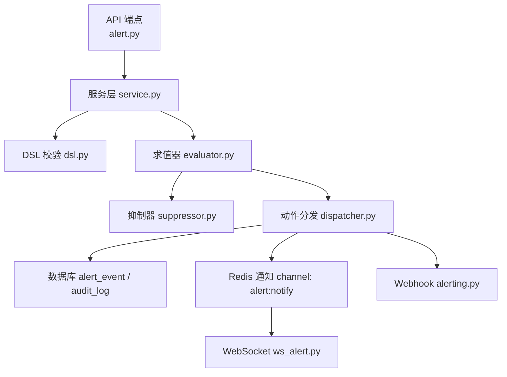
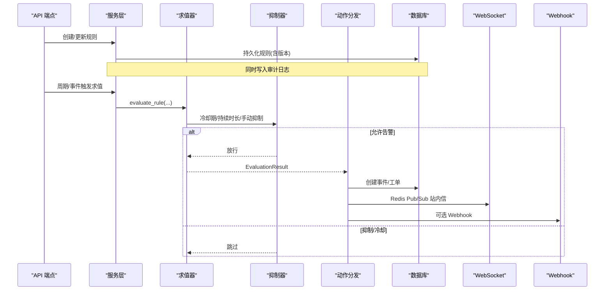
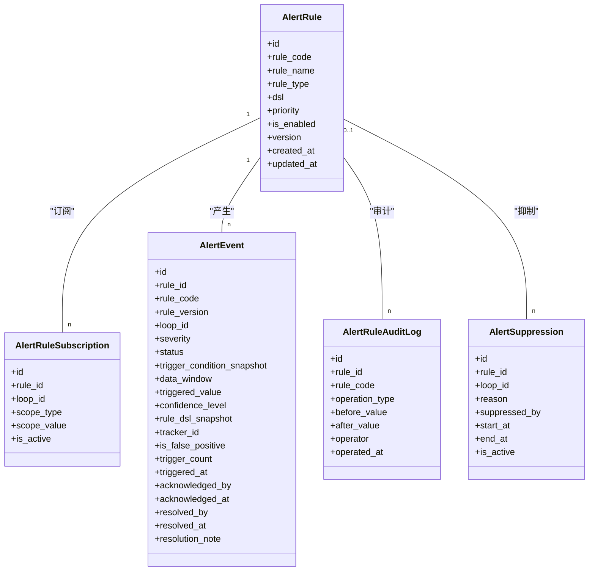
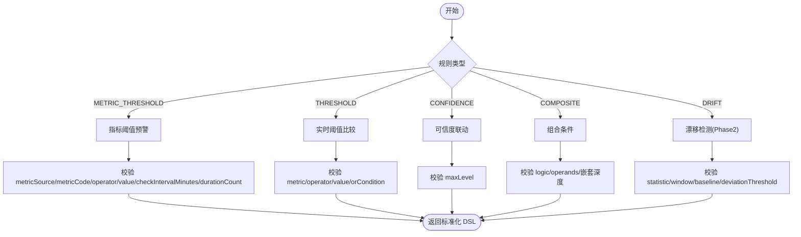
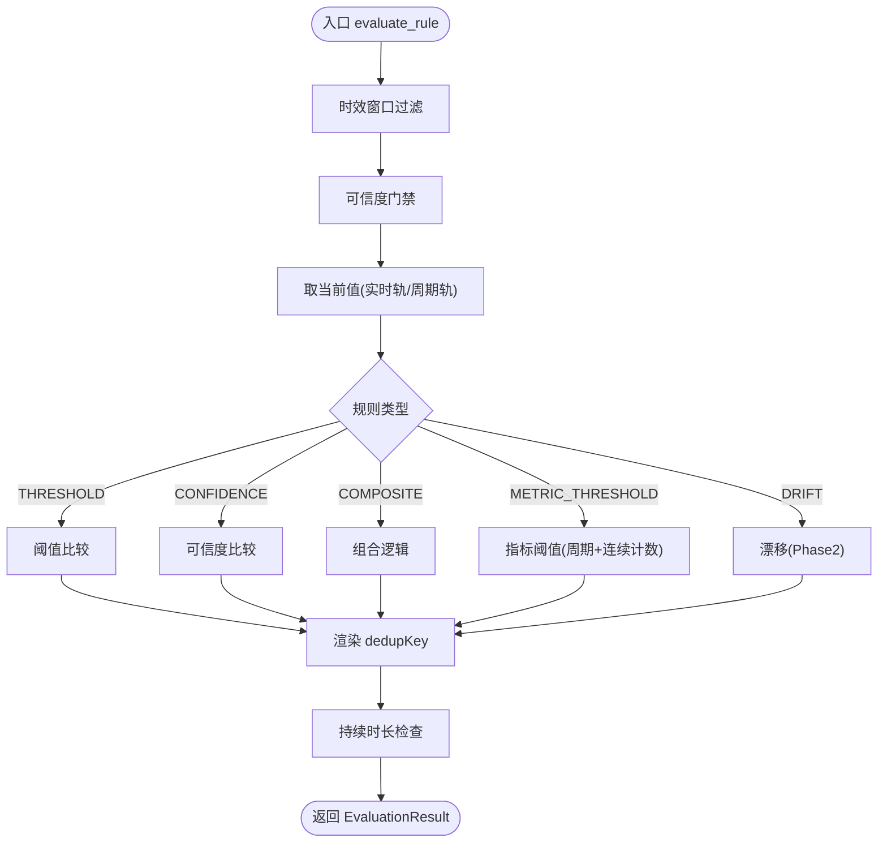
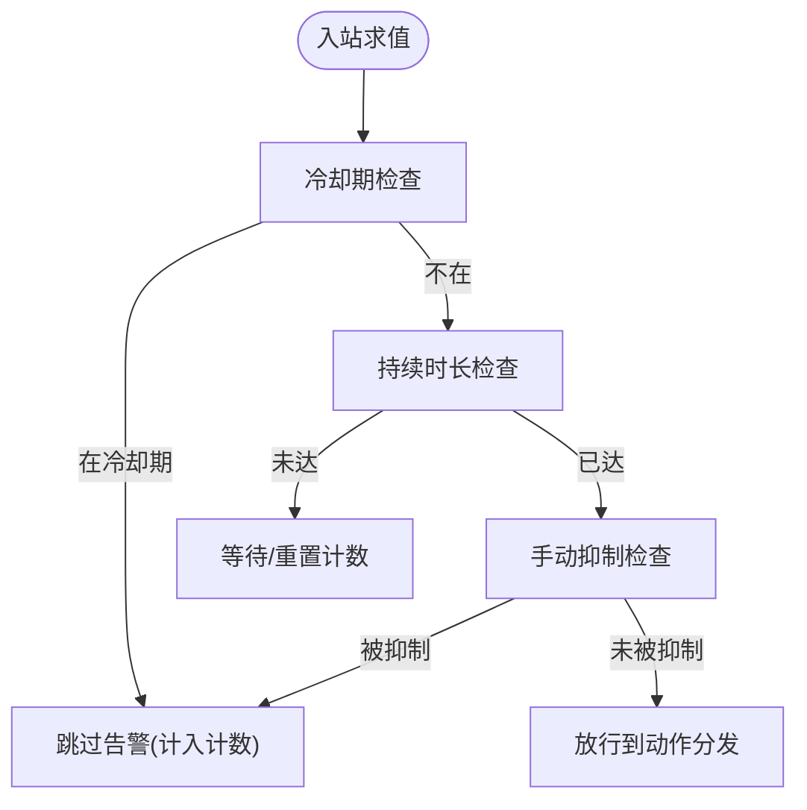
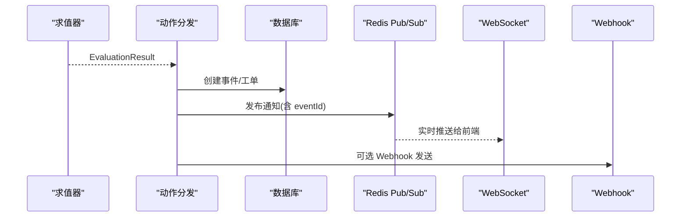
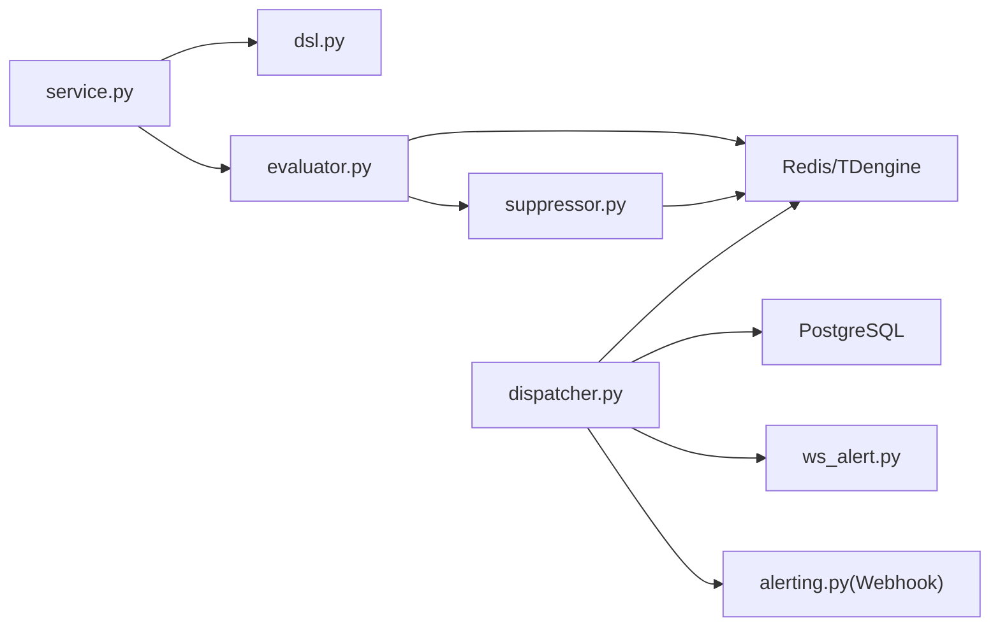

# 告警规则配置

<cite>
**本文引用的文件**
- [backend/app/models/alert.py](file://backend/app/models/alert.py)
- [backend/app/schemas/alert.py](file://backend/app/schemas/alert.py)
- [backend/app/services/alert_rule_engine/service.py](file://backend/app/services/alert_rule_engine/service.py)
- [backend/app/services/alert_rule_engine/evaluator.py](file://backend/app/services/alert_rule_engine/evaluator.py)
- [backend/app/services/alert_rule_engine/dsl.py](file://backend/app/services/alert_rule_engine/dsl.py)
- [backend/app/services/alert_rule_engine/suppressor.py](file://backend/app/services/alert_rule_engine/suppressor.py)
- [backend/app/services/alert_rule_engine/dispatcher.py](file://backend/app/services/alert_rule_engine/dispatcher.py)
- [backend/app/api/v1/endpoints/alert.py](file://backend/app/api/v1/endpoints/alert.py)
- [backend/app/api/v1/endpoints/ws_alert.py](file://backend/app/api/v1/endpoints/ws_alert.py)
- [backend/app/services/alerting.py](file://backend/app/services/alerting.py)
</cite>

## 目录
1. [简介](#简介)
2. [项目结构](#项目结构)
3. [核心组件](#核心组件)
4. [架构总览](#架构总览)
5. [详细组件分析](#详细组件分析)
6. [依赖关系分析](#依赖关系分析)
7. [性能与稳定性](#性能与稳定性)
8. [故障排查指南](#故障排查指南)
9. [结论](#结论)
10. [附录：常见场景配置示例](#附录：常见场景配置示例)

## 简介
本文件面向 CLPM-MVP 系统的“智能预警规则引擎”，提供完整的告警规则配置与使用指南。内容覆盖：
- 阈值配置策略、告警级别定义、规则表达式（DSL）编写规范
- 告警通知渠道：Webhook、站内信 WebSocket、移动端推送集成方式
- 抑制与去重：重复告警处理、静默期（冷却期）、维护窗口（时效窗口）
- 生命周期管理：规则版本控制、动态更新、历史事件查询与分析
- 常见告警场景配置示例与故障定位指导

## 项目结构
后端围绕“规则 DSL → 求值 → 抑制/去重 → 动作分发 → 持久化与通知”的链路组织代码：
- 模型层：规则、订阅、事件、审计日志、手动抑制
- 服务层：CRUD 服务、DSL 校验、求值器、抑制器、动作分发
- API 层：规则/订阅/事件/抑制/审计/开关/徽章等 REST 接口，以及 WebSocket 实时推送
- 通知层：Webhook 发送、Redis Pub/Sub 站内信广播

图表来源
- [backend/app/api/v1/endpoints/alert.py:1-467](file://backend/app/api/v1/endpoints/alert.py#L1-L467)
- [backend/app/services/alert_rule_engine/service.py:1-750](file://backend/app/services/alert_rule_engine/service.py#L1-L750)
- [backend/app/services/alert_rule_engine/dsl.py:1-581](file://backend/app/services/alert_rule_engine/dsl.py#L1-L581)
- [backend/app/services/alert_rule_engine/evaluator.py:1-678](file://backend/app/services/alert_rule_engine/evaluator.py#L1-L678)
- [backend/app/services/alert_rule_engine/suppressor.py:1-246](file://backend/app/services/alert_rule_engine/suppressor.py#L1-L246)
- [backend/app/services/alert_rule_engine/dispatcher.py:1-362](file://backend/app/services/alert_rule_engine/dispatcher.py#L1-L362)
- [backend/app/api/v1/endpoints/ws_alert.py:1-129](file://backend/app/api/v1/endpoints/ws_alert.py#L1-L129)
- [backend/app/services/alerting.py:1-67](file://backend/app/services/alerting.py#L1-L67)

章节来源
- [backend/app/api/v1/endpoints/alert.py:1-467](file://backend/app/api/v1/endpoints/alert.py#L1-L467)
- [backend/app/services/alert_rule_engine/service.py:1-750](file://backend/app/services/alert_rule_engine/service.py#L1-L750)

## 核心组件
- 规则模型与数据表：规则定义、订阅关系、事件记录、审计日志、手动抑制
- DSL 校验器：统一校验规则结构与取值范围
- 求值器：时效窗口、可信度门禁、条件求值、持续时长检查
- 抑制器：冷却期、持续时长去抖、手动抑制、节流、徽章计数
- 动作分发：创建事件、工单、通知、触发诊断
- API 与 WebSocket：规则/事件/抑制/审计/开关/徽章 CRUD，实时推送

章节来源
- [backend/app/models/alert.py:1-264](file://backend/app/models/alert.py#L1-L264)
- [backend/app/schemas/alert.py:1-277](file://backend/app/schemas/alert.py#L1-L277)
- [backend/app/services/alert_rule_engine/dsl.py:1-581](file://backend/app/services/alert_rule_engine/dsl.py#L1-L581)
- [backend/app/services/alert_rule_engine/evaluator.py:1-678](file://backend/app/services/alert_rule_engine/evaluator.py#L1-L678)
- [backend/app/services/alert_rule_engine/suppressor.py:1-246](file://backend/app/services/alert_rule_engine/suppressor.py#L1-L246)
- [backend/app/services/alert_rule_engine/dispatcher.py:1-362](file://backend/app/services/alert_rule_engine/dispatcher.py#L1-L362)
- [backend/app/api/v1/endpoints/alert.py:1-467](file://backend/app/api/v1/endpoints/alert.py#L1-L467)
- [backend/app/api/v1/endpoints/ws_alert.py:1-129](file://backend/app/api/v1/endpoints/ws_alert.py#L1-L129)
- [backend/app/services/alerting.py:1-67](file://backend/app/services/alerting.py#L1-L67)

## 架构总览
预警引擎采用“规则驱动 + 可插拔动作”的流水线架构：
- 规则 DSL 由 API 创建/更新，经 DSL 校验后持久化
- 周期巡检或事件触发时，按回路加载订阅规则并批量求值
- 求值结果经抑制器判定是否告警；通过后进入动作分发
- 动作包括：写事件、建工单、发通知、触发诊断；最终通过 Redis Pub/Sub 推送到前端 WebSocket 或 Webhook

图表来源
- [backend/app/api/v1/endpoints/alert.py:1-467](file://backend/app/api/v1/endpoints/alert.py#L1-L467)
- [backend/app/services/alert_rule_engine/service.py:1-750](file://backend/app/services/alert_rule_engine/service.py#L1-L750)
- [backend/app/services/alert_rule_engine/evaluator.py:1-678](file://backend/app/services/alert_rule_engine/evaluator.py#L1-L678)
- [backend/app/services/alert_rule_engine/suppressor.py:1-246](file://backend/app/services/alert_rule_engine/suppressor.py#L1-L246)
- [backend/app/services/alert_rule_engine/dispatcher.py:1-362](file://backend/app/services/alert_rule_engine/dispatcher.py#L1-L362)
- [backend/app/api/v1/endpoints/ws_alert.py:1-129](file://backend/app/api/v1/endpoints/ws_alert.py#L1-L129)
- [backend/app/services/alerting.py:1-67](file://backend/app/services/alerting.py#L1-L67)

## 详细组件分析

### 数据模型与版本控制
- 规则定义：包含 rule_code、rule_type、dsl、priority、is_enabled、version 等字段；支持启用/停用与版本自增
- 订阅关系：支持 ALL/LOOP/PLANT/CONTROL_TYPE 范围，ALL 在求值时展开为活跃回路集合
- 事件记录：状态机 ACTIVE → ACKNOWLEDGED → RESOLVED → ARCHIVED；分支 SUPPRESSED；记录触发快照、严重度、置信度、触发次数等
- 审计日志：记录所有规则变更操作（CREATE/UPDATE/ENABLE/DISABLE/DELETE），便于追溯
- 手动抑制：按规则×回路的时段抑制，到期自动失效

图表来源
- [backend/app/models/alert.py:1-264](file://backend/app/models/alert.py#L1-L264)

章节来源
- [backend/app/models/alert.py:1-264](file://backend/app/models/alert.py#L1-L264)

### DSL 与规则表达式
- 支持的规则类型：METRIC_THRESHOLD（主推）、THRESHOLD、DRIFT、COMPOSITE、CONFIDENCE
- 通用字段：durationSeconds、cooldownSeconds、severity、confidencePolicy、timeWindow、actions、priority、dedupKey
- METRIC_THRESHOLD 条件：metricSource(KPI/DIAGNOSIS)、metricCode、operator(>, >=, <, <=)、value、checkIntervalMinutes、durationCount
- 组合逻辑：AND/OR/NOT/SEQUENCE（SEQUENCE 需 Phase 2 完整实现）
- dedupKey 模板变量：loop_id、rule_id、tag_code、severity

图表来源
- [backend/app/services/alert_rule_engine/dsl.py:1-581](file://backend/app/services/alert_rule_engine/dsl.py#L1-L581)

章节来源
- [backend/app/services/alert_rule_engine/dsl.py:1-581](file://backend/app/services/alert_rule_engine/dsl.py#L1-L581)

### 求值流程与阈值策略
- 时效窗口过滤：基于 cron 的小时/分钟段判断（Phase 1 简化）
- 可信度门禁：根据 confidencePolicy 的 maxLevel 与 action（SUPPRESS/DOWNGRADE）决定是否跳过或降级
- 条件求值：
  - THRESHOLD：数值比较或枚举比较
  - CONFIDENCE：当实际可信度劣于阈值时触发
  - COMPOSITE：AND/OR/NOT 组合（SEQUENCE 待完善）
  - METRIC_THRESHOLD：按监测周期检查 KPI/诊断指标，支持连续超限计数
- 持续时长检查：首次满足记录时间戳，达到 durationSeconds 才告警
- 去重键渲染：dedupKey 模板渲染用于冷却期与去重

图表来源
- [backend/app/services/alert_rule_engine/evaluator.py:1-678](file://backend/app/services/alert_rule_engine/evaluator.py#L1-L678)
- [backend/app/services/alert_rule_engine/dsl.py:1-581](file://backend/app/services/alert_rule_engine/dsl.py#L1-L581)

章节来源
- [backend/app/services/alert_rule_engine/evaluator.py:1-678](file://backend/app/services/alert_rule_engine/evaluator.py#L1-L678)

### 抑制、去重与维护窗口
- 冷却期（cooldownSeconds）：同一 dedupKey 在冷却期内不重复告警，但计入 trigger_count 用于严重度升级
- 持续时长（durationSeconds）：条件需持续满足指定时长才触发，避免瞬时抖动
- 手动抑制：按规则×回路设置起止时间，到期自动失效；支持全规则/全回路抑制
- 实时轨节流：每回路固定间隔内最多求值一次，降低负载
- 维护窗口（timeWindow）：仅在指定时间段生效，减少非工作时间告警

图表来源
- [backend/app/services/alert_rule_engine/suppressor.py:1-246](file://backend/app/services/alert_rule_engine/suppressor.py#L1-L246)
- [backend/app/services/alert_rule_engine/evaluator.py:1-678](file://backend/app/services/alert_rule_engine/evaluator.py#L1-L678)

章节来源
- [backend/app/services/alert_rule_engine/suppressor.py:1-246](file://backend/app/services/alert_rule_engine/suppressor.py#L1-L246)

### 动作分发与通知渠道
- CREATE_EVENT：写入事件表，携带触发快照、严重度、置信度、触发次数等
- CREATE_TRACKER：自动创建异常跟踪工单，并与事件关联
- NOTIFY：发布 Redis Pub/Sub 消息至“alert:notify”，供 WebSocket 客户端接收；同时递增相关用户徽章计数
- TRIGGER_DIAGNOSIS：事件驱动诊断，带防抖与窗口钳制
- Webhook：通过 alerting.send_alert 将告警发送到外部系统（如企业 IM、邮件网关等）

图表来源
- [backend/app/services/alert_rule_engine/dispatcher.py:1-362](file://backend/app/services/alert_rule_engine/dispatcher.py#L1-L362)
- [backend/app/api/v1/endpoints/ws_alert.py:1-129](file://backend/app/api/v1/endpoints/ws_alert.py#L1-L129)
- [backend/app/services/alerting.py:1-67](file://backend/app/services/alerting.py#L1-L67)

章节来源
- [backend/app/services/alert_rule_engine/dispatcher.py:1-362](file://backend/app/services/alert_rule_engine/dispatcher.py#L1-L362)
- [backend/app/api/v1/endpoints/ws_alert.py:1-129](file://backend/app/api/v1/endpoints/ws_alert.py#L1-L129)
- [backend/app/services/alerting.py:1-67](file://backend/app/services/alerting.py#L1-L67)

### API 与生命周期管理
- 规则生命周期：创建→启用→更新(版本号自增)→停用→删除；每次变更写入审计日志
- 订阅管理：按规则绑定回路或范围，支持批量展开
- 事件处置：确认、处置、归档、标记误报；支持分页与多维筛选
- 全局开关：sys_config 中 alert.global_enabled 控制引擎启停
- Dry-Run：对已有规则或自定义 DSL 试运行，仅返回求值结果，不创建事件

章节来源
- [backend/app/api/v1/endpoints/alert.py:1-467](file://backend/app/api/v1/endpoints/alert.py#L1-L467)
- [backend/app/services/alert_rule_engine/service.py:1-750](file://backend/app/services/alert_rule_engine/service.py#L1-L750)

## 依赖关系分析
- 模块耦合：
  - service.py 聚合 CRUD 与业务编排，依赖 dsl.py、cache、audit、suppressor
  - evaluator.py 依赖 Redis/TDengine 获取实时/周期数据，调用 suppressor 进行抑制判定
  - dispatcher.py 依赖数据库、Redis、任务系统（诊断）与用户角色解析
  - ws_alert.py 订阅 Redis 通道，认证后推送消息
- 外部依赖：
  - Redis：冷却期、持续时长、节流、徽章计数、Pub/Sub 通知
  - PostgreSQL：规则、订阅、事件、审计、抑制、用户、KPI/诊断最新值
  - HTTP 客户端：Webhook 发送

图表来源
- [backend/app/services/alert_rule_engine/service.py:1-750](file://backend/app/services/alert_rule_engine/service.py#L1-L750)
- [backend/app/services/alert_rule_engine/evaluator.py:1-678](file://backend/app/services/alert_rule_engine/evaluator.py#L1-L678)
- [backend/app/services/alert_rule_engine/suppressor.py:1-246](file://backend/app/services/alert_rule_engine/suppressor.py#L1-L246)
- [backend/app/services/alert_rule_engine/dispatcher.py:1-362](file://backend/app/services/alert_rule_engine/dispatcher.py#L1-L362)
- [backend/app/api/v1/endpoints/ws_alert.py:1-129](file://backend/app/api/v1/endpoints/ws_alert.py#L1-L129)
- [backend/app/services/alerting.py:1-67](file://backend/app/services/alerting.py#L1-L67)

章节来源
- [backend/app/services/alert_rule_engine/service.py:1-750](file://backend/app/services/alert_rule_engine/service.py#L1-L750)
- [backend/app/services/alert_rule_engine/evaluator.py:1-678](file://backend/app/services/alert_rule_engine/evaluator.py#L1-L678)
- [backend/app/services/alert_rule_engine/suppressor.py:1-246](file://backend/app/services/alert_rule_engine/suppressor.py#L1-L246)
- [backend/app/services/alert_rule_engine/dispatcher.py:1-362](file://backend/app/services/alert_rule_engine/dispatcher.py#L1-L362)
- [backend/app/api/v1/endpoints/ws_alert.py:1-129](file://backend/app/api/v1/endpoints/ws_alert.py#L1-L129)
- [backend/app/services/alerting.py:1-67](file://backend/app/services/alerting.py#L1-L67)

## 性能与稳定性
- 节流与缓存：
  - 实时轨节流：每回路固定间隔内最多求值一次，避免高频风暴
  - 指标阈值预警：Redis SETNX 实现周期节流，避免重复查询
  - 批量求值：同回路共享一次当前值读取，降低 Redis 压力
- 容错与降级：
  - Redis 不可用时，冷却期/持续时长/节流均降级放行，保证主链路可用
  - 指标取值失败或陈旧数据直接跳过，避免误报
- 严重度升级：
  - 基于冷却期内重复触发次数，超过阈值自动升级一级，直至 CRITICAL
- 资源保护：
  - DSL 长度限制、嵌套深度限制、窗口/持续时间上限，防止恶意或错误配置导致过载

章节来源
- [backend/app/services/alert_rule_engine/evaluator.py:1-678](file://backend/app/services/alert_rule_engine/evaluator.py#L1-L678)
- [backend/app/services/alert_rule_engine/suppressor.py:1-246](file://backend/app/services/alert_rule_engine/suppressor.py#L1-L246)
- [backend/app/services/alert_rule_engine/dsl.py:1-581](file://backend/app/services/alert_rule_engine/dsl.py#L1-L581)

## 故障排查指南
- 规则无法触发
  - 检查 timeWindow.enabled 与 cron 配置是否正确
  - 检查 confidencePolicy.maxLevel 与 action 是否导致抑制或降级
  - 检查 durationSeconds 是否过长导致未达到触发条件
  - 使用 Dry-Run 接口验证求值结果与当前值
- 告警风暴
  - 调整 cooldownSeconds 与 dedupKey 模板，确保去重粒度合理
  - 开启/调整持续时长 durationSeconds，避免瞬时抖动
  - 检查手动抑制是否误配
- 通知未到达
  - 确认 Redis Pub/Sub 通道“alert:notify”正常
  - 检查 WebSocket 连接是否认证成功（token 有效且未拉黑）
  - Webhook 发送失败不影响主流程，查看日志定位网络或目标服务问题
- 事件处置异常
  - 事件状态机约束：仅特定状态可执行确认/处置/归档
  - 审计日志可查看规则变更与操作人信息

章节来源
- [backend/app/api/v1/endpoints/alert.py:1-467](file://backend/app/api/v1/endpoints/alert.py#L1-L467)
- [backend/app/services/alert_rule_engine/service.py:1-750](file://backend/app/services/alert_rule_engine/service.py#L1-L750)
- [backend/app/services/alert_rule_engine/evaluator.py:1-678](file://backend/app/services/alert_rule_engine/evaluator.py#L1-L678)
- [backend/app/services/alert_rule_engine/suppressor.py:1-246](file://backend/app/services/alert_rule_engine/suppressor.py#L1-L246)
- [backend/app/api/v1/endpoints/ws_alert.py:1-129](file://backend/app/api/v1/endpoints/ws_alert.py#L1-L129)
- [backend/app/services/alerting.py:1-67](file://backend/app/services/alerting.py#L1-L67)

## 结论
CLPM-MVP 的预警规则引擎以 DSL 为核心，结合严格的校验、灵活的求值与抑制机制，实现了高可靠、可扩展的告警体系。通过版本化规则、审计日志与 Dry-Run 能力，保障规则变更的可控性与可回溯性；通过多通道通知（WebSocket 站内信、Webhook）与徽章计数，提升运维响应效率。建议在生产环境中：
- 优先使用 METRIC_THRESHOLD 规则，结合 checkIntervalMinutes 与 durationCount 控制频率与稳定性
- 合理设置 cooldownSeconds 与 dedupKey，避免告警风暴
- 利用 timeWindow 与手动抑制，配合维护窗口与计划作业
- 定期审查事件与审计日志，优化阈值与策略

## 附录：常见场景配置示例
以下为典型告警场景的配置要点（字段名与取值范围依据 DSL 校验与求值逻辑）：

- 指标阈值预警（KPI 评分低于阈值）
  - ruleType: METRIC_THRESHOLD
  - condition.metricSource: KPI
  - condition.metricCode: score
  - condition.operator: "<"
  - condition.value: 设定阈值
  - condition.checkIntervalMinutes: 5~1440
  - condition.durationCount: 1~10
  - actions: 至少包含 CREATE_EVENT 与 NOTIFY
  - severity: WARN/ERROR/CRITICAL
  - cooldownSeconds: 建议 ≥ 1800
  - dedupKey: "${loop_id}+${rule_id}"

- 实时阈值预警（PV 超上限）
  - ruleType: THRESHOLD
  - condition.metric: PV
  - condition.operator: ">"
  - condition.value: 数值或百分比字符串（百分比需 Phase 2 量程换算）
  - durationSeconds: >0 时须 ≥120s
  - actions: CREATE_EVENT + NOTIFY
  - severity: WARN/ERROR/CRITICAL
  - cooldownSeconds: 根据业务调整

- 可信度联动（数据质量低）
  - ruleType: CONFIDENCE
  - condition.maxLevel: 例如 "C"
  - confidencePolicy.action: SUPPRESS 或 DOWNGRADE
  - actions: CREATE_EVENT + NOTIFY
  - severity: INFO/WARN（降级后可继续）

- 组合条件（AND/OR/NOT）
  - ruleType: COMPOSITE
  - condition.logic: AND/OR/NOT
  - condition.operands: 多个子条件（THRESHOLD/CONFIDENCE/COMPOSITE）
  - 注意嵌套深度不超过 3 层

- 时序组合（SEQUENCE，Phase 2）
  - ruleType: COMPOSITE
  - condition.logic: SEQUENCE
  - condition.first/then/withinSeconds: 定义先后事件与时窗
  - 当前 Phase 1 校验通过但求值暂不支持

- 维护窗口（timeWindow）
  - timeWindow.enabled: true
  - timeWindow.cron: 例如 "0 8-20 * * *"（小时段）
  - 仅在窗口内生效，减少非工作时间告警

- 手动抑制（维护作业）
  - 通过 API 创建抑制记录，设置 rule_id/loop_id、reason、duration_minutes
  - 到期自动失效，期间该规则×回路不产生告警

- 通知渠道
  - 站内信：通过 Redis Pub/Sub 推送至 WebSocket，前端订阅“alert:notify”
  - Webhook：配置 ALERT_WEBHOOK_URL，发送失败不影响主流程，仅记录日志
  - 移动端推送：可在 Webhook 目标侧对接第三方推送服务（如企业 IM、短信、App Push）

章节来源
- [backend/app/services/alert_rule_engine/dsl.py:1-581](file://backend/app/services/alert_rule_engine/dsl.py#L1-L581)
- [backend/app/services/alert_rule_engine/evaluator.py:1-678](file://backend/app/services/alert_rule_engine/evaluator.py#L1-L678)
- [backend/app/services/alert_rule_engine/dispatcher.py:1-362](file://backend/app/services/alert_rule_engine/dispatcher.py#L1-L362)
- [backend/app/api/v1/endpoints/alert.py:1-467](file://backend/app/api/v1/endpoints/alert.py#L1-L467)
- [backend/app/api/v1/endpoints/ws_alert.py:1-129](file://backend/app/api/v1/endpoints/ws_alert.py#L1-L129)
- [backend/app/services/alerting.py:1-67](file://backend/app/services/alerting.py#L1-L67)