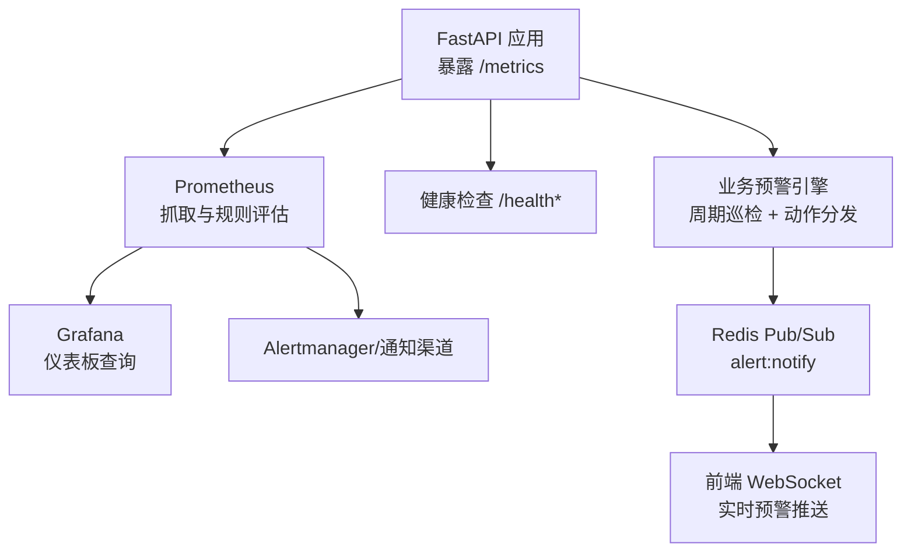
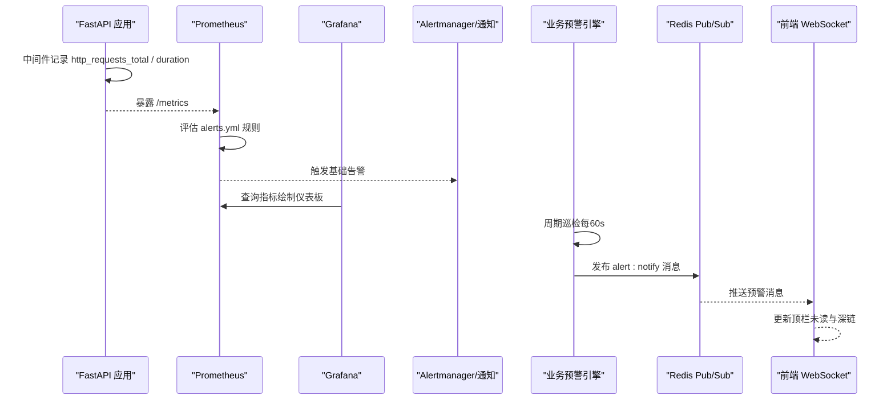
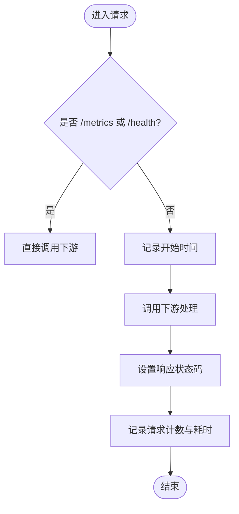
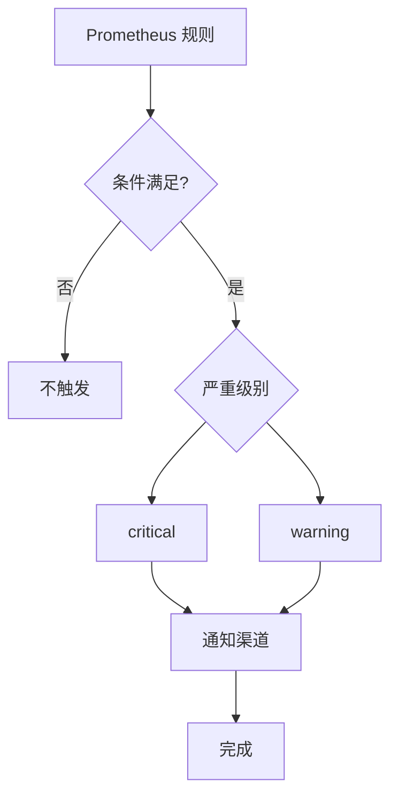
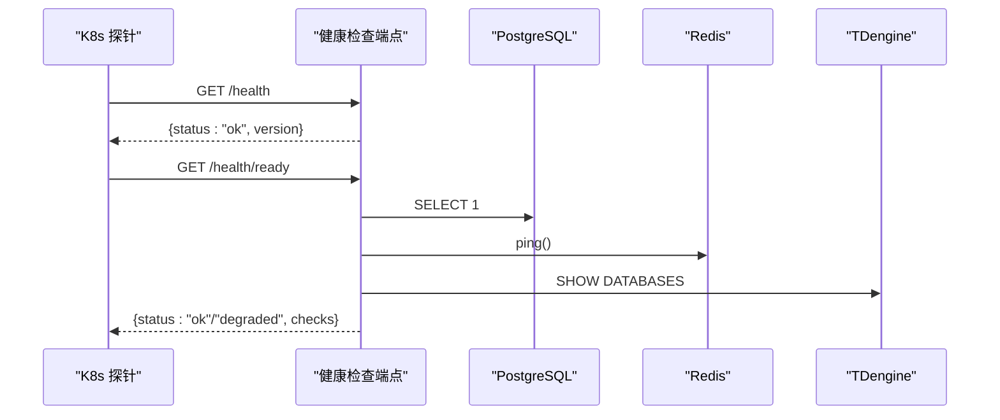
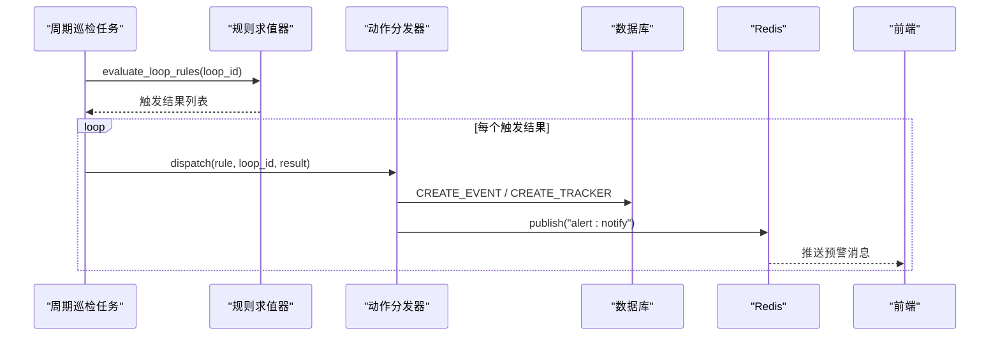
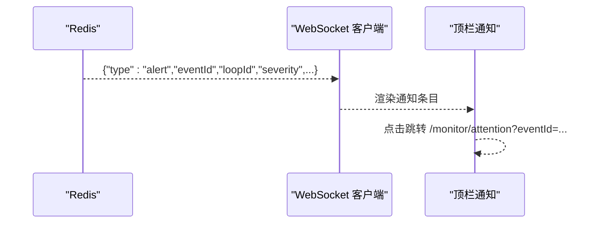
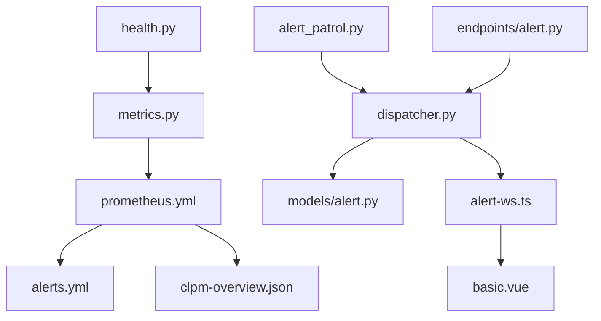

# 监控告警

<cite>
**本文引用的文件**
- [backend/app/core/metrics.py](file://backend/app/core/metrics.py)
- [backend/app/api/v1/endpoints/health.py](file://backend/app/api/v1/endpoints/health.py)
- [deploy/prometheus/prometheus.yml](file://deploy/prometheus/prometheus.yml)
- [deploy/prometheus/alerts.yml](file://deploy/prometheus/alerts.yml)
- [deploy/grafana/dashboards/clpm-overview.json](file://deploy/grafana/dashboards/clpm-overview.json)
- [backend/app/services/alerting.py](file://backend/app/services/alerting.py)
- [backend/app/tasks/alert_patrol.py](file://backend/app/tasks/alert_patrol.py)
- [backend/app/services/alert_rule_engine/dispatcher.py](file://backend/app/services/alert_rule_engine/dispatcher.py)
- [backend/app/models/alert.py](file://backend/app/models/alert.py)
- [backend/app/api/v1/endpoints/alert.py](file://backend/app/api/v1/endpoints/alert.py)
- [frontend/apps/web-antd/src/utils/alert-ws.ts](file://frontend/apps/web-antd/src/utils/alert-ws.ts)
- [frontend/apps/web-antd/src/layouts/basic.vue](file://frontend/apps/web-antd/src/layouts/basic.vue)
</cite>

## 目录
1. [简介](#简介)
2. [项目结构](#项目结构)
3. [核心组件](#核心组件)
4. [架构总览](#架构总览)
5. [详细组件分析](#详细组件分析)
6. [依赖关系分析](#依赖关系分析)
7. [性能考量](#性能考量)
8. [故障排查指南](#故障排查指南)
9. [结论](#结论)
10. [附录](#附录)

## 简介
本文件为 CLPM-MVP 系统的监控与告警体系提供完整说明，覆盖 Prometheus 指标采集、Grafana 仪表板配置、告警规则设计、系统健康监控、告警通知策略以及数据分析与故障定位方法。目标是帮助读者快速理解并落地“可观测性 + 智能预警”的最小闭环：后端暴露指标 → Prometheus 抓取与规则评估 → Grafana 可视化 → 业务预警引擎（规则求值、动作分发、站内信推送）→ 前端实时展示与处置。

## 项目结构
CLPM 的监控与告警由以下关键部分组成：
- 应用指标与中间件：在 FastAPI 中定义并暴露 /metrics，记录 HTTP 请求计数、耗时、数据库连接池、Celery 任务等。
- 健康检查端点：提供 Liveness/Readiness 探针，检查 PostgreSQL、Redis、TDengine 连通性，并暴露 PG 连接池使用率。
- Prometheus 抓取与告警：集中配置抓取目标与基础告警规则（后端 down、任务失败率、磁盘水位、抓取目标失联）。
- Grafana 仪表板：预置“CLPM 系统总览”，包含 QPS、延迟 P95、状态码分布、Celery 任务速率与成功率、DB 连接数等。
- 业务预警引擎：周期巡检任务对订阅回路进行规则求值，触发事件、工单、诊断、站内信通知等动作。
- 前端实时通知：通过 WebSocket 接收预警消息，顶栏铃铛展示未读数并可深链到关注队列。

图表来源
- [backend/app/core/metrics.py:57-87](file://backend/app/core/metrics.py#L57-L87)
- [deploy/prometheus/prometheus.yml:13-31](file://deploy/prometheus/prometheus.yml#L13-L31)
- [deploy/prometheus/alerts.yml:7-55](file://deploy/prometheus/alerts.yml#L7-L55)
- [deploy/grafana/dashboards/clpm-overview.json:22-108](file://deploy/grafana/dashboards/clpm-overview.json#L22-L108)
- [backend/app/tasks/alert_patrol.py:64-128](file://backend/app/tasks/alert_patrol.py#L64-L128)
- [backend/app/services/alert_rule_engine/dispatcher.py:215-262](file://backend/app/services/alert_rule_engine/dispatcher.py#L215-L262)
- [frontend/apps/web-antd/src/utils/alert-ws.ts:27-48](file://frontend/apps/web-antd/src/utils/alert-ws.ts#L27-L48)

章节来源
- [backend/app/core/metrics.py:1-163](file://backend/app/core/metrics.py#L1-L163)
- [backend/app/api/v1/endpoints/health.py:1-138](file://backend/app/api/v1/endpoints/health.py#L1-L138)
- [deploy/prometheus/prometheus.yml:1-31](file://deploy/prometheus/prometheus.yml#L1-L31)
- [deploy/prometheus/alerts.yml:1-55](file://deploy/prometheus/alerts.yml#L1-L55)
- [deploy/grafana/dashboards/clpm-overview.json:1-628](file://deploy/grafana/dashboards/clpm-overview.json#L1-L628)
- [backend/app/tasks/alert_patrol.py:1-246](file://backend/app/tasks/alert_patrol.py#L1-L246)
- [backend/app/services/alert_rule_engine/dispatcher.py:1-362](file://backend/app/services/alert_rule_engine/dispatcher.py#L1-L362)
- [frontend/apps/web-antd/src/utils/alert-ws.ts:1-48](file://frontend/apps/web-antd/src/utils/alert-ws.ts#L1-L48)

## 核心组件
- 指标采集与访问控制
  - 定义 HTTP 请求总数、耗时直方图、数据库连接池 Gauge、PG 活跃连接 Gauge、Celery 任务计数器。
  - 通过中间件统计请求计数与耗时，排除 /metrics 和 /health 路径以避免自引用噪声。
  - /metrics 仅允许内网地址访问（含 Tailscale CGNAT 段），防止外部探测内部指标。
- 健康检查
  - /health：进程存活即返回 ok。
  - /health/ready：检查 PostgreSQL、Redis、TDengine 连通性，任一失败返回 503 degraded。
  - /health/db-connections：查询 pg_stat_activity，按 application_name 分组暴露 PG 活跃连接数至 Prometheus。
- Prometheus 抓取与基础告警
  - 抓取目标：clpm-backend（/metrics）、prometheus 自身、node-exporter（宿主机资源）。
  - 基础告警：后端 down、Celery 任务失败率 > 10%、根分区可用空间 < 15%、抓取目标失联。
- Grafana 仪表板
  - 预置“CLPM 系统总览”：QPS、P95 延迟、状态码分布、Celery 任务速率与成功率、DB 连接数。
  - 数据源变量 DS_PROMETHEUS 支持多实例切换。
- 业务预警引擎
  - 周期巡检任务每 60s 遍历活跃订阅回路，读取最新可信度等级，批量求值规则，执行抑制/冷却/去重后分发动作。
  - 动作包括：创建事件、创建跟踪工单、发布通知（Redis pub/sub）、触发自动诊断。
  - 严重度随重复触发次数升级；冷却期避免重复告警。
- 前端实时通知
  - WebSocket 客户端连接 /api/v1/ws/alerts，接收 alert 类型消息，渲染顶栏通知并支持深链到关注队列。

章节来源
- [backend/app/core/metrics.py:57-87](file://backend/app/core/metrics.py#L57-L87)
- [backend/app/core/metrics.py:95-151](file://backend/app/core/metrics.py#L95-L151)
- [backend/app/api/v1/endpoints/health.py:26-138](file://backend/app/api/v1/endpoints/health.py#L26-L138)
- [deploy/prometheus/prometheus.yml:13-31](file://deploy/prometheus/prometheus.yml#L13-L31)
- [deploy/prometheus/alerts.yml:7-55](file://deploy/prometheus/alerts.yml#L7-L55)
- [deploy/grafana/dashboards/clpm-overview.json:22-588](file://deploy/grafana/dashboards/clpm-overview.json#L22-L588)
- [backend/app/tasks/alert_patrol.py:64-128](file://backend/app/tasks/alert_patrol.py#L64-L128)
- [backend/app/services/alert_rule_engine/dispatcher.py:40-102](file://backend/app/services/alert_rule_engine/dispatcher.py#L40-L102)
- [frontend/apps/web-antd/src/utils/alert-ws.ts:27-48](file://frontend/apps/web-antd/src/utils/alert-ws.ts#L27-L48)

## 架构总览
下图展示了从指标采集到可视化、再到业务预警与前端展示的端到端流程。

图表来源
- [backend/app/core/metrics.py:95-151](file://backend/app/core/metrics.py#L95-L151)
- [deploy/prometheus/alerts.yml:7-55](file://deploy/prometheus/alerts.yml#L7-L55)
- [deploy/grafana/dashboards/clpm-overview.json:22-108](file://deploy/grafana/dashboards/clpm-overview.json#L22-L108)
- [backend/app/tasks/alert_patrol.py:232-241](file://backend/app/tasks/alert_patrol.py#L232-L241)
- [backend/app/services/alert_rule_engine/dispatcher.py:215-262](file://backend/app/services/alert_rule_engine/dispatcher.py#L215-L262)
- [frontend/apps/web-antd/src/utils/alert-ws.ts:27-48](file://frontend/apps/web-antd/src/utils/alert-ws.ts#L27-L48)

## 详细组件分析

### Prometheus 指标采集
- 自定义指标暴露
  - HTTP 请求计数与耗时：通过中间件在每次请求完成后记录 method/path/status 标签，避免 UUID 等实参导致基数爆炸。
  - 数据库连接池：db_pool_connections 兼容 NullPool；pg_active_connections 通过查询 pg_stat_activity 暴露真实活跃连接数。
  - Celery 任务：celery_task_total 以 task_name、status 为标签，便于计算成功率与失败率。
- 访问控制
  - /metrics 仅放行内网地址（含 Tailscale CGNAT 段），非内网请求返回 403。
- 健康检查
  - /health：Liveness 探针，进程存活即 ok。
  - /health/ready：Readiness 探针，检查 PG/Redis/TDengine 连通性，任一失败返回 503 degraded。
  - /health/db-connections：按 application_name 分组暴露 PG 活跃连接数，用于容量与瓶颈分析。

图表来源
- [backend/app/core/metrics.py:95-124](file://backend/app/core/metrics.py#L95-L124)
- [backend/app/core/metrics.py:131-151](file://backend/app/core/metrics.py#L131-L151)
- [backend/app/api/v1/endpoints/health.py:26-138](file://backend/app/api/v1/endpoints/health.py#L26-L138)

章节来源
- [backend/app/core/metrics.py:1-163](file://backend/app/core/metrics.py#L1-L163)
- [backend/app/api/v1/endpoints/health.py:1-138](file://backend/app/api/v1/endpoints/health.py#L1-L138)

### Grafana 仪表板配置
- 预置仪表板使用
  - “CLPM 系统总览”包含 QPS、P95 延迟、状态码分布、Celery 任务速率与成功率、DB 连接数等面板。
  - 数据源变量 DS_PROMETHEUS 支持动态选择 Prometheus 实例。
- 自定义仪表板创建
  - 基于现有面板模板扩展新指标（如新增业务指标时复制并修改 expr 表达式）。
  - 建议统一命名规范与标签维度，便于跨环境复用。
- 数据源配置
  - 在 Grafana 中添加 Prometheus 数据源，并在仪表板中使用变量绑定，确保多实例切换能力。

图表来源
- [deploy/grafana/dashboards/clpm-overview.json:22-108](file://deploy/grafana/dashboards/clpm-overview.json#L22-L108)
- [deploy/grafana/dashboards/clpm-overview.json:189-203](file://deploy/grafana/dashboards/clpm-overview.json#L189-L203)
- [deploy/grafana/dashboards/clpm-overview.json:322-336](file://deploy/grafana/dashboards/clpm-overview.json#L322-L336)
- [deploy/grafana/dashboards/clpm-overview.json:409-423](file://deploy/grafana/dashboards/clpm-overview.json#L409-L423)
- [deploy/grafana/dashboards/clpm-overview.json:506-520](file://deploy/grafana/dashboards/clpm-overview.json#L506-L520)
- [deploy/grafana/dashboards/clpm-overview.json:573-587](file://deploy/grafana/dashboards/clpm-overview.json#L573-L587)

章节来源
- [deploy/grafana/dashboards/clpm-overview.json:1-628](file://deploy/grafana/dashboards/clpm-overview.json#L1-L628)

### 告警规则设计
- 阈值配置
  - 后端 down：up{job="clpm-backend"} == 0 持续 2 分钟。
  - Celery 任务失败率：最近 10 分钟失败率 > 10%。
  - 磁盘水位：根分区可用空间 < 15% 持续 10 分钟。
  - 抓取目标失联：任意 up == 0 持续 5 分钟。
- 告警级别
  - critical：后端不可用。
  - warning：任务失败率、磁盘水位、抓取目标失联。
- 通知渠道集成
  - Alertmanager 可对接邮件、Webhook、移动端推送（根据部署配置）。
  - 应用级 Webhook：send_alert 支持 info/warning/critical 三级，URL 为空时仅记录日志。

图表来源
- [deploy/prometheus/alerts.yml:7-55](file://deploy/prometheus/alerts.yml#L7-L55)
- [backend/app/services/alerting.py:22-66](file://backend/app/services/alerting.py#L22-L66)

章节来源
- [deploy/prometheus/alerts.yml:1-55](file://deploy/prometheus/alerts.yml#L1-L55)
- [backend/app/services/alerting.py:1-67](file://backend/app/services/alerting.py#L1-L67)

### 系统健康监控
- 应用状态监控
  - /health：Liveness 探针，简单快速。
  - /health/ready：Readiness 探针，检查 PG/Redis/TDengine 连通性。
- 数据库连接监控
  - /health/db-connections：查询 pg_stat_activity，按 application_name 分组暴露 pg_active_connections 指标。
- 消息队列监控
  - Celery 任务成功率与失败率通过 celery_task_total 指标在 Grafana 中观察。
  - 若 Redis 不可用，通知发布异常被捕获，不影响主流程但会记录错误日志。

图表来源
- [backend/app/api/v1/endpoints/health.py:26-76](file://backend/app/api/v1/endpoints/health.py#L26-L76)
- [backend/app/api/v1/endpoints/health.py:79-138](file://backend/app/api/v1/endpoints/health.py#L79-L138)

章节来源
- [backend/app/api/v1/endpoints/health.py:1-138](file://backend/app/api/v1/endpoints/health.py#L1-L138)

### 业务预警引擎与通知策略
- 周期巡检
  - 每 60s 遍历活跃订阅回路，读取最新可信度等级，批量求值规则。
  - 对触发结果执行手动抑制检查、冷却期检查、持续时长去抖，再分发动作。
- 动作分发
  - CREATE_EVENT：写入事件表，设置冷却期，严重度随重复触发次数升级。
  - CREATE_TRACKER：创建跟踪工单，避免重复建单。
  - NOTIFY：发布 Redis pub/sub 消息，提升用户徽章计数。
  - TRIGGER_DIAGNOSIS：事件驱动诊断，防抖窗口 6h，窗口钳制 [1h, 7d]。
- 通知渠道
  - 站内信：Redis pub/sub → 前端 WebSocket 实时推送。
  - Webhook：send_alert 支持外部系统集成（邮件、IM、移动端推送等）。

图表来源
- [backend/app/tasks/alert_patrol.py:64-128](file://backend/app/tasks/alert_patrol.py#L64-L128)
- [backend/app/services/alert_rule_engine/dispatcher.py:40-102](file://backend/app/services/alert_rule_engine/dispatcher.py#L40-L102)
- [backend/app/services/alert_rule_engine/dispatcher.py:215-262](file://backend/app/services/alert_rule_engine/dispatcher.py#L215-L262)
- [frontend/apps/web-antd/src/utils/alert-ws.ts:27-48](file://frontend/apps/web-antd/src/utils/alert-ws.ts#L27-L48)

章节来源
- [backend/app/tasks/alert_patrol.py:1-246](file://backend/app/tasks/alert_patrol.py#L1-L246)
- [backend/app/services/alert_rule_engine/dispatcher.py:1-362](file://backend/app/services/alert_rule_engine/dispatcher.py#L1-L362)
- [frontend/apps/web-antd/src/utils/alert-ws.ts:1-48](file://frontend/apps/web-antd/src/utils/alert-ws.ts#L1-L48)

### 前端实时通知与处置
- 顶栏通知
  - 接收 alert 类型消息，显示 severity、ruleCode、triggeredValue、triggeredAt 等信息。
  - 点击跳转到关注队列，携带 eventId 实现深链定位。
- 徽章计数
  - 后台按角色广播通知，递增相关用户的未读徽章计数。

图表来源
- [backend/app/services/alert_rule_engine/dispatcher.py:215-262](file://backend/app/services/alert_rule_engine/dispatcher.py#L215-L262)
- [frontend/apps/web-antd/src/utils/alert-ws.ts:27-48](file://frontend/apps/web-antd/src/utils/alert-ws.ts#L27-L48)
- [frontend/apps/web-antd/src/layouts/basic.vue:43-69](file://frontend/apps/web-antd/src/layouts/basic.vue#L43-L69)

章节来源
- [frontend/apps/web-antd/src/utils/alert-ws.ts:1-48](file://frontend/apps/web-antd/src/utils/alert-ws.ts#L1-L48)
- [frontend/apps/web-antd/src/layouts/basic.vue:43-69](file://frontend/apps/web-antd/src/layouts/basic.vue#L43-L69)

## 依赖关系分析
- 指标与中间件
  - metrics.py 定义指标与中间件，挂载 /metrics，限制访问来源。
- 健康检查与指标联动
  - health.py 查询 pg_stat_activity 并更新 pg_active_connections 指标。
- Prometheus 与 Grafana
  - prometheus.yml 配置抓取目标与规则；alerts.yml 定义基础告警。
  - clpm-overview.json 使用 Prometheus 数据源展示指标。
- 业务预警引擎
  - alert_patrol.py 调度周期巡检；dispatcher.py 执行动作；models/alert.py 定义规则模型。
  - endpoints/alert.py 提供规则 CRUD、事件查询、抑制管理、全局开关、徽章接口。
- 前端与通知
  - alert-ws.ts 连接 WebSocket 接收预警；basic.vue 将消息转换为通知项并支持深链。

图表来源
- [backend/app/core/metrics.py:1-163](file://backend/app/core/metrics.py#L1-L163)
- [backend/app/api/v1/endpoints/health.py:1-138](file://backend/app/api/v1/endpoints/health.py#L1-L138)
- [deploy/prometheus/prometheus.yml:1-31](file://deploy/prometheus/prometheus.yml#L1-L31)
- [deploy/prometheus/alerts.yml:1-55](file://deploy/prometheus/alerts.yml#L1-L55)
- [deploy/grafana/dashboards/clpm-overview.json:1-628](file://deploy/grafana/dashboards/clpm-overview.json#L1-L628)
- [backend/app/tasks/alert_patrol.py:1-246](file://backend/app/tasks/alert_patrol.py#L1-L246)
- [backend/app/services/alert_rule_engine/dispatcher.py:1-362](file://backend/app/services/alert_rule_engine/dispatcher.py#L1-L362)
- [backend/app/models/alert.py:44-71](file://backend/app/models/alert.py#L44-L71)
- [backend/app/api/v1/endpoints/alert.py:1-467](file://backend/app/api/v1/endpoints/alert.py#L1-L467)
- [frontend/apps/web-antd/src/utils/alert-ws.ts:1-48](file://frontend/apps/web-antd/src/utils/alert-ws.ts#L1-L48)
- [frontend/apps/web-antd/src/layouts/basic.vue:43-69](file://frontend/apps/web-antd/src/layouts/basic.vue#L43-L69)

章节来源
- [backend/app/core/metrics.py:1-163](file://backend/app/core/metrics.py#L1-L163)
- [backend/app/api/v1/endpoints/health.py:1-138](file://backend/app/api/v1/endpoints/health.py#L1-L138)
- [deploy/prometheus/prometheus.yml:1-31](file://deploy/prometheus/prometheus.yml#L1-L31)
- [deploy/prometheus/alerts.yml:1-55](file://deploy/prometheus/alerts.yml#L1-L55)
- [deploy/grafana/dashboards/clpm-overview.json:1-628](file://deploy/grafana/dashboards/clpm-overview.json#L1-L628)
- [backend/app/tasks/alert_patrol.py:1-246](file://backend/app/tasks/alert_patrol.py#L1-L246)
- [backend/app/services/alert_rule_engine/dispatcher.py:1-362](file://backend/app/services/alert_rule_engine/dispatcher.py#L1-L362)
- [backend/app/models/alert.py:44-71](file://backend/app/models/alert.py#L44-L71)
- [backend/app/api/v1/endpoints/alert.py:1-467](file://backend/app/api/v1/endpoints/alert.py#L1-L467)
- [frontend/apps/web-antd/src/utils/alert-ws.ts:1-48](file://frontend/apps/web-antd/src/utils/alert-ws.ts#L1-L48)
- [frontend/apps/web-antd/src/layouts/basic.vue:43-69](file://frontend/apps/web-antd/src/layouts/basic.vue#L43-L69)

## 性能考量
- 指标采集
  - 使用路由模板作为 path 标签，避免 UUID 等实参导致时间序列基数爆炸。
  - 排除 /metrics 和 /health 路径，减少自引用开销。
- 健康检查
  - Readiness 探针并行检查 PG/Redis/TDengine，任一失败降级返回 503。
  - PG 连接池监控通过 pg_stat_activity 获取真实连接数，避免 NullPool 下 db_pool_connections 恒 0 的误导。
- 业务预警
  - 周期巡检节流：同一回路 5s 内已求值则跳过，避免实时轨与周期轨并发重复。
  - 冷却期与去抖：基于 dedup_key 设置冷却期，避免重复告警风暴。
  - 动作独立 try/except：单个动作失败不阻塞其他动作，提高鲁棒性。
- 前端通知
  - WebSocket 自动重连与心跳，保障弱网下的稳定性。
  - 徽章计数按角色广播，Phase 1 简化实现，后续可扩展精准推送。

[本节为通用指导，无需特定文件来源]

## 故障排查指南
- 后端不可用
  - 检查 Prometheus 抓取目标 up 指标；查看 ClpmBackendDown 告警。
  - 验证 /health 与 /health/ready 响应，确认依赖服务连通性。
- 任务失败率高
  - 查看 Celery 任务失败率面板与 ClpmCeleryTaskFailureRateHigh 告警。
  - 检查 worker 日志与重试退避策略。
- 磁盘水位低
  - 关注 ClpmNodeDiskLow 告警，清理无用文件或扩容。
- 抓取目标失联
  - 检查 node-exporter 与 Prometheus 自身可达性，确认网络与端口。
- 预警未触发
  - 确认规则 DSL 与阈值配置；使用 dry-run 试运行验证求值逻辑。
  - 检查抑制与冷却期是否生效；查看事件与工单是否已存在。
- 通知未到达
  - 检查 Redis 连通性与 alert:notify 频道；查看 dispatcher 日志中的发布异常。
  - 前端 WebSocket 连接是否正常，重连机制是否工作。

章节来源
- [deploy/prometheus/alerts.yml:7-55](file://deploy/prometheus/alerts.yml#L7-L55)
- [backend/app/api/v1/endpoints/health.py:26-138](file://backend/app/api/v1/endpoints/health.py#L26-L138)
- [backend/app/services/alert_rule_engine/dispatcher.py:215-262](file://backend/app/services/alert_rule_engine/dispatcher.py#L215-L262)
- [frontend/apps/web-antd/src/utils/alert-ws.ts:27-48](file://frontend/apps/web-antd/src/utils/alert-ws.ts#L27-L48)

## 结论
CLPM-MVP 的监控与告警体系以 Prometheus 为核心，结合 Grafana 可视化与业务预警引擎，形成“可观测性 + 智能预警”的最小闭环。通过标准化的指标采集、健康检查、基础告警与业务规则求值，系统能够及时发现异常、自动触达相关人员并联动诊断与工单流程。未来可进一步扩展精准通知、更多业务指标与更复杂的规则组合，以提升运维效率与系统稳定性。

[本节为总结，无需特定文件来源]

## 附录
- 指标清单
  - http_requests_total：HTTP 请求总数（method、path、status）。
  - http_request_duration_seconds：HTTP 请求耗时（method、path）。
  - db_pool_connections：数据库连接池使用数（兼容 NullPool）。
  - pg_active_connections：PostgreSQL 活跃连接数（application_name）。
  - celery_task_total：Celery 任务执行总数（task_name、status）。
- 健康检查端点
  - /health：Liveness 探针。
  - /health/ready：Readiness 探针（PG/Redis/TDengine）。
  - /health/db-connections：PG 连接池监控。
- 告警规则
  - ClpmBackendDown：后端 down。
  - ClpmCeleryTaskFailureRateHigh：任务失败率 > 10%。
  - ClpmNodeDiskLow：磁盘水位 < 15%。
  - ClpmScrapeTargetDown：抓取目标失联。
- 仪表板
  - CLPM 系统总览：QPS、P95 延迟、状态码分布、Celery 任务速率与成功率、DB 连接数。

章节来源
- [backend/app/core/metrics.py:57-87](file://backend/app/core/metrics.py#L57-L87)
- [backend/app/api/v1/endpoints/health.py:26-138](file://backend/app/api/v1/endpoints/health.py#L26-L138)
- [deploy/prometheus/alerts.yml:7-55](file://deploy/prometheus/alerts.yml#L7-L55)
- [deploy/grafana/dashboards/clpm-overview.json:22-588](file://deploy/grafana/dashboards/clpm-overview.json#L22-L588)