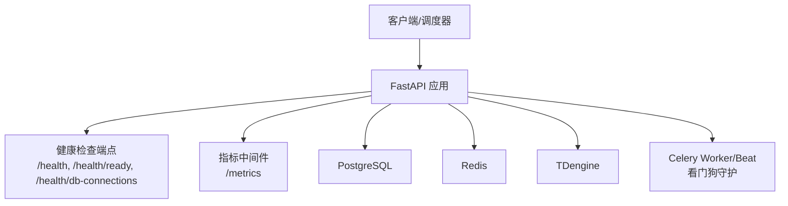
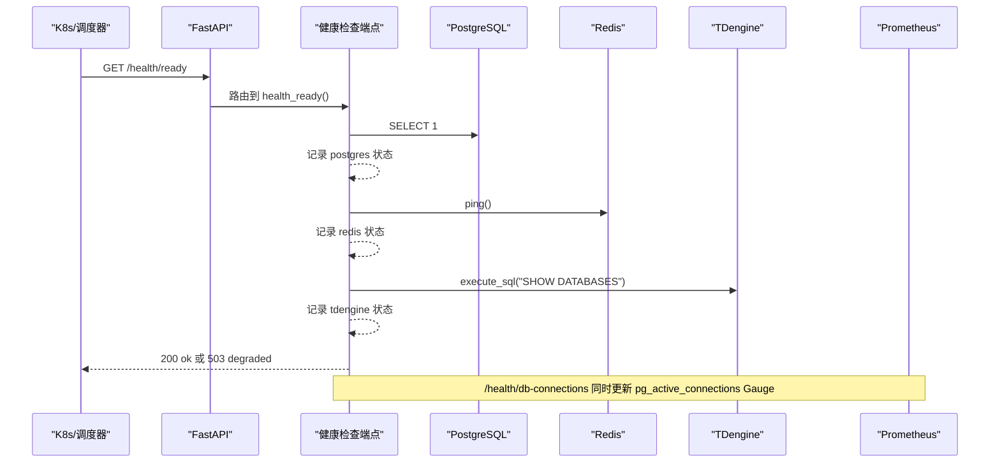
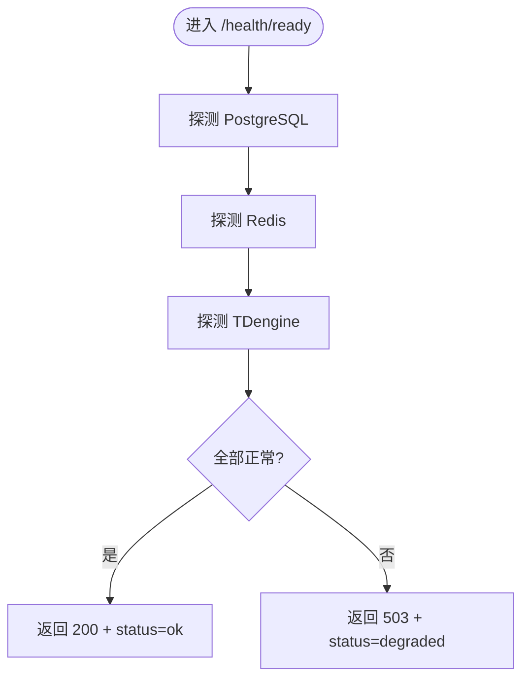
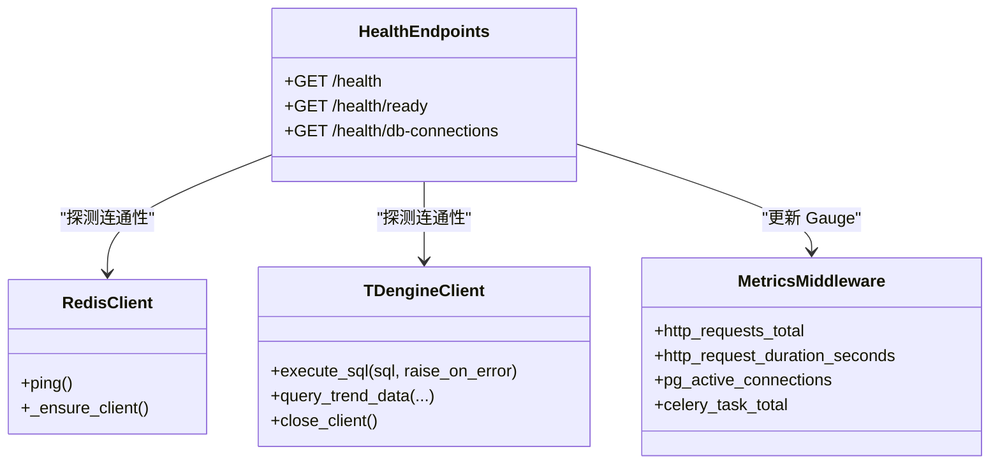
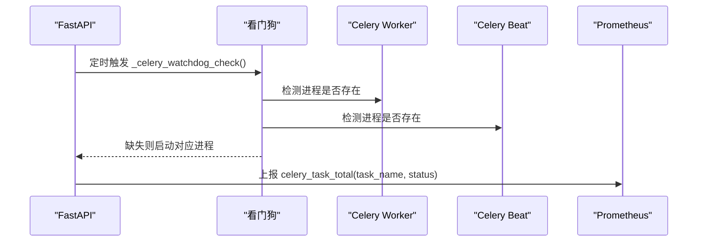
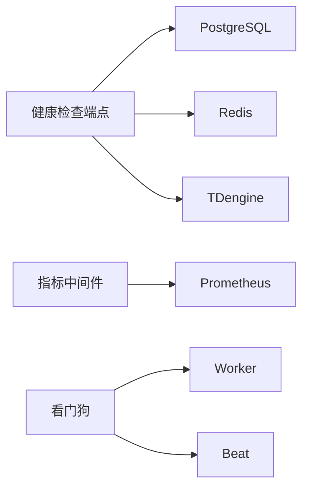

# 系统健康监控

<cite>
**本文引用的文件**
- [backend/app/api/v1/endpoints/health.py](file://backend/app/api/v1/endpoints/health.py)
- [backend/app/core/metrics.py](file://backend/app/core/metrics.py)
- [backend/app/core/redis.py](file://backend/app/core/redis.py)
- [backend/app/core/tdengine.py](file://backend/app/core/tdengine.py)
- [backend/app/main.py](file://backend/app/main.py)
- [backend/tests/test_celery_worker_governance.py](file://backend/tests/test_celery_worker_governance.py)
- [backend/app/services/monitor.py](file://backend/app/services/monitor.py)
- [backend/app/api/v1/endpoints/node_performance.py](file://backend/app/api/v1/endpoints/node_performance.py)
- [backend/app/services/node_performance.py](file://backend/app/services/node_performance.py)
</cite>

## 目录
1. [简介](#简介)
2. [项目结构](#项目结构)
3. [核心组件](#核心组件)
4. [架构总览](#架构总览)
5. [详细组件分析](#详细组件分析)
6. [依赖关系分析](#依赖关系分析)
7. [性能考量](#性能考量)
8. [故障诊断指南](#故障诊断指南)
9. [结论](#结论)
10. [附录](#附录)

## 简介
本文件面向 CLPM-MVP 系统的运行期健康与可观测性，覆盖应用健康检查、基础设施监控、消息队列（Celery）监控、系统资源监控，以及健康检查 API 的使用方法与常见故障定位。文档基于后端代码实现进行说明，确保读者能据此搭建或接入 Prometheus/Grafana、Kubernetes 探针与运维告警体系。

## 项目结构
CLPM-MVP 的健康与监控能力主要分布在以下位置：
- 健康检查端点：/health、/health/ready、/health/db-connections
- 指标采集：/metrics（Prometheus），HTTP 中间件统计请求量与时延
- 依赖服务探测：PostgreSQL、Redis、TDengine
- Celery Worker/Beat 看门狗：进程缺失自动补拉起
- 节点性能与监控聚合：回路/装置级 KPI 快照与状态分布

图表来源
- [backend/app/api/v1/endpoints/health.py:26-76](file://backend/app/api/v1/endpoints/health.py#L26-L76)
- [backend/app/core/metrics.py:95-151](file://backend/app/core/metrics.py#L95-L151)
- [backend/app/main.py:564-591](file://backend/app/main.py#L564-L591)

章节来源
- [backend/app/api/v1/endpoints/health.py:1-139](file://backend/app/api/v1/endpoints/health.py#L1-L139)
- [backend/app/core/metrics.py:1-163](file://backend/app/core/metrics.py#L1-L163)
- [backend/app/main.py:558-591](file://backend/app/main.py#L558-L591)

## 核心组件
- 健康检查端点
  - Liveness：/health，进程存活即返回 ok
  - Readiness：/health/ready，校验 PostgreSQL、Redis、TDengine 连通性，任一失败返回 503 + degraded
  - DB 连接池：/health/db-connections，查询 pg_stat_activity，按 application_name 分组并更新 Prometheus Gauge
- 指标采集
  - HTTP 请求计数与时延直方图
  - PG 活跃连接数 Gauge（按 application_name）
  - Celery 任务总数计数器
  - /metrics 仅允许内网访问（IP 白名单）
- Redis 客户端
  - 单例代理，自动检测 event loop 变化并重建客户端，避免跨任务复用导致“Event loop is closed”
- TDengine 客户端
  - REST 调用封装，连接复用与异常降级；支持 raise_on_error 区分“数据源不可用”和“无数据”
- Celery 看门狗
  - 周期性检测 Worker/Beat 进程，缺失则自动补拉起，形成自愈闭环

章节来源
- [backend/app/api/v1/endpoints/health.py:26-139](file://backend/app/api/v1/endpoints/health.py#L26-L139)
- [backend/app/core/metrics.py:57-87](file://backend/app/core/metrics.py#L57-L87)
- [backend/app/core/redis.py:29-151](file://backend/app/core/redis.py#L29-L151)
- [backend/app/core/tdengine.py:44-50](file://backend/app/core/tdengine.py#L44-L50)
- [backend/app/main.py:564-591](file://backend/app/main.py#L564-L591)

## 架构总览
健康检查与指标采集在 FastAPI 层暴露，依赖服务通过各自客户端探测与采集，Celery 子进程由主进程看门狗守护。

图表来源
- [backend/app/api/v1/endpoints/health.py:32-76](file://backend/app/api/v1/endpoints/health.py#L32-L76)
- [backend/app/core/metrics.py:74-81](file://backend/app/core/metrics.py#L74-L81)

## 详细组件分析

### 应用健康检查
- Liveness：/health 返回版本与状态，用于容器存活探测
- Readiness：/health/ready 依次探测 PostgreSQL、Redis、TDengine，任一失败返回 503 并标注具体失败项
- DB 连接池：/health/db-connections 查询 pg_stat_activity，计算利用率并同步 Prometheus Gauge

图表来源
- [backend/app/api/v1/endpoints/health.py:32-76](file://backend/app/api/v1/endpoints/health.py#L32-L76)

章节来源
- [backend/app/api/v1/endpoints/health.py:26-76](file://backend/app/api/v1/endpoints/health.py#L26-L76)

### 基础设施监控
- PostgreSQL 连接池监控
  - 通过 /health/db-connections 查询 pg_stat_activity，按 application_name 分组统计活跃连接
  - 同步 Prometheus Gauge pg_active_connections，便于 Grafana 可视化与告警
- Redis 缓存状态监控
  - 健康检查中执行 ping，结合 /metrics 的 HTTP 指标与业务侧 Redis 使用日志进行综合判断
- TDengine 时序数据库监控
  - 健康检查执行 SHOW DATABASES；查询失败时根据 raise_on_error 区分“不可用”与“无数据”
  - 趋势查询与适配器并行化提升吞吐，异常路径具备重试与降级逻辑

图表来源
- [backend/app/api/v1/endpoints/health.py:79-139](file://backend/app/api/v1/endpoints/health.py#L79-L139)
- [backend/app/core/metrics.py:57-87](file://backend/app/core/metrics.py#L57-L87)
- [backend/app/core/redis.py:29-151](file://backend/app/core/redis.py#L29-L151)
- [backend/app/core/tdengine.py:252-348](file://backend/app/core/tdengine.py#L252-L348)

章节来源
- [backend/app/api/v1/endpoints/health.py:79-139](file://backend/app/api/v1/endpoints/health.py#L79-L139)
- [backend/app/core/metrics.py:57-87](file://backend/app/core/metrics.py#L57-L87)
- [backend/app/core/redis.py:29-151](file://backend/app/core/redis.py#L29-L151)
- [backend/app/core/tdengine.py:252-348](file://backend/app/core/tdengine.py#L252-L348)

### 消息队列监控（Celery）
- 任务队列状态
  - 通过 /metrics 的 celery_task_total 计数器跟踪任务执行总量与结果状态
  - 算法接口中可通过 AsyncResult 查询任务进度与终态（SUCCESS/FAILURE/REVOKED）
- Worker 节点健康检查
  - 主进程看门狗周期性检测 Worker/Beat 进程，缺失则自动补拉起，避免热重载导致的空停摆
- 任务执行成功率监控
  - 结合 celery_task_total 的状态标签与业务侧错误日志，评估成功率与失败原因

图表来源
- [backend/app/main.py:564-591](file://backend/app/main.py#L564-L591)
- [backend/app/core/metrics.py:83-87](file://backend/app/core/metrics.py#L83-L87)
- [backend/tests/test_celery_worker_governance.py:1-41](file://backend/tests/test_celery_worker_governance.py#L1-L41)

章节来源
- [backend/app/main.py:564-591](file://backend/app/main.py#L564-L591)
- [backend/app/core/metrics.py:83-87](file://backend/app/core/metrics.py#L83-L87)
- [backend/tests/test_celery_worker_governance.py:1-41](file://backend/tests/test_celery_worker_governance.py#L1-L41)

### 系统资源监控
- CPU 使用率、内存占用、磁盘空间、网络流量
  - 建议通过 Prometheus Node Exporter 采集主机级指标，并在 Grafana 中统一展示
  - 应用侧可结合 /metrics 中的 HTTP 指标与 PG 连接数 Gauge 辅助定位瓶颈
  - 对于高并发场景，关注 TDengine 连接限制与超时配置，避免排队与超时

[本节为通用指导，不直接分析具体文件]

## 依赖关系分析
健康检查与指标采集对依赖服务的耦合如下：
- 健康检查强依赖 PostgreSQL、Redis、TDengine 的连通性
- 指标中间件依赖 FastAPI 路由信息生成稳定 label，避免基数爆炸
- Celery 看门狗依赖进程检测与启动命令，保证 Worker/Beat 可用性

图表来源
- [backend/app/api/v1/endpoints/health.py:32-76](file://backend/app/api/v1/endpoints/health.py#L32-L76)
- [backend/app/core/metrics.py:95-151](file://backend/app/core/metrics.py#L95-L151)
- [backend/app/main.py:564-591](file://backend/app/main.py#L564-L591)

章节来源
- [backend/app/api/v1/endpoints/health.py:32-76](file://backend/app/api/v1/endpoints/health.py#L32-L76)
- [backend/app/core/metrics.py:95-151](file://backend/app/core/metrics.py#L95-L151)
- [backend/app/main.py:564-591](file://backend/app/main.py#L564-L591)

## 性能考量
- 指标采集
  - HTTP 指标使用路由模板作为 path 标签，避免 UUID 等动态参数导致时间序列基数爆炸
  - /metrics 仅允许内网访问，防止敏感指标外泄
- 数据库连接
  - 通过 pg_stat_activity 获取真实活跃连接数，弥补 NullPool 下 db_pool_connections 恒 0 的局限
- TDengine 查询
  - 连接复用与限流（max_keepalive_connections、max_connections）降低建连开销
  - 趋势查询采用并行化策略减少 RTT 累积
- Celery
  - Worker/Beat 看门狗避免热重载导致的进程缺失问题，保障任务持续消费

章节来源
- [backend/app/core/metrics.py:101-123](file://backend/app/core/metrics.py#L101-L123)
- [backend/app/api/v1/endpoints/health.py:79-139](file://backend/app/api/v1/endpoints/health.py#L79-L139)
- [backend/app/core/tdengine.py:164-203](file://backend/app/core/tdengine.py#L164-L203)
- [backend/app/main.py:564-591](file://backend/app/main.py#L564-L591)

## 故障诊断指南
- 健康检查失败
  - /health/ready 返回 503：查看 checks 字段定位具体依赖（postgres/redis/tdengine）
  - 若 tdengine 失败，确认 REST 端口与认证配置，必要时启用 raise_on_error 以区分不可用与无数据
- 数据库连接池耗尽
  - 调用 /health/db-connections 查看 byApp 分布与 utilization，结合 Prometheus 的 pg_active_connections 观察峰值
  - 排查长事务、未释放会话、Celery 并发任务导致的连接压力
- Redis 不可用
  - 健康检查 ping 失败时，检查网络、密码、DB 索引与连接池生命周期
  - 注意 Celery 任务中 Redis 客户端需随 event loop 重建，避免“Event loop is closed”
- TDengine 查询异常
  - 检查 REST API 响应码与 code 字段；连接失败会重置 client 并重试一次
  - 趋势查询失败时，确认 tag_name 白名单与时间格式校验是否通过
- Celery 任务堆积或失败
  - 查看 /metrics 的 celery_task_total 状态分布，结合任务日志定位失败原因
  - 若 Worker/Beat 缺失，看门狗应自动补拉起；如未拉起，检查进程匹配特征与 pidfile 路径

章节来源
- [backend/app/api/v1/endpoints/health.py:32-139](file://backend/app/api/v1/endpoints/health.py#L32-L139)
- [backend/app/core/redis.py:29-151](file://backend/app/core/redis.py#L29-L151)
- [backend/app/core/tdengine.py:252-348](file://backend/app/core/tdengine.py#L252-L348)
- [backend/app/main.py:564-591](file://backend/app/main.py#L564-L591)

## 结论
CLPM-MVP 提供了完善的应用健康检查与指标采集能力，覆盖关键依赖（PostgreSQL、Redis、TDengine）与消息队列（Celery）。通过 /health、/health/ready、/health/db-connections 与 /metrics，可快速发现与定位故障；配合看门狗的自愈机制，提升了系统在热重载与异常场景下的稳定性。建议在生产环境接入 Prometheus/Grafana，并结合 Node Exporter 完成主机级资源监控与告警。

## 附录
- 健康检查 API 速查
  - GET /health：进程存活探测
  - GET /health/ready：依赖就绪探测（PostgreSQL、Redis、TDengine）
  - GET /health/db-connections：PostgreSQL 连接池监控（含利用率与按应用分组）
- 指标端点
  - GET /metrics：Prometheus 指标（仅内网访问）
- 节点性能与监控
  - 节点多维度监控与全厂总览接口可用于展示设备/回路级健康状态与评分分布

章节来源
- [backend/app/api/v1/endpoints/health.py:26-139](file://backend/app/api/v1/endpoints/health.py#L26-L139)
- [backend/app/core/metrics.py:148-151](file://backend/app/core/metrics.py#L148-L151)
- [backend/app/api/v1/endpoints/node_performance.py:240-256](file://backend/app/api/v1/endpoints/node_performance.py#L240-L256)
- [backend/app/services/node_performance.py:906-945](file://backend/app/services/node_performance.py#L906-L945)
- [backend/app/services/monitor.py:361-558](file://backend/app/services/monitor.py#L361-L558)