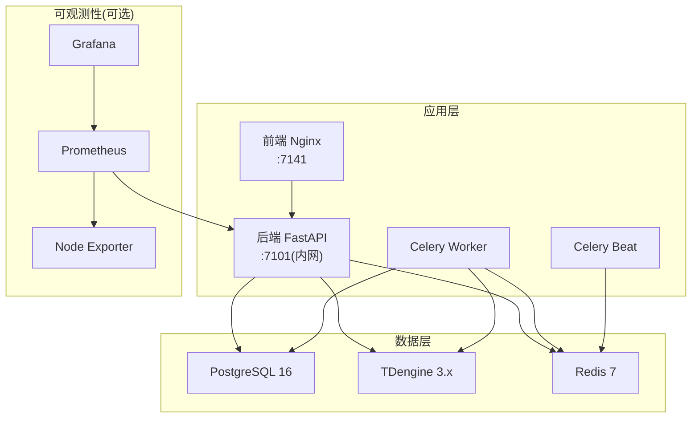
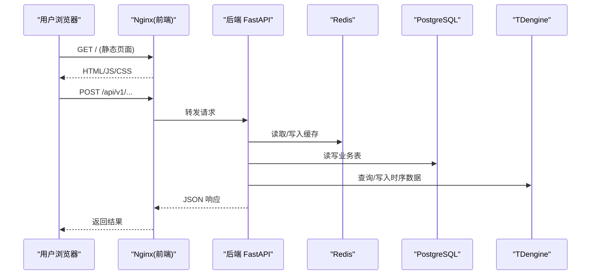
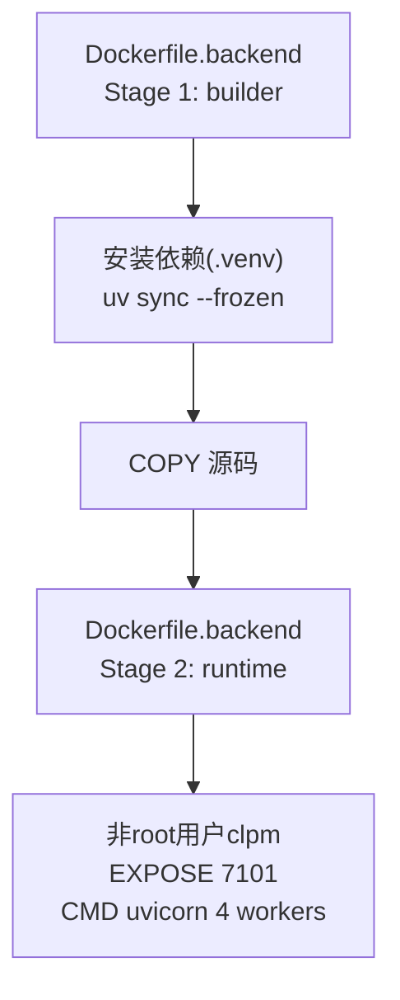
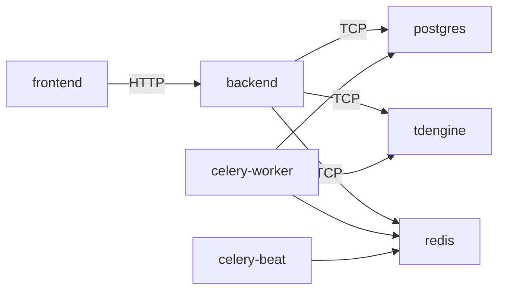
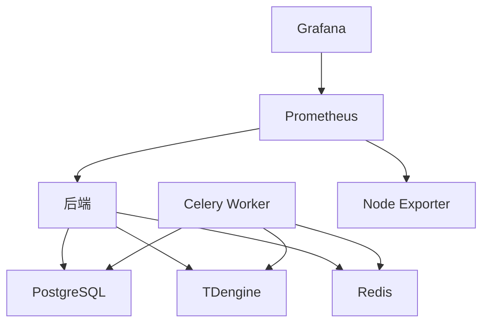
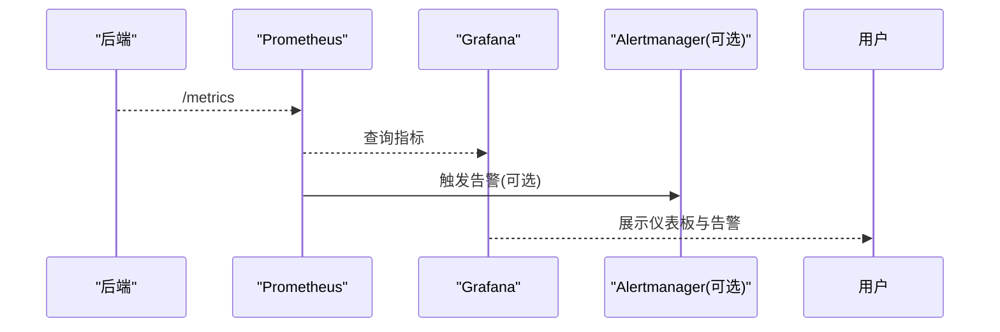
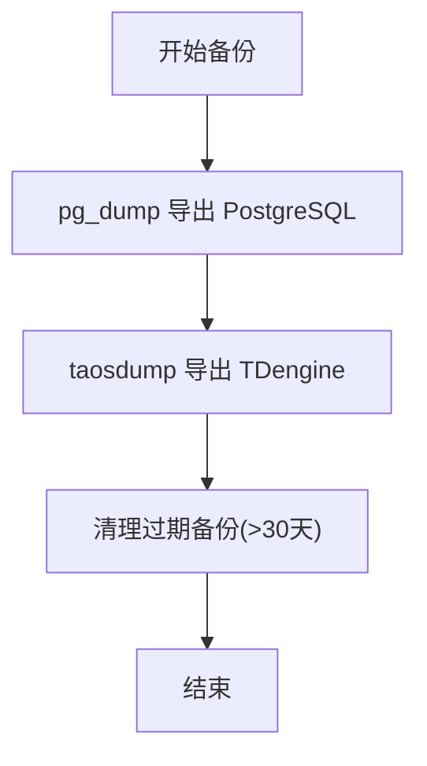

# 部署运维

<cite>
**本文引用的文件**
- [docker-compose.prod.yml](file://docker-compose.prod.yml)
- [Dockerfile.backend](file://Dockerfile.backend)
- [Dockerfile.frontend](file://Dockerfile.frontend)
- [deploy/docker/docker-compose.dev.yml](file://deploy/docker/docker-compose.dev.yml)
- [deploy/DEPLOYMENT-GUIDE.md](file://deploy/DEPLOYMENT-GUIDE.md)
- [deploy/prometheus/prometheus.yml](file://deploy/prometheus/prometheus.yml)
- [deploy/prometheus/alerts.yml](file://deploy/prometheus/alerts.yml)
- [deploy/grafana/dashboards/clpm-overview.json](file://deploy/grafana/dashboards/clpm-overview.json)
- [deploy/grafana/provisioning/datasources/prometheus.yml](file://deploy/grafana/provisioning/datasources/prometheus.yml)
- [deploy/nginx.conf](file://deploy/nginx.conf)
- [backend/app/core/metrics.py](file://backend/app/core/metrics.py)
- [deploy/backup.sh](file://deploy/backup.sh)
- [TROUBLESHOOTING.md](file://TROUBLESHOOTING.md)
</cite>

## 目录
1. [简介](#简介)
2. [项目结构](#项目结构)
3. [核心组件](#核心组件)
4. [架构总览](#架构总览)
5. [详细组件分析](#详细组件分析)
6. [依赖关系分析](#依赖关系分析)
7. [性能与容量规划](#性能与容量规划)
8. [监控与告警](#监控与告警)
9. [日志管理](#日志管理)
10. [备份与恢复](#备份与恢复)
11. [安全加固](#安全加固)
12. [故障排查指南](#故障排查指南)
13. [结论](#结论)

## 简介
本运维文档面向 CLPM-MVP 生产环境，覆盖容器化构建、编排、发布、监控、日志、备份恢复、容量与安全等全链路运维实践。系统采用 Docker Compose 编排后端 API（FastAPI）、前端 Nginx、PostgreSQL、TDengine、Redis、Celery Worker/Beat，以及可选的 Prometheus/Grafana/Node Exporter 可观测性栈。所有服务通过内部网络通信，仅暴露前端 HTTP 端口，降低攻击面。

## 项目结构
CLPM-MVP 的生产编排位于根目录 docker-compose.prod.yml，开发环境编排位于 deploy/docker/docker-compose.dev.yml；镜像构建定义在 Dockerfile.backend 与 Dockerfile.frontend；Nginx 反向代理配置在 deploy/nginx.conf；监控采集与告警规则在 deploy/prometheus 下；Grafana 仪表板与数据源预置在 deploy/grafana 下；数据备份脚本在 deploy/backup.sh。

图表来源
- [docker-compose.prod.yml:16-489](file://docker-compose.prod.yml#L16-L489)
- [deploy/prometheus/prometheus.yml:1-31](file://deploy/prometheus/prometheus.yml#L1-L31)
- [deploy/grafana/provisioning/datasources/prometheus.yml:1-10](file://deploy/grafana/provisioning/datasources/prometheus.yml#L1-L10)

章节来源
- [docker-compose.prod.yml:1-489](file://docker-compose.prod.yml#L1-L489)
- [deploy/docker/docker-compose.dev.yml:1-146](file://deploy/docker/docker-compose.dev.yml#L1-L146)

## 核心组件
- 后端 API：基于 FastAPI + Uvicorn，多 worker 启动，暴露 /health 健康检查与 /metrics 指标端点（仅内网访问）。
- 前端：Nginx 托管静态资源并反代 /api/v1 到后端，支持 WebSocket 升级与 gzip 压缩。
- 数据库：PostgreSQL 存储业务元数据；TDengine 存储时序波形数据；Redis 作为缓存与 Celery Broker。
- 任务调度：Celery Worker 执行 KPI 计算、诊断、报表等异步任务；Celery Beat 定时触发 AAS 同步、KPI 快照等。
- 可观测性：Prometheus 抓取后端指标与宿主机指标；Grafana 提供预置仪表板；Node Exporter 采集磁盘/CPU/内存。

章节来源
- [Dockerfile.backend:1-84](file://Dockerfile.backend#L1-L84)
- [Dockerfile.frontend:1-72](file://Dockerfile.frontend#L1-L72)
- [backend/app/core/metrics.py:1-163](file://backend/app/core/metrics.py#L1-L163)
- [deploy/nginx.conf:1-167](file://deploy/nginx.conf#L1-L167)
- [docker-compose.prod.yml:16-489](file://docker-compose.prod.yml#L16-L489)

## 架构总览
生产环境通过 Compose profiles 控制可选组件（monitoring），默认仅运行核心服务；所有数据库与中间件不暴露到宿主机，仅通过容器网络互通。前端通过 Nginx 统一入口，后端仅对内暴露 7101，减少外部暴露面。

图表来源
- [deploy/nginx.conf:56-139](file://deploy/nginx.conf#L56-L139)
- [docker-compose.prod.yml:16-489](file://docker-compose.prod.yml#L16-L489)

## 详细组件分析

### 容器镜像与多阶段构建
- 后端镜像：Builder 阶段使用 uv 安装依赖并冻结版本；Runtime 阶段仅拷贝 .venv 与源码，以非 root 用户运行，暴露 7101，启用 4 个 worker。
- 前端镜像：Builder 阶段使用 pnpm 构建 web-antd 产物；Runtime 阶段使用 nginx:alpine 托管静态资源，挂载自定义 nginx.conf。

图表来源
- [Dockerfile.backend:1-84](file://Dockerfile.backend#L1-L84)
- [Dockerfile.frontend:1-72](file://Dockerfile.frontend#L1-L72)

章节来源
- [Dockerfile.backend:1-84](file://Dockerfile.backend#L1-L84)
- [Dockerfile.frontend:1-72](file://Dockerfile.frontend#L1-L72)

### 容器编排与服务依赖
- 服务间依赖：backend 依赖 postgres 与 redis 健康；frontend 依赖 backend 健康；celery-worker/beats 依赖 redis/postgres。
- 资源限制：为各服务设置 CPU/内存上限，避免争抢。
- 健康检查：各服务均配置 healthcheck，便于编排自动拉起与故障检测。
- 数据卷：postgres_data、tdengine_data、redis_data、prometheus_data、grafana_data 持久化关键数据。

图表来源
- [docker-compose.prod.yml:16-489](file://docker-compose.prod.yml#L16-L489)

章节来源
- [docker-compose.prod.yml:16-489](file://docker-compose.prod.yml#L16-L489)

### 环境变量与配置管理
- 生产环境变量集中管理于 .env.prod，由 Compose env_file 注入各服务。
- 必须修改字段包括 JWT_SECRET_KEY、POSTGRES_PASSWORD、REDIS_PASSWORD、TDENGINE_PASSWORD、ENV=production。
- 可选字段如 SIGNALR_HUB_URL、HISTORY_DATA_API_URL 可在 UI 中配置或留空。

章节来源
- [deploy/DEPLOYMENT-GUIDE.md:176-243](file://deploy/DEPLOYMENT-GUIDE.md#L176-L243)
- [docker-compose.prod.yml:29-31](file://docker-compose.prod.yml#L29-L31)

### 数据持久化策略
- PostgreSQL：数据目录映射到 postgres_data 卷，初始化 SQL 通过 entrypoint 挂载。
- TDengine：数据目录映射到 tdengine_data 卷，超级表初始化 SQL 通过 entrypoint 挂载；密码变更标记文件避免重复改密导致的崩溃循环。
- Redis：AOF 开启，数据目录映射到 redis_data 卷。
- Prometheus/Grafana：指标与仪表板数据分别持久化到 prometheus_data 与 grafana_data。

章节来源
- [docker-compose.prod.yml:104-185](file://docker-compose.prod.yml#L104-L185)
- [docker-compose.prod.yml:191-231](file://docker-compose.prod.yml#L191-L231)
- [docker-compose.prod.yml:361-465](file://docker-compose.prod.yml#L361-L465)

### 反向代理与网络安全
- Nginx 仅暴露 7141 端口，/api/v1 反向代理至后端 7101，支持 WebSocket 升级。
- 安全头：X-Frame-Options、X-Content-Type-Options、Referrer-Policy、CSP。
- 动态 DNS 解析 resolver 解决后端容器重启后 IP 变化导致的 502。
- 后续可启用 HTTPS（证书挂载与 server 块替换模板已提供）。

章节来源
- [deploy/nginx.conf:1-167](file://deploy/nginx.conf#L1-L167)

## 依赖关系分析
- 后端依赖：PostgreSQL（业务表）、TDengine（时序数据）、Redis（缓存与消息队列）。
- 任务系统：Celery Worker/Beat 依赖 Redis 作为 broker，同时读写 PG/TD。
- 可观测性：Prometheus 抓取后端 /metrics 与 Node Exporter；Grafana 连接 Prometheus。

图表来源
- [docker-compose.prod.yml:16-489](file://docker-compose.prod.yml#L16-L489)
- [deploy/prometheus/prometheus.yml:1-31](file://deploy/prometheus/prometheus.yml#L1-L31)

章节来源
- [docker-compose.prod.yml:16-489](file://docker-compose.prod.yml#L16-L489)
- [deploy/prometheus/prometheus.yml:1-31](file://deploy/prometheus/prometheus.yml#L1-L31)

## 性能与容量规划
- 后端并发：Uvicorn 4 worker，适合多核 CPU；根据负载调整 worker 数。
- Celery Worker：默认 concurrency=8，可根据宿主核数调整 CELERY_WORKER_CONCURRENCY；每个子任务约占用 1 核与一定内存。
- 资源限制：Compose 中为各服务设置 CPU/内存上限，防止资源争用。
- 数据库连接：PG 连接池与 TD 连接数需结合并发评估；可通过监控面板观察 db_pool_connections 与 pg_active_connections。
- 存储容量：TDengine 时序数据增长快，建议定期归档与清理；PG 与 Redis 按业务量评估扩容。

章节来源
- [docker-compose.prod.yml:236-278](file://docker-compose.prod.yml#L236-L278)
- [backend/app/core/metrics.py:69-87](file://backend/app/core/metrics.py#L69-L87)

## 监控与告警
- 指标采集：后端暴露 /metrics，Prometheus 每 30s 抓取；Node Exporter 采集宿主机指标。
- 告警规则：后端 down、Celery 任务失败率 >10%、宿主机根分区可用空间 <15%、抓取目标失联。
- 仪表板：Grafana 预置“CLPM 系统总览”，包含 QPS、延迟 P95、状态码分布、Celery 任务速率与成功率、DB 连接池使用数。
- 数据源：Grafana 通过 provisioning 自动添加 Prometheus 数据源。

图表来源
- [deploy/prometheus/prometheus.yml:1-31](file://deploy/prometheus/prometheus.yml#L1-L31)
- [deploy/prometheus/alerts.yml:1-55](file://deploy/prometheus/alerts.yml#L1-L55)
- [deploy/grafana/dashboards/clpm-overview.json:1-628](file://deploy/grafana/dashboards/clpm-overview.json#L1-L628)
- [deploy/grafana/provisioning/datasources/prometheus.yml:1-10](file://deploy/grafana/provisioning/datasources/prometheus.yml#L1-L10)

章节来源
- [deploy/prometheus/prometheus.yml:1-31](file://deploy/prometheus/prometheus.yml#L1-L31)
- [deploy/prometheus/alerts.yml:1-55](file://deploy/prometheus/alerts.yml#L1-L55)
- [deploy/grafana/dashboards/clpm-overview.json:1-628](file://deploy/grafana/dashboards/clpm-overview.json#L1-L628)
- [deploy/grafana/provisioning/datasources/prometheus.yml:1-10](file://deploy/grafana/provisioning/datasources/prometheus.yml#L1-L10)

## 日志管理
- 容器日志：所有服务使用 json-file 驱动，单文件最大 10MB，保留 3 份，避免磁盘膨胀。
- 前端 Nginx：access_log 对静态资源关闭以减少噪音；错误页统一处理。
- 应用日志：后端与 Celery 输出到容器标准输出，可通过 Compose logs 查看。
- 集中式收集：可结合 Loki/ELK 等方案将容器日志导出至集中平台（当前仓库未内置，可按需扩展）。

章节来源
- [docker-compose.prod.yml:49-55](file://docker-compose.prod.yml#L49-L55)
- [docker-compose.prod.yml:90-96](file://docker-compose.prod.yml#L90-L96)
- [docker-compose.prod.yml:127-133](file://docker-compose.prod.yml#L127-L133)
- [docker-compose.prod.yml:178-183](file://docker-compose.prod.yml#L178-L183)
- [docker-compose.prod.yml:224-229](file://docker-compose.prod.yml#L224-L229)
- [docker-compose.prod.yml:270-276](file://docker-compose.prod.yml#L270-L276)
- [docker-compose.prod.yml:315-321](file://docker-compose.prod.yml#L315-L321)
- [docker-compose.prod.yml:386-391](file://docker-compose.prod.yml#L386-L391)
- [docker-compose.prod.yml:430-435](file://docker-compose.prod.yml#L430-L435)
- [docker-compose.prod.yml:458-463](file://docker-compose.prod.yml#L458-L463)
- [deploy/nginx.conf:128-139](file://deploy/nginx.conf#L128-L139)

## 备份与恢复
- 备份脚本：deploy/backup.sh 实现 PostgreSQL pg_dump 与 TDengine taosdump 备份，保留最近 30 天。
- 备份策略：建议每日 02:00 全量备份，备份文件落盘至用户主目录下的 backups/clpm，避免权限问题。
- 恢复流程：先停写服务，导入 PG SQL 与解压 TD 备份，校验数据完整性后重启服务。
- 配置文件管理：.env.prod 与 Nginx 配置应纳入版本控制或配置中心，确保可追溯。

图表来源
- [deploy/backup.sh:1-122](file://deploy/backup.sh#L1-L122)

章节来源
- [deploy/backup.sh:1-122](file://deploy/backup.sh#L1-L122)
- [deploy/DEPLOYMENT-GUIDE.md:529-559](file://deploy/DEPLOYMENT-GUIDE.md#L529-L559)

## 安全加固
- 最小暴露面：仅前端 7141 暴露到宿主机，后端 7101 仅容器内可达。
- 指标端点保护：/metrics 仅允许内网白名单访问（含环回、私有段、Tailscale CGNAT）。
- 安全响应头：Nginx 设置 X-Frame-Options、X-Content-Type-Options、Referrer-Policy、CSP。
- 密码管理：所有敏感凭据通过 .env.prod 注入，禁止硬编码；首次部署后立即修改默认管理员密码。
- 传输加密：后续可启用 HTTPS（Nginx 模板已提供 SSL server 块）。

章节来源
- [backend/app/core/metrics.py:21-50](file://backend/app/core/metrics.py#L21-L50)
- [deploy/nginx.conf:63-77](file://deploy/nginx.conf#L63-L77)
- [deploy/DEPLOYMENT-GUIDE.md:190-213](file://deploy/DEPLOYMENT-GUIDE.md#L190-L213)
- [deploy/nginx.conf:141-167](file://deploy/nginx.conf#L141-L167)

## 故障排查指南
- 部署失败：查看自动生成排查清单 /tmp/clpm-deploy-troubleshooting-*.md；检查健康检查与日志。
- TDengine 反复重启：确认 .td-password-changed 标记文件存在；必要时手动创建并重启。
- 健康检查超时：检查数据库密码、端口冲突、磁盘空间；查看后端与前端日志。
- SignalR 实时数据不更新：确认订阅器运行状态；如需重启后端与 Worker；检查 Redis 缓存键。
- 常见命令：logs、ps、restart、down/up、备份与回滚脚本。

章节来源
- [deploy/DEPLOYMENT-GUIDE.md:442-525](file://deploy/DEPLOYMENT-GUIDE.md#L442-L525)
- [TROUBLESHOOTING.md:1-160](file://TROUBLESHOOTING.md#L1-L160)

## 结论
CLPM-MVP 的生产部署采用标准化容器化与编排方案，具备完善的健康检查、资源限制、日志轮转与可观测性能力。通过环境变量集中管理、数据持久化与自动化备份，满足生产环境的稳定性与可维护性要求。建议在生产环境中启用监控与告警，并结合集中式日志系统进行统一治理；持续优化并发与资源配额，保障高负载下的稳定运行。