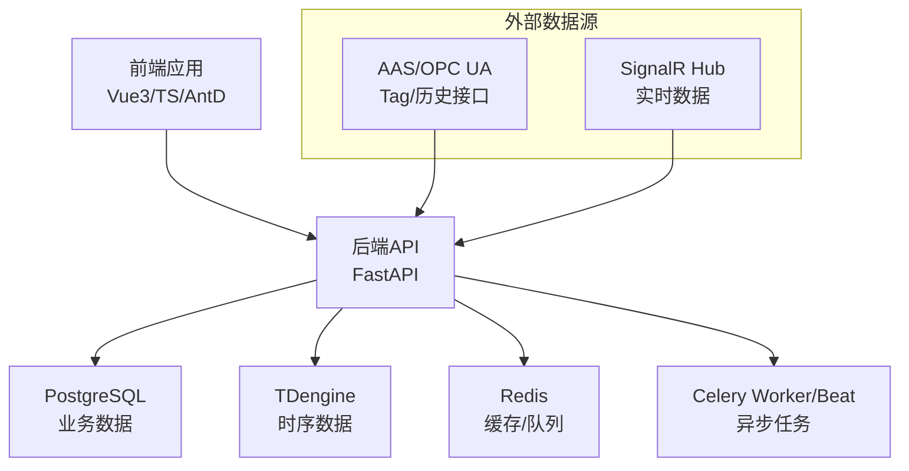
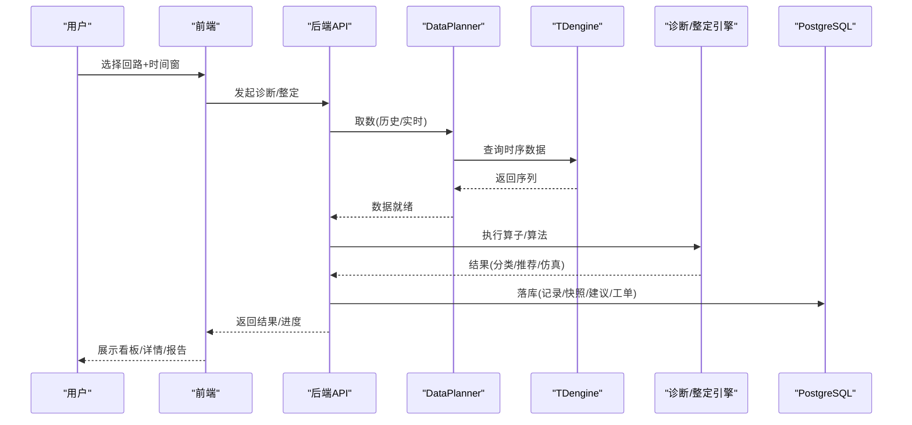
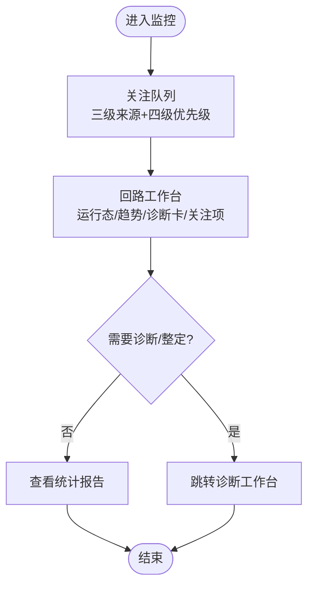
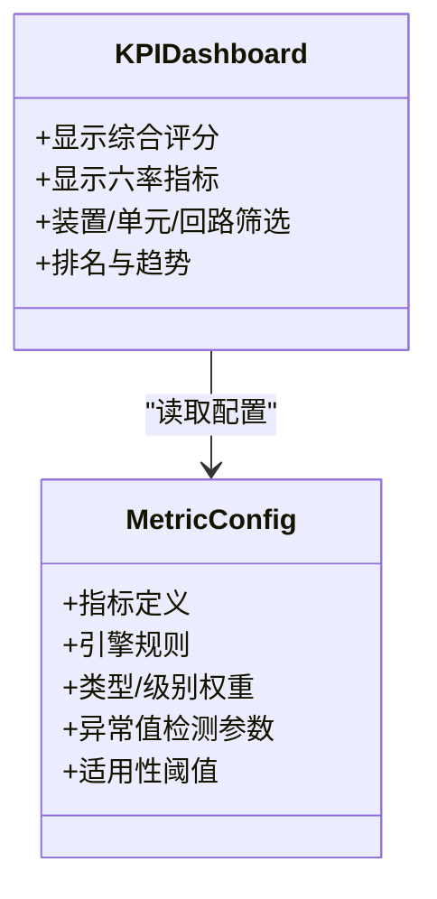
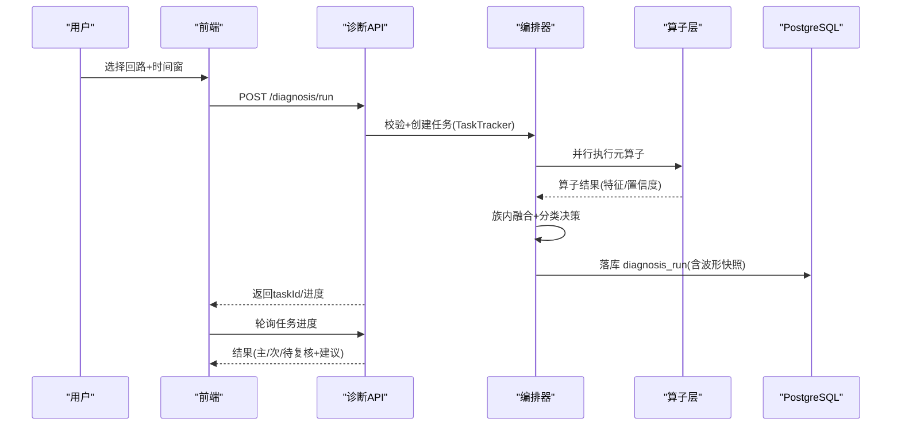
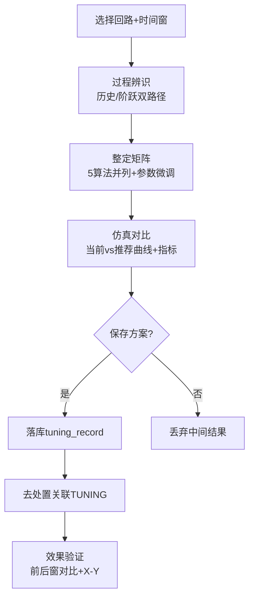
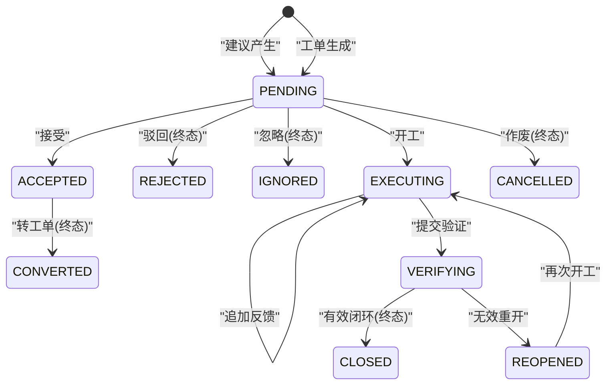
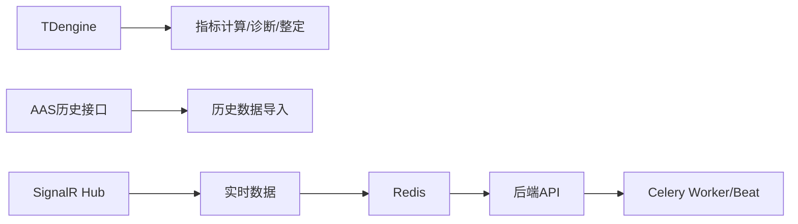

# 产品简介与特性

<cite>
**本文引用的文件**
- [README.md](file://README.md)
- [docs/MVP设计/01-总体方案.md](file://docs/MVP设计/01-总体方案.md)
- [docs/MVP设计/README.md](file://docs/MVP设计/README.md)
- [docs/MVP设计/07-诊断模块设计方案.md](file://docs/MVP设计/07-诊断模块设计方案.md)
- [docs/MVP设计/09-整定模块设计方案.md](file://docs/MVP设计/09-整定模块设计方案.md)
- [docs/MVP设计/08-处置模块设计方案.md](file://docs/MVP设计/08-处置模块设计方案.md)
- [docs/设计文档/01-PRD/PRD.md](file://docs/设计文档/01-PRD/PRD.md)
- [backend/tests/test_p3_009_no_dcs_write.py](file://backend/tests/test_p3_009_no_dcs_write.py)
</cite>

## 目录
1. [引言](#引言)
2. [项目结构](#项目结构)
3. [核心组件](#核心组件)
4. [架构总览](#架构总览)
5. [详细组件分析](#详细组件分析)
6. [依赖关系分析](#依赖关系分析)
7. [性能与安全边界](#性能与安全边界)
8. [故障排查指南](#故障排查指南)
9. [结论](#结论)
10. [附录](#附录)

## 引言
CLPM-MVP 是面向危化企业控制回路的“绩效治理与优化闭环平台”，覆盖“监控→评估→诊断→整定→处置→统计报告”的完整业务闭环，并提供管理决策视图。其定位是产品化、工具化的平台，强调“只读 DCS、只输出建议”的安全边界，不直接写入 DCS 参数，所有实施由授权人员在 DCS 中人工完成并留痕。

MVP 版本自 CLPM v6.2 派生，遵循“精简+闭环重建”的策略：在保留监控、评估、配置、系统四大模块的基础上，重建诊断、整定、处置三大能力，形成可交付的最小可用闭环；同时通过“适用性分层（L0~L4）”和“模块热插拔”实现弹性交付。

本简介旨在为初学者提供清晰的产品认知框架，帮助理解平台在工业自动化领域的价值与应用场景。

**章节来源**
- [README.md:1-20](file://README.md#L1-L20)
- [docs/MVP设计/README.md:1-12](file://docs/MVP设计/README.md#L1-L12)
- [docs/设计文档/01-PRD/PRD.md:77-92](file://docs/设计文档/01-PRD/PRD.md#L77-L92)

## 项目结构
CLPM-MVP 采用前后端分离与模块化组织：
- 前端：Vue 3 + TypeScript + Vite + Ant Design Vue，按路由模块划分（监控、评估、诊断、整定、处置、统计报告、配置、系统）。
- 后端：FastAPI + SQLAlchemy 2.0 + Celery 任务，服务层按功能域拆分（指标计算、预处理、诊断、整定、处置、报表等）。
- 数据：PostgreSQL（业务元数据）、TDengine（时序历史数据）、Redis（缓存/队列）。
- 部署：Docker Compose + Nginx，生产与开发端口隔离。

**图表来源**
- [README.md:22-36](file://README.md#L22-L36)
- [README.md:106-136](file://README.md#L106-L136)

**章节来源**
- [README.md:22-36](file://README.md#L22-L36)
- [README.md:106-136](file://README.md#L106-L136)

## 核心组件
- 关注队列管理：聚合 ALERT/DEGRADATION/DATA_QUALITY 三来源，四级优先级，角色化动作。
- 回路工作台：单页多区（运行态、评分趋势、诊断卡、活跃关注项、适用性横幅），支持从工作台发起诊断或整定。
- KPI 看板：装置/单元/回路级综合评分与六率指标，支持排名、统计分析、指标配置与可信度标识。
- 智能诊断引擎：元算子注册表、族内融合、证据污染链、6+1 原因分类体系，仅手动触发，适用性门禁。
- PID 参数整定：历史/阶跃辨识、全算法矩阵、闭环仿真对比、效果验证（前后窗曲线+X-Y）。
- 处置工作流：双实体（建议审核+工单执行），五态/六态状态机，KPI 前后对比验证，闭环重开。
- 统计报告：管理总览（S1/S2/S3 自适应）、绩效/诊断/处置/收益报告、订阅配置。

**章节来源**
- [README.md:9-18](file://README.md#L9-L18)
- [docs/MVP设计/07-诊断模块设计方案.md:10-64](file://docs/MVP设计/07-诊断模块设计方案.md#L10-L64)
- [docs/MVP设计/09-整定模块设计方案.md:11-74](file://docs/MVP设计/09-整定模块设计方案.md#L11-L74)
- [docs/MVP设计/08-处置模块设计方案.md:11-89](file://docs/MVP设计/08-处置模块设计方案.md#L11-L89)

## 架构总览
平台以“监控→评估→诊断→整定→处置→统计报告”为主线，结合预警规则引擎与系统管理，形成闭环治理。数据侧统一走本地 TDengine 进行计算，实时数据经 SignalR 入 Redis 与可选写回 TDengine；历史导入通过远端 AAS 接口补齐本地库。

**图表来源**
- [README.md:106-136](file://README.md#L106-L136)
- [docs/MVP设计/07-诊断模块设计方案.md:135-163](file://docs/MVP设计/07-诊断模块设计方案.md#L135-L163)
- [docs/MVP设计/09-整定模块设计方案.md:96-124](file://docs/MVP设计/09-整定模块设计方案.md#L96-L124)

## 详细组件分析

### 监控与关注队列
- 关注队列聚合三类来源（ALERT/DEGRADATION/DATA_QUALITY），按四级优先级排序，不同角色可见/可操作范围不同。
- 回路工作台提供运行态、评分趋势、诊断卡、活跃关注项与 L2 适用性横幅，支持快速跳转诊断/整定。
- 装置总览展示 L0~L4 适用性五段堆叠横条，辅助管理者把握整体健康度。

**图表来源**
- [README.md:9-12](file://README.md#L9-L12)

**章节来源**
- [README.md:9-12](file://README.md#L9-L12)

### 性能评估与 KPI 看板
- 指标体系：3+1+8（好值率/自控率/平稳率/准确率/振荡率/饱和率等），综合评分公式与权重模板可配置。
- 看板与排行：装置/单元/回路级汇总，支持排名、统计分析、指标配置（定义/规则/权重/阈值/算法参数/适用性阈值）。
- 可信度标识：A-E 分级，L0/L1 回路灰色“不适用”独立不计入“差”。

**图表来源**
- [docs/设计文档/01-PRD/PRD.md:68-70](file://docs/设计文档/01-PRD/PRD.md#L68-L70)
- [README.md:11-12](file://README.md#L11-L12)

**章节来源**
- [docs/设计文档/01-PRD/PRD.md:68-70](file://docs/设计文档/01-PRD/PRD.md#L68-L70)
- [README.md:11-12](file://README.md#L11-L12)

### 智能诊断引擎
- 架构：元算子注册表（无状态纯函数+自描述元数据），族内 D-S 融合，分类决策表，证据污染链。
- 流程：发起诊断→数据门禁→并行算子→融合分类→建议生成→落库（diagnosis_run）。
- 适用性门禁：L0/L1 阻止发起，L2 返回条件异常横幅；仅手动触发。

**图表来源**
- [docs/MVP设计/07-诊断模块设计方案.md:111-151](file://docs/MVP设计/07-诊断模块设计方案.md#L111-L151)
- [docs/MVP设计/07-诊断模块设计方案.md:252-323](file://docs/MVP设计/07-诊断模块设计方案.md#L252-L323)

**章节来源**
- [docs/MVP设计/07-诊断模块设计方案.md:10-64](file://docs/MVP设计/07-诊断模块设计方案.md#L10-L64)
- [docs/MVP设计/07-诊断模块设计方案.md:111-151](file://docs/MVP设计/07-诊断模块设计方案.md#L111-L151)
- [docs/MVP设计/07-诊断模块设计方案.md:252-323](file://docs/MVP设计/07-诊断模块设计方案.md#L252-L323)

### PID 参数整定
- 过程辨识：历史数据自动辨识（ARX/ARMAX/IV）+ 阶跃实验辨识（FOPDT/SOPDT/IPDT），输出模型参数与可信度。
- 参数整定：全算法矩阵（IMC/Lambda/Z-N/Cohen-Coon/SIMC），算法参数微调，当前 PID 对照。
- 仿真对比：RK4 闭环仿真，当前 vs 推荐参数曲线叠加与量化指标（ITAE/超调量/调节时间）。
- 效果验证：前后窗趋势对比 + PV/OP X-Y 轨迹对比，复用同一组件于处置 VERIFYING 环节。

**图表来源**
- [docs/MVP设计/09-整定模块设计方案.md:75-92](file://docs/MVP设计/09-整定模块设计方案.md#L75-L92)
- [docs/MVP设计/09-整定模块设计方案.md:96-159](file://docs/MVP设计/09-整定模块设计方案.md#L96-L159)

**章节来源**
- [docs/MVP设计/09-整定模块设计方案.md:11-74](file://docs/MVP设计/09-整定模块设计方案.md#L11-L74)
- [docs/MVP设计/09-整定模块设计方案.md:75-159](file://docs/MVP设计/09-整定模块设计方案.md#L75-L159)

### 处置工作流（双实体）
- 建议审核：接受/驳回/忽略，状态机四态（PENDING/ACCEPTED/CONVERTED/REJECTED/IGNORED）。
- 工单执行：排程、开工、反馈、提交验证、有效闭环/无效重开，状态机六态（PENDING/EXECUTING/VERIFYING/CLOSED/REOPENED/CANCELLED）。
- 多建议合一单：同回路多条建议合并转一单，对应现场“一个停工窗口做多件事”。
- KPI 前后对比：验证时固化 kpi_before/kpi_after，用于效果评估。

**图表来源**
- [docs/MVP设计/08-处置模块设计方案.md:160-205](file://docs/MVP设计/08-处置模块设计方案.md#L160-L205)

**章节来源**
- [docs/MVP设计/08-处置模块设计方案.md:11-89](file://docs/MVP设计/08-处置模块设计方案.md#L11-L89)
- [docs/MVP设计/08-处置模块设计方案.md:160-205](file://docs/MVP设计/08-处置模块设计方案.md#L160-L205)

### 统计报告与管理总览
- 管理总览：固定 12 格骨架，成熟度 S1/S2/S3 自适应内容。
- 报告类型：绩效报告、诊断报告、处置报告、收益报告（整定前后对比+自控率提升曲线+装置标杆）。
- 订阅配置：原“自动报表”迁移至统计报告一级菜单，旧路径全局 redirect。

**章节来源**
- [README.md:15-18](file://README.md#L15-L18)

## 依赖关系分析
- 数据依赖：历史数据唯一来源为本地 TDengine；实时数据来自 SignalR Hub，写入 Redis 与可选写回 TDengine；历史导入通过远端 AAS 接口。
- 任务依赖：Celery Beat 调度定时任务（KPI 计算、诊断、报表生成等），Worker 执行异步任务。
- 模块耦合：诊断/整定/处置通过“适用性门禁”与“模块热插拔”解耦，可按客户阶段启用/禁用。

**图表来源**
- [README.md:106-136](file://README.md#L106-L136)

**章节来源**
- [README.md:106-136](file://README.md#L106-L136)

## 性能与安全边界
- 性能边界：LTTB 降采样 maxPoints=2000，30 天时间窗口；KPI 小时快照与每日完整性巡检。
- 安全边界：平台不直接修改 DCS 参数，只输出建议、证据、风险与回退方案；所有高危操作审计留痕。

**章节来源**
- [README.md:338-348](file://README.md#L338-L348)
- [docs/设计文档/01-PRD/PRD.md:77-92](file://docs/设计文档/01-PRD/PRD.md#L77-L92)
- [backend/tests/test_p3_009_no_dcs_write.py:149-195](file://backend/tests/test_p3_009_no_dcs_write.py#L149-L195)

## 故障排查指南
- 数据不足/门禁不过：诊断返回 DATA_INSUFFICIENT，提示补数；检查 TDengine 数据完整性与质量码。
- 任务失败/超时：Celery 任务 autoretry 退避，查看任务日志与进度；确认 DataPlanner 取数成功。
- 实时数据断线：SignalR 断线重连指数退避，检查网络链路（局域网/公网切换）与 Tailscale 配置。
- 模块热插拔：诊断/整定/处置可通过系统管理模块管理开关，重启生效；未启用模块列虚线灰显。

**章节来源**
- [docs/MVP设计/07-诊断模块设计方案.md:455-467](file://docs/MVP设计/07-诊断模块设计方案.md#L455-L467)
- [README.md:127-141](file://README.md#L127-L141)

## 结论
CLPM-MVP 以“监控→评估→诊断→整定→处置→统计报告”的完整闭环为核心，结合适用性分层与模块热插拔，提供面向危化企业的控制回路绩效治理与优化平台。其“只读 DCS、只输出建议”的安全边界确保工程实施合规可控，适合在流程工业中规模化落地。

## 附录
- MVP 精简策略：从 v6.2 派生，保留监控、评估、配置、系统四大模块，屏蔽诊断/整定及流程闭环内容（第一轮改造），后续按新方案重建闭环。
- 与 v6.2 的关系与差异：MVP 差异以 docs/MVP设计/ 为准；v6.2 为产品文档基线，MVP 运行时版本默认 1.0.0，发布版本以 Git tag 为准。

**章节来源**
- [docs/MVP设计/01-总体方案.md:1-24](file://docs/MVP设计/01-总体方案.md#L1-L24)
- [README.md:1-6](file://README.md#L1-L6)