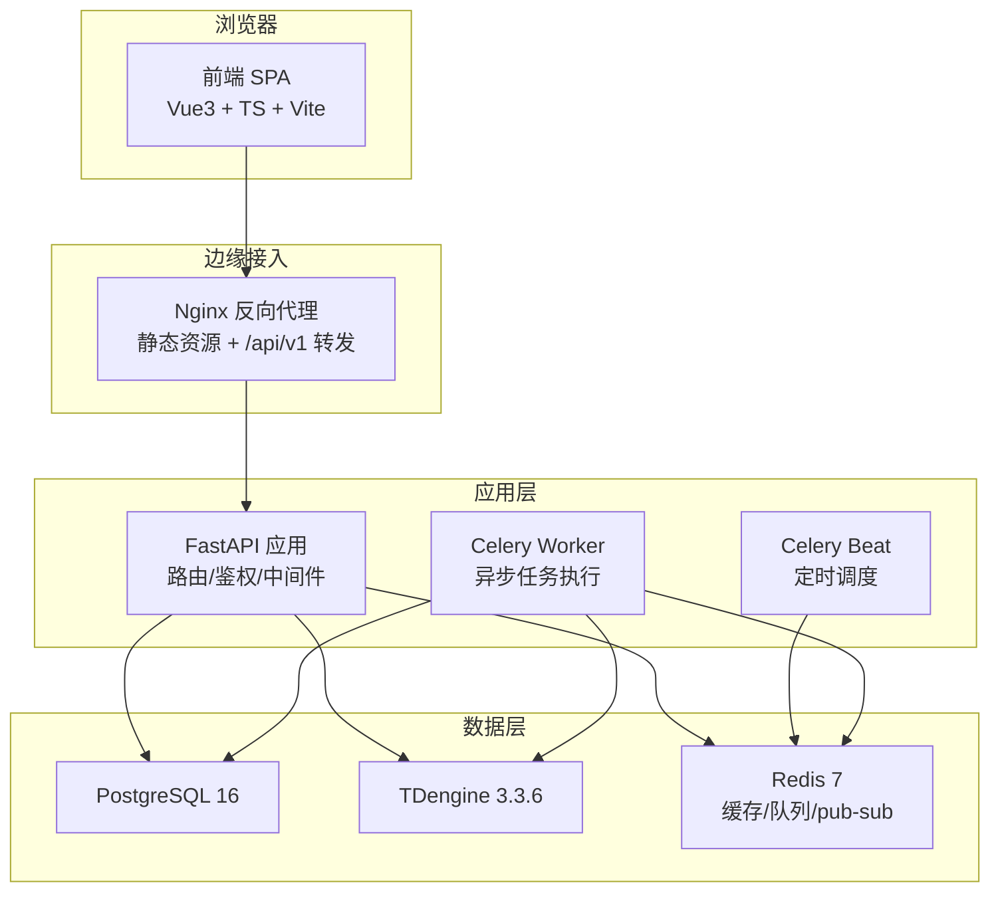
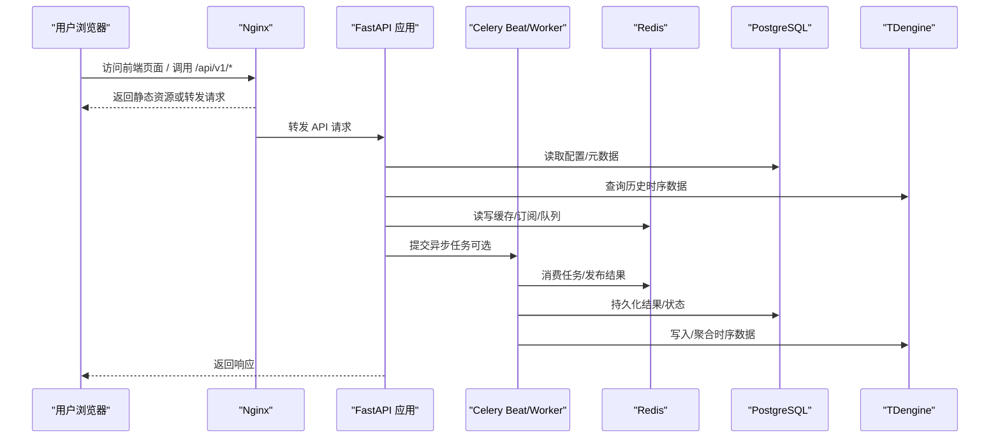
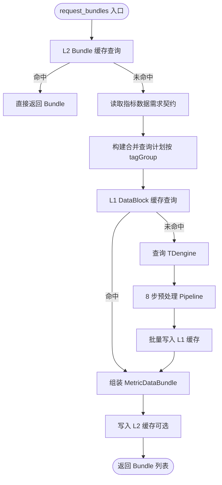
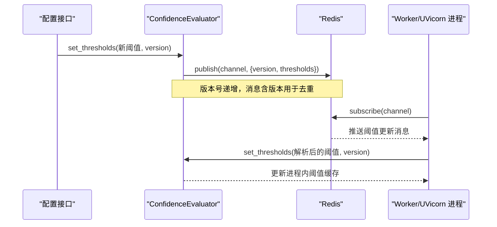
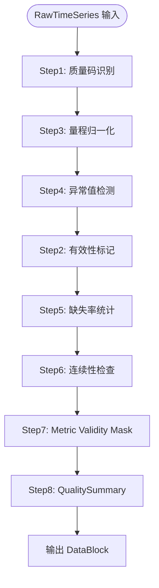
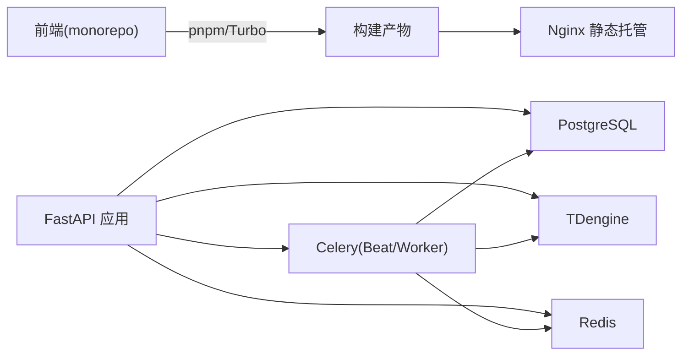

# 技术栈概览

<cite>
**本文引用的文件**   
- [README.md](file://README.md)
- [backend/app/main.py](file://backend/app/main.py)
- [backend/pyproject.toml](file://backend/pyproject.toml)
- [frontend/package.json](file://frontend/package.json)
- [docker-compose.prod.yml](file://docker-compose.prod.yml)
- [deploy/nginx.conf](file://deploy/nginx.conf)
- [backend/app/services/data_planner.py](file://backend/app/services/data_planner.py)
- [backend/app/services/confidence_evaluator.py](file://backend/app/services/confidence_evaluator.py)
- [backend/app/services/task_tracker.py](file://backend/app/services/task_tracker.py)
- [backend/app/services/preprocessing/pipeline.py](file://backend/app/services/preprocessing/pipeline.py)
</cite>

## 目录
1. [简介](#简介)
2. [项目结构](#项目结构)
3. [核心组件](#核心组件)
4. [架构总览](#架构总览)
5. [详细组件分析](#详细组件分析)
6. [依赖关系分析](#依赖关系分析)
7. [性能与可观测性](#性能与可观测性)
8. [故障排查指南](#故障排查指南)
9. [结论](#结论)
10. [附录](#附录)

## 简介
本技术栈概览面向 CLPM-MVP（控制回路性能治理与优化平台 MVP），聚焦前后端分离架构的技术选型、职责分工与交互关系，并重点说明 v4.0 核心组件：DataPlanner、ConfidenceEvaluator、TaskTracker、预处理 Pipeline。同时覆盖容器化部署方案（Docker + Docker Compose + Nginx）与测试体系（pytest + vitest + Playwright）。

- 前端：Vue 3 + TypeScript + Vite + vue-vben-admin + Ant Design Vue + ECharts
- 后端：Python 3.12 + FastAPI + SQLAlchemy 2.0 (async) + Pydantic v2 + Celery + Redis
- 数据库：PostgreSQL 16（业务关系数据）、TDengine 3.3.6（时序数据）
- 算法：NumPy + SciPy（模型辨识、PID 整定、闭环仿真等）
- 部署：Docker + Docker Compose + Nginx（静态托管与反向代理）
- 测试：pytest（后端）、vitest（前端单元）、Playwright（端到端）

**章节来源**
- [README.md:22-36](file://README.md#L22-L36)

## 项目结构
CLPM-MVP 采用典型的前后端分离与多服务编排：
- 前端 monorepo（apps/web-antd 为生产应用），使用 Vite 构建、Vitest 单元测试、Playwright 做 E2E
- 后端 FastAPI 应用，内嵌 Celery Beat/Worker（开发环境自动拉起），通过 Redis 作为消息队列与缓存
- 数据层：PostgreSQL 存储业务元数据与配置；TDengine 存储历史波形与时序数据
- 部署：Nginx 提供静态资源与 /api/v1 反向代理；Docker Compose 编排全部服务



**图表来源**
- [docker-compose.prod.yml:16-323](file://docker-compose.prod.yml#L16-L323)
- [deploy/nginx.conf:56-126](file://deploy/nginx.conf#L56-L126)
- [backend/app/main.py:610-762](file://backend/app/main.py#L610-L762)

**章节来源**
- [docker-compose.prod.yml:16-323](file://docker-compose.prod.yml#L16-L323)
- [deploy/nginx.conf:56-126](file://deploy/nginx.conf#L56-L126)
- [backend/app/main.py:610-762](file://backend/app/main.py#L610-L762)

## 核心组件
- DataPlanner：指标驱动的数据读取与编排中枢，统一从 TDengine 取数，合并查询计划，走 L1/L2 缓存，经预处理 Pipeline 产出 DataBlock，再组装 MetricDataBundle
- ConfidenceEvaluator：基于有效数据率判定指标可信度等级（A/B/C/D/E），构建数据血缘，计算综合评分，并通过 Redis pub/sub 实现阈值多进程同步
- TaskTracker：任务全生命周期跟踪（创建、状态更新、进度、通知），使用 Redis Hash/SortedSet/List 与 Lua 脚本保证原子性与幂等
- 预处理 Pipeline：8 步流水线（质量码识别→有效性标记→量程归一化→异常值检测→缺失率统计→连续性检查→Metric Mask→QualitySummary），输出标准化 DataBlock

**章节来源**
- [backend/app/services/data_planner.py:1-40](file://backend/app/services/data_planner.py#L1-L40)
- [backend/app/services/confidence_evaluator.py:1-15](file://backend/app/services/confidence_evaluator.py#L1-L15)
- [backend/app/services/task_tracker.py:1-18](file://backend/app/services/task_tracker.py#L1-L18)
- [backend/app/services/preprocessing/pipeline.py:1-13](file://backend/app/services/preprocessing/pipeline.py#L1-L13)

## 架构总览
系统以 FastAPI 为 API 网关，Nginx 负责静态资源与反向代理；Celery 负责异步与定时任务；数据读写分别命中 PostgreSQL 与 TDengine；Redis 承担缓存、队列与实时广播。



**图表来源**
- [docker-compose.prod.yml:16-323](file://docker-compose.prod.yml#L16-L323)
- [deploy/nginx.conf:56-126](file://deploy/nginx.conf#L56-L126)
- [backend/app/main.py:610-762](file://backend/app/main.py#L610-L762)

## 详细组件分析

### DataPlanner（数据编排器）
- 职责：按指标需求契约生成查询计划，合并相同 tagGroup 的查询，优先命中 L1/L2 缓存；未命中则回源 TDengine，经预处理 Pipeline 产出 DataBlock，最终组装 MetricDataBundle
- 关键优化：tagGroup 复用（HF 组从 BASE 派生）、Pipeline 批量写缓存、OP 限位预加载减少 DB 访问
- 采样策略：KPI 计算路径不进行 LTTB 降采样，确保指标准确性；波形渲染路径才做降采样



**图表来源**
- [backend/app/services/data_planner.py:208-346](file://backend/app/services/data_planner.py#L208-L346)
- [backend/app/services/data_planner.py:512-606](file://backend/app/services/data_planner.py#L512-L606)
- [backend/app/services/preprocessing/pipeline.py:78-228](file://backend/app/services/preprocessing/pipeline.py#L78-L228)

**章节来源**
- [backend/app/services/data_planner.py:208-346](file://backend/app/services/data_planner.py#L208-L346)
- [backend/app/services/data_planner.py:512-606](file://backend/app/services/data_planner.py#L512-L606)

### ConfidenceEvaluator（可信度评估器）
- 职责：根据 valid_rate 判定指标可信度等级（A/B/C/D/E），构建数据血缘，计算综合评分；支持运行时阈值动态更新与多进程同步
- 多进程同步：通过 Redis pub/sub 广播阈值更新，各进程后台守护线程订阅并应用，版本号去重避免覆盖



**图表来源**
- [backend/app/services/confidence_evaluator.py:106-157](file://backend/app/services/confidence_evaluator.py#L106-L157)
- [backend/app/services/confidence_evaluator.py:529-574](file://backend/app/services/confidence_evaluator.py#L529-L574)
- [backend/app/services/confidence_evaluator.py:632-694](file://backend/app/services/confidence_evaluator.py#L632-L694)

**章节来源**
- [backend/app/services/confidence_evaluator.py:106-157](file://backend/app/services/confidence_evaluator.py#L106-L157)
- [backend/app/services/confidence_evaluator.py:529-574](file://backend/app/services/confidence_evaluator.py#L529-L574)
- [backend/app/services/confidence_evaluator.py:632-694](file://backend/app/services/confidence_evaluator.py#L632-L694)

### TaskTracker（任务跟踪服务）
- 职责：创建任务记录、更新状态与进度、终态通知；使用 Redis Hash/SortedSet/List 与 Lua 脚本保证并发安全与幂等
- 关键能力：回填任务分发保留、批次认领/完成/释放、细粒度进度计数、通知列表管理

```mermaid
classDiagram
class TaskTracker {
+create_task(...)
+update_status(...)
+record_backfill_progress_once(...)
+claim_backfill_batch(...)
+complete_backfill_batch(...)
+release_backfill_batch(...)
+get_notifications(...)
+mark_notification_read(...)
}
class Redis {
<<storage>>
+Hash(task : {id})
+SortedSet(task : index)
+List(task : notifications : {user_id})
+Lua 脚本原子操作
}
TaskTracker --> Redis : "读写任务状态/索引/通知"
```

**图表来源**
- [backend/app/services/task_tracker.py:310-397](file://backend/app/services/task_tracker.py#L310-L397)
- [backend/app/services/task_tracker.py:561-651](file://backend/app/services/task_tracker.py#L561-L651)
- [backend/app/services/task_tracker.py:712-800](file://backend/app/services/task_tracker.py#L712-L800)

**章节来源**
- [backend/app/services/task_tracker.py:310-397](file://backend/app/services/task_tracker.py#L310-L397)
- [backend/app/services/task_tracker.py:561-651](file://backend/app/services/task_tracker.py#L561-L651)
- [backend/app/services/task_tracker.py:712-800](file://backend/app/services/task_tracker.py#L712-L800)

### 预处理 Pipeline（8 步流水线）
- 步骤：质量码识别→有效性标记→量程归一化→异常值检测→缺失率统计→连续性检查→Metric Mask→QualitySummary
- 原则：KEEP_ALL_WITH_VALIDITY，不删除任何数据点，通过 valid 标记区分有效/无效；不同指标通过 mask_expression 决定参与计算的点集
- 输出：标准化 DataBlock（含信号、valid、异常原因、连续段、质量摘要、回路级可信度）



**图表来源**
- [backend/app/services/preprocessing/pipeline.py:78-228](file://backend/app/services/preprocessing/pipeline.py#L78-L228)
- [backend/app/services/preprocessing/pipeline.py:418-438](file://backend/app/services/preprocessing/pipeline.py#L418-L438)

**章节来源**
- [backend/app/services/preprocessing/pipeline.py:78-228](file://backend/app/services/preprocessing/pipeline.py#L78-L228)
- [backend/app/services/preprocessing/pipeline.py:418-438](file://backend/app/services/preprocessing/pipeline.py#L418-L438)

## 依赖关系分析
- 前端依赖：Vue 3、TypeScript、Vite、vue-vben-admin、Ant Design Vue、ECharts；通过 pnpm workspace 管理 monorepo
- 后端依赖：FastAPI、SQLAlchemy 2.0、Pydantic v2、Celery、Redis、TDengine、PostgreSQL、NumPy/SciPy
- 部署依赖：Docker、Docker Compose、Nginx；可选 Prometheus/Grafana 监控



**图表来源**
- [frontend/package.json:27-59](file://frontend/package.json#L27-L59)
- [backend/pyproject.toml:6-39](file://backend/pyproject.toml#L6-L39)
- [docker-compose.prod.yml:16-323](file://docker-compose.prod.yml#L16-L323)

**章节来源**
- [frontend/package.json:27-59](file://frontend/package.json#L27-L59)
- [backend/pyproject.toml:6-39](file://backend/pyproject.toml#L6-L39)
- [docker-compose.prod.yml:16-323](file://docker-compose.prod.yml#L16-L323)

## 性能与可观测性
- 性能优化
  - DataPlanner 的 tagGroup 复用与 L1/L2 缓存显著降低 TDengine 查询与预处理开销
  - KPI 计算路径不使用 LTTB 降采样，保障指标准确性；波形渲染路径才进行降采样
  - Celery Worker 并发度可调，配合 Redis 队列与 Lua 原子操作提升吞吐与一致性
- 可观测性
  - Nginx 启用 gzip、安全头、WebSocket 升级支持
  - 可选 Prometheus + Grafana 采集后端指标与节点健康，内置告警规则
  - 日志轮转与资源限制在 Compose 中统一配置

**章节来源**
- [backend/app/services/data_planner.py:16-39](file://backend/app/services/data_planner.py#L16-L39)
- [deploy/nginx.conf:20-77](file://deploy/nginx.conf#L20-L77)
- [docker-compose.prod.yml:357-465](file://docker-compose.prod.yml#L357-L465)

## 故障排查指南
- 启动与生命周期
  - 开发环境：FastAPI lifespan 自动启动 Celery Beat/Worker；生产环境由独立容器接管，避免重复执行
  - 看门狗：周期性探活 worker/beat，缺失时自动补拉起，防止热重载导致的空停摆
- 常见问题定位
  - 任务无记录：确认 TaskTracker 是否被调用，检查 Redis Hash/SortedSet 是否存在
  - 阈值不同步：检查 Redis pub/sub 频道与版本号，确认各进程已订阅并应用
  - 数据为空：检查 DataPlanner 的 L1/L2 缓存键与 TDengine 查询条件，关注空 DataBlock 负缓存逻辑
- 运维命令
  - 查看服务状态、重启服务、停止并清除数据卷（谨慎）
  - 启用 monitoring profile 获取 Prometheus/Grafana 面板

**章节来源**
- [backend/app/main.py:320-368](file://backend/app/main.py#L320-L368)
- [backend/app/main.py:564-608](file://backend/app/main.py#L564-L608)
- [backend/app/services/task_tracker.py:310-397](file://backend/app/services/task_tracker.py#L310-L397)
- [backend/app/services/confidence_evaluator.py:632-694](file://backend/app/services/confidence_evaluator.py#L632-L694)
- [README.md:252-272](file://README.md#L252-L272)

## 结论
CLPM-MVP 采用成熟稳定的前后端分离架构：前端以 Vue 3 + TS + Vite 快速迭代，后端以 FastAPI + Celery 提供高性能 API 与异步处理能力；数据层以 PostgreSQL 与 TDengine 分工明确；Redis 贯穿缓存、队列与实时通信。v4.0 核心组件 DataPlanner、ConfidenceEvaluator、TaskTracker、预处理 Pipeline 形成“取数—处理—评估—跟踪”的闭环，支撑控制回路性能治理与优化的完整业务流。容器化与测试体系保障了交付质量与可维护性。

## 附录
- 快速开始与端口隔离：开发环境通过 docker compose 启动基础设施，后端 API 17101、前端 15666、mock 数据服务 17106
- 默认账号与权限：种子用户与角色权限矩阵便于本地验证
- 数据源策略：计算类历史数据一律本地 TDengine；远端 AAS 仅用于历史数据导入任务
- 生产部署：一键部署脚本包含迁移、健康检查、监控可选 profile；支持 HTTPS 升级模板

**章节来源**
- [README.md:46-104](file://README.md#L46-L104)
- [README.md:163-247](file://README.md#L163-L247)
- [README.md:106-161](file://README.md#L106-L161)