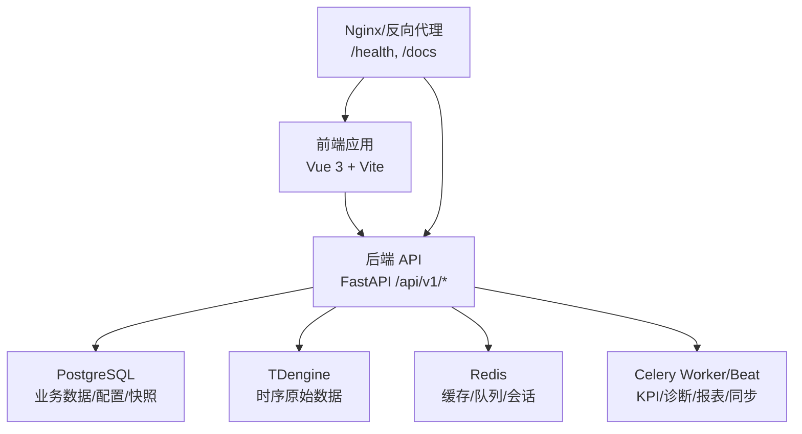
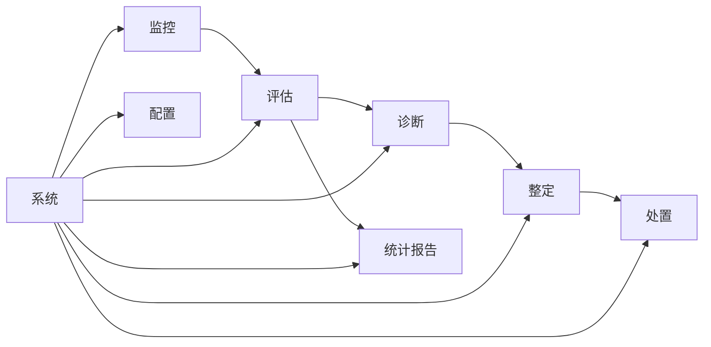
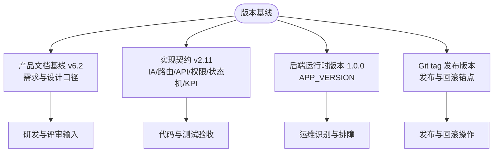
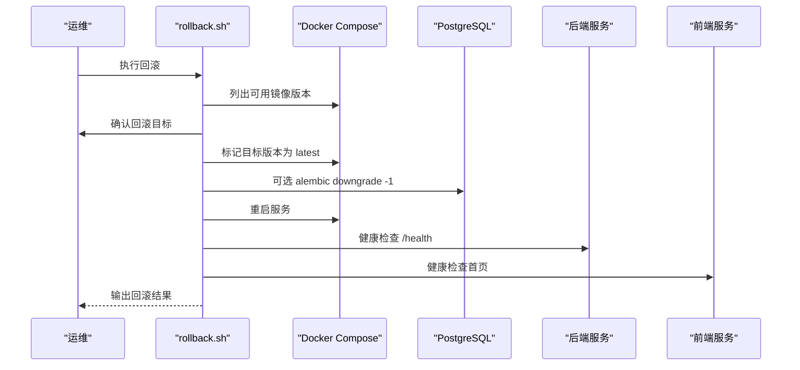
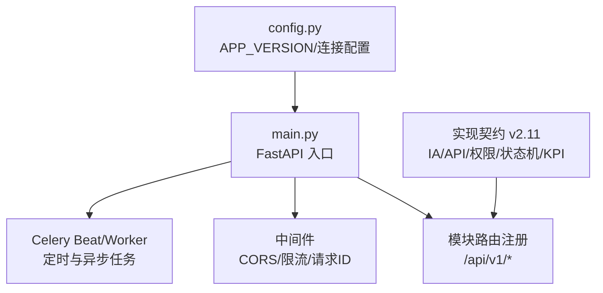

# 版本与文档基线

<cite>
**本文引用的文件**   
- [README.md](file://README.md)
- [implementation-contract.md](file://docs/设计文档/00-BASELINE/implementation-contract.md)
- [FDS.md](file://docs/设计文档/02-FDS/FDS.md)
- [ADS.md](file://docs/设计文档/03-ADS/ADS.md)
- [DDS.md](file://docs/设计文档/04-DDS/DDS.md)
- [CLPM-IA优化实施方案-0822.md](file://docs/设计文档/IA 优化/CLPM-IA优化实施方案-0822.md)
- [main.py](file://backend/app/main.py)
- [config.py](file://backend/app/core/config.py)
- [rollback.sh](file://deploy/rollback.sh)
</cite>

## 目录
1. [引言](#引言)
2. [项目结构](#项目结构)
3. [核心组件](#核心组件)
4. [架构总览](#架构总览)
5. [详细组件分析](#详细组件分析)
6. [依赖关系分析](#依赖关系分析)
7. [性能考量](#性能考量)
8. [故障排查指南](#故障排查指南)
9. [结论](#结论)
10. [附录](#附录)

## 引言
本说明为 CLPM-MVP 的版本与文档基线，聚焦“产品文档基线 v6.2、实现契约 v2.11、后端运行时版本 1.0.0、Git tag 发布版本”的分工与关系，并给出当前有效文档索引、推荐阅读顺序、IA 优化 P0~P4 完成情况和最新变更、v4.0 重构历史与当前共识、文档维护规则以及版本回滚与升级指引。目标是帮助开发者快速理解项目的版本演进历程与当前状态，并在后续研发中遵循统一的基线与契约。

## 项目结构
CLPM-MVP 采用前后端分离与多仓库式组织：前端 monorepo（apps/web-antd 等）、后端 FastAPI 单体服务、Celery 异步任务、PostgreSQL/TDengine/Redis 基础设施、部署脚本与 E2E 测试。文档体系集中在 docs/设计文档、docs/过程文档、docs/归档文档、docs/MVP设计 等目录；生产与开发部署脚本位于 deploy/；数据库 DDL 在 db/。

图表来源
- [main.py:1-120](file://backend/app/main.py#L1-L120)
- [config.py:25-110](file://backend/app/core/config.py#L25-L110)

章节来源
- [README.md:22-36](file://README.md#L22-L36)
- [README.md:305-331](file://README.md#L305-L331)

## 核心组件
- 产品文档基线 v6.2：定义产品需求与设计口径，作为 PRD 与交付物对齐的权威源。
- 实现契约 v2.11：固化 IA、路由、API、权限、状态机、KPI、阶段口径等实现边界，是代码与测试验收的基准。
- 后端运行时版本 1.0.0：由 APP_VERSION 管理，用于运行时元数据与健康检查输出，便于运维识别运行实例版本。
- Git tag 发布版本：用于发布追踪与回滚锚点，与上述三者数值不必相等，职责不同。

章节来源
- [README.md:3-5](file://README.md#L3-L5)
- [README.md:333-348](file://README.md#L333-L348)
- [implementation-contract.md:22-33](file://docs/设计文档/00-BASELINE/implementation-contract.md#L22-L33)
- [config.py:25-35](file://backend/app/core/config.py#L25-L35)

## 架构总览
CLPM-MVP 以“监控→评估→诊断→整定→处置→统计报告”闭环为主线，结合智能预警与系统管理，形成面向危化企业控制回路绩效治理与优化的平台。当前有效信息架构收敛为 6 个一级模块（监控/评估/诊断/整定/配置/系统），并通过模块热插拔支持按客户阶段弹性启用。

图表来源
- [implementation-contract.md:35-63](file://docs/设计文档/00-BASELINE/implementation-contract.md#L35-L63)
- [CLPM-IA优化实施方案-0822.md:47-59](file://docs/设计文档/IA 优化/CLPM-IA优化实施方案-0822.md#L47-L59)

## 详细组件分析

### 版本分层与用途
- 产品文档基线 v6.2：PRD 与交付设计口径，指导功能范围、交互与指标体系。
- 实现契约 v2.11：当前 IA/路由/API/权限/状态机/KPI 的实现契约，代码与测试以此为验收依据。
- 后端运行时版本 1.0.0：APP_VERSION 默认值，健康检查返回，用于运行时识别。
- Git tag 发布版本：发布与回滚锚点，遵循语义化版本规范。

图表来源
- [implementation-contract.md:22-33](file://docs/设计文档/00-BASELINE/implementation-contract.md#L22-L33)
- [README.md:333-348](file://README.md#L333-L348)
- [config.py:25-35](file://backend/app/core/config.py#L25-L35)

章节来源
- [implementation-contract.md:22-33](file://docs/设计文档/00-BASELINE/implementation-contract.md#L22-L33)
- [README.md:333-348](file://README.md#L333-L348)

### 当前有效文档索引与推荐阅读顺序
- 当前有效文档类型与位置：
  - PRD（v6.2）：docs/设计文档/01-PRD/PRD.md
  - FDS（v6.0）：docs/设计文档/02-FDS/FDS.md
  - ADS（v6.0）：docs/设计文档/03-ADS/ADS.md
  - DDS（v6.0）：docs/设计文档/04-DDS/DDS.md
  - IDS（v6.0）：docs/设计文档/05-IDS/IDS.md
  - UI/UX（v6.2）：docs/设计文档/06-UIUX/ui-ux-design-guidelines.md
  - 实现契约（v2.11）：docs/设计文档/00-BASELINE/implementation-contract.md
  - IA 优化主方案（v1.2，P0~P4 已完成）：docs/设计文档/IA 优化/CLPM-IA优化实施方案-0822.md
  - IA 评审文档索引：docs/设计文档/IA 优化/README.md
  - v4.0 重构实施方案（历史实施蓝图）：docs/设计文档/CLPM_v4.0_系统重构实施方案.md
  - 原型设计基线：DESIGN.md（v3.0；现行路由以实现契约 v2.11 为准）
  - 原型代码入口：docs/设计文档/prototype/README.md
- 推荐阅读顺序：
  1. docs/过程文档/design-documents-index-2026-06-16.md
  2. docs/设计文档/00-BASELINE/implementation-contract.md
  3. docs/设计文档/01-PRD/PRD.md
  4. docs/设计文档/02-FDS/FDS.md
  5. docs/设计文档/04-DDS/DDS.md
  6. docs/设计文档/05-IDS/IDS.md
  7. docs/设计文档/06-UIUX/ui-ux-design-guidelines.md
  8. 需要追溯时再读 docs/归档文档/ 中的历史文档

章节来源
- [README.md:305-331](file://README.md#L305-L331)

### IA 优化 P0~P4 完成情况与最新变更
- P0：统计报告一级菜单落地（order=6），包含管理总览/绩效报告/诊断报告/处置报告/收益报告/订阅配置，旧路径 redirect 就位。
- P1：模块热插拔落地（注册中心 + 守卫 + 条件 beat 注册 + 跨模块守卫），支持诊断/整定/处置弹性启用。
- P2：适用性评估 L0~L4 落地（fitness 三字段加 KPI 快照、ClpmFitnessBadge 组件、7 个 IA 落点、诊断/整定门禁）。
- P3：管理总览 S2/S3 自适应 + PDF 模板（按成熟度呈现内容）。
- P4：真实数据验证 + 阈值调优（27 回路真实 DCS 数据一致率 ≥85%）。
- 最新变更要点：
  - 左导航顺序：监控1/评估2/诊断3/整定4/处置5/统计报告6/配置7/系统8。
  - 页面标杆设计落地（系统概览页 R1~R4 重写、关注队列列宽优化）。
  - Celery Worker/Beat 清理加固（三层清理：killpg、pgrep SIGTERM、SIGKILL）。
  - KPI 指标条紧凑化（合并为 7 项 strip）。
  - 异步 PDF 导出（TaskType.REPORT，进度分段更新，安全下载）。

章节来源
- [CLPM-IA优化实施方案-0822.md:10-17](file://docs/设计文档/IA 优化/CLPM-IA优化实施方案-0822.md#L10-L17)
- [CLPM-IA优化实施方案-0822.md:47-59](file://docs/设计文档/IA 优化/CLPM-IA优化实施方案-0822.md#L47-L59)
- [implementation-contract.md:7-12](file://docs/设计文档/00-BASELINE/implementation-contract.md#L7-L12)

### v4.0 重构历史与当前共识
- v4.0 重构历史（Phase 0-6）：ORM 模型层更新、数据预处理模块、DataPlanner+Cache、kpi_calc 整合、API 扩展、前端适配、修复 Celery worker 任务注册、v6.0 文档统一升级。
- 当前共识：
  - 产品定位：产品化、工具化的控制回路绩效治理与优化闭环平台。
  - 首版主线：Phase 1（MVP/V1.0）跑通自动评估、自动诊断、轻量跟踪、模块弹性交付、适用性分层与管理决策视图。
  - 首版范围：监控、回路结构配置、性能评估、诊断中心、回路整定、处置 v2.0、统计报告、预警规则归配置、系统管理。
  - 模块架构：8 个一级模块（监控/评估/诊断/整定/处置/统计报告/配置/系统），双轴导航与各模块“配置→运行→分析”自包含。
  - 工程主约束：PRD v6.2 负责产品需求；实现契约 v2.11 负责当前 IA/路由/API/权限/状态机/KPI；UI/UX v6.2 负责视觉与交互。

章节来源
- [README.md:349-362](file://README.md#L349-L362)
- [README.md:333-348](file://README.md#L333-L348)

### 文档维护规则
- 现行需求、原型、研发拆解和投标响应统一以 docs/设计文档/01-PRD/PRD.md 为准。
- 归档目录（docs/归档文档/）下的文件只用于历史追溯，不作为新一轮评审输入。
- 新一轮架构、设计或专项设计必须先吸收 approved 产品化架构和最新 PRD 的结论，再继续扩写。
- PDF 原始资料及外部参考手册统一存放于 docs/预研文档/。
- 版本发布使用 git tag 标记（如 v1.0.0），遵循语义化版本规范。

章节来源
- [README.md:391-398](file://README.md#L391-L398)

### 版本回滚与升级说明
- 回滚：使用 deploy/rollback.sh 列出历史镜像版本，确认后回滚到上一版本；可选择是否回滚数据库 Schema（alembic downgrade -1）。
- 升级：部署脚本会执行 alembic upgrade head，失败即中止；构建前跑测试门禁（ruff + pytest + check:type），紧急可跳过。
- 健康检查：回滚后等待服务健康检查通过（后端 /health、前端访问）。

图表来源
- [rollback.sh:1-126](file://deploy/rollback.sh#L1-L126)

章节来源
- [README.md:274-280](file://README.md#L274-L280)
- [rollback.sh:1-126](file://deploy/rollback.sh#L1-L126)

## 依赖关系分析
- 后端入口 main.py 注册各模块路由，集成中间件、CORS、全局异常处理，并在 lifespan 中启动 Celery Beat/Worker（生产环境由独立容器接管）。
- 配置 config.py 提供 APP_VERSION、数据库/缓存/消息队列/AAS/网络模式等设置，生产环境强制校验密钥与安全参数。
- 实现契约 v2.11 对路由、API、权限、状态机、KPI 进行契约化约定，确保前后端与测试一致性。

图表来源
- [main.py:1-120](file://backend/app/main.py#L1-L120)
- [config.py:25-110](file://backend/app/core/config.py#L25-L110)
- [implementation-contract.md:35-63](file://docs/设计文档/00-BASELINE/implementation-contract.md#L35-L63)

章节来源
- [main.py:1-120](file://backend/app/main.py#L1-L120)
- [config.py:25-110](file://backend/app/core/config.py#L25-L110)
- [implementation-contract.md:35-63](file://docs/设计文档/00-BASELINE/implementation-contract.md#L35-L63)

## 性能考量
- 计算类历史数据查询一律走本地 TDengine，避免远端接口压力与不确定性。
- DataPlanner 引入 tagGroup 与 DataBlock 缓存，合并查询计划，减少重复拉取。
- LTTB 降采样 maxPoints=2000，30 天时间窗口，保障波形渲染性能。
- Celery Worker/Beat 清理加固，防止进程残留影响稳定性。

章节来源
- [README.md:106-136](file://README.md#L106-L136)
- [implementation-contract.md:406-415](file://docs/设计文档/00-BASELINE/implementation-contract.md#L406-L415)
- [implementation-contract.md:599-612](file://docs/设计文档/00-BASELINE/implementation-contract.md#L599-L612)

## 故障排查指南
- 健康检查：后端 /health 返回 version（APP_VERSION），前端访问根路径验证。
- 部署问题：部署脚本失败（alembic upgrade head、测试门禁）需先解决前置条件。
- 回滚问题：若无法获取历史镜像版本，需确认已构建带 tag 的镜像。
- 权限问题：EXPERT 角色扩展 loop:view 只读监控，避免 403 误报。
- 实时数据：SignalR Hub 断线重连指数退避，必要时检查网络模式（局域网/公网）。

章节来源
- [README.md:208-227](file://README.md#L208-L227)
- [README.md:274-280](file://README.md#L274-L280)
- [implementation-contract.md:599-612](file://docs/设计文档/00-BASELINE/implementation-contract.md#L599-L612)

## 结论
CLPM-MVP 当前以产品文档基线 v6.2 为需求与设计口径，以实现契约 v2.11 为代码与测试验收基准，后端运行时版本 1.0.0 用于运行时识别，Git tag 用于发布与回滚。IA 优化 P0~P4 已全部落地，统计报告一级化、模块热插拔、适用性 L0~L4 门禁与真实数据验证均已生效。建议开发者优先阅读实现契约与 PRD，再按需深入 FDS/ADS/DDS/UIUX，并在后续迭代中严格遵循文档维护规则与版本分层原则。

## 附录
- 技术栈概览：前端 Vue 3 + TypeScript + Vite + vue-vben-admin；后端 Python 3.12 + FastAPI + SQLAlchemy 2.0 + Pydantic v2；异步任务 Celery + Redis；数据库 PostgreSQL 16 + TDengine 3.3.6；鉴权 JWT + RBAC。
- 数据链路：历史数据导入走远端 AAS 接口，计算类查询走本地 TDengine；实时数据唯一来源 SignalR Hub，写入 Redis 实时缓存并可写回 TDengine。
- 部署与运维：Docker Compose 编排，生产 Nginx 反向代理，监控可选（Prometheus + Grafana），HTTPS 模板就绪。

章节来源
- [README.md:22-36](file://README.md#L22-L36)
- [README.md:106-136](file://README.md#L106-L136)
- [README.md:163-227](file://README.md#L163-L227)