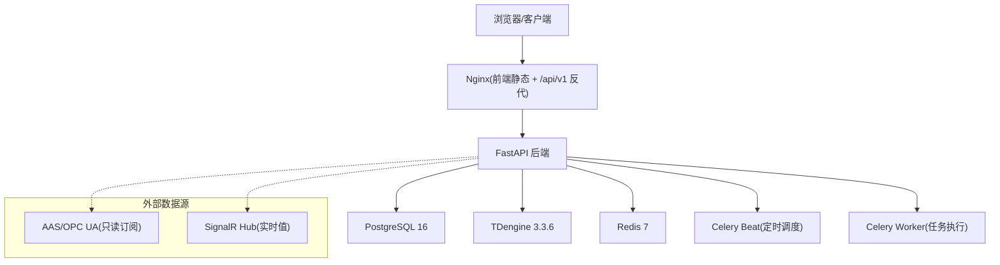
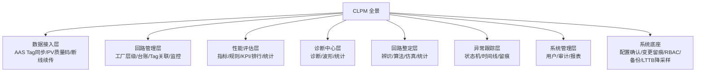
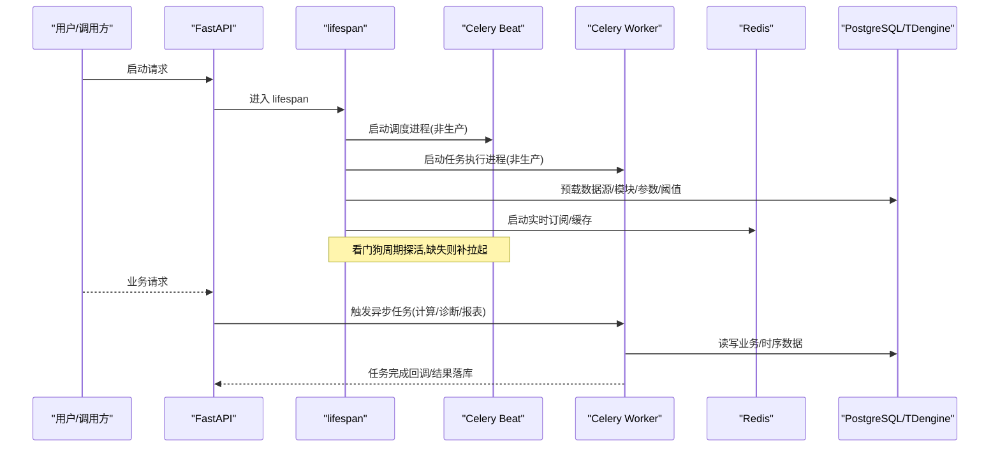
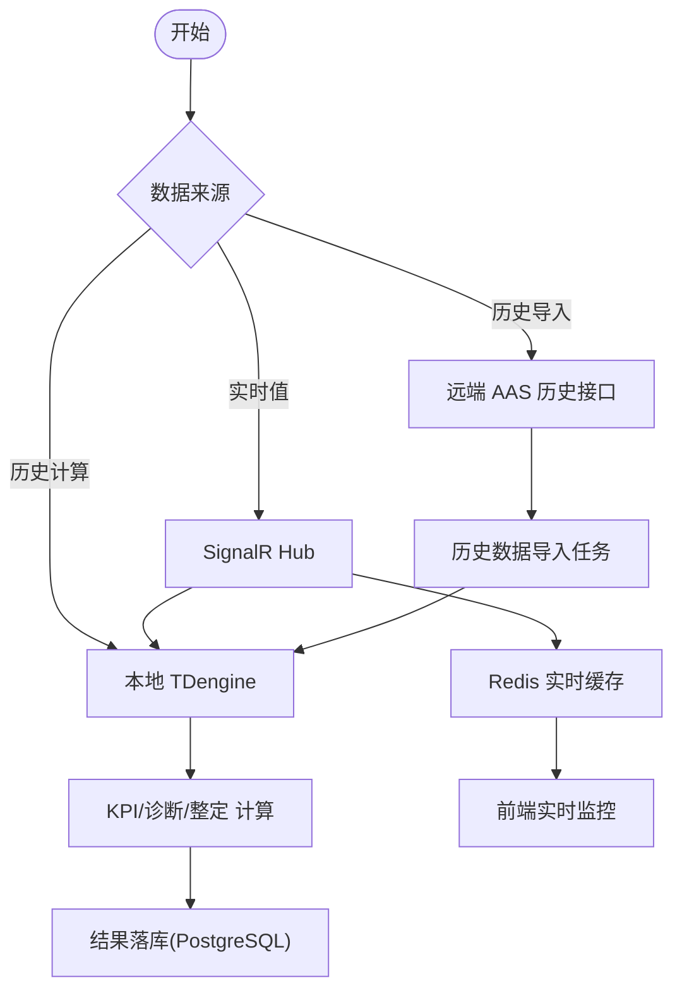
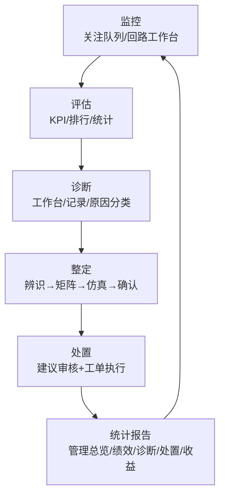
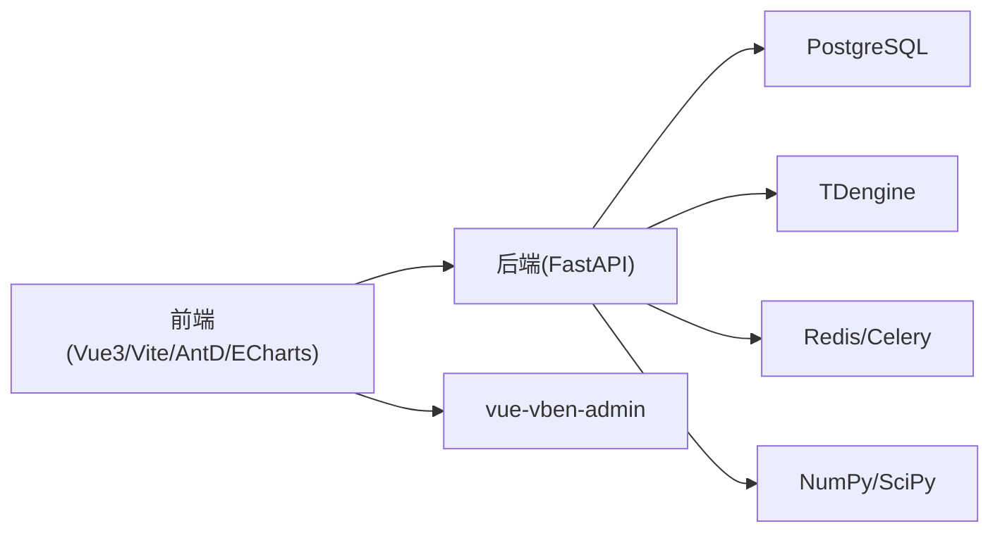

# 项目概述

<cite>
**本文引用的文件**
- [README.md](file://README.md)
- [DESIGN.md](file://DESIGN.md)
- [backend/pyproject.toml](file://backend/pyproject.toml)
- [backend/app/main.py](file://backend/app/main.py)
- [docs/MVP设计/01-总体方案.md](file://docs/MVP设计/01-总体方案.md)
- [diagrams/clpm-overview.mmd](file://diagrams/clpm-overview.mmd)
- [diagrams/clpm-full-picture.mmd](file://diagrams/clpm-full-picture.mmd)
- [frontend/CLPM-FRONTEND.md](file://frontend/CLPM-FRONTEND.md)
</cite>

## 目录
1. [引言](#引言)
2. [项目结构](#项目结构)
3. [核心组件](#核心组件)
4. [架构总览](#架构总览)
5. [详细组件分析](#详细组件分析)
6. [依赖关系分析](#依赖关系分析)
7. [性能与可运维性](#性能与可运维性)
8. [故障排查指南](#故障排查指南)
9. [结论](#结论)
10. [附录：快速开始与基础使用](#附录快速开始与基础使用)

## 引言
CLPM-MVP（危化企业控制回路性能治理与优化平台）是面向化工、石化等流程工业的“产品化、工具化”的控制回路绩效治理与优化闭环平台。它以 v6.2 为产品基线，采用“MVP 精简 + 闭环重建”的策略，聚焦于在真实工程约束下跑通“监控→评估→诊断→整定→处置→统计报告”的完整业务闭环，并以“只读 DCS、只输出建议”的安全边界保障生产安全。

MVP 的特色在于：
- 精简而不失闭环：保留监控、评估、配置、系统四大模块的核心能力，同时通过“适用性分层 L0~L4”和“模块热插拔”，让不同成熟度客户按需启用诊断、整定、处置等能力，避免“无数据也硬算”导致的失真。
- 重建而非简单裁剪：对诊断、整定、处置进行重构式落地，形成两页式诊断工作台、三页式整定工作流、v2.0 双实体处置（建议审核+工单执行），并统一归口到一级菜单“统计报告”。
- 工程可交付：提供容器化部署、一键脚本、健康检查、回滚机制与监控集成，确保从开发到生产的平滑过渡。

本概述既帮助初学者建立整体认知框架，也为有经验的开发者提供技术背景与关键实现线索。

**章节来源**
- [README.md:7-20](file://README.md#L7-L20)
- [docs/MVP设计/01-总体方案.md:1-24](file://docs/MVP设计/01-总体方案.md#L1-L24)

## 项目结构
仓库采用前后端分离与多服务编排的工程组织方式：
- 后端：FastAPI + SQLAlchemy 异步 ORM + Celery 任务 + Redis 缓存/队列 + PostgreSQL 业务库 + TDengine 时序库
- 前端：Vue 3 + TypeScript + Vite + vue-vben-admin + Ant Design Vue + ECharts
- 部署：Docker + Docker Compose + Nginx 反向代理；支持 Prometheus/Grafana 可选监控 profile
- 测试：pytest/vitest + Playwright E2E

**图表来源**
- [diagrams/clpm-full-picture.mmd:1-94](file://diagrams/clpm-full-picture.mmd#L1-L94)
- [backend/app/main.py:1-12](file://backend/app/main.py#L1-L12)

**章节来源**
- [README.md:22-36](file://README.md#L22-L36)
- [frontend/CLPM-FRONTEND.md:87-113](file://frontend/CLPM-FRONTEND.md#L87-L113)
- [backend/pyproject.toml:1-39](file://backend/pyproject.toml#L1-L39)

## 核心组件
- 监控：关注队列（ALERT/DEGRADATION/DATA_QUALITY 聚合）、回路工作台（运行态/评分趋势/诊断卡/活跃关注/L2 适用性横幅）、装置总览（L0~L4 适用性堆叠横条）
- 性能评估：KPI 看板、节点排名、统计分析、指标配置（定义/规则/权重/阈值/算法参数/适用性阈值）、可信度标识
- 诊断（MVP 重建）：诊断工作台（发起+结果一体）、诊断记录（历史+导出）、6+1 原因分类体系、元算子架构、证据污染链、适用性门禁（L0/L1 阻止、L2 条件异常横幅）
- 整定（MVP 重建）：辨识→矩阵→仿真→确认单页流程、效果验证（前后窗曲线对比 + X-Y）、适用性门禁（L3 以下入口 disabled + 返回不足错误码）
- 处置（MVP 新建 v2.0）：建议审核（接受/驳回/忽略 + 批量转工单）、工单执行（清单+详情抽屉含反馈追加/提交验证/KPI 对比/闭环重开）、五态/六态状态机
- 统计报告：管理总览（S1/S2/S3 自适应）、绩效/诊断/处置/收益报告、订阅配置；旧路径全局 redirect
- 智能预警：规则引擎（阈值/漂移/组合/可信度 DSL）+ 事件流（确认→处置→归档）+ 顶栏通知铃铛/ws/alerts 实时推送
- 系统管理：用户/审计/权限矩阵/字典/模块热插拔开关（诊断/整定/处置按阶段弹性启用禁用）

**章节来源**
- [README.md:9-19](file://README.md#L9-L19)
- [docs/MVP设计/01-总体方案.md:25-52](file://docs/MVP设计/01-总体方案.md#L25-L52)

## 架构总览
CLPM-MVP 以“功能主轴 + 场景聚合”的双轨 IA 组织：左侧导航按专业能力划分一级模块，首页/工作台/报告中心按角色任务串联跨模块能力。平台能力围绕可信数据、可解释诊断、可验证整定、安全闭环与产品化交付展开，版本路线分 Phase 1（MVP 闭环）、Phase 2（整定落地）、Phase 3（企业平台）。

**图表来源**
- [diagrams/clpm-full-picture.mmd:1-94](file://diagrams/clpm-full-picture.mmd#L1-L94)

**章节来源**
- [diagrams/clpm-overview.mmd:1-32](file://diagrams/clpm-overview.mmd#L1-L32)
- [docs/MVP设计/01-总体方案.md:38-45](file://docs/MVP设计/01-总体方案.md#L38-L45)

## 详细组件分析

### 后端应用启动与生命周期（FastAPI + Celery）
后端以 FastAPI 作为 API 网关，lifespan 中自动拉起 Celery Beat 与 Worker（非生产环境），并提供看门狗周期性探活缺失时自动补拉起；同时预载数据源配置、模块启用状态、异常值检测参数、算法参数、可信度阈值等运行时真相源，启动实时数据订阅器，并在关闭时有序清理资源。

**图表来源**
- [backend/app/main.py:1-12](file://backend/app/main.py#L1-L12)
- [backend/app/main.py:320-410](file://backend/app/main.py#L320-L410)
- [backend/app/main.py:457-562](file://backend/app/main.py#L457-L562)
- [backend/app/main.py:564-608](file://backend/app/main.py#L564-L608)
- [backend/app/main.py:610-762](file://backend/app/main.py#L610-L762)

**章节来源**
- [backend/app/main.py:1-12](file://backend/app/main.py#L1-L12)
- [backend/app/main.py:320-410](file://backend/app/main.py#L320-L410)
- [backend/app/main.py:457-562](file://backend/app/main.py#L457-L562)
- [backend/app/main.py:564-608](file://backend/app/main.py#L564-L608)
- [backend/app/main.py:610-762](file://backend/app/main.py#L610-L762)

### 数据链路（历史/实时/远端）
- 历史数据：计算一律走本地 TDengine；远端 AAS 历史接口仅用于“历史数据导入”任务
- 实时数据：唯一来源 SignalR Hub，写入 Redis 实时缓存（页面实时监控）并可写回本地 TDengine（KPI 计算）
- 网络链路：局域网/公网切换仅影响是否经 Tailscale 转发，不改变数据源

**图表来源**
- [README.md:106-140](file://README.md#L106-L140)

**章节来源**
- [README.md:106-140](file://README.md#L106-L140)

### 业务闭环（监控→评估→诊断→整定→处置→统计报告）

**图表来源**
- [README.md:9-19](file://README.md#L9-L19)

**章节来源**
- [README.md:9-19](file://README.md#L9-L19)

### MVP 精简与闭环重建要点
- 精简策略：第一轮采用“注释屏蔽 + 条件隐藏”，保留代码但屏蔽路由/API/任务注册，数据库 schema 不变
- 闭环重建：诊断/整定/处置均按新设计落地，形成可操作、可验证、可追溯的业务闭环
- 端口隔离：MVP 与原 CLPM 同机并行，端口在原基础上 +10000，容器名/数据卷前缀区分

**章节来源**
- [docs/MVP设计/01-总体方案.md:25-52](file://docs/MVP设计/01-总体方案.md#L25-L52)
- [docs/MVP设计/01-总体方案.md:54-74](file://docs/MVP设计/01-总体方案.md#L54-L74)

## 依赖关系分析
- 前端依赖：vue-vben-admin 布局与组件生态、Ant Design Vue、ECharts 可视化
- 后端依赖：FastAPI、SQLAlchemy 异步、Pydantic v2、Celery/Beat、Redis、PostgreSQL、TDengine、NumPy/SciPy 算法栈
- 部署依赖：Docker/Compose/Nginx；可选 Prometheus/Grafana
- 测试依赖：pytest/vitest/Playwright

**图表来源**
- [backend/pyproject.toml:1-39](file://backend/pyproject.toml#L1-L39)
- [frontend/CLPM-FRONTEND.md:87-113](file://frontend/CLPM-FRONTEND.md#L87-L113)

**章节来源**
- [backend/pyproject.toml:1-39](file://backend/pyproject.toml#L1-L39)
- [frontend/CLPM-FRONTEND.md:87-113](file://frontend/CLPM-FRONTEND.md#L87-L113)

## 性能与可运维性
- 性能特性
  - 计算类历史数据查询一律走本地 TDengine，避免远端抖动
  - LTTB 降采样 maxPoints=2000，30 天时间窗口，保证前端渲染流畅
  - Celery 异步削峰，Beat 定时调度 KPI/诊断/报表等任务
- 可运维性
  - 一键部署脚本包含迁移、构建、启动、健康检查、回滚
  - 生产默认启用 tdengine profile，内置实例固定 TDengine 3.3.6.6
  - 可选 monitoring profile 集成 Prometheus/Grafana，内网白名单采集
  - 健康检查：/health 与 celery inspect ping/scheduled 硬断言

**章节来源**
- [README.md:163-228](file://README.md#L163-L228)
- [README.md:229-250](file://README.md#L229-L250)
- [README.md:252-294](file://README.md#L252-L294)

## 故障排查指南
- 启动问题
  - 若 Celery Beat/Worker 未启动或丢失，lifespan 中的看门狗会尝试补拉起；如仍失败，查看 logs/celery-beat.log 与 logs/celery-worker.log
  - 生产环境由独立容器接管 Beat/Worker，需检查对应容器状态
- 数据链路问题
  - 历史数据导入失败：检查 AAS 历史接口地址与鉴权 Token
  - 实时数据不更新：检查 SignalR Hub URL、网络模式（局域网/公网）与 Redis 连接
- 部署与健康
  - 使用 docker compose ps 查看服务状态
  - 访问 /health 检查后端存活；访问前端根路径检查 Nginx 反代
- 回滚与恢复
  - 使用 deploy/rollback.sh 列出历史镜像并回滚
  - 重新初始化数据库需先 down -v 再 up（谨慎操作）

**章节来源**
- [backend/app/main.py:564-608](file://backend/app/main.py#L564-L608)
- [README.md:208-228](file://README.md#L208-L228)
- [README.md:274-303](file://README.md#L274-L303)

## 结论
CLPM-MVP 以“精简但不失闭环”的方式，将控制回路绩效治理与优化的核心能力产品化、工程化地交付给现场。通过适用性分层与模块热插拔，平台能够适配不同成熟度的客户；通过本地 TDengine 与异步任务架构，保障计算性能与稳定性；通过“只读 DCS、只输出建议”的安全边界，确保生产安全。对于初学者，可从“监控→评估→诊断→整定→处置→统计报告”的闭环入手；对于开发者，可重点关注后端生命周期管理、数据链路、Celery 任务编排与前后端模块热插拔机制。

[本节不直接分析具体文件，无需“章节来源”]

## 附录：快速开始与基础使用

### 环境要求
- Node.js ≥ 22.18.0 + pnpm ≥ 10.0.0
- Python 3.12 + uv ≥ 0.4
- Docker 24+（推荐 Orbstack）

### 启动基础设施
- 使用开发编排启动 PostgreSQL、TDengine、Redis、mock_data_server

### 启动后端
- 复制 .env.example 为 .env，安装依赖，执行数据库迁移，启动 Uvicorn（端口 17101）
- 后端 API 文档：http://localhost:17101/docs

### 启动前端
- 安装依赖，运行 dev:antd（端口 15666）
- 前端访问地址：http://localhost:15666

### 默认账号
- 5 个种子用户，密码统一 admin123
- 首次登录强制改密（全新部署的种子账户 must_change_password=True）

### 运行测试
- 后端单元测试：pytest
- 前端类型检查：check:type
- E2E 测试：Playwright

### 端口与隔离
- 开发环境端口：后端 17101、前端 15666、mock 数据服务 17106
- 容器名/数据卷前缀：clpm-mvp-* / clpm_mvp_*

**章节来源**
- [README.md:38-104](file://README.md#L38-L104)
- [README.md:142-161](file://README.md#L142-L161)
- [docs/MVP设计/01-总体方案.md:54-74](file://docs/MVP设计/01-总体方案.md#L54-L74)