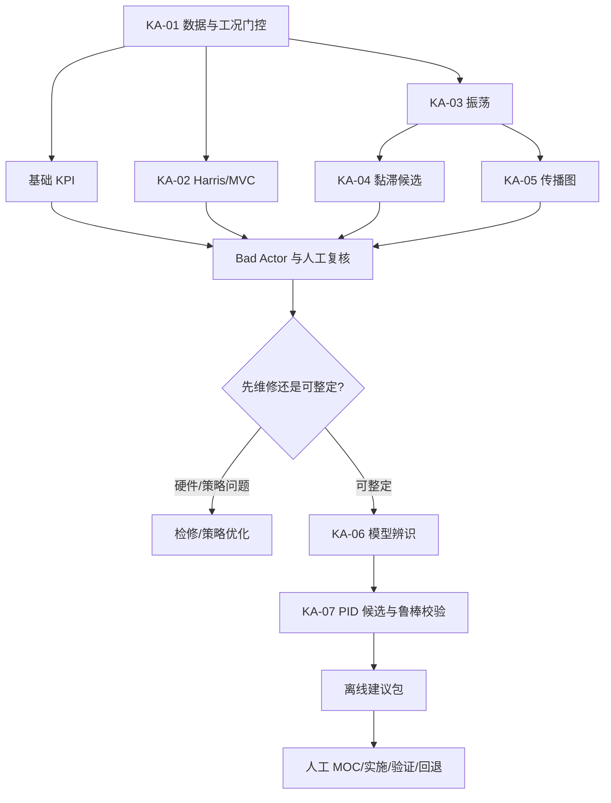

# CLPM 关键算法设计说明文档

| 文档属性 | 值 |
|---|---|
| 文档编号 | CLPM-ADS-SUP-ALG-002 |
| 文档性质 | ADS v3.0 受控正式补充文件候选 - 关键算法设计 |
| 文档状态 | 待标准责任人批准 |
| 版本 | v1.0 |
| 日期 | 2026-06-21 |
| 配套总体设计 | CLPM-ADS-SUP-ALG-001 |

---

## 1. 算法设计背景与目标

### 1.1 背景

控制回路长期运行后，传感器、阀门、工况和控制参数都会变化。单独使用方差、自控率或一次阶跃试验，无法可靠回答以下问题：

- 数据是否足以支撑结论？
- 回路与它在当前工况下可达到的最佳性能相差多少？
- 振荡是由 PID、阀门、外部扰动还是其他回路传播引起？
- 当前数据能否辨识出足够可信的过程模型？
- 新 PID 参数在模型误差、噪声、限位和安全边界下是否仍可接受？

因此需要将“数据门控 - 性能表征 - 故障证据 - 模型辨识 - 鲁棒整定 - 人工变更”设计为一个可追溯的链条。

### 1.2 目标

1. 对每个结果给出数学定义、计算步骤、参数范围、适用条件和失效信号。
2. 对计算失败和不适用设置显式状态，优先“不下结论”而不是输出伪精确结果。
3. 使算法可在 1200+ 回路上异步并行，且对单回路任务无状态、幂等、可回放。
4. 整定仅生成离线建议和证据包，不得直接写入 DCS。

### 1.3 共同输入、符号和状态

| 符号 | 含义 |
|---|---|
| `t_k`, `dt_k` | 第 `k` 个样本时刻及持续时间 |
| `y_k`, `r_k`, `u_k` | PV、SP、OP |
| `e_k=r_k-y_k` | 控制误差，内部统一定义 |
| `m_k` | 数据质量、工况、MODE 联合有效掩码 |
| `Ts` | 标称采样周期，秒 |
| `span_y` | PV 工程量程 |
| `theta` | 过程纯滞后，秒 |
| `d` | 经离散模型或脉冲/阶跃数据验证的有效输入-输出延迟样本数；包括纯滞后、ZOH/采样时序和相对阶次影响 |

结果拆分为 `execution_status`、`result_type`、`outcome`和 `reason_codes`。`execution_status=SUCCESS/PARTIAL/INCONCLUSIVE/FAILED` 只表示计算是否可用；`outcome` 表示业务结论。数学上可计算但不符合适用条件时，必须返回 `INCONCLUSIVE`，不得返回 `SUCCESS` 加低置信分来规避门控。计算完成但无安全 PID 候选时，则返回 `execution_status=SUCCESS,outcome=REJECTED`。

---

## 2. KA-01 时间加权质量门控与基础 KPI

### 2.1 设计目标

在不规则采样、通信缺口和质量码切换下，正确计算好值率、自控率、有效自控率、饱和率、平稳率和准确率，并产生所有高级算法共用的有效工况分段。

### 2.2 数学模型

为防止缺口前的最后一个样本被错误延伸：

$$
\Delta t_k^*=\min(t_{k+1}-t_k,\gamma T_s)
$$

$$
Coverage=\frac{\sum\Delta t_k^*}{T_w},\quad
GoodRate=\frac{\sum\Delta t_k^*I(q_k=GOOD)}{T_w}
$$

$$
AutoRate=\frac{\sum\Delta t_k^*I(mode_k\in M_{auto})I(eligible_k)}{\sum\Delta t_k^*I(eligible_k)}
$$

$$
EffectiveAutoRate=\frac{\sum\Delta t_k^*I(auto_k)I(\neg saturated_k)I(pathValid_k)}{\sum\Delta t_k^*I(eligible_k)}
$$

$$
SaturationRate=\frac{\sum\Delta t_k^*I(auto_k)I(u_k\le L+\epsilon_u\lor u_k\ge H-\epsilon_u)}{\sum\Delta t_k^*I(auto_k)}
$$

其中 `auto_k=I(eligible_k and mode_k in AUTO/CAS/REMOTE)`。CAS 控制链失效仍计入 `AutoRate`，但 `pathValid=0` 使其不计入 `EffectiveAutoRate`。饱和率的分子和分母都只包含 `eligible and auto_mode`。

平稳工况内的时间加权均值和方差：

$$
\mu_x=\frac{\sum m_k\Delta t_k^*x_k}{\sum m_k\Delta t_k^*},\quad
\sigma_x^2=\frac{\sum m_k\Delta t_k^*(x_k-\mu_x)^2}{\sum m_k\Delta t_k^*}
$$

### 2.3 计算步骤

1. 按时间排序，删除无法决定优先级的同时刻冲突样本并记录质量事件。
2. 根据 `gamma*Ts` 封顶每个样本的持续时间，其余时间计入 gap。
3. 分别构造质量、工况、MODE、饱和、控制链有效掩码。
4. 计算 L0/L1 门控指标；门控失败则停止后续 KPI。
5. 对合格段依次计算误差、平稳、准确、积分误差和事件响应。
6. 合并分段结果，同时保留每段的状态和分母。

### 2.4 关键参数

| 参数 | 类型 | 取值范围/默认 | 来源 |
|---|---|---|---|
| `gap_factor` | float64 | `[1.1,3.0]`，默认 1.5 | 数据工程配置 |
| `min_coverage` | float64 | `(0,1]`，项目初值 0.80 | 企业数据质量要求 |
| `min_good_rate` | float64 | `(0,1]`，DDS 初值 0.20 | 上线前按正式标准/企业规则确认 |
| `op_epsilon_pct` | float64 | `max(0.2,3*resolution)` | DCS 精度与阀门规格 |
| `steady_band` | float64 | `>0` | 工艺卡片/质量要求，不可自动放宽 |

### 2.5 伪代码

```text
function compute_base_metrics(samples, cfg):
    rows = stable_sort_and_resolve_duplicates(samples)
    acc = new_time_accumulator()

    for k in 0 .. rows.length-2:
        raw_dt = rows[k+1].ts - rows[k].ts
        dt = min(raw_dt, cfg.gap_factor * cfg.sample_period)
        acc.covered += dt
        acc.gap += raw_dt - dt

        if rows[k].quality == GOOD:
            acc.good += dt
        if is_eligible(rows[k]):
            acc.eligible += dt
        if is_eligible(rows[k]) and is_auto_mode(rows[k]):
            acc.auto += dt
        if is_eligible(rows[k]) and is_auto_mode(rows[k]) \
           and is_control_chain_valid(rows[k]) and not is_saturated(rows[k]):
            acc.effective_auto += dt
        if is_eligible(rows[k]) and is_auto_mode(rows[k]) \
           and is_saturated(rows[k]):
            acc.saturated += dt

    if acc.covered/window < cfg.min_coverage:
        return INCONCLUSIVE(LOW_COVERAGE)
    if acc.good/window < cfg.min_good_rate:
        return INCONCLUSIVE(LOW_GOOD_VALUE_RATE)

    segments = split_by_mode_sp_pid_and_operating_condition(rows)
    return metrics_from_valid_segments(acc, segments)
```

### 2.6 复杂度

- 时间：已排序输入 `O(n)`；需排序时 `O(n log n)`。
- 空间：流式累加 `O(1)`；保留分段索引 `O(s)`。

### 2.7 验证方法与预期结果

| 测试 | 构造 | 预期 |
|---|---|---|
| 等间隔基准 | 100% GOOD/AUTO，无饱和 | 三个比率均为 1 |
| 长缺口 | 中间缺 20% 窗口 | 覆盖率 0.8，前一样本不跨 gap 延伸 |
| 不规则采样 | 高频段与低频段混合 | 时间加权结果与真实持续时间一致，不被样本密度偏置 |
| 门控失败 | GOOD 时长低于阈值 | `INCONCLUSIVE`，KPI `null` 而非 0 |

---

## 3. KA-02 Harris/MVC 性能基准

### 3.1 设计目标和原理

Harris 指数估计当前闭环输出方差与最小方差控制基准之间的差距。对线性过程、加性扰动和已知纯滞后，正常闭环数据可以估计该下界，无需主动开环试验。

将平稳工况内的误差或去设定值输出表示为创新模型：

$$
e_t=F(q^{-1})a_t,\quad F(q^{-1})=\sum_{i=0}^{\infty}f_iq^{-i},\quad f_0=1
$$

纯滞后 `d` 内的扰动不能被反馈消除：

$$
\hat\sigma_{MV}^2=\hat\sigma_a^2\sum_{i=0}^{d-1}\hat f_i^2,\quad
\eta_H=\frac{\hat\sigma_{MV}^2}{\hat\sigma_e^2}
$$

### 3.2 输入与适用性检查

| 输入 | 类型 | 要求 |
|---|---|---|
| `e[]` | float64[] | 等间隔、同工况、自动模式、去 SP 事件和饱和段 |
| `d` | int32 | `1..min(200,n/20)`，来自已验证的离散模型或物理测试；不由 `ceil(theta/Ts)` 唯一决定 |
| `p_max` | int32 | 建议 `min(50,n/20)` |
| `criterion` | enum | `AICc` 或 `BIC` |

以下任一条件使算法不可判定：工况或参数变化、明显趋势/单位根、超过阈值的饱和、纯滞后不确定、残差模型不合格。

### 3.3 详细步骤

1. 使用稳健中位数去中心，仅在有物理理由时去线性趋势。
2. 检查样本长度、方差下限、ADF/KPSS 和变点。
3. 对 `p=1..p_max` 拟合 AR(p)，以 AICc/BIC 选阶，并检查系统稳定性。
4. 从 AR 创新模型计算创新方差和前 `d` 个 MA 脉冲系数。
5. 计算 `sigma_mv2` 和原始指数。原始值超出 `[0,1]` 是模型/样本误差信号，同时输出 raw 和 clipped 值。
6. 对时间块做 moving-block bootstrap，估计 95% 置信区间。
7. 对创新做 Ljung-Box 检验；不合格则降级或拒绝。

### 3.4 伪代码

```text
function harris_index(error, delay_samples, cfg):
    x = select_stationary_regulatory_segment(error)
    if not applicability_checks_pass(x, delay_samples):
        return INCONCLUSIVE(NONSTATIONARY_OR_DELAY_UNKNOWN)

    best = null
    for p in 1 .. cfg.p_max:
        ar = fit_stable_ar(x, p)
        if ar.valid and (best is null or IC(ar) < IC(best)):
            best = ar

    if best is null or not ljung_box_pass(best.innovation):
        return INCONCLUSIVE(RESIDUAL_MODEL_INVALID)

    f = innovation_impulse_coefficients(best, delay_samples)
    sigma_mv2 = best.innovation_variance * sum(square(f))
    eta_raw = sigma_mv2 / variance(x)
    ci = moving_block_bootstrap(x, delay_samples, cfg)

    return SUCCESS(
        eta_raw=eta_raw,
        eta=clip(eta_raw, 0, 1),
        sigma_mv2=sigma_mv2,
        ar_order=best.order,
        confidence_interval=ci
    )
```

### 3.5 复杂度

- 复用 Levinson-Durbin 或嵌套 QR 的 AR 选阶可达约 `O(n*p_max+p_max^2)`；若每阶独立普通 QR/OLS，必须按逐阶求和计为 `O(n*p_max^3+p_max^4)` 上界。空间为 `O(n+p_max^2)`。
- `B` 次 bootstrap 若固定已选阶数为 `O(B*n*p^2)`；若每次重新选阶，需再乘入完整选阶成本。该过程应作为低频异步任务。

### 3.6 验证与预期结果

1. 使用线性 FOPDT + ARMA 扰动生成合成数据，对 MVC 和故意降额 PID 各生成 100 次重复序列。
2. MVC 数据的指数中位数应明显高于降额 PID，且真值应落入大部分 bootstrap 置信区间。
3. 对错误 `d`、SP 频繁变化、饱和、非线性和变工况样本，预期输出 `INCONCLUSIVE` 或显著的限制警告。
4. 不将低 `eta_H` 直接标记为“PID 不良”，只标记“方差改善空间”。

---

## 4. KA-03 ACF + Welch PSD 振荡检测

### 4.1 设计目标和原理

频谱峰可能由短时冲击或趋势产生，ACF 周期峰也可能由有色噪声产生。算法同时要求：

- ACF 峰/零交叉呈现稳定周期。
- Welch PSD 在同一频率附近有显著谱峰和足够带内能量。
- 时间窗覆盖足够周期，振荡在多个子窗持续存在。

Welch 带内能量比：

$$
\rho_P=\frac{\sum_{f\in[f_0-\Delta f,f_0+\Delta f]}P(f)}{\sum_{f\in\mathcal B}P(f)}
$$

半周期规则性：

$$
RI=clip\left(1-\frac{1.4826MAD(h_j)}{median(h_j)+\epsilon},0,1\right)
$$

### 4.2 计算步骤

1. 选择同工况的 PV-SP 误差或去趋势 PV，排除 SP 响应、缺口和饱和长段。
2. 用中位数和 MAD 归一化，需要时做目标频带零相位滤波；证据中保存滤波参数。
3. 用 FFT 计算 ACF，搜索第一个显著非零峰及后续整倍峰，得到 `T_acf`。
4. 以 Hann 窗、50% 重叠计算 Welch PSD，排除 DC 和不可辨识边缘频带，得到 `T_psd`。
5. 要求 `abs(T_acf-T_psd)/T_psd <= period_tolerance`，且谱突出度、带内能量比、RI 同时达标。
6. 将窗口切为多个子窗，将阳性子窗映射回时间区间并求区间并集，`oscillation_rate=positive_interval_union/eligible_duration`，避免重叠子窗重复计数。
7. 对主频带积分得到 `band_rms=sqrt(integral(P(f)df))`；对近正弦振荡报告等效峰值幅值 `amplitude_peak=sqrt(2)*band_rms`，并同时报告原始 PV 工程单位和 `%span`。

### 4.3 参数

| 参数 | 范围/初值 | 说明 |
|---|---|---|
| `min_cycles` | `3..8`，建议 5 | 越少检测越快，假阳越高 |
| `nperseg` | 2 的幂，覆盖 `>=2` 个最长候选周期 | 不大于有效样本数 |
| `overlap` | 0.5 | Welch 默认 |
| `period_tolerance` | `0.1..0.3`，初值 0.2 | ACF/PSD 一致性 |
| `spectral_prominence` | 由同类良好回路基线校准 | 不跨回路类型硬编码 |
| `min_energy_ratio` | `0.1..0.5` 候选 | 必须用标注数据确定 |

### 4.4 伪代码

```text
function detect_oscillation(segment, cfg):
    x = robust_detrend_and_normalize(segment.error_or_pv)
    if duration(x) < cfg.min_cycles * cfg.max_candidate_period:
        return INCONCLUSIVE(TOO_FEW_CYCLES)

    acf = fft_autocorrelation(x)
    T_acf, regularity = acf_period_and_regularity(acf)

    f, psd = welch(x, hann, cfg.nperseg, cfg.overlap)
    f0, prominence = dominant_peak(psd, cfg.frequency_band)
    T_psd = 1 / f0
    energy_ratio = band_energy(psd, f0) / total_band_energy(psd)

    consistent = relative_difference(T_acf, T_psd) <= cfg.period_tolerance
    detected = consistent and regularity >= cfg.min_regularity \
               and prominence >= cfg.min_prominence \
               and energy_ratio >= cfg.min_energy_ratio

    intervals = merge_positive_subwindow_intervals(x, cfg)
    persistence = duration(union(intervals)) / eligible_duration(x)
    band_rms = sqrt(integrate_psd_around(f0, psd))
    amplitude_peak = sqrt(2) * band_rms
    return result(detected, T_psd, regularity, prominence,
                  energy_ratio, persistence, band_rms, amplitude_peak)
```

### 4.5 复杂度

- ACF 和 Welch：时间 `O(n log n)`，空间 `O(n)`。
- 子窗可复用 FFT 计划，且只对 Bad Actor 或周期任务执行。

### 4.6 验证与预期结果

- 对正弦、非正弦极限环、振幅渐变、有色噪声、趋势、单脉冲和 SP 阶跃生成分层合成集。
- 当信噪比和观测周期达标时，主周期相对误差的验收目标为 `<=10%`。
- 单脉冲和单次阶跃不应因单一频谱峰被判为持续振荡。
- 现场盲测报告 precision/recall、按回路类型的假阳率和检出延迟，不只报告总准确率。

### 4.7 配套诊断算法卡

#### 4.7.1 测量冻结

对滚动窗 `W`，定义 `R_y=max(y_W)-min(y_W)`。当 `R_y<=eps_y`且 OP、SP 或已知外扰在窗口内的变化超过各自分辨率时，窗口为冻结候选。`eps_y=max(3*pv_resolution,noise_floor)`，并要求持续时长 `>=dwell`。输出冻结时长率、最长持续时间和驱动信号变化证据。若所有相关信号均未变，只标记“缺少可观测激励”。

#### 4.7.2 测量噪声

将闭环带宽以上的低通趋势记为 `y_lp`，高频残差 `n=y-y_lp`：

$$
\hat\sigma_n=1.4826MAD(n),\quad
NR=\frac{\int_{f_h}^{f_N}P_y(f)df}{\int_{f_l}^{f_N}P_y(f)df}
$$

`f_h` 必须高于已知闭环带宽，不使用固定 Nyquist 比例。同时输出尖峰率、量化步长和一阶差分 MAD。若 OP 高频与 PV 同步，结论应保留“控制动作/外扰”可能性，不直接判传感器故障。

#### 4.7.3 偏移与漂移

在同工况的误差或过程模型残差上拟合 Theil-Sen 斜率 `beta`，归一化窗口漂移为：

$$
D=\frac{|\beta|T_w}{span_y}
$$

在已确认良好基线 `mu0,sigma0` 上运行双边 CUSUM：

$$
C_k^+=\max(0,C_{k-1}^++z_k-K),\quad
C_k^-=\min(0,C_{k-1}^-+z_k+K),\quad z_k=\frac{e_k-\mu_0}{\sigma_0}
$$

`C+>H` 或 `C-<-H` 形成变点候选。必须先排除 SP、负荷、牌号、仪表校准和模式变化。

#### 4.7.4 非平稳性

在等间隔、同工况且去事件的残差上联合使用 ADF 和 KPSS：

| ADF 单位根原假设 | KPSS 平稳原假设 | 结论 |
|---|---|---|
| 拒绝 | 不拒绝 | 可视为平稳 |
| 不拒绝 | 拒绝 | 非平稳 |
| 其他 | 其他 | 不充分，检查变点、趋势、样本长度 |

结论为非平稳时，Harris/MVC、稳态方差和基线阈值学习不可执行。

#### 4.7.5 积分饱和

定义“误差正在加深限位”掩码：

```text
pushes_further = (at_high_limit and action_sign*e > 0) or
                 (at_low_limit  and action_sign*e < 0)
windup_episode = auto and saturated and pushes_further for >= dwell
```

若可获取 DCS 未限幅输出，增加 `windup_area=integral(abs(u_raw-u_actual))`；否则只输出风险候选。记录解除饱和后误差回到容差带的恢复时间。

#### 4.7.6 过激与迟钝

对同回路类型、工况和采样配置的已确认良好基线，为每个“越大越差”特征保存 `q50_j,q95_j`：

$$
z_j=clip\left(\frac{x_j-q50_j}{q95_j-q50_j+\epsilon},0,1\right),\quad
Score=100\frac{\sum_jw_jz_j}{\sum_jw_j}
$$

过激特征集固定为 `OP_TRAVEL_PER_H`、`OP_REVERSALS_PER_H`、`SP_CROSSINGS_PER_H`、`OP_HF_ENERGY_RATIO`、`OSCILLATION_ENERGY_RATIO`。至少 3 个特征有效、回路在自动且未长期饱和、阀门无高置信黏滞时才计算 `AggressiveScore`。

迟钝使用合格动态事件 `i`，对 `delay/rise/settling/NIAE` 计算相对已批准目标的比率 `r_ij=x_ij/target_j`，再以已批准的不良比率 `r_bad_j>1` 归一化：

$$
z_{ij}=clip\left(\frac{r_{ij}-1}{r_{bad,j}-1},0,1\right),\quad
SluggishScore_i=100\frac{\sum_jv_jz_{ij}}{\sum_jv_j}
$$

窗口输出为合格事件分数的中位数及 MAD。默认结果语义为 `<40 NOT_DETECTED`、`40..70 WATCH`、`>=70 CANDIDATE`，权重、分界、`q50/q95` 和 `r_bad` 全部版本化并由标注数据校准；分数不是故障概率。

两者都必须在阀门健康、输出未长期饱和的前提下下结论；迟钝还必须有合格动态事件。输出包含原始特征、归一化特征、基线版本、分数、结果语义和适用性失败原因。

#### 4.7.7 统一伪代码与复杂度

```text
function auxiliary_diagnostics(segment, cfg):
    require segment.data_gate_passed
    flatline = frozen_state_machine(segment, cfg.resolution, cfg.dwell)
    noise = robust_high_frequency_noise(segment, cfg.closed_loop_bandwidth)
    drift = theil_sen_plus_cusum(segment.residual, cfg.baseline)
    stationarity = adf_kpss_decision(segment.residual, cfg.max_lag)
    windup = saturation_recovery_state_machine(segment, cfg.action_sign)

    if eligible_dynamic_events(segment):
        aggressive = aggressive_evidence(segment, cfg.loop_type_baseline)
        sluggish = sluggish_evidence(segment, cfg.response_targets)
    else:
        aggressive, sluggish = INCONCLUSIVE(NO_EVENT)

    return evidence_records(flatline, noise, drift, stationarity,
                            windup, aggressive, sluggish)
```

| 算法 | 时间 | 空间 |
|---|---:|---:|
| 冻结、CUSUM、积分饱和状态机、行程 | `O(n)` | 流式 `O(1)` 或证据事件 `O(s)` |
| Theil-Sen | 精确 `O(n^2 log n)`，工程抽样近似 `O(m^2 log m)` | `O(m^2)` |
| 噪声 PSD | `O(n log n)` | `O(n)` |
| ADF/KPSS | `O(n p^2+p^3)` | `O(n+p^2)` |

验证集须分别包含真冻结和真稳态、白噪声和高频过程动态、传感器漂移和工况变化、积分饱和和普通输出限位、PID 过激和阀门黏滞。预期输出包含证据与反证，不仅是一个标签。

---

## 5. KA-04 阀门黏滞多证据诊断

### 5.1 设计目标和原理

阀门黏滞是机械非线性，常表现为“指令累积 - 阀位不动 - 突然滑动”。有阀位反馈时直接估计 stickband `S` 和 slip-jump `J`；无阀位反馈时只能输出“黏滞候选”，必须结合闭环振荡、OP 阶梯、反向延迟和 PV-OP 轨迹。

标准化轨迹环面积：

先按有效量程归一化 `u_tilde=(u-u_min)/(u_max-u_min)`、`y_tilde=(y-y_min)/(y_max-y_min)`，再对每个完整振荡周期计算无量纲轨迹环面积：

$$
A_h=\frac{1}{2}\left|\sum_k(\tilde u_k\Delta\tilde y_k-\tilde y_k\Delta\tilde u_k)\right|
$$

输出周期面积的中位数和 MAD；无可信 PV 有效量程时该特征不可计算。

### 5.2 有阀位反馈的直接算法

1. 用定位器分辨率确定 `eps_v`，识别 `abs(diff(VPOS))<eps_v` 的卡住段。
2. 要求卡住期 OP 同向累计超过 `eps_u`，排除 OP 本身不变。
3. 记录阀位重新运动时的 OP 指令差 `S` 和阀位跳变 `J`。
4. 对至少 5 次可比释放事件取中位数和 MAD，报告方向差异。

### 5.3 无阀位反馈的间接算法

1. KA-03 首先确认稳定持续振荡。
2. 识别 OP 平台与跳变的重复模式，平台阈值使用 OP 分辨率。
3. 检查 OP 反向后 PV 方向改变的延迟是否反复出现。
4. 计算 PV-OP 极限环面积、半周期不对称和 OP-PV 互相关奇偶性。
5. 已测得外部周期扰动、OP 长期饱和或分程/选择器切换作为反证。

### 5.4 证据融合和伪代码

```text
function diagnose_stiction(data, cfg):
    if data.has_valve_position:
        events = detect_stuck_release_events(data.op, data.vpos, cfg)
        if events.count < cfg.min_release_events:
            return INCONCLUSIVE(TOO_FEW_EVENTS)
        return RESULT(
            execution_status=SUCCESS,
            result_type=DIAGNOSIS,
            outcome=STICTION_WITH_VPOS_EVIDENCE,
            stickband=median(events.command_excursion),
            slip_jump=median(events.position_jump),
            evidence=events
        )

    oscillation = detect_oscillation(data, cfg.oscillation)
    if not oscillation.detected:
        return INCONCLUSIVE(NO_STABLE_OSCILLATION)

    z = {
        staircase: op_staircase_score(data.op),
        reversal_delay: repeated_reversal_delay_score(data.op, data.pv),
        loop_area: normalized_hysteresis_area(data.op, data.pv),
        crosscorr_oddness: cross_correlation_odd_symmetry(data.op, data.pv)
    }
    r = {
        measured_external_cycle: external_disturbance_score(data),
        saturation: saturation_score(data.op),
        selector_switching: selector_evidence(data)
    }
    confidence = calibrated_evidence_fusion(z, r, data.quality)
    return RESULT(execution_status=SUCCESS,
                  result_type=DIAGNOSIS,
                  outcome=STICTION_CANDIDATE,
                  confidence=confidence,
                  supporting_evidence=z,
                  counter_evidence=r)
```

### 5.5 参数、复杂度和验证

| 参数 | 初值 | 说明 |
|---|---|---|
| `min_release_events` | 5 | 少于此值不做定量估计 |
| `eps_v` | `max(3*resolution_v,0.1%)` | 以定位器/反馈分辨率为准 |
| `eps_u` | `max(3*resolution_u,0.2%)` | 过小会把噪声当指令累积 |

- 有阀位反馈的事件检测为 `O(n)` 时间、`O(1)` 流式空间。
- 无阀位反馈时的互相关为 `O(n log n)` FFT 实现、`O(n)` 空间。
- 合成验证应正交覆盖 `S/J`、噪声、外部正弦扰动、PID 过激和饱和。无阀位反馈时验收的结论名必须是“疑似黏滞”，不是“阀门黏滞已确诊”。
- 算法发现黏滞时预期建议是检查阀门/定位器，不是首先重新整定 PID。

---

## 6. KA-05 装置级振荡传播和源候选排序

### 6.1 设计目标与数学模型

识别同一主频振荡在多回路间的传播群，并给出需要工艺人员验证的源候选，而不宣称从时序相关中自动证明物理因果。

$$
C_{ij}^2(f)=\frac{|P_{ij}(f)|^2}{P_{ii}(f)P_{jj}(f)}
$$

格兰杰方向性使用受限与完整 AR 模型的残差平方和比较，仅表示“提供额外预测信息”，不等于物理因果。

### 6.2 步骤

1. 对每个回路执行 KA-03，按主频容差分群，没有振荡的回路不进入两两计算。
2. 用 P&ID/工艺拓扑、串级和前馈关系构建允许边，只对拓扑邻边或公用工程共用边计算。
3. 在每个主频带计算 Welch 相干和相位延迟，对多重检验使用 Benjamini-Hochberg FDR 校正。
4. 对高相干边计算受拓扑限制的时延互相关/格兰杰方向性。
5. 建立有向证据图，按领先时间、出度、局部故障证据和工艺先验排序。
6. 每个群只计一个共因事件，但保留所有受影响回路。

### 6.3 伪代码

```text
function propagation_analysis(loop_results, topology, cfg):
    groups = cluster_by_dominant_frequency(loop_results, cfg.freq_tolerance)
    outputs = []

    for group in groups:
        graph = empty_graph(group.loops)
        candidate_edges = topology.edges_within(group.loops)

        tests = []
        for edge in candidate_edges:
            coh, phase = band_coherence(edge.source, edge.target, group.band)
            tests.append((edge, coh, phase, significance(coh)))

        accepted = benjamini_hochberg(tests, cfg.fdr)
        for test in accepted:
            direction = infer_predictive_direction(test, topology, cfg)
            graph.add(direction, evidence=test)

        ranking = rank_sources(
            graph.out_degree,
            graph.lead_time,
            local_fault_evidence(group.loops),
            topology.prior
        )
        outputs.append(common_cause_cluster(graph, ranking))

    return outputs
```

### 6.4 参数、复杂度和验证

| 参数 | 初值 | 说明 |
|---|---|---|
| `freq_tolerance` | `10%..20%` | 考虑频率分辨率和轻微漂移 |
| `min_coherence` | 需通过 surrogate/标注数据校准 | 不用单一全厂固定值 |
| `fdr` | 0.05 | 多重检验发现率 |
| `max_lag` | 工艺最大可能传播时延 | 来自流程/物理模型 |

- 全连接方法时间 `O(L^2*n log n)`、空间 `O(L^2*f)`；按拓扑稀疏后为 `O(E*n log n)` 和 `O(E*f)`。
- 使用已知传播图的多回路合成数据验证群召回率、边 precision/recall 和源 top-k 命中率。
- 无拓扑证据或时延方向不一致时，预期输出无向关联群，不强行排序物理根因。

---

## 7. KA-06 FOPDT/SOPDT/IPDT 模型辨识

### 7.1 设计目标和模型

$$
G_{FOPDT}(s)=\frac{Ke^{-\theta s}}{\tau s+1},\quad
G_{SOPDT}(s)=\frac{Ke^{-\theta s}}{(\tau_1s+1)(\tau_2s+1)},\quad
G_{IPDT}(s)=\frac{K'e^{-\theta s}}{s}
$$

辨识不仅输出一组最优参数，还必须输出参数置信区间、拟合和验证误差、残差检验、适用工况和可辨识性状态。

### 7.2 输入筛选

- 开环阶跃数据优先；必须在经审批的安全工况下由人工/DCS 执行，CLPM 不执行试验。
- 自然扰动闭环数据需使用适合闭环辨识的 ARX/OE/IV 方法，不能将 OP-PV 普通最小二乘当作无偏开环模型。
- 测试前后基线长度至少覆盖 3-5 个预期时间常数，且 OP 阶跃相对噪声具有充分信噪比。
- 测试期间不得有 MODE、PID、产品牌号或主要负荷变化，不得触及限位、报警和联锁裕量。

### 7.3 解析初值

阶跃前后稳健均值给出：

$$
K_0=\frac{median(y_{post})-median(y_{pre})}{median(u_{post})-median(u_{pre})}
$$

归一化响应达到 28.3% 和 63.2% 的时刻为 `t28,t63`：

$$
\tau_0=1.5(t_{63}-t_{28}),\quad
\theta_0=1.5t_{28}-0.5t_{63}
$$

该估计仅作为优化初值，最终使用有界稳健非线性最小二乘：

$$
\min_{\psi}\sum_kw_k\rho\left(\frac{y_k-\hat y_k(\psi)}{s_r}\right)
$$

`rho` 取 Huber/soft-L1 损失，`s_r` 是由基线噪声估计的稳健残差尺度。参数使用物理边界：`tau>Ts`、`theta>=0`、SOPDT 要求 `tau1>=tau2>0`。

### 7.4 模型选择与验证

1. 将数据按时间分为拟合集和验证集，禁止随机打乱时序。
2. 同时拟合 FOPDT、SOPDT 和必要时的 IPDT。
3. 按验证 NRMSE、AICc/BIC、残差白性、残差与输入相关和参数置信区间选择。
4. 只有 SOPDT 在独立验证上有显著改善且参数可辨识时才升阶，避免过拟合。
5. 用 moving-block bootstrap 或参数协方差产生不确定模型集。

### 7.5 伪代码

```text
function identify_process_model(test_data, cfg):
    event = validate_and_extract_test_event(test_data, cfg)
    if not event.safe_and_informative:
        return INCONCLUSIVE(event.reason)

    train, validation = chronological_split(event)
    init = reaction_curve_initial_guess(train)
    candidates = []

    for model_type in applicable_models(event):
        fit = bounded_robust_least_squares(model_type, train, init, cfg)
        fit.validation = simulate_and_score(fit.model, validation)
        fit.diagnostics = residual_diagnostics(fit, validation)
        fit.uncertainty = block_bootstrap(fit, event, cfg)
        if physical_and_statistical_gates_pass(fit):
            candidates.append(fit)

    if candidates.empty:
        return INCONCLUSIVE(MODEL_VALIDATION_FAILED)
    return select_simplest_adequate_model(candidates)
```

### 7.6 参数、复杂度和验收

| 参数 | 初值/范围 | 说明 |
|---|---|---|
| `validation_fraction` | 0.3 | 按时间后 30% |
| `max_iterations` | `100..1000` | 按窗口和超时预算设定 |
| `robust_loss` | soft-L1 | 必须保留异常点 mask |
| `min_input_snr` | 现场校准 | 输入变化必须显著高于 OP 噪声/分辨率 |
| `min_validation_fit` | 按回路类型标定 | 不宜使用全厂统一 R2 硬阈值 |

单模型单次拟合时间 `O(I*n*k)`，空间 `O(n+k^2)`，`k=3..5`。`B` 次 bootstrap 将时间放大为 `O(B*I*n*k)`。

合成验收覆盖 FOPDT/SOPDT/IPDT、反作用、短/长滞后、噪声、外扰、饱和、逆响应。对合格信噪比的理想 FOPDT 数据，项目初始验收目标为 `K` 和 `tau` 的相对误差中位数分别 `<=10%`、`abs(theta_hat-theta)<=max(Ts,0.15*theta)`；最终阈值必须由实际数据标定。

### 7.7 闭环 ARX/RLS 影子辨识

对长期运行中的慢变工况，可并行运行一阶 ARX 候选模型：

$$
y_k=ay_{k-1}+bu_{k-d}+c+v_k,\quad
K=\frac{b}{1-a},\quad \tau=-\frac{T_s}{\ln a},\quad \theta=dT_s
$$

带遗忘因子 `lambda_f` 的 RLS：

$$
g_k=\frac{P_{k-1}\phi_k}{\lambda_f+\phi_k^TP_{k-1}\phi_k}
$$

$$
\hat\vartheta_k=\hat\vartheta_{k-1}+g_k(y_k-\phi_k^T\hat\vartheta_{k-1})
$$

$$
P_k=\lambda_f^{-1}(P_{k-1}-g_k\phi_k^TP_{k-1})
$$

- `lambda_f` 候选范围为 `0.98..1.0`，不是全厂默认硬值。
- 对多个候选时延 `d` 并行辨识，以独立验证残差/AICc 选择。
- 当输入激励不足、协方差过大、MODE/SP/PID 变化、饱和或故障时冻结更新。
- 闭环普通最小二乘可因输入与噪声相关而偏置；生产实现应比较 IV/PEM 等闭环辨识方法。
- RLS 每样本时间 `O(p^2)`、空间 `O(p^2)`；输出只用于影子模型、漂移提示或选择已批准的增益调度表，不在线直接改 PID。

---

## 8. KA-07 PID 候选生成、鲁棒校验和建议包

### 8.1 算法目标和控制器模型

内部标准为微分作用于 PV 的二自由度理想/ISA 形式：

$$
u(s)=K_c(\beta r(s)-y(s))+\frac{K_c}{T_is}(r(s)-y(s))-\frac{K_cT_ds}{1+(T_d/N)s}y(s)
$$

- 微分默认作用于 PV，防止 SP 阶跃的微分冲击。
- 方向单独存为 `DIRECT/REVERSE`；整定公式用 `abs(K)`，禁止用负 `Kc` 隐式表示方向。
- 并联形式转换：`Kp=Kc, Ki=Kc/Ti, Kd=Kc*Td`。
- 对无滤波通用串联式 `Ks(1+1/(Tis*s))(1+Tds*s)`，到理想式的转换为 `Kc=Ks*(1+Tds/Tis)`、`Ti=Tis+Tds`、`Td=Tis*Tds/(Tis+Tds)`。
- 带微分滤波的串联式不保证精确等价；比例带、积分次数/时间、微分单位不同时，必须使用供应商明确定义转换并做目标 DCS 离散回放校验。
- 用于 `S/T/KS`、GM 和 PM 的 `C_fb` 是反馈通道控制器；设定值权重 `beta` 不改变反馈稳定性，但改变 SP 响应。

### 8.2 闭式整定候选

#### 8.2.1 Ziegler-Nichols 开环反应曲线

| 控制器 | `Kc` | `Ti` | `Td` |
|---|---:|---:|---:|
| P | `tau/(abs(K)*theta)` | - | - |
| PI | `0.9*tau/(abs(K)*theta)` | `3.33*theta` | - |
| PID | `1.2*tau/(abs(K)*theta)` | `2*theta` | `0.5*theta` |

该方法通常偏激进，只作对比候选，不作默认实施值。

#### 8.2.2 Cohen-Coon

令 `r=theta/tau`：

$$
K_{c,PI}=\frac{\tau}{|K|\theta}\left(0.9+\frac r{12}\right),\quad
T_{i,PI}=\theta\frac{30+3r}{9+20r}
$$

$$
K_{c,PID}=\frac{\tau}{|K|\theta}\left(\frac43+\frac r4\right),\quad
T_{i,PID}=\theta\frac{32+6r}{13+8r},\quad
T_{d,PID}=\theta\frac4{11+2r}
$$

#### 8.2.3 IMC/Lambda/SIMC

FOPDT 的 Lambda/直接综合 PI：

$$
K_c=\frac{\tau}{|K|(\lambda+\theta)},\quad T_i=\tau
$$

`lambda` 是期望闭环时间常数。其与 IMC 的滤波时间常数、SIMC 的 `tau_c` 都是速度-鲁棒性调节器，但积分时间修正和控制器形式不得混用。

FOPDT/SIMC-PI：

$$
K_c=\frac{\tau}{|K|(\tau_c+\theta)},\quad
T_i=\min[\tau,4(\tau_c+\theta)]
$$

SOPDT 串联式 PID 候选：

$$
K_c=\frac{\tau_1}{|K|(\tau_c+\theta)},\quad
T_i=\min[\tau_1,4(\tau_c+\theta)],\quad T_d=\tau_2
$$

IPDT/SIMC-PI：

$$
K_c=\frac{1}{|K'|(\tau_c+\theta)},\quad
T_i=4(\tau_c+\theta)
$$

`tau_c` 是性能-鲁棒性旋钮。先计算 `theta_effective=theta+Ts/2+compute_delay+filter_delay+actuator_delay+neglected_dynamics`，候选网格从 `max(theta_effective,Ts)` 到 `5*max(theta_effective,Ts)`；噪声大、模型不确定、阀门动作受限或高风险回路应优先较大 `tau_c`。

#### 8.2.4 继电反馈/临界比例法

对理想无滞环对称继电器，严格定义继电半幅 `d_r=(u_high-u_low)/2`、极限环 PV 半幅 `a=(y_peak-y_trough)/2`：

$$
K_u\approx\frac{4d_r}{\pi a}
$$

临界周期为 `P_u`。理想式 Z-N PID 为 `Kc=0.6Ku, Ti=Pu/2, Td=Pu/8`。存在滞环、漂移、不对称、OP 饱和或极限环不稳定时，必须使用对应描述函数修正或拒绝结果。该类方法主动制造振荡，CLPM 只能分析已审批试验数据，不能下发继电试验指令。

### 8.3 鲁棒性与约束校验

$$
S(s)=\frac{1}{1+G(s)C_{fb}(s)},\quad
T(s)=\frac{G(s)C_{fb}(s)}{1+G(s)C_{fb}(s)},\quad
KS(s)=\frac{C_{fb}(s)}{1+G(s)C_{fb}(s)}
$$

| 门禁 | 建议目标 | 处置 |
|---|---|---|
| 闭环稳定 | 所有不确定模型极点稳定 | 任一失败即 `REJECT` |
| 最大灵敏度 `Ms` | 目标 `<=1.7`，项目硬上限候选 `2.0` | 上线前由控制责任人审批 |
| 增益/相位裕度 | `GM>=2`, `PM>=45 deg` 建议 | 低于门禁拒绝或专项审查 |
| PV 安全边界 | 所有场景不触及报警/联锁/设备界限的保护裕量 | 一票否决，界限不可由历史数据学习放宽 |
| OP 约束 | 幅值、变化率、饱和时长、总行程合格 | 失败则增大 `tau_c` 或拒绝 |
| 噪声 | OP 方差/行程不超过限额 | 降低带宽、减小微分或改善测量 |

校验场景至少包含：SP 变化、输入负荷扰动、输出扰动、测量噪声、OP 限幅/限速、模型参数置信区间端点和 Monte Carlo 组合。

`Ms/GM/PM` 必须基于目标 DCS 的最终离散控制器、ZOH、微分滤波、计算/通信延迟及执行器模型计算。`Ms<=1.7/2.0`、`GM>=2`、`PM>=45 deg` 是项目候选目标，不是国家标准强制值，须经企业控制责任人审批。

### 8.4 抗积分饱和和无扰切换建议

回算抗饱和：

$$
\dot I=\frac{K_c}{T_i}e+\frac{1}{T_t}(u_{actual}-u_{raw})
$$

MAN 转 AUTO 或参数切换时：

$$
I=u_{track}-P-D
$$

`u_actual` 应优先使用限幅/限速/选择器后的真实输出或外部复位反馈。建议包要求 DCS 实施人员确认抗饱和、跟踪和无扰切换组态，不由平台自动修改。

`I`、`u_actual`、`u_raw` 必须使用同一 OP 单位，`T_t>0`。离散实现先用上一周期真实输出更新回算项，再计算本周期未限制输出和限幅/限速输出；精确次序与 DCS 实现回放保持一致。`T_t` 是整定建议的显式配置和输出字段。真实阀位只有在完成量程换算并建模反馈路径后才能作为 `u_actual`。

### 8.5 端到端伪代码

```text
function generate_tuning_recommendation(model_result, loop_cfg, envelope):
    require model_result.execution_status == SUCCESS
    require known_controller_form_action_units(loop_cfg)
    require instrument_valve_strategy_checks_pass(loop_cfg)

    candidates = [current_controller(loop_cfg)]
    if model_result.model.type == FOPDT and abs(K) > K_min \
       and theta is identifiable and theta > theta_numeric_min:
        candidates += zn_reaction_candidates(model_result.model)
        candidates += cohen_coon_candidates(model_result.model)
        candidates += lambda_and_simc_candidates(model_result.model, envelope)
    else if model_result.model.type == SOPDT:
        candidates += simc_series_pid_candidates(model_result.model, envelope)
        candidates += candidates_from_recorded_FOPDT_reduction(model_result)
    else if model_result.model.type == IPDT:
        candidates += simc_integrating_pi_candidates(model_result.model, envelope)

    uncertain_models = uncertainty_set(model_result)
    accepted = []

    for c in unique_and_valid(candidates):
        target_c = convert_to_target_dcs_form(c, loop_cfg)
        outcomes = []

        for g in uncertain_models:
            if not frequency_domain_gates_pass(g, target_c, envelope):
                outcomes = REJECTED
                break
            outcomes += simulate_all_scenarios(g, target_c, envelope)

        if outcomes != REJECTED and all_hard_constraints_pass(outcomes, envelope):
            accepted += summarize_candidate(target_c, outcomes)

    if accepted.empty:
        return RESULT(execution_status=SUCCESS,
                      result_type=TUNING_RECOMMENDATION,
                      outcome=REJECTED,
                      reason=NO_SAFE_CANDIDATE)

    ranking = pareto_rank(
        accepted,
        objectives=[IAE, ITAE, overshoot, settling_time,
                    valve_travel, saturation_time, Ms]
    )
    return RESULT(execution_status=SUCCESS,
        result_type=TUNING_RECOMMENDATION,
        outcome=ACCEPTED_OFFLINE_RECOMMENDATION,
        ranking=ranking,
        current_pid=loop_cfg.pid,
        rollback_pid=loop_cfg.pid,
        evidence=model_result,
        implementation_steps=human_moc_steps(),
        write_capability=false
    )
```

### 8.6 复杂度

| 步骤 | 时间 | 空间 |
|---|---:|---:|
| ZN/CC/SIMC 闭式候选 | `O(C)` | `O(C)` |
| 频域校验 | `O(C*U*F)` | `O(F)` 流式 |
| 确定性仿真 | `O(C*U*S*N)` | `O(N)` 或只存指标 `O(1)` |
| Monte Carlo | `O(C*M*S*N)` | 分批 `O(N)` |

`C` 为候选数，`U` 为不确定模型数，`F` 为频点数，`S` 为场景数，`N` 为仿真步数，`M` 为随机抽样数。

### 8.7 验证方法与预期结果

1. 为每类回路建立已知过程真值、限位、噪声和模型误差的数字测试库。
2. 对当前 PID 与候选 PID 同时执行 SP 和负荷扰动场景，输出 IAE/ISE/ITAE、超调、调节时间、OP 总行程、饱和时长、Ms/GM/PM。
3. 所有硬安全界限、稳定性和鲁棒门禁必须 100% 通过；性能改善采用预先定义的目标，不追求任意统计显著性。
4. 参数转换测试必须将标准形式与目标 DCS 形式在同一离散模型上回放，两者 OP/PV 响应在数值容差内一致。
5. 实际上线预期产物是“建议 + 证据 + 风险 + 回退方案”，系统不存在参数写入权限。

---

## 9. 算法关系与执行流程



---

## 10. 算法验证总体方案

### 10.1 四层验证

| 层级 | 数据 | 目的 | 准出证据 |
|---|---|---|---|
| V1 数学单元 | 解析信号与边界条件 | 公式、单位、空值、状态机正确 | 单元测试和金标结果 |
| V2 合成闭环 | 可控的模型、扰动、噪声、故障 | 检出、参数恢复和边界鲁棒性 | 参数误差、precision/recall、失败分类 |
| V3 演示数据 | 项目 24 回路秒级数据 | 端到端契约、复现性、性能 | 固定输入指纹和版本化基线 |
| V4 现场盲测 | 专家标注且隔离的历史数据 | 实际假阳/假阴、不可判定和业务价值 | 分层混淆矩阵、置信校准、专家复核记录 |

### 10.2 标注和数据泄漏防护

- 现场标签需要控制、工艺和设备至少两个专业交叉复核。
- 按装置和时间切分训练/校准/测试集，不将同一故障事件的相邻窗口分到不同数据集。
- 阈值、证据融合权重和置信校准仅在训练/校准集上决定，测试集只评估一次。
- 结果报告必须包含不可判定率；不可判定样本不得从分母中静默删除。

### 10.3 预期总体结果

1. 对数据不足和不适用工况，系统能稳定输出可解释的 `INCONCLUSIVE`。
2. 对合成振荡和黏滞故障，能输出周期、幅值、持续率、黏滞证据和反证，而不是只有二元标签。
3. 对多回路同频振荡，能按拓扑输出共因群和源 top-k 候选，并明确预测方向不等于物理因果。
4. 对模型不可辨识或不能通过鲁棒/安全门禁的回路，不生成可实施 PID 值。
5. 对通过所有门禁的回路，给出多个候选的性能-鲁棒折中、当前值、回退值和人工实施后验证方案。

---

## 11. 关键参数治理总表

| 参数类 | 例子 | 责任来源 | 能否自动学习 |
|---|---|---|---|
| 安全红线 | 报警/联锁、设备限值、最大变化率 | HAZOP/LOPA、设计、操作规程 | 否 |
| 工艺目标 | 容差带、响应时间、产品牌号 | 工艺卡片/质量标准 | 否，可按工况选择已审批版本 |
| 设备参数 | 阀门行程、分辨率、限位 | 数据表/DCS/检维记录 | 否，可估计并要求确认 |
| 算法数值 | FFT 长度、AR 最大阶数、优化容差 | 算法版本 | 由开发/验证控制 |
| 统计阈值 | 谱突出度、噪声比、证据分 | 已标注现场数据 | 是，但需离线校准、人工审批和版本化 |

---

## 12. 引用与追溯

法规、标准、综述和 PID 基础文献见 `CLPM-ADS-SUP-ALG-001` 第 12 章。以下是本文关键算法的直接来源：

- Harris, T. J. [Assessment of Control Loop Performance](https://doi.org/10.1002/cjce.5450670519), 1989.
- Desborough, L.; Harris, T. [Performance Assessment Measures for Univariate Feedback Control](https://doi.org/10.1002/cjce.5450700620), 1992.
- Hägglund, T. [A Control-Loop Performance Monitor](https://doi.org/10.1016/0967-0661(95)00164-P), 1995.
- Horch, A. [A Simple Method for Detection of Stiction in Control Valves](https://doi.org/10.1016/S0967-0661(99)00100-8), 1999.
- Thornhill, N. F.; Huang, B.; Zhang, H. [Detection of Multiple Oscillations in Control Loops](https://doi.org/10.1016/S0959-1524(02)00007-0), 2003.
- Choudhury, M. A. A. S. et al. [Automatic Detection and Quantification of Stiction in Control Valves](https://doi.org/10.1016/j.conengprac.2005.10.003), 2006.
- Jiang, H.; Choudhury, M. A. A. S.; Shah, S. L. [Detection and Diagnosis of Plant-Wide Oscillations from Industrial Data](https://doi.org/10.1016/j.jprocont.2006.09.006), 2007.
- Ziegler, J. G.; Nichols, N. B. [Optimum Settings for Automatic Controllers](https://doi.org/10.1115/1.4019264), 1942.
- Cohen, G. H.; Coon, G. A. [Theoretical Consideration of Retarded Control](https://doi.org/10.1115/1.4015451), 1953.
- Rivera, D. E.; Morari, M.; Skogestad, S. [Internal Model Control: PID Controller Design](https://doi.org/10.1021/i200032a041), 1986.
- Åström, K. J.; Hägglund, T. [Automatic Tuning of Simple Regulators](https://doi.org/10.1016/0005-1098(84)90014-1), 1984.
- Skogestad, S. [Simple Analytic Rules for Model Reduction and PID Controller Tuning](https://doi.org/10.1016/S0959-1524(02)00062-8), 2003.
- ISA. [ISA-TR5.9-2023: PID Algorithms and Performance](https://www.isa.org/intech-home/2023/june-2023/features/isa-tr5-9-2023-realizing-and-achieving-best-pid), 2023.
