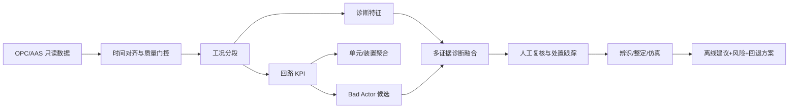
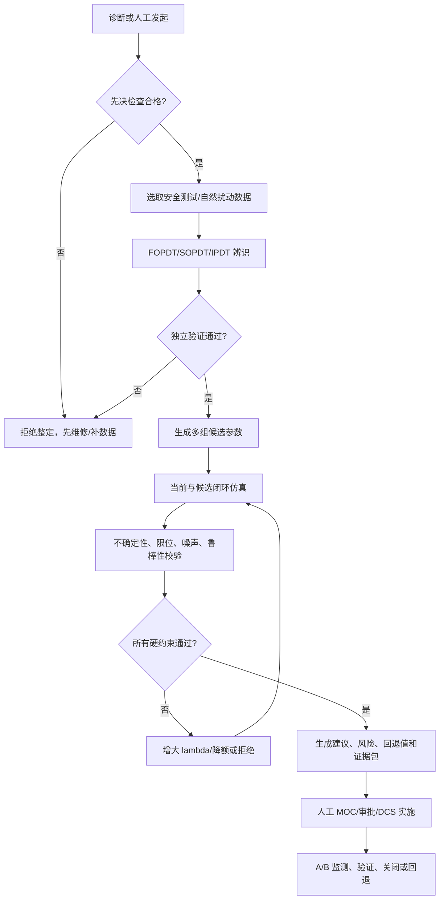

# CLPM 控制回路性能评估、诊断与 PID 参数整定算法体系设计

| 文档属性 | 值 |
|---|---|
| 文档编号 | CLPM-ADS-SUP-ALG-001 |
| 文档性质 | ADS v3.0 受控正式补充文件候选 |
| 文档状态 | 待标准责任人批准 |
| 版本 | v1.0 |
| 日期 | 2026-06-21 |
| 适用阶段 | Phase 1 性能评估/诊断；Phase 2 模型辨识/整定/仿真 |
| 上位基线 | PRD v3.0、ADS v3.0、DDS v3.0 |

---

## 1. 目的、范围与设计边界

### 1.1 目的

本文档给出 CLPM 中以下能力的可实现算法规格：

1. 单回路、单元、装置和企业级控制性能评估。
2. 数据、仪表、执行器、控制器、工艺及回路间耦合的分层诊断。
3. FOPDT/SOPDT/IPDT 模型辨识，以及 IMC/Lambda/SIMC、Ziegler-Nichols、Cohen-Coon 和继电反馈整定。
4. 算法输入输出、数据类型、状态、证据链、复杂度、验证和安全边界。

### 1.2 适用范围

适用于危险化学品生产企业基本过程控制系统中的单输入单输出 PID 回路，并可以在装置级做聚合和振荡传播分析。批次过程、间歇运行、超驰/选择器、分程、比值、串级主回路和 APC/MPC 回路必须使用专用工况模板，不得直接套用普通连续 PID 阈值。

### 1.3 强制安全边界

- CLPM 与 DCS/OPC 之间仅允许单向只读采集，不提供 PID 参数自动下写能力。
- 所有诊断结论是“预诊”，整定结果是“离线建议”；人工审批、MOC 变更管理、DCS 实施和回退不属于算法自动执行范围。
- 安全联锁/SIS 不得依赖 CLPM 计算结果；CLPM 不是安全功能或独立保护层。
- 资产模型必须区分普通 BPCS 回路、关键 BPCS 回路、安全控制回路和 SIS。SIS 及承担风险降低要求的仪表功能遵循 GB/T 21109/IEC 61511 独立安全生命周期，默认排除自动试验和整定。
- 数据不足、工况不合格、模型不可辨识时必须输出 `INCONCLUSIVE`，不得以 0 分、0 参数或旧结果代替。

### 1.4 规范依据与证据等级

| 等级 | 定义 | 本文使用方式 |
|---|---|---|
| A | 现行法规、国家/行业标准正式发布信息 | 确定适用范围、管理和安全约束 |
| B | 标准化主管部门公开的草案/征求意见稿 | 辅助理解计算口径；实施前必须与正式标准授权文本复核 |
| C | 同行评议论文、权威专著 | 确定核心算法原理和已知边界 |
| D | 工程建议和项目基线 | 作为可配置初值，不冒充规范硬阈值 |

`GB 45673-2025` 是 2025-11-01 起实施的危险化学品企业安全生产强制性国家标准基线。`GB/T 44693.1-2024` 和 `GB/T 44693.2-2024` 已于 2025-04-01 实施，是本系统的首要工艺平稳性业务基线。`AQ/T 3034-2022` 要求建立化工过程安全管理体系。参数优化涉及的任何现场变更，都必须纳入企业的变更、风险评估、审批、实施、验证和关闭流程。

`AQ/T 3034-2022` 的工程落地要点包括：操作规程明确正常控制范围、报警/联锁值和偏离后果（第 4.9 节）；加强 BPCS 维护并保证自动控制投用率（第 4.11.3.2 条）；对变更执行申请、风险评估、控制、审批、实施、验收、归档和关闭（第 4.15.3.1 条）。GB/T 和 AQ/T 在这里是“项目内部强制采用的设计基线”，并非宣称推荐性标准自身具有强制性；其在被法规引用、合同约定或企业明示采用时产生相应约束。

---

## 2. 总体算法架构



每个算法插件必须实现统一生命周期：

1. `validate_input`：校验 Schema、单位、采样间隔、质量码、必需 Tag 和参数。
2. `preprocess`：对齐、分段、去异常、标注缺口，但不篡改原始数据。
3. `compute`：计算指标/特征/模型/推荐值。
4. `quality_gate`：评估有效样本、置信度、工况适用性和数值稳定性。
5. `explain`：产生特征、阈值、证据时段、局限和建议。
6. `persist`：写入结果、算法版本、配置版本、数据指纹和时间戳。

---

## 3. 数据契约与预处理

### 3.1 最小输入集

| 字段 | 逻辑类型 | 物理类型 | 单位/取值 | 必需性 |
|---|---|---|---|---|
| `loop_id` | UUID | UUID | RFC 4122 | 必需 |
| `ts` | Timestamp | `int64` | UTC epoch ms，对外另带 IANA 时区 | 必需 |
| `pv`, `sp` | Real | `float64` | 同一工程单位 | 必需 |
| `op` | Real | `float64` | 归一化 0..100 % | 评估/诊断必需 |
| `mode` | Enum | `int8` | `MAN=0,AUTO=1,CAS=2,REMOTE=3,UNKNOWN=127` | 必需 |
| `pv_quality` | Enum | `int8` | `BAD=0,GOOD=1,UNCERTAIN=2,MISSING=3` | 必需 |
| `pid_p/i/d` | Real | `float64?` | 必须同时提供控制器形式与时间单位 | 读取可选，整定必需 |
| `op_low/high` | Real | `float64` | 通常 0/100 %，以 DCS 组态为准 | 诊断/整定必需 |
| `loop_type` | Enum | string | flow/pressure/level/temperature/composition/other | 必需 |
| `criticality` | Enum | string | A/B/C 或 1..5 | 装置聚合必需 |

所有计算内部使用 `float64`；比率内部使用 0..1，API 输出可同时给出 0..100 百分数。`NaN`/`Infinity` 不得进入 JSON 和关系库，必须转为 `null` 并记录 reason code。

### 3.2 时间加权而非简单计数

对不规则采样，比率指标统一采用持续时间加权：

$$
R(A)=\frac{\sum_{i=1}^{n-1}\min(t_{i+1}-t_i,\Delta t_{cap})I(A_i)}{T_{window}}
$$

`Delta_t_cap` 默认为目标采样周期的 1.5 倍。超出部分计入数据缺口，不得由最后一个样本向前填充。

### 3.3 处理顺序

1. 按 `ts` 排序、去重，同时刻保留采集序号最新且质量最高的样本。
2. 验证 PV/SP 工程单位与 OP 量程；单位不明时禁止跨回路比较。
3. 识别缺口、`BAD/UNCERTAIN`、超量程、非有限数、时钟回拨。
4. 仅对诊断副本做小间隔插值，原始序列和好值率永不插值。
5. 按 MODE、SP 变化、开停工标记、扰动和 PID 参数变化分段。
6. 按回路类型做抗混叠低通滤波后再降采样。不得对原始数据先抽点后滤波。

### 3.4 数据门控

| 检查 | 计算 | 默认动作 |
|---|---|---|
| 覆盖率 | 已观测时长/窗口时长 | `<80%` 整体 `INCONCLUSIVE` |
| PV 好值率 | `GOOD` 时长/窗口时长 | `<20%` 沿用 DDS 基线，跳过其他 KPI；上线前复核国标正文和现场规则 |
| 最小有效样本 | 合格分段样本数 | 时域 KPI `>=60`；频域 `>=256` 且 `>=4` 个候选周期 |
| 不规则采样 | `std(dt)/mean(dt)` | `>0.05` 时重采样，并保留缺口 mask |
| 工况一致性 | MODE/SP/PID/产品牌号不变 | 不一致则分段，不跨段统计诊断特征 |

---

## 4. 单回路性能评估指标

### 4.1 指标分层

| 层 | 用途 | 主要指标 |
|---|---|---|
| L0 数据可信性 | 决定能否计算 | 覆盖率、好值率、缺口率、冻结率 |
| L1 投用与可操作性 | 衡量自动控制实际生效时间 | 自控率、有效自控率、饱和率 |
| L2 稳态性能 | 衡量波动与偏差 | 平稳率、准确率、MAE/RMSE/标准差/CV |
| L3 动态响应 | 衡量 SP 或扰动事件后响应 | 上升时间、调节时间、超调、衰减比、IAE/ISE/ITAE |
| L4 基准性能 | 衡量距理论最小方差上限的差距 | Harris/MVC 指数 |

### 4.2 可用性与投用指标

| 代码 | 数学定义 | 说明 |
|---|---|---|
| `GOOD_VALUE_RATE` | `T(q=GOOD)/T_window` | 基于 PV 质量码；同时报告 `UNCERTAIN` 和缺口率 |
| `AUTO_MODE_RATE` | `T(eligible and mode in AUTO,CAS,REMOTE)/T_eligible` | 只表示 MODE 投用状态；CAS 链失效仍计入自控率，但不计入有效自控率 |
| `EFFECTIVE_AUTO_RATE` | `T(eligible and auto_mode and control_path_valid and not saturated)/T_eligible` | 对长期饱和、串级断链、超驰接管做扣除 |
| `SATURATION_RATE` | `T(eligible and auto_mode and saturated)/T(eligible and auto_mode)` | `eps=max(0.2%, 3*OP_resolution)`，持续超过最小驻留时间才计数 |

统一真值表：

| `eligible` | `auto_mode` | `path_valid` | `saturated` | 自控分子 | 有效自控分子 | 饱和分子/分母 |
|---:|---:|---:|---:|---:|---:|---:|
| 0 | * | * | * | 0 | 0 | 0/0 |
| 1 | 0 | * | * | 0 | 0 | 0/0 |
| 1 | 1 | 0 | 0 | 1 | 0 | 0/1 |
| 1 | 1 | 1 | 0 | 1 | 1 | 0/1 |
| 1 | 1 | 0/1 | 1 | 1 | 0 | 1/1 |

`GB/T 44693.2-2024` 正式版要求将数据异常及自控率低于企业预设百分比的回路判为最低等级，不再使用公开草案中的固定 50%。`minimum_auto_rate` 必须由企业审批、版本化并关联适用回路范围，其他高分不能抵消该门控失败。有效自控率 `R` 只用于 R/A/F/S 评分。

### 4.3 误差、平稳与准确指标

定义 `e_i = sp_i - pv_i`，工艺允许偏差带 `B_i > 0`，幅值标度 `S=max(span, |SP|, engineering_scale_floor)`。

$$
MAE=\frac{\sum w_i|e_i|}{\sum w_i},\quad RMSE=\sqrt{\frac{\sum w_i e_i^2}{\sum w_i}}
$$

$$
IAE=\sum |e_i|\Delta t_i,\quad ISE=\sum e_i^2\Delta t_i,\quad ITAE=\sum(t_i-t_0)|e_i|\Delta t_i
$$

$$
SteadyRate=\frac{\sum w_i I(|PV_i-\widetilde{PV}_{seg}|\le B_{steady})}{\sum w_i}
$$

$$
AccuracyRate=\frac{\sum w_i I(|e_i|\le B_i)}{\sum w_i}
$$

| 指标 | 实现要点 | 边界 |
|---|---|---|
| 控制偏差 `BIAS` | 加权均值 `mean(e)` | 分开报告方向，不用绝对值取代 |
| 标准差 `STD` | 去趋势后样本标准差 | 非平稳序列不做工况间比较 |
| 变异系数 `CV` | `std(PV)/abs(mean(PV))` | 均值接近 0 或有正负物理值时禁用；优先用 `std/span` |
| 平稳率 | 相对工况中心线的带内时长 | SP 变化响应段单独评估，不计入稳态分母 |
| 准确率 | PV 在 SP 容差带内的时长 | 容差必须源于工艺卡片/控制目标，禁止全厂统一百分比 |

### 4.4 动态响应指标

仅在检测到合格 SP 阶跃、负荷扰动或明确标注的测试事件时计算；无事件窗口输出 `INCONCLUSIVE/NO_EVENT`。

| 指标 | 定义 |
|---|---|
| 滞后时间 `td` | 从输入事件到 PV 沿响应方向超过噪声带且连续保持的时间 |
| 上升时间 `tr` | 定义 `q=sign(y_final-y_initial)`，用 `z=q*(y-y_initial)/abs(y_final-y_initial)`，计算 `z` 从 0.1 到 0.9 的时间 |
| 调节时间 `ts` | 进入并持续保持在 `max(0.02*abs(y_final-y_initial),approved_process_band)` 内的时间 |
| 超调 `Mp` | `100*max(0,max(q*(y-y_final)))/abs(y_final-y_initial)`；阶跃幅度接近 0 时不可计算 |
| 衰减比 | 同向相邻峰值相对最终值幅值比 |
| 快速率 | 将 `tr/target_tr`、`ts/target_ts` 映射到 0..100；映射函数和目标需版本化 |

### 4.5 工艺窗口、越限与操作负荷

工艺安全和操作负荷不得被控制性能综合分抵消。对每个关键 PV 另行计算：

$$
ExceedRate=\frac{\sum m_k\Delta t_kI(PV_k<L_k\lor PV_k>U_k)}{\sum m_k\Delta t_k}
$$

$$
AEI_p=\frac{1}{T_v\,span_y^p}\sum_k\left[(PV_k-U_k)_+^p+(L_k-PV_k)_+^p\right]\Delta t_k,\quad p\in\{1,2\}
$$

| 指标 | 计算逻辑 | 约束 |
|---|---|---|
| 工艺窗口合格率 | PV 处于按牌号/负荷配置的正常带内时长比 | 正常带来自工艺卡片/操作规程 |
| 越限率/严重度 | 时长比 + 对越限幅度的积分 | 越限点不得当作异常值删除 |
| 越限事件 | 带回差和最小持续时间的状态机 | 输出次数、最长时长、最大幅度 |
| 模式切换率 | MAN/AUTO/CAS/REMOTE 切换次数/时间 | 区分操作、顺控和故障切换 |
| SP 操作频率 | 超过分辨率/死区的 SP 变更次数和总幅度/时间 | 自动上位设定与人工操作分开 |
| PID 变更率 | P/I/D 快照版本变更次数 | 必须与审计/MOC 记录对齐 |
| 报警负荷 | 报警次数、持续报警数、报警洪泛时长 | 按 IEC 62682/企业报警理念独立管理，不用报警数下降单独证明回路改善 |

### 4.6 Harris 最小方差指数

$$
\eta_{MVC}=\operatorname{clip}\left(\frac{\hat\sigma^2_{MVC}}{\hat\sigma_e^2},0,1\right)
$$

`sigma_MVC^2` 是考虑过程纯滞后 `d` 后可达到的最小输出方差估计，`sigma_e^2` 是当前合格平稳工况中的误差方差。值越接近 1 表示越接近 MVC 基准，不表示安全、准确或经济最优。详细算法见 `CLPM-ADS-SUP-ALG-002`。

### 4.7 国标口径的单回路综合评分

为避免百分数量纲混乱，内部统一用 0..1：

$$
P=100R\frac{aA+bF+cS}{a+b+c}
$$

- `R`：有效自控率；`A`：准确率；`F`：快速率；`S`：平稳率，内部均使用 0..1。该缩放是项目的实施解释，正式上线前由标准责任人对百分数缩放和 `P=100` 边界形成书面解释。
- 无合格响应事件时，不擅自重新归一化掉 `F`；按正式标准实施细则返回 `PARTIAL/INCONCLUSIVE`或使用经审批的长窗快速率。
- 数据异常或 `AUTO_MODE_RATE` 低于企业预设值时直接判为最低等级；有效自控率 `R` 仍参与评分公式。
- 正式版附录 D 的一至五级分界为 90/80/70/60：一级 `[90,100]`、二级 `[80,90)`、三级 `[70,80)`、四级 `[60,70)`、五级 `[0,60)`。
- 权重 `a/b/c` 按回路类型配置并版本化，不在业务代码中硬编码。饱和率是独立诊断指标，并通过 `R` 影响评分，不再作为草案公式的外层乘子。

---

## 5. 单元、装置与企业级指标

### 5.1 聚合原则

1. 分母中显式排除经审批的报废、间歇停运、开停工、特殊放空/超驰回路，并报告排除数量和原因。
2. 不得将因生产、仪表或设备问题长期无法投自动的回路列入免评范围。
3. 默认同时报告“宏平均”和“按有效时长/关键度加权平均”，防止大数量非关键回路稀释高风险回路。
4. 安全关键回路另列清单，不得仅依赖装置平均分。

### 5.2 核心聚合 KPI

定义回路关键度权重 `c_i>0`。装置暴露时长加权自控率和有效自控率分别为：

$$
AutoRate_{unit}=\frac{\sum_ic_iT_{auto,i}}{\sum_ic_iT_{eligible,i}},\quad
EffectiveAutoRate_{unit}=\frac{\sum_ic_iT_{effective,i}}{\sum_ic_iT_{eligible,i}}
$$

与之不同，`MACRO_AUTO_RATE=mean_i(AutoRate_i)` 用于表示“典型回路”，不得与暴露时长加权值共用一个 metric code。

| 指标 | 定义 |
|---|---|
| 装置自控投用率 | 每个时刻自动模式回路数/应评回路数，再对时间取均值 |
| 实时自控率 | 当前时刻自动回路数/应评回路数；正式版附录 E 参考目标 `>=90%` |
| 平均自控率 | 应评回路 `AUTO_MODE_RATE` 暴露时长加权值；正式版附录 E 参考目标 `>=95%` |
| 有效自控率 | 应评回路 `EFFECTIVE_AUTO_RATE` 加权平均 |
| 平稳率 | 按回路关键度和有效时长聚合；正式版附录 E 参考目标 `>=95%` |
| 性能评分 | 按正式版 R/A/F/S 公式计算；正式版附录 E 参考目标 `>=80` |
| Bad Actor 率 | 评级差或硬门控失败的回路数/应评回路数 |
| 高风险异常未闭环率 | A 级回路中未处置高置信诊断数/高置信诊断总数 |
| 评估覆盖率 | 成功或部分成功评估回路数/应评回路数 |
| 数据不可判定率 | `INCONCLUSIVE` 回路数/应评回路数 |
| 关键工艺参数平稳率 | 按关键度加权的工艺窗口合格时长/有效时长 |
| 工艺越限事件 | 按装置聚合的次数、时长、最大幅度和严重度 | 
| 操作负荷 | MAN/AUTO 切换、人工 SP 变更、手动 OP 变更和 PID 变更次数/班次 |
| 报警负荷 | 报警率、持续报警和报警洪泛时长，独立于回路分数 |

---

## 6. 控制回路诊断指标体系

### 6.1 分层分类

| 诊断域 | 故障模式 | 核心证据 |
|---|---|---|
| D0 数据链路 | 丢包、错序、时钟漂移、质量码异常 | gap、duplicate、quality transition、timestamp drift |
| D1 测量/传感器 | 失灵、冻结、偏移、噪声过大、超量程 | 平坦段、斜率、高频能量、物理边界 |
| D2 执行器/阀门 | 黏滞、死区、内漏、饱和、分辨率不足、动作频繁 | OP-PV 轨迹、OP 阶梯、反向延迟、行程、限位驻留 |
| D3 控制器 | 过激、过慢、积分饱和、反作用错误、参数变更 | 误差-OP 相位、高频动作、恢复时间、PID 版本 |
| D4 工艺/运行 | 外部扰动、工况切换、非线性、长滞后、积分对象 | 多信号相关、工况标记、模型残差 |
| D5 控制策略 | 串级断链、前馈失效、限位/超驰接管、回路配对不合理 | MODE 链、选择器状态、组态元数据 |
| D6 相互作用 | 同频振荡传播、强耦合、公用工程扰动 | 相干、时延、偏相干、拓扑和物理可达性 |

### 6.2 诊断特征和计算方法

| 代码 | 算法摘要 | 主要参数 | 输出 |
|---|---|---|---|
| `DATA_GAP` | 时间差超过 `1.5*Ts` 的累计时长 | `Ts,gap_factor` | gap rate、最长缺口 |
| `PV_FLATLINE` | 滚动极差/MAD 低于仪表分辨率且工艺/输出在变化 | `resolution,dwell` | 冻结时长、对照信号变差 |
| `SENSOR_NOISE` | 一阶差分 MAD + Welch 高频能量比 | `f_split,nperseg` | 噪声标准差、HF ratio |
| `DRIFT` | 稳健 Theil-Sen 斜率 + CUSUM/EWMA 变点 | `min_duration,k,h` | 斜率、变点、置信度 |
| `OSCILLATION` | 去趋势后 ACF 周期峰 + Welch PSD 谱突出度双证据 | `period_band,prominence,min_cycles` | 主频、周期、振幅、持续率 |
| `STICTION` | OP 反向后延迟、OP 阶梯、PV-OP 极限环和模型残差融合 | `resolution,min_reversals` | 估计死区/滑动幅、证据分 |
| `SATURATION` | OP 贴上/下限的驻留率和连续时间 | `eps,dwell` | 上/下限饱和率 |
| `VALVE_TRAVEL` | `sum(abs(diff(OP)))` 与方向反转数 | `reversal_eps` | %travel/h、reversals/h |
| `AGGRESSIVE` | OP 高频行程、PV 交叉 SP 频率、衰减比、振荡综合 | loop-type baseline | 过激分数 |
| `SLUGGISH` | 事件响应的滞后/上升/调节时间与基线比 | response target | 迟钝分数 |
| `WINDUP` | 饱和期误差同号累积，解除饱和后反向恢复迟滞 | `recovery_window` | windup episode、recovery time |
| `PROPAGATION` | 同主频回路间相干/时延图，结合工艺拓扑约束排序 | `coherence,lag,graph` | 传播群、源候选、路径 |

### 6.3 多证据融合

单一特征不直接生成高置信故障结论。每个诊断模式使用三类证据：

- 必要证据：没有则不触发，如黏滞必须有足够 OP 反向和闭环振荡。
- 支持证据：提高置信分，如 OP 阶梯、PV-OP 极限环。
- 反证：出现时降低或否决，如外部周期扰动已被测得。

$$
C=100\cdot Q_{data}\cdot Q_{applicability}\cdot\sigma\left(b+\sum_j w_jz_j-\sum_kv_kr_k\right)
$$

`C` 是可解释置信分，在没有带标签现场数据做概率校准前，不得宣称为“故障发生概率”。默认分级：`<40 LOW`、`40..70 MEDIUM`、`>=70 HIGH`，仅作项目初值。

### 6.4 阈值策略

1. 有物理边界的指标使用绝对阈值，如 OP 限位、仪表量程、质量码。
2. 回路类型相关指标使用同类基线，如流量与温度的振荡频带不同。
3. 学习阈值使用稳健统计：`median +/- k*1.4826*MAD`，不使用易被故障污染的均值和标准差。
4. 触发和恢复使用不同阈值与最小驻留时间，防止告警抖动。
5. 每次配置变更保存版本、适用回路集、基线窗口、修改人和回滚点。

---

## 7. PID 参数整定方法体系

### 7.1 先决条件

参数整定前必须通过以下检查：

- 传感器量程、校准、噪声和质量码合格。
- 阀门作用方向、行程、定位器和机械黏滞合格；硬件故障不用 PID 参数掩盖。
- DCS 算法形式（并联/理想/ISA/串联）、正反作用、P 是增益还是比例带、I/D 时间单位、微分滤波和抗积分饱和方式已知。
- 明确回路是调节还是跟踪优先，并给出超调、OP 变化率、安全界限和调节时间约束。
- 对超驰、放空、反应器温度、强耦合等高风险回路，完成专项风险评估。

### 7.2 控制器形式

内部标准使用理想/ISA 形式，微分作用于测量并带一阶滤波：

$$
u(t)=K_c\left[e(t)+\frac{1}{T_i}\int e(t)dt-T_d\frac{dPV_f(t)}{dt}\right]
$$

与并联形式的转换为 `Kp=Kc, Ki=Kc/Ti, Kd=Kc*Td`。串联形式不能直接复制这三个数，必须使用 DCS 供应商的精确算法定义做转换和仿真校验。

### 7.3 过程模型

$$
G_{FOPDT}(s)=\frac{K e^{-\theta s}}{\tau s+1},\quad
G_{SOPDT}(s)=\frac{K e^{-\theta s}}{(\tau_1s+1)(\tau_2s+1)},\quad
G_{IPDT}(s)=\frac{K' e^{-\theta s}}{s}
$$

| 模型 | 典型对象 | 必须参数 | 拒绝条件 |
|---|---|---|---|
| FOPDT | 大部分流量、压力、温度过程 | `K,tau,theta` | `K` 置信区间跨 0、`theta` 贴边界、验证 NRMSE 不合格 |
| SOPDT | 两个显著惯性或不能由 FOPDT 描述的过程 | `K,tau1,tau2,theta` | 参数高度共线或 FOPDT 已足够 |
| IPDT | 液位、库存等积分过程 | `K_prime,theta` | 无持续斜率、质量平衡不一致 |

### 7.4 整定方法选择

| 方法 | 输入 | 优点 | 局限 | 默认定位 |
|---|---|---|---|---|
| IMC/Lambda | FOPDT/SOPDT/IPDT + 期望闭环时间 `lambda` | 显式速度-鲁棒折中，超调小 | 依赖模型质量 | 首选 |
| SIMC | 降阶模型 + `tau_c` | 公式简洁，对调节性能较好 | 需确认控制器形式 | 首选候选 |
| Z-N 开环反应曲线 | `K,tau,theta` | 简单、可复现 | 通常较激进，超调大 | 对比/初值，非默认上线值 |
| Cohen-Coon | FOPDT | 考虑滞后/惯性比 | 对模型误差和长滞后敏感，可偏激进 | 对比候选 |
| Z-N 临界比例 | `Ku,Pu` | 无需显式过程模型 | 要求进入临界振荡，现场风险高 | 仅经专项审批的测试 |
| 继电反馈 | 继电幅值、极限环幅值/周期 | 自动获取 `Ku,Pu` | 主动激励过程，非线性/噪声会偏置 | 现场经审批的受控激励试验；CLPM 仅离线分析试验数据，不执行试验 |
| 闭环 ARX/RLS 监督式自整定 | 闭环数据、持续激励、候选时延 | 可按工况跟踪参数 | 低激励、工况切换和闭环偏置会产生错误模型 | 仅用于影子辨识和预验证增益调度表 |

### 7.5 端到端整定流程



---

## 8. 统一输入输出与数据类型

### 8.1 分类请求对象

不使用一个可任意缺字段的巨型请求。所有请求使用 `request_type` 作为判别字段，公共包含 `schema/algorithm/version/window/config/provenance`，各变体要求如下：

| `request_type` | 特有必需输入 |
|---|---|
| `LOOP_METRIC` | 单回路 PV/SP/OP/MODE/PV_QUALITY，数组等长、时间递增 |
| `LOOP_DIAGNOSIS` | 上述数据 + `op_quality`；黏滞算法另需 `vpos/vpos_quality`或降级为候选结论；策略诊断需选择器/串级/超驰状态 |
| `PROPAGATION` | `loops[]` 多回路同步时序、每点质量、`topology_edges[]`、时钟误差上限 |
| `IDENTIFICATION` | 测试事件、输入/输出数据、开/闭环类型、试验安全包络、输入激励元数据 |
| `TUNING` | 已验证 `ProcessModel`、参数不确定集、控制器形式/方向/单位、滤波/抗饱和/限幅/限速、安全包络 |

每个数值数组都必须有工程单位、质量数组和缺值规则。不接受 JSON `NaN/Infinity`；缺值用 `null` 并由对应质量位说明。

```json
{
  "schema_version": "1.0",
  "request_type": "LOOP_DIAGNOSIS",
  "algorithm_code": "OSCILLATION_ACF_PSD",
  "algorithm_version": "1.0.0",
  "loop_id": "uuid",
  "window": {
    "start_ms": 1782000000000,
    "end_ms": 1782003600000,
    "timezone": "Asia/Shanghai"
  },
  "signals": {
    "ts_ms": [1782000000000],
    "pv": [1.0],
    "sp": [1.0],
    "op_pct": [50.0],
    "mode": [1],
    "pv_quality": [1],
    "op_quality": [1],
    "vpos_pct": [49.8],
    "vpos_quality": [1]
  },
  "metadata": {
    "loop_type": "flow",
    "pv_unit": "t/h",
    "pv_span": [0.0, 100.0],
    "sample_period_s": 5.0,
    "criticality": "A"
  },
  "config_version": 12,
  "parameters": {}
}
```

以下 JSON Schema 片段是 API 实现的最小可校验约束；完整 Schema 应由 IDS 按此契约生成并加入 CI：

```json
{
  "type": "object",
  "required": ["schema_version", "request_type", "algorithm_code", "algorithm_version", "window", "config_version"],
  "oneOf": [
    {
      "properties": {
        "request_type": {"const": "LOOP_METRIC"},
        "signals": {"required": ["ts_ms", "pv", "sp", "op_pct", "mode", "pv_quality"]}
      },
      "required": ["loop_id", "signals", "metadata"]
    },
    {
      "properties": {
        "request_type": {"const": "LOOP_DIAGNOSIS"},
        "signals": {"required": ["ts_ms", "pv", "sp", "op_pct", "mode", "pv_quality", "op_quality"]}
      },
      "required": ["loop_id", "signals", "metadata"]
    },
    {"properties": {"request_type": {"const": "PROPAGATION"}}, "required": ["loops", "topology_edges", "clock_tolerance_ms"]},
    {"properties": {"request_type": {"const": "IDENTIFICATION"}}, "required": ["loop_id", "signals", "test_event", "safety_envelope"]},
    {"properties": {"request_type": {"const": "TUNING"}}, "required": ["loop_id", "process_model", "controller_metadata", "safety_envelope"]}
  ],
  "$defs": {
    "qualityArray": {"type": "array", "items": {"type": "integer", "enum": [0, 1, 2, 3]}},
    "numberArray": {"type": "array", "items": {"type": ["number", "null"]}}
  },
  "x-cross-field-rules": [
    "LOOP_METRIC requires equal-length ts_ms,pv,sp,op_pct,mode,pv_quality",
    "LOOP_DIAGNOSIS additionally requires equal-length op_quality",
    "STICTION with VPOS evidence additionally requires equal-length vpos_pct,vpos_quality",
    "timestamps are strictly increasing after duplicate resolution",
    "every numeric signal declares engineering_unit and scale"
  ]
}
```

### 8.2 结果对象

```json
{
  "execution_status": "SUCCESS",
  "result_type": "DIAGNOSIS",
  "outcome": "OSCILLATION_DETECTED",
  "reason_codes": [],
  "value": 0.83,
  "unit": "ratio",
  "confidence": 86.0,
  "features": {"dominant_period_s": 42.0, "spectral_prominence": 8.3},
  "quality": {"coverage": 0.998, "good_value_rate": 0.992, "valid_samples": 718},
  "evidence": [{"start_ms": 1782000100000, "end_ms": 1782001200000, "kind": "OSCILLATORY_SEGMENT"}],
  "limitations": [],
  "provenance": {
    "algorithm_version": "1.0.0",
    "config_version": 12,
    "input_sha256": "hex",
    "computed_at_ms": 1782003610000
  }
}
```

### 8.3 枚举与错误码

| 字段 | 允许值 |
|---|---|
| `execution_status` | `SUCCESS`, `PARTIAL`, `INCONCLUSIVE`, `FAILED`：只表示计算是否可用 |
| `result_type` | `METRIC`, `DIAGNOSIS`, `MODEL`, `TUNING_RECOMMENDATION`, `VALIDATION` |
| `outcome` | 算法专属结论，如 `NOT_DETECTED/CANDIDATE/DETECTED/ACCEPTED/REJECTED`；候选参数均被安全约束拒绝时为 `execution_status=SUCCESS,outcome=REJECTED` |
| 输入原因 | `MISSING_TAG`, `UNIT_UNKNOWN`, `INVALID_RANGE`, `NON_MONOTONIC_TIME` |
| 数据原因 | `LOW_COVERAGE`, `LOW_GOOD_VALUE_RATE`, `TOO_FEW_SAMPLES`, `IRREGULAR_SAMPLING` |
| 适用性原因 | `NO_STEADY_SEGMENT`, `NO_EVENT`, `MODE_INELIGIBLE`, `SPECIAL_STRATEGY`, `NONSTATIONARY` |
| 整定原因 | `MODEL_UNIDENTIFIABLE`, `MODEL_VALIDATION_FAILED`, `ROBUSTNESS_FAILED`, `CONSTRAINT_VIOLATION`, `CONTROLLER_FORM_UNKNOWN` |
| 系统原因 | `TIMEOUT`, `NUMERIC_FAILURE`, `DEPENDENCY_UNAVAILABLE`, `VERSION_MISMATCH` |

### 8.4 整定推荐额外字段

`TuningRecommendation` 必须包含：现行 PID 快照、DCS 控制器形式、辨识模型与置信区间、候选 PID、候选排序、仿真情景、约束校验、预期 KPI 变化、风险、人工实施步骤、观察期、回退触发条件和回退参数。实施状态还必须包含 `moc_id`、`risk_assessment_ref`、`approved_by`、`implemented_by`、`verified_by`、`rollback_record_ref`；缺少 `moc_id/approved_by` 时服务端拒绝 `APPLIED/VERIFIED` 状态转换。

### 8.5 对 DDS 和持久化模型的必需迁移

现行 DDS v3.0 和 `db/postgresql/01_schema.sql` 尚不足以完整持久化本文契约。算法开发前必须单独设计、评审并执行数据库迁移；本文不直接修改建表脚本。

| 对象 | 必需新增/调整 |
|---|---|
| `metric_config` | 区分 `STANDARD_SCORE/PROJECT_KPI/DIAGNOSTIC_FEATURE`，增加 R/A/F/S 角色、公式版本、审批人、`effective_from`、适用回路类型 |
| `kpi_snapshot_hourly` | `effective_auto_rate`、`accuracy_rate`、`quickness_rate`、`steady_rate`、`good_value_rate`、`saturation_rate`、`score_formula_version`、`config_version`、`reason_codes`、`input_sha256` |
| `diagnosis_result` | 将 `execution_status/result_type/outcome` 与置信分分离，保留证据/反证、输入指纹和配置版本 |
| `tuning_record` | 控制器形式/单位/方向、模型不确定性、鲁棒门禁、`moc_id`、风险评估/审批/实施/验证/回退引用 |

在迁移完成前，系统可运行原型展示，但不得宣称已实现 `GB/T 44693.2-2024` 正式评分的可复算存储。

---

## 9. 时间与空间复杂度

`n` 为单回路窗口样本数，`L` 为回路数，`p` 为 AR 阶数，`I` 为优化迭代数，`M` 为 Monte Carlo 场景数。

| 算法 | 时间复杂度 | 空间复杂度 | 实时化策略 |
|---|---:|---:|---|
| 质量、比率、IAE/ISE、饱和、行程 | `O(n)` | `O(1)` 流式，或 `O(n)` 证据窗口 | 使用在线累加器和可合并分区状态 |
| 滚动中位数/MAD | `O(n log w)` 通用，双堆可近似 `O(n log w)` | `O(w)` | 边缘窗口有界，不全量重算 |
| Welch PSD | `O(n log w)` | `O(w)` | 固定 FFT 长度，窗口计划复用 |
| FFT 自相关 | `O(n log n)` | `O(n)` | 窗口分块和长度上限 |
| Harris/AR | `O(np^2+p^3)` | `O(np+p^2)` | `p<=50`，离线重计模型，在线只更新统计量 |
| FOPDT/SOPDT 非线性拟合 | `O(I*n*k)`，`k=3..5` | `O(n+k^2)` | 先解析初值，再有界优化，超时返回最佳可行解 |
| 闭环仿真 | `O(C*n)`，`C` 为候选数 | `O(C*n)` 全曲线，或 `O(C)` 只指标 | 并行候选，限制保存曲线数 |
| 不确定性仿真 | `O(M*C*n)` | `O(C*n)` 分批 | 定时预算、抽样上限和早停 |
| 全对相干/传播 | `O(L^2 n log n)` | `O(L^2 f)` | 先按主频分群，再按工艺拓扑邻接边计算，避免全连接 |

对 1200 回路的小时评估，L0-L3 指标应使用 `loop_id + window + algorithm_version + config_version` 作为幂等键，分片并行。高成本频域、黏滞和传播算法由 Bad Actor 事件或计划任务触发，不与每秒采集链路同步执行。

---

## 10. 实时性、准确性与可靠性

### 10.1 采样与窗口

`GB/T 44693.2-2024` 正式版附录 A 的采样周期上限为：流量 `<=5 s`、压力 `<=10 s`、液位 `<=20 s`、温度 `<=30 s`、成分 `<=60 s`。本项目可保留 1 s 原始数据，评估层按回路动态经抗混叠滤波后降采样，且配置不得超过上述上限。

窗口至少覆盖 4 个最长候选振荡周期；用于稳态方差和 Harris 指数的窗口应覆盖 20 个以上闭环特征时间，且通过平稳性检验。

### 10.2 可重现性

- 相同输入指纹、算法版本和配置版本必须产生相同结果；随机仿真显式保存 seed。
- 时区仅用于展示，内部统一 UTC；处理夏令时重复/缺失时段。
- 所有滤波、重采样、阈值和工况分段中间结果可以在证据包中重建。

### 10.3 容错与降级

| 故障 | 降级策略 |
|---|---|
| 时序库短时不可用 | 任务按幂等键重试，不使用旧结果冒充新窗口 |
| 高级算法超时 | 保留 L0-L3 结果为 `PARTIAL`，明确缺少的算法项 |
| 配置在计算中变更 | 任务继续使用启动时快照，下一任务使用新版本 |
| 模型或仿真数值不稳定 | 拒绝整定建议，保存失败原因和输入指纹 |
| 未知 DCS PID 形式 | 可评估和诊断，禁止输出可实施整定值 |

### 10.4 算法发布门禁

1. 单元测试覆盖空窗口、缺口、不规则采样、零量程、反作用、饱和和非平稳序列。
2. 使用已知真值的合成数据做参数恢复和故障检出测试。
3. 使用经专家复核的现场数据做盲测，报告混淆矩阵、假阳/假阴、延迟和不可判定率。
4. 新算法版本与当前版本并行影子运行至少一个完整生产周期，不直接替换。
5. 整定算法必须通过模型独立验证、限位/速率约束、鲁棒性和不确定性仿真后才可生成“建议”。

---

## 11. 实施优先级与验收

### 11.1 分期

| 阶段 | 算法范围 | 验收焦点 |
|---|---|---|
| P0 契约层 | 输入输出 Schema、质量门控、版本/指纹/幂等 | 同输入可重现，无效数据不出假结果 |
| P1 基础 KPI | 好值、自控、有效自控 R、准确 A、快速 F、平稳 S、饱和、综合分 | 与人工标注时段计算结果一致；F 未实现前不生成国标正式性能评分 |
| P2 常规诊断 | gap、flatline、noise、saturation、travel、oscillation | 合成故障参数误差和现场盲测指标 |
| P3 高级诊断 | stiction、aggressive/sluggish、propagation、Harris | 多证据可解释，置信分经现场校准 |
| P4 整定 | 辨识、IMC/Lambda/SIMC、ZN/CC 对比、仿真、建议包 | 默认只读，硬约束任一失败即拒绝建议 |

### 11.2 总体验收准则

- 项目展示指标及国标评分核 R/A/F/S 具有公式、分母、时间加权、缺失处理和单元测试；R/A/F/S 任一未通过适用性门控时不生成正式性能评分。
- 每个诊断结论至少包含一项必要证据、数据质量、适用性、置信分、证据时段和限制。
- 算法对同一份标准化输入的重复运行结果数值一致，允差由浮点测试明确。
- 装置聚合展示应评、排除、成功、部分成功和不可判定数量，不仅显示一个平均分。
- 所有 PID 建议不含自动下写通道，并包含现行值、回退值、风险、审批和验证步骤。

---

## 12. 参考资料

### 12.1 法规、标准与官方资料

- [S0] 国家市场监督管理总局、国家标准化管理委员会. [GB 45673-2025 危险化学品企业安全生产标准化通用规范](https://openstd.samr.gov.cn/bzgk/std/newGbInfo?hcno=2B5FB91F00A1C10AE3750A6DEF40C749), 2025.
- [S1] 国家市场监督管理总局、国家标准化管理委员会. [GB/T 44693.1-2024 危险化学品企业工艺平稳性 第1部分：管理导则](https://openstd.samr.gov.cn/bzgk/std/newGbInfo?hcno=828117E5557285F5FC00611B1F5C8FEB), 2024.
- [S2] 国家市场监督管理总局、国家标准化管理委员会. [GB/T 44693.2-2024 危险化学品企业工艺平稳性 第2部分：控制回路性能评估与优化技术规范](https://openstd.samr.gov.cn/bzgk/gb/newGbInfo?hcno=5E98B4CD584758CE54F989D1A414C512), 2024.
- [S3] 全国标准信息公共服务平台. [GB/T 44693.2 标准项目公开草案](https://std.samr.gov.cn/dcpspTools/gbPlan/download?path=%2Fzxd%2F2022004951%2F20_%E6%A0%87%E5%87%86%E8%B5%B7%E8%8D%89%2F20_WD_2022004951_%E5%8D%B1%E9%99%A9%E5%8C%96%E5%AD%A6%E5%93%81%E4%BC%81%E4%B8%9A%E5%B7%A5%E8%89%BA%E5%B9%B3%E7%A8%B3%E6%80%A7++%E7%AC%AC2%E9%83%A8%E5%88%86%EF%BC%9A%E6%8E%A7.pdf), 2023. 注：仅用于变更历史追溯，不得作为活动公式、分级、目标或采样参数来源。
- [S4] 应急管理部. [AQ/T 3034-2022 化工过程安全管理导则](https://www.mem.gov.cn/gk/zfxxgkpt/fdzdgknr/202212/W020221213599799114552.pdf), 2022.
- [S5] 国家市场监督管理总局、国家标准化管理委员会. [GB/T 21109 过程工业领域安全仪表系统的功能安全](https://openstd.samr.gov.cn/bzgk/gb/std_list?p.p1=0&p.p2=GB%2FT+21109&p.p90=circulation_date&p.p91=desc), 2022-2023. 注：第 3 部分当前适用 2007 版；GB/T 21109.3-2026 已发布，将于 2026-08-01 替代。
- [S6] IEC. [IEC 61511-1:2016+AMD1:2017 CSV Functional Safety - Safety Instrumented Systems for the Process Industry Sector](https://webstore.iec.ch/en/publication/61289).
- [S7] IEC. [IEC 62682:2022 Management of Alarm Systems for the Process Industries](https://webstore.iec.ch/en/publication/65543).
- [S8] ISA. [ISA-TR5.9-2023 PID Algorithms and Performance](https://www.isa.org/products/isa-tr5-9-2023-proportional-integral-derivative-pi), 2023.
- [S9] 江苏省市场监督管理局. [DB32/T 4822-2024 PID 回路性能评估与优化实施技术规范](https://dbba.sacinfo.org.cn/stdDetail/40ddf2dcf4f17eeb42bc20b3203f560230829a8046cc72407e5b4fb3f8341ff0), 2024. 注：江苏省内按其适用范围使用；其他地区仅作交叉参考。
- [S10] ISO. [ISO 7870-1:2019 Control Charts - General Guidelines](https://www.iso.org/standard/69639.html) and [ISO 7870-2:2023 Shewhart Control Charts](https://www.iso.org/standard/78859.html).

### 12.2 学术文献与专著

- [P1] Harris, T. J. [Assessment of Control Loop Performance](https://doi.org/10.1002/cjce.5450670519). *The Canadian Journal of Chemical Engineering*, 67(5), 856-861, 1989.
- [P2] Jelali, M. [An Overview of Control Performance Assessment Technology and Industrial Applications](https://doi.org/10.1016/j.conengprac.2005.11.005). *Control Engineering Practice*, 14(5), 441-466, 2006.
- [P3] Jelali, M. *[Control Performance Management in Industrial Automation](https://doi.org/10.1007/978-1-4471-4546-2)*. Springer, 2013.
- [P3a] Huang, B.; Shah, S. L. *[Performance Assessment of Control Loops: Theory and Applications](https://doi.org/10.1007/978-1-4471-0415-5)*. Springer, 1999.
- [P3b] Qin, S. J. [Control Performance Monitoring: A Review and Assessment](https://doi.org/10.1016/S0098-1354(98)00259-2). *Computers & Chemical Engineering*, 23, 173-186, 1998.
- [P4] Åström, K. J.; Hägglund, T. [Automatic Tuning of Simple Regulators](https://doi.org/10.1016/S1474-6670(17)61248-5). *IFAC Proceedings Volumes*, 17(2), 1984.
- [P5] Skogestad, S. [Simple Analytic Rules for Model Reduction and PID Controller Tuning](https://doi.org/10.1016/S0959-1524(02)00062-8). *Journal of Process Control*, 13(4), 291-309, 2003; 参见[2004 勘误](https://doi.org/10.1016/j.jprocont.2003.09.001).
- [P6] Lee, J.; Cho, W.; Edgar, T. F. [Simple Analytic PID Controller Tuning Rules Revisited](https://doi.org/10.1021/ie4009919). *Industrial & Engineering Chemistry Research*, 53(13), 5038-5047, 2014.
- [P7] Bauer, M. et al. [The Current State of Control Loop Performance Monitoring](https://doi.org/10.1016/j.jprocont.2015.11.002). *Journal of Process Control*, 38, 1-10, 2016.

---

## 附录 A. 实施配置模板

```yaml
metric_profile:
  profile_id: flow-regulatory-v1
  loop_type: flow
  sample_period_s: 5
  evaluation_window_s: 3600
  min_coverage: 0.80
  min_good_value_rate: 0.20
  eligible_modes: [AUTO, CAS, REMOTE]
  steady_band_source: PROCESS_LIMIT
  score_formula: "100 * effective_auto_rate * weighted(accuracy, quickness, steady)"
  score_weights: {accuracy: 0.4, quickness: 0.2, steady: 0.4}
  grading: {level_1: 90, level_2: 80, level_3: 70, level_4: 60}
  provenance:
    basis: GBT_44693_2_2024_FORMAL_TEXT_TECHNICALLY_REVIEWED
    approved_by: null
    effective_from: null
```

## 附录 B. 审查检查表

- [x] 正式 `GB/T 44693.2-2024` 技术口径已复核，草案公式、分级、目标和采样参数已从活动口径移除。
- [ ] 标准/合规责任人已在企业文控系统完成批准，`approved_by/effective_from` 已填写，文档状态已转为“正式生效”。
- [ ] 工艺容差带、评分权重、排除回路和关键度由企业责任人审批。
- [ ] DCS PID 形式、正反作用、单位、限位、抗饱和和无扰切换已建模。
- [ ] 诊断置信分未在校准前显示为故障概率。
- [ ] 结果可追溯到数据指纹、算法版本、配置版本、时区和证据窗口。
- [ ] 整定服务不存在任何 DCS/OPC 写入代码路径或凭据。
