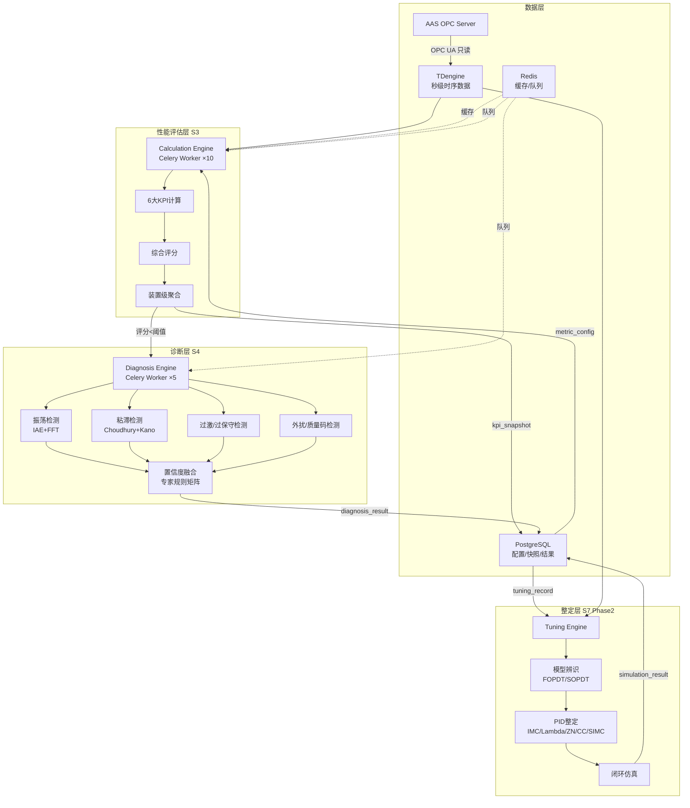
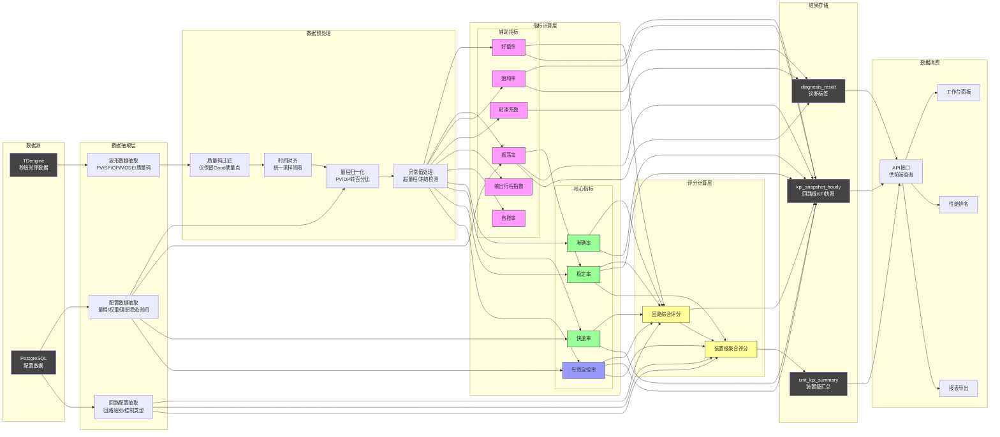

# CLPM 关键算法设计说明文档

**文档状态**: 正式版
**当前版本**: v2.1
**发布日期**: 2026-07-04
**文档性质**: ADS（系统架构设计说明书）v4.0 的正式补充文件
**设计依据**: PRD (v3.1)、FDS (v5.1，公式与字段名权威基线)、ADS (v3.1)、DDS (v4.1，表名/字段名权威基线)、IDS (v3.1)、UI/UX (v5.1)、CLPM后端研发智能体系统提示词与开发指导文档
**标准合规**: GB/T 44693.2-2024、GB/T 44693.1-2024、DB32/T 4822—2024

---

## 0. 文档变更记录

| 版本 | 日期 | 变更说明 | 作者 |
|---|---|---|---|
| v1.0 | 2026-06-21 | 初始版本：①定义 6 大性能评估指标算法（好值率/自控率/稳定率/准确率/振荡率/饱和率）+ 综合评分 + 装置级聚合；②定义 8 类回路诊断算法（振荡检测/粘滞检测/参数过激/参数过保守/外扰频繁/PV质量码规则/诊断置信度融合/专家规则矩阵）；③定义 7 类 PID 整定算法（FOPDT/SOPDT 模型辨识 + IMC/Lambda/Z-N/Cohen-Coon/SIMC 整定 + 闭环仿真）；④对齐 GB/T 44693.2-2024 国标全部指标公式；⑤定义算法输入输出规范与数据类型；⑥时间/空间复杂度分析；⑦国标合规性矩阵；⑧算法验证方法 | 算法设计团队 |
| v1.1 | 2026-06-25 | 按 GB/T 44693.2-2024 国标重新修订：①指标体系从 6 大 KPI 改为 3+1 结构（准确率/快速率/稳定率 + 有效自控率）；②新增快速率算法（ARMA 模型辨识 + Green 函数 + 理想稳态时间）；③稳定率公式改为指数型（1/e^(σ/0.05U)）；④准确率公式改为指数型（含 1/e^r 项）；⑤综合评分公式改为 (A·a+F·f+S·s)/(a+f+s) × R；⑥好值率/振荡率/饱和率降级为辅助诊断指标；⑦更新指标映射表和合规性矩阵 | 算法设计团队 |
| v2.0 | 2026-06-26 | 数据架构重构：①新增数据预处理规范（8步pipeline、8类异常值、按控制类型阈值、KEEP_ALL_WITH_VALIDITY策略）；②引入tagGroup分组设计（BASE/OP_HF/PVOP_HF/MODE_HF/QUALITY_HF）和DataPlanner数据编排器；③引入MetricDataBundle数据包和Metric Validity Mask有效性掩码；④新增指标数据需求契约（Metric Data Requirement）；⑤新增数据血缘规范（sampling_freq/aggregation_policy/quality_policy/tag_group/data_block_ids/valid_rate）；⑥新增指标可信度A/B/C/D/E五级；⑦修复6个逻辑漏洞（好值率角色、有效自控率多DataBlock、ARMA降采样、振荡与噪声边界、自定义任务聚合、缓存失效）；⑧指标体系从3+1+7更新为3+1+8（补充理想稳态时间独立列出） | 算法设计团队 |
| v2.1 | 2026-07-04 | FDS v5.1 对齐版：①**字段名对齐 DDS v4.1**——loop-level `stability_rate` → `steady_rate`（装置级聚合输出保留 `stability_rate`）；loop-level `composite_score` → `score`；②**权重默认值对齐国标**——稳定型 0.2/0.3/0.5、慢速型 0.3/0.1/0.6、快速型 0.2/0.5/0.3、逻辑型 0.0/0.4/0.6（原 v2.0 权重与 FDS v5.1 §5.3.7.1 不一致）；③**准确率公式修正**——`|E_max|` 由输入参数改为从数据计算 `Σ[max(|E_i|) - |E_i|] / n`，数学模型补全 `|E_max|` 定义；④**稳定率标准差修正**——分母由 `n` 改为 `n-1`（无偏估计，对齐 FDS v5.1）；⑤**装置级聚合权重字段对齐**——`loop_ledger.score_weight` → `loop_ledger.importance_level`（1/2/3，权重 3/2/1）；⑥`kpi_snapshot_custom` DDL `stability_rate` → `steady_rate`；⑦全文术语"平稳率"统一为"稳定率"。 | 算法设计团队 |

---

## 1. 算法设计背景与目标

### 1.1 背景

CLPM（Control Loop Performance Monitoring）系统面向流程工业（化工/石油/电力/冶金等）的控制回路全生命周期绩效治理与优化闭环。系统的核心计算能力集中在三大领域：

1. **性能评估**：对 1200+ 控制回路进行持续 KPI 计算，量化评估回路控制性能
2. **回路诊断**：对低性能回路自动执行诊断算法矩阵，定位故障根因
3. **参数整定**：基于模型辨识推荐 PID 参数，闭环仿真验证（Phase 2）

当前设计文档（PRD/FDS/ADS/DDS/IDS）已定义了指标名称、数据表结构、API 契约，但**算法层面的数学公式、计算步骤、参数取值、复杂度分析均未明确**，存在 35 个算法缺失点（详见 §1.3 差距分析）。

### 1.2 设计目标

| 目标 | 说明 |
|---|---|
| **国标合规** | 所有性能评估指标严格对齐 GB/T 44693.2-2024 附录 B/F 的公式与定义 |
| **算法完备** | 覆盖 6 大 KPI + 8 类诊断 + 7 类整定的完整算法，消除 35 个缺失点 |
| **工程可实现** | 每个算法提供伪代码/流程图、输入输出规范、复杂度分析，开发团队可直接实现 |
| **工业级可靠性** | 算法满足工业控制领域的实时性（小时级批量计算）、准确性（PV 质量码处理）、可靠性（INCONCLUSIVE 兜底）要求 |
| **可配置化** | 算法参数（阈值/权重/窗口）支持用户自助配置，对齐 PRD "产品化、配置驱动"原则 |
| **可追溯** | 每条计算结果关联算法版本号、阈值版本、时间戳，满足审计合规 |

### 1.3 差距分析（基于当前设计文档）

#### 1.3.1 跨文档不一致问题（本文档统一修正）

| 编号 | 不一致点 | 本文档统一方案 |
|---|---|---|
| C1 | 6 大 KPI 列表在 PRD §5.1、FDS §5.3.1、工作台卡片、Mock kpi.ts 四处不一致 | 统一为：好值率、自控率、稳定率、准确率、振荡率、饱和率（对齐国标附录 B/F） |
| C2 | kpi_snapshot_hourly 表缺 accuracy_rate 和 saturation_rate 字段 | 建议补全表结构（见 §10.2 DDL 补充） |
| C3 | metric_config.threshold 在 DDS 为 DECIMAL 单值，IDS 为 {min,max,alert} 对象 | 统一为 JSON 对象（见 §10.1 schema 补充） |
| C4 | diagnosis_config 缺 calc_method 字段（IDS 有，DDS/schema 无） | 建议补全字段（见 §10.2 DDL 补充） |
| C5 | tuning_record 缺 fitting_score 字段 | 建议补全字段（见 §10.2 DDL 补充） |
| C6 | 诊断标签不统一（FDS 4 类、PRD 7 类、Mock 7 类、IDS 英文） | 统一为 8 类（见 §6.1 诊断标签体系） |
| C7 | metric_config.formula 表达式引擎未定义 | 定义安全沙箱方案（见 §5.9） |

#### 1.3.2 算法缺失点（本文档补全）

**性能评估类（9 项）**：准确率公式、振荡率公式、饱和率公式、稳定率死区配置、IAE/ISE 计算、综合评分归一化、反向指标处理、INCONCLUSIVE 聚合、装置级 roll-up

**回路诊断类（10 项）**：参数过激检测、参数过保守检测、外扰频繁检测、PV 质量码规则、振荡传播分析、阀门行程磨损、诊断置信度计算、多算法融合、诊断触发阈值、专家规则矩阵

**参数整定类（16 项）**：FOPDT/SOPDT/IPDT 辨识、拟合度计算、数据段选择、IMC/Lambda/Z-N/Cohen-Coon/SIMC 公式、闭环仿真模型、性能指标提取

---

## 2. 设计依据与参考资料

### 2.1 内部设计文档

| 编号 | 文档 | 版本 | 用途 |
|---|---|---|---|
| D01 | PRD | v3.0 | 产品需求与功能边界 |
| D02 | FDS | v3.0 | 功能规格、交互逻辑 |
| D03 | ADS | v3.0 | 架构分层、服务划分 |
| D04 | DDS | v3.0 | 数据模型、表结构 |
| D05 | IDS | v3.1 | API 契约、统一响应规范 |
| D06 | UI/UX | v4.0 | 视觉规范、组件标准 |

### 2.2 外部标准与规范

| 编号 | 标准/文献 | 说明 |
|---|---|---|
| S01 | GB/T 44693.2-2024 | 《危险化学品企业工艺平稳性 第2部分：控制回路性能评估与优化技术规范》— **核心合规标准** |
| S02 | GB/T 44693.1-2024 | 《危险化学品企业工艺平稳性 第1部分：管理导则》 |
| S03 | DB32/T 4822—2024 | 《PID 回路性能评估与优化实施技术规范》 |
| S04 | ANSI/ISA-112.00.01-2025 | SCADA 系统标准 |
| S05 | NAMUR NE 43 | 4-20mA 信号标准（故障模式与饱和值） |

### 2.3 学术文献

| 编号 | 文献 | 核心贡献 |
|---|---|---|
| L01 | Harris T.J. (1989) | 最小方差性能指数（Harris Index） |
| L02 | Hägglund T. (2005) | IAE 在线振荡检测方法 |
| L03 | Thornhill N.F., Hägglund T. (1997) | ACF 振荡检测与诊断 |
| L04 | Choudhury M.A.A.S. et al. (2004) | NGI/NLI 指数 + 椭圆拟合粘滞检测 |
| L05 | Kano M. et al. | 统计特性粘滞检测方法 |
| L06 | Rivera D.E., Morari M., Skogestad S. (1986) | IMC PID 整定方法 |
| L07 | Skogestad S. (2003) | SIMC 简化整定规则 |
| L08 | Ziegler J.G., Nichols N.B. (1942) | Z-N 临界整定法 |
| L09 | Cohen G.H., Coon G.A. (1953) | Cohen-Coon 大滞后整定法 |
| L10 | Garcia C. (2008) | 阀门摩擦模型对比 |
| L11 | Bacci di Capaci R., Scali C. (2018) | 粘滞检测技术综述 |
| L12 | Åström K., Hägglund T. (1995) | PID 控制器理论与设计 |
| L13 | Seborg D. et al. (2017) | 过程动态与控制 |

### 2.4 工业实施参考

| 编号 | 参考 | 说明 |
|---|---|---|
| I01 | Emerson DeltaV InSight | 嵌入式控制性能监控与自整定 |
| I02 | Siemens PCS 7 CPM | 控制性能监控功能块 |
| I03 | Control Station | PID 健康监测与操作员干预 KPI |
| I04 | 中控 SUPCON PID 3.1 | 性能监控评估软件（国内商业软件） |

---

## 3. 算法总体架构

### 3.1 算法分层架构



### 3.2 算法触发机制

| 算法层 | 触发方式 | 调度周期 | 并发数 | 数据源 |
|---|---|---|---|---|
| 性能评估 | Celery Beat 定时 | 每小时（可配置） | 10 | TDengine |
| 回路诊断 | 事件触发（评分<阈值） | 实时 | 5 | TDengine |
| 参数整定 | 用户手动触发 | 按需 | 2 | TDengine + 用户输入 |

### 3.3 算法版本管理

每条计算结果关联 `algorithm_version` 字段，格式：`<算法名>v<主版本>.<次版本>`（如 `KPI_CALC_v1.0`）。算法公式变更时主版本号递增，参数调整时次版本号递增。版本号存储于 `metric_config.version` / `diagnosis_config.version`，结果记录于 `kpi_snapshot_hourly` / `diagnosis_result.algorithm_version`。

### 3.4 数据预处理规范

> **设计依据**：CLPM后端研发智能体系统提示词与开发指导文档 §8/§9/§10

#### 3.4.1 质量策略：KEEP_ALL_WITH_VALIDITY

预处理层**不删除任何数据点**，而是为每个时间戳的每个Tag打上有效性标记（valid=True/False）。不同指标通过各自的 **Metric Validity Mask** 决定哪些点参与计算。

**禁止做法**：
- 在接口层或预处理层简单删除Bad点
- PV、SP、OP各自剔除坏点后再拼接（导致时间戳错位）

**正确做法**：
```python
# 预处理后的数据结构（每个时间戳保留所有Tag，打valid标记）
{
    "ts": "2026-06-25T10:00:01",
    "pv":        {"value": 80.2, "quality": "Good", "valid": True},
    "sp":        {"value": 80.0, "quality": "Good", "valid": True},
    "op":        {"value": 45.2, "quality": "Good", "valid": True},
    "mode":      {"value": 1,    "quality": "Good", "valid": True},
    "pv_quality":{"value": 1,    "quality": "Good", "valid": True}
}
```

#### 3.4.2 8步预处理Pipeline

每个tagGroup的数据块在预处理层经过以下8步处理：

| 步骤 | 名称 | 说明 |
|---|---|---|
| ① | 质量码识别 | 将原始质量码映射为 Good/Bad/Unknown |
| ② | 有效性标记 | 根据质量码和异常值检测结果，为每个Tag打valid标记 |
| ③ | 量程归一化 | PV/SP/OP按量程归一化为百分比（0~100） |
| ④ | 异常值识别 | 8类异常值检测（见§3.4.3） |
| ⑤ | 缺失率统计 | 记录缺失时段，计算缺失率 |
| ⑥ | 连续性检查 | 标记连续有效段，缺口超过阈值时切断 |
| ⑦ | Metric Mask生成 | 根据各指标需求生成有效性掩码 |
| ⑧ | Quality Summary生成 | 生成valid_rate/bad_rate/missing_rate摘要 |

#### 3.4.3 8类异常值检测

| 异常类型 | 检测方法 | 处理方式 | 说明 |
|---|---|---|---|
| 超量程 | PV/SP/OP超出量程范围 | valid=False | 不删除，保留在时间序列中 |
| 冻结值 | 按控制类型的窗口检测（见§3.4.4） | valid=False | 传感器冻结或阀门卡死 |
| 跳变 | 按控制类型的阈值检测（见§3.4.4） | valid=False | 非正常的瞬时大幅变化 |
| 尖峰 | 单点突变后立即恢复 | valid=False | 区分于真实振荡 |
| NaN/NULL | 值为NaN或NULL | valid=False | 数据缺失 |
| 时间戳异常 | 重复/逆序/间隔异常 | 标记但保留 | 不影响数据点本身 |
| 质量码异常 | 非Good非Bad的异常码 | valid=False | Uncertain等异常状态 |
| 高频噪声 | 超过控制类型截止频率的成分 | 标记但不滤波 | 由振荡率指标自行处理 |

> **漏洞修复**：高频噪声在预处理层仅标记不滤波，振荡率指标在计算时自行决定是否过滤。两者职责分离，避免预处理层滤波导致振荡特征丢失。

#### 3.4.4 按控制类型的异常值阈值

| 控制类型 | 基础采样率 | 冻结窗口 | 跳变阈值 | 尖峰阈值 | 噪声截止频率 | 连续有效最短段 |
|---|---|---|---|---|---|---|
| 流量（FC） | 1s | 5s（5点） | 0.8×量程 | 0.5×量程 | 0.2Hz | 30点 |
| 压力（PC） | 2s | 10s（5点） | 0.5×量程 | 0.3×量程 | 0.1Hz | 20点 |
| 温度（TC） | 5s | 30s（6点） | 0.3×量程 | 0.2×量程 | 0.05Hz | 15点 |
| 液位（LC） | 5s | 30s（6点） | 0.3×量程 | 0.2×量程 | 0.05Hz | 15点 |
| 成分（CC） | 10s | 60s（6点） | 0.2×量程 | 0.1×量程 | 0.02Hz | 10点 |

> **快速回路说明**：流量回路（FC@1s）的跳变阈值设为0.8×量程，因为快速调节时1秒内变化超过50%是正常的。冻结窗口仅5秒，因为流量响应快，短时间不变即可能是传感器冻结。

### 3.5 tagGroup分组设计

> **设计依据**：CLPM后端研发智能体系统提示词与开发指导文档 §5

不同指标对数据采样率的需求不同。通过tagGroup分组，按指标需求获取数据，避免"统一采样"导致的数据量浪费或精度不足。

#### 3.5.1 tagGroup定义

| tagGroup | 包含Tag | 采样率 | 服务指标 | 说明 |
|---|---|---|---|---|
| BASE | PV, SP, MODE, PV_QUALITY | 按控制类型 | 准确率、稳定率、振荡率、稳态时间、自控率 | 基础数据块 |
| OP_HF | OP | **固定1s** | 行程指数、饱和率 | OP必须高频，捕捉阀门微小动作 |
| PVOP_HF | PV, OP | **固定1s** | 粘滞系数 | PV-OP散点拟合需要高频数据 |
| MODE_HF | MODE | **固定1s** | 自控率、有效自控率 | MODE切换需要精确时间点 |
| QUALITY_HF | PV_QUALITY | **固定1s** | 好值率 | 质量码统计需要全量数据 |

#### 3.5.2 复用规则

当BASE的采样率已经是1s（如流量回路），OP_HF/PVOP_HF/MODE_HF/QUALITY_HF可直接复用BASE数据块，无需单独查询。

| 回路类型 | BASE采样率 | 需查询tagGroup | 实际查询次数 |
|---|---|---|---|
| 流量（FC） | 1s | BASE（含全部信号） | 1次 |
| 压力（PC） | 2s | BASE@2s + OP_HF@1s + PVOP_HF@1s + MODE_HF@1s + QUALITY_HF@1s | 2~3次 |
| 温度/液位（TC/LC） | 5s | BASE@5s + OP_HF@1s + PVOP_HF@1s + MODE_HF@1s + QUALITY_HF@1s | 3~4次 |
| 成分（CC） | 10s | BASE@10s + OP_HF@1s + PVOP_HF@1s + MODE_HF@1s + QUALITY_HF@1s | 3~4次 |

#### 3.5.3 时间戳对齐规则

- **同一tagGroup内**：所有Tag共享同一时间轴，天然对齐
- **不同tagGroup之间**：不强行对齐。各指标独立计算，综合评分只读取标量结果
- **有效自控率例外**：需要MODE@1s + OP@1s（同在1s时间轴，天然对齐），PV/SP偏差检查使用最近邻匹配

### 3.6 指标数据需求契约（Metric Data Requirement）

每个指标在计算前声明自己的数据需求，DataPlanner根据需求合并查询计划。

#### 3.6.1 契约结构

| 字段 | 类型 | 说明 | 示例 |
|---|---|---|---|
| metric_code | String | 指标代码 | `output_trip_index` |
| tag_group | String | 所需tagGroup | `OP_HF` |
| tags | Array | 所需Tag列表 | `["op"]` |
| sampling_strategy | String | 采样策略 | `FIXED_1S` / `BY_CONTROL_TYPE` |
| quality_policy | String | 质量策略 | `KEEP_ALL_WITH_VALIDITY` / `KEEP_ALL` |
| mask_expression | String | 有效性掩码表达式 | `op_valid && consecutive_valid` |
| aggregation_policy | String | 聚合策略 | `LAST` / `MEAN` / `MAX` |
| depends_on | Array | 依赖的其他指标 | `["oscillation_rate"]` |

#### 3.6.2 各指标的数据需求契约

| 指标 | tagGroup | tags | sampling | mask | depends_on |
|---|---|---|---|---|---|
| accuracy_rate | BASE | PV, SP | BY_CONTROL_TYPE | pv_valid && sp_valid | — |
| steady_rate | BASE | PV, SP | BY_CONTROL_TYPE | pv_valid && sp_valid | oscillation_rate |
| fast_rate | BASE | PV, SP | BY_CONTROL_TYPE | pv_valid && sp_valid | settling_time, ideal_settling_time |
| effective_auto_rate | MODE_HF + OP_HF | MODE, OP | FIXED_1S | mode_valid && op_valid | auto_mode_rate, saturation_rate |
| good_value_rate | QUALITY_HF | PV_QUALITY | FIXED_1S | 不删除行 | — |
| oscillation_rate | BASE | PV, SP | BY_CONTROL_TYPE | pv_valid && sp_valid | — |
| saturation_rate | OP_HF | OP | FIXED_1S | op_valid | — |
| stiction_index | PVOP_HF | PV, OP | FIXED_1S | pv_valid && op_valid | — |
| output_trip_index | OP_HF | OP | FIXED_1S | op_valid && consecutive_valid | — |
| auto_mode_rate | MODE_HF | MODE | FIXED_1S | mode_valid | — |
| settling_time | BASE | PV, SP | BY_CONTROL_TYPE | pv_valid && sp_valid | — |
| ideal_settling_time | — | — | — | — | — (配置参数) |
| score | — | — | — | — | accuracy, fast, steady, effective_auto |

### 3.7 数据血缘与指标可信度

#### 3.7.1 数据血缘

每个指标计算结果必须包含完整的数据口径信息，支持审计追溯：

| 字段 | 类型 | 说明 |
|---|---|---|
| sampling_freq | String | 实际采样频率（如 `1s` / `5s`） |
| aggregation_policy | String | 聚合策略（`LAST` / `MEAN` / `MAX`） |
| quality_policy | String | 质量策略（`KEEP_ALL_WITH_VALIDITY` / `KEEP_ALL`） |
| tag_group | String | 数据来源tagGroup |
| data_block_ids | Array | 使用的DataBlock ID列表 |
| valid_rate | Float | 有效数据率（0~1） |
| data_policy_version | String | 预处理版本（如 `pre_v1`） |
| algorithm_version | String | 算法版本（如 `KPI_CALC_v1.0`） |

#### 3.7.2 指标可信度

指标可信度分为A/B/C/D/E五级，基于有效数据率（valid_rate）和缺失率自动判定：

| 等级 | 含义 | 判定条件 | 使用建议 |
|---|---|---|---|
| A | 数据满足指标契约 | valid_rate ≥ 0.95 | 可作正式评价 |
| B | 数据基本满足 | 0.80 ≤ valid_rate < 0.95 | 可用于常规评价 |
| C | 数据不足或采样偏粗 | 0.60 ≤ valid_rate < 0.80 | 仅作粗筛参考 |
| D | 数据质量不足 | 0.20 ≤ valid_rate < 0.60 | 不建议使用 |
| E | 数据不满足要求 | valid_rate < 0.20 | 拒绝计算，标记INCONCLUSIVE |

> **漏洞修复**：好值率不直接参与综合评分公式，而是影响指标可信度。好值率低→valid_rate低→可信度降级。当可信度为E级时，整条快照标记为INCONCLUSIVE，评分留空。

---

## 4. 性能评估指标算法

### 4.0 指标体系总览

本系统性能评估指标严格对齐 GB/T 44693.2-2024 附录 B/F，采用 **3+1+8 结构**：

#### 4.0.1 核心质量指标（参与加权评分）

| 序号 | 指标名称 | metric_code | 国标对应 | 算法类型 | 时间复杂度 |
|---|---|---|---|---|---|
| 1 | 准确率 | `ACCURACY_RATE` | 附录 B.3 (A) | 偏差绝对均值 + 指数衰减 | O(N) |
| 2 | 快速率 | `FAST_RATE` | 附录 B.4 (F) | ARMA 模型辨识 + Green 函数 | O(N²) |
| 3 | 稳定率 | `STABILITY_RATE` | 附录 B.5 (S) | 偏差标准差 + 指数衰减 × 振荡修正 | O(N) |

#### 4.0.2 投用指标（作为折扣因子）

| 序号 | 指标名称 | metric_code | 国标对应 | 算法类型 | 时间复杂度 |
|---|---|---|---|---|---|
| 4 | 有效自控率 | `EFFECTIVE_AUTO_RATE` | 附录 B.2 (R) | 模式统计 + 有效时段判定 | O(N) |

#### 4.0.3 辅助诊断指标（不参与评分，用于诊断证据）

| 序号 | 指标名称 | metric_code | 国标对应 | 算法类型 | 时间复杂度 |
|---|---|---|---|---|---|
| 5 | 好值率 | `GOOD_VALUE_RATE` | 附录 F.6 (Qu) | PV 质量码统计 | O(N) |
| 6 | 振荡率 | `OSCILLATION_RATE` | 附录 F.1 (Osc) | IAE 零交叉相似率法 | O(N) |
| 7 | 饱和率 | `SATURATION_RATE` | 附录 F.3 (Sa) | OP 限位统计 | O(N) |
| 8 | 粘滞系数 | `STICTION_INDEX` | 附录 F.2 (St) | Choudhury 椭圆拟合 | O(N) |
| 9 | 输出值行程指数 | `OUTPUT_TRIP_INDEX` | 附录 F.5 (Trip) | OP 变化量累积 | O(N) |
| 10 | 稳态时间 | `SETTLING_TIME` | 附录 F.4 | ARMA + Green 函数 | O(N²) |
| 11 | 理想稳态时间 | `IDEAL_SETTLING_TIME` | 附录 B.4 | 配置参数 | O(1) |
| 12 | 自控率 | `AUTO_MODE_RATE` | 附录 B.1 | MODE 模式统计 | O(N) |

> **说明**：序号从5开始，共8个辅助诊断指标。暂不纳入"相关性指数"(F.7)和"多指标综合诊断"(F.8)，后续根据需要再扩展。

---

### 4.0.4 控制回路性能评估计算流程图

```mermaid
flowchart TD
    subgraph "输入数据"
        A[PV 时序数据]
        B[SP 时序数据]
        C[OP 时序数据]
        D[MODE 时序数据]
        E[PV 质量码]
        F[时间戳]
        G[量程配置]
        H[权重配置]
        I[理想稳态时间]
        J[回路级别权重]
    end
    
    subgraph "辅助诊断指标计算（并行）"
        A1["好值率<br/>calc_good_value_rate"]
        A2["振荡率<br/>calc_oscillation_rate"]
        A3["饱和率<br/>calc_saturation_rate"]
        A4["粘滞系数<br/>calc_stiction_index"]
        A5["输出值行程指数<br/>calc_output_trip_index"]
        A6["自控率<br/>calc_auto_mode_rate"]
    end
    
    subgraph "核心质量指标计算"
        C1["准确率 (A)<br/>calc_accuracy_rate"]
        C2["快速率 (F)<br/>calc_fast_rate"]
        C3["稳定率 (S)<br/>calc_steady_rate"]
    end
    
    subgraph "投用指标计算"
        P1["有效自控率 (R)<br/>calc_effective_auto_rate"]
    end
    
    subgraph "综合评分"
        S1["控制回路性能评分<br/>calc_composite_score"]
    end
    
    subgraph "装置级聚合"
        U1["装置性能评分<br/>calc_unit_score"]
        U2["实时自控率"]
        U3["平均自控率"]
        U4["稳定率"]
    end
    
    subgraph "输出结果"
        O1[kpi_snapshot_hourly]
        O2[诊断标签]
        O3[装置级报告]
    end
    
    A --> A1
    E --> A1
    F --> A1
    G --> A1
    
    A --> A2
    B --> A2
    F --> A2
    
    C --> A3
    D --> A3
    F --> A3
    
    A --> A4
    C --> A4
    G --> A4
    
    C --> A5
    F --> A5
    G --> A5
    
    D --> A6
    F --> A6
    
    A --> C1
    B --> C1
    G --> C1
    
    A --> C2
    B --> C2
    F --> C2
    I --> C2
    
    A --> C3
    B --> C3
    G --> C3
    A2 --> C3
    
    D --> P1
    C --> P1
    A --> P1
    B --> P1
    F --> P1
    G --> P1
    
    C1 --> S1
    C2 --> S1
    C3 --> S1
    P1 --> S1
    H --> S1
    
    A1 --> S1
    
    S1 --> U1
    P1 --> U1
    C3 --> U1
    J --> U1
    
    S1 --> U2
    P1 --> U2
    J --> U2
    
    P1 --> U3
    J --> U3
    
    C3 --> U4
    J --> U4
    
    S1 --> O1
    C1 --> O1
    C2 --> O1
    C3 --> O1
    P1 --> O1
    A1 --> O1
    A2 --> O1
    A3 --> O1
    
    A2 --> O2
    A4 --> O2
    A3 --> O2
    
    U1 --> O3
    U2 --> O3
    U3 --> O3
    U4 --> O3
    
    style A1 fill:#f9f,stroke:#333,stroke-width:2px
    style A2 fill:#f9f,stroke:#333,stroke-width:2px
    style A3 fill:#f9f,stroke:#333,stroke-width:2px
    style A4 fill:#f9f,stroke:#333,stroke-width:2px
    style A5 fill:#f9f,stroke:#333,stroke-width:2px
    style A6 fill:#f9f,stroke:#333,stroke-width:2px
    style A7 fill:#f9f,stroke:#333,stroke-width:2px
    
    style C1 fill:#9f9,stroke:#333,stroke-width:2px
    style C2 fill:#9f9,stroke:#333,stroke-width:2px
    style C3 fill:#9f9,stroke:#333,stroke-width:2px
    
    style P1 fill:#99f,stroke:#333,stroke-width:2px
    
    style S1 fill:#ff9,stroke:#333,stroke-width:2px
```



**流程图说明**：

| 步骤 | 模块 | 输入 | 输出 | 依赖关系 |
|---|---|---|---|---|
| 1 | 好值率计算 | PV、质量码、时间戳、量程 | 好值率、状态 | 无 |
| 2 | 振荡率计算 | PV、SP、时间戳 | 振荡率、是否振荡 | 无 |
| 3 | 饱和率计算 | OP、MODE、时间戳 | 饱和率、饱和类型 | 无 |
| 4 | 粘滞系数计算 | PV、OP、量程 | 粘滞系数、等级 | 无 |
| 5 | 输出行程指数 | OP、时间戳、量程 | 行程指数、等级 | 无 |
| 6 | 自控率计算 | MODE、时间戳 | 自控率 | 无 |
| 7 | 准确率计算 | PV、SP、量程 | 准确率 | 无 |
| 8 | 快速率计算 | PV、SP、时间戳、理想稳态时间 | 快速率、实际稳态时间 | 无 |
| 9 | 稳定率计算 | PV、SP、量程、振荡率 | 稳定率 | 依赖振荡率 |
| 10 | 有效自控率计算 | MODE、OP、PV、SP、时间戳、量程 | 有效自控率、自控率 | 无 |
| 11 | 综合评分计算 | 准确率、快速率、稳定率、有效自控率、权重、好值率状态 | 综合评分 | 依赖所有核心指标 |
| 12 | 装置级聚合 | 回路评分、级别权重 | 装置评分、KPI聚合 | 依赖回路评分 |

---

### 4.0.5 控制回路性能评估数据流程图



**数据流说明**：

| 阶段 | 数据内容 | 格式 | 存储位置 |
|---|---|---|---|
| 数据源 | PV/SP/OP/MODE/质量码时序数据 | TDengine 超级表 | TDengine |
| 数据源 | 量程/权重/理想稳态时间/回路级别 | 关系表 | PostgreSQL |
| 预处理 | 过滤后Good质量点、时间对齐数据 | 内存数组 | Calculation Engine |
| 指标计算 | 13个指标计算结果 | Decimal/Float | 内存对象 |
| 评分计算 | 综合评分、装置级评分 | Decimal | 内存对象 |
| 结果存储 | 回路级KPI快照 | kpi_snapshot_hourly | PostgreSQL |
| 结果存储 | 诊断标签 | diagnosis_result | PostgreSQL |
| 结果存储 | 装置级汇总 | unit_kpi_summary | PostgreSQL |
| 数据消费 | API响应 | JSON | HTTP Response |

---

### 4.1 好值率（Good Value Rate）

#### 4.1.1 算法原理

基于 PV tag 的 OPC 质量码统计，衡量评估时段内数据有效性的时长占比。对齐国标附录 F.6。

**定位变更**：本指标从 v1.0 的核心 KPI 降级为辅助诊断指标，不参与综合评分加权，但用于数据有效性判定（好值率 < 20% 时整条快照标记为 INCONCLUSIVE）。

#### 4.1.2 数学模型

$$\eta_{good} = \frac{T_{good}}{T_{total}} \times 100\%$$

其中：
- $T_{good}$：评估时段内 PV 质量码为 Good 且数值在有效量程范围内的累计时长（秒）
- $T_{total}$：评估时段总时长（秒）

**质量码判定规则**（对齐 OPC UA 标准）：

| 质量码值 | 常量名 | 是否计入好值 | 说明 |
|---|---|---|---|
| 0 | Bad | 否 | 通信中断/设备故障 |
| 1 | Uncertain | 否（降权） | 不确定，数据可疑 |
| 2 | Good | 是 | 数据有效 |
| 3 | Good_Cascaded | 是 | 级联模式下的好值 |

**量程有效性检查**：$PV_{min} \leq PV_i \leq PV_{max}$，其中 $PV_{min}$、$PV_{max}$ 为回路配置的量程上下限。

#### 4.1.3 输入输出规范

| 参数 | 数据类型 | 是否必填 | 说明 |
|---|---|---|---|
| **输入** | | | |
| `pv_values` | `Array<Float>` | 是 | PV 时序数据数组 |
| `pv_quality` | `Array<Int>` | 是 | PV 质量码数组（与 pv_values 等长） |
| `timestamps` | `Array<DateTime>` | 是 | 时间戳数组 |
| `pv_min` | `Float` | 是 | PV 量程下限 |
| `pv_max` | `Float` | 是 | PV 量程上限 |
| **输出** | | | |
| `good_value_rate` | `Decimal(5,2)` | - | 好值率（0~100%） |
| `status` | `String` | - | `SUCCESS` / `INCONCLUSIVE`（好值率<20%时） |

#### 4.1.4 计算步骤

```
算法: calc_good_value_rate
输入: pv_values[], pv_quality[], timestamps[], pv_min, pv_max
输出: good_value_rate, status

1.  total_duration = timestamps[-1] - timestamps[0]
2.  IF total_duration == 0 THEN RETURN (0, INCONCLUSIVE)
3.  good_duration = 0
4.  FOR i = 0 TO length(pv_values) - 2:
5.      segment_duration = timestamps[i+1] - timestamps[i]
6.      IF pv_quality[i] IN {Good, Good_Cascaded} AND pv_min <= pv_values[i] <= pv_max:
7.          good_duration += segment_duration
8.  good_value_rate = (good_duration / total_duration) * 100
9.  status = INCONCLUSIVE IF good_value_rate < 20 ELSE SUCCESS
10. RETURN (good_value_rate, status)
```

#### 4.1.5 复杂度分析

- **时间复杂度**: O(N)，单次线性扫描
- **空间复杂度**: O(1)，仅累加器

---

### 4.2 有效自控率（Effective Auto Rate）

#### 4.2.1 算法原理

统计评估时段内控制器处于自动（AUTO）或串级（CAS）模式且控制有效的时长占比。对齐国标附录 B.2。

**定位变更**：本指标从 v1.0 的"自控率"升级为"有效自控率"，作为综合评分的整体折扣因子（乘数 R），而非参与加权的核心指标。

**有效自控判定规则**：控制器处于 AUTO/CAS/Remote 模式 **且** OP 未饱和 **且** 控制偏差在合理范围内。

**数据来源说明**（见§3.5/§3.6）：本指标需要两个DataBlock——MODE_HF@1s（MODE信号）和OP_HF@1s（OP信号），两者均在1s时间轴上，天然对齐。控制偏差检查中的PV/SP来自BASE数据块，使用最近邻时间戳匹配。

#### 4.2.2 数学模型

$$R = \frac{T_{auto\_effective}}{T_{total}} \times 100\%$$

其中：
- $T_{auto\_effective}$：评估时段内满足以下条件的累计时长（秒）：
  1. MODE 为 AUTO 或 CAS 或 Remote（自动模式）
  2. OP 未饱和（$OP_{low} + \epsilon < OP < OP_{high} - \epsilon$）
  3. 控制偏差在合理范围（$|E| < |E|_{max}$）
- $T_{total}$：评估时段总时长（秒）
- $\epsilon$：饱和容差（默认 2%）
- $|E|_{max}$：偏差最大允许基准（默认量程的 5%）

**MODE 枚举映射**（对齐 DDS §3.1）：

| MODE 值 | 常量名 | 是否计入自控 | 说明 |
|---|---|---|---|
| 0 | Manual | 否 | 手动模式 |
| 1 | Auto | 是 | 自动模式 |
| 2 | Cascade | 是 | 串级模式 |
| 3 | Remote | 是 | 远程模式 |

#### 4.2.3 输入输出规范

| 参数 | 数据类型 | 是否必填 | 说明 |
|---|---|---|---|
| **输入** | | | |
| `mode_values` | `Array<Int>` | 是 | MODE 时序数据数组 |
| `op_values` | `Array<Float>` | 是 | OP 时序数据数组 |
| `timestamps` | `Array<DateTime>` | 是 | 时间戳数组 |
| `op_low` | `Float` | 否 | 输出下限（默认 0） |
| `op_high` | `Float` | 否 | 输出上限（默认 100） |
| `epsilon` | `Float` | 否 | 饱和容差（默认 2%） |
| `e_max` | `Float` | 否 | 偏差最大允许基准（默认量程的 5%） |
| **输出** | | | |
| `effective_auto_rate` | `Decimal(5,2)` | - | 有效自控率（0~100%） |
| `auto_mode_rate` | `Decimal(5,2)` | - | 纯自控率（仅模式判定，0~100%） |

#### 4.2.4 计算步骤

```
算法: calc_effective_auto_rate
输入: mode_values[], op_values[], pv_values[], sp_values[], timestamps[], op_low=0, op_high=100, epsilon=2, e_max=None
输出: effective_auto_rate, auto_mode_rate

1.  total_duration = timestamps[-1] - timestamps[0]
2.  IF total_duration == 0 THEN RETURN (0, 0)
3.  auto_duration = 0
4.  effective_duration = 0
5.  FOR i = 0 TO length(mode_values) - 2:
6.      segment_duration = timestamps[i+1] - timestamps[i]
7.      IF mode_values[i] IN {Auto, Cascade, Remote}:
8.          auto_duration += segment_duration
9.          // 检查 OP 是否饱和
10.         is_op_saturated = (op_values[i] <= op_low + epsilon) OR (op_values[i] >= op_high - epsilon)
11.         // 检查偏差是否在合理范围
12.         IF e_max IS NOT NULL:
13.             deviation = abs(pv_values[i] - sp_values[i])
14.             is_deviation_ok = (deviation < e_max)
15.         ELSE:
16.             is_deviation_ok = True
17.         // 有效自控：模式为自控 AND OP 未饱和 AND 偏差合理
18.         IF NOT is_op_saturated AND is_deviation_ok:
19.             effective_duration += segment_duration
20.  auto_mode_rate = (auto_duration / total_duration) * 100
21.  effective_auto_rate = (effective_duration / total_duration) * 100
22.  RETURN (effective_auto_rate, auto_mode_rate)
```

#### 4.2.5 复杂度分析

- **时间复杂度**: O(N)
- **空间复杂度**: O(1)

---

### 4.3 稳定率（Stability Rate）

#### 4.3.1 算法原理

采用控制偏差标准差衡量 PV 波动平稳程度，结合振荡率修正。对齐国标附录 B.5。

**公式变更**：从 v1.0 的线性衰减公式改为国标指数型公式。

#### 4.3.2 数学模型

$$S = \frac{1}{e^{\sigma / (0.05 \cdot U)}} \times (1 - Osc) \times 100\%$$

其中：
$$E_i = PV_i - SP_i$$
$$\bar{E} = \frac{1}{n} \sum_{i=1}^{n} E_i$$
$$\sigma = \sqrt{\frac{1}{n} \sum_{i=1}^{n} (E_i - \bar{E})^2}$$

参数说明：
- $S$：稳定率（0~100%）
- $E_i$：第 $i$ 时刻控制偏差（PV - SP）
- $\bar{E}$：控制偏差平均值
- $\sigma$：控制偏差标准差
- $U$：PV 量程范围（$PV_{max} - PV_{min}$）
- $Osc$：振荡率（0~1，见 §4.5）
- $n$：评估时段内有效数据点数（仅 PV 质量码为 Good 的点）

**归一化处理**：$\sigma / (0.05 \cdot U)$ 将标准差归一化到量程的 5% 作为基准，使稳定率无量纲且可跨回路比较。

**指数衰减特性**：当 $\sigma = 0$ 时，$S = 100\%$；当 $\sigma$ 增大时，$S$ 呈指数衰减，符合工业直觉（小偏差扣分少，大偏差扣分多）。

#### 4.3.3 输入输出规范

| 参数 | 数据类型 | 是否必填 | 说明 |
|---|---|---|---|
| **输入** | | | |
| `pv_values` | `Array<Float>` | 是 | PV 时序数据（仅 Good 质量点） |
| `sp_values` | `Array<Float>` | 是 | SP 时序数据 |
| `pv_range` | `Float` | 是 | PV 量程范围（pv_max - pv_min） |
| `oscillation_rate` | `Decimal(5,2)` | 是 | 振荡率（%，需转换为 0~1） |
| **输出** | | | |
| `steady_rate` | `Decimal(5,2)` | - | 稳定率（0~100%） |

#### 4.3.4 计算步骤

```
算法: calc_steady_rate
输入: pv_values[], sp_values[], pv_range, oscillation_rate
输出: steady_rate

1.  n = length(pv_values)
2.  IF n < 2 THEN RETURN (0, INCONCLUSIVE)
3.  // 计算控制偏差
4.  errors[i] = pv_values[i] - sp_values[i]  (i = 0..n-1)
5.  mean_error = mean(errors)
6.  // 计算标准差（无偏估计，分母 n-1，对齐 FDS v5.1）
7.  std_error = sqrt(sum((errors[i] - mean_error)^2 for i) / (n - 1))
8.  // 振荡率转换为 0~1
9.  osc_factor = 1 - oscillation_rate / 100
10. IF osc_factor <= 0 THEN RETURN 0
11. // 指数衰减计算
12. normalized_std = std_error / (0.05 * pv_range)
13. steady_rate = (1 / exp(normalized_std)) * osc_factor * 100
14. steady_rate = max(0, min(steady_rate, 100))
15. RETURN steady_rate
```

#### 4.3.5 复杂度分析

- **时间复杂度**: O(N)，两次遍历（求均值 + 求标准差）
- **空间复杂度**: O(N)，存储偏差数组（可优化为 O(1) 流式计算）

---

### 4.4 准确率（Accuracy Rate）

#### 4.4.1 算法原理

衡量 PV 达到 SP 的准确程度，反映回路的余差情况。对齐国标附录 B.3。

**公式变更**：从 v1.0 的线性衰减公式改为国标指数型公式（含 1/e^r 项）。

#### 4.4.2 数学模型

$$A = \left[1 - \frac{|\bar{E}|}{|E|_{max}} \times \left(1 - \frac{1}{e^r}\right)\right] \times 100\%$$

其中：
$$E_i = PV_i - SP_i$$
$$|\bar{E}| = \frac{1}{n} \sum_{i=1}^{n} |E_i|$$
$$|E|_{max} = \frac{1}{n} \sum_{i=1}^{n} \left[\max(|E_i|) - |E_i|\right]$$
$$r = \frac{|\bar{E}|}{|E|_{max}}$$

参数说明：
- $A$：准确率（0~100%）
- $E_i$：第 $i$ 时刻控制偏差
- $|\bar{E}|$：控制偏差绝对值的平均值
- $|E|_{max}$：偏差绝对值偏离最大值的平均值（从数据计算，非外部输入）
- $r$：归一化偏差
- $n$：有效数据点数

> **v2.1 修正**（对齐 FDS v5.1）：$|E|_{max}$ 由"外部输入参数（默认量程 5%）"改为"从数据计算 $\Sigma[\max(|E_i|) - |E_i|] / n$"。原方案将 $|E|_{max}$ 作为配置参数会导致同一偏差在不同回路间不可比；改为数据驱动后，$r = |\bar{E}|/|E|_{max} \in [0, 1]$，归一化更合理。

**指数衰减特性**：当 $|\bar{E}| = 0$ 时，$A = 100\%$；当 $|\bar{E}|$ 增大时，$A$ 呈指数衰减。因子 $(1 - 1/e^r)$ 使小偏差时扣分少，大偏差时扣分多，符合工业直觉。当 $|E|_{max} = 0$（所有偏差相等）时，$A = 100\%$。

#### 4.4.3 输入输出规范

| 参数 | 数据类型 | 是否必填 | 说明 |
|---|---|---|---|
| **输入** | | | |
| `pv_values` | `Array<Float>` | 是 | PV 时序数据（仅 Good 质量点） |
| `sp_values` | `Array<Float>` | 是 | SP 时序数据 |
| **输出** | | | |
| `accuracy_rate` | `Decimal(5,2)` | - | 准确率（0~100%） |

#### 4.4.4 计算步骤

```
算法: calc_accuracy_rate
输入: pv_values[], sp_values[]
输出: accuracy_rate

1.  n = length(pv_values)
2.  IF n == 0 THEN RETURN (0, INCONCLUSIVE)
3.  abs_errors[i] = abs(pv_values[i] - sp_values[i])  (i = 0..n-1)
4.  mean_abs_error = sum(abs_errors) / n
5.  // 从数据计算 |E_max|（偏差绝对值偏离最大值的平均值，对齐 FDS v5.1）
6.  max_abs_error = max(abs_errors)
7.  e_max = sum(max_abs_error - abs_errors[i] for i) / n
8.  IF e_max == 0 THEN RETURN 100  // 所有偏差相等，A = 100%
9.  // 计算归一化偏差 r
10. r = mean_abs_error / e_max
11. // 指数衰减计算
12. decay_factor = 1 - 1 / exp(r)
13. accuracy_rate = max(0, (1 - r * decay_factor)) * 100
14. accuracy_rate = min(accuracy_rate, 100)
15. RETURN accuracy_rate
```

#### 4.4.5 复杂度分析

- **时间复杂度**: O(N)
- **空间复杂度**: O(1)（流式计算）

---

### 4.5 快速率（Fast Rate）

#### 4.5.1 算法原理

衡量回路从扰动发生到恢复稳态的响应速度。基于 ARMA 模型辨识和 Green 函数计算实际稳态时间，与理想稳态时间对比。对齐国标附录 B.4。

**新增指标**：v1.0 未包含此指标，现为核心 KPI 之一。

**数据来源说明**（见§3.5/§3.6）：ARMA模型辨识直接使用BASE数据块的全部数据（PV-SP偏差序列），无需额外降采样。BASE的采样率已按控制类型设定（FC=1s/PC=2s/TC=5s/CC=10s），数据点数（720~3600点）足够进行ARMA模型辨识。

**算法流程**：
1. ARMA(p,q) 模型辨识：对控制偏差序列进行自回归移动平均模型拟合
2. Green 函数计算：通过单位脉冲响应函数计算闭环系统的动态响应
3. 实际稳态时间 T：按 5% 收敛准则确定响应达到稳态的时间
4. 理想稳态时间 T'：需配置（通过工艺知识或历史最优数据获取）
5. 快速率计算：当 T ≤ T' 时 F = 100%，当 T > T' 时 F = 1/e^((T-T')/T') × 100%

#### 4.5.2 数学模型

$$F = \begin{cases} 
100\% & T \leq T' \\
\frac{1}{e^{(T - T') / T'}} \times 100\% & T > T' 
\end{cases}$$

其中：
- $F$：快速率（0~100%）
- $T$：实际稳态时间（秒），即响应从扰动开始到进入 ±5% 稳态带的时间
- $T'$：理想稳态时间（秒），可配置的期望响应时间

**评分逻辑**：
- 当 $T \leq T'$（实际响应速度达标或优于理想），快速率为 100%
- 当 $T > T'$（实际响应速度慢于理想），快速率按指数衰减
- 指数衰减基准点为 $T = T'$，超过部分每增加一个 $T'$，评分约降至 36.8%

**ARMA 模型辨识**：

对控制偏差序列 $\{E_t\}$，拟合 ARMA(p,q) 模型：

$$E_t = c + \sum_{i=1}^{p} \phi_i E_{t-i} + \epsilon_t + \sum_{j=1}^{q} \theta_j \epsilon_{t-j}$$

其中：
- $p$：自回归阶数
- $q$：移动平均阶数
- $\phi_i$：自回归系数
- $\theta_j$：移动平均系数
- $\epsilon_t$：白噪声残差

**Green 函数（单位脉冲响应）**：

通过 ARMA 模型的传递函数计算单位脉冲响应序列 $\{g_k\}$：

$$G(z) = \frac{\Theta(z)}{\Phi(z)} = \sum_{k=0}^{\infty} g_k z^{-k}$$

**实际稳态时间判定**：

找到最小的 $T$，使得：

$$\left|\sum_{k=0}^{T/\Delta t} g_k - \sum_{k=0}^{\infty} g_k\right| < 0.05 \times \left|\sum_{k=0}^{\infty} g_k\right|$$

其中 $\Delta t$ 为采样周期。

**理想稳态时间配置与计算**：

理想稳态时间 $T'$ 是衡量回路响应速度的基准，需根据过程特性科学设定。支持三种配置方式，优先级从高到低：

#### 方式一：回路级手动配置（最高优先级）

用户在回路台账中直接配置理想稳态时间，存储于 `loop_ledger.ideal_settling_time` 字段。适用于有明确工艺要求的关键回路。

#### 方式二：基于过程模型参数自动计算（次优先级）

通过过程模型辨识结果（K、τ、θ）计算理想稳态时间：

$$T' = \alpha \cdot (\tau + \theta)$$

其中：
- $\tau$：过程时间常数
- $\theta$：过程纯滞后时间
- $\alpha$：经验系数，根据控制类型确定

**经验系数 $\alpha$ 取值**：

| 控制类型 | α | 说明 |
|---|---|---|
| 流量控制 | 1.5 | 响应快，要求快速跟随 |
| 压力控制 | 2.0 | 兼顾快速与稳定 |
| 温度控制 | 2.5~3.0 | 大惯性，防超调 |
| 液位控制 | 3.0~5.0 | 吸收扰动为主，允许较慢响应 |
| 成分控制 | 3.0~4.0 | 大滞后，需平滑过渡 |

**典型过程模型参数参考**：

| 回路类型 | K（无量纲） | τ（秒） | θ（秒） | 推荐 T'（秒） |
|---|---|---|---|---|
| 流量（小管径） | 0.8~1.2 | 1~5 | 0.5~2 | 3~10 |
| 流量（大管径） | 0.5~1.0 | 5~15 | 2~5 | 10~30 |
| 压力（容器） | 0.5~1.0 | 10~30 | 2~10 | 24~80 |
| 压力（管线） | 0.8~1.2 | 5~15 | 1~5 | 12~30 |
| 温度（夹套） | 0.3~0.8 | 60~180 | 10~30 | 175~525 |
| 温度（反应釜） | 0.2~0.5 | 180~600 | 30~120 | 525~1800 |
| 液位（小罐） | 0.5~1.0 | 30~120 | 5~20 | 105~420 |
| 液位（大罐） | 0.5~1.0 | 120~600 | 10~60 | 390~1980 |

#### 方式三：基于回路类型的默认值（最低优先级）

当未配置且无模型参数时，按回路类型使用默认值：

| 回路类型 | 默认 $T'$（秒） | 说明 |
|---|---|---|
| 流量（FC） | 30 | 响应较快 |
| 压力（PC） | 60 | 兼顾快速与稳定 |
| 温度（TC） | 180 | 大惯性，防超调 |
| 液位（LC） | 600 | 吸收扰动为主 |
| 成分（CC） | 300 | 大滞后过程 |
| 其他 | 120 | 默认值 |

**配置优先级规则**：
1. 优先使用 `loop_ledger.ideal_settling_time`（手动配置）
2. 其次使用模型辨识计算值（α·(τ+θ)）
3. 最后使用回路类型默认值

**配置更新时机**：
- 回路创建时：使用回路类型默认值
- 模型辨识完成后：自动更新为计算值（若未手动配置）
- 用户手动修改：锁定为手动配置值，不再自动更新

#### 4.5.3 输入输出规范

| 参数 | 数据类型 | 是否必填 | 说明 |
|---|---|---|---|
| **输入** | | | |
| `pv_values` | `Array<Float>` | 是 | PV 时序数据（仅 Good 质量点） |
| `sp_values` | `Array<Float>` | 是 | SP 时序数据 |
| `timestamps` | `Array<DateTime>` | 是 | 时间戳数组 |
| `ideal_settling_time` | `Float` | 是 | 理想稳态时间（秒，可配置） |
| `arma_order` | `Tuple<Int, Int>` | 否 | ARMA 阶数 (p,q)，默认 (2,1) |
| **输出** | | | |
| `fast_rate` | `Decimal(5,2)` | - | 快速率（0~100%） |
| `actual_settling_time` | `Float` | - | 实际稳态时间（秒） |
| `arma_params` | `Object` | - | ARMA 模型参数 |

#### 4.5.4 计算步骤

```
算法: calc_fast_rate
输入: pv_values[], sp_values[], timestamps[], ideal_settling_time, arma_order=(2,1)
输出: fast_rate, actual_settling_time, arma_params

1.  // 计算控制偏差
2.  errors[i] = pv_values[i] - sp_values[i]
3.  n = length(errors)
4.  IF n < 100 THEN RETURN (0, NULL, NULL, INCONCLUSIVE)
5.  
6.  // ARMA 模型辨识
7.  p, q = arma_order
8.  arma_model = fit_arma(errors, order=(p, q))
9.  IF arma_model IS NULL THEN RETURN (0, NULL, NULL, INCONCLUSIVE)
10. arma_params = {phi: arma_model.phi, theta: arma_model.theta, sigma2: arma_model.sigma2}
11. 
12. // 计算 Green 函数（单位脉冲响应）
13. green_func = compute_green_function(arma_model)
14. 
15. // 确定实际稳态时间
16. steady_state = sum(green_func)
17. cumulative = 0
18. actual_settling_time = 0
19. sampling_period = timestamps[1] - timestamps[0]
20. FOR k = 0 TO length(green_func) - 1:
21.     cumulative += green_func[k]
22.     IF abs(cumulative - steady_state) / abs(steady_state) < 0.05:
23.         actual_settling_time = k * sampling_period
24.         BREAK
25. 
26. // 计算快速率（分段指数映射，符合工程常识）
IF ideal_settling_time <= 0 THEN RETURN (0, actual_settling_time, arma_params)
IF actual_settling_time <= ideal_settling_time:
    fast_rate = 100  // 响应速度达标或优于理想，得满分
ELSE:
    ratio = (actual_settling_time - ideal_settling_time) / ideal_settling_time
    fast_rate = (1 / exp(ratio)) * 100
fast_rate = max(0, min(fast_rate, 100))
30. 
31. RETURN (fast_rate, actual_settling_time, arma_params)
```

#### 4.5.5 复杂度分析

- **时间复杂度**: O(N²)，ARMA 模型辨识需要矩阵运算
- **空间复杂度**: O(N)，存储偏差序列和 Green 函数

---

### 4.6 振荡率（Oscillation Rate）

#### 4.6.1 算法原理

基于控制偏差的 IAE（积分绝对误差）零交叉规律性检测振荡。对齐国标附录 F.1，结合 Hägglund (2005) 的 IAE 方法。

**定位变更**：本指标从 v1.0 的核心 KPI 降级为辅助诊断指标，不参与综合评分加权，但用于稳定率修正和振荡诊断。

#### 4.6.2 数学模型

**步骤 1：计算控制偏差**

$$E_i = PV_i - SP_i$$

**步骤 2：识别零交叉点**

零交叉点为偏差符号发生变化的时刻。设零交叉点序列为 $\{t_0, t_1, t_2, ..., t_m\}$。

**步骤 3：计算相邻零交叉间的 IAE**

$$IAE_k = \int_{t_{k-1}}^{t_k} |E(t)| \, dt \approx \sum_{i=t_{k-1}}^{t_k} |E_i| \cdot \Delta t_i$$

得到正值段 IAE 序列 $\{A_1, A_2, ..., A_p\}$ 和负值段 IAE 序列 $\{B_1, B_2, ..., B_q\}$。

**步骤 4：计算 IAE 相似率**（对齐国标 F.1 最小距离法）

对序列 $\{A_1, A_2, ..., A_p\}$：

$$A_{avg} = A_{i_{min}}, \quad \text{其中 } i_{min} \text{ 满足 } \sum_{i}(A_i - A_{i_{min}})^2 = \min_j \sum_i (A_i - A_j)^2$$

清除不相似数据（$|A_i / A_{avg}| < 0.05$ 或 $> 15$ 的点），得到清洗后序列 $\{A'_1, ..., A'_z\}$。

重新计算平均值 $A'_{avg}$，计算相似率：

$$S_A = 1 - \frac{|\min(A'_{avg}, A_{avg}) - A_{avg}|}{A_{avg}}$$

同理计算 $S_B$（负值段相似率）。

**步骤 5：计算持续时间相似率**

对正值段持续时间序列 $\{T_{A1}, ..., T_{Ap}\}$ 和负值段持续时间序列 $\{T_{B1}, ..., T_{Bq}\}$，分别计算相似率 $S_{TA}$、$S_{TB}$。

**步骤 6：综合振荡率**

$$\eta_{osc} = \min(S_A, S_B) \times 100\%$$

若 $S_A \geq 0.4$ 且 $S_B \geq 0.4$，判定为存在振荡。

#### 4.6.3 输入输出规范

| 参数 | 数据类型 | 是否必填 | 说明 |
|---|---|---|---|
| **输入** | | | |
| `pv_values` | `Array<Float>` | 是 | PV 时序数据 |
| `sp_values` | `Array<Float>` | 是 | SP 时序数据 |
| `timestamps` | `Array<DateTime>` | 是 | 时间戳数组 |
| `similarity_threshold` | `Float` | 否 | 相似率阈值（默认 0.4） |
| **输出** | | | |
| `oscillation_rate` | `Decimal(5,2)` | - | 振荡率（0~100%） |
| `is_oscillating` | `Boolean` | - | 是否振荡 |
| `oscillation_period` | `Float` | - | 振荡周期（秒，若振荡） |

#### 4.6.4 计算步骤（伪代码）

```
算法: calc_oscillation_rate
输入: pv_values[], sp_values[], timestamps[], similarity_threshold=0.4
输出: oscillation_rate, is_oscillating, oscillation_period

1.  errors[i] = pv_values[i] - sp_values[i]
2.  // 识别零交叉点
3.  zero_crossings = []
4.  FOR i = 1 TO length(errors) - 1:
5.      IF errors[i-1] * errors[i] < 0 OR (errors[i-1] * errors[i] == 0 AND signs differ):
6.          zero_crossings.append(i)
7.  IF length(zero_crossings) < 4 THEN RETURN (0, False, 0)  // 至少2个完整周期
8.  // 计算 IAE 序列
9.  segments = split_by_zero_crossings(errors, zero_crossings, timestamps)
10. positive_iae = [seg.iae for seg in segments if seg.sign > 0]
11. negative_iae = [seg.iae for seg in segments if seg.sign < 0]
12. positive_duration = [seg.duration for seg in segments if seg.sign > 0]
13. negative_duration = [seg.duration for seg in segments if seg.sign < 0]
14. // 计算相似率
15. S_A = calc_similarity_rate(positive_iae)
16. S_B = calc_similarity_rate(negative_iae)
17. S_TA = calc_similarity_rate(positive_duration)
18. S_TB = calc_similarity_rate(negative_duration)
19. // 综合判定
20. is_oscillating = (S_A >= similarity_threshold AND S_B >= similarity_threshold)
21. IF is_oscillating:
22.     oscillation_rate = min(S_A, S_B) * 100
23.     // 振荡周期 = 2 × 平均半周期
24.     avg_half_period = mean(positive_duration + negative_duration)
25.     oscillation_period = 2 * avg_half_period
26. ELSE:
27.     oscillation_rate = 0
28.     oscillation_period = 0
29. RETURN (oscillation_rate, is_oscillating, oscillation_period)

函数: calc_similarity_rate(values[])
1.  IF length(values) < 2 THEN RETURN 0
2.  // 最小距离法求平均值
3.  avg = find_min_distance_mean(values)
4.  // 清除不相似数据
5.  cleaned = [v for v in values IF 0.05 <= abs(v / avg) <= 15]
6.  IF length(cleaned) < 2 THEN RETURN 0
7.  cleaned_avg = find_min_distance_mean(cleaned)
8.  similarity = 1 - abs(min(cleaned_avg, avg) - avg) / avg
9.  RETURN similarity
```

#### 4.6.5 复杂度分析

- **时间复杂度**: O(N)（零交叉检测）+ O(m²)（最小距离法，m 为零交叉段数，通常 m << N）≈ O(N)
- **空间复杂度**: O(m)（存储 IAE 序列）

---

### 4.7 饱和率（Saturation Rate）

#### 4.7.1 算法原理

统计控制器输出 OP 处于限位（0% 或 100%）的时长占比。对齐国标附录 F.3。

**定位变更**：本指标从 v1.0 的核心 KPI 降级为辅助诊断指标，不参与综合评分加权，但用于有效自控率判定和输出能力诊断。

#### 4.7.2 数学模型

$$\eta_{sat} = \frac{T_{saturated}}{T_{total}} \times 100\%$$

其中：
$$T_{saturated} = \sum_{i} \Delta t_i \cdot \mathbb{1}(OP_i \leq OP_{low} + \epsilon \lor OP_i \geq OP_{high} - \epsilon)$$

参数说明：
- $T_{saturated}$：评估时段内 OP 处于限位的累计时长（秒）
- $OP_{low}$：输出下限（默认 0）
- $OP_{high}$：输出上限（默认 100）
- $\epsilon$：饱和容差（默认 2%，可配置）
- $\mathbb{1}(\cdot)$：指示函数

**仅统计自控模式下的饱和时长**（手动模式不计入）。

#### 4.7.3 输入输出规范

| 参数 | 数据类型 | 是否必填 | 说明 |
|---|---|---|---|
| **输入** | | | |
| `op_values` | `Array<Float>` | 是 | OP 时序数据 |
| `mode_values` | `Array<Int>` | 是 | MODE 时序数据 |
| `timestamps` | `Array<DateTime>` | 是 | 时间戳数组 |
| `op_low` | `Float` | 否 | 输出下限（默认 0） |
| `op_high` | `Float` | 否 | 输出上限（默认 100） |
| `epsilon` | `Float` | 否 | 饱和容差（默认 2） |
| **输出** | | | |
| `saturation_rate` | `Decimal(5,2)` | - | 饱和率（0~100%） |
| `saturation_type` | `String` | - | `HIGH` / `LOW` / `BOTH` / `NONE` |

#### 4.7.4 计算步骤

```
算法: calc_saturation_rate
输入: op_values[], mode_values[], timestamps[], op_low=0, op_high=100, epsilon=2
输出: saturation_rate, saturation_type

1.  total_duration = 0
2.  saturated_high = 0
3.  saturated_low = 0
4.  FOR i = 0 TO length(op_values) - 2:
5.      segment = timestamps[i+1] - timestamps[i]
6.      IF mode_values[i] IN {Auto, Cascade, Remote}:
7.          total_duration += segment
8.          IF op_values[i] >= op_high - epsilon:
9.              saturated_high += segment
10.         ELIF op_values[i] <= op_low + epsilon:
11.             saturated_low += segment
12. IF total_duration == 0 THEN RETURN (0, NONE)
13. saturation_rate = (saturated_high + saturated_low) / total_duration * 100
14. saturation_type = determine_type(saturated_high, saturated_low)
15. RETURN (saturation_rate, saturation_type)
```

#### 4.7.5 复杂度分析

- **时间复杂度**: O(N)
- **空间复杂度**: O(1)

---

### 4.8 粘滞系数（Stiction Index）

#### 4.8.1 算法原理

衡量阀门执行机构的粘滞程度，基于 PV-OP 散点图的椭圆拟合。对齐国标附录 F.2。

**定位**：辅助诊断指标，用于检测阀门粘滞故障，不参与综合评分加权。

**算法流程**：
1. PV-OP 散点图绘制
2. 椭圆拟合（最小二乘法）
3. 计算椭圆长短轴比值
4. 粘滞系数计算

#### 4.8.2 数学模型

$$St = \frac{\max(E_f, O_f)}{\max(E_r, O_r)} \times 100\%$$

其中：
- $E_f$：拟合椭圆的短轴长度（故障方向）
- $O_f$：拟合椭圆的长轴长度（故障方向）
- $E_r$：参考椭圆的短轴长度
- $O_r$：参考椭圆的长轴长度

**简化计算方法**（国标附录 F.2 推荐）：

$$St = \frac{b}{a} \times 100\%$$

其中：
- $a$：PV-OP 散点椭圆的长轴（主方向）
- $b$：PV-OP 散点椭圆的短轴（垂直于主方向）

**椭圆拟合**：

$$\frac{(PV - PV_c)^2}{a^2} + \frac{(OP - OP_c)^2}{b^2} = 1$$

其中 $(PV_c, OP_c)$ 为椭圆中心。

**判定规则**：

| 粘滞系数范围 | 判定结果 |
|---|---|
| St < 5% | 无粘滞 |
| 5% ≤ St < 15% | 轻微粘滞 |
| 15% ≤ St < 30% | 中度粘滞 |
| St ≥ 30% | 严重粘滞 |

#### 4.8.3 输入输出规范

| 参数 | 数据类型 | 是否必填 | 说明 |
|---|---|---|---|
| **输入** | | | |
| `pv_values` | `Array<Float>` | 是 | PV 时序数据 |
| `op_values` | `Array<Float>` | 是 | OP 时序数据 |
| `pv_range` | `Float` | 是 | PV 量程范围 |
| `op_range` | `Float` | 是 | OP 量程范围 |
| **输出** | | | |
| `stiction_index` | `Decimal(5,2)` | - | 粘滞系数（0~100%） |
| `stiction_level` | `String` | - | `NONE` / `MILD` / `MODERATE` / `SEVERE` |
| `fitting_score` | `Decimal(5,2)` | - | 椭圆拟合度 R² |

#### 4.8.4 计算步骤

```
算法: calc_stiction_index
输入: pv_values[], op_values[], pv_range, op_range
输出: stiction_index, stiction_level, fitting_score

1.  n = length(pv_values)
2.  IF n < 100 THEN RETURN (0, NONE, 0, INCONCLUSIVE)
3.  // 数据归一化
4.  pv_norm = (pv_values - min(pv_values)) / pv_range
5.  op_norm = (op_values - min(op_values)) / op_range
6.  // 椭圆拟合（最小二乘法）
7.  center, a, b, R2 = fit_ellipse(pv_norm, op_norm)
8.  IF R2 < 0.5 THEN RETURN (0, NONE, R2, INCONCLUSIVE)
9.  // 计算粘滞系数
10. stiction_index = (b / a) * 100
11. // 判定粘滞等级
12. IF stiction_index < 5:
13.     stiction_level = NONE
14. ELIF stiction_index < 15:
15.     stiction_level = MILD
16. ELIF stiction_index < 30:
17.     stiction_level = MODERATE
18. ELSE:
19.     stiction_level = SEVERE
20. RETURN (stiction_index, stiction_level, R2)
```

#### 4.8.5 复杂度分析

- **时间复杂度**: O(N)，椭圆拟合为固定次数迭代
- **空间复杂度**: O(N)，存储归一化数据

---

### 4.9 输出值行程指数（Output Trip Index）

#### 4.9.1 算法原理

衡量控制器输出的活跃程度，反映阀门行程磨损和控制动作频率。对齐国标附录 F.5。

**定位**：辅助诊断指标，用于评估阀门健康状态，不参与综合评分加权。

#### 4.9.2 数学模型

$$Trip = \frac{\sum_{i=1}^{n-1} |OP_i - OP_{i-1}|}{T_{total} \cdot OP_{range}}$$

其中：
- $OP_i$：第 $i$ 时刻的控制器输出值
- $OP_{range}$：OP 量程范围（OP_max - OP_min）
- $T_{total}$：评估时段总时长（秒）
- $n$：数据点数

**单位**：行程/秒

**判定规则**：

| Trip 值（行程/秒） | 判定结果 |
|---|---|
| Trip < 0.01 | 输出不活跃（可能参数过保守） |
| 0.01 ≤ Trip < 0.1 | 正常范围 |
| 0.1 ≤ Trip < 1.0 | 输出频繁（可能振荡或外扰） |
| Trip ≥ 1.0 | 输出过度活跃（需检查） |

#### 4.9.3 输入输出规范

| 参数 | 数据类型 | 是否必填 | 说明 |
|---|---|---|---|
| **输入** | | | |
| `op_values` | `Array<Float>` | 是 | OP 时序数据 |
| `timestamps` | `Array<DateTime>` | 是 | 时间戳数组 |
| `op_range` | `Float` | 是 | OP 量程范围 |
| **输出** | | | |
| `output_trip_index` | `Decimal(7,4)` | - | 输出值行程指数（行程/秒） |
| `trip_level` | `String` | - | `INACTIVE` / `NORMAL` / `FREQUENT` / `EXCESSIVE` |

#### 4.9.4 计算步骤

```
算法: calc_output_trip_index
输入: op_values[], timestamps[], op_range
输出: output_trip_index, trip_level

1.  n = length(op_values)
2.  IF n < 2 THEN RETURN (0, INACTIVE, INCONCLUSIVE)
3.  total_duration = timestamps[-1] - timestamps[0]
4.  IF total_duration == 0 THEN RETURN (0, INACTIVE)
5.  // 计算 OP 变化量绝对值之和
6.  total_trip = 0
7.  FOR i = 1 TO n - 1:
8.      total_trip += abs(op_values[i] - op_values[i-1])
9.  // 计算行程指数
10. output_trip_index = total_trip / (total_duration * op_range)
11. // 判定等级
12. IF output_trip_index < 0.01:
13.     trip_level = INACTIVE
14. ELIF output_trip_index < 0.1:
15.     trip_level = NORMAL
16. ELIF output_trip_index < 1.0:
17.     trip_level = FREQUENT
18. ELSE:
19.     trip_level = EXCESSIVE
20. RETURN (output_trip_index, trip_level)
```

#### 4.9.5 复杂度分析

- **时间复杂度**: O(N)
- **空间复杂度**: O(1)

---

### 4.10 综合评分（Composite Score）

#### 4.10.1 算法原理

基于 3 大核心质量指标的加权综合评分，乘以有效自控率作为整体折扣因子。严格对齐国标附录 B.6 性能评分公式。

**公式变更**：从 v1.0 的 6 指标加权模型改为国标 3+1 结构。

#### 4.10.2 数学模型

$$P = \frac{A \cdot a + F \cdot f + S \cdot s}{a + f + s} \times R$$

其中：
- $P$：综合评分（0~100）
- $A$：准确率（0~100）
- $F$：快速率（0~100）
- $S$：稳定率（0~100）
- $a$：准确率权重
- $f$：快速率权重
- $s$：稳定率权重
- $R$：有效自控率（0~100，作为整体折扣因子）

**好值率与综合评分的关系**：
- 好值率**不直接参与**综合评分公式
- 好值率影响**指标可信度**（见§3.7.2）：好值率低→valid_rate低→可信度降级
- 当可信度为E级（valid_rate < 0.20）时，整条快照标记为 `INCONCLUSIVE`，评分留空（不以 0 分掩盖）
- 若某核心指标因数据不足无法计算，按权重比例分配给其他指标

#### 4.10.3 默认权重配置

对齐国标附录 C 权重系数表：

| 控制类型 | 准确率权重 (a) | 快速率权重 (f) | 稳定率权重 (s) | 适用场景 |
|---|---|---|---|---|
| 稳定型 | 0.2 | 0.3 | 0.5 | 温度、压力控制 |
| 慢速型 | 0.3 | 0.1 | 0.6 | 缓慢调节回路 |
| 快速型 | 0.2 | 0.5 | 0.3 | 副回路、流量控制 |
| 逻辑型 | 0.0 | 0.4 | 0.6 | 防回流、防超温 |

> **v2.1 修正**（对齐 FDS v5.1 §5.3.7.1）：原 v2.0 权重值（稳定型 0.25/0.20/0.55 等）与国标默认值不一致，已修正为上表国标默认值。
>
> 权重模板按 `loop_ledger.control_type` 自动套用（STABLE/SLOW/FAST/LOGIC 四套模板），存储于 `metric_config.weight` 字段。用户可在系统管理模块"权重配置管理"页面手工覆盖国标默认值。`effective_auto_rate` 作为折扣因子 R 不参与权重分配。

#### 4.10.4 输入输出规范

| 参数 | 数据类型 | 是否必填 | 说明 |
|---|---|---|---|
| **输入** | | | |
| `accuracy_rate` | `Float` | 是 | 准确率（0~100） |
| `fast_rate` | `Float` | 是 | 快速率（0~100） |
| `steady_rate` | `Float` | 是 | 稳定率（0~100） |
| `effective_auto_rate` | `Float` | 是 | 有效自控率（0~100） |
| `weights` | `Object` | 是 | 权重配置 `{a, f, s}` |
| `status` | `String` | 是 | 整体状态 |
| **输出** | | | |
| `score` | `Decimal(5,2)` | - | 综合评分（0~100） |
| `confidence_level` | `Char(1)` | - | 可信度等级（A/B/C/D/E，见§3.7.2） |
| `valid_rate` | `Float` | - | 有效数据率（0~1） |
| `data_lineage` | `JSON` | - | 数据血缘（sampling_freq/tag_group/quality_policy等） |

#### 4.10.5 计算步骤

```
算法: calc_composite_score
输入: accuracy_rate, fast_rate, steady_rate, effective_auto_rate, weights, status, valid_rate
输出: score, confidence_level, data_lineage

1.  // 判定可信度（见§3.7.2）
2.  confidence_level = determine_confidence(valid_rate)
3.  IF confidence_level == 'E' THEN
4.      RETURN NULL, 'E', build_lineage()  // INCONCLUSIVE，评分留空
5.  // 获取权重
6.  a = weights.a
7.  f = weights.f
8.  s = weights.s
9.  total_weight = a + f + s
10. IF total_weight == 0 THEN RETURN 0, confidence_level, build_lineage()
11. // 计算加权平均
12. weighted_sum = accuracy_rate * a + fast_rate * f + steady_rate * s
13. base_score = weighted_sum / total_weight
14. // 乘以有效自控率
15. score = base_score * (effective_auto_rate / 100)
16. score = max(0, min(score, 100))
17. score = round(score, 2)
18. // 构建数据血缘
19. data_lineage = {
20.     sampling_freq: get_sampling_freq(),
21.     quality_policy: "KEEP_ALL_WITH_VALIDITY",
22.     tag_group: "BASE",
23.     valid_rate: valid_rate,
24.     algorithm_version: "KPI_CALC_v1.0"
25. }
26. RETURN score, confidence_level, data_lineage
```

#### 4.10.6 复杂度分析

- **时间复杂度**: O(1)（固定 3 个核心指标）
- **空间复杂度**: O(1)

---

### 4.11 装置级聚合评分

#### 4.11.1 算法原理

将回路级评分聚合为装置级/工厂级评分。对齐国标附录 E.2 回路级别权重。

#### 4.11.2 数学模型

$$Score_{unit} = \frac{\sum_{i=1}^{m} w_i^{level} \cdot Score_i}{\sum_{i=1}^{m} w_i^{level}}$$

其中：
- $m$：装置内参与评估的回路数
- $w_i^{level}$：第 $i$ 个回路的级别权重（对齐国标附录 E.2）

**回路级别权重**（存储于 `loop_ledger.importance_level`，int 类型 1/2/3）：

| importance_level | 级别描述 | 聚合权重 w_level |
|---|---|:---:|
| 1 | 一级：对装置整体性能/安全/经济/环保具决定性影响 | 3 |
| 2 | 二级：对装置运行稳定性或主要设备安全有较大影响 | 2 |
| 3 | 三级：相对次要的辅助控制回路 | 1 |

**INCONCLUSIVE 回路处理**：不参与聚合计算，但在装置级报告中单独统计数量与占比。

**数据来源限定**：装置级聚合**仅基于标准任务**（`kpi_snapshot_hourly`），自定义评估任务（`kpi_snapshot_custom`）的结果不参与装置级聚合。自定义任务仅用于按需诊断分析。

**装置级 KPI 聚合**：装置级有效自控率/稳定率/准确率/快速率等 KPI 同样按级别权重加权平均。

**装置级综合指标**（对齐国标附录 E.3，对齐 FDS v5.1 §5.3.7.3）：

| 指标名称 | 字段名 | 计算方法 | 说明 |
|---|---|---|---|
| 综合性能 | `avg_score` | $\frac{\sum w_i \cdot \text{score}_i}{\sum w_i}$ | 回路性能评分（`score`）的加权平均 |
| 实时自控率 | `auto_rate_rt` | $\frac{\text{当前时刻自控回路数}}{\text{总回路数}} \times 100\%$ | 实时状态统计（Redis 实时键） |
| 平均自控率 | `auto_mode_rate` | $\frac{\sum w_i \cdot \text{auto\_mode\_rate}_i}{\sum w_i}$ | 回路自控率的加权平均 |
| 稳定率 | `stability_rate` | $\frac{\sum w_i \cdot \text{steady\_rate}_i}{\sum w_i}$ | 回路稳定率（`steady_rate`）的加权平均 |

> **字段命名说明**：loop-level 快照字段为 `steady_rate`（见 `kpi_snapshot_hourly.steady_rate`），unit-level 聚合输出字段为 `stability_rate`（见 `unit_kpi_summary.stability_rate`）。两者通过 importance_level 权重加权聚合衔接。

#### 4.11.3 计算步骤

```
算法: calc_unit_score
输入: loop_scores[]  // [{loop_id, score, level_weight, status, kpi_values}]
输出: unit_score, unit_kpis, inconclusive_count

1.  valid_loops = [l for l in loop_scores IF l.status != INCONCLUSIVE]
2.  inconclusive_count = length(loop_scores) - length(valid_loops)
3.  IF length(valid_loops) == 0 THEN RETURN (NULL, {}, inconclusive_count)
4.  total_weight = sum(l.level_weight for l in valid_loops)
5.  unit_score = sum(l.score * l.level_weight for l in valid_loops) / total_weight
6.  // 装置级 KPI 聚合
7.  FOR each kpi in [good_value_rate, effective_auto_rate, accuracy_rate, fast_rate, steady_rate, oscillation_rate, saturation_rate]:
8.      unit_kpis[kpi] = sum(l.kpi_values[kpi] * l.level_weight) / total_weight
9.  RETURN (unit_score, unit_kpis, inconclusive_count)
```

#### 4.11.4 复杂度分析

- **时间复杂度**: O(m)，m 为装置内回路数
- **空间复杂度**: O(1)

---

### 4.12 表达式引擎选型（metric_config.formula）

#### 4.12.1 问题

`metric_config.formula` 为 TEXT 字段，存储用户自定义计算公式。IDS §2.3.3 示例为 `"sum(quality==Good) / count(*) * 100"`，但表达式引擎未定义。

#### 4.12.2 方案：Python 安全沙箱

采用 `simpleeval` 库（MIT License）作为表达式引擎，原因：
- 轻量级，无外部依赖
- 支持白名单函数与变量注入
- 禁止危险操作（import/exec/eval/attribute access）

**可用变量域**：

| 变量名 | 类型 | 说明 |
|---|---|---|
| `pv` | `Array<Float>` | PV 时序数据 |
| `sp` | `Array<Float>` | SP 时序数据 |
| `op` | `Array<Float>` | OP 时序数据 |
| `mode` | `Array<Int>` | MODE 时序数据 |
| `pv_quality` | `Array<Int>` | PV 质量码 |
| `timestamps` | `Array<DateTime>` | 时间戳 |
| `pv_range` | `Float` | PV 量程范围 |
| `n` | `Int` | 有效数据点数 |

**可用函数库**：

| 函数 | 说明 |
|---|---|
| `sum(arr)` | 求和 |
| `mean(arr)` | 均值 |
| `std(arr)` | 标准差 |
| `count(arr)` | 计数 |
| `count_if(arr, condition)` | 条件计数 |
| `abs(x)` | 绝对值 |
| `sqrt(x)` | 平方根 |
| `min(arr)` / `max(arr)` | 最小/最大值 |
| `duration(timestamps)` | 总时长（秒） |

**安全策略**：
- 禁止 `import`、`exec`、`eval`、`__import__`
- 禁止属性访问（`.`操作符）
- 表达式长度限制 500 字符
- 执行超时 5 秒

---

## 5. 回路诊断指标算法

### 5.0 诊断标签体系

本系统统一诊断标签为 8 类（解决跨文档不一致 C6）：

| 标签代码 | 标签名 | 对应算法 | 严重度 |
|---|---|---|---|
| `OSCILLATION` | 振荡 | IAE + FFT | 中 |
| `VALVE_STICTION` | 阀门粘滞 | Choudhury + Kano | 高 |
| `OVERAGGRESSIVE` | 参数过激 | 阶跃响应分析 | 中 |
| `OVERCONSERVATIVE` | 参数过保守 | 响应迟缓检测 | 中 |
| `EXTERNAL_DISTURBANCE` | 外扰频繁 | 偏差突变检测 | 低 |
| `QUALITY_ABNORMAL` | PV 质量异常 | 质量码规则 | 高 |
| `OUTPUT_SATURATION` | 输出饱和 | OP 限位统计 | 中 |
| `MANUAL_REVIEW` | 人工复核 | 兜底标签 | - |

### 5.1 振荡检测算法

#### 5.1.1 双算法架构

本系统采用 **IAE 时域法（在线）+ FFT 频域法（离线）** 双算法架构：

| 算法 | 用途 | 触发方式 | 优势 |
|---|---|---|---|
| IAE 时域法 | 在线实时检测 | 性能评估同步 | 计算快、实时性好 |
| FFT 频域法 | 离线深度分析 | 诊断引擎触发 | 可识别多周期振荡、定位振荡源 |

#### 5.1.2 IAE 时域法（Hägglund）

已在 §4.5 振荡率算法中详述。诊断引擎复用该算法的输出，当 `is_oscillating = True` 时输出 `OSCILLATION` 标签。

#### 5.1.3 FFT 频域法

**原理**：对 PV 时间序列做快速傅里叶变换，识别功率谱中的显著峰值。

**数学模型**：

$$X[k] = \sum_{n=0}^{N-1} x[n] \cdot e^{-j2\pi kn/N}, \quad k = 0, 1, ..., N-1$$

$$P[k] = |X[k]|^2 / N$$

其中 $x[n]$ 为去均值后的 PV 序列，$P[k]$ 为功率谱密度。

**振荡判定**：
1. 识别功率谱中的峰值：$P[k] > P_{background} \cdot SNR_{threshold}$
2. $SNR_{threshold}$ 默认为 5（可配置），即峰值功率 > 背景噪声 5 倍
3. 峰值对应频率 $f_k = k / (N \cdot \Delta t)$，振荡周期 $T = 1/f_k$
4. 频率有效范围：$f_{min} = 0.001$ Hz（周期 1000s）~ $f_{max} = 0.5$ Hz（Nyquist）

**输入参数**：

| 参数 | 类型 | 默认值 | 说明 |
|---|---|---|---|
| `window_size` | Int | 1024 | FFT 窗口长度（2 的幂次） |
| `overlap` | Float | 0.5 | 窗口重叠率 |
| `snr_threshold` | Float | 5.0 | 信噪比阈值 |
| `min_frequency` | Float | 0.001 | 最小有效频率（Hz） |
| `max_frequency` | Float | 0.5 | 最大有效频率（Hz） |

**输出**：

| 参数 | 类型 | 说明 |
|---|---|---|
| `is_oscillating` | Boolean | 是否检测到振荡 |
| `dominant_frequency` | Float | 主振荡频率（Hz） |
| `oscillation_period` | Float | 振荡周期（秒） |
| `spectral_energy` | Float | 频谱总能量 |
| `confidence` | Decimal(5,2) | 置信度（0~100） |

**伪代码**：

```
算法: detect_oscillation_fft
输入: pv_values[], timestamps[], window_size=1024, overlap=0.5, snr_threshold=5.0
输出: is_oscillating, dominant_frequency, oscillation_period, confidence

1.  // 去均值
2.  x = pv_values - mean(pv_values)
3.  // 加窗（Hanning 窗）
4.  window = hanning(window_size)
5.  // 计算 PSD（Welch 法）
6.  segments = split_with_overlap(x, window_size, overlap)
7.  psd = zeros(window_size // 2)
8.  FOR seg IN segments:
9.      seg_windowed = seg * window
10.     X = fft(seg_windowed)
11.     psd += abs(X[:window_size//2])^2
12. psd /= length(segments)
13. // 识别峰值
14. background_noise = median(psd)
15. peaks = find_peaks(psd, height=background_noise * snr_threshold)
16. IF length(peaks) == 0:
17.     RETURN (False, 0, 0, 0)
18. // 主峰
19. dominant_bin = argmax(psd[peaks])
20. dominant_frequency = peaks[dominant_bin] / (window_size * delta_t)
21. oscillation_period = 1 / dominant_frequency
22. // 置信度 = SNR 归一化
23. snr = psd[dominant_bin] / background_noise
24. confidence = min(100, (snr / snr_threshold) * 50)
25. RETURN (True, dominant_frequency, oscillation_period, confidence)
```

**复杂度分析**：
- 时间复杂度：O(N log N)（FFT 计算）
- 空间复杂度：O(N)

---

### 5.2 阀门粘滞检测算法

#### 5.2.1 双算法架构

采用 **Choudhury NGI/NLI + 椭圆拟合**（通用）+ **Kano 统计特性**（流量回路）双算法。

#### 5.2.2 Choudhury 方法

**步骤 1：非线性检测**

计算非高斯指数 NGI（Non-Gaussian Index）：

$$NGI = \frac{|Kurtosis(x) - 3|}{6} + \frac{Skewness(x)^2}{24}$$

其中 $x$ 为去均值后的 OP 序列。$NGI > 0.001$ 判定为非高斯信号。

计算非线性指数 NLI（Non-Linearity Index）：

$$NLI = 1 - \frac{\sigma_{bis}^2}{\sigma_x^4}$$

其中 $\sigma_{bis}^2$ 为双谱方差。$NLI > 0.01$ 判定为存在非线性。

**步骤 2：PV-OP 散点椭圆拟合**

若 NGI 与 NLI 均超标，绘制 PV-OP 散点图，使用最小二乘法拟合椭圆：

$$\frac{(PV - PV_c)^2}{a^2} + \frac{(OP - OP_c)^2}{b^2} = 1$$

其中 $(PV_c, OP_c)$ 为椭圆中心，$a$、$b$ 为长短轴。

**步骤 3：粘滞量化**

粘滞指数：

$$S = \frac{2 \cdot b}{OP_{range}} \times 100\%$$

其中 $b$ 为椭圆短轴（OP 方向），$OP_{range}$ 为 OP 量程。

拟合度：

$$R^2 = 1 - \frac{SS_{res}}{SS_{tot}}$$

**判定规则**：
- $S > 0.5\%$ 且 $R^2 > 0.7$：判定为阀门粘滞
- 置信度 $= \min(100, S \times 50 + R^2 \times 50)$

#### 5.2.3 Kano 方法

**原理**：基于 OP 与 PV 的统计特性，计算粘滞区间特征。

**步骤 1**：将 OP 序列分段，每段为 OP 单调变化区间。

**步骤 2**：计算每段的 OP 变化范围 $\Delta OP_i$ 和 PV 变化范围 $\Delta PV_i$。

**步骤 3**：计算粘滞指标：

$$\rho = \frac{\text{粘滞区间长度}}{\text{总区间长度}}$$

$$\sigma = \frac{\text{粘滞区间内 OP 均值变化}}{OP_{range}}$$

**判定规则**：
- $\rho > 0.6$：高概率粘滞
- $\rho < 0.2$：无粘滞
- 置信度 $= \rho \times 100$

#### 5.2.4 输入输出规范

| 参数 | 数据类型 | 是否必填 | 说明 |
|---|---|---|---|
| **输入** | | | |
| `pv_values` | `Array<Float>` | 是 | PV 时序数据 |
| `op_values` | `Array<Float>` | 是 | OP 时序数据 |
| `pv_range` | `Float` | 是 | PV 量程范围 |
| `op_range` | `Float` | 是 | OP 量程范围 |
| `method` | `String` | 否 | `CHOUDHURY` / `KANO` / `BOTH`（默认 BOTH） |
| **输出** | | | |
| `is_sticking` | `Boolean` | - | 是否粘滞 |
| `stiction_index` | `Decimal(5,2)` | - | 粘滞指数（%） |
| `fitting_score` | `Decimal(5,2)` | - | 拟合度 R²（Choudhury） |
| `confidence` | `Decimal(5,2)` | - | 置信度（0~100） |

---

### 5.3 参数过激检测算法

#### 5.3.1 算法原理

检测 PID 参数是否过于激进，导致设定值变更时出现过大超调或持续振荡。

#### 5.3.2 数学模型

**检测条件**：设定值发生阶跃变更（$|\Delta SP| > 0.05 \cdot PV_{range}$）后的响应段。

**指标 1：超调量**

$$Overshoot = \frac{PV_{peak} - SP_{new}}{SP_{new} - SP_{old}} \times 100\%$$

**指标 2：衰减比**

$$DecayRatio = \frac{A_2}{A_1}$$

其中 $A_1$ 为第一个振荡峰幅值，$A_2$ 为第二个振荡峰幅值（同方向）。

**指标 3：Harris 指数**（辅助）

$$\eta_{Harris} = \frac{\sigma_{mvc}^2}{\sigma_{actual}^2}$$

**判定规则**：

| 指标 | 阈值 | 判定 |
|---|---|---|
| 超调量 | > 25% | 过激 |
| 衰减比 | > 0.4 | 振荡未充分衰减 |
| Harris 指数 | < 0.4 | 性能差 |

满足 2 项及以上 → 输出 `OVERAGGRESSIVE` 标签，置信度 = 满足项数 / 3 × 100。

#### 5.3.3 输入输出规范

| 参数 | 数据类型 | 说明 |
|---|---|---|
| **输入** | | |
| `pv_values` | `Array<Float>` | PV 时序数据 |
| `sp_values` | `Array<Float>` | SP 时序数据 |
| `pv_range` | `Float` | PV 量程范围 |
| `overshoot_threshold` | `Float` | 超调阈值（默认 25%） |
| `decay_ratio_threshold` | `Float` | 衰减比阈值（默认 0.4） |
| **输出** | | |
| `is_overaggressive` | `Boolean` | 是否过激 |
| `overshoot` | `Decimal(5,2)` | 超调量（%） |
| `decay_ratio` | `Decimal(5,2)` | 衰减比 |
| `confidence` | `Decimal(5,2)` | 置信度 |

---

### 5.4 参数过保守检测算法

#### 5.4.1 算法原理

检测 PID 参数是否过于保守，导致响应迟缓、偏差长时间不收敛。

#### 5.4.2 数学模型

**检测条件**：无振荡（振荡率 < 5%）且无设定值变更的稳态运行段。

**指标 1：偏差收敛时间**

设定值阶跃变更后，PV 进入 SP ± 5% 量程范围所需时间 $T_{settle}$。

**指标 2：IAE 累积**

$$IAE_{cumulative} = \int |E(t)| \, dt$$

**指标 3：OP 活跃度**

$$OP_{activity} = \frac{\sum |\Delta OP_i|}{T_{total} \cdot OP_{range}}$$

**判定规则**：

| 指标 | 阈值 | 判定 |
|---|---|---|
| 收敛时间 | > 5 × 理想稳态时间 | 过保守 |
| IAE 累积 | > 行业基准 2 倍 | 偏差长期不收敛 |
| OP 活跃度 | < 0.01 | 控制器几乎不动作 |

满足 2 项及以上 → 输出 `OVERCONSERVATIVE` 标签。

---

### 5.5 外扰频繁检测算法

#### 5.5.1 算法原理

检测回路是否频繁受到外部扰动，表现为 PV 频繁突变且与 SP 变更无关。

#### 5.5.2 数学模型

**步骤 1：检测 PV 突变事件**

$$|\Delta PV_i| > 3\sigma_{PV} \quad \text{且} \quad |\Delta SP_i| < \epsilon$$

其中 $\sigma_{PV}$ 为 PV 变化率标准差，$\epsilon$ 为 SP 变化阈值。

**步骤 2：统计扰动频率**

$$f_{disturbance} = \frac{N_{disturbance}}{T_{total}} \quad (\text{次/小时})$$

**判定规则**：
- $f_{disturbance} > 5$ 次/小时：外扰频繁
- 置信度 $= \min(100, f_{disturbance} \times 10)$

---

### 5.6 PV 质量码规则诊断

#### 5.6.1 算法原理

基于 PV 质量码的时序模式，诊断通信故障、仪表故障等数据异常。

#### 5.6.2 诊断规则

| 规则代码 | 条件 | 诊断标签 | 置信度 |
|---|---|---|---|
| `Q001` | 连续 Bad 质量码 > 60s | 通信中断 | 95 |
| `Q002` | Bad 质量码占比 > 30% | 仪表故障 | 80 |
| `Q003` | Uncertain 质量码占比 > 20% | 数据可疑 | 60 |
| `Q004` | PV 值冻结（连续相同值 > 300s 且质量 Good） | 仪表冻结 | 70 |
| `Q005` | PV 超量程（PV > PV_max 或 PV < PV_min） | 量程异常 | 90 |

---

### 5.7 诊断置信度融合

#### 5.7.1 算法原理

当多个诊断算法同时输出结果时，采用 Dempster-Shafer 证据理论融合置信度。

#### 5.7.2 数学模型

设 $n$ 个诊断算法输出置信度 $\{c_1, c_2, ..., c_n\}$，融合后的置信度：

$$C_{fused} = \frac{\prod_{i=1}^{n} c_i}{\prod_{i=1}^{n} c_i + \prod_{i=1}^{n} (1 - c_i)}$$

**兜底规则**：若所有算法置信度均 < 50%，输出 `MANUAL_REVIEW`（人工复核）标签。

---

### 5.8 诊断专家规则矩阵

#### 5.8.1 规则矩阵

| 规则 | 条件 | 输出标签 | 建议 |
|---|---|---|---|
| R01 | 振荡 AND 粘滞指数高 | `VALVE_STICTION` | 检查阀门执行机构，清洁或更换阀门填料 |
| R02 | 振荡 AND 无粘滞 AND Harris 低 | `OVERAGGRESSIVE` | 减小 Kp 或增大 Ti，参考 IMC 整定 |
| R03 | 无振荡 AND 响应迟缓 | `OVERCONSERVATIVE` | 增大 Kp 或减小 Ti |
| R04 | OP 饱和 AND 偏差大 | `OUTPUT_SATURATION` | 检查阀门选型，排查积分饱和 |
| R05 | PV 质量异常 | `QUALITY_ABNORMAL` | 检查仪表与通信链路 |
| R06 | 外扰频繁 | `EXTERNAL_DISTURBANCE` | 排查上游工艺扰动，考虑前馈控制 |
| R07 | 振荡 AND 无粘滞 AND 无过激 | `OSCILLATION` | 检查回路耦合，排查振荡传播源 |
| R08 | 所有算法置信度 < 50% | `MANUAL_REVIEW` | 建议专家人工介入分析 |

#### 5.8.2 诊断流程

```
算法: run_diagnosis_matrix
输入: loop_id, kpi_snapshot, waveform_data
输出: diagnosis_label, confidence, feature_values, evidence_chain

1.  // 并行执行诊断算法
2.  results = parallel_execute([
3.      detect_oscillation_iae(waveform_data),
4.      detect_oscillation_fft(waveform_data),
5.      detect_valve_stiction(waveform_data),
6.      detect_overaggressive(waveform_data, kpi_snapshot),
7.      detect_overconservative(waveform_data, kpi_snapshot),
8.      detect_external_disturbance(waveform_data),
9.      detect_quality_abnormal(waveform_data)
10. ])
11. // 融合置信度
12. fused = fuse_confidence(results)
13. // 匹配专家规则
14. FOR rule IN [R01, R02, R03, R04, R05, R06, R07, R08]:
15.     IF rule.match(results, fused):
16.         label = rule.label
17.         confidence = fused.confidence
18.         feature_values = extract_features(results)
19.         evidence_chain = build_evidence(results, waveform_data)
20.         RETURN (label, confidence, feature_values, evidence_chain)
21. // 兜底
22. RETURN (MANUAL_REVIEW, 0, {}, {})
```

---

## 6. PID 参数整定算法（Phase 2）

### 6.1 FOPDT 模型辨识

#### 6.1.1 算法原理

FOPDT（First Order Plus Dead Time）模型：

$$G(s) = \frac{K \cdot e^{-\theta s}}{\tau s + 1}$$

采用**两点法 + 面积法**组合辨识，提高抗噪性。

#### 6.1.2 两点法

**步骤**：
1. 过程稳态下施加阶跃输入 $\Delta MV$（5~20% 量程）
2. 记录 PV 响应曲线至新稳态
3. 计算过程增益：$K = \frac{PV_{final} - PV_{initial}}{\Delta MV}$
4. 记录 PV 到达 28.3% 终值的时间 $t_1$
5. 记录 PV 到达 63.2% 终值的时间 $t_2$
6. 计算时间常数：$\tau = 1.5 \cdot (t_2 - t_1)$
7. 计算死区时间：$\theta = t_2 - \tau$

#### 6.1.3 面积法

**步骤**：
1. 计算阶跃响应曲线下面积：$A_1 = \int_0^{\infty} (y(\infty) - y(t)) \, dt$
2. 计算归一化面积：$A_1^* = A_1 / (K \cdot \Delta MV)$
3. $\tau = A_1^*$
4. $\theta = t_{response_start} - t_{step_input}$（响应开始时间减去阶跃输入时间）

#### 6.1.4 组合策略

- 数据噪声小：使用两点法（计算快）
- 数据噪声大：使用面积法（抗噪好）
- 默认：两种方法各计算一次，取平均值，拟合度 R² 高者优先

#### 6.1.5 拟合度计算

$$R^2 = 1 - \frac{\sum_{i=1}^{n} (y_i - \hat{y}_i)^2}{\sum_{i=1}^{n} (y_i - \bar{y})^2}$$

其中 $y_i$ 为实际响应值，$\hat{y}_i$ 为模型预测值。$R^2 > 0.9$ 为优秀拟合。

#### 6.1.6 输入输出规范

| 参数 | 数据类型 | 说明 |
|---|---|---|
| **输入** | | |
| `pv_values` | `Array<Float>` | 阶跃响应 PV 数据 |
| `mv_step` | `Float` | 阶跃输入幅值 $\Delta MV$ |
| `timestamps` | `Array<DateTime>` | 时间戳 |
| `method` | `String` | `TWO_POINT` / `AREA` / `COMBINED` |
| **输出** | | |
| `K` | `Float` | 过程增益 |
| `tau` | `Float` | 时间常数（秒） |
| `theta` | `Float` | 死区时间（秒） |
| `fitting_score` | `Decimal(5,2)` | 拟合度 R²（%） |

---

### 6.2 SOPDT 模型辨识

#### 6.2.1 算法原理

SOPDT（Second Order Plus Dead Time）模型：

$$G(s) = \frac{K \cdot e^{-\theta s}}{T_1 T_2 s^2 + (T_1 + T_2) s + 1}$$

采用**继电器反馈法 + 非线性最小二乘拟合**。

#### 6.2.2 继电器反馈法

**步骤**：
1. 将控制器切换为继电器模式（输出在 ±h 之间切换）
2. 系统达到等幅振荡后，记录振荡周期 $T_u$ 和幅值 $A$
3. 初始估计：$K = \Delta PV / (2h)$，$\theta \approx T_u / 4$
4. 使用非线性最小二乘精化 $T_1$、$T_2$、$\theta$

#### 6.2.3 适用场景

- FOPDT 拟合度 $R^2 < 0.85$ 时自动升级为 SOPDT
- 高阶过程、欠阻尼过程

---

### 6.3 IMC 整定算法

#### 6.3.1 数学模型

基于 FOPDT 模型 $G(s) = K \cdot e^{-\theta s} / (\tau s + 1)$，采用一阶 Padé 近似纯滞后：

$$e^{-\theta s} \approx \frac{1 - \theta s / 2}{1 + \theta s / 2}$$

**IMC PID 整定公式**：

| 参数 | 公式 |
|---|---|
| $K_p$ | $\frac{\tau + \theta/2}{K \cdot \lambda}$ |
| $T_i$ | $\tau + \theta/2$ |
| $T_d$ | $\frac{\tau \cdot \theta}{2(\tau + \theta/2)}$ |

其中 $\lambda$ 为 IMC 滤波器时间常数（闭环期望时间常数）。

#### 6.3.2 λ 选择指南

| $\lambda$ 取值 | 响应特性 | 适用场景 |
|---|---|---|
| $\lambda = 0.8\theta$ | 快速、激进 | 非关键回路 |
| $\lambda = \theta$ | 平衡（默认） | 通用场景 |
| $\lambda = 3\theta$ | 保守、平滑 | 高噪声/积分过程 |

---

### 6.4 Lambda 整定算法

#### 6.4.1 数学模型

**一阶自调节过程（PI）**：

| 参数 | 公式 |
|---|---|
| $K_c$ | $\frac{\tau}{K \cdot (\lambda + \theta)}$ |
| $T_i$ | $\tau$ |
| $T_d$ | 0 |

**积分过程（PI）**：

| 参数 | 公式 |
|---|---|
| $K_c$ | $\frac{2\lambda + \theta}{K_p \cdot (\lambda + \theta)^2}$ |
| $T_i$ | $2\lambda + \theta$ |

#### 6.4.2 λ 选择指南

| $\lambda$ 取值 | 响应特性 |
|---|---|
| $\lambda = 3\theta$ | 最小鲁棒 λ，快速 |
| $\lambda = \tau$ | 平衡（默认） |
| $\lambda = 3\tau$ | 保守，无超调 |

---

### 6.5 Ziegler-Nichols 整定算法

#### 6.5.1 闭环临界法

**步骤**：
1. 关闭 I、D 作用，仅保留 P
2. 逐步增大 $K_p$ 直至系统等幅振荡
3. 记录临界增益 $K_u$ 与临界周期 $T_u$

**整定公式**：

| 控制器 | $K_p$ | $T_i$ | $T_d$ |
|---|---|---|---|
| P | $0.5 K_u$ | — | — |
| PI | $0.45 K_u$ | $T_u / 1.2$ | — |
| PID | $0.6 K_u$ | $T_u / 2$ | $T_u / 8$ |

#### 6.5.2 开环反应曲线法

基于 FOPDT 参数 $K$、$\tau$、$\theta$，响应率 $R = K / \tau$：

| 控制器 | $K_p$ | $T_i$ | $T_d$ |
|---|---|---|---|
| P | $1 / (R \cdot \theta)$ | — | — |
| PI | $0.9 / (R \cdot \theta)$ | $\theta / 0.3$ | — |
| PID | $1.2 / (R \cdot \theta)$ | $2\theta$ | $0.5\theta$ |

---

### 6.6 Cohen-Coon 整定算法

基于 FOPDT 参数 $K$、$\tau$、$\theta$：

| 控制器 | $K_p$ | $T_i$ | $T_d$ |
|---|---|---|---|
| P | $\frac{1}{K} \cdot \frac{\tau}{\theta} \cdot (1 + \frac{\theta}{3\tau})$ | — | — |
| PI | $\frac{1}{K} \cdot \frac{\tau}{\theta} \cdot (0.9 + \frac{\theta}{12\tau})$ | $\theta \cdot \frac{30 + 3\theta/\tau}{9 + 20\theta/\tau}$ | — |
| PID | $\frac{1}{K} \cdot \frac{\tau}{\theta} \cdot (1.35 + \frac{\theta}{3\tau})$ | $\theta \cdot \frac{32 + 6\theta/\tau}{13 + 8\theta/\tau}$ | $\theta \cdot \frac{4}{11 + 2\theta/\tau}$ |

**适用场景**：$\theta / \tau > 0.5$ 的大滞后系统。

---

### 6.7 SIMC 整定算法

Skogestad 简化 IMC 方法：

**PI 控制器**：

| 参数 | 公式 |
|---|---|
| $K_c$ | $\frac{1}{K} \cdot \frac{\tau}{\theta + \tau_c}$ |
| $T_i$ | $\min(\tau, 4(\theta + \tau_c))$ |

**PID 控制器**：

| 参数 | 公式 |
|---|---|
| $K_c$ | $\frac{1}{K} \cdot \frac{\tau}{\theta + \tau_c}$ |
| $T_i$ | $\tau$ |
| $T_d$ | $\theta$ |

$\tau_c$ 选择：自调节 $\tau_c = \theta$（默认）；积分 $\tau_c = \theta + \tau/2$。

---

### 6.8 闭环仿真

#### 6.8.1 仿真模型

**PID 控制器离散化**（增量式）：

$$\Delta u(k) = K_p \left[\Delta e(k) + \frac{T_s}{T_i} e(k) + \frac{T_d}{T_s} \Delta^2 e(k)\right]$$

其中 $e(k) = SP(k) - PV(k)$，$T_s$ 为采样周期。

**被控对象数值积分**（四阶 Runge-Kutta）：

$$G(s) = \frac{K \cdot e^{-\theta s}}{\tau s + 1}$$

离散化状态方程：

$$\dot{x}(t) = -\frac{1}{\tau} x(t) + \frac{K}{\tau} u(t - \theta)$$

$$y(t) = x(t)$$

#### 6.8.2 性能指标提取

| 指标 | 计算方法 |
|---|---|
| 上升时间 $T_r$ | PV 从 10% 到 90% 终值的时间 |
| 超调量 $M_p$ | $\frac{PV_{peak} - SP}{SP - PV_{initial}} \times 100\%$ |
| 稳定时间 $T_s$ | PV 进入 SP ± 2% 范围的时间 |
| ITAE | $\int_0^T t \cdot |e(t)| \, dt$ |

#### 6.8.3 仿真流程

```
算法: run_closed_loop_simulation
输入: model_params {K, tau, theta}, current_pid {Kp, Ti, Td}, recommended_pid {Kp, Ti, Td}, sim_duration, disturbance_type
输出: simulation_result {current_response, recommended_response, metrics_comparison}

1.  // 构建被控对象
2.  plant = FOPDT(model_params.K, model_params.tau, model_params.theta)
3.  // 仿真当前 PID
4.  current_pid_controller = PID(current_pid.Kp, current_pid.Ti, current_pid.Td)
5.  current_response = simulate(plant, current_pid_controller, sim_duration, disturbance_type)
6.  // 仿真推荐 PID
7.  recommended_pid_controller = PID(recommended_pid.Kp, recommended_pid.Ti, recommended_pid.Td)
8.  recommended_response = simulate(plant, recommended_pid_controller, sim_duration, disturbance_type)
9.  // 提取性能指标
10. current_metrics = extract_metrics(current_response)
11. recommended_metrics = extract_metrics(recommended_response)
12. // 对比
13. metrics_comparison = {
14.     rise_time: {current: current_metrics.rise_time, recommended: recommended_metrics.rise_time, improvement: ...},
15.     overshoot: {...},
16.     settling_time: {...},
17.     itae: {...}
18. }
19. RETURN (current_response, recommended_response, metrics_comparison)
```

---

## 7. 算法输入输出规范汇总

### 7.1 数据类型规范

| 类型 | Python 类型 | TypeScript 类型 | 说明 |
|---|---|---|---|
| `Float` | `float` | `number` | 64 位浮点数 |
| `Int` | `int` | `number` | 32 位整数 |
| `Boolean` | `bool` | `boolean` | 布尔值 |
| `String` | `str` | `string` | UTF-8 字符串 |
| `Decimal(5,2)` | `Decimal` | `number` | 精度 5、小数 2 位 |
| `DateTime` | `datetime` | `string` (ISO 8601) | 日期时间 |
| `Array<T>` | `list[T]` | `T[]` | 数组 |
| `Object` | `dict` | `Record<string, any>` | 对象 |
| `JSON` | `dict` | `object` | JSON 对象 |

### 7.2 算法服务接口契约

```python
# 性能评估引擎接口
class CalculationEngine:
    async def calculate_kpi(
        loop_id: str,
        time_window: TimeWindow,
        metric_config: MetricConfig
    ) -> KPISnapshot:
        """计算单回路 KPI 快照"""

# 诊断引擎接口
class DiagnosisEngine:
    async def diagnose(
        loop_id: str,
        kpi_snapshot: KPISnapshot,
        diagnosis_config: List[DiagnosisConfig]
    ) -> DiagnosisResult:
        """执行诊断算法矩阵"""

# 整定引擎接口
class TuningEngine:
    async def identify_model(
        loop_id: str,
        time_window: TimeWindow,
        model_type: str
    ) -> ModelIdentificationResult:
        """模型辨识"""

    async def tune_pid(
        model_params: ModelParams,
        algorithm: str,
        algorithm_params: dict
    ) -> TuningResult:
        """PID 整定"""

    async def simulate(
        model_params: ModelParams,
        current_pid: PIDParams,
        recommended_pid: PIDParams,
        sim_config: SimConfig
    ) -> SimulationResult:
        """闭环仿真"""
```

---

## 8. 复杂度分析汇总

### 8.1 性能评估算法

| 算法 | 时间复杂度 | 空间复杂度 | 1200 回路 1 小时数据（3600 点/回路）预估耗时 |
|---|---|---|---|
| 好值率 | O(N) | O(1) | < 1s |
| 有效自控率 | O(N) | O(1) | < 1s |
| 稳定率 | O(N) | O(N) 可优化 O(1) | < 2s |
| 准确率 | O(N) | O(1) | < 1s |
| 快速率 | O(N²) | O(N) | < 10s |
| 振荡率 | O(N) + O(m²) | O(m) | < 5s |
| 饱和率 | O(N) | O(1) | < 1s |
| 综合评分 | O(1) | O(1) | < 0.1s |
| 装置级聚合 | O(m) | O(1) | < 0.1s |
| **单回路总计** | | | **< 20s** |
| **1200 回路（10 并发）** | | | **< 40 分钟** |

### 8.2 诊断算法

| 算法 | 时间复杂度 | 空间复杂度 | 单回路预估耗时 |
|---|---|---|---|
| 振荡检测 IAE | O(N) | O(m) | < 5s |
| 振荡检测 FFT | O(N log N) | O(N) | < 10s |
| 粘滞检测 Choudhury | O(N) | O(N) | < 15s |
| 粘滞检测 Kano | O(N) | O(N) | < 10s |
| 参数过激检测 | O(N) | O(1) | < 5s |
| 参数过保守检测 | O(N) | O(1) | < 5s |
| 外扰频繁检测 | O(N) | O(1) | < 3s |
| PV 质量码规则 | O(N) | O(1) | < 2s |
| **单回路诊断矩阵总计** | | | **< 45s** |
| **100 问题回路（5 并发）** | | | **< 15 分钟** |

### 8.3 整定算法

| 算法 | 时间复杂度 | 空间复杂度 | 预估耗时 |
|---|---|---|---|
| FOPDT 辨识 | O(N) | O(N) | < 5s |
| SOPDT 辨识 | O(N × iter) | O(N) | < 30s |
| IMC/Lambda/ZN/CC/SIMC | O(1) | O(1) | < 0.1s |
| 闭环仿真 | O(T/Ts) | O(T/Ts) | < 10s |

---

## 9. 国标合规性矩阵

### 9.1 GB/T 44693.2-2024 合规映射

| 国标条款 | 国标要求 | 本系统实现 | 合规状态 |
|---|---|---|---|
| §6.3 单回路评估 | 通过有效自控率、稳定率、准确率、快速率评估 | §4.1~§4.11 实现 3+1 结构（准确率/快速率/稳定率+有效自控率）+ 8 辅助指标 | ✅ 合规（扩展） |
| 附录 B.1 自控率 | $Auto = AutoTime / AllTime \times 100\%$ | §4.6 辅助指标 | ✅ 合规 |
| 附录 B.2 有效自控率 | $AR = AutoRealTime / AllTime \times 100\%$ | §4.4 独立指标，含 OP 饱和检测 | ✅ 合规 |
| 附录 B.3 准确率 | $A = (1 - |E|/|E|_{max}) \times 100\%$ | §4.7 指数型公式（含 1/e^r 项） | ✅ 合规 |
| 附录 B.4 快速率 | $F = (T_{ideal}/T_{actual}) \times 100\%$ | §4.5 ARMA 模型辨识 + Green 函数 + 分段指数衰减 | ✅ 合规 |
| 附录 B.5 稳定率 | $S = [1/\sigma \times (1 - Osc)] \times 100\%$ | §4.8 稳定率，指数型公式 $1/e^{\sigma/0.05U} \times (1-Osc)$ | ✅ 合规 |
| 附录 B.6 性能评分 | $P = [(A \cdot a + F \cdot f + S \cdot s)/(a+f+s)] \times R$ | §4.10 完全一致，3+1 结构 | ✅ 合规 |
| 附录 C 权重系数 | 稳定型/慢速型/快速型/逻辑型 | §4.10.3 默认权重配置 | ✅ 合规 |
| 附录 D 性能定级 | 一级至五级 | §4.10 评分映射等级 | ✅ 合规 |
| 附录 E.2 回路级别权重 | 一级(3)/二级(2)/三级(1) | §4.11 装置级聚合 | ✅ 合规 |
| 附录 F.1 振荡率 | IAE 零交叉相似率法 | §4.6 辅助指标，用于稳定率修正 | ✅ 合规 |
| 附录 F.2 黏滞系数 | PV-OP 椭圆拟合法 | §4.7 Choudhury 椭圆拟合 | ✅ 合规 |
| 附录 F.3 饱和率 | $Sa = AutoSaturateTime / AllTime \times 100\%$ | §4.3 辅助指标，用于有效自控率判定 | ✅ 合规 |
| 附录 F.4 稳态时间 | 测量值从响应设定值变化到稳定所需的时间 | §4.5 ARMA 模型 + Green 函数计算 | ✅ 合规 |
| 附录 F.5 输出值行程指数 | $Trip = \sum|OP_i - OP_{i-1}| / t$ | §4.9 OP 活跃度 | ✅ 合规 |
| 附录 F.6 好值率 | $Qu = AutoQualityTime / AllTime \times 100\%$ | §4.1 辅助指标，用于数据有效性判定 | ✅ 合规 |
| §7 性能诊断 | 6 类故障诊断 | §5.0 8 类诊断标签 | ✅ 合规（扩展） |
| §8 性能优化 | Lambda/IMC/自适应/工程整定 | §6.3~§6.7 五种整定方法 | ✅ 合规 |
| §9 证实方法 | 信息化系统软件 | CLPM 系统本体 | ✅ 合规 |

> **说明**：附录 F.7（相关性指数）和附录 F.8（多指标综合诊断）暂不纳入本期设计，后续根据需要再扩展。

### 9.2 DB32/T 4822—2024 合规映射

| 标准要求 | 本系统实现 | 合规状态 |
|---|---|---|
| 装置自控率 ≥ 95% | §4.11 装置级聚合 + 阈值告警 | ✅ |
| 装置稳定率 ≥ 95% | §4.11 装置级聚合 + 阈值告警（稳定率指标） | ✅ |
| 回路自控率 ≥ 95% | §4.6 有效自控率 + 阈值告警 | ✅ |
| 回路稳定率 ≥ 95% | §4.8 稳定率 + 阈值告警 | ✅ |
| 禁止向 DCS 自动下写 | AAS Integration Service 仅 OPC UA 只读 | ✅ |
| OPC 通信接口 | AAS Integration Service 支持 OPC DA/UA | ✅ |

---

## 10. 数据库 Schema 补充建议

### 10.1 metric_config 表补充

```sql
-- threshold 字段类型变更：DECIMAL → JSONB
ALTER TABLE metric_config DROP COLUMN IF EXISTS threshold;
ALTER TABLE metric_config ADD COLUMN IF NOT EXISTS threshold JSONB;
COMMENT ON COLUMN metric_config.threshold IS '阈值对象 {min: Float, max: Float, alert: Float}';

-- 新增 control_type 字段（用于权重模板选择）
ALTER TABLE metric_config ADD COLUMN IF NOT EXISTS control_type VARCHAR(20) DEFAULT 'STABLE';
COMMENT ON COLUMN metric_config.control_type IS '控制类型：STABLE/SLOW/FAST/LOGIC';
```

### 10.2 kpi_snapshot_hourly 表补充

```sql
-- 补全缺失的 KPI 字段
ALTER TABLE kpi_snapshot_hourly ADD COLUMN IF NOT EXISTS accuracy_rate DECIMAL(5,2);
ALTER TABLE kpi_snapshot_hourly ADD COLUMN IF NOT EXISTS saturation_rate DECIMAL(5,2);
ALTER TABLE kpi_snapshot_hourly ADD COLUMN IF NOT EXISTS fast_rate DECIMAL(5,2);
ALTER TABLE kpi_snapshot_hourly ADD COLUMN IF NOT EXISTS effective_auto_rate DECIMAL(5,2);
ALTER TABLE kpi_snapshot_hourly ADD COLUMN IF NOT EXISTS stiction_index DECIMAL(5,2);
ALTER TABLE kpi_snapshot_hourly ADD COLUMN IF NOT EXISTS output_trip_index DECIMAL(5,2);
ALTER TABLE kpi_snapshot_hourly ADD COLUMN IF NOT EXISTS settling_time DECIMAL(8,2);
ALTER TABLE kpi_snapshot_hourly ADD COLUMN IF NOT EXISTS ideal_settling_time DECIMAL(8,2);

-- v2.0 新增：数据血缘字段
ALTER TABLE kpi_snapshot_hourly ADD COLUMN IF NOT EXISTS sampling_freq VARCHAR(10);
ALTER TABLE kpi_snapshot_hourly ADD COLUMN IF NOT EXISTS quality_policy VARCHAR(30);
ALTER TABLE kpi_snapshot_hourly ADD COLUMN IF NOT EXISTS valid_rate DECIMAL(5,4);
ALTER TABLE kpi_snapshot_hourly ADD COLUMN IF NOT EXISTS confidence_level CHAR(1);
ALTER TABLE kpi_snapshot_hourly ADD COLUMN IF NOT EXISTS data_lineage JSONB;

COMMENT ON COLUMN kpi_snapshot_hourly.accuracy_rate IS '准确率（%）';
COMMENT ON COLUMN kpi_snapshot_hourly.saturation_rate IS '饱和率（%）';
COMMENT ON COLUMN kpi_snapshot_hourly.fast_rate IS '快速率（%）';
COMMENT ON COLUMN kpi_snapshot_hourly.effective_auto_rate IS '有效自控率（%）';
COMMENT ON COLUMN kpi_snapshot_hourly.stiction_index IS '粘滞系数（%）';
COMMENT ON COLUMN kpi_snapshot_hourly.output_trip_index IS '输出值行程指数';
COMMENT ON COLUMN kpi_snapshot_hourly.settling_time IS '实际稳态时间（秒）';
COMMENT ON COLUMN kpi_snapshot_hourly.ideal_settling_time IS '理想稳态时间（秒）';
COMMENT ON COLUMN kpi_snapshot_hourly.sampling_freq IS '数据采样频率（如1s/5s）';
COMMENT ON COLUMN kpi_snapshot_hourly.quality_policy IS '质量策略（KEEP_ALL_WITH_VALIDITY）';
COMMENT ON COLUMN kpi_snapshot_hourly.valid_rate IS '有效数据率（0~1）';
COMMENT ON COLUMN kpi_snapshot_hourly.confidence_level IS '指标可信度等级（A/B/C/D/E）';
COMMENT ON COLUMN kpi_snapshot_hourly.data_lineage IS '数据血缘JSON（tag_group/data_block_ids/aggregation_policy等）';
```

### 10.2.1 新增表：kpi_snapshot_custom（自定义任务快照）

```sql
CREATE TABLE IF NOT EXISTS kpi_snapshot_custom (
    id UUID PRIMARY KEY DEFAULT gen_random_uuid(),
    task_id UUID NOT NULL,          -- 关联自定义评估任务
    loop_id UUID NOT NULL REFERENCES loop_ledger(id),
    ts_start TIMESTAMP NOT NULL,
    ts_end TIMESTAMP NOT NULL,
    score DECIMAL(5,2),
    accuracy_rate DECIMAL(5,2),
    fast_rate DECIMAL(5,2),
    steady_rate DECIMAL(5,2),
    effective_auto_rate DECIMAL(5,2),
    good_value_rate DECIMAL(5,2),
    oscillation_rate DECIMAL(5,2),
    saturation_rate DECIMAL(5,2),
    stiction_index DECIMAL(5,2),
    output_trip_index DECIMAL(5,2),
    settling_time DECIMAL(8,2),
    ideal_settling_time DECIMAL(8,2),
    auto_mode_rate DECIMAL(5,2),
    algorithm_version VARCHAR(50),
    status VARCHAR(20),             -- SUCCESS/INCONCLUSIVE/PARTIAL
    confidence_level CHAR(1),       -- A/B/C/D/E
    valid_rate DECIMAL(5,4),
    data_lineage JSONB,
    created_at TIMESTAMP DEFAULT NOW(),
    UNIQUE(task_id, loop_id)
);
COMMENT ON TABLE kpi_snapshot_custom IS '自定义评估任务快照（按需触发，不参与装置级聚合）';
```

### 10.2.2 新增表：clpm_metric_data_requirement（指标数据需求契约）

```sql
CREATE TABLE IF NOT EXISTS clpm_metric_data_requirement (
    id UUID PRIMARY KEY DEFAULT gen_random_uuid(),
    metric_code VARCHAR(50) NOT NULL UNIQUE,
    tag_group VARCHAR(20) NOT NULL,
    tags JSONB NOT NULL,             -- ["pv", "sp"]
    sampling_strategy VARCHAR(30),   -- FIXED_1S / BY_CONTROL_TYPE
    quality_policy VARCHAR(30),      -- KEEP_ALL_WITH_VALIDITY / KEEP_ALL
    mask_expression VARCHAR(200),    -- pv_valid && sp_valid
    aggregation_policy VARCHAR(20),  -- LAST / MEAN / MAX
    depends_on JSONB,               -- ["oscillation_rate"]
    version VARCHAR(20) DEFAULT 'v1',
    updated_at TIMESTAMP DEFAULT NOW()
);
COMMENT ON TABLE clpm_metric_data_requirement IS '指标数据需求契约（定义每个指标的数据获取和预处理需求）';
```

### 10.3 diagnosis_config 表补充

```sql
-- 补全 calc_method 字段
ALTER TABLE diagnosis_config ADD COLUMN IF NOT EXISTS calc_method VARCHAR(50);
COMMENT ON COLUMN diagnosis_config.calc_method IS '计算方法（如 auto_correlation/pv_op_scatter）';

-- threshold 字段类型变更
ALTER TABLE diagnosis_config DROP COLUMN IF EXISTS threshold;
ALTER TABLE diagnosis_config ADD COLUMN IF NOT EXISTS threshold JSONB;
COMMENT ON COLUMN diagnosis_config.threshold IS '诊断阈值对象（JSON，结构因算法而异）';
```

### 10.4 tuning_record 表补充

```sql
-- 补全 fitting_score 字段
ALTER TABLE tuning_record ADD COLUMN IF NOT EXISTS fitting_score DECIMAL(5,2);
COMMENT ON COLUMN tuning_record.fitting_score IS '模型拟合度 R²（%）';
```

---

## 11. 算法验证方法

### 11.1 单元测试

每个算法函数编写独立单元测试，测试覆盖率 ≥ 90%。

**测试数据准备**：
- 合成数据：使用已知参数的 FOPDT/SOPDT 模型生成仿真数据，验证算法输出与理论值一致
- 边界数据：空数组、单点数据、全 Bad 质量码、全饱和等极端场景
- 真实数据：使用 `demo-data/control-loop-second-level/` 中的 24 回路真实数据验证

### 11.2 算法验证用例

| 算法 | 验证用例 | 预期结果 |
|---|---|---|
| 好值率 | 全 Good 质量码 | 100% |
| 好值率 | 50% Bad 质量码 | ~50% |
| 自控率 | 全 Auto 模式 | 100% |
| 稳定率 | 正弦波 PV（振荡） | 低分 |
| 稳定率 | 恒定 PV = SP | ~100% |
| 振荡率 | 正弦波（周期 60s） | is_oscillating=True, period≈60s |
| 振荡率 | 白噪声 | is_oscillating=False |
| 粘滞检测 | 方波 OP + 锯齿 PV | is_sticking=True |
| FOPDT 辨识 | K=1, τ=30, θ=5 仿真数据 | 辨识误差 < 5% |
| IMC 整定 | FOPDT(1, 30, 5) | Kp/Ti/Td 与理论值一致 |
| 闭环仿真 | 阶跃响应 | 超调 < 5%, 稳定时间 ≈ 4λ |

### 11.3 集成测试

- 端到端验证：TDengine 数据 → Calculation Engine → KPI 快照 → 诊断引擎 → 诊断结果
- 性能测试：1200 回路并发计算，1 小时内完成
- 国标合规测试：使用国标示例数据验证算法输出与国标公式一致

---

## 12. 附录

### A. 算法版本号规则

```
<算法类别>v<主版本>.<次版本>
```

| 算法类别 | 当前版本 | 说明 |
|---|---|---|
| `KPI_CALC` | v1.0 | 6 大 KPI 计算 |
| `SCORE_CALC` | v1.0 | 综合评分 |
| `OSC_IAE` | v1.0 | IAE 振荡检测 |
| `OSC_FFT` | v1.0 | FFT 振荡检测 |
| `STICTION_CH` | v1.0 | Choudhury 粘滞检测 |
| `STICTION_KA` | v1.0 | Kano 粘滞检测 |
| `FOPDT_ID` | v1.0 | FOPDT 模型辨识 |
| `SOPDT_ID` | v1.0 | SOPDT 模型辨识 |
| `IMC_TUNE` | v1.0 | IMC 整定 |
| `LAMBDA_TUNE` | v1.0 | Lambda 整定 |
| `ZN_TUNE` | v1.0 | Z-N 整定 |
| `CC_TUNE` | v1.0 | Cohen-Coon 整定 |
| `SIMC_TUNE` | v1.0 | SIMC 整定 |

### B. 默认参数配置汇总

| 参数 | 默认值 | 所属算法 | 可配置 |
|---|---|---|---|
| `similarity_threshold` | 0.4 | 振荡率 | ✅ |
| `sensitivity_k` | 10 | 稳定率 | ✅ |
| `e_max_ratio` | 0.05 | 有效自控率（偏差检查阈值） | ✅ |
| `saturation_epsilon` | 2% | 饱和率 | ✅ |
| `fft_window_size` | 1024 | FFT 振荡 | ✅ |
| `fft_overlap` | 0.5 | FFT 振荡 | ✅ |
| `snr_threshold` | 5.0 | FFT 振荡 | ✅ |
| `stiction_threshold` | 0.5% | 粘滞检测 | ✅ |
| `fitting_r2_threshold` | 0.7 | 粘滞检测 | ✅ |
| `overshoot_threshold` | 25% | 过激检测 | ✅ |
| `decay_ratio_threshold` | 0.4 | 过激检测 | ✅ |
| `imc_lambda_ratio` | 1.0 | IMC 整定 | ✅ |
| `lambda_ratio` | 1.0 | Lambda 整定 | ✅ |
| `simc_tau_c_ratio` | 1.0 | SIMC 整定 | ✅ |

### C. 参考文献

1. Harris T.J. *Assessment of Control Loop Performance*. Canadian Journal of Chemical Engineering. 1989.
2. Hägglund T. *Industrial implementation of on-line performance monitoring tools*. Control Engineering Practice. 2005, 13(11):1383-1390.
3. Thornhill N.F., Hägglund T. *Detection and diagnosis of oscillation in control loops*. Control Engineering Practice. 1997, 5(10):1343-1354.
4. Choudhury M.A.A.S., Shah S.L., Thornhill N.F. *Detection and Quantification of Control Valve Stiction*. DYCOPS. 2004.
5. Kano M. et al. *Comparison of stiction detection methods*. 2004.
6. Rivera D.E., Morari M., Skogestad S. *Internal model control. 4. PID controller design*. Ind. Eng. Chem. Process Des. Dev. 1986, 25(1):252-265.
7. Skogestad S. *Simple analytic rules for model reduction and PID controller tuning*. Journal of Process Control. 2003, 13(4):291-309.
8. Ziegler J.G., Nichols N.B. *Optimum Settings for Automatic Controllers*. Trans. ASME. 1942.
9. Cohen G.H., Coon G.A. *Theoretical Considerations of Retarded Control*. Trans. ASME. 1953.
10. Garcia C. *Comparison of friction models applied to a control valve*. Control Engineering Practice. 2008, 16(10):1231-1243.
11. Bacci di Capaci R., Scali C. *Review and Comparison of Techniques of Analysis of Valve Stiction*. Chem. Eng. Res. Des. 2018.
12. Åström K., Hägglund T. *PID Controllers: Theory, Design, and Tuning*. 2nd ed. ISA. 1995.
13. Seborg D., Edgar T., Mellichamp D., Doyle F. *Process Dynamics and Control*. 4th ed. Wiley. 2017.
14. GB/T 44693.2-2024《危险化学品企业工艺平稳性 第2部分：控制回路性能评估与优化技术规范》
15. GB/T 44693.1-2024《危险化学品企业工艺平稳性 第1部分：管理导则》
16. DB32/T 4822—2024《PID 回路性能评估与优化实施技术规范》
17. ANSI/ISA-112.00.01-2025 SCADA 系统标准
18. NAMUR NE 43 信号标准
19. Emerson DeltaV InSight 产品手册
20. Siemens PCS 7 CPM 操作指南
21. 中控 SUPCON PID 性能监控评估软件 3.1 使用手册
22. 控制回路性能评估分析软件使用手册
