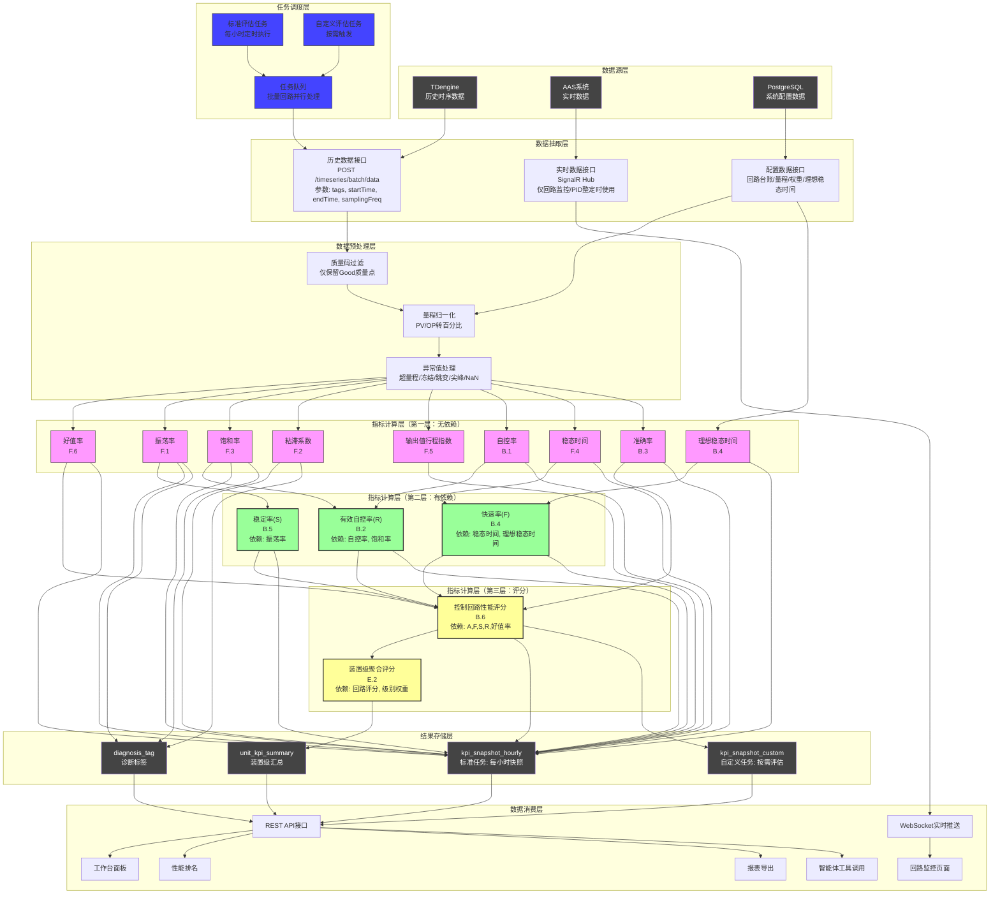
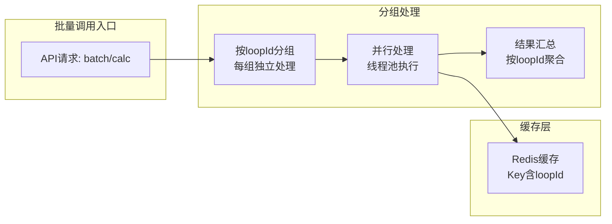
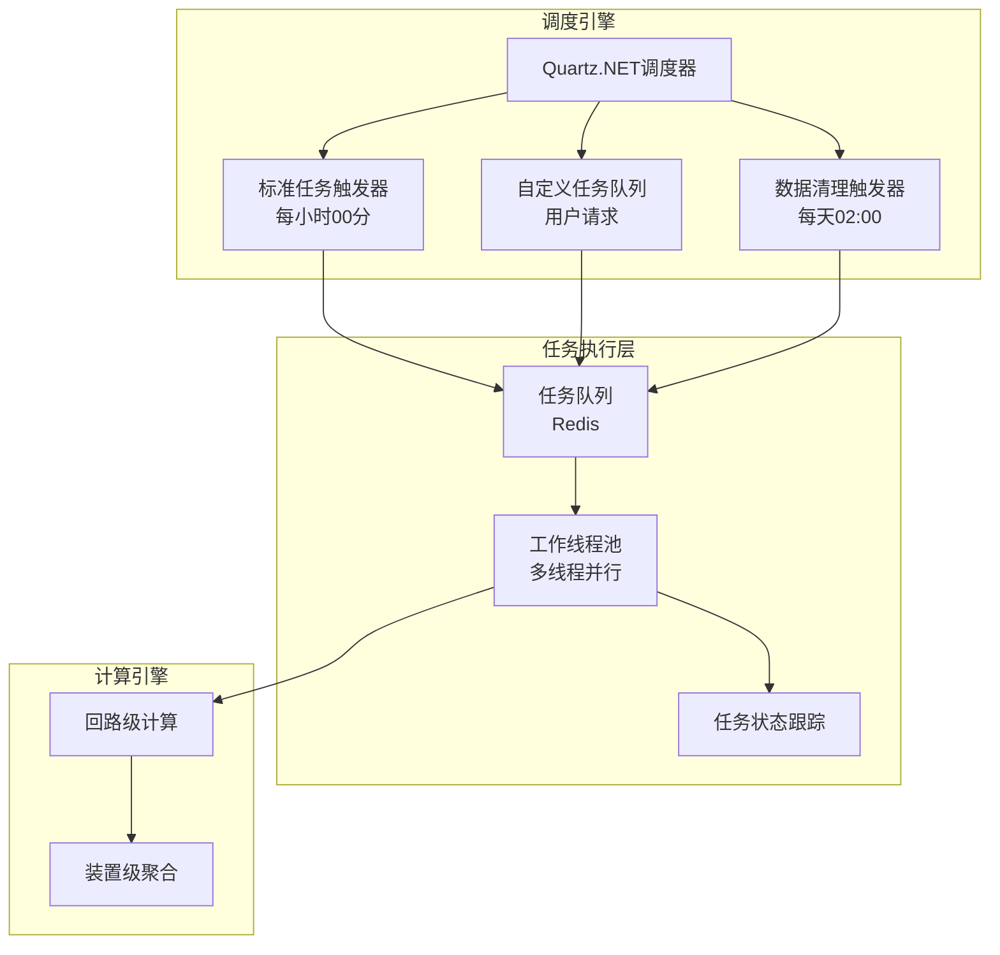
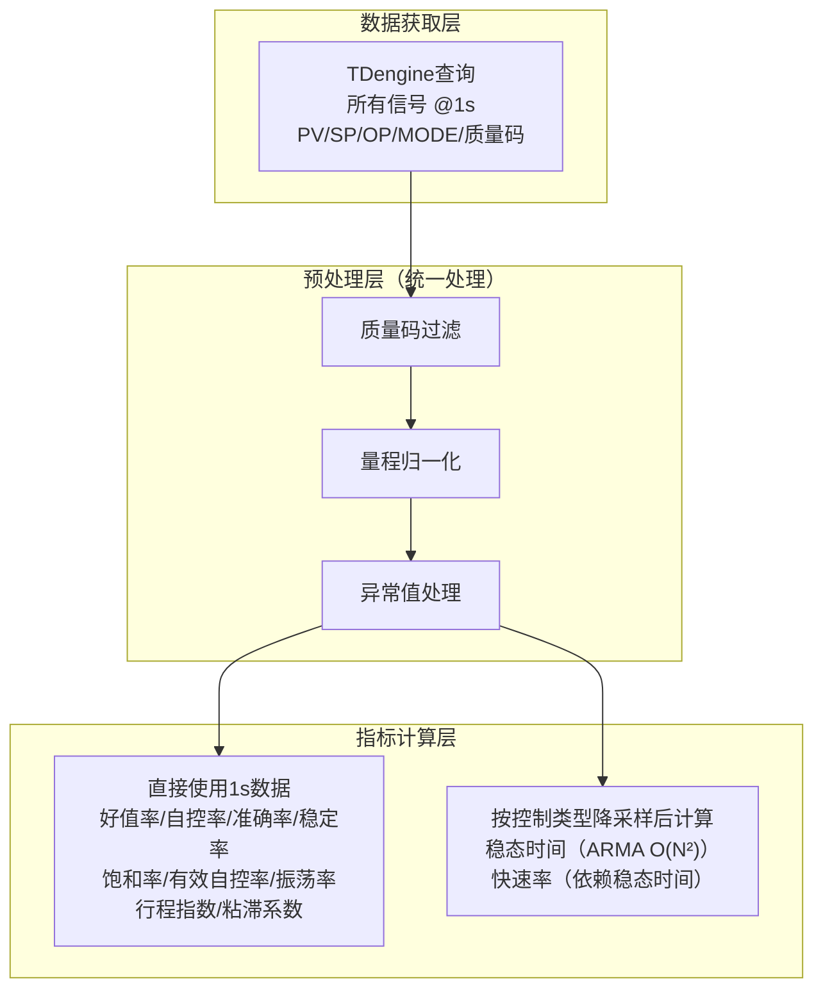
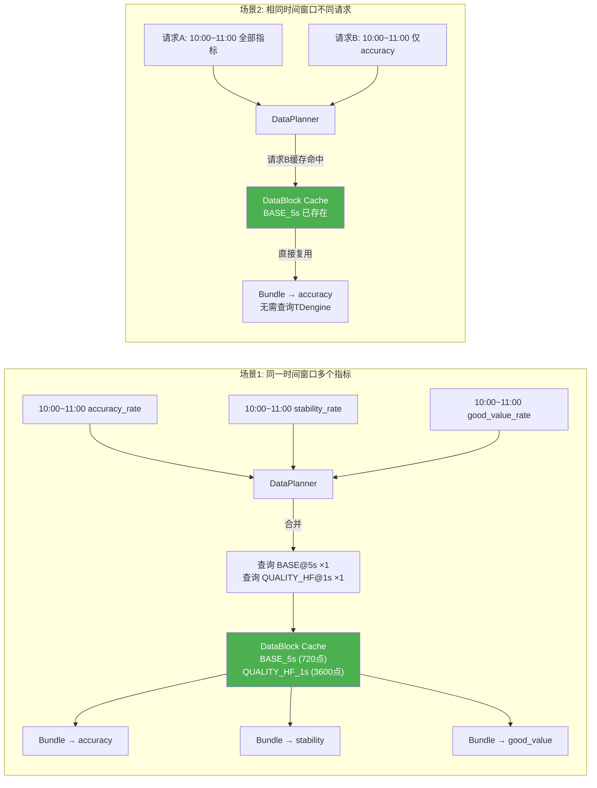
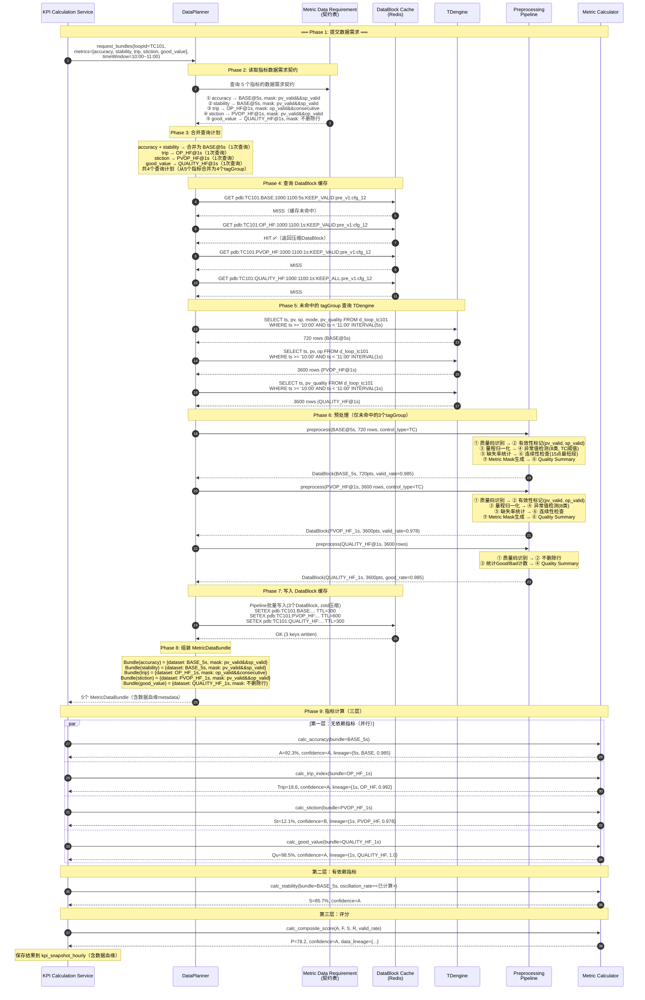
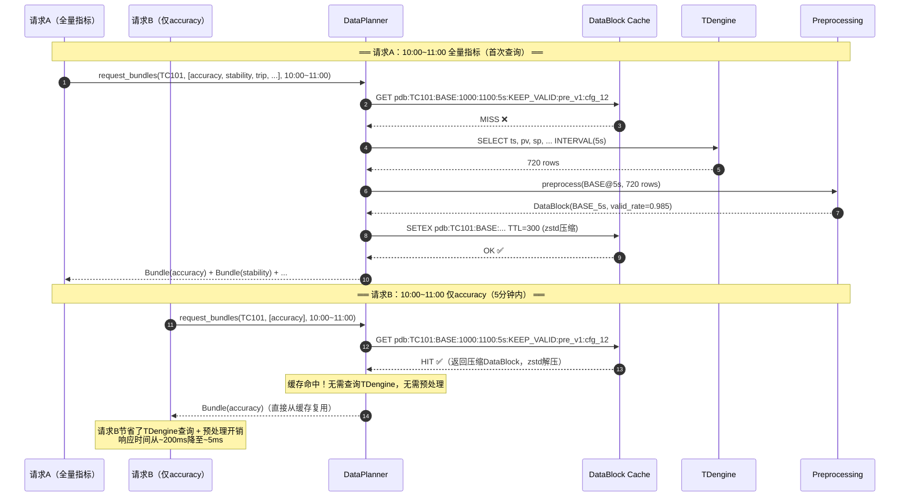
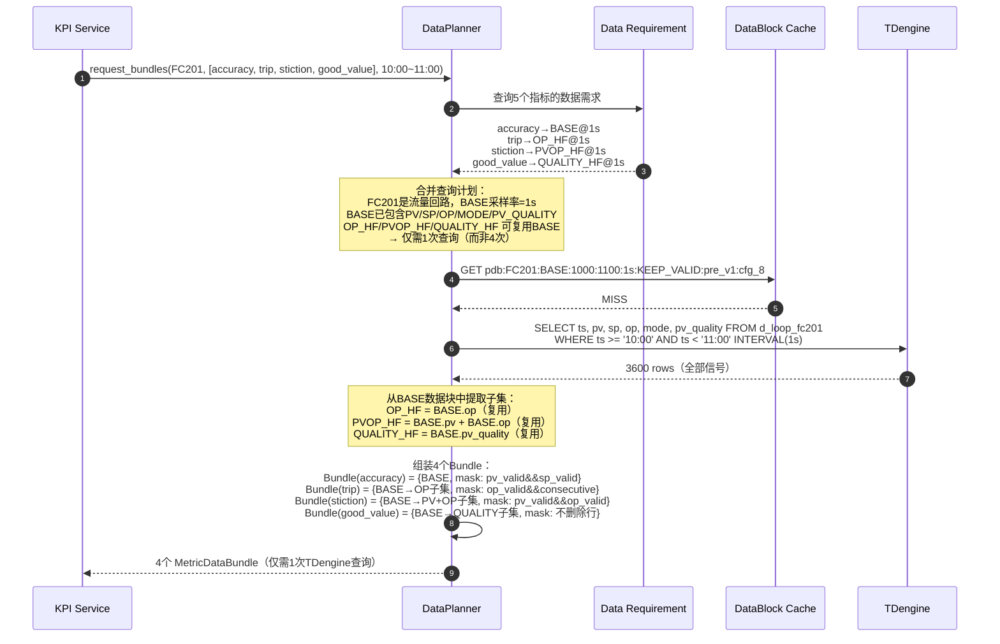
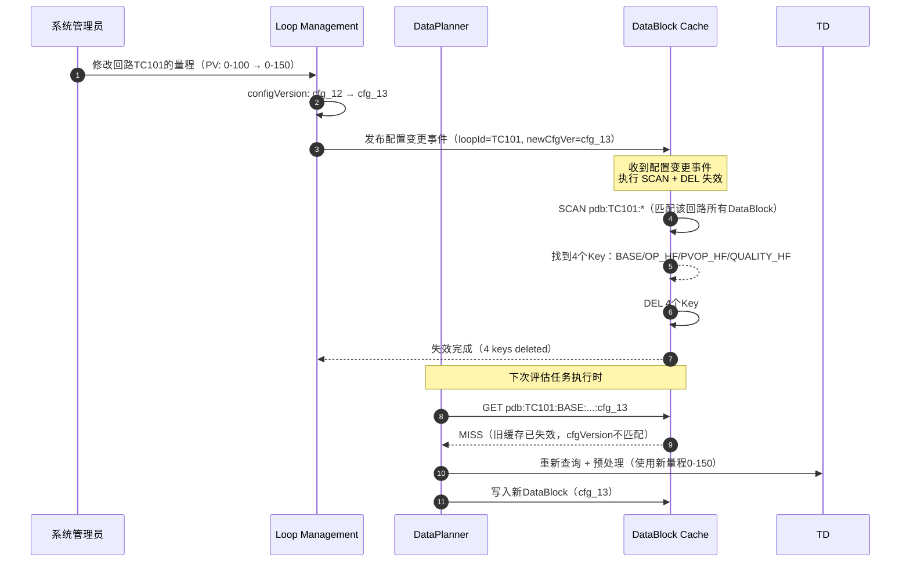

# 控制回路性能评估数据流程图（v3.0）

> **版本**：v3.0  
> **日期**：2026-06-26  
> **对齐标准**：GB/T 44693.2-2024 《危险化学品企业工艺平稳性 第2部分：控制回路性能评估与优化技术规范》

---

## 一、数据流程图



---

## 二、详细问题解答

### 2.1 数据源层接口设计

根据实际系统架构，数据源层与外部系统仅需**两个接口**，配置数据由系统内部管理：

| 接口类型 | 接口描述 | 参数 | 用途 | 对接系统 |
|---|---|---|---|---|
| **历史数据接口** | TDengine时序数据查询 | `tags[]`, `startTime`, `endTime`, `samplingFreq` | 性能评估、历史分析 | TDengine |
| **实时数据接口** | SignalR/WebSocket推送 | `loopId`, `tags[]` | 回路监控页面、PID整定 | AAS系统 |
| **配置数据接口** | PostgreSQL配置查询 | `loopId` | 量程、控制类型、理想稳态时间等 | 内部PG数据库 |

**关键说明**：

1. **历史数据接口**：
   - 返回**时间戳 + 数值**的标准化格式
   - 接口已实现统一采样和时间对齐，预处理层无需重复
   - 支持批量查询多个tag，减少网络往返

2. **实时数据接口**：
   - 仅在**回路监控页面**和**PID整定**时使用，不参与常规性能评估
   - 基于SignalR，实现服务器推送，低延迟实时数据
   - 不写入评估计算流程

3. **配置数据**：
   - 由系统内部回路管理模块维护，不依赖外部系统
   - 存储于PostgreSQL的`loop_ledger`表
   - 包括：量程(pv_min/pv_max)、控制类型、理想稳态时间、回路级别权重、指标权重配置等

### 2.2 数据预处理层问题

#### Q1：为什么要先经过"有效自控率"模块？

**修正**：有效自控率属于**指标计算层（第二层：有依赖）**，不是预处理层。预处理层只做数据清洗和标准化，不做指标计算。

**原因**：有效自控率依赖自控率和饱和率两个底层指标，需要在第一层指标计算完成后才能计算，因此放在第二层。

#### Q2：时间对齐在接口已实现，还需要吗？

**回答**：不需要在预处理层重复做时间对齐。

**原因**：
- 历史数据接口返回的数据已经是**统一采样间隔**和**时间对齐**的
- TDengine查询时通过`samplingFreq`参数指定采样频率，返回的是等间隔采样数据
- 多个tag的数据在接口层已经按时间戳对齐

**优化**：数据流程图中已移除"时间对齐"模块。

#### Q3：是否必须定义PV、OP做量程归一化处理？

**回答**：**必须**进行量程归一化处理。

**原因**：

| 需求 | 说明 |
|---|---|
| **指标可比性** | 不同回路的PV/OP量程不同（如温度0-100°C vs 压力0-10MPa），归一化后才能统一比较 |
| **公式要求** | 稳定率公式中 `σ / (0.05·U)` 需要归一化后的偏差，其中U为量程范围 |
| **粘滞系数** | PV-OP散点椭圆拟合需要归一化数据，否则长轴短轴比例无意义 |
| **国标要求** | GB/T 44693.2-2024附录B明确要求使用归一化偏差进行计算 |

**归一化公式**：
$$PV_{norm} = \frac{PV - PV_{min}}{PV_{max} - PV_{min}} \times 100\%$$
$$OP_{norm} = \frac{OP - OP_{min}}{OP_{max} - OP_{min}} \times 100\%$$

#### Q4：异常值处理还需要哪些？

采用 **KEEP_ALL_WITH_VALIDITY** 策略：所有异常值保留在时间序列中，打 valid=False 标记，不物理删除。各指标通过 Metric Validity Mask 决定哪些点参与计算。

| 异常类型 | 处理方式 | 判定规则（按控制类型区分） | 说明 |
|---|---|---|---|
| **超量程** | valid=False | PV/SP/OP超出量程范围 | 传感器故障或量程配置错误 |
| **冻结值** | valid=False | FC: 5s不变, PC: 10s, TC/LC: 30s, CC: 60s | 传感器冻结或阀门卡死 |
| **跳变** | valid=False | FC: >0.8×量程, PC: >0.5×量程, TC/LC: >0.3×量程 | 非正常瞬时大幅变化 |
| **尖峰** | valid=False | 单点突变后立即恢复 | 电磁干扰或测量噪声 |
| **NaN/NULL** | valid=False | 值为NaN/NULL | 数据传输丢失 |
| **时间戳异常** | 标记但保留 | 重复/逆序/间隔异常 | 不影响数据点本身 |
| **质量码异常** | valid=False | 非Good非Bad的异常码 | Uncertain等异常状态 |
| **高频噪声** | 标记但不滤波 | 超过控制类型截止频率（FC:0.2Hz, TC:0.05Hz） | 由振荡率指标自行处理 |

> **关键变更**（v4.0）：①从"直接过滤"改为"保留+打valid标记"（KEEP_ALL_WITH_VALIDITY），避免PV/SP/OP时间戳错位；②异常值类型从6类扩展为8类；③阈值按控制类型区分，快速回路（FC）使用更短的冻结窗口和更大的跳变阈值；④高频噪声仅标记不滤波，与振荡率指标职责分离。

**处理策略**：
- 所有异常值：保留在时间序列中，打 valid=False 标记（**不删除**）
- 各指标通过 Metric Validity Mask 决定有效点：
  - 准确率/稳定率：`pv_valid && sp_valid`
  - 行程指数：`op_valid && consecutive_valid`（不跨缺口计算ΔOP）
  - 粘滞系数：`pv_valid && op_valid`
  - 好值率：不删除行，统计质量码占比
- 有效数据率（valid_rate）影响指标可信度（A/B/C/D/E五级，见关键算法设计说明§3.7.2）

#### Q5：预处理后是否缓存？

**回答**：是的，采用**两级缓存策略**：

| 缓存类型 | 存储介质 | 过期时间 | 用途 | Key格式 |
|---|---|---|---|---|
| 波形数据缓存 | Redis | 5分钟 | 原始时序数据 | `waveform:{loopId}:{startTime}:{endTime}:{samplingFreq}` |
| 预处理数据缓存 | Redis | 5分钟 | 清洗后的标准化数据 | `preprocessed:{loopId}:{startTime}:{endTime}:{samplingFreq}` |
| 指标计算缓存 | Redis | 10分钟 | 单个指标结果 | `metric:{loopId}:{metricCode}:{startTime}:{endTime}` |
| 批量计算缓存 | Redis | 10分钟 | 组合计算结果 | `batch:{loopId}:{startTime}:{endTime}` |

**缓存优势**：
- 减少TDengine查询次数，降低数据库压力
- 同一时间窗口的评估任务共享预处理结果
- 前端快速查看时直接读取缓存

#### Q6：多个控制回路批量调用如何区分？

**回答**：通过 `loopId + tagGroup + timeWindow + qualityPolicy` 作为唯一标识区分：

```python
cache_key = f"pdb:{loopId}:{tagGroup}:{startTime}:{endTime}:{samplingFreq}:{qualityPolicy}:{preVersion}:{cfgVersion}"
```

**批量调用处理流程**：



**关键机制**：
- 每个回路的预处理数据独立缓存，互不干扰
- 批量任务拆分为多个子任务并行执行
- 结果按loopId聚合返回

### 2.3 指标计算层分层设计

**第一层：无依赖指标**（可并行计算，无算法依赖关系）

| 指标 | 国标 | 计算复杂度 | 输入数据 |
|---|---|---|---|
| 好值率 | F.6 | O(N) | PV、质量码、时间戳、量程 |
| 振荡率 | F.1 | O(N) | PV、SP、时间戳 |
| 饱和率 | F.3 | O(N) | OP、MODE、时间戳 |
| 粘滞系数 | F.2 | O(N) | PV、OP、量程 |
| 输出值行程指数 | F.5 | O(N) | OP、时间戳、量程 |
| 自控率 | B.1 | O(N) | MODE、时间戳 |
| 稳态时间 | F.4 | O(N²) | PV、SP、时间戳 |
| 理想稳态时间 | B.4 | O(1) | 配置参数 |
| 准确率 | B.3 | O(N) | PV、SP、量程 |

**第二层：有依赖指标**（需等待第一层结果）

| 指标 | 国标 | 依赖指标 | 计算复杂度 |
|---|---|---|---|
| 稳定率 | B.5 | 振荡率 | O(N) |
| 有效自控率 | B.2 | 自控率、饱和率 | O(N) |
| 快速率 | B.4 | 稳态时间、理想稳态时间 | O(1)（仅计算比值） |

**第三层：评分计算**（需等待第二层结果）

| 指标 | 国标 | 依赖指标 | 计算复杂度 |
|---|---|---|---|
| 控制回路性能评分 | B.6 | 准确率、快速率、稳定率、有效自控率、好值率 | O(1) |
| 装置级聚合评分 | E.2 | 所有回路评分、级别权重 | O(m)，m为装置内回路数 |

**分层优势**：

| 优势 | 说明 |
|---|---|
| **并行计算** | 第一层无依赖指标可全部并行，提升计算效率 |
| **依赖清晰** | 明确各指标的前置依赖，便于任务调度 |
| **代码解耦** | 每层独立封装，便于单元测试和维护 |
| **增量计算** | 仅重新计算变化的指标，减少重复计算 |

### 2.4 评分计算层

**回答**：是的，评分计算作为第三层，依赖第二层的指标结果。

**评分计算公式**：

$$P = \frac{A \cdot a + F \cdot f + S \cdot s}{a + f + s} \times R$$

其中：
- A：准确率，F：快速率，S：稳定率（核心质量指标）
- a、f、s：权重系数（根据控制类型配置）
- R：有效自控率（作为整体折扣因子）

**装置级聚合**：

$$Score_{unit} = \frac{\sum_{i=1}^{m} w_i^{level} \cdot Score_i}{\sum_{i=1}^{m} w_i^{level}}$$

其中 $w_i^{level}$ 为回路级别权重（一级3、二级2、三级1）。

### 2.5 结果存储层问题

#### Q1：诊断标签是做什么用的？

**回答**：诊断标签用于**故障定位和告警**，是辅助诊断指标的可视化输出。

| 标签代码 | 标签名 | 触发条件 | 严重度 | 来源指标 |
|---|---|---|---|---|
| `OSCILLATION` | 振荡 | 振荡率 > 40% | 中 | 振荡率 |
| `VALVE_STICTION` | 阀门粘滞 | 粘滞系数 > 15% | 高 | 粘滞系数 |
| `OUTPUT_SATURATION` | 输出饱和 | 饱和率 > 20% | 中 | 饱和率 |
| `QUALITY_ABNORMAL` | PV质量异常 | 好值率 < 50% | 高 | 好值率 |
| `MANUAL_REVIEW` | 人工复核 | 兜底标签 | - | 综合评分 |

**用途**：
- 前端展示故障回路列表，快速定位问题
- 触发告警通知（邮件/消息推送）
- 作为智能体诊断的输入，辅助根因分析
- 生成诊断报告，指导优化措施

#### Q2：存储规则

**标准任务**（每小时定时执行）：

| 项目 | 说明 |
|---|---|
| 存储表 | `kpi_snapshot_hourly` |
| 存储内容 | 12项指标值 + 综合评分 + 诊断标签 |
| 触发方式 | 任务调度引擎定时触发 |
| 保留策略 | 保留3个月，超过3个月转存历史表 `kpi_snapshot_history` |
| 聚合规则 | 自动计算装置级汇总并写入 `unit_kpi_summary` |

**自定义任务**（按需评估）：

| 项目 | 说明 |
|---|---|
| 存储表 | `kpi_snapshot_custom` |
| 存储内容 | 用户指定的指标值 + 评估时间窗口 + 任务ID |
| 触发方式 | 用户手动触发或API调用 |
| 保留策略 | 永久保留，用户手动管理删除 |
| 聚合规则 | 可选是否计算装置级汇总 |

**存储示例**：

```sql
-- kpi_snapshot_hourly 表结构（简化）
CREATE TABLE kpi_snapshot_hourly (
    id BIGSERIAL PRIMARY KEY,
    loop_id UUID NOT NULL,
    snapshot_time TIMESTAMPTZ NOT NULL,
    accuracy_rate DECIMAL(5,2),
    fast_rate DECIMAL(5,2),
    stability_rate DECIMAL(5,2),
    effective_auto_rate DECIMAL(5,2),
    good_value_rate DECIMAL(5,2),
    oscillation_rate DECIMAL(5,2),
    saturation_rate DECIMAL(5,2),
    stiction_index DECIMAL(5,2),
    output_trip_index DECIMAL(7,4),
    auto_mode_rate DECIMAL(5,2),
    settling_time DECIMAL(10,2),
    ideal_settling_time DECIMAL(10,2),
    composite_score DECIMAL(5,2),
    diagnosis_tags JSONB,
    algorithm_version VARCHAR(50),
    created_at TIMESTAMPTZ DEFAULT NOW()
);
```

#### Q3：是否需要任务调度引擎？

**回答**：**需要**。推荐采用**Quartz.NET**或**Hangfire**作为任务调度引擎。

**任务类型**：

| 任务类型 | 调度规则 | 并行度 | 说明 |
|---|---|---|---|
| 标准评估任务 | 每小时整点 | 按装置分批次 | 批量计算所有回路KPI |
| 自定义评估任务 | 按需触发 | 单任务串行 | 用户指定回路和时间窗口 |
| 数据清理任务 | 每天凌晨 | 单任务串行 | 清理过期快照数据 |
| 装置级聚合任务 | 评估任务完成后 | 单任务串行 | 计算装置级汇总 |

**任务调度流程**：



**推荐配置**：

| 配置项 | 推荐值 | 说明 |
|---|---|---|
| 评估批次大小 | 50-100回路/批次 | 平衡内存与并行度 |
| 线程池大小 | CPU核心数 × 2 | 最大化并行度 |
| 任务超时时间 | 30分钟 | 防止任务卡死 |
| 失败重试次数 | 3次 | 自动重试机制 |
| 重试间隔 | 5分钟 | 指数退避 |

### 2.6 性能评估（1000-2000回路）

#### 计算开销预估

**单回路计算耗时**：

| 指标类型 | 单回路耗时 | 复杂度 | 说明 |
|---|---|---|---|
| 简单O(N)指标（好值率/自控率等） | ~5ms | O(N) | 线性扫描 |
| 中等O(N)指标（有效自控率/稳定率等） | ~10ms | O(N) | 线性扫描+计算 |
| 粘滞系数 | ~20ms | O(N) | 椭圆拟合 |
| 快速率（ARMA模型） | ~80ms | O(N²) | 矩阵运算 |
| **单回路总计** | **~120ms** | - | - |

**批量计算耗时**（理想并行）：

| 回路数 | 理论耗时 | 实际耗时（含IO） | 说明 |
|---|---|---|---|
| 100 | ~80ms | ~2-3s | 单批次 |
| 500 | ~80ms | ~10-15s | 5批次 |
| 1000 | ~80ms | ~20-30s | 10批次 |
| 2000 | ~80ms | ~40-60s | 20批次 |

**资源消耗**：

| 资源类型 | 1000回路 | 2000回路 | 说明 |
|---|---|---|---|
| 内存 | ~500MB | ~1GB | 预处理数据缓存 |
| CPU利用率 | ~60% | ~80% | 多核并行 |
| TDengine查询 | ~20次 | ~40次 | 批量查询 |
| PG写入 | ~10次 | ~20次 | 批量插入 |

#### 优化方案

| 优化策略 | 说明 | 预期效果 | 实现难度 |
|---|---|---|---|
| **分批次处理** | 每批次处理50-100个回路 | 控制内存占用，避免OOM | 低 |
| **并行计算** | 使用线程池并行处理无依赖指标 | 提升3-5倍效率 | 中 |
| **数据预取** | 批量查询TDengine数据（一次查询多个tag） | 减少数据库连接数 | 中 |
| **缓存复用** | 同一时间窗口的预处理数据缓存 | 避免重复计算 | 低 |
| **指标驱动按需采样** | 按控制类型+指标需求确定采样率，按需获取数据 | 平衡精度与效率，避免降采样失真 | 中 |
| **异步任务** | 后台异步执行，不阻塞前端 | 提升用户体验 | 中 |
| **增量计算** | 仅计算新增数据，复用历史结果 | 大幅减少计算量 | 高 |
| **算法优化** | ARMA模型使用稀疏矩阵优化 | 降低快速率计算耗时 | 高 |

#### 统一秒级采样 + 指标计算层按需降采样策略

**核心原则**：

数据获取层统一按**1秒采样率**获取所有信号，预处理层统一处理（时间戳天然对齐），指标计算层根据各指标算法特性自行决定是否降采样。

**设计思路**：

```
数据获取层：统一1s获取所有信号（PV/SP/OP/MODE/质量码）
    ↓
预处理层：统一处理（质量码过滤、量程归一化、异常值处理）—— 时间戳天然对齐
    ↓
指标计算层：各指标按需决定是否降采样
    ├── 行程指数/粘滞系数/振荡率 → 直接用1s数据，不降采样
    ├── 好值率/准确率/稳定率/自控率 → 直接用1s数据（O(N)计算量小，无需降采样）
    └── 稳态时间/快速率（ARMA O(N²)）→ 按控制类型降采样后计算
```

**方案对比与选择**：

| 维度 | 方案A：按需不同采样率获取 | 方案B：统一1s + 计算层降采样（✅ 采用） |
|---|---|---|
| 时间戳对齐 | 不对齐，预处理层需额外处理 | **天然对齐**，预处理层简单 |
| 数据获取 | 多次查询不同采样率 | **一次查询**1s全量数据 |
| 预处理复杂度 | 高（需处理不同采样率信号对齐） | **低**（统一处理） |
| 数据量 | 小（慢速回路360~1800点） | 大（统一3600点/信号），但可控 |
| 指标计算灵活性 | 中（已按需获取） | **高**（计算层自行决定降采样） |
| 实现复杂度 | 高 | **低** |

**选择方案B的理由**：
1. **时间戳对齐**：所有信号1s采样，PV/SP/OP/MODE/质量码时间戳完全一致，预处理层无需做时间对齐
2. **接口统一**：数据获取层只需一个1s采样率的查询接口，简单高效
3. **预处理简单**：统一处理质量码过滤、量程归一化、异常值处理，无需考虑不同采样率
4. **指标计算灵活**：每个指标根据自身算法特性决定是否降采样，降采样在计算层完成
5. **数据量可控**：1小时1s采样的数据量在现代系统上完全可控（见下方评估）

**数据量评估**：

| 项目 | 单回路 | 1000回路 | 2000回路 |
|---|---|---|---|
| 信号数 | 5个（PV/SP/OP/MODE/质量码） | 5个 | 5个 |
| 1小时数据点 | 3600点/信号 × 5 = 18000点 | 1800万点 | 3600万点 |
| 内存占用（8字节/点） | ~144KB | ~144MB | ~288MB |
| TDengine查询数据量 | ~144KB | ~144MB | ~288MB |

> 288MB对于现代服务器完全可控，且通过分批次处理（50-100回路/批次）可进一步降低峰值内存。

**指标计算层的降采样策略**：

每个指标根据算法复杂度和采样率敏感度，自行决定是否从1s数据中降采样：

| 指标 | 算法复杂度 | 采样率敏感度 | 降采样策略 | 理由 |
|---|---|---|---|---|
| 好值率 | O(N) | 低 | **不降采样** | N=3600，O(N)计算量仅~5ms，无需降采样 |
| 自控率 | O(N) | 低 | **不降采样** | 同上 |
| 准确率 | O(N) | 低 | **不降采样** | 均值对采样率不敏感，且计算量小 |
| 稳定率 | O(N) | 低 | **不降采样** | 标准差对采样率不敏感，且计算量小 |
| 饱和率 | O(N) | 中 | **不降采样** | 需精确捕捉饱和起止时刻 |
| 有效自控率 | O(N) | 中 | **不降采样** | 需同步判断MODE+OP+偏差 |
| 振荡率 | O(N) | **高** | **不降采样** | 零交叉检测需高频数据，降采样会漏检 |
| **输出值行程指数** | O(N) | **极高** | **不降采样（必须1s）** | OP变化量累积，降采样导致行程偏低 |
| **粘滞系数** | O(N) | **高** | **不降采样（必须1s）** | PV-OP散点拟合需足够数据点 |
| 稳态时间 | **O(N²)** | 中 | **按控制类型降采样** | ARMA矩阵运算，降采样可大幅减少计算量 |
| 快速率 | O(1) | 中 | 依赖稳态时间 | 无需单独降采样，跟随稳态时间 |

**关键分析——为什么行程指数必须1s数据**：

行程指数公式 $Trip = \frac{\sum|OP_i - OP_{i-1}|}{T_{total} \cdot OP_{range}}$，本质是OP变化量的累积。

假设OP在1秒内从50→52→50（一个完整的阀门抖动）：
- **1s数据**：捕捉到两次变化 `|52-50| + |50-52| = 4`，行程=4
- **5s降采样**：只看到起点50和终点50，变化量=0，**行程完全丢失**

因此行程指数**必须使用1s OP数据**，在指标计算层不做降采样。

**ARMA指标的降采样策略（稳态时间/快速率）**：

ARMA模型辨识为O(N²)复杂度，是计算瓶颈。按控制类型降采样可在不影响精度的前提下大幅减少计算量：

| 控制类型 | 原始1s数据 | 降采样后采样率 | 降采样后数据点 | 计算量降低 | 精度影响 |
|---|---|---|---|---|---|
| 流量（FC） | 3600点 | 1s（不降采样） | 3600点 | 无 | 无影响（需高频辨识） |
| 压力（PC） | 3600点 | 2s | 1800点 | 降低75% | 可忽略（振荡周期>30s） |
| 温度（TC） | 3600点 | 5s | 720点 | 降低94% | 可忽略（大惯性过程） |
| 液位（LC） | 3600点 | 5s | 720点 | 降低94% | 可忽略（慢速过程） |
| 成分（CC） | 3600点 | 10s | 360点 | 降低97% | 可忽略（大滞后过程） |

> 降采样算法：均匀抽取（等间隔采样），因为ARMA模型辨识关注的是整体趋势，不需要保留峰值特征。

**数据流程**：



**各指标实际使用的数据点数**：

| 指标 | 流量回路 | 压力回路 | 温度/液位回路 | 成分回路 |
|---|---|---|---|---|
| 好值率/自控率/准确率/稳定率 | 3600 | 3600 | 3600 | 3600 |
| 饱和率/有效自控率 | 3600 | 3600 | 3600 | 3600 |
| 振荡率 | 3600 | 3600 | 3600 | 3600 |
| 行程指数 | 3600 | 3600 | 3600 | 3600 |
| 粘滞系数 | 3600 | 3600 | 3600 | 3600 |
| 稳态时间（ARMA） | 3600（1s） | 1800（2s） | 720（5s） | 360（10s） |
| 快速率 | 跟随稳态时间 | 跟随稳态时间 | 跟随稳态时间 | 跟随稳态时间 |

#### 推荐配置

| 配置项 | 推荐值 | 说明 |
|---|---|---|
| 评估批次大小 | 50-100回路/批次 | 平衡内存与并行度 |
| 线程池大小 | CPU核心数 × 2 | 最大化并行度 |
| 数据获取采样率 | **统一1s** | 所有信号统一秒级获取 |
| ARMA降采样率 | 按控制类型（1~10s） | 仅稳态时间/快速率计算时降采样 |
| 降采样算法 | 均匀抽取 | ARMA计算前等间隔抽取 |
| Redis缓存 | 开启 | 减少重复查询 |
| TDengine连接池 | 50-100连接 | 批量查询支持 |
| 任务调度频率 | 每小时 | 标准评估周期 |
| 历史数据保留 | 3个月 | 平衡存储与查询 |

#### 扩展方案（未来回路数增长时）

| 扩展方式 | 适用场景 | 说明 |
|---|---|---|
| **水平扩展** | 回路数 > 5000 | 部署多个计算节点，按装置分片 |
| **消息队列** | 高并发场景 | 使用Kafka/RabbitMQ异步处理 |
| **定时窗口优化** | 高峰时段 | 将评估任务分散到非高峰时段 |
| **冷热数据分离** | 历史查询 | 近期数据存PG，历史数据存TDengine |

---

## 三、指标与国标对应关系

### 3.1 第一层：无依赖指标

| 指标 | 国标编号 | 算法接口 | 时间复杂度 |
|---|---|---|---|
| 好值率 | F.6 | `calc_good_value_rate` | O(N) |
| 振荡率 | F.1 | `calc_oscillation_rate` | O(N) |
| 饱和率 | F.3 | `calc_saturation_rate` | O(N) |
| 粘滞系数 | F.2 | `calc_stiction_index` | O(N) |
| 输出值行程指数 | F.5 | `calc_output_trip_index` | O(N) |
| 自控率 | B.1 | `calc_auto_mode_rate` | O(N) |
| 稳态时间 | F.4 | `calc_settling_time` | O(N²) |
| 理想稳态时间 | B.4 | `get_ideal_settling_time` | O(1) |
| 准确率 | B.3 | `calc_accuracy_rate` | O(N) |

### 3.2 第二层：有依赖指标

| 指标 | 国标编号 | 算法接口 | 依赖指标 |
|---|---|---|---|
| 稳定率 | B.5 | `calc_stability_rate` | 振荡率 |
| 有效自控率 | B.2 | `calc_effective_auto_rate` | 自控率、饱和率 |
| 快速率 | B.4 | `calc_fast_rate` | 稳态时间、理想稳态时间 |

### 3.3 第三层：评分计算

| 指标 | 国标编号 | 算法接口 | 依赖指标 |
|---|---|---|---|
| 控制回路性能评分 | B.6 | `calc_composite_score` | 准确率、快速率、稳定率、有效自控率、好值率 |
| 装置级聚合评分 | E.2 | `calc_unit_score` | 所有回路评分、级别权重 |

---

## 四、接口设计说明

### 4.1 历史数据接口

```
GET /api/v1/timeseries/{loopId}/data
POST /api/v1/timeseries/batch/data
```

**参数**：
- `loopId` / `loopIds`：回路ID（支持批量）
- `startTime` / `endTime`：时间窗口（ISO8601格式）
- `samplingFreq`：采样频率（如 "1s", "10s", "1min", "5min"）
- `tags`：数据标签（pv/sp/op/mode/pv_quality）

**返回格式**：
```json
{
  "loopId": "uuid-xxx",
  "timestamp": ["2026-06-25T00:00:00Z", "2026-06-25T00:00:10Z", ...],
  "pv": [10.5, 10.6, ...],
  "sp": [10.0, 10.0, ...],
  "op": [50.2, 50.3, ...],
  "mode": [1, 1, ...],
  "pv_quality": [2, 2, ...]
}
```

### 4.2 实时数据接口（SignalR）

```
SignalR Hub: /loopMonitorHub
```

**方法**：
- `SubscribeToLoop(loopId)`：订阅回路实时数据
- `UnsubscribeFromLoop(loopId)`：取消订阅
- `SubscribeToLoops(loopIds[])`：批量订阅

**推送格式**：
```json
{
  "loopId": "uuid-xxx",
  "timestamp": "2026-06-25T10:30:00Z",
  "pv": 10.5,
  "sp": 10.0,
  "op": 50.2,
  "mode": 1,
  "pv_quality": 2
}
```

### 4.3 独立指标计算接口

```
POST /api/v1/metrics/{metricCode}/calc
```

**支持的 metricCode**：
- `good_value_rate`
- `auto_mode_rate`
- `effective_auto_rate`
- `accuracy_rate`
- `fast_rate`
- `stability_rate`
- `oscillation_rate`
- `saturation_rate`
- `stiction_index`
- `output_trip_index`
- `settling_time`

**请求格式**：
```json
{
  "loopId": "uuid-xxx",
  "timeWindow": {
    "start": "2026-06-25T00:00:00Z",
    "end": "2026-06-25T01:00:00Z"
  },
  "samplingFreq": "10s"
}
```

### 4.4 组合调用接口

```
POST /api/v1/metrics/batch/calc
```

**请求格式**：
```json
{
  "loopId": "uuid-xxx",
  "timeWindow": {
    "start": "2026-06-25T00:00:00Z",
    "end": "2026-06-25T01:00:00Z"
  },
  "metrics": ["accuracy_rate", "fast_rate", "stability_rate", "effective_auto_rate"],
  "samplingFreq": "10s"
}
```

### 4.5 任务管理接口

```
POST /api/v1/tasks/standard/evaluate
POST /api/v1/tasks/custom/evaluate
GET /api/v1/tasks/status/{taskId}
GET /api/v1/tasks/history
DELETE /api/v1/tasks/{taskId}
```

**自定义任务请求格式**：
```json
{
  "loopIds": ["uuid-xxx", "uuid-yyy"],
  "timeWindow": {
    "start": "2026-06-25T00:00:00Z",
    "end": "2026-06-25T01:00:00Z"
  },
  "metrics": ["accuracy_rate", "fast_rate", "stability_rate"],
  "samplingFreq": "10s",
  "aggregateUnit": true
}
```

---

## 五、国标合规性检查

### 5.1 附录 B（性能评估指标）✅ 完全覆盖

| 国标编号 | 指标名称 | 状态 |
|---|---|---|
| B.1 | 自控率 | ✅ 已实现 |
| B.2 | 有效自控率 | ✅ 已实现 |
| B.3 | 准确率 | ✅ 已实现 |
| B.4 | 快速率 | ✅ 已实现 |
| B.5 | 平稳率（稳定率） | ✅ 已实现 |
| B.6 | 性能评分 | ✅ 已实现 |

### 5.2 附录 F（故障诊断指标）✅ 部分覆盖

| 国标编号 | 指标名称 | 状态 |
|---|---|---|
| F.1 | 振荡率 | ✅ 已实现 |
| F.2 | 黏滞系数 | ✅ 已实现 |
| F.3 | 饱和率 | ✅ 已实现 |
| F.4 | 稳态时间 | ✅ 已实现 |
| F.5 | 输出值行程指数 | ✅ 已实现 |
| F.6 | 好值率 | ✅ 已实现 |
| F.7 | 相关性指数 | ⚠️ 暂不纳入 |
| F.8 | 多指标综合诊断 | ⚠️ 暂不纳入 |

---

## 六、DataPlanner 数据流转详细设计

> **示例场景**：计算温度回路 TC101 的 5 个指标（准确率、稳定率、行程指数、粘滞系数、好值率），时间窗口 10:00~11:00。

### 6.1 DataPlanner 完整数据流转图

```mermaid
flowchart TD
    %% ===== 入口 =====
    REQ["指标计算请求<br/>loopId=TC101 (温度回路)<br/>metrics=[accuracy_rate, stability_rate,<br/>output_trip_index, stiction_index, good_value_rate]<br/>timeWindow=10:00~11:00"]

    %% ===== Step 1: 指标数据需求契约 =====
    subgraph S1["Step 1: 读取指标数据需求契约（Metric Data Requirement）"]
        direction TB
        R1["accuracy_rate<br/>━━━━━━━━━━━<br/>tagGroup: BASE<br/>tags: PV, SP<br/>sampling: 按回路类型(温度=5s)<br/>qualityPolicy: KEEP_ALL_WITH_VALIDITY<br/>mask: pv_valid && sp_valid<br/>aggregationPolicy: LAST"]
        R2["stability_rate<br/>━━━━━━━━━━━<br/>tagGroup: BASE<br/>tags: PV, SP<br/>sampling: 按回路类型(温度=5s)<br/>qualityPolicy: KEEP_ALL_WITH_VALIDITY<br/>mask: pv_valid && sp_valid<br/>aggregationPolicy: LAST"]
        R3["output_trip_index<br/>━━━━━━━━━━━<br/>tagGroup: OP_HF<br/>tags: OP<br/>sampling: 固定1s<br/>qualityPolicy: KEEP_ALL_WITH_VALIDITY<br/>mask: op_valid && consecutive_valid<br/>aggregationPolicy: LAST"]
        R4["stiction_index<br/>━━━━━━━━━━━<br/>tagGroup: PVOP_HF<br/>tags: PV, OP<br/>sampling: 固定1s<br/>qualityPolicy: KEEP_ALL_WITH_VALIDITY<br/>mask: pv_valid && op_valid<br/>aggregationPolicy: LAST"]
        R5["good_value_rate<br/>━━━━━━━━━━━<br/>tagGroup: QUALITY_HF<br/>tags: PV_QUALITY<br/>sampling: 固定1s<br/>qualityPolicy: KEEP_ALL<br/>mask: 不删除行,统计质量码<br/>aggregationPolicy: LAST"]
    end

    %% ===== Step 2: DataPlanner 合并查询计划 =====
    subgraph S2["Step 2: Data Planner — 合并查询计划"]
        direction TB
        MERGE["合并算法:<br/>1.按 tagGroup 分组<br/>2.相同 tagGroup 合并为一次查询<br/>3.取 tags 的并集<br/>4.取采样率的最大值(高频优先)"]
        
        P1["查询计划 1: BASE @5s<br/>━━━━━━━━━━━<br/>服务指标: accuracy_rate + stability_rate<br/>tags: PV, SP<br/>点数: 720点/小时<br/>cacheKey: preprocessed:TC101:BASE:1000:1100:5s:LAST:KEEP_VALID:pre_v1:cfg_12"]
        P2["查询计划 2: OP_HF @1s<br/>━━━━━━━━━━━<br/>服务指标: output_trip_index<br/>tags: OP<br/>点数: 3600点/小时<br/>cacheKey: preprocessed:TC101:OP_HF:1000:1100:1s:LAST:KEEP_VALID:pre_v1:cfg_12"]
        P3["查询计划 3: PVOP_HF @1s<br/>━━━━━━━━━━━<br/>服务指标: stiction_index<br/>tags: PV, OP<br/>点数: 3600点/小时<br/>cacheKey: preprocessed:TC101:PVOP_HF:1000:1100:1s:LAST:KEEP_VALID:pre_v1:cfg_12"]
        P4["查询计划 4: QUALITY_HF @1s<br/>━━━━━━━━━━━<br/>服务指标: good_value_rate<br/>tags: PV_QUALITY<br/>点数: 3600点/小时<br/>cacheKey: preprocessed:TC101:QUALITY_HF:1000:1100:1s:LAST:KEEP_ALL:pre_v1:cfg_12"]
        
        MERGE --> P1
        MERGE --> P2
        MERGE --> P3
        MERGE --> P4
    end

    %% ===== Step 3: 缓存查询分支 =====
    subgraph S3["Step 3: 查询 DataBlock 缓存"]
        direction TB
        C1{"BASE @5s<br/>缓存命中?"}
        C2{"OP_HF @1s<br/>缓存命中?"}
        C3{"PVOP_HF @1s<br/>缓存命中?"}
        C4{"QUALITY_HF @1s<br/>缓存命中?"}
    end

    %% ===== Step 4: 缓存命中 / 未命中分支 =====
    subgraph S4["Step 4: 数据获取"]
        direction TB
        HIT1["缓存命中<br/>直接复用 DataBlock"]
        HIT2["缓存命中<br/>直接复用 DataBlock"]
        MISS1["未命中 → 查询 TDengine<br/>SELECT ts, pv, sp FROM d_loop_tc101<br/>WHERE ts >= '10:00' AND ts < '11:00'<br/>INTERVAL(5s)"]
        MISS2["未命中 → 查询 TDengine<br/>SELECT ts, op FROM d_loop_tc101<br/>WHERE ts >= '10:00' AND ts < '11:00'<br/>INTERVAL(1s)"]
        MISS3["未命中 → 查询 TDengine<br/>SELECT ts, pv, op FROM d_loop_tc101<br/>WHERE ts >= '10:00' AND ts < '11:00'<br/>INTERVAL(1s)"]
        MISS4["未命中 → 查询 TDengine<br/>SELECT ts, pv_quality FROM d_loop_tc101<br/>WHERE ts >= '10:00' AND ts < '11:00'<br/>INTERVAL(1s)"]
    end

    %% ===== Step 5: 预处理 =====
    subgraph S5["Step 5: 预处理（仅未命中的数据块）"]
        direction TB
        PRE1["预处理 BASE @5s<br/>━━━━━━━━━━━<br/>① 质量码识别: Good/Bad<br/>② 有效性标记: pv_valid, sp_valid<br/>③ 量程归一化: PV_norm, SP_norm<br/>④ 异常值识别: 超量程/冻结/跳变/尖峰<br/>⑤ Metric Mask 生成<br/>⑥ Quality Summary 生成"]
        PRE2["预处理 OP_HF @1s<br/>━━━━━━━━━━━<br/>① 质量码识别<br/>② 有效性标记: op_valid<br/>③ 量程归一化: OP_norm<br/>④ 连续性检查: consecutive_valid<br/>⑤ Metric Mask: op_valid && consecutive<br/>⑥ Quality Summary"]
        PRE3["预处理 PVOP_HF @1s<br/>━━━━━━━━━━━<br/>① 质量码识别<br/>② 有效性标记: pv_valid, op_valid<br/>③ 量程归一化: PV_norm, OP_norm<br/>④ 异常值识别<br/>⑤ Metric Mask: pv_valid && op_valid<br/>⑥ Quality Summary"]
        PRE4["预处理 QUALITY_HF @1s<br/>━━━━━━━━━━━<br/>① 质量码识别: Good/Bad<br/>② 不删除任何行<br/>③ 统计 Good/Bad 计数<br/>④ Quality Summary"]
    end

    %% ===== Step 6: 生成DataBlock并写缓存 =====
    subgraph S6["Step 6: 生成 DataBlock 并写入缓存"]
        direction TB
        DB1["DataBlock: BASE_5s<br/>━━━━━━━━━━━<br/>dataBlockId: db_TC101_BASE_5s<br/>pointCount: 720<br/>写入 Redis (TTL=5min)"]
        DB2["DataBlock: OP_HF_1s<br/>━━━━━━━━━━━<br/>dataBlockId: db_TC101_OP_HF_1s<br/>pointCount: 3600<br/>写入 Redis (TTL=5min)"]
        DB3["DataBlock: PVOP_HF_1s<br/>━━━━━━━━━━━<br/>dataBlockId: db_TC101_PVOP_HF_1s<br/>pointCount: 3600<br/>写入 Redis (TTL=5min)"]
        DB4["DataBlock: QUALITY_HF_1s<br/>━━━━━━━━━━━<br/>dataBlockId: db_TC101_QUALITY_HF_1s<br/>pointCount: 3600<br/>写入 Redis (TTL=5min)"]
    end

    %% ===== Step 7: 组装MetricDataBundle =====
    subgraph S7["Step 7: 按 metric 组装 MetricDataBundle"]
        direction TB
        BUNDLE1["Bundle → accuracy_rate<br/>━━━━━━━━━━━<br/>datasets: BASE_5s<br/>mask: pv_valid && sp_valid<br/>samplingFreq: 5s<br/>pointCount: 720"]
        BUNDLE2["Bundle → stability_rate<br/>━━━━━━━━━━━<br/>datasets: BASE_5s<br/>mask: pv_valid && sp_valid<br/>samplingFreq: 5s<br/>pointCount: 720"]
        BUNDLE3["Bundle → output_trip_index<br/>━━━━━━━━━━━<br/>datasets: OP_HF_1s<br/>mask: op_valid && consecutive<br/>samplingFreq: 1s<br/>pointCount: 3600"]
        BUNDLE4["Bundle → stiction_index<br/>━━━━━━━━━━━<br/>datasets: PVOP_HF_1s<br/>mask: pv_valid && op_valid<br/>samplingFreq: 1s<br/>pointCount: 3600"]
        BUNDLE5["Bundle → good_value_rate<br/>━━━━━━━━━━━<br/>datasets: QUALITY_HF_1s<br/>mask: 不删除行<br/>samplingFreq: 1s<br/>pointCount: 3600"]
    end

    %% ===== Step 8: 指标计算 =====
    subgraph S8["Step 8: 指标计算（三层）"]
        direction TB
        subgraph L1["第一层: 无依赖指标（并行）"]
            CALC1["calc_accuracy(bundle1)<br/>→ A = 92.3%<br/>confidence: A"]
            CALC3["calc_trip_index(bundle3)<br/>→ Trip = 18.6<br/>confidence: A"]
            CALC4["calc_stiction(bundle4)<br/>→ St = 12.1%<br/>confidence: B"]
            CALC5["calc_good_value(bundle5)<br/>→ Qu = 98.5%<br/>confidence: A"]
        end
        subgraph L2["第二层: 有依赖指标"]
            CALC2["calc_stability(bundle2, oscillation_rate)<br/>依赖: 振荡率(已在L1计算)<br/>→ S = 85.7%<br/>confidence: A"]
        end
        subgraph L3["第三层: 评分"]
            CALC6["calc_composite_score(A, F, S, R, Qu)<br/>读取标量结果,不碰波形<br/>→ P = 78.2<br/>confidence: A"]
        end
        L1 --> L2 --> L3
    end

    %% ===== Step 9: 结果存储 =====
    subgraph S9["Step 9: 指标结果（含数据血缘）"]
        direction TB
        RES1["accuracy_rate: 92.3%<br/>samplingFreq: 5s | tagGroup: BASE<br/>aggregationPolicy: LAST<br/>qualityPolicy: KEEP_ALL_WITH_VALIDITY<br/>validRate: 0.985 | confidence: A<br/>dataBlockId: db_TC101_BASE_5s"]
        RES2["stability_rate: 85.7%<br/>samplingFreq: 5s | tagGroup: BASE<br/>aggregationPolicy: LAST<br/>qualityPolicy: KEEP_ALL_WITH_VALIDITY<br/>validRate: 0.985 | confidence: A<br/>dataBlockId: db_TC101_BASE_5s"]
        RES3["output_trip_index: 18.6<br/>samplingFreq: 1s | tagGroup: OP_HF<br/>aggregationPolicy: LAST<br/>qualityPolicy: KEEP_ALL_WITH_VALIDITY<br/>validRate: 0.992 | confidence: A<br/>dataBlockId: db_TC101_OP_HF_1s"]
        RES4["stiction_index: 12.1%<br/>samplingFreq: 1s | tagGroup: PVOP_HF<br/>aggregationPolicy: LAST<br/>qualityPolicy: KEEP_ALL_WITH_VALIDITY<br/>validRate: 0.978 | confidence: B<br/>dataBlockId: db_TC101_PVOP_HF_1s"]
        RES5["good_value_rate: 98.5%<br/>samplingFreq: 1s | tagGroup: QUALITY_HF<br/>aggregationPolicy: LAST<br/>qualityPolicy: KEEP_ALL<br/>validRate: 1.000 | confidence: A<br/>dataBlockId: db_TC101_QUALITY_HF_1s"]
        RES6["composite_score: 78.2<br/>依赖: A,F,S,R,Qu<br/>不碰波形,只读标量<br/>confidence: A"]
    end

    %% ===== 连线 =====
    REQ --> S1
    R1 --> MERGE
    R2 --> MERGE
    R3 --> MERGE
    R4 --> MERGE
    R5 --> MERGE

    P1 --> C1
    P2 --> C2
    P3 --> C3
    P4 --> C4

    C1 -->|命中| HIT1
    C1 -->|未命中| MISS1
    C2 -->|命中| HIT2
    C2 -->|未命中| MISS2
    C3 -->|未命中| MISS3
    C4 -->|未命中| MISS4

    MISS1 --> PRE1
    MISS2 --> PRE2
    MISS3 --> PRE3
    MISS4 --> PRE4

    PRE1 --> DB1
    PRE2 --> DB2
    PRE3 --> DB3
    PRE4 --> DB4

    HIT1 --> BUNDLE1
    HIT1 --> BUNDLE2
    HIT2 --> BUNDLE3
    DB1 --> BUNDLE1
    DB1 --> BUNDLE2
    DB2 --> BUNDLE3
    DB3 --> BUNDLE4
    DB4 --> BUNDLE5

    BUNDLE1 --> CALC1
    BUNDLE2 --> CALC2
    BUNDLE3 --> CALC3
    BUNDLE4 --> CALC4
    BUNDLE5 --> CALC5

    CALC1 --> CALC6
    CALC2 --> CALC6
    CALC3 --> CALC6
    CALC4 --> CALC6
    CALC5 --> CALC6

    CALC1 --> RES1
    CALC2 --> RES2
    CALC3 --> RES3
    CALC4 --> RES4
    CALC5 --> RES5
    CALC6 --> RES6

    %% ===== 样式 =====
    style REQ fill:#4488ff,color:#fff
    style MERGE fill:#ff8800,color:#fff
    style S2 fill:#fff8e1,stroke:#ff8800
    style S5 fill:#e8f5e9,stroke:#4caf50
    style S7 fill:#f3e5f5,stroke:#9c27b0
    style S8 fill:#e3f2fd,stroke:#2196f3
    style L1 fill:#e8f5e9
    style L2 fill:#fff9c4
    style L3 fill:#ffe0b2
```



### 6.2 合并查询计划的关键逻辑

**合并算法**：

```
输入: 5个指标的数据需求契约
输出: 4个tagGroup的查询计划（合并后）

合并规则:
1. 按 tagGroup 分组
   - accuracy_rate + stability_rate → 都需要 BASE
   - output_trip_index → OP_HF
   - stiction_index → PVOP_HF
   - good_value_rate → QUALITY_HF

2. 相同 tagGroup 内合并
   - BASE: 服务2个指标(accuracy + stability), tags取并集(PV,SP), 采样率取5s
   - 查询次数从5次降为4次

3. 流量回路优化（BASE@1s时）
   - BASE已包含PV/SP/OP/MODE/PV_QUALITY @1s
   - OP_HF / PVOP_HF / MODE_HF / QUALITY_HF 可复用BASE
   - 查询次数从4次降为1次
```

**不同回路类型的查询次数对比**：

| 回路类型 | BASE采样率 | 需查询tagGroup | 实际TDengine查询次数 | 说明 |
|---|---|---|---|---|
| 流量（FC） | 1s | BASE（含全部信号） | **1次** | OP_HF/PVOP_HF等复用BASE |
| 压力（PC） | 2s | BASE@2s + OP_HF@1s + PVOP_HF@1s + QUALITY_HF@1s | **2~3次** | OP可复用，PV需单独1s |
| 温度/液位（TC/LC） | 5s | BASE@5s + OP_HF@1s + PVOP_HF@1s + QUALITY_HF@1s | **3~4次** | 各tagGroup独立查询 |
| 成分（CC） | 10s | BASE@10s + OP_HF@1s + PVOP_HF@1s + QUALITY_HF@1s | **3~4次** | 各tagGroup独立查询 |

### 6.3 DataBlock 缓存复用场景



### 6.4 指标计算器的数据消费规则

| 指标 | 接收的Bundle | 内部使用的Mask | 不碰的数据 | 说明 |
|---|---|---|---|---|
| accuracy_rate | BASE@5s | `pv_valid && sp_valid` | OP/MODE | 只需PV和SP有效点 |
| stability_rate | BASE@5s | `pv_valid && sp_valid` | OP/MODE | 同上，另需振荡率结果 |
| output_trip_index | OP_HF@1s | `op_valid && consecutive_valid` | PV/SP/MODE | 不跨缺口计算ΔOP |
| stiction_index | PVOP_HF@1s | `pv_valid && op_valid` | SP/MODE | PV-OP散点拟合 |
| good_value_rate | QUALITY_HF@1s | 不删除行 | PV/SP/OP/MODE | 统计质量码占比 |
| auto_mode_rate | MODE_HF@1s | `mode_valid` | PV/SP/OP | 统计MODE状态 |
| saturation_rate | OP_HF@1s | `op_valid` | PV/SP/MODE | OP限位检测 |
| settling_time | BASE或TUNING | `pv_valid && sp_valid` | OP/MODE | ARMA模型辨识 |
| effective_auto_rate | MODE_HF + OP_HF | `mode_valid && op_valid` | — | 需两个数据包 |
| composite_score | 无（读标量） | 无 | 不碰波形 | 只读前置指标结果 |

### 6.5 异常值处理合规性检查（Step 5）

#### 问题1：异常值类型不完整

PDF文档§10.1要求8种异常值处理，当前Step 5各tagGroup的覆盖情况：

| 异常类型 | PDF要求 | BASE@5s | OP_HF@1s | PVOP_HF@1s | QUALITY_HF@1s | 问题 |
|---|---|---|---|---|---|---|
| 超量程 | 必须 | ✅ | **缺失** | ✅ | N/A | OP未检测超量程(OP<0或>100) |
| 冻结值 | 必须 | ✅ | **缺失** | ✅ | N/A | OP未检测阀门卡死 |
| 跳变 | 必须 | ✅ | **缺失** | ✅ | N/A | OP未检测异常跳变 |
| 尖峰 | 必须 | ✅ | **缺失** | ✅ | N/A | OP未检测尖峰 |
| NaN/NULL | 必须 | **缺失** | **缺失** | **缺失** | N/A | 所有tagGroup均未显式处理 |
| 时间戳异常 | 必须 | **缺失** | **缺失** | **缺失** | **缺失** | 完全未实现 |
| 质量码异常 | 必须 | **缺失** | **缺失** | **缺失** | **缺失** | 完全未实现 |
| 高频噪声 | 必须 | **缺失** | N/A | N/A | N/A | 完全未实现 |

#### 问题2：处理策略违反KEEP_ALL_WITH_VALIDITY

当前§2.2的处理策略（第259-262行）：

```
超量程、NaN/NULL：直接过滤，不参与计算    ← 违反PDF原则
冻结值、跳变、尖峰：标记为可疑点
```

PDF文档§8明确规定：
> "不要在接口层或预处理层简单删除坏点，避免造成PV/SP/OP时间戳错位。"

**正确做法**：所有异常值都应保留在时间序列中，打valid=False标记，由各指标的Metric Mask决定是否参与计算。

#### 问题3：阈值未按控制类型区分（快速回路问题）

当前阈值为固定值，未考虑控制类型差异，对快速回路（流量FC@1s）影响严重：

| 异常类型 | 当前阈值 | 流量回路问题 | 温度回路问题 | 应改为 |
|---|---|---|---|---|
| 冻结值 | 持续>30秒不变 | **误判**：流量5秒不变即可能是传感器冻结，30秒太长 | 合理 | 按控制类型：FC=5s, PC=10s, TC/LC=30s, CC=60s |
| 跳变 | >0.5×量程 | **误判**：流量回路快速调节时1秒内变化可能超50% | 合理 | 按控制类型：FC=0.8×量程, PC=0.5×量程, TC/LC=0.3×量程 |
| 尖峰 | threshold(未定义) | 需要区分正常快速波动和真实尖峰 | — | 按控制类型设置不同阈值 |
| 高频噪声 | 未实现 | **严重**：快速回路本身有高频成分，不处理会影响振荡率、粘滞系数 | — | 需按控制类型设置噪声频率上限 |

**快速回路（FC@1s）的特殊处理需求**：

| 处理项 | 流量回路特殊规则 | 原因 |
|---|---|---|
| 冻结检测窗口 | 5秒（5个点） | 流量响应快，短时间冻结即异常 |
| 跳变阈值 | 0.8×量程 | 快速调节时大幅变化是正常的 |
| 高频噪声 | 截止频率>0.2Hz视为噪声 | 正常振荡周期>5秒，超过此频率为噪声 |
| 尖峰检测 | 需结合变化率+持续时间 | 单点突变后立即恢复才算尖峰 |

#### 问题4：OP_HF缺少异常值识别

当前OP_HF @1s预处理只有"连续性检查"，缺少：
- **超量程检测**：OP < 0 或 OP > 100（归一化后）
- **冻结值检测**：阀门卡死（OP长时间不变）
- **NaN/NULL处理**：OP数据缺失

这直接影响行程指数计算——如果OP有异常值未标记，会错误地计入行程累积。

#### 问题5：缺失预处理步骤

PDF§10要求8步预处理，当前各tagGroup的覆盖情况：

| 预处理步骤 | PDF要求 | BASE | OP_HF | PVOP_HF | QUALITY_HF | 问题 |
|---|---|---|---|---|---|---|
| 质量码识别 | 必须 | ✅ | ✅ | ✅ | ✅ | — |
| 有效性标记 | 必须 | ✅ | ✅ | ✅ | ✅ | — |
| 量程归一化 | 必须 | ✅ | ✅ | ✅ | N/A | — |
| 异常值识别 | 必须 | 部分缺失 | 缺失 | 部分缺失 | N/A | 见问题1 |
| **缺失率统计** | 必须 | **缺失** | **缺失** | **缺失** | **缺失** | 完全未实现 |
| **连续性检查** | 必须 | **缺失** | ✅ | **缺失** | **缺失** | 仅OP_HF有 |
| Metric Mask生成 | 必须 | ✅ | ✅ | ✅ | ✅ | — |
| Quality Summary | 必须 | ✅ | ✅ | ✅ | ✅ | — |

#### 修正后的Step 5预处理规范

各tagGroup应执行的完整预处理步骤：

**BASE @5s/1s/2s/10s（按控制类型）**：
```
① 质量码识别：Good/Bad/Unknown
② 有效性标记：pv_valid, sp_valid（保留所有点，不删除）
③ 量程归一化：PV_norm, SP_norm
④ 异常值识别（8类）：
   - 超量程：PV/SP超出量程范围 → valid=False
   - 冻结值：按控制类型的窗口检测（FC=5s, PC=10s, TC/LC=30s, CC=60s）
   - 跳变：按控制类型的阈值检测（FC=0.8×量程, PC=0.5×量程, TC/LC=0.3×量程）
   - 尖峰：单点突变后恢复
   - NaN/NULL：标记valid=False
   - 时间戳异常：重复/逆序/间隔异常
   - 质量码异常：非Good非Bad的异常码
   - 高频噪声：按控制类型截止频率滤波
⑤ 缺失率统计：记录缺失时段
⑥ 连续性检查：标记连续有效段
⑦ Metric Mask生成：pv_valid && sp_valid
⑧ Quality Summary生成：valid_rate, bad_rate, missing_rate
```

**OP_HF @1s**：
```
① 质量码识别
② 有效性标记：op_valid（保留所有点，不删除）
③ 量程归一化：OP_norm
④ 异常值识别：
   - 超量程：OP < 0 或 OP > 100 → valid=False
   - 冻结值：OP持续不变>10秒（阀门卡死）
   - 跳变：|ΔOP| > 0.5×量程（非正常调节）
   - 尖峰：单点突变后恢复
   - NaN/NULL：标记valid=False
   - 时间戳异常
⑤ 缺失率统计
⑥ 连续性检查：consecutive_valid（标记连续有效段，缺口>3点切断）
⑦ Metric Mask：op_valid && consecutive_valid
⑧ Quality Summary
```

**PVOP_HF @1s**：
```
① 质量码识别
② 有效性标记：pv_valid, op_valid
③ 量程归一化：PV_norm, OP_norm
④ 异常值识别（同BASE的8类，同时检测PV和OP）
⑤ 缺失率统计
⑥ 连续性检查
⑦ Metric Mask：pv_valid && op_valid
⑧ Quality Summary
```

**QUALITY_HF @1s**：
```
① 质量码识别：Good/Bad/Unknown
② 不删除任何行，不标记valid
③ 质量码异常检测：非Good非Bad的异常码
④ 时间戳异常检测
⑤ 缺失率统计
⑥ 连续性检查
⑦ Quality Summary：good_count, bad_count, missing_count, good_rate
```

#### 按控制类型的异常值阈值配置表

| 控制类型 | 基础采样率 | 冻结窗口 | 跳变阈值 | 尖峰阈值 | 噪声截止频率 | 连续有效最短段 |
|---|---|---|---|---|---|---|
| 流量（FC） | 1s | 5s（5点） | 0.8×量程 | 0.5×量程 | 0.2Hz | 30点 |
| 压力（PC） | 2s | 10s（5点） | 0.5×量程 | 0.3×量程 | 0.1Hz | 20点 |
| 温度（TC） | 5s | 30s（6点） | 0.3×量程 | 0.2×量程 | 0.05Hz | 15点 |
| 液位（LC） | 5s | 30s（6点） | 0.3×量程 | 0.2×量程 | 0.05Hz | 15点 |
| 成分（CC） | 10s | 60s（6点） | 0.2×量程 | 0.1×量程 | 0.02Hz | 10点 |

### 6.6 缓存策略性能评估与优化（Step 3/6）

#### 高频写入场景分析

**标准评估任务（每小时，2000回路）的写入量**：

| tagGroup | 单DataBlock大小 | 2000回路总写入 | 说明 |
|---|---|---|---|
| BASE@5s | 720点 × 5字段 × 8B ≈ **28KB** | 56MB | 温度/液位回路 |
| BASE@1s | 3600点 × 5字段 × 8B ≈ **144KB** | 144MB(按500个流量回路) | 流量回路 |
| OP_HF@1s | 3600点 × 2字段 × 8B ≈ **57KB** | 114MB | 所有回路 |
| PVOP_HF@1s | 3600点 × 3字段 × 8B ≈ **86KB** | 172MB | 所有回路 |
| QUALITY_HF@1s | 3600点 × 2字段 × 8B ≈ **57KB** | 114MB | 所有回路 |
| **合计** | — | **~600MB** | 单次评估任务 |

#### 性能瓶颈识别

| 瓶颈点 | 问题说明 | 严重度 |
|---|---|---|
| **大Value问题** | PVOP_HF@1s = 86KB，BASE@1s = 144KB，远超Redis建议的<10KB阈值 | **高** |
| **写入吞吐量** | 2000回路 × 4~5 tagGroup = 8000~10000个Key，60秒内写入 → 133~167次/秒 × 57~144KB | **高** |
| **内存峰值** | 8000 Key × 平均75KB = 600MB，TTL=5min，两次评估间隔可能叠加 → 峰值~1.2GB | **中** |
| **Key长度** | 9个字段拼接，Key长度200+字符 → 增加内存和解析开销 | **低** |
| **TTL策略单一** | 所有tagGroup统一TTL=5min，但OP_HF/PVOP_HF更可能被自定义任务复用 | **中** |
| **无压缩** | DataBlock以JSON/原始二进制存储，时序数据压缩率可达50-70% | **高** |

#### 优化方案

**优化1：数据压缩（优先级：高）**

```python
# 使用 zstd 压缩 DataBlock（时序数据压缩率通常50-70%）
import zstd

# 写入缓存
compressed = zstd.compress(datablock.serialize())  # 86KB → ~30KB
redis.setex(cache_key, ttl, compressed)

# 读取缓存
compressed = redis.get(cache_key)
datablock = DataBlock.deserialize(zstd.decompress(compressed))
```

| tagGroup | 压缩前 | 压缩后（预估） | 压缩率 |
|---|---|---|---|
| BASE@5s | 28KB | ~10KB | 64% |
| BASE@1s | 144KB | ~50KB | 65% |
| OP_HF@1s | 57KB | ~20KB | 65% |
| PVOP_HF@1s | 86KB | ~30KB | 65% |
| QUALITY_HF@1s | 57KB | ~15KB | 74% |
| **总写入** | 600MB | **~210MB** | 65% |

**优化2：Redis Pipeline批量写入（优先级：高）**

```python
# 批量写入：一个回路的所有tagGroup一次性提交
pipe = redis.pipeline()
for tag_group, data_block in data_blocks.items():
    cache_key = build_cache_key(loop_id, tag_group, ...)
    compressed = zstd.compress(data_block.serialize())
    pipe.setex(cache_key, ttl, compressed)
pipe.execute()  # 一次网络往返写入4-5个Key
```

| 优化前 | 优化后 | 提升 |
|---|---|---|
| 8000次网络往返 | 2000次网络往返（每回路1次Pipeline） | 网络延迟降低75% |

**优化3：分层TTL（优先级：中）**

| tagGroup | TTL | 原因 |
|---|---|---|
| BASE | 5min | 基础数据，自定义任务可能复用 |
| OP_HF | 10min | 行程指数/饱和率常被单独查询，复用率高 |
| PVOP_HF | 10min | 粘滞系数常被单独查询 |
| QUALITY_HF | 5min | 好值率查询频率较低 |
| MODE_HF | 5min | 自控率查询频率较低 |

**优化4：Key哈希缩短（优先级：低）**

```python
# 原始Key（200+字符）
"preprocessed:TC101:BASE:20260625T100000:20260625T110000:5s:LAST:KEEP_VALID:pre_v1:cfg_12"

# 优化：使用MD5哈希（32字符）+ 前缀标识
"pdb:a3b2c1d4e5f67890a3b2c1d4e5f67890"
# 维护一个 hash→full_key 的映射表，用于调试和排查
```

**优化5：L3特征缓存（优先级：中，V2阶段实现）**

对于频繁计算的中间特征，预计算后缓存为标量值，避免重复扫描DataBlock：

| 特征 | 计算方式 | 缓存Key | 用途 |
|---|---|---|---|
| `count` | 有效点数 | `feat:{loopId}:{tagGroup}:count:{tw}` | 好值率、有效率 |
| `sum` | 偏差累加 | `feat:{loopId}:BASE:deviation_sum:{tw}` | 准确率 |
| `sumSq` | 偏差平方累加 | `feat:{loopId}:BASE:deviation_sumsq:{tw}` | 稳定率 |
| `op_travel` | Σ\|ΔOP\| | `feat:{loopId}:OP_HF:travel:{tw}` | 行程指数 |
| `auto_duration` | MODE=Auto时长 | `feat:{loopId}:MODE_HF:auto_dur:{tw}` | 自控率 |
| `bad_duration` | 质量码=Bad时长 | `feat:{loopId}:QUALITY_HF:bad_dur:{tw}` | 好值率 |

**优化6：内存控制（优先级：中）**

```python
# Redis配置
maxmemory 2gb
maxmemory-policy allkeys-lru  # LRU淘汰，优先保留最近使用的数据
```

#### 优化后的性能预估

| 指标 | 优化前 | 优化后 | 说明 |
|---|---|---|---|
| 单次评估总写入 | 600MB | **210MB** | zstd压缩 |
| 写入网络往返 | 8000次 | **2000次** | Pipeline批量 |
| 峰值内存 | ~1.2GB | **~500MB** | 压缩+LRU淘汰 |
| 单Key最大Value | 144KB | **~50KB** | 压缩后 |
| 缓存命中率(自定义任务) | ~30% | **~50%** | 分层TTL |

---

## 七、核心接口时序图

### 7.1 DataPlanner 完整工作流程时序图

> **场景**：KPI Calculation Service 请求计算温度回路 TC101 的 5 个指标（准确率、稳定率、行程指数、粘滞系数、好值率），时间窗口 10:00~11:00。



### 7.2 DataBlock 缓存命中/未命中时序图

> **场景**：同一时间窗口的两个请求——请求A计算全量指标，请求B仅计算准确率。



### 7.3 tagGroup 复用时序图（流量回路）

> **场景**：流量回路 FC201（BASE@1s），4个高频tagGroup可复用BASE，仅需1次TDengine查询。



### 7.4 配置变更缓存失效时序图



### 7.5 接口契约定义

#### DataPlanner 核心接口

```python
class DataPlanner:
    """数据编排器：指标驱动取数，合并查询计划，管理DataBlock缓存"""

    async def request_bundles(
        self,
        loop_id: str,
        metrics: list[str],
        time_window: TimeWindow,
        control_type: ControlType
    ) -> list[MetricDataBundle]:
        """
        提交数据需求，返回MetricDataBundle列表

        流程:
        1. 读取指标数据需求契约 (clpm_metric_data_requirement)
        2. 合并相同tagGroup的查询计划
        3. 查询DataBlock缓存 (Redis, zstd压缩)
        4. 未命中→查询TDengine + 8步预处理
        5. 写入DataBlock缓存 (Pipeline批量, 分层TTL)
        6. 按指标组装MetricDataBundle
        """
        pass

    async def invalidate_cache(
        self,
        loop_id: str,
        new_config_version: str
    ) -> int:
        """配置变更时清除相关DataBlock缓存，返回删除Key数"""
        pass
```

#### DataBlock 数据结构

```python
@dataclass
class DataBlock:
    """预处理后的标准化数据块（按tagGroup分组）"""
    data_block_id: str           # 唯一标识: db_{loopId}_{tagGroup}_{freq}
    loop_id: str
    tag_group: str               # BASE / OP_HF / PVOP_HF / MODE_HF / QUALITY_HF
    sampling_freq: str           # "1s" / "5s" / "10s"
    timestamps: list[datetime]   # 时间戳序列
    signals: dict[str, list]     # {"pv": [...], "sp": [...], "op": [...]}
    validity: dict[str, list[bool]]  # {"pv_valid": [...], "sp_valid": [...]}
    quality_summary: QualitySummary  # valid_rate, bad_rate, missing_rate
    consecutive_segments: list[tuple[int, int]]  # 连续有效段索引
    config_version: str          # 回路配置版本（缓存失效依据）
    preprocess_version: str      # 预处理版本
    point_count: int             # 数据点数
```

#### MetricDataBundle 数据结构

```python
@dataclass
class MetricDataBundle:
    """指标计算数据包（指标计算器只消费此对象）"""
    metric_code: str             # 指标代码: "accuracy_rate"
    data_block: DataBlock        # 数据块引用
    mask_expression: str         # 有效性掩码: "pv_valid && sp_valid"
    masked_indices: list[int]    # 应用mask后的有效索引列表
    lineage: DataLineage         # 数据血缘

@dataclass
class DataLineage:
    """数据血缘（随指标结果一起存储）"""
    sampling_freq: str           # "5s"
    aggregation_policy: str      # "LAST"
    quality_policy: str          # "KEEP_ALL_WITH_VALIDITY"
    tag_group: str               # "BASE"
    data_block_ids: list[str]    # ["db_TC101_BASE_5s"]
    valid_rate: float            # 0.985
    data_policy_version: str     # "pre_v1"
    algorithm_version: str       # "KPI_CALC_v2.0"
```

#### Metric Calculator 接口

```python
class MetricCalculator:
    """指标计算器：只消费MetricDataBundle，不直接查库"""

    def calc_accuracy_rate(self, bundle: MetricDataBundle) -> MetricResult:
        """准确率：使用bundle.masked_indices中的有效点计算"""
        pass

    def calc_output_trip_index(self, bundle: MetricDataBundle) -> MetricResult:
        """行程指数：使用op_valid && consecutive_valid的连续段计算ΔOP"""
        pass

@dataclass
class MetricResult:
    """指标计算结果（含数据血缘和可信度）"""
    metric_code: str
    value: float | None          # None表示INCONCLUSIVE
    confidence_level: str        # A/B/C/D/E
    lineage: DataLineage         # 数据血缘
    details: dict                # 指标特定的详细信息
```

---

## 八、版本历史

| 版本 | 日期 | 修改内容 |
|---|---|---|
| v1.0 | 2026-06-25 | 初始版本，基于修正后的12项指标体系 |
| v2.0 | 2026-06-25 | 优化数据源接口、预处理层、指标分层、任务调度、性能评估 |
| v3.0 | 2026-06-26 | 根据用户反馈完善：①明确数据源层仅两个外部接口；②移除时间对齐模块；③扩展异常值处理类型；④定义缓存机制和批量调用区分方式；⑤明确诊断标签用途；⑥完善任务调度引擎设计；⑦补充1000-2000回路性能评估和优化方案；⑧采用统一秒级采样+指标计算层按需降采样策略，解决不同采样率导致时间戳不对齐问题，仅ARMA指标按控制类型降采样 |