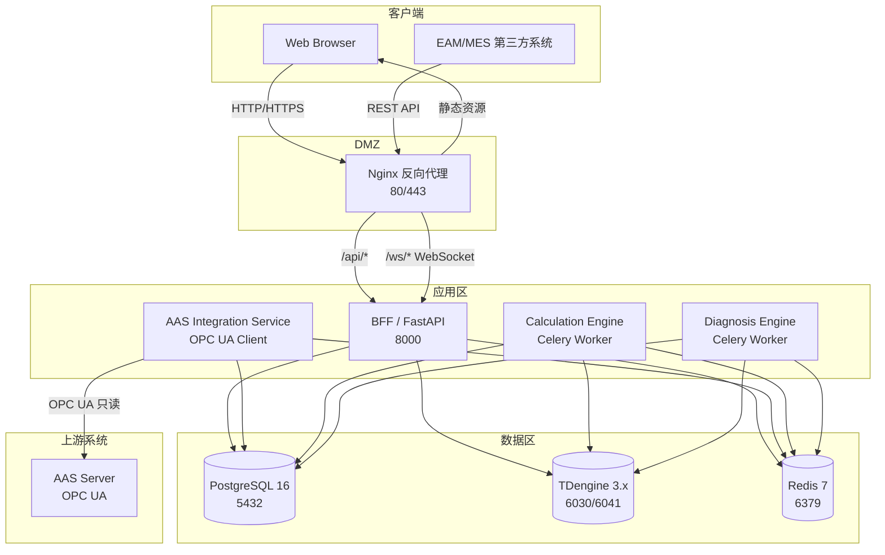

# CLPM 部署运维设计文档

**文档状态**: 正式版
**当前版本**: v1.0
**发布日期**: 2026-06-21
**设计依据**: PRD (v3.0)、ADS (v3.0)、技术栈选型补充 (v1.0)

---

## 1. 文档信息

### 1.1 文档目的

本文档定义 CLPM（Control Loop Performance Monitoring）系统的部署架构、环境准备、配置说明、日常运维、故障处理及版本更新流程，作为开发、测试、生产环境部署与运维的统一事实来源。

### 1.2 设计依据

| 文档 | 版本 | 用途 |
|---|---|---|
| PRD | v3.0 | 产品需求与功能边界 |
| ADS | v3.0 | 架构分层、服务划分、技术选型 |
| 技术栈选型补充 | v1.0 | 前后端框架、数据库、工具链选型 |

### 1.3 变更记录

| 版本 | 日期 | 变更说明 | 作者 |
|---|---|---|---|
| v1.0 | 2026-06-21 | 初始版本，覆盖环境/部署/配置/运维/故障/版本更新全流程 | 平台团队 |

---

## 2. 环境准备

### 2.1 硬件要求

针对开发、测试、生产三类环境，给出最低与推荐配置：

| 环境 | 角色 | CPU | 内存 | 磁盘 | 网络 | 说明 |
|---|---|---|---|---|---|---|
| 开发环境 | 单机本地开发 | 4 核 | 16 GB | 100 GB SSD | 千兆 | 使用 Orbstack 运行 PostgreSQL/TDengine/Redis 容器 |
| 测试环境 | 单机或 2 节点 | 8 核 | 32 GB | 200 GB SSD | 千兆 | 模拟生产部署，承载集成测试与压测 |
| 生产环境（轻量级） | 单机 Docker Compose | 16 核 | 32 GB | 500 GB SSD | 千兆 | ≤500 回路场景，POC 或小型工厂 |
| 生产环境（企业级） | K8s 集群 3+ 节点 | 16 核/节点 | 32 GB/节点 | 1 TB SSD/节点 | 万兆 | 1200+ 回路场景，HPA 自动扩缩容 |

> 磁盘需预留 30% 余量用于日志、临时文件与数据库 WAL。

### 2.2 软件依赖

| 组件 | 版本要求 | 用途 | 备注 |
|---|---|---|---|
| 操作系统 | Linux x86_64（Ubuntu 22.04 LTS / CentOS 7+ / Rocky Linux 9） | 服务器运行环境 | 内核 ≥ 5.15 |
| Orbstack | 最新稳定版（macOS） | 本地开发容器运行时 | 替代 Docker Desktop，I/O 性能更优 |
| Docker | 24.x+ | 容器运行时（生产） | 与 Docker Compose v2 配套 |
| Docker Compose | v2.20+ | 单机编排 | 轻量级部署 |
| Kubernetes | v1.28+ | 企业级编排 | 生产高可用 |
| Helm | v3.13+ | K8s 应用打包 | |
| Node.js | 20.x LTS | 前端构建 | pnpm 包管理 |
| pnpm | 9.x | 前端依赖管理 | |
| Python | 3.11+ | 后端运行时 | uv 管理依赖 |
| uv | 最新稳定版 | Python 依赖管理 | 替代 pip/poetry |
| PostgreSQL | 16.x | 关系型业务数据 | 主备/集群模式 |
| TDengine | 3.x | 时序数据存储 | 单机或集群 |
| Redis | 7.x | 缓存与消息队列 | |
| Nginx | 1.24+ | 反向代理与静态托管 | |

### 2.3 Orbstack 虚拟化环境

本地开发强制使用 Orbstack 作为容器运行环境，用于部署 PostgreSQL、TDengine、Redis 三类基础设施容器。

**优势**：
- 相比 Docker Desktop，文件系统 I/O 性能提升 3-5 倍
- 资源占用更低，启动速度更快
- 与 macOS 网络互通体验最佳，容器可直接通过 `localhost` 访问

**安装步骤**：
1. 从 https://orbstack.dev 下载 macOS 安装包
2. 拖拽安装到 Applications
3. 启动 Orbstack 并完成初始化
4. 验证：`docker version` 与 `docker compose version` 正常输出

**容器编排**：使用项目根目录的 `docker-compose.dev.yml`，一键拉起开发所需基础设施：

```bash
docker compose -f docker-compose.dev.yml up -d
```

### 2.4 网络要求

#### 端口清单

| 端口 | 协议 | 服务 | 方向 | 说明 |
|---|---|---|---|---|
| 80 | TCP | Nginx | 入站 | HTTP 前端入口（生产） |
| 443 | TCP | Nginx | 入站 | HTTPS 前端入口（生产） |
| 5173 | TCP | Vite Dev Server | 入站 | 前端开发服务器（仅开发环境） |
| 8000 | TCP | FastAPI | 入站 | 后端 API 服务 |
| 5432 | TCP | PostgreSQL | 内部 | 数据库连接（仅限内网） |
| 6030 | TCP | TDengine | 内部 | TDengine 原生协议端口 |
| 6041 | TCP | TDengine | 内部 | TDengine REST/WebSocket 端口 |
| 6379 | TCP | Redis | 内部 | 缓存与队列（仅限内网） |
| 9090 | TCP | Prometheus（可选） | 内部 | 监控指标采集 |
| 3000 | TCP | Grafana（可选） | 内部 | 监控可视化 |

#### 网络隔离原则

- **DMZ 区**：Nginx 反向代理对外暴露 80/443
- **应用区**：FastAPI 后端、前端构建产物仅在内网通信
- **数据区**：PostgreSQL、TDengine、Redis 严禁直接对外暴露，仅允许应用区访问
- **AAS 接入区**：AAS Integration Service 通过 OPC UA 协议单向只读访问 AAS，禁止反向写入

---

## 3. 部署架构

### 3.1 轻量级部署（Docker Compose）

适用于单机环境、POC 验证、500 回路以下的小型工厂。

**特点**：
- 单台 16C/32G 服务器一键拉起全套组件
- 编排简单，运维成本低
- 不具备高可用，单点故障即服务中断

**组件清单**：

| 容器 | 镜像 | 端口映射 | 数据卷 |
|---|---|---|---|
| postgres | postgres:16 | 5432:5432 | pg_data |
| tdengine | tdengine/tdengine:3.x | 6030:6030, 6041:6041 | td_data |
| redis | redis:7 | 6379:6379 | redis_data |
| backend | clpm-backend:latest | 8000:8000 | - |
| aas-integration | clpm-aas:latest | - | - |
| frontend | nginx:1.24 | 80:80 | - |

**编排文件**：项目根目录 `docker-compose.yml`，启动命令：

```bash
docker compose up -d
```

### 3.2 企业级部署（K8s）

适用于 1200+ 回路、多厂区中心化部署的生产场景。

**特点**：
- 微服务独立 Deployment，支持滚动更新与回滚
- Calculation Engine 与 Diagnosis Engine 配置 HPA，夜间批量计算高峰自动扩容
- 数据库采用主备/集群模式，保障数据高可用
- 配合 Ingress + Cert-Manager 自动管理 HTTPS 证书

**K8s 资源规划**：

| 命名空间 | 工作负载 | 副本数 | HPA | 资源配额 |
|---|---|---|---|---|
| clpm-prod | backend | 2 | 否 | 2C/4G ~ 4C/8G |
| clpm-prod | aas-integration | 1 | 否 | 1C/2G |
| clpm-prod | calculation-engine | 2 | 是（2~10） | 2C/4G ~ 8C/16G |
| clpm-prod | diagnosis-engine | 1 | 是（1~5） | 2C/4G ~ 4C/8G |
| clpm-prod | frontend (nginx) | 2 | 否 | 0.5C/512M |
| clpm-data | postgresql (主备) | 2 | 否 | 4C/16G |
| clpm-data | tdengine (集群) | 3 | 否 | 4C/16G |
| clpm-data | redis (主从) | 2 | 否 | 2C/4G |

**部署方式**：使用 Helm Chart 统一打包，命令：

```bash
helm install clpm ./deploy/helm/clpm -n clpm-prod -f values.prod.yaml
```

### 3.3 组件拓扑图



### 3.4 数据流向

系统数据流严格遵循单向只读原则，整体流向如下：

```text
AAS Server
    │ (OPC UA 单向只读)
    ▼
AAS Integration Service
    │ (定时同步 Tag 位号 + 实时采集时序数据)
    ├──► PostgreSQL (tag_registry 表)
    └──► TDengine (回路超级表，秒级时序数据)
                │
                ▼
        Calculation Engine
            │ (按节拍拉取时序数据，计算 KPI)
            ▼
        PostgreSQL (kpi_snapshot_hourly 快照表)
                │
                ▼
            BFF / FastAPI
                │ (聚合查询，提供 REST API)
                ▼
            Frontend (Vue 3 + ECharts)
```

**关键约束**：
- AAS → CLPM 为单向只读，CLPM 不得向 AAS 写入任何数据
- 时序数据仅在"计算引擎执行时"和"用户查询波形"时从 TDengine 提取
- 前端不直接访问 TDengine，所有时序数据通过 BFF 聚合后返回

---

## 4. 部署流程

### 4.1 数据库初始化

数据库初始化严格按以下顺序执行，避免外键依赖冲突。

#### 4.1.1 PostgreSQL 初始化

**步骤 1：创建数据库与用户**

```sql
CREATE DATABASE clpm_db ENCODING 'UTF8' LC_COLLATE 'en_US.UTF-8' LC_CTYPE 'en_US.UTF-8';
CREATE USER clpm_user WITH PASSWORD '<strong_password>';
GRANT ALL PRIVILEGES ON DATABASE clpm_db TO clpm_user;
```

**步骤 2：执行 Schema DDL 脚本**

按以下顺序执行（位于 `deploy/sql/postgresql/` 目录）：

| 顺序 | 脚本 | 说明 |
|---|---|---|
| 1 | `01_plant_node.sql` | 工厂层级表 |
| 2 | `02_tag_registry.sql` | AAS Tag 注册表 |
| 3 | `03_loop_ledger.sql` | 回路台账表 |
| 4 | `04_loop_tag_mapping.sql` | 回路-Tag 关联表 |
| 5 | `05_metric_config.sql` | 性能指标配置表 |
| 6 | `06_diagnosis_config.sql` | 诊断指标配置表 |
| 7 | `07_engine_rule.sql` | 引擎规则配置表 |
| 8 | `08_kpi_snapshot_hourly.sql` | KPI 快照表 |
| 9 | `09_diagnosis_result.sql` | 诊断结果表 |
| 10 | `10_action_tracker.sql` | 异常跟踪表 |
| 11 | `11_tuning_record.sql` | 整定记录表（Phase 2） |
| 12 | `12_report_record.sql` | 报表记录表 |
| 13 | `13_sys_audit_log.sql` | 审计日志表 |
| 14 | `14_sys_user_role.sql` | 用户与角色表 |

**步骤 3：执行 Seed 数据**

| 顺序 | 脚本 | 说明 |
|---|---|---|
| 1 | `seed_metric_config.sql` | 6 大核心 KPI 默认配置 |
| 2 | `seed_diagnosis_config.sql` | 诊断指标默认配置 |
| 3 | `seed_engine_rule.sql` | 引擎规则默认配置 |
| 4 | `seed_sys_role.sql` | 默认角色与权限 |
| 5 | `seed_admin_user.sql` | 初始管理员账号（首次登录强制改密） |

#### 4.1.2 TDengine 初始化

**步骤 1：创建数据库**

```sql
CREATE DATABASE clpm_tsdb PRECISION 'ms' KEEP 365 DURATION 10 BUFFER 16;
USE clpm_tsdb;
```

- `KEEP 365`：数据保留 365 天
- `DURATION 10`：每 10 天一个数据文件
- `BUFFER 16`：写入缓冲区 16MB

**步骤 2：创建超级表**

```sql
CREATE STABLE IF NOT EXISTS loop_telemetry (
    ts TIMESTAMP,
    pv DOUBLE,
    sp DOUBLE,
    op DOUBLE,
    mode INT,
    pid_p DOUBLE,
    pid_i DOUBLE,
    pid_d DOUBLE,
    pv_quality INT
) TAGS (
    loop_id BIGINT,
    loop_tag NCHAR(64),
    plant_node_id BIGINT
);
```

**步骤 3：回路创建时自动建子表**

回路台账创建后，由 Loop Management Service 自动执行：

```sql
CREATE TABLE IF NOT EXISTS loop_<loop_id> USING loop_telemetry TAGS (<loop_id>, '<loop_tag>', <plant_node_id>);
```

### 4.2 后端服务部署

后端基于 Python FastAPI，生产环境使用 Gunicorn + Uvicorn worker 提升并发能力。

**启动命令**：

```bash
gunicorn app.main:app \
    --workers 4 \
    --worker-class uvicorn.workers.UvicornWorker \
    --bind 0.0.0.0:8000 \
    --timeout 120 \
    --keep-alive 5 \
    --log-level info \
    --access-logfile /var/log/clpm/backend-access.log \
    --error-logfile /var/log/clpm/backend-error.log
```

**Worker 数量建议**：`(2 × CPU 核数) + 1`

**Dockerfile 关键内容**：

```dockerfile
FROM python:3.11-slim
WORKDIR /app
COPY pyproject.toml uv.lock ./
RUN pip install uv && uv sync --frozen --no-dev
COPY . .
EXPOSE 8000
CMD ["gunicorn", "app.main:app", "--workers", "4", "--worker-class", "uvicorn.workers.UvicornWorker", "--bind", "0.0.0.0:8000"]
```

**健康检查**：容器启动后 30 秒开始检查 `http://localhost:8000/health`，间隔 10 秒，失败 3 次重启。

### 4.3 前端部署

前端基于 Vue 3 + Vite 构建，构建产物由 Nginx 静态托管。

**构建步骤**：

```bash
pnpm install --frozen-lockfile
pnpm run build
```

构建产物位于 `dist/` 目录，包含：
- `index.html`
- `assets/`（JS/CSS/图片等静态资源）

**Nginx 静态托管配置**：

```nginx
server {
    listen 80;
    server_name clpm.example.com;
    root /usr/share/nginx/html;
    index index.html;

    location / {
        try_files $uri $uri/ /index.html;
    }

    location /assets/ {
        expires 30d;
        add_header Cache-Control "public, immutable";
    }
}
```

**Dockerfile 关键内容**（多阶段构建）：

```dockerfile
FROM node:20-slim AS builder
WORKDIR /app
COPY package.json pnpm-lock.yaml ./
RUN npm install -g pnpm && pnpm install --frozen-lockfile
COPY . .
RUN pnpm run build

FROM nginx:1.24
COPY --from=builder /app/dist /usr/share/nginx/html
COPY deploy/nginx/nginx.conf /etc/nginx/conf.d/default.conf
EXPOSE 80
```

### 4.4 AAS Integration Service 部署

AAS Integration Service 为 Python 定时任务服务，内嵌 OPC UA 客户端，负责从 AAS 同步 Tag 位号信息与采集时序数据。

**职责**：
- 定时（默认 5 分钟）从 AAS 同步 Tag 注册表到 PostgreSQL `tag_registry` 表
- 持续（秒级）从 AAS 采集 OPC Tag 实时值，写入 TDengine
- 断线重连与增量同步，失败保留上一周期数据并告警

**启动命令**：

```bash
python -m app.aas_integration.main \
    --config /etc/clpm/aas-config.yaml \
    --log-level info
```

**Dockerfile 关键内容**：

```dockerfile
FROM python:3.11-slim
WORKDIR /app
COPY pyproject.toml uv.lock ./
RUN pip install uv && uv sync --frozen --no-dev
COPY . .
CMD ["python", "-m", "app.aas_integration.main", "--config", "/etc/clpm/aas-config.yaml"]
```

**配置文件示例**（`aas-config.yaml`）：

```yaml
aas:
  endpoint: opc.tcp://aas-server:4840
  username: ${AAS_USER}
  password: ${AAS_PASSWORD}
  security_policy: Basic256Sha256
  sync_interval_seconds: 300
  collect_interval_ms: 1000
  reconnect_backoff_seconds: 5
  max_reconnect_attempts: 10

tdengine:
  host: tdengine
  port: 6030
  database: clpm_tsdb
  user: ${TDENGINE_USER}
  password: ${TDENGINE_PASSWORD}

postgresql:
  host: postgresql
  port: 5432
  database: clpm_db
  user: ${PG_USER}
  password: ${PG_PASSWORD}
```

### 4.5 Nginx 反向代理配置

Nginx 承担前端路由、API 代理、WebSocket 代理三类职责。

**完整配置示例**：

```nginx
upstream backend {
    server backend:8000;
    keepalive 32;
}

server {
    listen 80;
    server_name clpm.example.com;

    # HTTP 强制跳转 HTTPS（生产环境）
    return 301 https://$host$request_uri;
}

server {
    listen 443 ssl http2;
    server_name clpm.example.com;

    ssl_certificate     /etc/nginx/ssl/clpm.crt;
    ssl_certificate_key /etc/nginx/ssl/clpm.key;
    ssl_protocols       TLSv1.2 TLSv1.3;
    ssl_ciphers         HIGH:!aNULL:!MD5;

    # 前端静态资源
    root /usr/share/nginx/html;
    index index.html;

    location / {
        try_files $uri $uri/ /index.html;
    }

    location /assets/ {
        expires 30d;
        add_header Cache-Control "public, immutable";
    }

    # API 代理
    location /api/ {
        proxy_pass http://backend;
        proxy_set_header Host $host;
        proxy_set_header X-Real-IP $remote_addr;
        proxy_set_header X-Forwarded-For $proxy_add_x_forwarded_for;
        proxy_set_header X-Forwarded-Proto $scheme;
        proxy_connect_timeout 10s;
        proxy_read_timeout 120s;
        proxy_send_timeout 30s;
    }

    # WebSocket 代理（实时波形推送、任务进度）
    location /ws/ {
        proxy_pass http://backend;
        proxy_http_version 1.1;
        proxy_set_header Upgrade $http_upgrade;
        proxy_set_header Connection "upgrade";
        proxy_set_header Host $host;
        proxy_read_timeout 3600s;
        proxy_send_timeout 3600s;
    }

    # 文件下载（报表 PDF）
    location /files/ {
        proxy_pass http://backend;
        proxy_set_header Host $host;
        proxy_set_header X-Real-IP $remote_addr;
    }

    # 健康检查端点
    location /health {
        access_log off;
        return 200 "ok\n";
    }
}
```

---

## 5. 配置说明

### 5.1 环境变量清单

所有环境变量统一通过 `.env` 文件或 K8s ConfigMap/Secret 注入，禁止硬编码。

#### 5.1.1 数据库连接

| 变量名 | 说明 | 示例值 | 必填 |
|---|---|---|---|
| `PG_HOST` | PostgreSQL 主机 | postgresql | 是 |
| `PG_PORT` | PostgreSQL 端口 | 5432 | 是 |
| `PG_DATABASE` | 数据库名 | clpm_db | 是 |
| `PG_USER` | 用户名 | clpm_user | 是 |
| `PG_PASSWORD` | 密码 | `<strong_password>` | 是 |
| `PG_POOL_SIZE` | 连接池大小 | 20 | 否 |
| `PG_POOL_MAX_OVERFLOW` | 连接池溢出上限 | 10 | 否 |
| `PG_POOL_TIMEOUT` | 获取连接超时（秒） | 30 | 否 |
| `TDENGINE_HOST` | TDengine 主机 | tdengine | 是 |
| `TDENGINE_PORT` | TDengine 端口 | 6030 | 是 |
| `TDENGINE_DATABASE` | 数据库名 | clpm_tsdb | 是 |
| `TDENGINE_USER` | 用户名 | root | 是 |
| `TDENGINE_PASSWORD` | 密码 | `<strong_password>` | 是 |

#### 5.1.2 Redis 配置

| 变量名 | 说明 | 示例值 | 必填 |
|---|---|---|---|
| `REDIS_HOST` | Redis 主机 | redis | 是 |
| `REDIS_PORT` | Redis 端口 | 6379 | 是 |
| `REDIS_PASSWORD` | Redis 密码 | `<strong_password>` | 是 |
| `REDIS_DB` | 数据库编号 | 0 | 否 |

#### 5.1.3 JWT 与认证

| 变量名 | 说明 | 示例值 | 必填 |
|---|---|---|---|
| `JWT_SECRET_KEY` | JWT 签名密钥 | `<64位随机字符串>` | 是 |
| `JWT_ALGORITHM` | JWT 算法 | HS256 | 是 |
| `JWT_ACCESS_TOKEN_EXPIRE_MINUTES` | Access Token 有效期（分钟） | 60 | 是 |
| `JWT_REFRESH_TOKEN_EXPIRE_DAYS` | Refresh Token 有效期（天） | 7 | 是 |
| `PASSWORD_HASH_SCHEME` | 密码哈希算法 | bcrypt | 是 |

#### 5.1.4 AAS 连接

| 变量名 | 说明 | 示例值 | 必填 |
|---|---|---|---|
| `AAS_ENDPOINT` | AAS OPC UA 端点 | opc.tcp://aas-server:4840 | 是 |
| `AAS_USER` | AAS 用户名 | clpm_reader | 是 |
| `AAS_PASSWORD` | AAS 密码 | `<strong_password>` | 是 |
| `AAS_SECURITY_POLICY` | 安全策略 | Basic256Sha256 | 是 |
| `AAS_SYNC_INTERVAL_SECONDS` | Tag 同步间隔（秒） | 300 | 否 |
| `AAS_COLLECT_INTERVAL_MS` | 数据采集间隔（毫秒） | 1000 | 否 |

#### 5.1.5 应用与日志

| 变量名 | 说明 | 示例值 | 必填 |
|---|---|---|---|
| `APP_ENV` | 运行环境 | dev/test/prod | 是 |
| `APP_NAME` | 应用名 | clpm | 是 |
| `LOG_LEVEL` | 日志级别 | DEBUG/INFO/WARNING/ERROR | 是 |
| `LOG_FORMAT` | 日志格式 | json/text | 是 |
| `LOG_DIR` | 日志目录 | /var/log/clpm | 是 |
| `SENTRY_DSN` | Sentry 错误上报 DSN（可选） | https://xxx@sentry.io/xxx | 否 |

### 5.2 数据库配置

#### 5.2.1 PostgreSQL 连接池

| 参数 | 开发环境 | 测试环境 | 生产环境 |
|---|---|---|---|
| `pool_size` | 5 | 10 | 20 |
| `max_overflow` | 5 | 10 | 10 |
| `pool_timeout` | 30s | 30s | 30s |
| `pool_recycle` | 3600s | 3600s | 1800s |
| `pool_pre_ping` | true | true | true |

#### 5.2.2 TDengine 配置

| 参数 | 值 | 说明 |
|---|---|---|
| `KEEP` | 365 | 数据保留 365 天 |
| `DURATION` | 10 | 每 10 天一个数据文件 |
| `BUFFER` | 16 | 写入缓冲区 16MB |
| `CACHE` | 100 | 内存块缓存数 |
| `MAX_SQL_LENGTH` | 1048576 | 单条 SQL 最大长度 1MB |

#### 5.2.3 数据留存策略

| 数据类别 | 存储位置 | 留存周期 | 归档策略 |
|---|---|---|---|
| 时序原始数据 | TDengine | 365 天 | 超期自动删除 |
| KPI 快照（小时） | PostgreSQL | 2 年 | 2 年后归档至冷存储 |
| KPI 快照（日） | PostgreSQL | 5 年 | 5 年后归档至冷存储 |
| 诊断结果 | PostgreSQL | 3 年 | 3 年后归档 |
| 审计日志 | PostgreSQL | 永久 | 不删除 |
| 报表 PDF | 对象存储 | 5 年 | 5 年后删除 |

### 5.3 Redis 配置

#### 5.3.1 缓存策略

| 缓存键前缀 | 用途 | TTL | 失效策略 |
|---|---|---|---|
| `clpm:dashboard:*` | 工作台聚合数据 | 60s | 定时刷新 |
| `clpm:loop:detail:*` | 回路详情 | 300s | 配置变更主动失效 |
| `clpm:kpi:ranking:*` | 低效回路排行 | 120s | 定时刷新 |
| `clpm:metric:config:*` | 性能指标配置 | 600s | 配置变更主动失效 |
| `clpm:diagnosis:config:*` | 诊断指标配置 | 600s | 配置变更主动失效 |

#### 5.3.2 会话管理

| 参数 | 值 | 说明 |
|---|---|---|
| 会话存储 | Redis | 分布式会话 |
| Session TTL | 24 小时 | 滑动过期 |
| 并发登录限制 | 同一账号最多 3 个会话 | 超出踢出最早会话 |

#### 5.3.3 任务队列

| 队列名 | 用途 | 并发 Worker | 优先级 |
|---|---|---|---|
| `clpm:queue:metric` | 性能指标计算 | 10 | 高 |
| `clpm:queue:diagnosis` | 诊断任务 | 5 | 中 |
| `clpm:queue:report` | 报表生成 | 2 | 低 |
| `clpm:queue:aas_sync` | AAS 同步 | 1 | 高 |

### 5.4 日志配置

#### 5.4.1 日志级别

| 环境 | 默认级别 | 模块级别覆盖 |
|---|---|---|
| 开发 | DEBUG | - |
| 测试 | INFO | - |
| 生产 | INFO | `app.aas_integration=WARNING`、`uvicorn.access=WARNING` |

#### 5.4.2 日志格式

**JSON 格式（生产）**：

```json
{
    "timestamp": "2026-06-21T10:30:00.000+08:00",
    "level": "INFO",
    "logger": "app.api.loop",
    "message": "Loop created",
    "loop_id": 1024,
    "user_id": "u_001",
    "request_id": "req_abc123",
    "duration_ms": 45
}
```

**文本格式（开发）**：

```text
2026-06-21 10:30:00 INFO     app.api.loop       Loop created loop_id=1024 user_id=u_001 duration_ms=45
```

#### 5.4.3 日志轮转

| 配置项 | 值 |
|---|---|
| 轮转方式 | 按大小 + 按天 |
| 单文件最大 | 100 MB |
| 保留天数 | 30 天 |
| 压缩 | 超过 7 天的日志 gzip 压缩 |
| 路径 | `/var/log/clpm/<service>/<service>-YYYYMMDD.log` |

#### 5.4.4 日志收集

生产环境推荐使用 ELK/Loki + Promtail 收集容器日志：

- 每个容器 stdout/stderr 输出 JSON 日志
- Promtail 采集容器日志并转发至 Loki
- Grafana 中查询与分析

---

## 6. 日常运维

### 6.1 健康检查

#### 6.1.1 健康检查端点

| 组件 | 端点 | 检查内容 | 预期响应 |
|---|---|---|---|
| Frontend (Nginx) | `GET /health` | Nginx 进程存活 | `200 ok` |
| Backend (FastAPI) | `GET /api/health` | 应用 + DB + Redis 连通性 | `200 {"status":"healthy","db":"ok","redis":"ok"}` |
| Backend (FastAPI) | `GET /api/health/ready` | 就绪检查（依赖全部就绪） | `200` |
| Backend (FastAPI) | `GET /api/health/live` | 存活检查（进程存活） | `200` |
| AAS Integration | `GET /api/aas/health` | OPC UA 连接状态 + 最近同步时间 | `200 {"opcua":"connected","last_sync":"..."}` |
| PostgreSQL | `pg_isready -h <host> -p 5432` | 数据库就绪 | `accepting connections` |
| TDengine | `GET http://<host>:6041/rest/health` | 时序库就绪 | `200 {"status":"succ"}` |
| Redis | `redis-cli -h <host> -p 6379 ping` | 缓存就绪 | `PONG` |

#### 6.1.2 K8s 探针配置

```yaml
livenessProbe:
  httpGet:
    path: /api/health/live
    port: 8000
  initialDelaySeconds: 30
  periodSeconds: 10
  failureThreshold: 3

readinessProbe:
  httpGet:
    path: /api/health/ready
    port: 8000
  initialDelaySeconds: 10
  periodSeconds: 5
  failureThreshold: 3
```

### 6.2 数据库备份

#### 6.2.1 PostgreSQL 备份

**备份方式**：`pg_dump` 全量逻辑备份

**备份脚本**：

```bash
#!/bin/bash
BACKUP_DIR=/data/backup/postgresql
DATE=$(date +%Y%m%d_%H%M%S)
pg_dump -h postgresql -U clpm_user -d clpm_db -F c -f ${BACKUP_DIR}/clpm_db_${DATE}.dump
find ${BACKUP_DIR} -name "clpm_db_*.dump" -mtime +30 -delete
```

**频率与保留**：

| 备份类型 | 频率 | 保留时长 | 存储位置 |
|---|---|---|---|
| 全量备份 | 每日 02:00 | 30 天 | 本地 + 异地 |
| 增量备份（WAL 归档） | 实时 | 7 天 | 本地 + 异地 |
| 月度备份 | 每月 1 日 02:00 | 12 个月 | 异地存储 |

**恢复流程**：

```bash
# 1. 停止后端服务
docker compose stop backend

# 2. 恢复数据库
pg_restore -h postgresql -U clpm_user -d clpm_db -c /data/backup/postgresql/clpm_db_20260621_020000.dump

# 3. 启动后端服务
docker compose start backend
```

#### 6.2.2 TDengine 备份

**备份方式**：`taosdump` 工具

**备份脚本**：

```bash
#!/bin/bash
BACKUP_DIR=/data/backup/tdengine
DATE=$(date +%Y%m%d_%H%M%S)
taosdump -h tdengine -P 6030 -u root -p <password> -D clpm_tsdb -o ${BACKUP_DIR}/clpm_tsdb_${DATE}
find ${BACKUP_DIR} -name "clpm_tsdb_*" -type d -mtime +7 -exec rm -rf {} \;
```

**频率与保留**：

| 备份类型 | 频率 | 保留时长 | 说明 |
|---|---|---|---|
| 全量备份 | 每日 03:00 | 7 天 | 时序数据量大，保留期较短 |
| Schema 备份 | 每周一次 | 90 天 | 仅超级表结构 |

**恢复流程**：

```bash
# 恢复时序数据
taosdump -h tdengine -P 6030 -u root -p <password> -i /data/backup/tdengine/clpm_tsdb_20260621_030000
```

### 6.3 日志查看与排查

#### 6.3.1 日志查看命令

**Docker Compose 环境**：

```bash
# 查看所有服务日志
docker compose logs -f

# 查看指定服务最近 100 行
docker compose logs -f --tail 100 backend

# 查看指定时间段的日志
docker compose logs --since "2026-06-21T10:00:00" --until "2026-06-21T11:00:00" backend
```

**K8s 环境**：

```bash
# 查看 Pod 日志
kubectl logs -n clpm-prod -l app=backend -f --tail 100

# 查看指定 Pod 日志
kubectl logs -n clpm-prod <pod-name> -c backend

# 查看前一个容器的日志（崩溃后）
kubectl logs -n clpm-prod <pod-name> --previous
```

#### 6.3.2 排查思路

| 现象 | 排查步骤 |
|---|---|
| 接口响应慢 | 1. 查看 backend 日志中 `duration_ms` 字段<br/>2. 检查 PostgreSQL 慢查询日志<br/>3. 检查 Redis 缓存命中率<br/>4. 检查 TDengine 查询耗时 |
| 接口报错 500 | 1. 查看 backend error 日志<br/>2. 检查数据库连接池是否耗尽<br/>3. 检查依赖服务（PG/TD/Redis）连通性 |
| 前端白屏 | 1. 浏览器控制台查看 JS 错误<br/>2. 检查 Nginx 静态资源是否可访问<br/>3. 检查前端构建产物是否完整 |
| AAS 同步中断 | 1. 查看 aas-integration 日志<br/>2. 检查 AAS Server 网络连通性<br/>3. 检查 OPC UA 连接状态 |

### 6.4 性能监控

#### 6.4.1 关键指标

| 指标类别 | 指标名 | 阈值（告警） | 说明 |
|---|---|---|---|
| API 性能 | QPS | > 1000 | 每秒请求数 |
| API 性能 | P95 响应时间 | > 500ms | 95 分位响应时间 |
| API 性能 | P99 响应时间 | > 1000ms | 99 分位响应时间 |
| API 性能 | 错误率 | > 1% | 5xx 错误占比 |
| 数据库 | PG 连接数 | > 80% 连接池 | 连接池使用率 |
| 数据库 | PG 慢查询数 | > 10/min | 超过 1s 的查询 |
| 数据库 | TDengine 写入延迟 | > 100ms | 单条写入耗时 |
| 缓存 | Redis 内存使用 | > 80% | 内存占用 |
| 缓存 | 缓存命中率 | < 80% | 命中率下降告警 |
| 计算 | 任务队列积压 | > 1000 | 待处理任务数 |
| 计算 | 任务失败率 | > 5% | 失败任务占比 |
| 系统 | CPU 使用率 | > 80% | 持续 5 分钟 |
| 系统 | 内存使用率 | > 85% | 持续 5 分钟 |
| 系统 | 磁盘使用率 | > 80% | 需立即处理 |

#### 6.4.2 监控方案

推荐使用 Prometheus + Grafana 监控体系：

- **Prometheus**：采集 FastAPI `/metrics` 端点（使用 `prometheus-fastapi-instrumentator`）
- **node-exporter**：采集主机 CPU/内存/磁盘指标
- **postgres-exporter**：采集 PostgreSQL 指标
- **redis-exporter**：采集 Redis 指标
- **Grafana**：可视化仪表盘，预设 CLPM 监控面板

### 6.5 证书管理

#### 6.5.1 HTTPS 证书

**K8s 环境**：使用 cert-manager + Let's Encrypt 自动签发与续期

```yaml
apiVersion: cert-manager.io/v1
kind: Certificate
metadata:
  name: clpm-tls
  namespace: clpm-prod
spec:
  secretName: clpm-tls
  dnsNames:
    - clpm.example.com
  issuerRef:
    name: letsencrypt-prod
    kind: ClusterIssuer
```

**Docker Compose 环境**：手动管理证书

- 证书存放于 `/etc/nginx/ssl/` 目录
- 使用 `certbot` 自动续期：

```bash
certbot renew --quiet --post-hook "docker compose restart nginx"
```

#### 6.5.2 证书到期检查

- 监控证书剩余天数，30 天前告警
- 自动续期失败时人工介入

---

## 7. 故障处理

### 7.1 常见故障与处理

#### 7.1.1 数据库连接失败

**现象**：后端日志报 `psycopg.OperationalError: could not connect to server`

**排查与处理**：

1. 检查 PostgreSQL 容器/Pod 状态：`docker ps` / `kubectl get pods -n clpm-data`
2. 检查 PostgreSQL 进程：`pg_isready -h <host> -p 5432`
3. 检查连接数是否耗尽：`SELECT count(*) FROM pg_stat_activity;`
4. 检查网络连通性：`telnet <host> 5432`
5. 若连接数耗尽，重启后端服务释放连接，并调大 `PG_POOL_SIZE`
6. 若数据库宕机，从备份恢复（见 7.3 数据恢复流程）

#### 7.1.2 AAS 同步中断

**现象**：AAS Integration Service 日志报 `OPC UA connection failed`，回路监控页面显示"最后同步时间"停滞

**排查与处理**：

1. 检查 AAS Server 网络连通性：`telnet <aas-host> 4840`
2. 检查 AAS Server 服务状态（联系 AAS 运维团队）
3. 检查 OPC UA 凭证是否过期
4. 服务具备断线重连能力，网络恢复后自动重连
5. 同步中断期间，回路监控页面读取上一周期有效数据，不阻塞前端
6. 持续中断超过 30 分钟，触发告警通知运维

#### 7.1.3 前端白屏

**现象**：浏览器打开页面空白，控制台报 JS 错误

**排查与处理**：

1. 检查浏览器控制台错误信息
2. 检查 Nginx 静态资源是否可访问：`curl -I https://clpm.example.com/index.html`
3. 检查前端构建产物是否完整：`ls /usr/share/nginx/html/assets/`
4. 若资源 404，重新构建前端镜像并部署
5. 若 JS 运行时错误，回滚至上一个稳定版本

#### 7.1.4 性能下降

**现象**：接口响应时间明显变长，用户反馈卡顿

**排查与处理**：

1. 查看 Grafana 监控面板，定位瓶颈组件
2. 检查 PostgreSQL 慢查询：`SELECT * FROM pg_stat_statements ORDER BY mean_exec_time DESC LIMIT 10;`
3. 检查 Redis 缓存命中率，若低于 80% 排查缓存失效原因
4. 检查 TDengine 查询是否触发全表扫描，必要时添加索引或优化查询
5. 检查计算任务队列积压情况，必要时临时扩容 Worker
6. 检查服务器 CPU/内存/磁盘 IO 是否达到瓶颈

### 7.2 应急联系与升级流程

#### 7.2.1 应急联系矩阵

| 角色 | 职责 | 联系方式 | 响应时效 |
|---|---|---|---|
| 一线运维 | 监控告警响应、基础故障处理 | 电话/IM 群 | 5 分钟内 |
| 后端开发 | 后端服务故障排查与修复 | 电话/IM 群 | 15 分钟内 |
| 前端开发 | 前端故障排查与修复 | 电话/IM 群 | 15 分钟内 |
| DBA | 数据库故障与性能优化 | 电话/IM 群 | 15 分钟内 |
| 架构师 | 重大架构问题决策 | 电话/IM 群 | 30 分钟内 |
| AAS 运维 | AAS Server 故障协同处理 | 电话/IM 群 | 30 分钟内 |

#### 7.2.2 升级流程

```text
告警触发
    │
    ▼
一线运维响应（5 分钟内）
    │
    ├── 可处理 → 处理并记录
    │
    └── 无法处理 → 升级至二线（后端/前端/DBA，15 分钟内）
                        │
                        ├── 可处理 → 处理并记录
                        │
                        └── 无法处理 → 升级至架构师（30 分钟内）
                                          │
                                          ├── 重大故障 → 启动应急响应
                                          │
                                          └── 处理并复盘
```

#### 7.2.3 故障等级定义

| 等级 | 定义 | 响应时效 | 处理时效 |
|---|---|---|---|
| P0 | 系统完全不可用 | 5 分钟 | 1 小时内恢复 |
| P1 | 核心功能不可用（评估/诊断/监控） | 15 分钟 | 4 小时内恢复 |
| P2 | 部分功能异常，有规避方案 | 30 分钟 | 1 个工作日内恢复 |
| P3 | 非核心功能异常 | 4 小时 | 3 个工作日内恢复 |

### 7.3 数据恢复流程

#### 7.3.1 PostgreSQL 恢复

**场景**：数据误删、数据库损坏

**步骤**：

1. 确认故障范围与时间点
2. 停止后端服务：`docker compose stop backend`
3. 选择合适的备份文件（故障时间点之前最近的全量备份 + WAL 归档）
4. 恢复数据库：

   ```bash
   pg_restore -h postgresql -U clpm_user -d clpm_db -c /data/backup/postgresql/clpm_db_<date>.dump
   ```

5. 若需恢复至特定时间点（PITR），使用 WAL 归档：

   ```bash
   # 恢复至 2026-06-21 10:30:00
   recover_target_time = '2026-06-21 10:30:00+08'
   ```

6. 验证数据完整性
7. 启动后端服务：`docker compose start backend`
8. 通知用户并记录故障报告

#### 7.3.2 TDengine 恢复

**场景**：时序数据丢失、数据库损坏

**步骤**：

1. 停止 AAS Integration Service 与 Calculation Engine
2. 恢复时序数据：

   ```bash
   taosdump -h tdengine -P 6030 -u root -p <password> -i /data/backup/tdengine/clpm_tsdb_<date>
   ```

3. 验证数据完整性（抽样查询回路数据）
4. 启动 AAS Integration Service 与 Calculation Engine
5. 触发一次全量回补计算（Backfill），填补备份时间点至当前的数据缺口

#### 7.3.3 恢复演练

- 每季度执行一次数据恢复演练
- 验证备份文件可用性与恢复时效
- 记录演练报告并优化恢复流程

---

## 8. 版本更新

### 8.1 滚动更新流程（K8s）

K8s 环境采用 Rolling Update 策略，确保更新过程零停机。

**Deployment 滚动更新配置**：

```yaml
strategy:
  type: RollingUpdate
  rollingUpdate:
    maxSurge: 1
    maxUnavailable: 0
```

**更新流程**：

1. 构建新版本镜像并推送至镜像仓库
2. 更新 Helm Chart 的 `image.tag`
3. 执行滚动更新：

   ```bash
   helm upgrade clpm ./deploy/helm/clpm -n clpm-prod -f values.prod.yaml
   ```

4. 监控滚动更新进度：

   ```bash
   kubectl rollout status deployment/backend -n clpm-prod
   ```

5. 验证新版本健康状态
6. 若异常，执行回滚（见 8.3 回滚策略）

**更新顺序**（避免兼容性问题）：

```text
1. 数据库迁移（Schema 变更）
2. 后端服务（backend）
3. AAS Integration Service
4. Calculation Engine / Diagnosis Engine
5. 前端（frontend）
```

### 8.2 数据库迁移

采用 Alembic（SQLAlchemy 配套工具）管理 PostgreSQL Schema 版本，确保迁移可追溯、可回滚。

#### 8.2.1 迁移流程

1. 开发阶段修改 SQLAlchemy 模型
2. 自动生成迁移脚本：

   ```bash
   alembic revision --autogenerate -m "add xxx table"
   ```

3. 人工审查迁移脚本（自动生成可能遗漏约束）
4. 测试环境执行迁移：

   ```bash
   alembic upgrade head
   ```

5. 生产环境部署时，在应用启动前执行迁移

#### 8.2.2 迁移规范

| 规范 | 说明 |
|---|---|
| 向后兼容 | 迁移脚本必须向后兼容，旧版本应用在新 Schema 上仍可运行 |
| 分步执行 | 大表 DDL 拆分为多个步骤，避免锁表时间过长 |
| 数据迁移 | Schema 变更与数据迁移分离，先加字段，后填数据，最后删旧字段 |
| 回滚脚本 | 每个迁移脚本必须提供 `downgrade` 函数 |
| 备份前置 | 生产环境执行迁移前必须先备份数据库 |

#### 8.2.3 TDengine Schema 变更

TDengine 超级表字段变更需特别注意：

- 新增字段：`ALTER STABLE loop_telemetry ADD COLUMN new_field DOUBLE;`
- 删除字段：`ALTER STABLE loop_telemetry DROP COLUMN new_field;`
- 修改字段：不支持直接修改，需新增字段 + 数据迁移 + 删除旧字段

### 8.3 回滚策略

#### 8.3.1 K8s 回滚

**应用层回滚**：

```bash
# 查看发布历史
kubectl rollout history deployment/backend -n clpm-prod

# 回滚至上一版本
kubectl rollout undo deployment/backend -n clpm-prod

# 回滚至指定版本
kubectl rollout undo deployment/backend -n clpm-prod --to-revision=3
```

**Helm 回滚**：

```bash
helm history clpm -n clpm-prod
helm rollback clpm <revision> -n clpm-prod
```

#### 8.3.2 数据库回滚

```bash
# 回滚至上一个迁移版本
alembic downgrade -1

# 回滚至指定版本
alembic downgrade <revision_id>

# 回滚至初始状态（慎用）
alembic downgrade base
```

> 数据库回滚需谨慎，涉及数据删除的迁移不可逆。生产环境回滚前必须备份。

#### 8.3.3 回滚决策

| 场景 | 回滚策略 |
|---|---|
| 应用 Bug 导致功能异常 | 仅回滚应用层，数据库不变 |
| 数据库迁移导致问题 | 回滚应用 + 回滚数据库迁移 |
| 重大故障无法快速修复 | 整体回滚至上一稳定版本 |

### 8.4 灰度发布

#### 8.4.1 灰度策略

采用 K8s 的 Canary 发布能力，逐步将流量切换至新版本。

**方案一：基于副本数的灰度**

```yaml
# 新版本 Deployment 副本数从 1 逐步增加
spec:
  replicas: 1  # 初始 1 个副本，占总流量 25%
```

**方案二：基于 Service Mesh 的流量切分（Istio）**

```yaml
# 10% 流量至新版本
apiVersion: networking.istio.io/v1
kind: VirtualService
spec:
  http:
    - route:
        - destination:
            host: backend
            subset: stable
          weight: 90
        - destination:
            host: backend
            subset: canary
          weight: 10
```

#### 8.4.2 灰度流程

```text
1. 新版本部署至灰度环境（10% 流量）
        │
        ▼
2. 监控灰度版本指标（错误率/响应时间/业务指标）
        │
        ├── 指标正常 → 逐步扩大流量（30% → 50% → 100%）
        │
        └── 指标异常 → 立即回滚至稳定版本
```

#### 8.4.3 灰度观察指标

| 指标 | 正常范围 | 异常处理 |
|---|---|---|
| 错误率 | < 0.5% | > 1% 立即回滚 |
| P95 响应时间 | < 500ms | > 800ms 暂停灰度 |
| 业务指标（KPI 计算成功率） | > 99% | < 95% 立即回滚 |
| 用户反馈 | 无异常 | 重大投诉立即回滚 |

#### 8.4.4 灰度发布检查清单

- [ ] 灰度版本镜像已通过测试环境验证
- [ ] 数据库迁移已执行且向后兼容
- [ ] 监控仪表盘已就绪
- [ ] 回滚预案已准备
- [ ] 灰度观察期 ≥ 2 小时
- [ ] 灰度期间有专人值守

---

## 附录

### A. 常用运维命令速查

```bash
# 查看服务状态
docker compose ps
kubectl get pods -n clpm-prod

# 查看服务日志
docker compose logs -f backend
kubectl logs -f -n clpm-prod -l app=backend

# 进入容器
docker compose exec backend bash
kubectl exec -it -n clpm-prod <pod> -- bash

# 重启服务
docker compose restart backend
kubectl rollout restart deployment/backend -n clpm-prod

# 数据库连接
docker compose exec postgresql psql -U clpm_user -d clpm_db
kubectl exec -it -n clpm-data <pg-pod> -- psql -U clpm_user -d clpm_db

# Redis 连接
docker compose exec redis redis-cli
kubectl exec -it -n clpm-data <redis-pod> -- redis-cli

# TDengine 连接
docker compose exec tdengine taos
kubectl exec -it -n clpm-data <td-pod> -- taos
```

### B. 参考资料

- PRD v3.0：产品需求与功能边界
- ADS v3.0：架构分层、服务划分、技术选型
- 技术栈选型补充 v1.0：前后端框架与工具链选型
- PostgreSQL 官方文档：https://www.postgresql.org/docs/16/
- TDengine 官方文档：https://docs.taosdata.com/
- FastAPI 官方文档：https://fastapi.tiangolo.com/
- Kubernetes 官方文档：https://kubernetes.io/docs/
