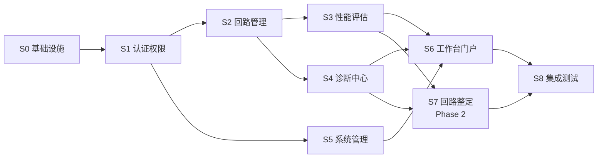

# CLPM 开发任务清单（开发总纲）

**文档状态**: 正式版
**当前版本**: v1.0
**发布日期**: 2026-06-21
**设计依据**: PRD (v3.0)、FDS (v3.0)、ADS (v3.0)、DDS (v3.0)、IDS (v3.1)、UI/UX (v4.0)、部署运维设计 (v1.0)、技术栈选型补充 (v1.0)

---

## 0. 文档目的与定位

本文档是 CLPM 系统正式开发与测试阶段的**总纲性文件**，对前后端开发任务进行完整分解，明确依赖关系与软件工程最佳实践，并强制要求每个任务**显式引用并遵循**前序设计与原型成果。

### 0.1 强制引用的设计基线

| 编号 | 文档 | 版本 | 路径 | 用途 |
|---|---|---|---|---|
| D01 | PRD | v3.0 | `docs/设计文档/01-PRD/PRD.md` | 产品需求与功能边界、5 类用户角色、6 大模块 + 1 门户 |
| D02 | FDS | v3.0 | `docs/设计文档/02-FDS/FDS.md` | 功能规格、字段、交互、状态机、异常分支 |
| D03 | ADS | v3.0 | `docs/设计文档/03-ADS/ADS.md` | 架构分层、服务划分、技术选型基线 |
| D04 | DDS | v3.0 | `docs/设计文档/04-DDS/DDS.md` | 数据模型、表结构、字段约束 |
| D05 | IDS | v3.1 | `docs/设计文档/05-IDS/IDS.md` | API 契约、认证授权 API、统一响应规范、错误码 |
| D06 | UI/UX | v4.0 | `docs/设计文档/06-UIUX/ui-ux-design-guidelines.md` | 视觉系统、组件规范、25 页面设计、交互模式 |
| D07 | 部署运维 | v1.0 | `docs/设计文档/07-DEPLOYMENT/部署运维设计.md` | 环境准备、部署架构、配置说明、运维流程 |
| D08 | 技术栈 | v1.0 | `docs/设计文档/08-TECHSTACK/技术栈选型补充.md` | 前后端、数据库、工具链最终选型 |
| D09 | PostgreSQL DDL | v3.0 | `db/postgresql/01_schema.sql` | 14 张表 + 20 索引 + 14 CHECK 约束 |
| D10 | PostgreSQL 种子数据 | v1.0 | `db/postgresql/02_seed_data.sql` | 5 用户 + 9 节点 + 6 KPI + 7 诊断 + 3 引擎 + 3 回路 + 18 Tag |
| D11 | TDengine DDL | v1.0 | `db/tdengine/01_supertable.sql` | 超级表 `st_loop_data` + 子表示例 |
| D12 | 原型 | v4.0 | `docs/设计文档/prototype/` | 25 页面 + 13 自研组件 + 9 mock 数据模块 + 路由配置 |

### 0.2 阶段划分

| 阶段 | 名称 | 目标 | 范围 |
|---|---|---|---|
| **S0** | 基础设施与脚手架 | 搭建开发环境、CI/CD、前后端骨架 | 数据库容器、前后端项目初始化、CI 流水线 |
| **S1** | 认证与权限基座 | 打通登录态与权限模型 | JWT 双 Token、RBAC、动态路由、用户管理 |
| **S2** | 回路管理模块 | 实体核心模块闭环 | AAS 同步、工厂层级、回路台账、Tag 关联、监控 |
| **S3** | 性能评估模块 | KPI 评估闭环 | 指标配置、引擎规则、计算引擎、看板、排行、统计 |
| **S4** | 诊断中心模块 | 自动诊断闭环 | 诊断配置、诊断列表、波形、Action Tracker、统计 |
| **S5** | 系统管理模块 | 平台运维闭环 | 用户角色、审计日志、安全边界、自动报表 |
| **S6** | 工作台门户 | 全角色入口聚合 | 性能总览首页、跨模块聚合 API |
| **S7** | 回路整定模块（Phase 2） | 原型落地 + 算法实现 | 模型辨识、整定算法、闭环仿真、效果统计 |
| **S8** | 集成测试与发布 | 全链路验证 | E2E 测试、性能压测、安全扫描、发布上线 |

### 0.3 任务编号规则

```
S<阶段号>-<模块代号>-<三位序号>
```

- 模块代号：`INFRA`（基础设施）、`AUTH`（认证）、`LOOP`（回路）、`METRIC`（性能）、`DIAG`（诊断）、`SYS`（系统）、`PORTAL`（门户）、`TUNE`（整定）、`TEST`（测试）
- 示例：`S0-INFRA-001` 表示 S0 阶段基础设施模块的第 1 个任务

### 0.4 任务字段说明

每个任务包含以下字段：

| 字段 | 说明 |
|---|---|
| **任务 ID** | 唯一标识 |
| **任务名称** | 简明描述 |
| **类型** | 前端 / 后端 / 数据库 / DevOps / 测试 / 文档 |
| **优先级** | P0（阻塞）/ P1（关键）/ P2（重要）/ P3（一般） |
| **依赖任务** | 必须先完成的任务 ID 列表 |
| **引用设计** | 强制引用的设计文档编号（D01~D12） |
| **验收标准** | 可验证的完成条件 |
| **预估工作量** | 人日（参考值，非承诺） |

---

## 1. 任务依赖关系总览

### 1.1 阶段依赖图



### 1.2 关键路径

```
S0 → S1 → S2 → S3 → S6 → S8
```

关键路径上的任务为 P0/P1 优先级，任何延期将影响整体交付。

### 1.3 并行机会

| 并行任务组 | 说明 |
|---|---|
| S2 回路管理 ‖ S5 系统管理 | S1 完成后可并行启动 |
| S3 性能评估 ‖ S4 诊断中心 | S2 完成后可并行启动 |
| 前端页面开发 ‖ 后端 API 开发 | 同一模块内，前后端按契约并行开发 |

---

## 2. S0 基础设施与脚手架

### S0-INFRA-001 搭建 Orbstack 数据库容器环境

| 字段 | 内容 |
|---|---|
| **任务 ID** | S0-INFRA-001 |
| **任务名称** | 搭建 Orbstack PostgreSQL + TDengine + Redis 容器环境 |
| **类型** | DevOps |
| **优先级** | P0 |
| **依赖任务** | - |
| **引用设计** | D07 §2、D08 §5.1 |
| **验收标准** | ① `docker compose -f docker-compose.dev.yml up -d` 一键启动三容器；② PostgreSQL 可连接且执行 D09 DDL 成功；③ TDengine 可连接且执行 D11 DDL 成功；④ Redis 可连接且 `ping` 返回 PONG；⑤ 容器健康检查全部通过 |
| **预估工作量** | 1 人日 |

**实施要点**：
- 在项目根目录创建 `deploy/docker/docker-compose.dev.yml`，对齐 D08 §5.1.2 示例
- 端口映射：PostgreSQL 5432、TDengine 6030/6041、Redis 6379
- 数据卷持久化：`pg_data`、`td_data`、`redis_data`
- 初始化脚本挂载：PostgreSQL 挂载 `db/postgresql/`，TDengine 挂载 `db/tdengine/`

### S0-INFRA-002 初始化 PostgreSQL 数据库与种子数据

| 字段 | 内容 |
|---|---|
| **任务 ID** | S0-INFRA-002 |
| **任务名称** | 执行 DDL 与种子数据脚本，验证 14 张表与种子数据完整性 |
| **类型** | 数据库 |
| **优先级** | P0 |
| **依赖任务** | S0-INFRA-001 |
| **引用设计** | D04、D09、D10 |
| **验收标准** | ① 14 张表全部创建成功（sys_user + 13 业务表）；② 20 个索引全部创建成功；③ 14 个 CHECK 约束全部生效；④ 种子数据插入成功（5 用户 + 9 节点 + 6 KPI + 7 诊断 + 3 引擎 + 3 回路 + 18 Tag + 18 映射）；⑤ 初始管理员账户可登录 |
| **预估工作量** | 0.5 人日 |

### S0-INFRA-003 初始化 TDengine 超级表

| 字段 | 内容 |
|---|---|
| **任务 ID** | S0-INFRA-003 |
| **任务名称** | 执行 TDengine DDL，创建数据库与超级表 |
| **类型** | 数据库 |
| **优先级** | P0 |
| **依赖任务** | S0-INFRA-001 |
| **引用设计** | D04 §3、D11 |
| **验收标准** | ① 数据库 `clpm_ts` 创建成功（KEEP 365, DURATION 10）；② 超级表 `st_loop_data` 创建成功（9 字段 + 2 Tag）；③ 子表示例创建成功；④ `SELECT COUNT(*) FROM st_loop_data` 可执行 |
| **预估工作量** | 0.5 人日 |

### S0-INFRA-004 拉取 vue-vben-admin 5.x 作为前端基座

| 字段 | 内容 |
|---|---|
| **任务 ID** | S0-INFRA-004 |
| **任务名称** | 从 GitHub 拉取 vue-vben-admin 最新稳定版，初始化前端项目 |
| **类型** | 前端 |
| **优先级** | P0 |
| **依赖任务** | - |
| **引用设计** | D08 §3.1 |
| **验收标准** | ① `frontend/` 目录下为 vue-vben-admin 5.x 完整项目；② `pnpm install` 成功；③ `pnpm dev` 启动成功且浏览器可访问默认页面；④ `pnpm build` 构建成功；⑤ `pnpm lint` 与 `pnpm typecheck` 通过 |
| **预估工作量** | 1 人日 |

**实施要点**：
- 克隆 `https://github.com/vbenjs/vue-vben-admin` 最新稳定版到 `frontend/`
- 清理 demo 页面与 mock 数据，保留框架骨架（布局/路由/权限/HTTP 封装）
- 配置 `.env.development` 与 `.env.production`，对齐后端 API 地址
- 安装额外依赖：`echarts`、`echarts-for-vue`、`dayjs`

### S0-INFRA-005 初始化 FastAPI 后端项目骨架

| 字段 | 内容 |
|---|---|
| **任务 ID** | S0-INFRA-005 |
| **任务名称** | 使用 uv 初始化 FastAPI 后端项目，搭建分层目录结构 |
| **类型** | 后端 |
| **优先级** | P0 |
| **依赖任务** | - |
| **引用设计** | D03 §3、D08 §4.1 |
| **验收标准** | ① `backend/` 目录下为 FastAPI 项目；② `uv sync` 成功；③ `uv run uvicorn app.main:app --reload` 启动成功；④ `/docs` 可访问 OpenAPI 文档；⑤ `/health` 返回 `{"status": "ok"}`；⑥ 目录结构对齐 D08 §4.1（api/core/models/schemas/services/tasks/aas_integration） |
| **预估工作量** | 1.5 人日 |

**实施要点**：
- `pyproject.toml` 配置 FastAPI、Uvicorn、SQLAlchemy 2.0、Alembic、python-jose、bcrypt、taospy、redis、celery、pydantic-settings
- `app/core/config.py` 使用 pydantic-settings 加载 `.env` 配置
- `app/core/logging.py` 配置结构化日志（JSON 格式）
- `app/main.py` 注册全局异常处理、CORS、路由前缀 `/api/v1`

### S0-INFRA-006 配置 SQLAlchemy 2.0 + Alembic 迁移

| 字段 | 内容 |
|---|---|
| **任务 ID** | S0-INFRA-006 |
| **任务名称** | 配置 SQLAlchemy 2.0 异步引擎与 Alembic 迁移工具 |
| **类型** | 后端 |
| **优先级** | P0 |
| **依赖任务** | S0-INFRA-005、S0-INFRA-002 |
| **引用设计** | D04、D08 §4.2、D09 |
| **验收标准** | ① 异步引擎连接 PostgreSQL 成功；② Alembic 初始化成功，`alembic.ini` 与 `alembic/` 目录就绪；③ 首个迁移脚本 `alembic revision --autogenerate -m "init schema"` 生成的 SQL 与 D09 一致；④ `alembic upgrade head` 执行成功；⑤ `alembic downgrade -1` 可回滚 |
| **预估工作量** | 1 人日 |

**实施要点**：
- 按 D09 将 14 张表定义为 SQLAlchemy 2.0 `Declarative Base` + `Mapped` 类型注解模型
- 模型文件按模块组织：`app/models/{sys_user,plant_node,loop,tag,metric,diagnosis,engine,tracker,tuning,report}.py`
- Alembic `env.py` 配置异步引擎上下文

### S0-INFRA-007 配置前端 Axios 与统一响应拦截器

| 字段 | 内容 |
|---|---|
| **任务 ID** | S0-INFRA-007 |
| **任务名称** | 封装 Axios 实例，对齐 IDS v3.1 统一响应规范 |
| **类型** | 前端 |
| **优先级** | P0 |
| **依赖任务** | S0-INFRA-004 |
| **引用设计** | D05 §6（统一响应规范）、D08 §3.4 |
| **验收标准** | ① `src/api/request.ts` 封装 Axios 实例；② 请求拦截器自动注入 `Authorization: Bearer <token>`；③ 响应拦截器按 `{code, message, data}` 解包，`code===0` 返回 `data`；④ 401 自动触发 Refresh Token 流程；⑤ 403 弹出无权限提示；⑥ 5xx 记录日志并提示"服务异常"；⑦ TypeScript 类型定义 `ApiResponse<T>` 接口 |
| **预估工作量** | 1 人日 |

### S0-INFRA-008 配置 GitHub Actions CI 流水线

| 字段 | 内容 |
|---|---|
| **任务 ID** | S0-INFRA-008 |
| **任务名称** | 配置前后端 CI 流水线（lint + typecheck + test + build） |
| **类型** | DevOps |
| **优先级** | P1 |
| **依赖任务** | S0-INFRA-004、S0-INFRA-005 |
| **引用设计** | D08 §6.4 |
| **验收标准** | ① `.github/workflows/ci.yml` 配置完整；② push 到 `develop`/`main` 或 PR 触发 CI；③ 前端 CI：pnpm install → lint → typecheck → build；④ 后端 CI：uv sync → ruff check → ruff format --check → pytest；⑤ CI 失败阻塞 PR 合并 |
| **预估工作量** | 1 人日 |

### S0-INFRA-009 配置前端 ESLint + Prettier + TypeScript 严格模式

| 字段 | 内容 |
|---|---|
| **任务 ID** | S0-INFRA-009 |
| **任务名称** | 配置前端代码规范工具链 |
| **类型** | 前端 |
| **优先级** | P1 |
| **依赖任务** | S0-INFRA-004 |
| **引用设计** | D08 §6.2.1 |
| **验收标准** | ① `eslint.config.js` 启用 `@typescript-eslint/recommended` + `eslint-plugin-vue/recommended`；② `@typescript-eslint/no-explicit-any: error`；③ `.prettierrc` 配置对齐 D08 §6.2.1；④ `tsconfig.json` 启用 `strict: true`；⑤ `pnpm lint` 与 `pnpm typecheck` 零错误 |
| **预估工作量** | 0.5 人日 |

### S0-INFRA-010 配置后端 Ruff + Black 代码规范

| 字段 | 内容 |
|---|---|
| **任务 ID** | S0-INFRA-010 |
| **任务名称** | 配置后端代码规范工具链 |
| **类型** | 后端 |
| **优先级** | P1 |
| **依赖任务** | S0-INFRA-005 |
| **引用设计** | D08 §6.2.2 |
| **验收标准** | ① `pyproject.toml` 配置 Ruff 规则集（E/W/F/I/B/C4/UP）；② `uv run ruff check .` 零错误；③ `uv run ruff format --check .` 零差异；④ pre-commit hook 配置完成 |
| **预估工作量** | 0.5 人日 |

---

## 3. S1 认证与权限基座

### S1-AUTH-001 实现登录认证 API

| 字段 | 内容 |
|---|---|
| **任务 ID** | S1-AUTH-001 |
| **任务名称** | 实现 `POST /api/v1/auth/login` 登录接口 |
| **类型** | 后端 |
| **优先级** | P0 |
| **依赖任务** | S0-INFRA-006 |
| **引用设计** | D05 §5.1（登录 API）、D05 §6（统一响应规范） |
| **验收标准** | ① 接收 `username` + `password`，bcrypt 校验密码；② 校验通过签发 Access Token（30 分钟）+ Refresh Token（7 天）；③ 返回 `{accessToken, refreshToken, user: {id, username, displayName, role, permissions, defaultHome}}`；④ 用户不存在返回 `ERR_USER_NOT_FOUND`；⑤ 密码错误返回 `ERR_INVALID_CREDENTIALS`；⑥ 账户禁用返回 `ERR_ACCOUNT_DISABLED`；⑦ 5 次失败后锁定 15 分钟，返回 `ERR_TOO_MANY_ATTEMPTS`；⑧ 单元测试覆盖率 ≥90% |
| **预估工作量** | 2 人日 |

### S1-AUTH-002 实现 Token 刷新与登出 API

| 字段 | 内容 |
|---|---|
| **任务 ID** | S1-AUTH-002 |
| **任务名称** | 实现 `POST /api/v1/auth/refresh` 与 `POST /api/v1/auth/logout` |
| **类型** | 后端 |
| **优先级** | P0 |
| **依赖任务** | S1-AUTH-001 |
| **引用设计** | D05 §5.2、§5.3、§5.6 |
| **验收标准** | ① Refresh 接口接收 Refresh Token，校验有效后签发新 Access Token；② Refresh Token 过期返回 `ERR_TOKEN_EXPIRED`；③ 登出接口将当前 Token 的 `jti` 加入 Redis 黑名单；④ 黑名单 TTL 等于 Token 剩余有效期；⑤ 后续请求携带黑名单 Token 返回 `ERR_TOKEN_INVALID` |
| **预估工作量** | 1.5 人日 |

### S1-AUTH-003 实现当前用户信息与修改密码 API

| 字段 | 内容 |
|---|---|
| **任务 ID** | S1-AUTH-003 |
| **任务名称** | 实现 `GET /api/v1/auth/me` 与 `PUT /api/v1/auth/password` |
| **类型** | 后端 |
| **优先级** | P0 |
| **依赖任务** | S1-AUTH-001 |
| **引用设计** | D05 §5.4、§5.5 |
| **验收标准** | ① `/auth/me` 返回当前用户信息 + 权限列表 + 默认首页；② `/auth/password` 接收 `oldPassword` + `newPassword`，校验旧密码后更新；③ 新旧密码相同返回 `ERR_PASSWORD_SAME`；④ 修改密码后吊销所有现有 Token |
| **预估工作量** | 1 人日 |

### S1-AUTH-004 实现 JWT 中间件与 RBAC 权限守卫

| 字段 | 内容 |
|---|---|
| **任务 ID** | S1-AUTH-004 |
| **任务名称** | 实现 FastAPI JWT 依赖注入与 RBAC 装饰器 |
| **类型** | 后端 |
| **优先级** | P0 |
| **依赖任务** | S1-AUTH-001 |
| **引用设计** | D05 §5.6、D01 §3（5 类用户角色） |
| **验收标准** | ① `get_current_user` 依赖注入解析 JWT 并返回用户对象；② `require_roles(*roles)` 装饰器校验角色权限；③ 未登录访问返回 401 `ERR_TOKEN_EXPIRED`；④ 越权访问返回 403 `ERR_PERMISSION_DENIED`；⑤ 5 类角色（ADMIN/IC_ENGINEER/PE_ENGINEER/SPONSOR/EXPERT）权限矩阵对齐 D01 §3 |
| **预估工作量** | 1.5 人日 |

### S1-AUTH-005 前端登录页与 Token 管理

| 字段 | 内容 |
|---|---|
| **任务 ID** | S1-AUTH-005 |
| **任务名称** | 实现登录页面、Token 存储、自动刷新机制 |
| **类型** | 前端 |
| **优先级** | P0 |
| **依赖任务** | S0-INFRA-007、S1-AUTH-001 |
| **引用设计** | D05 §5、D06 §3（登录页设计）、D08 §3.3 |
| **验收标准** | ① `/auth/login` 登录页对齐 D06 §3 视觉规范；② 登录成功存储 Token 至 localStorage；③ `useUserStore`（Pinia）管理用户信息与 Token；④ Token 过期自动触发 Refresh 流程；⑤ Refresh 失败跳转登录页；⑥ 登出清空 Store 并跳转登录页 |
| **预估工作量** | 2 人日 |

### S1-AUTH-006 前端动态路由与权限指令

| 字段 | 内容 |
|---|---|
| **任务 ID** | S1-AUTH-006 |
| **任务名称** | 实现动态路由加载与按钮级权限指令 |
| **类型** | 前端 |
| **优先级** | P0 |
| **依赖任务** | S1-AUTH-005、S1-AUTH-004 |
| **引用设计** | D06 §4（信息架构与菜单）、D08 §3.1.4 |
| **验收标准** | ① 登录后根据用户角色动态加载路由；② 未授权路由访问跳转 403 页面；③ `v-permission` 指令控制按钮级显隐；④ 路由守卫校验登录态与权限；⑤ 菜单配置对齐 D06 §4 的 6 模块 + 1 门户结构 |
| **预估工作量** | 2 人日 |

**实施要点**：
- 将原型 `docs/设计文档/prototype/src/routes/menuConfig.ts` 的菜单结构迁移至 vue-vben-admin 路由配置
- 每个路由 `meta.roles` 配置允许访问的角色列表

### S1-AUTH-007 前端布局与主题定制

| 字段 | 内容 |
|---|---|
| **任务 ID** | S1-AUTH-007 |
| **任务名称** | 配置 vue-vben-admin 布局、主题色、品牌定制 |
| **类型** | 前端 |
| **优先级** | P1 |
| **依赖任务** | S0-INFRA-004 |
| **引用设计** | D06 §2（设计基调）、D08 §3.5 |
| **验收标准** | ① 布局采用侧边栏 + 顶栏 + 多标签页模式；② 品牌主色对齐 D06 §2 工业蓝；③ 字体、间距、圆角对齐 D06 §2 设计令牌；④ 暗色模式可切换；⑤ 反 AI Slop 检查通过（无装饰性渐变、无 Emoji 图标） |
| **预估工作量** | 1.5 人日 |

---

## 4. S2 回路管理模块

### S2-LOOP-001 工厂层级配置 API

| 字段 | 内容 |
|---|---|
| **任务 ID** | S2-LOOP-001 |
| **任务名称** | 实现工厂节点 CRUD API（工厂 → 装置 → 单元多级树） |
| **类型** | 后端 |
| **优先级** | P0 |
| **依赖任务** | S1-AUTH-004 |
| **引用设计** | D05 §3.1（回路管理 API）、D04 §2.1（plant_node 表） |
| **验收标准** | ① `GET /api/v1/plant-nodes` 返回树形结构；② `POST /api/v1/plant-nodes` 创建节点（支持指定 parent_id）；③ `PUT /api/v1/plant-nodes/{id}` 更新节点；④ `DELETE /api/v1/plant-nodes/{id}` 删除节点（校验是否有子节点/关联回路）；⑤ 删除有子节点返回 `ERR_NODE_HAS_CHILDREN`；⑥ 仅 ADMIN 角色可写，其他角色只读 |
| **预估工作量** | 1.5 人日 |

### S2-LOOP-002 AAS Tag 同步服务

| 字段 | 内容 |
|---|---|
| **任务 ID** | S2-LOOP-002 |
| **任务名称** | 实现 AAS Integration Service，定期同步 OPC Tag 位号 |
| **类型** | 后端 |
| **优先级** | P0 |
| **依赖任务** | S1-AUTH-004、S0-INFRA-003 |
| **引用设计** | D03 §3（AAS Integration Service）、D04 §2.3（tag_registry 表）、D05 §3.2 |
| **验收标准** | ① Celery Beat 定时任务（5 分钟）触发同步；② 通过 OPC UA 客户端连接 AAS，读取所有 Tag 位号；③ Tag 信息写入 `tag_registry` 表（新增/更新）；④ 同步结果记录日志（成功/失败/新增/更新数量）；⑤ 提供 `POST /api/v1/aas/sync` 手动触发同步接口；⑥ AAS 连接失败返回 `ERR_AAS_CONNECTION_FAILED`；⑦ **严禁任何 Write 操作**（绝对只读边界） |
| **预估工作量** | 3 人日 |

**实施要点**：
- 使用 `asyncua` 库作为 OPC UA 客户端
- 同步逻辑：先读取 AAS 所有 Tag → 与 `tag_registry` 现有记录对比 → 批量 upsert
- 失败重试 3 次，指数退避

### S2-LOOP-003 AAS 连接配置 API

| 字段 | 内容 |
|---|---|
| **任务 ID** | S2-LOOP-003 |
| **任务名称** | 实现 AAS 连接配置管理 API |
| **类型** | 后端 |
| **优先级** | P0 |
| **依赖任务** | S2-LOOP-002 |
| **引用设计** | D05 §3.2.1 |
| **验收标准** | ① `GET /api/v1/aas/config` 返回当前 AAS 连接配置（endpoint/周期/启停状态）；② `PUT /api/v1/aas/config` 更新配置；③ `POST /api/v1/aas/config/test` 测试连接；④ 配置变更即时生效（无需重启）；⑤ 配置变更记录审计日志；⑥ 仅 ADMIN 角色可操作 |
| **预估工作量** | 1 人日 |

### S2-LOOP-004 回路台账 CRUD API

| 字段 | 内容 |
|---|---|
| **任务 ID** | S2-LOOP-004 |
| **任务名称** | 实现回路台账 CRUD API |
| **类型** | 后端 |
| **优先级** | P0 |
| **依赖任务** | S2-LOOP-001 |
| **引用设计** | D05 §3.3、D04 §2.2（loop_ledger 表） |
| **验收标准** | ① `GET /api/v1/loops` 分页查询回路列表（支持按装置/状态/关键字筛选）；② `POST /api/v1/loops` 创建回路（tag_name 唯一校验，重复返回 `ERR_LOOP_DUPLICATE`）；③ `GET /api/v1/loops/{id}` 回路详情；④ `PUT /api/v1/loops/{id}` 更新回路；⑤ `DELETE /api/v1/loops/{id}` 删除回路（校验是否有关联 Tag，有则返回 `ERR_LOOP_HAS_TAGS`）；⑥ 创建/更新时根据 Tag 关联状态自动推导 `status`（READY/PARTIAL/INACTIVE） |
| **预估工作量** | 2 人日 |

### S2-LOOP-005 回路 Tag 关联管理 API

| 字段 | 内容 |
|---|---|
| **任务 ID** | S2-LOOP-005 |
| **任务名称** | 实现回路-Tag 关联管理 API（7 个 OPC Tag 槽位） |
| **类型** | 后端 |
| **优先级** | P0 |
| **依赖任务** | S2-LOOP-004 |
| **引用设计** | D05 §3.4、D04 §2.4（loop_tag_mapping 表） |
| **验收标准** | ① `GET /api/v1/loops/{id}/tags` 返回回路 7 个 Tag 槽位关联状态；② `PUT /api/v1/loops/{id}/tags` 批量更新 Tag 关联（接收 `{pv, sp, op, mode, pid_p, pid_i, pid_d}` 7 个可选字段）；③ PV/SP/OP/MODE 为必填，缺失时回路状态自动设为 PARTIAL；④ PID_P/PID_I/PID_D 可选；⑤ 关联的 Tag 必须存在于 `tag_registry`，否则返回 `ERR_TAG_NOT_FOUND`；⑥ 关联变更后重新推导回路 `status` |
| **预估工作量** | 2 人日 |

### S2-LOOP-006 回路监控列表与详情 API

| 字段 | 内容 |
|---|---|
| **任务 ID** | S2-LOOP-006 |
| **任务名称** | 实现回路监控列表与运行详情 API |
| **类型** | 后端 |
| **优先级** | P0 |
| **依赖任务** | S2-LOOP-005、S0-INFRA-003 |
| **引用设计** | D05 §3.5、§3.6 |
| **验收标准** | ① `GET /api/v1/loops/monitor` 返回回路监控列表（含实时 PV/SP/OP/MODE 值、质量码、最新评分）；② `GET /api/v1/loops/{id}/detail` 返回回路运行详情（含 7 Tag 当前值、PID 参数、控制模式、最近 1 小时波形数据）；③ 波形数据从 TDengine 查询，超过 1 万点触发 LTTB 降采样；④ PV 数据携带质量码数组；⑤ 回路未就绪（PARTIAL/INACTIVE）返回明确状态标识，不返回默认值 |
| **预估工作量** | 2.5 人日 |

### S2-LOOP-007 前端工厂层级配置页

| 字段 | 内容 |
|---|---|
| **任务 ID** | S2-LOOP-007 |
| **任务名称** | 实现工厂层级配置页面（树形 CRUD） |
| **类型** | 前端 |
| **优先级** | P0 |
| **依赖任务** | S2-LOOP-001、S1-AUTH-006 |
| **引用设计** | D06 §6（回路管理模块页面设计）、D12（原型 `FactoryPage.tsx`） |
| **验收标准** | ① 页面对齐 D06 §6 视觉规范与原型交互；② 左侧树形展示工厂层级，支持新增/编辑/删除节点；③ 右侧显示选中节点详情；④ 删除有子节点时弹窗提示；⑤ 操作权限对齐 RBAC（仅 ADMIN 可写） |
| **预估工作量** | 2 人日 |

### S2-LOOP-008 前端 AAS 连接配置页

| 字段 | 内容 |
|---|---|
| **任务 ID** | S2-LOOP-008 |
| **任务名称** | 实现 AAS 连接配置页面 |
| **类型** | 前端 |
| **优先级** | P0 |
| **依赖任务** | S2-LOOP-003、S1-AUTH-006 |
| **引用设计** | D06 §6、D12（原型 `AasConnectionPage.tsx`） |
| **验收标准** | ① 页面对齐 D06 §6 与原型；② 表单展示 AAS 连接配置（endpoint/周期/启停）；③ "测试连接"按钮调用测试接口；④ "立即同步"按钮手动触发同步；⑤ 同步日志实时展示 |
| **预估工作量** | 1.5 人日 |

### S2-LOOP-009 前端回路台账页

| 字段 | 内容 |
|---|---|
| **任务 ID** | S2-LOOP-009 |
| **任务名称** | 实现回路台账页面（列表 + CRUD） |
| **类型** | 前端 |
| **优先级** | P0 |
| **依赖任务** | S2-LOOP-004、S1-AUTH-006 |
| **引用设计** | D06 §6、D12（原型 `LoopLedgerPage.tsx`） |
| **验收标准** | ① 页面对齐 D06 §6 与原型；② 表格展示回路列表（位号/描述/装置/状态/评分/操作）；③ 状态徽章对齐 D06（READY 绿/PARTIAL 红/INACTIVE 灰）；④ 支持按装置/状态/关键字筛选；⑤ 新增/编辑回路弹窗表单；⑥ 删除二次确认 |
| **预估工作量** | 2.5 人日 |

### S2-LOOP-010 前端 Tag 关联管理页

| 字段 | 内容 |
|---|---|
| **任务 ID** | S2-LOOP-010 |
| **任务名称** | 实现 Tag 关联管理页面（7 槽位选择器） |
| **类型** | 前端 |
| **优先级** | P0 |
| **依赖任务** | S2-LOOP-005、S2-LOOP-009 |
| **引用设计** | D06 §6、D12（原型 `TagMappingPage.tsx` + `TagAssociationSelector.tsx` 组件） |
| **验收标准** | ① 页面对齐 D06 §6 与原型；② 7 个 Tag 槽位（PV/SP/OP/MODE/PID_P/PID_I/PID_D）可视化展示；③ 每个槽位支持下拉选择 `tag_registry` 中的 Tag；④ PV/SP/OP/MODE 必填标识；⑤ 保存时前端校验必填项，后端二次校验；⑥ 保存成功后回路状态自动更新 |
| **预估工作量** | 2 人日 |

### S2-LOOP-011 前端回路监控列表页

| 字段 | 内容 |
|---|---|
| **任务 ID** | S2-LOOP-011 |
| **任务名称** | 实现回路监控列表页面 |
| **类型** | 前端 |
| **优先级** | P0 |
| **依赖任务** | S2-LOOP-006、S2-LOOP-009 |
| **引用设计** | D06 §6、D12（原型 `LoopMonitorPage.tsx`） |
| **验收标准** | ① 页面对齐 D06 §6 与原型；② 表格展示回路实时状态（位号/PV/SP/OP/MODE/质量码/评分/状态）；③ PV 质量码按 D06 规则渲染（Good 绿/Bad 红虚线/Uncertain 黄）；④ 点击行跳转回路详情页；⑤ 支持按装置/状态筛选；⑥ 30 秒自动刷新（可配置） |
| **预估工作量** | 2 人日 |

### S2-LOOP-012 前端回路详情页

| 字段 | 内容 |
|---|---|
| **任务 ID** | S2-LOOP-012 |
| **任务名称** | 实现回路运行详情页面（波形图 + KPI 摘要） |
| **类型** | 前端 |
| **优先级** | P0 |
| **依赖任务** | S2-LOOP-006、S2-LOOP-011 |
| **引用设计** | D06 §6、D12（原型 `LoopDetailPage.tsx` + `WaveformChart.tsx` 组件） |
| **验收标准** | ① 页面对齐 D06 §6 与原型；② 顶部展示回路基本信息 + 7 Tag 关联状态；③ 中部 ECharts 波形图展示 PV/SP/OP 趋势（PV 线按质量码断线渲染）；④ 底部 KPI 摘要网格（6 大 KPI 当前值）；⑤ 支持时间范围切换（1h/6h/24h/7d）；⑥ 波形数据超过 1 万点时前端平滑渲染 |
| **预估工作量** | 3 人日 |

---

## 5. S3 性能评估模块

### S3-METRIC-001 性能指标配置 API

| 字段 | 内容 |
|---|---|
| **任务 ID** | S3-METRIC-001 |
| **任务名称** | 实现 6 大 KPI 指标配置 CRUD API |
| **类型** | 后端 |
| **优先级** | P0 |
| **依赖任务** | S1-AUTH-004 |
| **引用设计** | D05 §4.1、D04 §2.5（metric_config 表） |
| **验收标准** | ① `GET /api/v1/metrics` 返回 6 大 KPI 配置列表（好值率/自控率/平稳率/准确率/振荡率/饱和率）；② `PUT /api/v1/metrics/{id}` 更新配置（公式/权重/阈值/启用状态）；③ 权重总和必须等于 100%，否则返回 `ERR_METRIC_WEIGHT_SUM`；④ 配置变更即时生效（Redis 缓存主动失效）；⑤ 配置变更记录审计日志；⑥ 仅 ADMIN 角色可写 |
| **预估工作量** | 2 人日 |

### S3-METRIC-002 引擎规则配置 API

| 字段 | 内容 |
|---|---|
| **任务 ID** | S3-METRIC-002 |
| **任务名称** | 实现引擎规则配置 CRUD API |
| **类型** | 后端 |
| **优先级** | P0 |
| **依赖任务** | S3-METRIC-001 |
| **引用设计** | D05 §4.2、D04 §2.7（engine_rule 表） |
| **验收标准** | ① `GET /api/v1/engine-rules` 返回引擎规则列表（计算周期/数据拉取规则/调度参数）；② `PUT /api/v1/engine-rules/{id}` 更新规则；③ 规则变更即时生效；④ 变更记录审计日志；⑤ 仅 ADMIN 角色可写 |
| **预估工作量** | 1.5 人日 |

### S3-METRIC-003 性能计算引擎（Celery 任务）

| 字段 | 内容 |
|---|---|
| **任务 ID** | S3-METRIC-003 |
| **任务名称** | 实现 6 大 KPI 并发计算引擎 |
| **类型** | 后端 |
| **优先级** | P0 |
| **依赖任务** | S3-METRIC-001、S3-METRIC-002、S2-LOOP-005 |
| **引用设计** | D03 §3（Calculation Engine）、D02 §4（性能评估功能规格） |
| **验收标准** | ① Celery Beat 定时任务（每小时）触发全量计算；② 从 TDengine 拉取回路时序数据，按 metric_config 公式计算 6 大 KPI；③ 计算结果写入 `kpi_snapshot_hourly` 快照表；④ 1200 回路并发计算，10 并发 worker；⑤ 任务幂等（相同 loop_id + time_window 不重复计算）；⑥ 失败自动重试 3 次；⑦ 数据不足返回 `INCONCLUSIVE` 状态，不以 0 分掩盖；⑧ PV 质量码为 Bad 的数据点剔除 |
| **预估工作量** | 5 人日 |

### S3-METRIC-004 全局看板 API

| 字段 | 内容 |
|---|---|
| **任务 ID** | S3-METRIC-004 |
| **任务名称** | 实现性能看板聚合 API |
| **类型** | 后端 |
| **优先级** | P0 |
| **依赖任务** | S3-METRIC-003 |
| **引用设计** | D05 §4.3 |
| **验收标准** | ① `GET /api/v1/metrics/dashboard` 返回全局看板数据（6 大 KPI 聚合值 + 趋势 + 装置分布）；② 支持按装置/时间粒度筛选；③ 聚合数据 Redis 缓存（5 分钟）；④ 返回 `INCONCLUSIVE` 状态时不掩盖 |
| **预估工作量** | 2 人日 |

### S3-METRIC-005 低效回路排行 API

| 字段 | 内容 |
|---|---|
| **任务 ID** | S3-METRIC-005 |
| **任务名称** | 实现低效回路排行 API |
| **类型** | 后端 |
| **优先级** | P0 |
| **依赖任务** | S3-METRIC-003 |
| **引用设计** | D05 §4.4 |
| **验收标准** | ① `GET /api/v1/metrics/ranking` 返回回路评分排行（升序，最低分在前）；② 支持按装置/评分范围/时间粒度筛选；③ 返回字段含回路基本信息 + 评分 + 预诊标签 + 关键 KPI；④ 分页返回 |
| **预估工作量** | 1.5 人日 |

### S3-METRIC-006 性能统计报表 API

| 字段 | 内容 |
|---|---|
| **任务 ID** | S3-METRIC-006 |
| **任务名称** | 实现性能统计报表 API |
| **类型** | 后端 |
| **优先级** | P1 |
| **依赖任务** | S3-METRIC-003 |
| **引用设计** | D05 §4.5 |
| **验收标准** | ① `GET /api/v1/metrics/statistics` 返回统计数据（自控投用率趋势/平稳率趋势/差等生分布/装置评分对比）；② 支持日/周/月粒度；③ 支持按装置筛选；④ 支持导出 CSV |
| **预估工作量** | 2 人日 |

### S3-METRIC-007 前端性能指标配置页

| 字段 | 内容 |
|---|---|
| **任务 ID** | S3-METRIC-007 |
| **任务名称** | 实现性能指标配置页面 |
| **类型** | 前端 |
| **优先级** | P0 |
| **依赖任务** | S3-METRIC-001、S1-AUTH-006 |
| **引用设计** | D06 §7、D12（原型 `KpiConfigPage.tsx`） |
| **验收标准** | ① 页面对齐 D06 §7 与原型；② 表格展示 6 大 KPI 配置（名称/公式/权重/阈值/启用）；③ 编辑弹窗表单（公式/权重/阈值/启用开关）；④ 权重总和实时校验（≠100% 时禁用保存）；⑤ 配置变更二次确认弹窗 |
| **预估工作量** | 2 人日 |

### S3-METRIC-008 前端引擎规则配置页

| 字段 | 内容 |
|---|---|
| **任务 ID** | S3-METRIC-008 |
| **任务名称** | 实现引擎规则配置页面 |
| **类型** | 前端 |
| **优先级** | P0 |
| **依赖任务** | S3-METRIC-002、S1-AUTH-006 |
| **引用设计** | D06 §7、D12（原型 `EngineConfigPage.tsx`） |
| **验收标准** | ① 页面对齐 D06 §7 与原型；② 表单展示引擎规则（计算周期/数据拉取窗口/调度参数）；③ 保存后即时生效；④ 配置变更记录审计日志 |
| **预估工作量** | 1.5 人日 |

### S3-METRIC-009 前端性能看板页

| 字段 | 内容 |
|---|---|
| **任务 ID** | S3-METRIC-009 |
| **任务名称** | 实现性能看板页面（ECharts 图表） |
| **类型** | 前端 |
| **优先级** | P0 |
| **依赖任务** | S3-METRIC-004、S1-AUTH-006 |
| **引用设计** | D06 §7、D12（原型 `KpiDashboardPage.tsx`） |
| **验收标准** | ① 页面对齐 D06 §7 与原型；② 顶部筛选栏（装置/时间粒度）；③ 6 大 KPI 卡片区；④ ECharts 趋势图（自控投用率 + 平稳率）；⑤ 装置评分柱状图；⑥ 差等生分布饼图；⑦ 5 分钟自动刷新 |
| **预估工作量** | 3 人日 |

### S3-METRIC-010 前端低效回路排行页

| 字段 | 内容 |
|---|---|
| **任务 ID** | S3-METRIC-010 |
| **任务名称** | 实现低效回路排行页面 |
| **类型** | 前端 |
| **优先级** | P0 |
| **依赖任务** | S3-METRIC-005、S1-AUTH-006 |
| **引用设计** | D06 §7、D12（原型 `RankingPage.tsx`） |
| **验收标准** | ① 页面对齐 D06 §7 与原型；② 顶部 4 个统计 KPI 卡片；③ 筛选栏（装置/评分范围/搜索）；④ 表格展示排行（排名/位号/装置/评分/质量码/模式/状态/操作）；⑤ 点击行打开侧边抽屉展示回路摘要；⑥ 点击"查看详情"跳转回路详情页 |
| **预估工作量** | 2.5 人日 |

### S3-METRIC-011 前端性能统计报表页

| 字段 | 内容 |
|---|---|
| **任务 ID** | S3-METRIC-011 |
| **任务名称** | 实现性能统计报表页面 |
| **类型** | 前端 |
| **优先级** | P1 |
| **依赖任务** | S3-METRIC-006、S1-AUTH-006 |
| **引用设计** | D06 §7、D12（原型 `ScoreHistoryPage.tsx`） |
| **验收标准** | ① 页面对齐 D06 §7 与原型；② 时间粒度切换（日/周/月）；③ ECharts 趋势图（自控投用率/平稳率/综合评分）；④ 装置评分对比柱状图；⑤ 差等生分布饼图；⑥ 支持导出 CSV |
| **预估工作量** | 2.5 人日 |

---

## 6. S4 诊断中心模块

### S4-DIAG-001 诊断指标配置 API

| 字段 | 内容 |
|---|---|
| **任务 ID** | S4-DIAG-001 |
| **任务名称** | 实现诊断指标配置 CRUD API |
| **类型** | 后端 |
| **优先级** | P0 |
| **依赖任务** | S1-AUTH-004 |
| **引用设计** | D05 §5.1（诊断中心 API）、D04 §2.6（diagnosis_config 表） |
| **验收标准** | ① `GET /api/v1/diagnosis/configs` 返回诊断指标列表（振荡检测/粘滞检测/参数过激/质量码规则等）；② `PUT /api/v1/diagnosis/configs/{id}` 更新配置（算法类型/参数阈值/启用状态）；③ 配置变更即时生效；④ 变更记录审计日志；⑤ 仅 ADMIN 角色可写 |
| **预估工作量** | 1.5 人日 |

### S4-DIAG-002 诊断引擎（Celery 任务）

| 字段 | 内容 |
|---|---|
| **任务 ID** | S4-DIAG-002 |
| **任务名称** | 实现自动诊断引擎（FFT + 散点拟合 + 故障推理） |
| **类型** | 后端 |
| **优先级** | P0 |
| **依赖任务** | S4-DIAG-001、S3-METRIC-003 |
| **引用设计** | D03 §3（Diagnosis Engine）、D02 §5（诊断中心功能规格） |
| **验收标准** | ① 监听回路评分跌破阈值事件，自动触发诊断；② 从 TDengine 拉取波形数据；③ 执行 FFT 频域分析（振荡检测）；④ 执行 PV-OP 散点拟合（阀门粘滞检测）；⑤ 按诊断配置输出预诊标签；⑥ 诊断结果写入 `diagnosis_result` 表；⑦ 5 并发 worker；⑧ 失败重试 3 次 |
| **预估工作量** | 5 人日 |

### S4-DIAG-003 诊断列表与详情 API

| 字段 | 内容 |
|---|---|
| **任务 ID** | S4-DIAG-003 |
| **任务名称** | 实现诊断列表与详情 API |
| **类型** | 后端 |
| **优先级** | P0 |
| **依赖任务** | S4-DIAG-002 |
| **引用设计** | D05 §5.2、§5.3 |
| **验收标准** | ① `GET /api/v1/diagnosis` 分页查询诊断列表（支持按回路/装置/预诊标签/时间筛选）；② `GET /api/v1/diagnosis/{id}` 返回诊断详情（含预诊标签/证据/建议/波形数据引用）；③ 诊断详情含算法版本号、阈值版本、时间戳（追溯合规） |
| **预估工作量** | 2 人日 |

### S4-DIAG-004 波形查询 API

| 字段 | 内容 |
|---|---|
| **任务 ID** | S4-DIAG-004 |
| **任务名称** | 实现波形查询 API（含 PV 质量码） |
| **类型** | 后端 |
| **优先级** | P0 |
| **依赖任务** | S2-LOOP-006 |
| **引用设计** | D05 §5.4 |
| **验收标准** | ① `GET /api/v1/loops/{id}/waveform` 返回波形数据；② 必填参数：startTime, endTime；③ 可选参数：maxPoints（默认 5000，上限 50000）；④ 超过 maxPoints 触发 LTTB 降采样；⑤ 返回 `{ts, pv, sp, op, mode, pv_quality}` 数组；⑥ `pv_quality` 与 `pv` 等长；⑦ 仅 PV 携带质量码 |
| **预估工作量** | 2 人日 |

### S4-DIAG-005 Action Tracker API

| 字段 | 内容 |
|---|---|
| **任务 ID** | S4-DIAG-005 |
| **任务名称** | 实现异常跟踪子模块 API（状态标签 + A/B 对比 + PDF 导出） |
| **类型** | 后端 |
| **优先级** | P0 |
| **依赖任务** | S4-DIAG-003 |
| **引用设计** | D05 §5.5、D04 §2.9（action_tracker 表） |
| **验收标准** | ① `POST /api/v1/diagnosis/{id}/tracker` 创建跟踪记录（初始状态"待处理"）；② `PUT /api/v1/trackers/{id}` 更新状态（待处理/处理中/已实施/已忽略，不走审批流）；③ `GET /api/v1/trackers/{id}/ab-compare` 返回 A/B 效果对比数据（处置前后 KPI 对比）；④ `POST /api/v1/trackers/{id}/export-pdf` 触发 PDF 导出（异步任务，返回 taskId）；⑤ 状态变更记录审计日志 |
| **预估工作量** | 3 人日 |

### S4-DIAG-006 诊断统计报表 API

| 字段 | 内容 |
|---|---|
| **任务 ID** | S4-DIAG-006 |
| **任务名称** | 实现诊断统计报表 API |
| **类型** | 后端 |
| **优先级** | P1 |
| **依赖任务** | S4-DIAG-003 |
| **引用设计** | D05 §5.6 |
| **验收标准** | ① `GET /api/v1/diagnosis/statistics` 返回统计数据（预诊标签分布/处理效率趋势/装置诊断分布）；② 支持日/周/月粒度；③ 支持按装置筛选；④ 支持导出 CSV |
| **预估工作量** | 2 人日 |

### S4-DIAG-007 前端诊断指标配置页

| 字段 | 内容 |
|---|---|
| **任务 ID** | S4-DIAG-007 |
| **任务名称** | 实现诊断指标配置页面 |
| **类型** | 前端 |
| **优先级** | P0 |
| **依赖任务** | S4-DIAG-001、S1-AUTH-006 |
| **引用设计** | D06 §8、D12（原型 `DiagnosisConfigPage.tsx`） |
| **验收标准** | ① 页面对齐 D06 §8 与原型；② 表格展示诊断指标列表（名称/算法类型/阈值/启用）；③ 编辑弹窗表单；④ 配置变更二次确认 |
| **预估工作量** | 1.5 人日 |

### S4-DIAG-008 前端诊断列表页

| 字段 | 内容 |
|---|---|
| **任务 ID** | S4-DIAG-008 |
| **任务名称** | 实现诊断列表页面 |
| **类型** | 前端 |
| **优先级** | P0 |
| **依赖任务** | S4-DIAG-003、S1-AUTH-006 |
| **引用设计** | D06 §8、D12（原型 `DiagnosisListPage.tsx`） |
| **验收标准** | ① 页面对齐 D06 §8 与原型；② 筛选栏（装置/回路/预诊标签/时间）；③ 表格展示诊断列表（回路/预诊标签/评分/时间/状态/操作）；④ 点击行跳转诊断详情页 |
| **预估工作量** | 2 人日 |

### S4-DIAG-009 前端波形查看页

| 字段 | 内容 |
|---|---|
| **任务 ID** | S4-DIAG-009 |
| **任务名称** | 实现波形查看页面（ECharts + PV 质量码断线渲染） |
| **类型** | 前端 |
| **优先级** | P0 |
| **依赖任务** | S4-DIAG-004、S1-AUTH-006 |
| **引用设计** | D06 §8、D12（原型 `WaveformPage.tsx` + `WaveformChart.tsx` 组件） |
| **验收标准** | ① 页面对齐 D06 §8 与原型；② ECharts 波形图展示 PV/SP/OP 趋势；③ PV 线按质量码断线渲染（Good 实线/Bad 灰色虚线/Uncertain 黄色虚线）；④ 时间范围选择器；⑤ 支持 dataZoom 缩放；⑥ 散点图模式（PV-OP 拟合，阀门粘滞检测） |
| **预估工作量** | 3 人日 |

### S4-DIAG-010 前端 Action Tracker 页

| 字段 | 内容 |
|---|---|
| **任务 ID** | S4-DIAG-010 |
| **任务名称** | 实现异常跟踪页面 |
| **类型** | 前端 |
| **优先级** | P0 |
| **依赖任务** | S4-DIAG-005、S1-AUTH-006 |
| **引用设计** | D06 §8、D12（原型 `TrackerPage.tsx`） |
| **验收标准** | ① 页面对齐 D06 §8 与原型；② 表格展示跟踪记录列表（回路/预诊标签/状态/创建时间/更新时间/操作）；③ 状态标签对齐 D06（待处理黄/处理中蓝/已实施绿/已忽略灰）；④ 状态更新下拉菜单；⑤ "A/B 对比"按钮打开抽屉展示处置前后 KPI 对比图表；⑥ "导出 PDF"按钮触发异步导出任务 |
| **预估工作量** | 2.5 人日 |

### S4-DIAG-011 前端 A/B 对比页

| 字段 | 内容 |
|---|---|
| **任务 ID** | S4-DIAG-011 |
| **任务名称** | 实现 A/B 对比页面 |
| **类型** | 前端 |
| **优先级** | P1 |
| **依赖任务** | S4-DIAG-005、S1-AUTH-006 |
| **引用设计** | D06 §8、D12（原型 `ABComparePage.tsx`） |
| **验收标准** | ① 页面对齐 D06 §8 与原型；② 时间范围选择（处置前/处置后）；③ ECharts 对比图表（PV 趋势叠加/ KPI 柱状对比）；④ 统计摘要（改善幅度） |
| **预估工作量** | 2 人日 |

### S4-DIAG-012 前端诊断统计报表页

| 字段 | 内容 |
|---|---|
| **任务 ID** | S4-DIAG-012 |
| **任务名称** | 实现诊断统计报表页面 |
| **类型** | 前端 |
| **优先级** | P1 |
| **依赖任务** | S4-DIAG-006、S1-AUTH-006 |
| **引用设计** | D06 §8、D12（原型 `DiagnosisStatsPage.tsx`，若原型无则参考性能统计页） |
| **验收标准** | ① 页面对齐 D06 §8；② 预诊标签分布饼图；③ 处理效率趋势图；④ 装置诊断分布柱状图；⑤ 支持导出 CSV |
| **预估工作量** | 2 人日 |

---

## 7. S5 系统管理模块

### S5-SYS-001 用户管理 API

| 字段 | 内容 |
|---|---|
| **任务 ID** | S5-SYS-001 |
| **任务名称** | 实现用户管理 CRUD API |
| **类型** | 后端 |
| **优先级** | P0 |
| **依赖任务** | S1-AUTH-004 |
| **引用设计** | D05 §6（系统管理 API）、D04 §2.1（sys_user 表） |
| **验收标准** | ① `GET /api/v1/users` 分页查询用户列表；② `POST /api/v1/users` 创建用户（用户名唯一校验，重复返回 `ERR_USER_DUPLICATE`）；③ `PUT /api/v1/users/{id}` 更新用户信息；④ `DELETE /api/v1/users/{id}` 禁用用户（软删除，`is_active=FALSE`）；⑤ `PUT /api/v1/users/{id}/reset-password` 重置密码；⑥ 仅 ADMIN 角色可操作；⑦ 所有操作记录审计日志 |
| **预估工作量** | 2 人日 |

### S5-SYS-002 审计日志 API

| 字段 | 内容 |
|---|---|
| **任务 ID** | S5-SYS-002 |
| **任务名称** | 实现审计日志查询 API |
| **类型** | 后端 |
| **优先级** | P0 |
| **依赖任务** | S1-AUTH-004 |
| **引用设计** | D05 §6.2、D04 §2.12（sys_audit_log 表） |
| **验收标准** | ① `GET /api/v1/audit-logs` 分页查询审计日志（支持按用户/操作类型/时间筛选）；② 审计日志不可删除（物理删除接口禁止）；③ 返回字段含操作人/操作时间/操作类型/资源/变更前后值/IP；④ 仅 ADMIN 角色可查看 |
| **预估工作量** | 1.5 人日 |

### S5-SYS-003 自动报表配置 API

| 字段 | 内容 |
|---|---|
| **任务 ID** | S5-SYS-003 |
| **任务名称** | 实现自动报表配置与生成 API |
| **类型** | 后端 |
| **优先级** | P1 |
| **依赖任务** | S1-AUTH-004 |
| **引用设计** | D05 §6.3、D04 §2.13（report_config 表） |
| **验收标准** | ① `GET /api/v1/reports/configs` 返回报表配置列表；② `POST /api/v1/reports/configs` 创建报表配置（周期/接收人/内容模板）；③ `PUT /api/v1/reports/configs/{id}` 更新配置；④ `POST /api/v1/reports/generate` 手动触发报表生成（异步任务，返回 taskId）；⑤ Celery Beat 按配置周期自动生成；⑥ 报表生成使用 Headless Browser 渲染 PDF |
| **预估工作量** | 3 人日 |

### S5-SYS-004 前端用户管理页

| 字段 | 内容 |
|---|---|
| **任务 ID** | S5-SYS-004 |
| **任务名称** | 实现用户管理页面 |
| **类型** | 前端 |
| **优先级** | P0 |
| **依赖任务** | S5-SYS-001、S1-AUTH-006 |
| **引用设计** | D06 §10、D12（原型 `UsersPage.tsx`） |
| **验收标准** | ① 页面对齐 D06 §10 与原型；② 表格展示用户列表（用户名/姓名/角色/邮箱/状态/操作）；③ 新增/编辑用户弹窗表单；④ 重置密码操作；⑤ 禁用用户二次确认 |
| **预估工作量** | 2 人日 |

### S5-SYS-005 前端审计日志页

| 字段 | 内容 |
|---|---|
| **任务 ID** | S5-SYS-005 |
| **任务名称** | 实现审计日志页面 |
| **类型** | 前端 |
| **优先级** | P0 |
| **依赖任务** | S5-SYS-002、S1-AUTH-006 |
| **引用设计** | D06 §10、D12（原型 `AuditLogPage.tsx`） |
| **验收标准** | ① 页面对齐 D06 §10 与原型；② 筛选栏（用户/操作类型/时间范围）；③ 表格展示日志列表（时间/用户/操作/资源/详情）；④ 详情抽屉展示变更前后值对比；⑤ 仅查看，无编辑功能 |
| **预估工作量** | 1.5 人日 |

### S5-SYS-006 前端权限矩阵页

| 字段 | 内容 |
|---|---|
| **任务 ID** | S5-SYS-006 |
| **任务名称** | 实现权限矩阵展示页面 |
| **类型** | 前端 |
| **优先级** | P1 |
| **依赖任务** | S1-AUTH-006 |
| **引用设计** | D06 §10、D12（原型 `PermissionsPage.tsx`） |
| **验收标准** | ① 页面对齐 D06 §10 与原型；② 矩阵表格展示 5 类角色 × 6 大模块的权限；③ 权限级别（查看/协同/执行/管理/服务）对齐 D01 §3；④ 仅查看，无编辑功能 |
| **预估工作量** | 1 人日 |

### S5-SYS-007 前端自动报表管理页

| 字段 | 内容 |
|---|---|
| **任务 ID** | S5-SYS-007 |
| **任务名称** | 实现自动报表管理页面 |
| **类型** | 前端 |
| **优先级** | P1 |
| **依赖任务** | S5-SYS-003、S1-AUTH-006 |
| **引用设计** | D06 §10、D12（原型 `ReportsPage.tsx`） |
| **验收标准** | ① 页面对齐 D06 §10 与原型；② 表格展示报表配置列表（名称/周期/接收人/状态）；③ 新增/编辑配置弹窗；④ "立即生成"按钮触发异步任务；⑤ 任务进度查询（轮询 taskId） |
| **预估工作量** | 2 人日 |

---

## 8. S6 工作台门户

### S6-PORTAL-001 工作台聚合 API

| 字段 | 内容 |
|---|---|
| **任务 ID** | S6-PORTAL-001 |
| **任务名称** | 实现工作台聚合 API（BFF 层） |
| **类型** | 后端 |
| **优先级** | P0 |
| **依赖任务** | S3-METRIC-004、S4-DIAG-003 |
| **引用设计** | D05 §2.1、D03 §2（BFF 聚合层） |
| **验收标准** | ① `GET /api/v1/dashboard/overview` 返回工作台聚合数据；② 响应含 6 大 KPI 卡片数据 + 低效回路 Top 10 + 回路趋势摘要 + 待处理异常数；③ 支持按装置/时间粒度筛选；④ 聚合数据 Redis 缓存（5 分钟）；⑤ 全角色可访问，但不同角色看到的数据范围不同（ADMIN 全厂/IC_ENGINEER 装置级/SPONSOR 工厂级） |
| **预估工作量** | 2.5 人日 |

### S6-PORTAL-002 前端工作台首页

| 字段 | 内容 |
|---|---|
| **任务 ID** | S6-PORTAL-002 |
| **任务名称** | 实现工作台性能总览首页 |
| **类型** | 前端 |
| **优先级** | P0 |
| **依赖任务** | S6-PORTAL-001、S1-AUTH-006 |
| **引用设计** | D06 §5、D12（原型 `DashboardPage.tsx`） |
| **验收标准** | ① 页面对齐 D06 §5 与原型；② 顶部筛选栏（全厂/装置/单元级联 + 日/周/月粒度）；③ 6 大 KPI 卡片区（自控投用率/平稳率/综合评分/报警次数/操作频次/好值率）；④ 低效回路列表（位号/评分/预诊标签/关键指标）；⑤ 选中回路的小趋势缩略图；⑥ 5 分钟自动刷新；⑦ 反 AI Slop 检查通过（高密度表格，非卡片瀑布流） |
| **预估工作量** | 3 人日 |

---

## 9. S7 回路整定模块（Phase 2）

> **说明**：S7 为 Phase 2 范围，Phase 1 仅完成原型页面迁移与占位。算法实现依赖 Phase 1 的数据基础。

### S7-TUNE-001 前端整定工作台页

| 字段 | 内容 |
|---|---|
| **任务 ID** | S7-TUNE-001 |
| **任务名称** | 实现整定工作台页面（Phase 1 原型迁移） |
| **类型** | 前端 |
| **优先级** | P2 |
| **依赖任务** | S6-PORTAL-002 |
| **引用设计** | D06 §9、D12（原型 `TuningPrototypePage.tsx`） |
| **验收标准** | ① 页面对齐 D06 §9 与原型；② 展示整定任务列表与入口；③ Phase 1 阶段为占位页面，标注"Phase 2 上线" |
| **预估工作量** | 1 人日 |

### S7-TUNE-002 前端模型辨识页

| 字段 | 内容 |
|---|---|
| **任务 ID** | S7-TUNE-002 |
| **任务名称** | 实现模型辨识页面（Phase 2） |
| **类型** | 前端 |
| **优先级** | P2 |
| **依赖任务** | S7-TUNE-001 |
| **引用设计** | D06 §9、D12（原型 `ModelIdentifyPage.tsx`） |
| **验收标准** | ① 页面对齐 D06 §9 与原型；② 选择回路 + 时间范围触发辨识；③ ECharts 展示辨识结果（FOPDT/SOPDT/IPDT 拟合曲线）；④ 展示模型参数（K/T/L） |
| **预估工作量** | 2 人日 |

### S7-TUNE-003 前端整定算法页

| 字段 | 内容 |
|---|---|
| **任务 ID** | S7-TUNE-003 |
| **任务名称** | 实现整定算法页面（Phase 2） |
| **类型** | 前端 |
| **优先级** | P2 |
| **依赖任务** | S7-TUNE-002 |
| **引用设计** | D06 §9、D12（原型 `TuningAlgorithmPage.tsx`） |
| **验收标准** | ① 页面对齐 D06 §9 与原型；② 选择算法（IMC/Lambda/Z-N/Cohen-Coon）；③ 展示推荐 PID 参数；④ 参数可手动微调 |
| **预估工作量** | 2 人日 |

### S7-TUNE-004 前端闭环仿真页

| 字段 | 内容 |
|---|---|
| **任务 ID** | S7-TUNE-004 |
| **任务名称** | 实现闭环仿真页面（Phase 2） |
| **类型** | 前端 |
| **优先级** | P2 |
| **依赖任务** | S7-TUNE-003 |
| **引用设计** | D06 §9、D12（原型 `SimulationPage.tsx`） |
| **验收标准** | ① 页面对齐 D06 §9 与原型；② ECharts 展示仿真阶跃响应曲线；③ 对比原参数与新参数响应；④ 展示性能指标（上升时间/超调/ settling time） |
| **预估工作量** | 2.5 人日 |

### S7-TUNE-005 前端整定效果统计页

| 字段 | 内容 |
|---|---|
| **任务 ID** | S7-TUNE-005 |
| **任务名称** | 实现整定效果统计页面（Phase 2） |
| **类型** | 前端 |
| **优先级** | P2 |
| **依赖任务** | S7-TUNE-004 |
| **引用设计** | D06 §9、D12（原型 `TuningStatsPage.tsx`） |
| **验收标准** | ① 页面对齐 D06 §9 与原型；② 整定前后 KPI 对比图表；③ 整定记录历史列表；④ 改善幅度统计 |
| **预估工作量** | 2 人日 |

### S7-TUNE-006 整定算法后端实现（Phase 2）

| 字段 | 内容 |
|---|---|
| **任务 ID** | S7-TUNE-006 |
| **任务名称** | 实现模型辨识 + PID 整定 + 闭环仿真算法 |
| **类型** | 后端 |
| **优先级** | P2 |
| **依赖任务** | S7-TUNE-005 |
| **引用设计** | D02 §6（回路整定功能规格）、D03 §3（Tuning Service） |
| **验收标准** | ① 模型辨识算法（FOPDT/SOPDT/IPDT）；② PID 整定算法（IMC/Lambda/Z-N/Cohen-Coon）；③ 闭环仿真引擎；④ 算法结果写入 `tuning_record` 表；⑤ **严禁下写 DCS**（仅输出建议） |
| **预估工作量** | 8 人日 |

---

## 10. S8 集成测试与发布

### S8-TEST-001 后端单元测试

| 字段 | 内容 |
|---|---|
| **任务 ID** | S8-TEST-001 |
| **任务名称** | 编写后端单元测试（pytest） |
| **类型** | 测试 |
| **优先级** | P0 |
| **依赖任务** | S1~S6 所有后端任务 |
| **引用设计** | D05（API 契约） |
| **验收标准** | ① 测试覆盖率 ≥85%；② 认证 API 测试（登录/刷新/登出/权限）；③ 回路管理 API 测试（CRUD/Tag 关联/状态推导）；④ 性能评估 API 测试（配置/计算/排行）；⑤ 诊断中心 API 测试（配置/诊断/Tracker）；⑥ 系统管理 API 测试（用户/审计/报表）；⑦ 异常分支测试（错误码/边界条件） |
| **预估工作量** | 5 人日 |

### S8-TEST-002 前端单元测试

| 字段 | 内容 |
|---|---|
| **任务 ID** | S8-TEST-002 |
| **任务名称** | 编写前端单元测试（Vitest） |
| **类型** | 测试 |
| **优先级** | P1 |
| **依赖任务** | S1~S6 所有前端任务 |
| **引用设计** | D06（UI/UX 规范） |
| **验收标准** | ① 组件测试覆盖率 ≥75%；② Pinia Store 测试（userStore/permissionStore）；③ Axios 拦截器测试（Token 注入/刷新/错误处理）；④ 工具函数测试；⑤ 关键交互逻辑测试 |
| **预估工作量** | 3 人日 |

### S8-TEST-003 E2E 测试

| 字段 | 内容 |
|---|---|
| **任务 ID** | S8-TEST-003 |
| **任务名称** | 编写端到端测试（Playwright） |
| **类型** | 测试 |
| **优先级** | P1 |
| **依赖任务** | S8-TEST-001、S8-TEST-002 |
| **引用设计** | D02（功能规格）、D06（UI/UX） |
| **验收标准** | ① 登录流程 E2E；② 回路管理全流程（创建→Tag 关联→监控→详情）；③ 性能评估全流程（配置→看板→排行）；④ 诊断中心全流程（配置→列表→波形→Tracker）；⑤ 系统管理全流程（用户 CRUD→审计日志）；⑥ 多角色权限验证（5 类角色） |
| **预估工作量** | 4 人日 |

### S8-TEST-004 性能压测

| 字段 | 内容 |
|---|---|
| **任务 ID** | S8-TEST-004 |
| **任务名称** | 执行性能压测（Locust） |
| **类型** | 测试 |
| **优先级** | P1 |
| **依赖任务** | S8-TEST-003 |
| **引用设计** | D01（非功能需求）、D07（部署运维） |
| **验收标准** | ① 1200 回路并发计算性能（1 小时内完成）；② API 响应时间 P95 < 500ms；③ 前端首屏加载 < 3s；④ TDengine 查询 1 万点 < 200ms；⑤ Redis 缓存命中率 > 90% |
| **预估工作量** | 2 人日 |

### S8-TEST-005 安全扫描

| 字段 | 内容 |
|---|---|
| **任务 ID** | S8-TEST-005 |
| **任务名称** | 执行安全扫描与渗透测试 |
| **类型** | 测试 |
| **优先级** | P0 |
| **依赖任务** | S8-TEST-003 |
| **引用设计** | D01 §2.3（安全边界）、D05 §1（绝对只读边界） |
| **验收标准** | ① JWT 安全性验证（伪造/过期/黑名单）；② SQL 注入扫描；③ XSS/CSRF 扫描；④ 权限越权测试（水平/垂直）；⑤ **绝对只读边界验证**（代码层面无任何 DCS Write 调用）；⑥ 依赖漏洞扫描（npm audit + pip audit） |
| **预估工作量** | 2 人日 |

### S8-TEST-006 部署与发布

| 字段 | 内容 |
|---|---|
| **任务 ID** | S8-TEST-006 |
| **任务名称** | 执行生产环境部署与发布 |
| **类型** | DevOps |
| **优先级** | P0 |
| **依赖任务** | S8-TEST-004、S8-TEST-005 |
| **引用设计** | D07（部署运维设计） |
| **验收标准** | ① Docker 镜像构建成功（前端 + 后端）；② docker-compose.yml 生产配置就绪；③ 数据库迁移执行成功；④ Nginx 反向代理配置就绪；⑤ 健康检查通过；⑥ 回滚策略验证通过 |
| **预估工作量** | 2 人日 |

---

## 11. 任务汇总与工作量预估

### 11.1 按阶段汇总

| 阶段 | 任务数 | 前端人日 | 后端人日 | 数据库人日 | DevOps人日 | 测试人日 | 合计人日 |
|---|---|---|---|---|---|---|---|
| S0 基础设施 | 10 | 3 | 4 | 1 | 2 | - | 10 |
| S1 认证权限 | 7 | 5.5 | 6 | - | - | - | 11.5 |
| S2 回路管理 | 12 | 13 | 12 | - | - | - | 25 |
| S3 性能评估 | 11 | 11 | 14 | - | - | - | 25 |
| S4 诊断中心 | 12 | 12 | 14.5 | - | - | - | 26.5 |
| S5 系统管理 | 7 | 6.5 | 6.5 | - | - | - | 13 |
| S6 工作台门户 | 2 | 3 | 2.5 | - | - | - | 5.5 |
| S7 回路整定（Phase 2） | 6 | 9.5 | 8 | - | - | - | 17.5 |
| S8 集成测试与发布 | 6 | - | - | - | 2 | 16 | 18 |
| **合计** | **73** | **63.5** | **63.5** | **1** | **4** | **16** | **152** |

### 11.2 按优先级汇总

| 优先级 | 任务数 | 说明 |
|---|---|---|
| P0 | 48 | 阻塞/关键任务，必须完成 |
| P1 | 19 | 重要任务，影响交付质量 |
| P2 | 6 | Phase 2 任务，可延后 |

### 11.3 关键里程碑

| 里程碑 | 完成任务 | 交付物 |
|---|---|---|
| M1 基础设施就绪 | S0 全部 | 开发环境 + 前后端骨架 + CI 流水线 |
| M2 认证权限闭环 | S1 全部 | 登录 + RBAC + 动态路由 |
| M3 回路管理闭环 | S2 全部 | AAS 同步 + 回路 CRUD + Tag 关联 + 监控 |
| M4 性能评估闭环 | S3 全部 | KPI 配置 + 计算引擎 + 看板 + 排行 |
| M5 诊断中心闭环 | S4 全部 | 诊断配置 + 引擎 + 波形 + Tracker |
| M6 系统管理闭环 | S5 全部 | 用户 + 审计 + 报表 |
| M7 工作台上线 | S6 全部 | 性能总览首页 |
| M8 MVP 发布 | S8-TEST-001~006 | 测试通过 + 生产部署 |
| M9 Phase 2 整定 | S7 全部 | 整定算法 + 仿真 |

---

## 12. 软件工程最佳实践

### 12.1 分支策略

对齐 D08 §6.3 Git Flow 模型：

- `main`：生产稳定版本，受保护
- `develop`：开发集成分支
- `feature/<task-id>-<short-desc>`：功能分支，命名含任务 ID
- `release/<version>`：发布准备分支
- `hotfix/<issue-id>-<short-desc>`：紧急修复分支

**示例**：`feature/S2-LOOP-004-loop-crud-api`

### 12.2 Commit 规范

对齐 D08 §6.3.3 Conventional Commits：

```
<type>(<scope>): <subject>

<body>

<footer>
```

**示例**：
```
feat(loop): 实现回路台账 CRUD API

- GET /api/v1/loops 分页查询
- POST /api/v1/loops 创建回路
- PUT /api/v1/loops/{id} 更新回路
- DELETE /api/v1/loops/{id} 删除回路

Closes S2-LOOP-004
```

### 12.3 Code Review

- 所有 PR 必须至少 1 名团队成员 Review 通过
- PR 必须通过 CI 检查（lint + test + build）
- PR 描述需包含：变更说明、测试方式、影响范围、关联任务 ID
- 禁止直接推送至 `main` 与 `develop`

### 12.4 测试策略

| 测试层级 | 工具 | 覆盖率要求 | 执行时机 |
|---|---|---|---|
| 单元测试 | pytest / Vitest | 后端 ≥85% / 前端 ≥75% | 每次 commit |
| 集成测试 | pytest + httpx | 关键 API 100% | 每次 PR |
| E2E 测试 | Playwright | 关键流程 100% | 每日 + 发布前 |
| 性能压测 | Locust | 关键接口 P95 < 500ms | 发布前 |
| 安全扫描 | npm audit + pip audit + 手动 | 零高危漏洞 | 发布前 |

### 12.5 文档同步

- 每个 PR 必须同步更新相关文档（API 文档 / README / 设计文档）
- API 变更必须更新 IDS（如有契约变更）
- 数据库变更必须更新 DDS + 生成 Alembic 迁移脚本
- UI 变更必须更新 UI/UX 设计文档（如有视觉规范变更）

### 12.6 持续集成

对齐 D08 §6.4 GitHub Actions：

- **前端 CI**：`pnpm install --frozen-lockfile` → `pnpm lint` → `pnpm typecheck` → `pnpm build`
- **后端 CI**：`uv sync --frozen` → `uv run ruff check .` → `uv run ruff format --check .` → `uv run pytest`
- **CI 失败**：阻塞 PR 合并
- **CD 流程**：develop → 自动部署开发环境；release/* → 自动部署测试环境；main + tag → 人工审批后部署生产

---

## 13. 风险与缓解措施

| 风险 | 影响 | 概率 | 缓解措施 |
|---|---|---|---|
| AAS OPC UA 连接不稳定 | S2-LOOP-002 阻塞 | 中 | 提前与 AAS 团队联调，准备 Mock 数据兜底 |
| TDengine 大数据量查询性能 | S2-LOOP-006 / S4-DIAG-004 性能不达标 | 中 | 提前压测，启用 LTTB 降采样 + INTERVAL 聚合 |
| 诊断算法准确率 | S4-DIAG-002 诊断结果不可信 | 中 | 引入外部专家验证，算法版本可回滚 |
| vue-vben-admin 定制难度 | S1-AUTH-006 延期 | 低 | 框架文档完善，社区活跃，提前预研 |
| 1200 回路并发计算 | S3-METRIC-003 性能瓶颈 | 中 | Celery worker 水平扩展 + HPA 自动扩缩 |
| 前后端联调效率 | 多任务并行受阻 | 中 | 优先定义 API 契约（OpenAPI），前后端按契约并行开发 |

---

## 14. 附录

### A. 任务 ID 索引

| 任务 ID | 任务名称 | 阶段 | 优先级 |
|---|---|---|---|
| S0-INFRA-001 | 搭建 Orbstack 数据库容器环境 | S0 | P0 |
| S0-INFRA-002 | 初始化 PostgreSQL 数据库与种子数据 | S0 | P0 |
| S0-INFRA-003 | 初始化 TDengine 超级表 | S0 | P0 |
| S0-INFRA-004 | 拉取 vue-vben-admin 5.x 作为前端基座 | S0 | P0 |
| S0-INFRA-005 | 初始化 FastAPI 后端项目骨架 | S0 | P0 |
| S0-INFRA-006 | 配置 SQLAlchemy 2.0 + Alembic 迁移 | S0 | P0 |
| S0-INFRA-007 | 配置前端 Axios 与统一响应拦截器 | S0 | P0 |
| S0-INFRA-008 | 配置 GitHub Actions CI 流水线 | S0 | P1 |
| S0-INFRA-009 | 配置前端 ESLint + Prettier + TypeScript 严格模式 | S0 | P1 |
| S0-INFRA-010 | 配置后端 Ruff + Black 代码规范 | S0 | P1 |
| S1-AUTH-001 | 实现登录认证 API | S1 | P0 |
| S1-AUTH-002 | 实现 Token 刷新与登出 API | S1 | P0 |
| S1-AUTH-003 | 实现当前用户信息与修改密码 API | S1 | P0 |
| S1-AUTH-004 | 实现 JWT 中间件与 RBAC 权限守卫 | S1 | P0 |
| S1-AUTH-005 | 前端登录页与 Token 管理 | S1 | P0 |
| S1-AUTH-006 | 前端动态路由与权限指令 | S1 | P0 |
| S1-AUTH-007 | 前端布局与主题定制 | S1 | P1 |
| S2-LOOP-001 | 工厂层级配置 API | S2 | P0 |
| S2-LOOP-002 | AAS Tag 同步服务 | S2 | P0 |
| S2-LOOP-003 | AAS 连接配置 API | S2 | P0 |
| S2-LOOP-004 | 回路台账 CRUD API | S2 | P0 |
| S2-LOOP-005 | 回路 Tag 关联管理 API | S2 | P0 |
| S2-LOOP-006 | 回路监控列表与详情 API | S2 | P0 |
| S2-LOOP-007 | 前端工厂层级配置页 | S2 | P0 |
| S2-LOOP-008 | 前端 AAS 连接配置页 | S2 | P0 |
| S2-LOOP-009 | 前端回路台账页 | S2 | P0 |
| S2-LOOP-010 | 前端 Tag 关联管理页 | S2 | P0 |
| S2-LOOP-011 | 前端回路监控列表页 | S2 | P0 |
| S2-LOOP-012 | 前端回路详情页 | S2 | P0 |
| S3-METRIC-001 | 性能指标配置 API | S3 | P0 |
| S3-METRIC-002 | 引擎规则配置 API | S3 | P0 |
| S3-METRIC-003 | 性能计算引擎（Celery 任务） | S3 | P0 |
| S3-METRIC-004 | 全局看板 API | S3 | P0 |
| S3-METRIC-005 | 低效回路排行 API | S3 | P0 |
| S3-METRIC-006 | 性能统计报表 API | S3 | P1 |
| S3-METRIC-007 | 前端性能指标配置页 | S3 | P0 |
| S3-METRIC-008 | 前端引擎规则配置页 | S3 | P0 |
| S3-METRIC-009 | 前端性能看板页 | S3 | P0 |
| S3-METRIC-010 | 前端低效回路排行页 | S3 | P0 |
| S3-METRIC-011 | 前端性能统计报表页 | S3 | P1 |
| S4-DIAG-001 | 诊断指标配置 API | S4 | P0 |
| S4-DIAG-002 | 诊断引擎（Celery 任务） | S4 | P0 |
| S4-DIAG-003 | 诊断列表与详情 API | S4 | P0 |
| S4-DIAG-004 | 波形查询 API | S4 | P0 |
| S4-DIAG-005 | Action Tracker API | S4 | P0 |
| S4-DIAG-006 | 诊断统计报表 API | S4 | P1 |
| S4-DIAG-007 | 前端诊断指标配置页 | S4 | P0 |
| S4-DIAG-008 | 前端诊断列表页 | S4 | P0 |
| S4-DIAG-009 | 前端波形查看页 | S4 | P0 |
| S4-DIAG-010 | 前端 Action Tracker 页 | S4 | P0 |
| S4-DIAG-011 | 前端 A/B 对比页 | S4 | P1 |
| S4-DIAG-012 | 前端诊断统计报表页 | S4 | P1 |
| S5-SYS-001 | 用户管理 API | S5 | P0 |
| S5-SYS-002 | 审计日志 API | S5 | P0 |
| S5-SYS-003 | 自动报表配置 API | S5 | P1 |
| S5-SYS-004 | 前端用户管理页 | S5 | P0 |
| S5-SYS-005 | 前端审计日志页 | S5 | P0 |
| S5-SYS-006 | 前端权限矩阵页 | S5 | P1 |
| S5-SYS-007 | 前端自动报表管理页 | S5 | P1 |
| S6-PORTAL-001 | 工作台聚合 API | S6 | P0 |
| S6-PORTAL-002 | 前端工作台首页 | S6 | P0 |
| S7-TUNE-001 | 前端整定工作台页 | S7 | P2 |
| S7-TUNE-002 | 前端模型辨识页 | S7 | P2 |
| S7-TUNE-003 | 前端整定算法页 | S7 | P2 |
| S7-TUNE-004 | 前端闭环仿真页 | S7 | P2 |
| S7-TUNE-005 | 前端整定效果统计页 | S7 | P2 |
| S7-TUNE-006 | 整定算法后端实现 | S7 | P2 |
| S8-TEST-001 | 后端单元测试 | S8 | P0 |
| S8-TEST-002 | 前端单元测试 | S8 | P1 |
| S8-TEST-003 | E2E 测试 | S8 | P1 |
| S8-TEST-004 | 性能压测 | S8 | P1 |
| S8-TEST-005 | 安全扫描 | S8 | P0 |
| S8-TEST-006 | 部署与发布 | S8 | P0 |

### B. 设计文档引用矩阵

| 设计文档 | 被引用任务数 | 主要引用场景 |
|---|---|---|
| D01 PRD v3.0 | 8 | 角色权限、模块边界、非功能需求 |
| D02 FDS v3.0 | 6 | 功能规格、交互逻辑、状态机 |
| D03 ADS v3.0 | 8 | 架构分层、服务划分、技术选型 |
| D04 DDS v3.0 | 10 | 表结构、字段约束、数据模型 |
| D05 IDS v3.1 | 28 | API 契约、认证、统一响应、错误码 |
| D06 UI/UX v4.0 | 22 | 视觉规范、组件标准、页面设计 |
| D07 部署运维 v1.0 | 3 | 环境准备、部署架构、运维流程 |
| D08 技术栈 v1.0 | 10 | 前后端框架、数据库、工具链 |
| D09 PostgreSQL DDL | 2 | 表结构定义 |
| D10 种子数据 | 1 | 初始数据 |
| D11 TDengine DDL | 2 | 超级表定义 |
| D12 原型 v4.0 | 22 | 页面交互、组件设计、Mock 数据 |

### C. 参考资料

- vue-vben-admin 官方文档：https://doc.vben.pro/
- FastAPI 官方文档：https://fastapi.tiangolo.com/
- SQLAlchemy 2.0 文档：https://docs.sqlalchemy.org/en/20/
- TDengine 官方文档：https://docs.taosdata.com/
- Celery 官方文档：https://docs.celeryq.dev/
- Ant Design Vue 文档：https://antdv.com/
- ECharts 文档：https://echarts.apache.org/
- Playwright 文档：https://playwright.dev/
- Locust 文档：https://locust.io/
