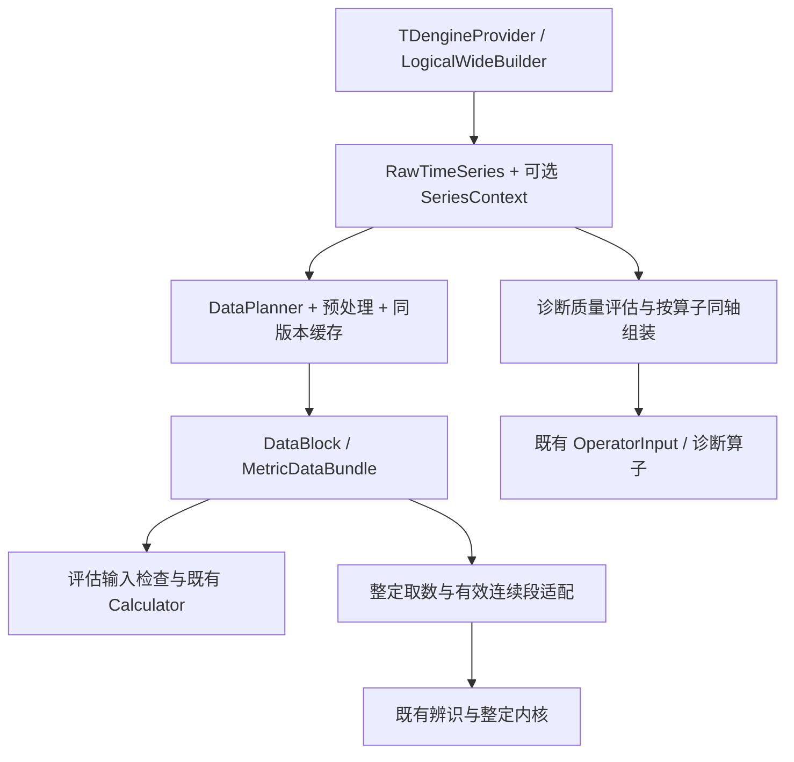

# 算法与数据接口核查及兼容改进方案

日期：2026-09-06。代码核查基线：`9ee40210e133288830ac8a3ee25103ee6be8bb8d`。  
状态：实施前接口接缝核查；已做源码追踪和内存探针，未实施修复，未做新布局真实数据库验收。  
适用分支：`codex/tag-timeseries-refactor`。本次核查期间 zcode 已开始创建重构测试与隔离环境文件，本文不覆盖其工作。

## 1. 结论与对原方案的修正

**公共取数签名、算法数学公式和外部 REST/WS 接口可以保持；内部数据契约需要兼容扩展，三条计算链路的输入组装、有效性与缓存接缝必须同步适配。仅替换 Provider 不足以完成重构。**

本补充承接 [测点子表设计](/Users/zhangping/DEV/CLPM-MVP-worktrees/tag-timeseries-refactor/docs/设计文档/2026-09-06-tag-timeseries-logical-wide-refactor.md)、[整改计划](/Users/zhangping/DEV/CLPM-MVP-worktrees/tag-timeseries-refactor/docs/过程文档/2026-09-06-tag-timeseries-refactor-plan.md) 和 [阶段交接](/Users/zhangping/DEV/CLPM-MVP-worktrees/tag-timeseries-refactor/docs/过程文档/2026-09-06-tag-timeseries-refactor-handoff.md)。若存在以下冲突，以本次核查补充为准：

1. “保持算法”指保持公式、阈值、评分、辨识/整定内核与融合规则；允许修正其前面的取数、同轴组装、有效性投影及采样准入，不能把这些接缝也绝对冻结。
2. RawTimeSeries、DataBlock 保持已有字段和调用方式；允许新增带默认值的可选上下文，并同步派生、缓存序列化与血缘。不能要求每个算法自己查源时间、覆盖记录或点子表。
3. SP 的同轴线性插值在无缺口时可以是恒等操作；MODE 的现有重采样即使同轴仍会填掉未知值。新逻辑宽表路径应直接消费已对齐信号和掩码。
4. 全部信号行数相等、时间轴为 1s，不代表全部有效或可用于动态辨识。显式 gap、质量异常、改绑/单位变化边界必须一直保留到算法输入检查。

这些是原 P0～P4 的接缝补充，不重新启动已完成的环境准备，不另建一套算法引擎。

## 2. 实际调用链与接口变化边界

诊断主链并不通过 DataPlanner，而是直接获取 RawTimeSeries；不能只验证评估/整定的 DataBlock 就宣布三链路完成。

| 接口 / 对象 | 结论 | 同步改进范围 |
|---|---|---|
| get_provider / make_query_fn / query_fn(loop_id, tag_roles, start, end, interval_s) | 保持签名与同步/异步形态 | Provider 返回规范逻辑宽表；新增能力在内部实现，不让消费者认识物理表 |
| query_trend_data 与 REST/WS DTO | 保持 | 原值/质量展示与算法预处理区分；展示降采样不进入算法 |
| RawTimeSeries | 保持已有三字段，可选扩展 | 增加默认 None 的 series_context，或等价显式内部载体；point 路径必须提供完整上下文 |
| DataBlock / MetricDataBundle | 保持现有字段与包装关系 | DataBlock 透传可选上下文；Bundle 继续引用它，不另复制整份七角色数据 |
| DataPlanner.request_bundles | 保持调用签名 | 在 L1/L2 命中前解析数据版本，预处理/派生/缓存携带上下文；保留查询合并与 BASE/HF 复用 |
| Calculator.calculate(bundle) | 保持 | 调用前按现有角色需求校验掩码与时间连续性；公式不接收新数据库参数 |
| OperatorInput / 诊断算子函数 | 保持必填字段和函数签名 | 编排器按 required_signals 同轴构造；现有 meta 字典可携带版本/覆盖/分段引用 |
| 整定外部 API 与 identify_from_history(op,pv,sp,mode,ts,...) | 保持 | 内部取数返回值可附加掩码/段/上下文，由服务桥接选出合法输入再调用原内核 |
| evaluate_gate(point_count, expected_points, valid_rate, confidence_level) | 优先保持 | 统一四个实参的含义；point 路径不得再传占位网格行数或删点后估计的频率 |
| DataLineage / 结果证据 | 保持已有字段，兼容增加可选引用 | 记录 dataset_ref/数据策略版本，序列化旧值有默认；不把算法版本号当成数据版本 |

依据：[Provider 契约](/Users/zhangping/DEV/CLPM-MVP-worktrees/tag-timeseries-refactor/backend/app/services/data_source/base.py:17)、[数据类型](/Users/zhangping/DEV/CLPM-MVP-worktrees/tag-timeseries-refactor/backend/app/contracts/data_types.py:115)、[OperatorInput](/Users/zhangping/DEV/CLPM-MVP-worktrees/tag-timeseries-refactor/backend/app/services/diagnosis_operators/base.py:58)。

## 3. 检查发现：必须处理的七个接缝

严重度针对接入新逻辑宽表后的正确性风险，不宣称已发生线上事故。下列引用均为上述代码基线。

### I01 [P1] 整定取数丢失逐点有效性

证据：[tuning.py:392](/Users/zhangping/DEV/CLPM-MVP-worktrees/tag-timeseries-refactor/backend/app/services/tuning.py:392) 直接 `pv = list(pvop_signals.get("pv", []))`；[401](/Users/zhangping/DEV/CLPM-MVP-worktrees/tag-timeseries-refactor/backend/app/services/tuning.py:401) 只计算一个 valid_rate；[698](/Users/zhangping/DEV/CLPM-MVP-worktrees/tag-timeseries-refactor/backend/app/services/tuning.py:698) 把原数值数组传入辨识。

触发：来源数值有限，但质量为 Bad/Uncertain 或异常检测已标 valid=False。新点表保存正确质量，预处理也标对了，辨识仍收到无效数值。派生 PVOP_HF 仅保留 PV/OP validity，重新算比例也可能失去 BASE 的 SP/MODE 和全窗覆盖口径。

改进：整定桥接消费逐角色 validity 和覆盖/分段上下文，使用同一个索引范围提取 PV/OP/SP/MODE/时间；全窗有效率与选中片段有效率分开记录，不以选段后的 100% 代替原窗口可信度。保留内核函数签名。

置信度：10/10。内存探针确认 valid=False 的索引 3/4/5 仍转发数值 [3,4,5]，返回仅有 valid_rate=0.7，没有逐点掩码。

### I02 [P1] 新逻辑宽表会再次被补值，真实 gap 可能消失

证据：[tuning.py:612](/Users/zhangping/DEV/CLPM-MVP-worktrees/tag-timeseries-refactor/backend/app/services/tuning.py:612) 以 `finite_mask` 过滤 MODE，再保持；[618](/Users/zhangping/DEV/CLPM-MVP-worktrees/tag-timeseries-refactor/backend/app/services/tuning.py:618) 全缺失返回 `[0] * len(dst_timestamps)`；[辨识清洗:149](/Users/zhangping/DEV/CLPM-MVP-worktrees/tag-timeseries-refactor/backend/app/services/tuning_identification/pipeline.py:149) 对短 NaN 缺口线性插值。

触发：builder 已在同轴网格明确表示无状态、断线或质量未知，后续重采样/通用清洗却无法区分这些原因。正常 COV 保持与实际丢数插值被混为一谈。

改进：point 路径同轴直接取值，MODE 未知保持未知，不能变成 0；硬缺口/坏质量先在取数桥接切断有效片段。保留旧清洗函数及旧调用默认行为，新路径不把硬缺口交给它补平。SP 可选/必需按原模型入口契约处理，不强制七角色全齐。

置信度：10/10。相同网格 MODE `[1,NaN,2]` 得到 `[1,1,2]`；全 NaN 得到 `[0,0,0]`；连续三点 NaN 被清洗为有限值，清洗统计 valid_rate=1.0。这是现有显式清洗策略与新覆盖语义的冲突，不能仅改测试断言消除。

### I03 [P1] 诊断独立删点、角色错轴和采样周期重估

证据：[diagnosis_orchestrator.py:625](/Users/zhangping/DEV/CLPM-MVP-worktrees/tag-timeseries-refactor/backend/app/services/diagnosis_orchestrator.py:625) 跳过 Bad PV；[204](/Users/zhangping/DEV/CLPM-MVP-worktrees/tag-timeseries-refactor/backend/app/services/diagnosis_orchestrator.py:204) 继续剔除异常行；[667](/Users/zhangping/DEV/CLPM-MVP-worktrees/tag-timeseries-refactor/backend/app/services/diagnosis_orchestrator.py:667) 以过滤后中位间隔推 expected_points；[691](/Users/zhangping/DEV/CLPM-MVP-worktrees/tag-timeseries-refactor/backend/app/services/diagnosis_orchestrator.py:691) 分别用 `if d.get("pv/sp/op") is not None` 构造各列。部分算子再用 [min(len(pv),len(sp))](/Users/zhangping/DEV/CLPM-MVP-worktrees/tag-timeseries-refactor/backend/app/services/diagnosis_operators/tuning.py:97) 截齐，不能恢复时间对应关系。

触发：PV 有值而 SP/OP 某一秒未知，或 PV/OP 质量不一致；删点后的序列仍被当作固定采样信号。新 Provider 提供同轴数据，也会被编排器破坏。

改进：原始完整网格、逐角色状态和全窗门禁统计保留；为每个算子按其 required_signals 生成同一轴/同一掩码的输入。质量码算子继续使用完整质量轴；动态算子不得跨 gap 拼接。采样周期来自已验证网格上下文，禁止从删点后的轴猜测。输入处理失败不得按“未剔除继续”进入 point 动态计算。

置信度：10/10。执行原组装语句，三行 PV=[100,101,102]、中间 SP/OP=None，得到 SP=[10,12]、OP=[20,22]，主时间轴仍为 [0,1,2]。

### I04 [P1] 部分动态指标把非连续有效样本压成连续序列

证据：[MetricCalculatorBase:86](/Users/zhangping/DEV/CLPM-MVP-worktrees/tag-timeseries-refactor/backend/app/services/metric_calculator/base.py:86) 按 masked_indices 提取数组；[time_constant.py:63](/Users/zhangping/DEV/CLPM-MVP-worktrees/tag-timeseries-refactor/backend/app/services/metric_calculator/time_constant.py:63) 获取掩码配对，随后 [86](/Users/zhangping/DEV/CLPM-MVP-worktrees/tag-timeseries-refactor/backend/app/services/metric_calculator/time_constant.py:86) 读取统一采样周期、[111](/Users/zhangping/DEV/CLPM-MVP-worktrees/tag-timeseries-refactor/backend/app/services/metric_calculator/time_constant.py:111) 调用相关分析，未在此入口核验掩码索引是否连续。

触发：原网格为 1s，mask 保留 [0,1,60,61]。数值压缩后仍传 ts=1s，相隔 59 秒的样本被当作相邻一步；tau、延迟或频率可能失真。不是所有指标都有此问题，必须逐项登记，不能一律更改均值/统计逻辑。

改进：在公共输入检查/调用编排处区分支持缺口的统计计算与需要连续等间隔输入的动态计算；已有分段支持的沿用原支持。不具备分段语义的动态指标先返回既有 INCONCLUSIVE/skip 原因，不擅自拼接、截取最长段代表整窗或平均多个模型。其数学内核不变。

置信度：9/10，源码路径确认；未在本次用真实回路运行全部动态算法。

### I05 [P1] 网格补齐后，缺失统计和门禁不能继续按行数推断

证据：[quality_summary.py:76](/Users/zhangping/DEV/CLPM-MVP-worktrees/tag-timeseries-refactor/backend/app/services/preprocessing/quality_summary.py:76) 为 `missing_count = max(0, expected_count - total)`；[kpi_calc.py:1330](/Users/zhangping/DEV/CLPM-MVP-worktrees/tag-timeseries-refactor/backend/app/tasks/kpi_calc.py:1330) 从控制类型名义间隔估算应有点数；[1358](/Users/zhangping/DEV/CLPM-MVP-worktrees/tag-timeseries-refactor/backend/app/tasks/kpi_calc.py:1358) 向 gate 传 BASE 行数；[gate.py:49](/Users/zhangping/DEV/CLPM-MVP-worktrees/tag-timeseries-refactor/backend/app/services/diagnosis_operators/gate.py:49) 用该点数同时计算 gap_ratio。

触发：1s 轴完整但其中 30% 是未知占位。missing_count 和基于行数的 gap_ratio 会变成 0。现有 validity 仍能降低有效率，因此不能概括为“整个可信度一定被洗白”；具体错误是缺失及采样准入的输入语义不再成立。

改进：使用 §4.2 的格点数、覆盖和有效槽口径；沿用原评级/门禁阈值。point 路径的缺失不能用“没有行”代替；legacy 路径不因本任务直接重算旧历史。

置信度：10/10。10 行规则网格包含 3 行未知，现有质量摘要输出 missing_count=0、missing_rate=0、valid_rate=0.7。

### I06 [P1] 缓存与已落盘 KPI 不会因 Provider 内部换表自动隔离

证据：[DataPlanner:280](/Users/zhangping/DEV/CLPM-MVP-worktrees/tag-timeseries-refactor/backend/app/services/data_planner.py:280) 构造 L2 key 并在 [298](/Users/zhangping/DEV/CLPM-MVP-worktrees/tag-timeseries-refactor/backend/app/services/data_planner.py:298) 直接返回缓存，早于 Provider；[L1 序列化:386](/Users/zhangping/DEV/CLPM-MVP-worktrees/tag-timeseries-refactor/backend/app/services/cache/l1_datablock.py:386) 和 [L2 序列化:296](/Users/zhangping/DEV/CLPM-MVP-worktrees/tag-timeseries-refactor/backend/app/services/cache/l2_bundle.py:296) 手工列字段；[诊断 KPI 上下文:259](/Users/zhangping/DEV/CLPM-MVP-worktrees/tag-timeseries-refactor/backend/app/services/diagnosis_orchestrator.py:259) 按时间窗与 SUCCESS 汇总旧 KPI，未校验同一数据版本。

触发：新旧布局切换、导入更正、改绑、覆盖修复或数据策略更新。仅在 Provider 内设置新缓存 key，无法阻止更上层提前返回；只修改 dataclass 也会在缓存反序列化时丢上下文。

改进：在缓存查询前解析 request-scoped 的数据版本，接入 L1/L2 和实际结果缓存；所有手工序列化、BASE 派生、Bundle lineage 一起补齐。已持久 KPI 是结果，不能仅 DEL Redis 后视为更新；诊断复用前检查其版本兼容性，不兼容时走既有“无可用 KPI 上下文”路径或标待重算，禁止混算均值或自动全库重算。

同时确认一个现存字段丢失：L1/L2 的上述手工序列化与反序列化均未保留 DataBlock.control_type，而计算器用该字段选择响应类别参数。内存往返实测两层均为 FAST→None。整改必须一并保留这个已有字段，不能只给新上下文增加序列化；这不涉及更改参数值或公式。

置信度：缓存字段丢失 10/10；布局/结果版本风险 9/10。切换竞态和持久结果版本实验交实施阶段完成。

### I07 [P1] 历史绑定正确，仍可能使用当前量程/单位解释旧值

证据：[DataPlanner:952](/Users/zhangping/DEV/CLPM-MVP-worktrees/tag-timeseries-refactor/backend/app/services/data_planner.py:952) 加载当前 LoopTagMapping/TagRegistry 量程；[Pipeline:357](/Users/zhangping/DEV/CLPM-MVP-worktrees/tag-timeseries-refactor/backend/app/services/preprocessing/pipeline.py:357) 按单一 range 归一化；[诊断:579](/Users/zhangping/DEV/CLPM-MVP-worktrees/tag-timeseries-refactor/backend/app/services/diagnosis_orchestrator.py:579) 同样加载当前绑定/量程。

触发：历史窗口跨改绑、量程/单位或 MODE 编码映射变化。点级读取取对了旧 PV=50，但若旧量程 0～100、当前量程 0～200，归一化会从 50% 变成 25%。回路/装置元数据正确不等于历史解释正确。

改进：上下文同时保存角色绑定和数值解释所需配置依据；读取一致配置段后再使用原归一化公式。无法证明跨段兼容时明确分段/拒绝相应动态输入，不用当前元数据补造旧事实。算法阈值采用任务选择的配置快照记录，不能未经决策把阈值策略也改成历史回溯。

置信度：9/10；风险取决于现场是否改过绑定/量程/单位，源码确认当前只有单份配置口径。

## 4. 最小兼容改进设计

### 4.1 一个显式上下文，集中传递

建议定义内部 SeriesContext（名称可微调），在 RawTimeSeries/DataBlock 中以默认 None 的可选字段传递。不要把新接口拆成每算法一套，也不要塞进进程全局字典或共享 Provider 可变属性。

| 内容 | 最少信息与用处 |
|---|---|
| 语义版本 | schema/policy/layout 版本、legacy/point/mixed；旧调用默认 legacy，不能仅看到 1s 轴就猜为 point |
| 数据身份 | dataset_ref 与布局、绑定、解释配置、数据/覆盖 revision；支撑缓存、在途校验和结果复算 |
| 网格 | 原查询窗口、UTC 起止边界、grid_period_s=1、expected_slots；不是源端变化间隔或名义 BASE 间隔 |
| 覆盖与状态原因 | 按角色的已知覆盖、硬缺口、无初值/冲突等区间；区分 OBSERVED/HELD/UNKNOWN，Bad/Uncertain 原因可追溯 |
| 分段边界 | 改绑、单位/量程变化及不能证明可连续的布局边界；边界不等于坏质量，不能靠伪造一个坏点表示 |
| 配置依据 | 当前计算采用的配置快照、解释历史点值所需的角色配置引用；未知过去有明确状态 |

逐角色原质量仍由现有 quality_codes 传入；逐点可计算性仍由现有 validity 表示。上下文主要保留这两者无法表达的来源、覆盖原因和分段边界。长窗采用区间/游程编码及引用，禁止每个派生组复制七套逐秒源时间/来源字符串。

point 数据必须有上下文，缺失即拒绝作为 point 计算；默认 None 只维持旧路径、旧测试和旧数据的兼容。要同步 L1/L2 编解码、DataPlanner._derive_from_base、Bundle/Lineage 与诊断证据；缓存缺少新语义版本时，point 路径判未命中。

数据版本在缓存命中前解析。内部可增加带默认值的 resolver/factory 注入，不改变现有 QueryFn 五参数签名。一次请求固定一份上下文，写入发布版本变化时有界重试或返回未确定状态；不能从共享可变闭包取得另一回路的版本。

同步校正 P0 契约测试的冻结范围：断言既有必需字段/签名、旧构造方式和旧消费者仍兼容，同时验证新增可选字段的完整往返；不能用“字段集合必须永远与旧版完全相等”阻止本补充，也不能取消契约检查或整体重录算法 golden 来掩盖差异。

### 4.2 网格、覆盖、有效性分别统计

对 point 规则网格：N 为满足 start≤t≤end 的 UTC 整秒数量；各角色 known/valid 来自覆盖依据、质量和既有异常检查。统一如下口径：

- 物理事件数只用于采集/写入观测，不用于算法完整性。
- source coverage 是已知覆盖槽数/N；正常 COV 保持计入覆盖，断线/无初值/冲突不计。
- loop_valid_rate 仍按既有核心角色和缺失角色政策求交集，但分母固定 N，不能在删点/选段后缩小分母。
- valid 掩码已经排除未知时，不再乘一次相同的缺口覆盖率，避免 0.7 被重复降为 0.49。legacy 保留其已有 R14 口径，point 使用明确上下文分支。
- 缺失摘要从 coverage 的未知槽读取，不能依赖行数差。QualitySummary.bad_count 当前表示全部无效而非纯 Bad；保留其含义，缺失可为其子集，不能把 bad_count+missing_count 当作互斥总数。原始 Bad、Uncertain 与未知原因在上下文分别统计。
- gate 的 point_count 统一投影为其既有“可用有效样本”含义，expected_points=N；不能传 N 个占位行。原 gate 的 gapRatio 按此定义代表不可用样本比例，不能冒称纯传输丢包率。纯来源覆盖另记，MIN_DATA_POINTS/MAX_GAP_RATIO 和评级阈值不改。
- sampling_freq 继续使用旧标签，例如 "1s"；辨识 ts=1.0 秒。point 单点窗口也由上下文保留 1s，不回落 TC 的名义 5s；最低样本量等算法限制原样保留。

不得因补充质量信息而全局要求七角色全部 Good：每个计算仍使用其既有 required_tags/required_signals；未配置的可选角色与已配置却暂时未知必须区分。

### 4.3 三条链路分别适配，数学内核共用

**评估**：保留 DataPlanner 合并查询与 BASE/HF 派生。公共输入检查先看角色依赖、共同 mask、网格与连续段；统计指标按原 mask 算法执行。已有分段支持的动态指标沿用；缺少分段支持的动态指标遇硬断点返回现有 INCONCLUSIVE，不悄悄把最长段结果代表整个窗口。禁止全局修改 _get_masked_values 的含义而影响所有统计指标。

**诊断**：保留 OperatorInput 与各算子函数。编排器按 OperatorMeta.required_signals 构造输入，不再分别删各列；同一算子的 signals/timestamps 共同切片。质量码算子消费完整质量轴；其他算子按其有效性要求消费。对于尚不支持 gap 的动态算子，point 路径明确 skip 并保留证据，不能以 min(len(...)) 截齐。原融合/分类规则接收原有跳过状态，不改阈值或虚构正常结果。

**整定**：point 路径不再二次 SP/MODE 重采样。内部适配保留全窗数据质量，再按硬边界和所需角色有效性选取实际连续片段；如沿用已有最长有效段规则，必须同步切 PV/OP/SP/MODE/时间及证据，不拼接两段，不把所选段的满覆盖写成全窗满覆盖。不足则返回已有数据不足结果。原辨识内核收到同轴、等间隔、合法数值，旧 NaN 清洗函数保留以兼容其原有调用。

原始工程单位、PV/SP/OP 归一化、MODE 离散编码、参数单位都需边界测试：不能让已归一化值再被归一化，不能把 ms 当 s，不能把未知 MODE 当合法手动状态。

### 4.4 历史解释和结果版本

在绑定历史/配置变更职责中增加解释配置依据，复用原计划元数据，不单独建立另一套配置中心。同一配置段继续构造现有 LoopPreprocessConfig；跨配置段是否可组合必须由单位、量程、点身份与算法要求验证，不能只按数组长度拼接。

DataLineage 兼容新增 dataset_ref 或在现有证据 JSON 内保留等价引用；数据策略版本与算法版本分开。若实现实际存放位置无需新增 PG 列，就不为形式增加迁移；确需模型字段则 ORM/迁移同批。

读诊断的 KPI 上下文前核对数据/配置/策略是否兼容。旧已存结果保留为历史事实；不兼容新 point 输入时不混入当前均值，不自动批量重算整个历史。

## 5. 插入原计划的实施任务与文件边界

| 任务 | 接入原阶段 / Owner | 必做内容与完成证据 |
|---|---|---|
| AD01 | P0 契约补充、P1/P3；A+C | 固定 SeriesContext、版本与网格/覆盖语义；旧函数签名快照仍通过，point 缺上下文不可计算 |
| AD02 | P3；C | Raw→Pipeline→DataBlock→BASE 派生→Bundle 与 L1/L2 全路径透传；冷/热缓存数据及语义相同 |
| AD03 | P3；C 与评估接缝 Owner | 统一缺失/有效率/gate 实参；动态指标输入检查，固定连续/缺口反例，不改公式 |
| AD04 | P3；诊断接缝 Owner | 改 diagnosis_orchestrator 的数据组装与门禁输入；逐算子同轴，质量算子全轴，失败/跳过可解释 |
| AD05 | P3；整定接缝 Owner | 改 tuning.py 内部取数、point 同轴直通及有效连续段选择；原 identify_from_history 签名和数理内核保持 |
| AD06 | P1/P3；A+C | 历史量程/单位/模式映射依据与配置版本；跨绑定/解释边界不能无依据归一化 |
| AD07 | P3/P4；C+D | 请求前缓存版本、结果血缘与诊断 KPI 版本兼容；导入/迟到/改绑后的在途读与冷/热缓存实测 |
| AD08 | P4；D | 完成 §6 验收并回归评估/诊断/整定入口；提交旧契约、point 新契约和纠偏差异三类证据 |

允许的集中接缝改动：contracts/data_types.py、data_planner.py、metric_data_bundle.py、cache/l1_datablock.py 与 l2_bundle.py、预处理的上下文/质量汇总传递、kpi_calc.py 的取数和调用检查、diagnosis_orchestrator.py 的输入/门禁/KPI 上下文、tuning.py 的内部取数/输入桥接，以及本轮新 builder/context 模块。路径以本 worktree 的 backend/app 为根。

继续保护：各 metric_calculator 的数学实现、diagnosis_operators 的检测/融合/分类数学、tuning_identification 的 ARX/ARMAX/IV 等内核、tuning_algorithms 的整定公式、阈值/权重和前端契约。确需触及受保护文件，只允许可解释的输入检查调用接缝并逐行申报；需要改公式时转为独立问题，不能混入本轮。

原计划已将 diagnosis_orchestrator.py 列为受保护文件，本文明确允许上表中的输入接缝范围；这是基于实际源码发现的必要修正，不授权改诊断规则或重新注册已退役引擎。

## 6. 必须新增或扩展的验收

| 用例 | 必须得到的结果 |
|---|---|
| 密集参考→COV→逻辑宽表→三条真实入口 | 无 gap、质量正确、配置一致时，输入/掩码/采样与算法输出等价；不能只比 Provider 输出 |
| 有限 PV/OP，局部 quality=Bad/Uncertain | 原数值可审计，模型不把这些点当有效输入；全窗可信度不被选段后的比例覆盖 |
| MODE 同轴缺口、全未知、首点前未知 | 未知不被保持/外推成 0 或合法模式；现有 legacy helper 的旧测试按原行为保留 |
| 连续三秒已知断线 / 同长度普通旧 NaN 样本 | point 硬缺口不进通用插值；旧清洗策略仍有独立测试，不用改其预期冒充新覆盖测试 |
| PV 全有、SP/OP 单独缺失 | 同算子的输入列与时间戳严格同轴；不得各自 compact 或 min 截齐 |
| mask 索引 [0,1,60,61]，grid=1s | 动态算子不把第 1 秒与第 60 秒当相邻一步；已支持分段者按原规则，否则 INCONCLUSIVE/skip |
| 10 槽、7 有效、3 未知；有源 Bad 的独立对照 | 未知统计为 3；有效率 0.7、不二次乘成 0.49；物理事件少不误判缺失，Bad 与来源未知原因可区分 |
| point 单点/空窗、非整秒边界、TC/LC 的名义采样不同 | grid 周期与期望格点数明确，不放宽算法最少点数，不把 ms/Hz/s 混用 |
| L1/L2 冷热往返、BASE 派生、导入并发 | 上下文/validity/control_type/配置/段与结果一致，FAST/SLOW 等参数选择不丢；新布局不能命中旧无上下文缓存 |
| 旧 KPI 快照与新 point 数据同窗 | 不兼容版本不混用于诊断上下文；原结果保留，不自动全量重算 |
| 历史改绑、量程 0～100→0～200、单位/模式编码变化 | 不用当前配置误解旧数据；不跨边界拼出虚假动态 |
| 原静态统计与 CONFIG 指标 | 无关元数据缺失不连带使全部指标拒绝；角色依赖与既有公式、阈值保持 |

优先扩展现有 [整定取数接缝测试](/Users/zhangping/DEV/CLPM-MVP-worktrees/tag-timeseries-refactor/backend/tests/test_tuning_history_seam.py)、[NaN 清洗测试](/Users/zhangping/DEV/CLPM-MVP-worktrees/tag-timeseries-refactor/backend/tests/test_tuning_nan_cleaning.py)、[诊断编排测试](/Users/zhangping/DEV/CLPM-MVP-worktrees/tag-timeseries-refactor/backend/tests/test_diagnosis_orchestrator.py)、[稀疏准入测试](/Users/zhangping/DEV/CLPM-MVP-worktrees/tag-timeseries-refactor/backend/tests/test_kpi_r14_sparse_admission.py) 和 DataPlanner/缓存/预处理测试目录。现有测试中“MODE 全 NaN 填 0”“短 NaN 插值”验证的是 legacy helper 行为，不是 point 数据契约；新路径需专门覆盖两者区别。

本次验证边界：读取基线源码，使用主项目现有 Python/NumPy，在关闭 pyc 写入的独立进程中直接调用纯函数，或从源码 AST 提取原函数/组装语句，注入内存 planner/数据对象。没有复制算法公式作为预期，没有连接或写入业务数据库、Redis、AAS，没有运行服务。探针证明上述局部行为，不代表重构后完整链路已经通过。

## 7. 给 zcode 的补充提示词

### 1. 必读清单

在当前重构 worktree 先读 AGENTS.md、stale-docs、本补充全文、原设计/计划和已完成阶段记录。本补充只修正原方案的接口接缝范围，不重做已完成的隔离环境和基线准备。

### 2. 阶段范围

继续原 P0～P4，按 §5 将 AD01～AD08 接入对应阶段：公共 Provider/算法/REST 签名保持；兼容新增数据上下文；同步修正 DataPlanner/缓存、评估输入检查、诊断同轴组装、整定有效性与连续片段桥接。保留算法公式、阈值和评分规则。

### 3. 执行纪律

point 逻辑宽表不再被无条件重采样；质量、覆盖和硬边界一直保留到算法入口。未知不得填成正常，非连续样本不得拼成 1s。旧历史与旧调用保持明确 legacy 兼容。按原文件 Owner 串行修改共享文件，测试失败修实现，不放宽断言。提交/推送依用户实际授权；不自行合 main 或部署。

### 4. 完成度核验问题

逐项回答原阶段工作流的五项核验：本阶段验收证据、适用门禁、越界检查、状态记录、阻断 bug。另逐项提供 §6 用例的实际结果，给出受保护文件 diff、公共接口签名对照和三链路冷/热缓存等价证据。环境未验明确登记，不写已完成。

### 5. 人工决策点

普通数据适配按方案自主完成；若必须更改算法公式、阈值、外部 API 或历史计算的业务口径，先提供具体差异交主审/用户判断。完成后交 Codex 检查最终版本并按已有授权合并，实施者不自行合并。

## 8. 审查结论

架构边界：保持一套本地数据源和既有算法内核；必要变化集中在兼容上下文与输入接缝。代码质量：避免再写各算法专属查询与补值实现。测试：局部问题已复现，新增 point 端到端契约仍待实施验证。性能：保留查询合并，上下文按区间/引用保存，L1/L2 必须同版本且避免逐组复制原始证据。

结论：原重构方案需吸收本补充后继续实施。上述输入与数据语义问题未闭环前，不应以“算法未改、接口没改”作为验收通过依据。
